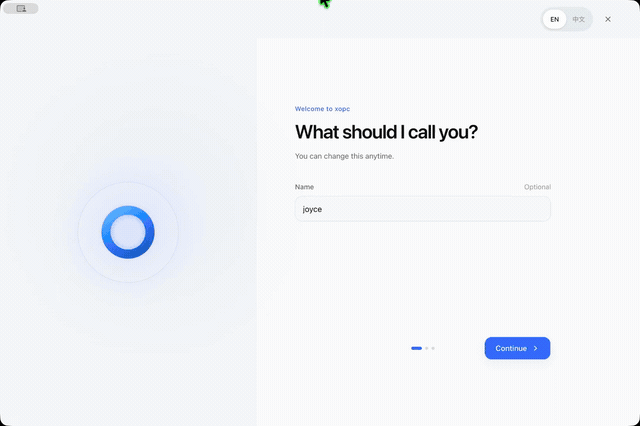

<p align="center">
  <a href="README.md">English</a> | <a href="README.zh-CN.md">简体中文</a>
</p>

<h1 align="center"><a href="https://xopc.ai">xopc</a></h1>

<p align="center">
  <strong>Keep what matters moving.</strong><br />
  Open-source, local-first personal AI that remembers your context and helps you move work forward.<br />
  Chat with Ada, delegate a task, or work directly with files and projects.<br />
  Review the result and keep refining it.
</p>

<p align="center">
  <a href="https://www.npmjs.com/package/@xopcai/xopc"></a>
  
  <a href="https://github.com/xopcai/xopc/stargazers"></a>
</p>

<p align="center">
  <a href="https://xopc.ai/en#download"><strong>Download the desktop app →</strong></a> ·
  <a href="https://xopcai.github.io/xopc/">Read the docs</a> ·
  <a href="https://xopc.ai/en/learn">Watch demos and tutorials</a>
</p>

<p align="center">
  <a href="https://xopcai.github.io/xopc/xopc-desktop.mp4">
    
  </a>
</p>

## Two ways to start in one xopc

**Talk with Ada.** Ada is the personal Agent inside xopc; no separate installation is needed. Share your background, response preferences, and a goal. Delegate a task when you need a hand, keep talking, then return to the result. [Meet Ada](https://xopcai.github.io/xopc/personal-ai).

**Open your workspace.** Bring files and a goal to organize material, analyze data, change code, or prepare a report. Keep conversations, deliverables, and project context together so you can continue later. [Workspace guide](https://xopcai.github.io/xopc/workspace-guide).

Built for independent workers, creators, developers, and anyone who wants less repeated explanation and execution overhead.

## Finish something real

| Your goal | Try this | Check the result |
| --- | --- | --- |
| Resume a project | “Use this project's notes and tasks to explain what is blocked and suggest the next step.” | Sources, unresolved decisions, and next action |
| Turn material into a report | “Combine these sales files into a summary. Keep sources, calculations, and exceptions.” | Saved file, totals, and exceptions |
| Delegate and keep talking | “Turn this week's plan into a one-page file and tell me when it is ready. Let's keep discussing next week.” | Task card, actual file, and revisions |

File work requires the relevant access, tools, or skills. Voice, image generation, browser access, and external services need their own setup. [Delegate and receive results](https://xopcai.github.io/xopc/task-delegation) · [Practical tutorials](https://xopc.ai/en/learn) (videos and detailed walkthroughs are currently in Chinese).

## Core capabilities

| Capability | What it helps you do |
| --- | --- |
| **Context and memory** | Keep conversations, project background, and understanding you can review, correct, or delete |
| **Delegation and delivery** | Delegate tasks, answer follow-up questions, receive artifacts, and check acceptance criteria |
| **Files and projects** | Work with authorized material and retain files, notes, execution records, and next actions |
| **Follow-ups** | Follow a topic, repeat a process with Workflows, or trigger work with Automations |
| **Tools and connections** | Enable skills, MCP, connectors, browser automations, images, and voice as needed |
| **Access across devices** | Desktop, web, terminal, mobile, Telegram, WeChat, and Feishu/Lark |

[Computer Use](https://xopcai.github.io/xopc/computer-use) is currently a macOS desktop preview requiring a compatible GUI model and native permissions. Mobile capabilities vary by platform and version; the Agent runs on the connected computer.

<a id="desktop-app"></a>
<a id="get-started"></a>
<a id="quick-start"></a>

## Get started

### Desktop app

1. [Download xopc](https://xopc.ai/en#download) for macOS, Windows, or Linux.
2. Connect XOPC Cloud, your own provider API key, or a local model service.
3. Open the personal Agent or Chat. Try a small request, then bring in real material.

[Desktop installation](https://xopcai.github.io/xopc/desktop-app) · [Model setup](https://xopcai.github.io/xopc/how-to/configure-first-model).

### Terminal installation

macOS, Linux, WSL:

```bash
curl -fsSL https://xopc.ai/install.sh | bash
xopc onboard --quick
xopc
```

Windows PowerShell:

```powershell
irm https://xopc.ai/install.ps1 | iex
xopc onboard --quick
xopc
```

With Node.js **22.22.3+** already installed, use `pnpm add -g @xopcai/xopc`. The [terminal quick start](https://xopcai.github.io/xopc/first-5-minutes) includes mirror and troubleshooting guidance.

### Continue on mobile

See [distribution channels and pairing](https://xopcai.github.io/xopc/mobile-app). Scan the code and approve the connection on your computer, then review progress and send instructions. Keep the computer awake and xopc running.

## Data and control

Core state lives under `~/.xopc/` on your machine by default. Use cloud or local models; cloud services process the request context, images, or audio sent to them. Connecting to XOPC Cloud does not automatically upload your entire local database or workspace.

Authorize sources, tools, and channels as needed. Execution confirmation depends on tool policy and the scope you authorize; browser control does not prompt for every click. Define boundaries and ask to review before sending, deleting, purchasing, or changing an account. [Privacy and memory](https://xopcai.github.io/xopc/user-understanding) · [Browser automations](https://xopcai.github.io/xopc/browser-automations).

## Find your guide

| You want to… | Read |
| --- | --- |
| Set up your personal assistant | [Meet Ada](https://xopcai.github.io/xopc/personal-ai) |
| Delegate and refine a result | [Task delivery](https://xopcai.github.io/xopc/task-delegation) |
| Work with files and projects | [Workspace](https://xopcai.github.io/xopc/workspace-guide) |
| Review results and retry | [Task acceptance](https://xopcai.github.io/xopc/task-review) |
| Save reusable website actions | [Browser recording and automations](https://xopcai.github.io/xopc/browser-automations) |
| Add services and capabilities | [Models](https://xopcai.github.io/xopc/models) · [Skills](https://xopcai.github.io/xopc/skills) · [MCP](https://xopcai.github.io/xopc/mcp) · [Connectors](https://xopcai.github.io/xopc/connectors/) |
| Configure and extend an instance | [Configuration](https://xopcai.github.io/xopc/configuration) · [Extensions](https://xopcai.github.io/xopc/extensions) · [XOPC Platform](https://xopcai.github.io/xopc/platform) |
| See recent changes | [What's new](https://xopcai.github.io/xopc/whats-new) · [GitHub Releases](https://github.com/xopcai/xopc/releases) |

## Community

Join the xopc community to ask questions, share what you are building, and help shape the project.

| Channel | Best for |
| --- | --- |
| [GitHub Discussions](https://github.com/xopcai/xopc/discussions) | Questions, ideas, and searchable technical discussions |
| [Discord](https://discord.gg/ZmK8FzZHG) | Real-time chat, showcases, and contributor coordination |
| [WeChat community](https://xopcai.github.io/xopc/community#wechat) | Chinese-language discussion, onboarding help, and release updates |
| [GitHub Issues](https://github.com/xopcai/xopc/issues) | Confirmed bugs and actionable feature requests |

Read the [community guide](https://xopcai.github.io/xopc/community) and [Code of Conduct](./CODE_OF_CONDUCT.md) before participating. Report security vulnerabilities through [GitHub Security Advisories](https://github.com/xopcai/xopc/security/advisories/new), not in a public community channel.

---

## FAQ

**Is xopc a hosted service?** — The xopc application runs on your machine, with configuration and state stored under **`~/.xopc/`** by default. It can remain standalone or connect explicitly to XOPC Cloud or a private enterprise platform; connecting does not move the local database automatically.

**Does local-first mean data never leaves my computer?** — Not necessarily. If you select a cloud model, conversation content and context relevant to the request are sent to that model provider. Use a local model and review source and tool permissions for work that must remain on-device.

**Does xopc remember everything about me automatically?** — No. User understanding can be reviewed, confirmed, corrected, and deleted, and an unconfirmed inference should not become an authoritative fact. Passwords, keys, and other highly sensitive information do not belong in the memory system.

**Do I need a paid cloud model?** — No. Bring your own keys, or use local models (Ollama, LM Studio, vLLM).

**What is the fastest way to try it?** — [Desktop app](#get-started) for GUI users, or `xopc onboard --quick && xopc` for terminal.

**How is this different from another chat UI?** — Chat is only one surface. xopc preserves understanding, long-term goals, projects, tasks, decisions, and run history so the same assistant can continue working across time and surfaces.

**Can I use it from my phone or messengers?** — Yes. Pair the [mobile app](https://xopcai.github.io/xopc/mobile-app) by QR code, or configure Telegram, WeChat, or Feishu/Lark via the gateway.

**Have a question?** — Ask on [GitHub Discussions](https://github.com/xopcai/xopc/discussions/categories/q-a).

---

## Security

xopc handles personal context and may be given execution tools, so capability boundaries matter as much as model choice:

- enable only the data sources, tools, and channels you currently need;
- before using a cloud model, understand what context may be sent to the provider;
- treat all inbound messenger content as **untrusted input** and prefer **pairing** or **allowlist** for DMs;
- keep gateway bind addresses, access tokens, and API keys private;
- preserve human confirmation for sending, deleting, purchasing, and other high-impact actions.

See [User understanding and privacy](./docs/user-understanding.md), [channel security](https://xopcai.github.io/xopc/channels), and the [configuration reference](https://xopcai.github.io/xopc/configuration).

---

## Contributing

```bash
pnpm install && pnpm run dev    # CLI via tsx
pnpm run dev:gateway            # dev gateway uses ~/.xopc-dev + info logs
pnpm run build && pnpm run test:all && pnpm run lint
```

**[AGENTS.md](./AGENTS.md)** · **[CONTRIBUTING.md](./CONTRIBUTING.md)**

**Issues:** [Bug report](https://github.com/xopcai/xopc/issues/new?template=bug_report.yml) · [Feature request](https://github.com/xopcai/xopc/issues/new?template=feature_request.yml) · [Q&A Discussions](https://github.com/xopcai/xopc/discussions/categories/q-a) · [Security advisory](https://github.com/xopcai/xopc/security/advisories/new) (not public issues)

**Tech stack:** TypeScript, Node.js ≥ 22.22.3, pnpm workspace. Built-in LLM layer via `@earendil-works/pi-ai`, React gateway console, Electron desktop.

## Credits

- LLM layer: [@earendil-works/pi-ai](https://github.com/earendil-works/pi-mono) · Agent runtime: [@earendil-works/pi-agent-core](https://github.com/earendil-works/pi-mono)
- User understanding: inspired by [OpenWiki](https://github.com/langchain-ai/openwiki)'s evidence-to-knowledge approach, reimplemented as a native XOPC capability with governed synthesis and per-turn context planning — see [User understanding](./docs/user-understanding.md)
- Inspired by [openclaw/openclaw](https://github.com/openclaw/openclaw) and [NousResearch/hermes-agent](https://github.com/NousResearch/hermes-agent)

---

<p align="center"><sub>Made with care by <a href="https://github.com/xopcai">xopcai</a> · <a href="https://xopc.ai">xopc.ai</a></sub></p>
