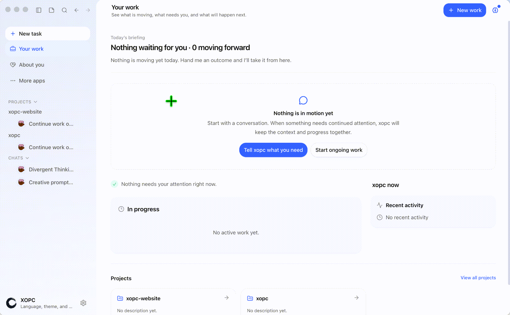

<p align="center">
  <a href="README.md">English</a> |
  <a href="README.zh-CN.md">简体中文</a>
</p>

<h1 align="center"><a href="https://xopc.ai">xopc</a></h1>

<p align="center">
  <strong>它住进你的电脑，然后慢慢开始懂你。</strong><br />
  xopc 是一个本地优先、逐渐理解你的私人 AI 助手。<br />
  它从你选择开放的数字生活中形成可检查、可纠正的理解，接住每个想法，并陪你把真正重要的事情做成。
</p>

<p align="center">
  <a href="https://xopc.ai"></a>
  <a href="https://www.npmjs.com/package/@xopcai/xopc"></a>
  
  
  
  <a href="https://github.com/xopcai/xopc/stargazers"></a>
</p>

<p align="center">
  <a href="https://xopc.ai"><strong>xopc.ai</strong></a> ·
  <a href="https://github.com/xopcai/xopc"><strong>GitHub</strong></a> ·
  <a href="https://xopcai.github.io/xopc/zh/">中文文档</a> ·
  <a href="#get-started">快速开始</a> ·
  <a href="https://github.com/xopcai/xopc/releases">Releases</a>
</p>

<p align="center">
  <a href="https://xopcai.github.io/xopc/zh/desktop-app">
    
  </a>
</p>

<details>
<summary><strong>目录</strong></summary>

- [xopc 是什么](#xopc-是什么)
- [从初见到信任](#从初见到信任)
- [它要学会的四件事](#它要学会的四件事)
- [信任如何建立](#信任如何建立)
- [现在能做什么](#现在能做什么)
- [第一阶段产品方向](#第一阶段产品方向)
- [快速开始](#快速开始)
- [在哪里聊](#在哪里聊)
- [内置频道](#内置频道)
- [扩展与技能](#扩展与技能)
- [配置示例](#配置示例)
- [文档](#文档)
- [常见问题](#常见问题)
- [安全](#安全)
- [参与贡献](#参与贡献)

</details>

---

## xopc 是什么

xopc 不是 AI 员工，也不是只在一次任务或一个代码仓库里工作的 Agent，更不只是一个生产力工具。它是一个长期住在你电脑里的**私人 AI 助手**：从零开始认识你，理解你真正关心的事，并在获得信任之后逐渐帮你推进它们。

它不会在安装完成的那一刻假装了解你。它对你的认识应该来自你明确授权的数据、你们共同经历的事情，以及你一次次确认或纠正的理解。

> **初见 → 探索 → 理解 → 协助 → 建立信任 → 逐渐主动**

聊天只是你们关系的一个入口。模型、Agent、Task、Project、记忆、工作流和自动化都是底层能力；产品真正要交付的，是“它比昨天更懂我，而且确实帮我推进了一件重要的事”。

## 从初见到信任

xopc 理想中的首次体验，不是展示一排工具开关，而是一次克制、透明的相识过程：

1. 它先介绍自己，然后问：**“我可以从哪里开始了解你？”**
2. 你逐项选择是否开放本地文件、邮件、日历或其他来源。
3. 探索过程保持可见：它正在看什么、发现了什么、准备记住什么，都能被看见。
4. 它把零散证据整理成对目标、关系、项目、承诺和阻塞的初步理解。
5. 你可以确认、纠正、删除，或者要求它忘记。
6. 它不试图处理所有东西，而是找到此刻最值得推进的一件事，陪你完成第一步。

真正的 **Aha Moment** 不是“它能访问 Gmail”，而是：

> “我大概开始认识你了。你现在最重要的可能不是处理所有未读邮件，而是推进这个拖了两周的项目。我们今晚先把第一步完成，好吗？”

## 它要学会的四件事

### 1. 理解一个人

xopc 形成的是一个持续更新、用户可查看和纠正的认知模型，而不是把一切永久塞进向量数据库：

- 你的目标、偏好和习惯；
- 对你重要的人和关系；
- 正在进行的项目；
- 过去的决定以及当时的原因；
- 还没有兑现的承诺；
- 最近的压力、阻塞和注意力方向。

它还必须判断什么值得记住、什么应该忘掉，以及什么可能已经过时。

### 2. 接住复杂而混乱的工作

你可以扔给它一段文字、一条语音、一张截图、一封邮件、一个文件、一个链接，甚至一句还没想清楚的话。整理不是使用它的前置条件，而是它与你共同完成的工作：

```text
突然出现的想法
→ 找到相关目标或项目
→ 补充背景
→ 形成下一步行动
→ 识别依赖和阻塞
→ 在合适的时候重新提起
→ 保留过程中的决定
→ 沉淀为以后可以复用的经验
```

### 3. 陪你解决问题

它需要理解“为什么做”，然后和你一起澄清问题、调查资料、读取上下文、制定方案、调用工具、验证结果，并记录发生过什么。复杂工作可以跨越多次对话、多个入口和很长一段时间，而不必每次重新解释。

### 4. 逐渐获得主动性

主动性不是更多通知，而是在正确的时机做正确程度的事：发现被遗忘的承诺、感知项目停滞、把新信息与已有目标联系起来，也知道什么时候不该打扰。

权限应该随信任逐级解锁：

```text
只观察
→ 主动提醒
→ 提出行动建议
→ 经确认后执行
→ 对明确授权的低风险事项自动执行
```

## 信任如何建立

“翻箱倒柜”可以很有感染力，也可能很可怕。xopc 必须让探索过程始终可见、可控：

- 每个数据源单独授权，随时可以撤销；
- 扫描时说明正在看什么，以及为什么需要看；
- 展示证据与推断之间的关系；
- 明确区分**亲眼看到的事实**和**根据事实作出的推测**；
- 允许用户确认、纠正、删除或禁止记忆；
- 数据默认留在本机；使用云端模型时，明确哪些上下文会被发送；
- 对外发送、删除、购买等高影响操作始终单独确认。

信任不是隐私政策里的一段文字，而是每一次克制积累出来的。

## 现在能做什么

xopc 已经提供构建这段关系所需的本地基础：

| 能力 | 当前基础 |
| --- | --- |
| **本地运行与所有权** | 桌面应用、自托管 gateway、本地状态、自有 API Key、云端与本地模型 |
| **持续理解** | 可查看、确认、纠正和删除的用户理解；按相关性选取上下文；过期与冲突复查 |
| **承接长期工作** | 持久会话、Task、Project、笔记、工作区、运行记录和可恢复的上下文 |
| **执行与跟进** | 工具、技能、工作流、定时/手动/webhook 自动化，以及可检查的执行记录 |
| **多种入口** | 桌面、网页、CLI、TUI、iOS/Android、Telegram、微信、飞书/Lark 和 API |

这些能力仍在持续收敛成一个完整的私人助手体验。当前版本的具体可用范围以 [Releases](https://github.com/xopcai/xopc/releases) 和[文档](https://xopcai.github.io/xopc/zh/)为准。

## 第一阶段产品方向

正在构建的第一阶段会刻意保持小而完整：

1. 以 macOS 本地应用作为主要体验；
2. 用一个通用入口接住文字、语音、文件和链接；
3. 优先理解三个来源：本地文件、Gmail 和 Calendar；
4. 让个人认知模型可查看、可追溯、可纠正；
5. 围绕 Project 和 Task 管理长期复杂工作；
6. 每天找出一件真正重要的事，陪用户向前推进；
7. 所有外部行动先获得确认。

第一阶段不以消息量或自动完成的任务数衡量成功。更重要的问题是：

> **使用七天后，有多少人认为：它比第一天更懂我，而且确实帮助我推进了一件重要的事？**

对于开发者，底层仍是一套可自托管、可扩展的个人 AI 运行时。了解 Task、状态、执行与触发如何形成可恢复、可检查的闭环：[持续工作模型](https://xopcai.github.io/xopc/zh/concepts/loops)。

---

<a id="desktop-app"></a>
<a id="get-started"></a>
<a id="quick-start"></a>

## 快速开始

### 最省心的开始方式：桌面应用

对大多数用户来说，**桌面应用**是最容易上手的方式：安装应用，在界面里完成模型设置，然后直接在内置控制台聊天。它会自动启动本地 gateway。

1. 从 **[GitHub Releases](https://github.com/xopcai/xopc/releases)** 下载 — macOS `.dmg`，Windows `.exe`，Linux `.AppImage` / `.deb`。
2. 打开 xopc，完成模型设置。
3. 开始聊天。

详见 **[桌面应用](https://xopcai.github.io/xopc/zh/desktop-app)**：安装说明、首次使用指引和源码打包命令。

### 一键安装（30 秒启动 — 推荐）

**Linux、macOS、WSL2、Termux**

```bash
curl -fsSL https://xopc.ai/install.sh | bash
```

**Windows（原生 PowerShell）**

> **提示：** 原生 Windows 无需 WSL 即可运行 xopc——CLI、网关、TUI 与工具均可在本机使用。若更习惯 WSL2，在 WSL 里执行上面的 bash 命令即可。

```powershell
iex (irm https://xopc.ai/install.ps1)
```

安装脚本会自动识别系统、在需要时安装 **Node.js ≥ 22**，并安装 **`@xopcai/xopc`**。国内镜像：bash 加 `--cn`，PowerShell 加 `-Cn`，或指定 `--registry https://registry.npmmirror.com`。

然后直接开聊：

```bash
xopc onboard --quick
xopc                    # 打开本地 TUI
```

### npm（已具备 Node.js 22+）

```bash
npm install -g @xopcai/xopc
```

也可用 pnpm：`pnpm add -g @xopcai/xopc` · 国内：`npm install -g @xopcai/xopc --registry=https://registry.npmmirror.com`

大体积的可选运行时只在启用对应功能时安装：

```bash
npm install -g @huggingface/transformers@3.8.1 sherpa-onnx-node@1.13.4
npm install -g @composio/core@0.14.0 @composio/experimental@0.2.0
npm install -g @larksuiteoapi/node-sdk@1.66.0 playwright-core@1.60.0
```

如果 xopc 是项目依赖，请使用不带 `-g` 的相同命令。

### 更多命令

```bash
xopc agent -i                    # 交互式 CLI
xopc agent -m "总结最近 5 条提交"  # 只问一句
xopc gateway                     # 网页服务 + React 控制台
xopc gateway service install     # OS 系统服务
```

**从源码**（安装脚本或 pnpm workspace）：

```bash
# 安装脚本 — 克隆、构建，并写入 ~/.local/bin/xopc 包装命令
curl -fsSL https://xopc.ai/install.sh | bash -s -- --install-method git

# 或手动克隆
git clone https://github.com/xopcai/xopc.git && cd xopc
corepack enable && pnpm install && pnpm run build
pnpm exec xopc onboard
```

Windows 源码安装：`& ([scriptblock]::Create((irm https://xopc.ai/install.ps1))) -InstallMethod git`

**环境：** Node.js **≥ 22**（一键脚本会自动处理）。从源码开发本仓库时请使用 **pnpm**。更多安装方式见 **[xopc.ai](https://xopc.ai)** 与 **[快速开始](https://xopcai.github.io/xopc/zh/getting-started)**。

---

## 在哪里聊

| 方式 | 怎么用 | 适合 |
| --- | --- | --- |
| **桌面应用** | [GitHub Releases](#desktop-app) | 最省心的开始方式：原生应用 + 内嵌 gateway 控制台 |
| **TUI** | `xopc` 或 `xopc tui`（远程：`xopc tui --url …`） | 全键盘、流式输出，最快终端路径 |
| **CLI** | `xopc agent -i` / `xopc agent -m "…"` | 脚本、最小终端环境 |
| **网页** | `xopc gateway` → 打开控制台地址 | 聊天、设置、日志 |
| **手机** | [移动端 App](./apps/mobile-expo) + 网关扫码配对（[移动端 App](https://xopcai.github.io/xopc/zh/mobile-app)、[远程访问](https://xopcai.github.io/xopc/zh/remote-access)） | 在 iOS/Android 上继续对话，记录文字、语音、图片和附件；Agent 仍运行在你的电脑或本地环境里 |
| **即时通讯** | 配置 `channels.*` 并启动网关 | Telegram、微信、飞书/Lark |

---

## 内置频道

在 **`~/.xopc/xopc.json`** 里配置 **`channels.*`**。即时通讯需要网关常驻；微信需要在**运行网关的机器**上扫码登录。

| 频道 | 配置项 | 说明 |
| --- | --- | --- |
| **Telegram** | `channels.telegram` | 多账号、流式、访问策略 |
| **微信** | `channels.weixin` | 网关主机扫码 |
| **飞书 / Lark** | `channels.feishu` | 机器人 / Webhook，见文档 |

完整说明：**[频道](https://xopcai.github.io/xopc/zh/channels)** · **[配置](https://xopcai.github.io/xopc/zh/configuration)**。

---

## 扩展与技能

```bash
xopc skills install <名称>       # SKILL.md 领域技能
xopc extensions install <包名>    # 工具、频道、UI 面板
xopc extensions dev ./my-extension
```

详见 **[扩展](https://xopcai.github.io/xopc/zh/extensions)** · **[技能](https://xopcai.github.io/xopc/zh/skills)**。网关 UI 扩展：**`@xopcai/xopc/extension-ui-sdk`**（`packages/extension-ui-sdk/`）。

---

## 配置示例

默认路径：**`~/.xopc/xopc.json`**。一个最小骨架：

```json
{
  "providers": { "deepseek": "${DEEPSEEK_API_KEY}" },
  "agents": { "default": "main", "list": [{ "id": "main", "models": { "roles": { "deep": { "model": "deepseek/deepseek-v4-flash" } } } }] }
}
```

完整参考：**[配置](https://xopcai.github.io/xopc/zh/configuration)**。需要即时通讯时再补 **`channels.*`**，可选工具（如浏览器）默认关闭。

---

## 文档

| 指南 | 说明 |
| --- | --- |
| [快速开始](https://xopcai.github.io/xopc/zh/getting-started) | 安装、向导、第一次对话 |
| [持续工作模型](https://xopcai.github.io/xopc/zh/concepts/loops) | 状态、执行与触发如何组成可恢复、可检查的工作闭环 |
| [Project、Task 与笔记](https://xopcai.github.io/xopc/zh/projects-tasks-notes) | 用唯一且可验证的 Task 模型推进长期工作，并按需增加 Project 上下文 |
| [配置](https://xopcai.github.io/xopc/zh/configuration) | `xopc.json` 字段 |
| [CLI](https://xopcai.github.io/xopc/zh/cli) | 命令与参数 |
| [频道](https://xopcai.github.io/xopc/zh/channels) | Telegram、微信、飞书 |
| [架构](https://xopcai.github.io/xopc/zh/architecture) | 整体结构 |
| [工作流](https://xopcai.github.io/xopc/zh/workflows) | 扇出子 Agent、看板、脚本 |

更多：[工具](https://xopcai.github.io/xopc/zh/tools) · [移动端 App](https://xopcai.github.io/xopc/zh/mobile-app) · [语音](https://xopcai.github.io/xopc/zh/voice) · [远程访问](https://xopcai.github.io/xopc/zh/remote-access)

---

## 常见问题

**xopc 是云服务吗？** — 不是。xopc 运行在你的机器上，配置与状态默认保存在 **`~/.xopc/`**。你也可以自行部署 gateway 供其他设备连接。

**“本地优先”是否意味着数据绝不会离开电脑？** — 不一定。如果选择云端模型，与当前请求相关的对话和上下文会发送给对应模型服务商；需要完全留在本机的工作，请使用本地模型并检查数据源和工具权限。

**xopc 会自动记住关于我的一切吗？** — 不会。用户理解可以被查看、确认、纠正和删除；未经确认的推断不应该被当作权威事实。密码、密钥和其他高度敏感信息不应交给记忆系统。

**必须使用付费云端模型吗？** — 不必须。自带 API Key 或用本地模型（Ollama、LM Studio、vLLM）。

**最快怎么试用？** — [桌面端](#快速开始) 适合 GUI 用户，终端用户执行 `xopc onboard --quick && xopc`。

**它和普通聊天 UI 有什么区别？** — 聊天只是入口。xopc 会把对你的理解、长期目标、项目、Task、决定和执行记录保留下来，让同一个助手可以跨越时间和入口继续工作。

**能在手机或即时通讯里用吗？** — 可以。用 [移动端 App](./apps/mobile-expo) 扫码连接，或配置 Telegram、微信、飞书/Lark。

**还有问题？** — 去 [GitHub Discussions](https://github.com/xopcai/xopc/discussions/categories/q-a) 提问。

---

## 安全

xopc 会接触个人上下文，也可能获得执行工具，因此能力边界与模型选择同样重要：

- 只启用当前需要的数据源、工具和频道；
- 使用云端模型前，确认可以发送给服务商的上下文范围；
- 来自即时通讯的消息一律视为**不可信输入**，私聊建议使用 **pairing（配对）** 或 **allowlist（白名单）**；
- 保持 gateway 监听地址、访问 token 和 API Key 私密；
- 对发送、删除、购买以及其他高影响动作保留人工确认。

详见[用户理解与隐私](./docs/user-understanding.md)、[频道安全](https://xopcai.github.io/xopc/zh/channels)和[配置参考](https://xopcai.github.io/xopc/zh/configuration)。

---

## 参与贡献

```bash
pnpm install && pnpm run dev
pnpm run dev:gateway            # 开发 gateway 使用 ~/.xopc-dev + info 日志
pnpm run build && pnpm test && pnpm run lint
```

**[AGENTS.md](./AGENTS.md)** · **[CONTRIBUTING.md](./CONTRIBUTING.md)**（英文）

**反馈：** [Bug 反馈](https://github.com/xopcai/xopc/issues/new?template=bug_report.yml) · [功能建议](https://github.com/xopcai/xopc/issues/new?template=feature_request.yml) · [Q&A 讨论](https://github.com/xopcai/xopc/discussions/categories/q-a) · [安全漏洞反馈](https://github.com/xopcai/xopc/security/advisories/new)（请勿公开发布漏洞细节）

**技术栈：** TypeScript、Node.js ≥ 22、pnpm workspace。内置 LLM 层 `@earendil-works/pi-ai`，React 网关控制台，Electron 桌面端。

## 致谢

- 大模型接入：[@earendil-works/pi-ai](https://github.com/earendil-works/pi-mono) · 运行时：[@earendil-works/pi-agent-core](https://github.com/earendil-works/pi-mono)
- 用户理解：受 [OpenWiki](https://github.com/langchain-ai/openwiki) 从证据沉淀知识的思想启发，在 XOPC 中重新实现为带治理合成和逐轮上下文规划的原生能力，详见[用户理解](./docs/user-understanding.md)
- 灵感来自 [openclaw/openclaw](https://github.com/openclaw/openclaw) 与 [NousResearch/hermes-agent](https://github.com/NousResearch/hermes-agent)

---

<p align="center"><sub>由 <a href="https://github.com/xopcai">xopcai</a> 维护 · <a href="https://xopc.ai">xopc.ai</a></sub></p>
