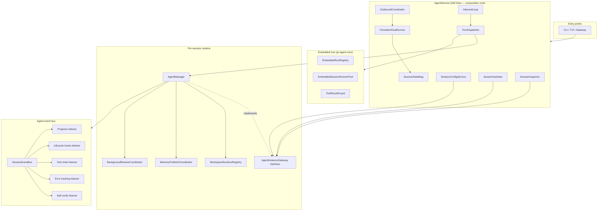

# ADR 0001 — AgentService god-class decomposition

| Field | Value |
|---|---|
| Status | Accepted |
| Date | 2026-06-01 |
| Scope | `src/agent/` |
| Related | `.dependency-cruiser.cjs`, `src/agent/agent-instance-gateway.ts`, `docs/architecture.md` |

## Context

`AgentService` started life as a thin orchestrator and grew into a 1792-line god class with 30+ private
fields, six `Map<sessionKey, …>` instances without TTL, three `await import()` calls used as
cycle-breakers, and a constructor that hand-wired 20+ collaborators. Lower-level subsystems (`embedded/`,
`tools/`, `orchestration/`) reached back into it freely, making any subsystem hard to test in isolation
and exposing the whole project to "one bug ripples everywhere".

The first audit (May 2026) identified ten stability and ten SRP issues. This ADR captures the resulting
seven-phase refactor and the **architectural invariants** it produced.

## Decision

Decompose `AgentService` and `AgentManager` into a stable set of injectable collaborators, all owned by
the service but accessible by name (`readonly` fields), and enforce the boundaries with `dependency-cruiser`
in CI.

### Composition root: `AgentService`

After the refactor, `AgentService` is a 940-line composition root. Its `readonly` collaborator fields are
the public contract:

| Field | Module | Owns |
|---|---|---|
| `sessionStore` | `session/store.ts` | Transcript + metadata persistence |
| `outboundCoordinator` | `messaging/outbound-coordinator.ts` | Typing, silence guard, final response, post-turn hook |
| `turnDispatcher` | `inbound/turn-dispatcher.ts` | `processDirect`, `processDirectStreaming`, webchat steer + SSE injection |
| `persistentGoals` | `goals/persistent-goal-service.ts` | `/goal` continuation, stream outcome, post-turn verdict |
| `sessionConfig` | `session/session-config-service.ts` | Per-session config writes (model / thinking / workspace) |
| `sessionHydrator` | `session/session-hydrator.ts` | Read persisted config into the runtime |
| `sessionInspector` | `session/session-inspector.ts` | Compaction, `/btw` query, `/context` report, agent config view |

`InboundLoop` and the agent event bus are internal but constructed by the same composition root.

### Boundary enforcement

`dependency-cruiser` enforces the boundaries:

- **No lower-level subsystem may import `service.ts` or `agent-manager.ts`.** Lower-level modules that
  need agent state depend on the narrow `AgentInstanceGateway` interface instead.
- **No circular dependencies** are accepted, with one explicit exception
  (`agent/image/generation/{provider-registry,types}.ts`, kept for cross-monorepo public-API
  compatibility with five vendor extension packages).
- **lifecycle/ is a foundation layer** — it must not import from higher-level subsystems
  (`inbound/`, `orchestration/`, `messaging/`, `tools/`, `session/*`, etc.).

26 rules total. The architecture CI job (`.github/workflows/ci.yml`, `architecture`) runs
`pnpm run depcheck` and blocks the merge on any new violation.

## Consequences

### Positive

- **Testable**: every coordinator accepts its dependencies through a typed config object; production
  wiring and test mocking share one path. The `SessionEventBus` listener split means adding new
  agent-event reactions does not modify `AgentEventHandler`.
- **Stable**: 10 of 10 §8 risks are resolved (or, for the monkey-patch on pi-coding-agent's
  `appendMessage`, narrowed and class-wrapped). The bus consumer loop uses error tiering instead of
  swallow-and-retry; `SessionStateBag` enforces TTL on previously unbounded session maps; `executor.ts`
  no longer hides tool failures from pi-agent.
- **Cycle-free**: the agent layer has zero circular imports. The single accepted cycle is explicitly
  whitelisted and documented.
- **Documented at the code level**: every coordinator file's docstring states what the class owns and
  what previously-on-AgentService responsibility it absorbed.

### Negative

- **Wider constructor configs**: classes like `InboundLoop`, `TurnDispatcher`, and `PersistentGoalService`
  accept 8–14 dependencies. This is real complexity, but it is *explicit* (vs hidden in `AgentService`'s
  private fields) and surfaces at the only call site that matters — the composition root.
- **More files**: the agent layer has ~12 more files than before. Each is small and focused; the upside
  is that the average file is now 100–250 lines instead of 1700.
- **Monkey-patch of `SessionManager.appendMessage`**: the embedded `ToolResultGuard` still needs to
  intercept pi-coding-agent's internal writes. The patch is now class-wrapped and documented; future
  versions of pi-coding-agent that switch to a hook API will let us delete it.

### Trade-offs explicitly considered

- We chose **interface narrowing** (`AgentInstanceGateway`) over **dependency injection containers** —
  TypeScript structural typing + `implements` gives us the same boundary-policing without runtime
  framework overhead.
- We chose **`readonly` public fields** over delegation methods on `AgentService` — every delegation
  method was a thin pass-through that added cognitive load without adding behavior. Direct field access
  (`agentService.turnDispatcher.processDirect(...)`) is clearer and ISP-aligned.
- We kept **process-wide singletons** (`defaultEmbeddedRunRegistry`, `defaultEmbeddedSessionRunnerPool`,
  `defaultSessionManagerCache`) as backward-compat exports but built the class shape underneath for
  future DI. This matches Node's reality (one process, one agent runtime) while not closing the door on
  multi-instance scenarios.

## Compliance

The decomposition is locked in by:

1. **`.dependency-cruiser.cjs`** — 26 SOLID rules + `no-circular`, all at `error` severity.
2. **`.github/workflows/ci.yml`** (`architecture` job) — blocks any PR that introduces a violation.
3. **`.github/PULL_REQUEST_TEMPLATE.md`** — reviewer checklist points at `pnpm run depcheck`.
4. **Per-class docstrings** — each coordinator file opens with "extracted from `AgentService` because…"
   so the next maintainer sees the rationale without leaving the file.

## References

- The original audit findings: see chat transcript under "§8 — 跨层稳定性可疑点".
- `AgentInstanceGateway` pattern: `src/agent/agent-instance-gateway.ts`.
- Composition root: `src/agent/service.ts`.
- Reverse-direction rules: `.dependency-cruiser.cjs` (`no-X-to-agent-manager` + `no-X-to-agent-service`).
