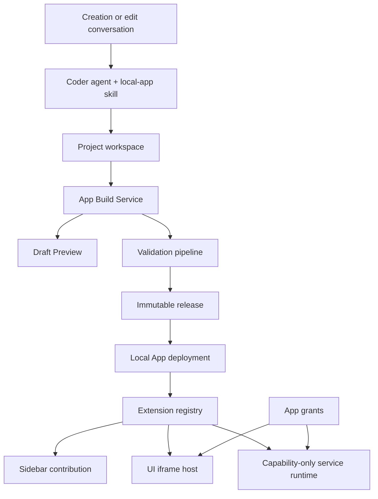

# ADR 0002: Local App Platform

Status: Proposed  
Date: 2026-07-21  
Owners: Agent, Projects, Extensions, Gateway, and Web UI maintainers

## Decision

xopc will model a user-created Local App as a first-class object that links a Project to immutable application releases. Draft source remains in the Project workspace. Only a validated release is installed into the extension runtime and shown in the sidebar.

UI Apps run in the existing sandboxed extension iframe. Local Service Apps use a new capability-only isolated runtime and must not execute as ordinary in-process Node extensions. Existing full-power Extension SDK applications remain available only through an explicit Advanced mode with a full-local-trust warning.

A built-in `build-xopc-local-app` skill, approved starter assets, and deterministic validation scripts define the authoring contract used by the coder agent.

## Context

xopc already provides most runtime and shell primitives needed by Local Apps:

- Projects with workspace roots and agent association;
- a built-in coder agent and project-agent suggestion;
- global, workspace, and bundled extension discovery;
- local extension installation and staged replacement;
- `xopc.extension.json` capability contracts;
- extension UI page contributions with `showInNav`;
- dynamic sidebar collection and ordering;
- sandboxed iframe hosting with CSP and `postMessage` routing;
- an extension UI SDK for theme, storage, sessions, agent requests, events, notifications, and navigation;
- Gateway REST and realtime WebSocket surfaces.

These primitives do not currently form a user-facing authoring lifecycle. There is no stable Local App identity linking a Project to an installed extension, no draft-versus-installed boundary, no application release history, and no safe default runtime for AI-generated backend logic.

The existing extension UI grant is stored in browser local storage and the full extension runtime loads trusted Node code into the gateway process. Neither is sufficient as the durable permission model for generated Local Service Apps.

## Terminology

- **Local App**: durable product identity, metadata, permissions, and lifecycle.
- **Project**: canonical authoring workspace and conversation context.
- **Draft**: mutable source state and its latest preview build.
- **Release**: immutable, validated artifact derived from a source revision.
- **Deployment**: the release currently activated for the Local App.
- **UI App**: iframe-only application using granted UI SDK capabilities.
- **Local Service App**: UI App plus capability-only local service logic.
- **Advanced Extension**: trusted extension using the full in-process Extension SDK.

## Decision Drivers

- A failed draft or update must not interrupt the working app.
- Users must be able to resume development from the app or its Project.
- App identity and stored data must survive renames and releases.
- Permissions must be enforceable, reviewable, and versioned.
- Generated backend code must not inherit gateway-process authority.
- Existing extension UI and navigation infrastructure should be reused.
- The architecture should not require marketplace or multi-user concepts.

## Architecture



### Authoring and runtime are separate

The Project workspace is canonical for editable source. Installation does not point the live app directly at mutable workspace output. Instead, the release service creates an immutable artifact, validates it, and atomically changes the Local App deployment pointer after health checks succeed.

This creates two independent routes:

- a draft preview route keyed by app and build;
- the stable extension route backed by the active release.

The existing deployment stays active while a new draft builds or previews.

### Stable identity

Each Local App receives an opaque `appId` and a stable extension id at creation. Display name, icon, Project name, and route label can change without changing either identity.

The `appId` is used for:

- Project association;
- release and build ownership;
- grants;
- diagnostics;
- storage namespace;
- activity events.

The extension id remains stable so existing extension routes and contribution ids do not churn.

### Two manifests

The Project contains two distinct contracts:

1. `.xopc/app.json` is authoring metadata: schema version, `appId`, Project association, starter family, build tasks, source paths, data schema version, and skill version.
2. `xopc.extension.json` remains the runtime contract: extension id, UI entries, page contributions, permissions, configuration schema, engine compatibility, and registered capabilities.

The build pipeline derives and validates runtime metadata but must not silently add permissions. A runtime permission not already present in the confirmed App Brief changes the build state to `review_required`.

## Persistence

Local App lifecycle state is stored in the shared xopc SQLite database. Filesystem discovery remains authoritative for external extensions, but it is not the source of truth for Local Apps.

Recommended tables:

```text
local_apps
  id, extension_id, project_id, name, status,
  active_release_id, latest_build_id, created_at, updated_at

local_app_builds
  id, app_id, source_revision, status, phase,
  artifact_path, manifest_digest, diagnostics_json,
  started_at, completed_at

local_app_releases
  id, app_id, version, source_revision, artifact_path,
  manifest_json, permissions_json, data_schema_version,
  created_at

local_app_deployments
  app_id, release_id, previous_release_id,
  status, activated_at, health_json

local_app_grants
  app_id, capability, scope_json, granted_at,
  manifest_digest, revoked_at
```

Project deletion, app removal, and data deletion are separate operations:

- removing an installed app does not delete its Project by default;
- deleting a Project requires an explicit choice about the Local App;
- deleting app data is always an explicit destructive action;
- disabling an app changes activation state only.

## Lifecycle

The application state machine is:

```text
idea -> scaffolding -> building -> preview_ready -> review_required -> installed
                              \-> failed
installed -> updating -> preview_ready -> review_required -> installed
installed -> degraded -> installed | disabled
installed -> disabled -> installed
```

Build and deployment state are recorded separately. A Local App can be `installed` while its latest build is `failed`.

Every transition emits an activity event and, when useful to connected clients, a realtime event.

## Build and Release Pipeline

The release pipeline executes these gates in order:

1. Resolve Project, app metadata, and source revision.
2. Build browser and optional service artifacts in a temporary directory.
3. Validate app and extension manifests against the host schema.
4. Verify contribution ids, entry paths, and extension capability contracts.
5. Reject undeclared permissions or permission changes pending review.
6. Run type checks, tests, static security checks, and a preview smoke test.
7. Produce a content-addressed immutable artifact.
8. Record the release and its manifest digest.
9. Stage installation without changing the active deployment.
10. Start or mount the candidate and run a health check.
11. Atomically switch the active release pointer.
12. retain the previous healthy release for rollback.

If any step before activation fails, the active release is untouched. If post-activation health fails, the deployment pointer returns to the previous release and records the failed candidate.

Generated release directories are never edited in place.

## Runtime Tiers

### UI App

UI Apps reuse `ExtensionIframeHost`, extension asset routing, CSP, the extension message router, and the UI SDK.

The sandbox remains without `allow-same-origin`. The host owns permission dialogs, navigation chrome, and release controls. The iframe receives only its confirmed capability list and cannot read the gateway bearer token.

Initial supported capabilities should be a strict subset of the current UI SDK:

- theme and locale;
- namespaced storage;
- notification;
- explicitly scoped session or agent access when the brief requires it.

Configuration and navigation calls remain capability checked.

### Local Service App

Local Service Apps do not load their generated service bundle through the normal in-process Extension SDK.

The service bundle runs inside a restricted JavaScript isolate hosted in a supervised child process. The code has no Node built-ins, ambient environment, direct filesystem access, native addons, or direct sockets. All external effects use host functions exposed by a capability broker:

- `net.fetch` for confirmed domains and protocols;
- `files.read` and `files.write` for opaque user-selected handles;
- `secrets.use` for named secret references whose plaintext is not returned;
- namespaced app storage;
- bounded timers and background jobs;
- selected xopc data operations.

The child process provides crash and resource isolation. The JavaScript isolate and capability-only host API provide authority isolation. A plain Node child process alone is not treated as a security boundary.

The implementation must enforce CPU time, memory, response size, concurrency, and cancellation limits. The exact isolate engine can be selected in an implementation RFC, but the capability-only contract is part of this decision.

### Advanced Extension

Advanced mode scaffolds an ordinary extension and uses the existing Node runtime. It requires an explicit warning that the extension has the same local authority as the gateway process. It is not enabled by the default Local App creation flow.

## Permissions

Permissions are stored by the host and tied to the manifest digest and app identity. Browser local storage may remain a cache for UI responsiveness, but it is not authoritative for Local Apps.

Permission rules:

- use narrow named capabilities;
- attach scopes such as domain lists, file handles, session filters, and operation sets;
- show reasons derived from the App Brief;
- require confirmation for additions and broader scopes;
- apply removals automatically after validation;
- never expose secret plaintext to the app or agent;
- revoke grants when the app is removed only if the user chooses to remove data and permissions.

The permission service computes a delta between the candidate release and the active release. A candidate with an unconfirmed increase cannot be activated.

## Navigation and Shell Integration

Installed Local Apps continue to declare extension pages through `ui.contributions.pages`. Existing `useUiExtensions()`, sidebar collection, icon resolution, ordering, and extension routes remain the rendering path.

Installation also records a host-owned navigation preference. On first install, the Web client inserts the new app into the visible navigation region. If the region is full, the last unpinned item moves into More. Removing or disabling an app preserves the remaining user order.

The registry emits `extensions.changed` after installation, activation, disabling, rollback, or removal. The Web extension provider revalidates immediately instead of requiring a page reload.

UI-only Local Apps should support scoped registry refresh without restarting the gateway. Runtime changes that cannot be safely hot-reloaded may request a managed gateway restart, but build and deployment state must survive it and the UI must reconnect automatically.

## Agent and Skill Integration

Creating a Local App creates a Project and chooses the coder agent through the existing project-agent rules. The runtime attaches `build-xopc-local-app` to local-app Projects even when the user has not enabled it globally.

The skill is a procedural guardrail, not the platform authority. Host services still enforce manifests, grants, build gates, and deployment atomicity.

The skill package contains:

- a concise workflow in `SKILL.md`;
- focused references for app contracts, UI SDK, permissions, design language, migrations, and troubleshooting;
- UI-only and UI-with-service starter assets;
- deterministic initialization, validation, build, smoke-test, and release scripts.

The app metadata records the skill version used for scaffolding. A newer skill may propose a compatibility migration but cannot silently rewrite an installed app.

## Service Boundaries

- `LocalAppService`: identity, state, Project association, and high-level commands.
- `LocalAppBuildService`: isolated builds, checks, diagnostics, and artifacts.
- `LocalAppPreviewService`: draft preview lifecycle and refresh.
- `LocalAppReleaseService`: immutable releases, staged activation, and rollback.
- `LocalAppPermissionService`: grants, scopes, and candidate deltas.
- `LocalAppRuntimeSupervisor`: service isolates, limits, and health.
- `LocalAppDiagnosticsService`: normalized failures and coder repair context.

These services use existing extension and Project APIs rather than duplicating extension discovery or Project storage.

## Gateway API

The precise route modules may follow existing Hono conventions. The product contract requires operations equivalent to:

| Method | Route | Purpose |
|---|---|---|
| `POST` | `/api/local-apps` | Create an app identity and associated Project |
| `GET` | `/api/local-apps` | List Local Apps and lifecycle state |
| `GET` | `/api/local-apps/:id` | Read app, draft, deployment, and Project summary |
| `POST` | `/api/local-apps/:id/builds` | Start a draft build |
| `POST` | `/api/local-apps/:id/preview` | Start or refresh preview |
| `GET` | `/api/local-apps/:id/permissions/delta` | Review candidate permission changes |
| `POST` | `/api/local-apps/:id/releases` | Create and activate a validated release |
| `POST` | `/api/local-apps/:id/rollback` | Activate a previous healthy release |
| `POST` | `/api/local-apps/:id/enable` | Enable an installed app |
| `POST` | `/api/local-apps/:id/disable` | Disable an installed app |
| `DELETE` | `/api/local-apps/:id` | Remove deployment, with explicit data/Project choices |

Mutating operations accept idempotency keys. Long-running operations return an operation id and publish progress through the unified realtime broker.

Recommended events:

- `local_app.created`
- `local_app.build.progress`
- `local_app.preview.ready`
- `local_app.permission.required`
- `local_app.installed`
- `local_app.updated`
- `local_app.rollback.completed`
- `local_app.health.changed`
- `extensions.changed`

## Failure and Recovery

- Build failures record normalized diagnostics and a bounded raw-log reference.
- The UI can send diagnostics back to the associated coder session.
- Preview crashes do not affect the deployment.
- Activation is atomic and automatically restores the previous healthy release.
- Gateway restarts reconstruct operations and deployments from SQLite.
- If the Project workspace is missing, the installed release continues to run; editing is blocked with recovery choices.
- If an installed artifact is missing or corrupt, the release service can reinstall it from the retained artifact or roll back.
- Data migrations run before activation with backup or transactional semantics appropriate to the storage backend.

## Observability

All logs follow the repository object-first logging convention and include `appId`, `projectId`, `buildId`, `releaseId`, `requestId`, and `phase` where applicable. Logs contain bounded previews and never include source archives, authorization headers, or secret values.

Activity events capture product-visible milestones. Debug logs remain separate from the user timeline.

Health reporting distinguishes:

- build health;
- preview health;
- deployment health;
- service-runtime health;
- data-migration health.

## Consequences

### Positive

- Reuses the existing extension UI and navigation model.
- Gives generated apps a durable authoring and recovery path.
- Prevents draft failures from breaking installed apps.
- Establishes enforceable permission boundaries for local services.
- Keeps marketplace concepts out of the initial design.
- Allows advanced developers to retain the full extension system.

### Costs

- Introduces a new persisted domain model and several lifecycle services.
- Requires content-addressed artifact storage and cleanup.
- Requires a new isolated JavaScript service runtime before backend apps ship.
- Creates migration work from browser-local UI grants to host-owned grants.
- Requires scoped extension registry refresh and reliable Web revalidation.
- Adds version and data-migration responsibilities to generated apps.

## Alternatives Considered

### Treat the Project workspace as the installed extension

Rejected because mutable source, partial builds, and agent mistakes could immediately break the active app. It also provides no immutable rollback point.

### Copy the Project into the global extensions directory after every change

Rejected as the primary model because it does not create first-class identity, build history, permission deltas, or reliable Project linkage. Staged copy remains an implementation detail of release activation.

### Run generated backend code through the existing Extension SDK

Rejected as the default because ordinary extensions execute trusted Node code with gateway-process authority. A warning is insufficient for the default AI-generated path.

### Build a separate application platform unrelated to extensions

Rejected because it would duplicate asset hosting, routes, iframe isolation, SDK bridges, navigation contributions, configuration, and diagnostics already present in xopc.

### Make the development skill responsible for safety

Rejected because agent instructions are not an enforcement boundary. The skill improves consistency; runtime services and schemas enforce authority and release integrity.

### Store grants only in browser local storage

Rejected because grants would vary by browser profile, be difficult to audit, and could not authorize a local service runtime consistently.

## Rollout

1. Add the Local App identity, Project link, app authoring metadata, and UI-only build pipeline.
2. Add preview, deterministic validation, release storage, atomic deployment, and sidebar insertion.
3. Add release history, rollback, permission deltas, data migrations, and diagnostics-to-coder.
4. Add the capability-only Local Service runtime and broker.
5. Add Advanced mode scaffolding without changing its full-trust semantics.

## Validation Requirements

Before this ADR moves to Accepted, implementation planning must demonstrate:

- a draft failure leaves the installed app available;
- activation and rollback survive gateway restart;
- Local App grants are enforced outside the iframe UI;
- generated service code cannot access Node built-ins, ambient environment, raw filesystem paths, or direct sockets;
- a newly installed app appears in the visible sidebar;
- Project, app, release, and storage identities survive rename and update;
- uninstall, Project deletion, and app-data deletion remain separate explicit actions;
- the coder can reproduce a build from recorded source revision, skill version, and build metadata.
