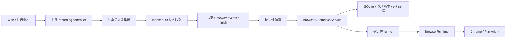

# 浏览器自动化录制与重放：实现说明

日期：2026-10-10。状态：P0 稳定性基础与 P1 单标签页录制已实现。

产品调研见 [产品方案](./browser-automation-record-replay.md)。本次按 KISS、SOLID 和奥卡姆剃刀收敛实现：沿用现有工具、执行服务、SQLite、Realtime 和页面，不新增执行引擎、模型编译任务、版本兼容适配器或必需 skill。

## 用户操作

1. 在已连接的 Chrome 扩展侧栏点击“开始录制”，演示当前 HTTP/HTTPS 标签页上的操作。
2. 点击“完成”，事件自动同步并保存为浏览器自动化，提供参数和“运行”按钮。Web 自动化列表也能开始、完成录制并查看保存的流程。
3. 用户主动运行时直接执行。保存录制不会重新提交网页业务，也不会假装流程已经验证。

Web 开始录制前先读取 availability。未连接显示安装/连接引导，已连接但没有录制能力提示更新并重新加载，多个可录制浏览器要求选择；只有一个就直接开始。引导每 3 秒刷新状态，连接成功后提示切换到目标网页并继续录制，避免在扩展安装页自动开始。连接在检查与派发之间丢失时，409 结构化状态仍回到同一引导，不显示英文异常。

可暂停和续录。断线时事件留在本地队列，重新连接自动上传；Chrome 重启、标签页关闭或采集失败会停止并显示具体错误。没有逐步批准卡，也不增加运行时 `permissions.request`。扩展沿用安装权限和现有 Gateway 连接身份。

## 模块与数据流

| 位置 | 职责 |
| --- | --- |
| `packages/browser-control-contract/src/automation.ts` | 共享目标、事件和可注入 DOM 解析/采集函数。 |
| `packages/browser-ext/src/recording/store.ts` | IndexedDB 事务、连续序号、确认水位和本地预算。 |
| `packages/browser-ext/src/recording/controller.ts` | 录制生命周期、内容消息身份检查、导航注入和断线同步。 |
| `src/browser/recordings/service.ts` | 严格事件校验、幂等接收、完整性检查和确定性编译。 |
| `src/browser/automations/` | 单一定义 schema、版本、执行、断言、输出和证据。 |
| `src/gateway/hono/routes/browser-recordings.ts` | 控制、事件上传和完成接口。 |
| `packages/browser-ext/src/sidepanel/recording-panel.tsx` | 两次控制点击、自动保存、参数和运行结果。 |
| `web/src/features/browser-automations/` | 录制入口、草稿/已验证状态和业务结果。 |

## 唯一定义与定位

保留现有严格判别 union：navigate、click、fill、select、check、press、scroll、wait。参数沿用受控 `${input.name}` 插值，不执行 JavaScript；校验引用、类型、默认值及 choices。

目标为 `{ role, name?, nameIncludes?, testId?, scope?: { role, name } }`。Chrome 与 Playwright 使用同一 DOM 语义解析器，支持标签/aria 可访问名称、稳定 testId 和表单/区域作用域。每步重新解析，匹配必须唯一；不能用 first/nth 掩盖重名。解析读取由驱动侧完成，不受普通观察交互节点数量截断影响。

`check` 设置期望状态，避免反转复选框。每次观察检查 allowedDomains，导航和可解析链接在派发前检查，结果和重定向后再次检查。这是执行范围约束，不是网页网络隔离。

`successCriteria` 支持 text/value/url/title/checked，比较方式 equals/includes。`outputs` 支持 text/value/url/title/href，缺少输出会失败。最终断言条件等待最多 10 秒。没有业务断言只报告 completed，有实际断言和所需输出且通过才报告 verified。

## 录制、完整性与隐私

只收集主文档受信任的语义交互。输入在 change/focusout/停止时保存最终值，不保存每次按键；中文输入法组合期间不记录 Enter。支持点击、文本输入、选择、勾选、Enter/Escape 和文档导航。

密码、验证码、支付字段、文件输入及 token/secret 类字段不保存值；事件 URL 去除用户名、密码、fragment 和敏感查询参数。不保存 Cookie、认证头、完整 DOM 或视频。Canvas、拖拽、contenteditable、文件操作产生不支持事件，完成时给出错误，不编译成普通点击。

每个文档分配 documentId/sourceSeq；后台以 IndexedDB 原子事务分配全局 seq，提交后才确认内容消息。导航 pagehide 和主动停止发送 checkpoint。Gateway 检查全局连续序号、文档序号连续及每个文档最终 checkpoint，任意缺口阻止生成。

本地和 Gateway 每次录制限制 10,000 个事件、20 MiB；批次最多 100 事件，HTTP 请求最多 256 KiB。达到预算停止采集并提示。finish 要求 finalSeq 等于已接收水位；同一事件重传不重复保存，内容冲突拒绝。

编译合并最终输入、参数化填值、保留语义作用域。提交点击/Enter 后的导航编译为等待，不额外导航重复业务操作。编译最多 100 步，自动保存未验证定义及页面 URL 输出。模型补充意图或断言通过现有助手和工具进行，不引入异步编译框架。

扩展事件仅接受本扩展 sender、指定 tab、主 frame 和当前 generation。上传需要 Chrome 设备访问令牌及实时 endpoint claim，所有权隔离。已确认完整保存后清理扩展事件；SQLite 录制材料随自动化删除级联清理，目前没有独立 7 天保留任务。

## 存储与版本

SQLite 是权威存储，扩展 IndexedDB 只是持久队列。新增 migration 238：

| 表/字段 | 用途 |
| --- | --- |
| `browser_automation_versions` | `(automation_id, revision)` 不可变定义，无额外 versionId/hash。 |
| `browser_automation_verifications` | 实际成功运行与对应版本的证据。 |
| `browser_recordings` | 所属设备、状态、确认及最终水位、自动化关联。 |
| `browser_recording_events` | seq、唯一事件 id、JSON 语义事件。 |
| runs `client_request_id/business_outcome` | 调用去重和 completed/verified/unknown 结果。 |

保存比较规范化定义，内容变化才增加 revision，启停不创建版本。expectedRevision 防止覆盖并发修改，HTTP 冲突返回 409。运行保存实际版本快照；改变定义重置当前版本验证，旧证据保留。

一次性 SQL 迁移保存已有定义版本，将已有浏览器计划固定到当前 revision 并暂时停用，待对应版本真实验证后可重新启用。迁移不伪造验证证据。运行代码只有一个当前 schema，没有 V1/V2、legacy provenance、双写或兼容执行分支。

删除旧独立 Extension WebSocket provider、acquire 包装、challenge/auth 协议及相应测试。Chrome 仅使用已有 Gateway Realtime/Endpoint Tools 通道。

## 执行、取消与调度

clientRequestId 在调用者范围内唯一，重复请求返回同一 run；同一 id 携带不同自动化、指定版本或参数会拒绝。taskKey 关联 runId，每次任务拥有独立任务页。活跃命令持有会话，避免空闲清理关闭正在执行的页；录制页拒绝普通附着写操作。

AbortSignal 从 service 传至 Runtime、驱动和 Endpoint Tools，扩展在派发前和等待中检查取消。已派发网页操作不能保证撤销；含修改动作的失败保守标 unknown。Gateway 重启将未结束运行标记失败/unknown，不自动恢复提交。浏览器调度只尝试一次，不使用通用自动重试。

定时任务固定 revision，创建/启用及执行前要求该版本验证证据。之后编辑当前流程不会改变已固定的任务。这里不承诺跨数据库和网页业务的 exactly-once，网络超时后需要检查业务结果。

## 接口

- `POST /api/browser/recordings/control`：start/pause/resume/finish/status，转发至连接的扩展。
- `GET /api/browser/recordings/availability`：ready/choose_browser/connect_required/update_required 及当前用户可录制的浏览器列表。
- `POST /api/browser/recordings/:id/events`：认证设备批量上传，返回 ackThrough。
- `POST /api/browser/recordings/:id/finish`：最终水位检查及保存，重复完成返回相同自动化。
- `POST /api/browser/automations/validate`：结构校验，不执行网页动作。
- `GET /api/browser/automations/:id/versions`：版本和证据。
- `POST /api/browser/automations/:id/run` 或 `/test`：同一执行路径，可指定 revision/clientRequestId。
- `browser_automation` 工具增加 validate/test/版本参数；手册区分保存、执行完成和业务验证。

新增路径均登记 lazy-bundles；设备 scopes 复用现有授权并提供自动化 read/write，不新增批准流程。

## 验证与边界

已有验证包括浏览器/调度/迁移/路由回归，真实 Chrome 中文输入、重名表单作用域、敏感字段过滤、提交导航及实际 runner 重放，真实 Chrome IndexedDB 并发 20 个事件及 reload 恢复，带认证真实 HTTP 的 lazy 路由、claim 校验、上传/完成/验证/运行/版本查询。

当前交付单标签页、主文档、标准 DOM 控件。多标签页、复杂 iframe/shadow、下载关联、表格输出、模型定位修复、断点恢复和录像是后续能力，不通过适配器或静默降级假装支持。真实用户安装扩展后的多站点验收和成功率基准仍需单独进行。
