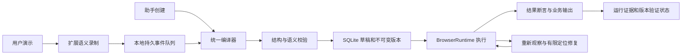

# 浏览器自动化：录制、生成与可靠重放

日期：2026-10-10。状态：调研与建议方案，尚未实施本文新增功能。

实施细节见：[录制与重放技术方案](./browser-automation-record-replay-technical.md)。

## 1. 产品决策

建议以“演示一次，以后直接调用”为用户体验，以“结构化步骤 + 结果验证”为执行基础。保留现有 `browser_automation`，增加录制入口，并让助手生成和人工录制走同一条编译、校验、运行链路。

默认用户流程：**开始录制 → 操作网页 → 完成**。完成即自动保存，自动命名、整理步骤和建议参数；以后点击“运行”，或在聊天里说“运行这个流程，日期换成上周”。录制控制只需开始和完成两次点击，不包含业务操作、首次安装连接、缺失参数或登录处理。

不增加逐站点、逐步骤、保存前的产品批准卡片。开始录制本身就是开始操作；运行按钮就是执行入口。沿用已有连接和浏览器安装授权。Chrome 强制的安装权限、调试提示或系统权限仍由平台控制，不能承诺消除。

优先解决生成和执行的一致性，不把独立 builder skill 作为稳定性的前提。可复用的流程将来可以派生为 skill，但执行定义和验证记录始终由自动化服务维护。

## 2. 社区及 Codex 的可借鉴做法

以下外部事实来自官方文档或项目源码；“采用方式”是针对 xopc 的设计建议。

| 项目 | 已公开做法 | xopc 采用方式 |
| --- | --- | --- |
| OpenAI Codex Record & Replay | macOS 用户演示操作，结束后生成包含适用场景、输入、步骤、验证方式的 skill；后续用当前可用工具完成任务。[官方文档](https://learn.chatgpt.com/docs/extend/record-and-replay) | 学习“展示比描述容易”和自动整理流程；增加结构化执行定义，便于重复运行与审计。 |
| Playwright Codegen | 录制交互、生成定位器与测试代码，并支持记录可见性、文本、值等断言。[官方文档](https://playwright.dev/docs/codegen) | 录制语义目标，补充结果断言；验证最终生成的定义。 |
| Playwright Agent CLI | 支持 recording-start/stop，输出动作代码，也支持生成及高亮定位器。[官方文档](https://playwright.dev/agent-cli/commands/codegen) | 助手操作和人工操作采用统一的动作记录格式。 |
| Chrome Recorder / Puppeteer Replay | 录制流程可导出、转换和重放；Replay 提供自定义重放与输出扩展。[Chrome 文档](https://developer.chrome.com/blog/extend-recorder)、[Replay 源码](https://github.com/puppeteer/replay) | 保留可移植 JSON 和未来导入导出通道，日常使用入口放在 xopc 扩展。 |
| Selenium IDE | 录制及重放，记录多个定位方式，提供调试能力。[项目页面](https://www.selenium.dev/selenium-ide/) | 使用经过唯一性校验的定位备选，不在匹配多个元素时直接选第一个。 |
| Stagehand | observe 可生成供 act 执行的动作；提供缓存与 schema 化数据提取。[Act](https://docs.stagehand.dev/v3/basics/act)、[Extract](https://docs.stagehand.dev/v3/basics/extract) | 正常流程确定性执行，页面变化时再观察；最终输出返回业务数据。 |
| Automa | 源码中开始录制会保存录制状态及活动标签页，并显示 rec 徽标。[源码](https://raw.githubusercontent.com/AutomaApp/automa/main/src/newtab/utils/startRecordWorkflow.js) | 借鉴明确的录制状态指示；录制范围限定在用户任务相关标签页。 |
| rrweb | 用事件和 DOM 变化重建页面，适合会话回放。[项目文档](https://rrweb.com/docs/) | 如以后需要视觉排障再评估；会话回放和真实网站任务执行是两种能力。 |

Codex 的公开流程包含开始录制前的权限确认。xopc 可采用其演示与 skill 整理理念，按本项目要求把入口做成直接开始，不复刻额外确认步骤。[官方流程](https://learn.chatgpt.com/docs/extend/record-and-replay)

公开材料没有说明 Codex 录制内部数据库、定位器算法或自动重放验证机制；本文的存储和恢复设计是 xopc 的建议方案，不能视为 Codex 内部实现。

## 3. 当前 xopc 的基础与缺口

基于本仓库代码检查：

| 当前实现 | 对方案的影响 |
| --- | --- |
| 自动化页面通过聊天创建/修改，已有列表、参数运行和历史 | 扩展现有页面，不新增独立工作流产品。 |
| `BrowserAutomationService.save` 校验结构、递增 revision，没有执行验证门槛 | 允许保存草稿，但“已验证”必须由实际运行证据产生。 |
| runner 支持 navigate/click/fill/select/press/scroll/wait | 沿用执行链路，逐步扩展 assert/extract 和必要控件。 |
| 目标只有 role + name/nameIncludes，必须唯一匹配 | 保留唯一性要求，增加区域、标签、frame 等定位上下文。 |
| runner 最终 receipt 的 verified=true 表示现有执行完成 | 不能将其直接解释为业务成功或整个版本已验证。 |
| allowedDomains 的 runner 检查围绕 navigate 前后 | 扩展到点击、弹窗、重定向等导致的新页面，驱动层统一约束。 |
| 服务创建运行时保存定义与 revision 快照 | 保留此基础，增加不可变版本和验证证据。 |
| SQLite 已存储定义、运行和步骤事件 | SQLite 继续作为最终权威来源。 |
| Chrome 扩展已有 controller、CDP、连接及侧边栏 | 增加语义录制模块，复用连接及执行能力。 |

主要代码：`src/browser/automations/{types,schema,runner,service,repository,runtime-service}.ts`、`src/agent/tools/browser-automation-tool.ts`、`src/agent/tool-manuals/browser.ts`、`packages/browser-ext/src/{controller,background,cdp}.ts`、`web/src/features/browser-automations/browser-automations-page.tsx`。

## 4. 用户操作设计

### 4.1 两种创建入口，一个自动化列表

浏览器自动化页面和扩展侧边栏提供“录制我的操作”“让助手创建”。用户不需要选择底层驱动、脚本语言、skill 类型或录制格式。

扩展中点击录制，直接绑定当前可录制网页。Web 控制台入口优先使用已连接扩展的活动网页；未连接时只展示已有连接入口。选中标签页无法操作时给出具体原因，避免反复授权向导。

录制期间显示固定的“正在录制 · 暂停 · 完成”控制条，扩展图标同步指示状态。录制开始时保存入口 URL；导航后继续同一会话。用户可以说“录制我接下来的操作”“完成”，与按钮使用同一状态机。

完成后立即停止采集并保存原始语义事件，侧边栏显示整理骨架，编译完成替换为卡片：

```text
查询订单状态                       已录制
在订单后台查询并返回订单当前状态

订单号：12345

[运行]                [修改] [更多]
```

名称、参数和说明自动生成、可内联修改。没有强制“下一步”“保存”“批准”向导。日期、查询词等根据意图建议参数；信息不足时保留录制值，不把所有输入框都强行变成必填项。

### 4.2 自动保存与执行验证分开

录制中的成功是“用户做成功”，不等于“生成的定义能重放成功”。因此结束自动保存为“已录制”，普通运行按钮可直接执行；首次运行成功且结果断言通过，自动标记“已验证”。验证不增加额外批准页面。

结束录制不自动重做创建订单、提交报销或发送消息。用户下一次点击运行就同时完成首次验证。助手被要求“创建并测试”时可以完成一次真实测试，记录这次测试的具体业务影响，不另外盲目重复。

自动化的启停和验证状态分离。未验证版本可手动运行，创建无人值守定时任务前必须具有该版本的成功重放证据；在既有创建任务的操作中解释当前缺少什么证据，避免额外的批准弹窗。

### 4.3 运行与结果

无参数流程点击一次运行；参数有默认值则同样一次，参数缺失则只展示必要字段。聊天运行时从上下文提取参数，只询问影响执行的缺失信息。

默认复用选定浏览器配置的登录态，在任务专用标签页执行，避免修改用户正在看的页面。确实依赖当前页状态的流程声明这一前置条件，在当前页执行并取得页级互斥锁；两种模式由流程前置条件决定。

运行展示当前阶段、结果及“停止”。查询流程优先返回字段/表格，例如订单号和状态；操作流程展示已验证的结果标识，例如新建 issue 的 URL。步骤回执留在详情，避免用户读内部日志。

失败时展示具体原因与有效下一步，例如“登录已过期，登录后可继续”。登录或验证码由用户处理；延续到已知安全检查点，不一律从头执行。

## 5. 技术架构



### 5.1 录制：语义事件、最小数据、可恢复

新增扩展 `recording-controller` 与内容脚本。记录真实交互 click、fill、select、check、press、navigate；scroll 只保留影响后续动作的必要事件。保存语义目标、动作前后条件、逻辑页面标识及事件来源，不依赖录制时临时 DOM ref 或实际 tabId。

输入采用 compositionend/change/blur 合并最终值，处理中文输入法。Enter 提交与导航关联，避免编译成两次提交；checkbox 与 radio 用显式目标状态，避免重放 toggle。密码、验证码、支付凭据等在采集端即遮蔽或跳过，URL 中 token 等同时处理，不先上传再清洗。

默认录制当前任务页；以后支持其因用户动作打开的关联标签页。无关页切换不自动加入录制。暂停及完成结束监听；不记录全浏览器按键，也不默认连续录像或上传完整 DOM。必要观察采用受限、脱敏的目标上下文；采用已有模型服务时，流程整理所需内容按当前 provider 的实际数据路径处理。

内容脚本消息身份以 Chrome 提供的 sender.tab/frame/document 为准，网页文本只作为数据。`isTrusted` 可用于过滤脚本合成交互，但不能单独作为授权依据；网页 `postMessage` 不得启动录制、绑定标签页或触发自动化工具。

MV3 后台可能被终止，内存状态会丢失；Chrome 官方建议持久化状态。[生命周期文档](https://developer.chrome.com/docs/extensions/develop/concepts/service-workers/lifecycle)

因此扩展使用 IndexedDB 保存会话与事件队列，按 document 内事件序号去重；后台分配持久化全局顺序，保留因果关系。Gateway 按会话和事件 id 幂等接收，返回确认水位。完成包含最终水位，确认事件齐全后才能编译为完整流程。跨文档导航丢失未确认事件时标记缺口，不能默默声称录制完整。

Gateway 断开时本地继续记录；完成后显示“已保存到本机，等待同步”，恢复后自动上传。浏览器彻底重启后恢复未完成草稿，采集保持停止，用户主动续录时继续，防止后台无提示开始录制。

### 5.2 编译：先确定性整理，再让模型补意图

先去重、合并输入、关联导航、剔除噪声，生成候选动作。模型负责名称、描述、参数建议、成功条件及输出 schema。录制生成的动作都携带 sourceEventIds，不能凭推测补出未发生的提交。

助手创建同样产出候选定义。演示操作成功后，必须通过同一 runner 执行最终候选版本，才能标记已验证；不能拿另一条 `browser_use` 轨迹证明后来生成的 JSON 已验证。

校验除 schema 外包括：参数引用存在、类型及 choices 合法、必要参数完整、目标定位不为空、站点范围有效、结果条件有来源、动作能力受支持。Canvas、复杂拖拽等 MVP 暂不支持的动作明确标为不可自动重放，保留草稿供助手补充，不能伪装成普通 click。

### 5.3 定位：共享解析器与严格唯一性

升级版本化语义目标：role/accessibleName、label、稳定 testId、文本特征、所属表单/行/区域、framePath、shadowRoot 路径及必要定位备选。Chrome 与 Playwright 共享规范和一致性用例；避免两套简化 accessibleName 逻辑产生不同结果。

优先可访问语义和稳定标识，必要时使用内部生成的稳定选择器。每个备选都必须唯一匹配并通过上下文约束；不使用无约束 first()/nth() 解决重名按钮。

实现使用单一定义 schema，在现有 role/name 目标上增加 testId 和 scope，不引入 V1/V2 兼容层。frame/shadow 留待后续实际用例扩展。

### 5.4 执行：等待结果，限制修复，避免重复写入

复用 BrowserRuntime。执行前确认页面、登录、域名及输入；每步依据当前观察定位，动作后等待可见、URL、值或明确业务条件。优先条件等待，设置整体和单步上限。

正常流程不逐步调用模型。目标失效时先重新观察一次；仍无法匹配时，允许一次受限定位修复。修复只能调整同一动作的目标，不改变业务值、站点范围或增加提交；无法唯一匹配则结束本次运行。

修复后的执行产出新候选版本并保留差异；验证证据绑定实际执行的版本。旧版本不会因为“修复后成功”而被错误标记成功。

提交等动作发出后若结果未知，记录 outcome_unknown，先检查业务结果或外部标识；不能直接再次点击提交。仅对可证明幂等的动作重试。没有结果检查能力时报告“结果待检查”，不出现批准卡片，也不把超时当作未执行。

站点约束在驱动层覆盖导航、点击新页和重定向；预先验证可解析的链接目标，后续导航事件再次校验。网页内容不能扩大流程范围；发现越界停止。它是执行约束，不是宣称能完全隔离所有网页网络请求。

新增 assert/extract 能力，返回 schema 校验后的业务数据。succeeded 要求步骤完成及声明的成功条件通过；无业务条件时只显示“步骤已完成”，不夸大为业务成功。

### 5.5 存储：一个权威定义，可追溯版本

SQLite 继续使用现有状态根下的 `xopc.db`。新增数据模型建议：

| 数据 | 内容 |
| --- | --- |
| browser_recordings | 会话、所属用户/连接、范围、状态、确认水位、是否完整。 |
| browser_recording_events | 脱敏语义事件、来源、顺序与去重键；可按保留策略删除。 |
| browser_automation_versions | 不可变 definition 和 revision；不额外维护 schemaVersion 或 contentHash。 |
| browser_automation_verifications | 实际运行 id、版本/hash、浏览器配置类别、结果条件、验证时间及结论。 |
| 现有 automations/runs/action_audit | 保留启停、当前版本指针、运行快照、步骤事件与业务结果。 |

定义增加 intent、outputs、preconditions、successCriteria、effect/retry policy 和 provenance；现有 risk 保留用于描述，不能单靠模型给出的 risk 决定是否自动重复测试。

版本验证只证明所记录环境和输入下的一次成功，不保证所有参数都成功。正文、参数、定位器或结果条件改变后创建新版本，新版本验证状态重置。旧定义迁移为“未验证”，不伪造历史证明。

建议原始录制事件默认保留 7 天、可调；这一期限是产品提议，需结合本地存储预算确认。上传确认后清理扩展队列；SQLite 原始记录删除不影响已编译定义。删除自动化清理关联录制材料；运行历史继续遵循明确的现有删除策略。默认不保存完整视频、Cookie 或认证头。可选截图作为脱敏诊断附件，有独立保留策略。

### 5.6 服务接口与状态一致性

建议在现有 browser API 下增加 recording start/events/finish/cancel/status；finish 返回异步编译任务，不阻塞侧边栏。start 和 finish 可幂等重试，录制并发执行采用标签页锁。

`browser_automation` 新增 validate/test 操作；save 保存草稿，test 执行指定不可变版本；验证状态只能由服务结合运行证据写入。普通 run 的首次成功也完成验证，用户无需另点“测试”。

Web 和扩展订阅录制、编译、运行事件；断线恢复读取快照和游标。现有轮询可暂时兼容。自动化入口继续统一到现有列表和聊天，避免维护两套对象。

所有新增 authenticated API 必须同步更新 lazy-bundles matcher、映射测试，并通过真实带认证 Gateway 的路径验收，不能只测试 route 模块。

## 6. Skill 与依赖选择

需要区分“指导模型创建流程的 builder skill”和“从一次演示生成的工作流 skill”。前者可提升写作一致性，无法替代服务端验证；后者适合自然语言调用及跨工具流程，是 Codex 经验可借鉴的部分。

首期增强现有工具说明与结构化生命周期即可。以后可自动派生轻量 skill：描述何时调用、输入与成功条件，引用 automationId/version，执行仍调用 `browser_automation`。skill 不是另一份可以独立漂移的脚本。

继续用现有 Playwright/Chrome 驱动，自建精简的语义录制层。Playwright Codegen 作为实现参考与内部验证工具；不把 DevTools 或 Inspector 暴露给普通用户。不为录制引入整套可视化节点编辑器。

Puppeteer Replay 可在需要互通时评估导入导出；Stagehand 先借鉴 observe/act、缓存及输出 schema 思路；rrweb 仅在确有视觉排障需求时再评估。引入代码或依赖前另核验具体版本、许可和构建影响。

## 7. 交付顺序与验收

| 阶段 | 交付 | 验收重点 |
| --- | --- | --- |
| P0 稳定性基础 | 不可变版本、validate/test、成功条件、区域定位、基础输出、准确验证状态；更新工具手册 | 最终定义实际测试，保存不伪造已验证；失败提交不盲目重试。 |
| P1 录制 MVP | 当前标签页，点击/输入/选择/check/导航，开始/暂停/完成，自动草稿，本地队列与断线恢复 | 除业务操作外两次控制点击；中文输入法、导航、后台重启、敏感值处理通过。 |
| P2 扩展场景 | 多标签页/frame/shadow，选取结果、下载关联、有限修复、聊天智能匹配及定时复用 | 定位修复有界，业务结果准确，跨页面操作不串到用户其他任务。 |

基准先测当前版本，再对比同一套用例。建议至少 25 条真实及可控场景，每条重复 5 次，分查询和写入统计：同站点首轮重放成功率目标 >=95%，误点击写入、重复提交及敏感值泄漏目标为零；这些是拟议验收指标，不是已测结果。

必须覆盖：重名按钮、表单区域、延迟加载、SPA 导航、刷新、IME、勾选状态、登录过期、参数变化、结果字段缺失、站点跳转、断网、事件重复/缺口、MV3 终止、提交后超时。P2 增加多页/frame/shadow、下载及定位修复用例。

用户体验验收：开始即录制、完成即保存、没有追加批准卡；任务结果可理解；无法自动处理时给出具体下一步。服务端验收：证据绑定实际版本和运行，未知结果不宣称成功，新增 API 的认证和 lazy loading 在真实 Gateway 可达。

P0 与 P1 已按精简技术实现落地，具体接口、验证和边界见 [实现说明](./browser-automation-record-replay-technical.md)。这两个阶段同时解决“生成不稳定”和“用户容易创建”两个问题；跨应用工作流、复杂分支循环和全面视觉录制留到真实需求出现后扩展。
