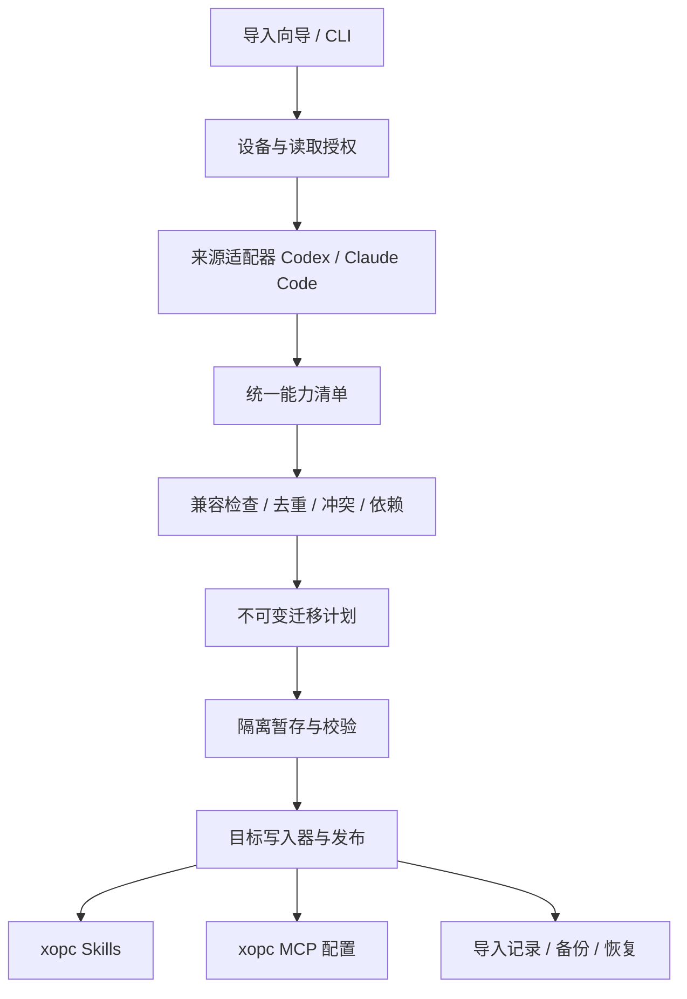

# xopc 外部能力导入技术方案

状态：设计草案，未实现。日期：2026-09-15。

范围假设：语音中的首期来源暂按 **Codex + Claude Code** 理解，scale 按 **Skills** 理解。产品名称尚待确认；来源适配器可按最终范围裁剪。本文不假设已验证 Codex 的 Import 界面实现。

## 1. 目标与关键决策

让用户把其他 AI 产品中已经积累的技能、工具连接和工作规则带到 xopc，并明确看到哪些可以使用、哪些需要调整。

产品入口名为「从其他产品导入」。一次导入是一个可预览、可追踪、可撤销的快照；后续源文件变化不自动同步。

关键决策：

1. 首期以 Skills 为核心，提供 Codex / Claude Code 本地来源适配；MCP 支持有限字段的配置草稿导入。
2. 规则、命令、插件依赖可以被识别并解释，但不承诺一键恢复其运行语义。
3. 已经通过 `.agents/skills` 被 xopc 读取的资源显示「已接入」，避免重复安装。
4. 导入默认先暂存，暂存内容不进入模型上下文、技能搜索或 MCP 运行时。
5. 用确定性的解析、转换和校验完成首期，不让 LLM 自动重写规则或猜测配置。
6. 导入记录独立于 xopc 内部版本升级迁移；不将交互式导入挂入启动 migration runner。

成功标准是「目标 Agent 能发现并使用所选能力，或者用户得到具体的补齐步骤」，而非目录复制完成。

## 2. 仓库现状与复用边界

以下结论来自本次源码检查：

| 已有能力 | 位置 | 对方案的影响 |
| --- | --- | --- |
| 用户和项目 `.agents/skills` 来源、优先级、真实路径去重 | `src/agent/skills/skill-sources.ts` | 复用来源盘点；项目兼容来源需要 workspace trust |
| xopc 受管技能目录、ZIP 安装、暂存目录切换 | `src/agent/skills/managed-store.ts` | 复用发布原语；当前覆盖后会删除旧目录，另加持久备份才能支持用户撤销 |
| 技能元数据与工具依赖检查 | `parse-skill-metadata.ts`、`skill-tool-gating.ts` | 复用校验；工具可见性检查不等于权限控制 |
| 技能启用配置 | `src/agent/skills/config.ts` | 配置按 `skill.name` 索引，环境变量可覆盖 enabled；不能仅靠 disabled 标志隔离暂存 |
| 项目技能安装、继承与信任 | `src/projects/project-skill-service.ts` | 保留项目作用域；复用项目目标解析和刷新入口 |
| MCP 规范化、Schema、OAuth 与运行时 | `src/config/mcp-config-normalize.ts`、`schema.ts`、`src/agent/mcp/` | 复用目标校验；必须逐字段做语义转换 |
| MCP Schema 未声明可保证停用的 enabled 字段 | `src/config/schema.ts` 的 `McpServerSchema` | 草稿存独立暂存区，未激活前不写 `mcp.servers` |
| 内部升级迁移 | `src/migrations/` | 不混入外部产品导入 |
| 已有技能安装 UI、文件选择 IPC | `web/src/features/skills/`、`electron/ipc/file-ipc.ts` | 复用组件与可信 renderer 校验，增加来源选择能力 |

额外实现缺口：当前技能配置写入辅助函数存在捕获错误后只记录日志的行为。导入事务需使用失败可感知、带版本检查的写入服务，不能将日志出现视为成功。

## 3. 首期兼容矩阵

| 内容 | 首期处理 | 迁移后状态 |
| --- | --- | --- |
| 标准 `SKILL.md` 和其本地资源目录 | 支持完整目录快照，保留相对路径 | 校验通过后可选择启用 |
| 已接入的共享 `.agents/skills` | 识别、去重，默认不复制 | 已接入；也可以选择转为 xopc 管理 |
| 用户 / 项目独立 Skills | 支持；用户明确选择目标作用域 | 用户目录或项目 `.xopc/skills` |
| MCP stdio / SSE / streamable HTTP 基础配置 | 支持配置草稿、字段映射、缺失依赖说明 | 待配置 / 待激活 |
| API key、OAuth token、Cookie、登录状态 | 不自动导入，凭据重新配置 | 待认证 |
| `AGENTS.md`、`CLAUDE.md`、规则目录 | 识别并展示清单；不自动注入提示词 | 暂不迁移运行语义 |
| Claude Code commands | 识别；含参数、预执行或特殊调用语义时不自动转换 | 待后续适配 |
| 插件内 Skills | 首期允许用户明确选择独立 skill 子目录；检查插件依赖 | 可移植项可导入，其余阻塞 |
| 完整插件、hooks、subagents、自动化 | 不激活、不运行；报告不支持项 | 暂不支持 |
| 会话历史、长期记忆、模型配置、权限策略 | 首期不迁移 | 暂不支持 |

MCP 项目级来源不能静默提升到全局：首期保存为带原始项目范围的草稿；若现有目标策略不能等价约束作用域，阻止激活。用户可以另行明确选择全局连接，界面展示影响范围。

未来的千问办公、WorkBuddy（语音名称待确认）、豆包办公等仅保留来源扩展位置，不在首期承诺其文件布局、API 或可导出范围。

## 4. 用户流程

入口放在设置「数据与迁移 → 从其他产品导入」，并在首次使用和 Skills 页面提供快捷入口。

1. **选择来源**：Codex / Claude Code，显示所在设备。支持选择配置根目录，避免只依赖默认路径。
2. **选择扫描范围**：用户级配置与用户明确选择的项目；不遍历整块磁盘。
3. **扫描结果**：按能力分组，显示来源、作用域、兼容状态和问题数量；默认选择可直接迁移且尚未接入的 Skills。
4. **预览迁移**：选择全局或项目目标；展示目标名称、完整文件清单摘要、转换差异、依赖和冲突决策。
5. **执行导入**：导入到隔离暂存区，结果逐项展示；可以重试失败项。
6. **启用与验证**：仅对兼容项提供启用；MCP 在用户触发连接测试后才可能启动进程或发起网络请求。
7. **结果与历史**：分别统计已导入、已启用、待补齐、已跳过、失败；支持打开技能、配置连接与撤销本次导入。

示例结果文案：发现 18 项；8 项已接入，6 项可导入，2 项需配置，2 项暂不支持。不能把 18 项都计为成功迁移。

UI 使用现有语义颜色、PopoverSelect 和 Skeleton；详细预览采用固定响应式外框与内部滚动区域。技术字段放在「查看详情」，主流程用「缺少 Python」「需要重新登录」等可操作说明。

### 设备边界

- Electron 本机模式：主进程文件选择 + 本机导入服务，通过可信 IPC 与受控读取授权连接。
- CLI：扫描 CLI 所在设备的用户目录或显式路径。
- 浏览器连接远程 Gateway：浏览器不能读取用户电脑上的默认目录；提供 ZIP 上传。服务器扫描必须单独选择「Gateway 所在设备」，不能声称扫描了本机。
- 本地授权句柄不能在远程 Gateway 上解析为本地路径；ZIP 中也不信任来源提供的绝对路径。

## 5. 总体架构



来源适配器只负责读取和标准化，不直接改写目标配置；目标写入器不理解外部产品的路径和格式。

建议模块：

```text
src/imports/
  types.ts
  sourceRegistry.ts
  importService.ts
  compatibility.ts
  planner.ts
  executor.ts
  recovery.ts
  sources/{codex,claudeCode}.ts
  readers/{local,archive}.ts
  targets/{skills,mcpDraft}.ts
  __tests__/
src/storage/sqlite/imports.ts
src/gateway/hono/routes/imports.ts
src/cli/commands/import.ts
web/src/features/imports/
electron/ipc/import-ipc.ts
```

首期 registry 静态注册两个内置适配器，不开放执行第三方导入插件。未来扩展产品时加 adapter；如果新增资产类型，再加对应目标 writer。

### 核心数据契约

```ts
type CapabilityKind = 'skill' | 'mcp' | 'rule' | 'command' | 'plugin';
type Compatibility = 'compatible' | 'needs_setup' | 'blocked' | 'unsupported';

interface ImportCandidate {
  id: string;
  sourceId: string;
  sourceVersion?: string;
  adapterVersion: string;
  kind: CapabilityKind;
  sourceScope: { kind: 'user' | 'project'; projectRoot?: string };
  sourceRef: string;
  contentHash: string;
  compatibility: Compatibility;
  findings: Array<{ code: string; message: string; field?: string }>;
  dependencies: Array<{ kind: string; name: string; required: boolean }>;
}

interface ImportPlan {
  id: string;
  version: number;
  sourceSnapshotHash: string;
  targetRevision: string;
  actions: Array<{
    candidateId: string;
    operation: 'skip' | 'create' | 'rename' | 'replace';
    targetScope: { kind: 'global' | 'project'; projectId?: string };
    targetName: string;
  }>;
  expiresAt: string;
}
```

`sourceRef` 是绑定来源授权的句柄，不接受客户端拼接任意服务器文件路径。兼容性、是否已存在、执行状态分别建模；不要塞进一个混用的 status。

## 6. 来源识别与转换规则

### 6.1 Codex

- 当前官方说明的共享位置为用户 `~/.agents/skills` 和仓库路径上的 `.agents/skills`；这些目录也可能被其他产品使用，来源展示为「共享 Skills」，不将其归属武断标成 Codex。[官方 Skills 文档](https://learn.chatgpt.com/docs/build-skills)
- 兼容探测用户指定 Codex 根目录及其 `skills` 子目录；`.codex/skills` 作为历史/本地布局候选，只有验证 `SKILL.md` 后才识别。不要扫描所有插件缓存。
- 仓库内嵌套作用域不可平铺成全局；首期仅发布能保持目标范围的项目根技能，嵌套范围无法表达时标为待处理。
- MCP 读取选定配置的 `mcp_servers`；显式映射 command、args、cwd、url、transport 与可支持的超时。审批策略、工具过滤、环境引用不直接透传；无法保持关键限制时阻止激活。[官方配置参考](https://learn.chatgpt.com/docs/config-file/config-reference)

### 6.2 Claude Code

用户级和项目级技能目录为 `~/.claude/skills` 与项目 `.claude/skills`。其 Skills 存在参数替换、子代理上下文、hooks 等扩展，不能仅因同有 `SKILL.md` 就判断等价。[官方 Skills 文档](https://code.claude.com/docs/en/skills)

处理规则：

| 结构 | 行为 |
| --- | --- |
| name、description、正文、相对资源 | 保留；重新校验目标格式 |
| disable-model-invocation | 保留，验证自动发现与显式调用行为 |
| allowed-tools | 不转换为 xopc 自动授权；提示审批行为差异 |
| context、agent、hooks、动态命令、参数或专用变量 | 首期不模拟；遇到执行语义依赖则阻塞启用 |
| 未知字段 | 保存在原始快照，报告未解释字段；仅已确认纯展示字段可忽略 |

MCP 用户配置以及按项目路径保存的本地配置位于 `~/.claude.json`，项目共享配置位于 `.mcp.json`。只提取 MCP 子树，不把整个用户文件上传或写入迁移记录。[官方 MCP 文档](https://code.claude.com/docs/en/mcp)

### 6.3 Skills 的兼容判断

- 保留脚本、模板、references、assets 和相对目录，不只复制 Markdown。
- `name` 与目录名分别校验；重命名必须同时处理运行时名字、配置索引和内部可识别引用，并给出 diff。
- 不对正文执行全局字符串替换，例如不能把所有 Bash 字样替换成 exec_command。
- 检查必需工具、解释器、操作系统、环境变量名和文件引用；未知依赖显示「未验证」，不能承诺运行效果一致。
- 静态检查只能建立就绪候选，真实能力验证使用用户触发的代表性任务。
- 原始运行权限不能随技能迁移；工具访问仍由目标 Agent 策略决定。

### 6.4 MCP 草稿

- 创建与原始配置分离的目标草稿，通过 `McpServerSchema` 与运行时语义检查。
- 环境变量仅迁移名称和可理解的引用关系；常量值、命令参数、URL 查询串、headers 均可能含秘密，必须逐字段检查，不能只过滤 token 字段名。
- 源配置的 shell 包装命令原样显示，不在扫描/导入中执行；命令存在性检查不运行安装器。
- 对源端禁用、deny/allow 列表、审批限制、特殊 transport 进行显式映射；不能保持限制时保留草稿。
- OAuth 在 xopc 重做授权；目标不支持的认证与 transport 组合直接标为阻塞。
- 激活才通过现有配置服务写入 `mcp.servers` 并刷新运行时；不能借 Schema 的 catchall 塞入停用字段后假设生效。

## 7. 去重、冲突和作用域

去重先按真实路径识别同一来源，再对排序后的文件清单、相对路径和字节计算内容摘要；大小写与 Unicode 名称冲突按目标文件系统检查。

| 情况 | 默认行为 |
| --- | --- |
| 同路径已接入 | 跳过，显示已接入 |
| 同目标、同内容 | 幂等跳过 |
| 同名、不同内容 | 保留已有项，让用户选择改名或替换 |
| 不同来源同名 | 生成来源前缀建议，仍校验技能逻辑名称冲突 |
| 同内容、不同作用域 | 分别保留作用域，不仅按哈希合并 |
| 来源更新但目标被编辑过 | 三方比较：上次导入版本、当前来源、当前目标；禁止自动覆盖 |
| 项目资源拟导入全局 | 默认保持项目范围，用户明确改动才允许扩大 |

全局技能发布到 `resolveSkillsDir()`，项目技能发布到 `resolveWorkspaceSkillsDir()`；不硬编码 `~/.xopc`，尊重状态目录配置。Agent 选择通过现有能力配置绑定，不引入第三层配置或另外的 Agent registry。

注意现有 xopc-global 优先级高于 agents-global：从已接入来源创建受管副本会改变生效来源。预览必须显示此变化；对同名替换，暂存期间保持旧技能可用，发布时执行原子切换。

## 8. 执行、持久化与撤销

建议 SQLite 增加 `import_jobs`、`import_items`：记录来源/适配器版本、plan hash、目标范围、执行状态、脱敏问题、前后摘要、备份引用、幂等键和时间。文件快照保存在状态目录 `imports/<jobId>/`，不进入技能扫描根目录。

流程：

1. 授权范围内读取、限制资源体积，建立文件快照；读取前后验证变化，避免不一致内容。
2. 从冻结快照产生计划，绑定目标版本、选择结果与适配器版本。
3. 执行时校验源/目标版本和计划有效期；变化返回 `409 plan_stale`，重新预览。
4. 将内容复制到隔离区并重新校验；记录 `staged`。此时不改变生效配置。
5. 激活时锁定目标目录和配置，保存涉及项的 before-image，写入操作日志，再发布。
6. 技能目录按资源原子切换，配置通过统一加锁/版本检查服务修改；更新记录，刷新 catalog。
7. 进程启动时恢复未完成的发布：根据 journal 与目标摘要完成收尾或补偿，不重复发布。

文件系统和 SQLite 不能组成真正的单一事务，采用可恢复的日志与补偿。一个技能的所有文件是最小原子单元；必须一起变更的依赖作为一组。无依赖项允许部分成功，结果逐项解释。

撤销只恢复本次变更过的文件和配置字段。目标摘要与导入后摘要不同表示用户已编辑，返回撤销冲突，不能恢复整个旧配置覆盖用户其他改动。导入后新授予的 OAuth 凭据不随普通文件回滚删除。

备份默认保留 30 天（建议产品默认值），界面显示撤销到期时间；用户可提前清理。暂存和备份使用仅当前用户可读权限；报告不包含源凭据。原始 skill 中发现疑似秘密时先阻止复制相关项，提供排除或用户处理后的重新扫描。

## 9. API 与 CLI

以下为建议新增接口，均需 Gateway 认证、输入校验和速率/上传限制：

| 接口 | 作用 |
| --- | --- |
| `GET /api/imports/sources` | 当前设备支持的来源与读取模式 |
| `POST /api/imports/scans` | 使用 sourceId、授权句柄、项目范围或上传 ID 发起扫描 |
| `GET /api/imports/scans/:id` | 分页清单、扫描进度和诊断 |
| `POST /api/imports/uploads` | 上传隔离 ZIP，返回 uploadId |
| `POST /api/imports/plans` | 选择候选项、目标范围与冲突决策，生成不可变计划 |
| `POST /api/imports/jobs` | 按 planId + version + idempotencyKey 执行暂存导入 |
| `GET /api/imports/jobs/:id` | 状态、逐项结果和可用操作 |
| `GET /api/imports/jobs` | 导入历史 |
| `POST /api/imports/jobs/:id/activate` | 激活指定就绪项，重验目标版本与依赖 |
| `POST /api/imports/jobs/:id/rollback` | 按项撤销，返回冲突信息 |

错误码至少包括：`source_not_found`、`source_permission_denied`、`unsupported_format`、`scope_mismatch`、`dependency_missing`、`conflict`、`plan_stale`、`limit_exceeded`、`rollback_conflict`。

Source/scan/plan/job ID 均绑定创建者或授权会话；过期授权不可被新请求复用。日志使用 `createLogger('ImportService')`，只写 jobId、sourceId、itemId、阶段、数量和错误摘要。

所有路径加入 `lazy-bundles.ts` 的专用 `/api/imports` matcher，并为全部路由族补正例和附近路径反例；通过真实带认证 Gateway 请求验证，不只测 route module。

CLI 与 UI 共用同一 service，建议命令：

```sh
xopc import scan --source claude-code
xopc import plan --scan <scanId> --target-project <projectId>
xopc import apply --plan <planId>
xopc import activate --job <jobId>
xopc import history
xopc import rollback <jobId>
```

`apply` 只执行冻结计划；脚本化使用必须明确冲突策略，不默认覆盖。详细 CLI 参数在实现时按现有 commander 自注册模式落地。

## 10. 文件与输入边界

这是读取任意用户资产的功能，以下属于必要实现约束：

- 不在扫描、预览、暂存阶段执行 Skill、hook、安装脚本、MCP 命令或动态配置 helper。
- ZIP 拒绝路径穿越、绝对路径、链接逃逸和设备文件；同时限制压缩体积、解压体积、文件数量和递归深度。
- 本地 skill 根目录可解析为实际位置并绑定授权；根内符号链接仅允许指向已授权树内，并复制为普通内容；跨树链接显示缺失依赖。
- 发布时重新校验目标父目录 realpath，防止计划生成后目录被替换为链接。
- JSON/TOML/YAML 采用纯数据解析和 Schema 校验，禁止执行代码及无界别名展开。
- 建议默认单项 15 MiB（与现有 ZIP 上限对齐），批次解压总量 100 MiB、文件数 5,000；均作为可配置限制，通过真实 fixture 调整。
- 不在前端预览中渲染不受限制的 HTML、远程资源或链接脚本；文件路径等敏感元数据按设备范围展示。

## 11. 实施拆分与验收

### M1：核心扫描与计划

两个来源适配器、授权读取、统一清单、兼容诊断、作用域检查、去重与冻结计划。先提供 service 测试与 CLI，使用脱敏固定 fixtures，不能依赖开发机真实配置。

### M2：Skills 导入闭环

隔离暂存、逻辑名称冲突、原子发布、Agent/项目选择、已有目录接入识别、审计和可恢复撤销。验证参考资源与脚本路径仍能解析。

### M3：界面与 MCP 草稿

导入向导、历史/结果、Electron 本机选择、远程 ZIP、MCP 字段映射、重新配置凭据、用户触发连接测试。

### M4：发布验收

- Codex / Claude Code 纯标准 Skills 均可被目标 Agent 发现与显式使用。
- 已接入技能不重复发布；同名不同内容不静默覆盖，名称配置不误伤另一项。
- 项目技能保持作用域，未信任项目不因导入自动变成可信。
- 含动态预执行、hooks 或不能等价实现的作用域/权限项明确阻塞激活。
- 扫描与导入阶段进程启动/网络调用监测为零；主动 OAuth/连接验证单独计入。
- 重复请求幂等；每个发布阶段注入崩溃后，重启能恢复一致状态。
- 撤销不丢失导入后的用户修改；备份过期有清晰结果。
- ZIP 穿越/解压炸弹、符号链接逃逸、敏感配置、损坏 frontmatter、目标目录只读均有用例。
- macOS / Windows / Linux 路径、权限、大小写行为通过 fixture 和平台测试。
- 真实 Gateway 认证入口及 lazy bundle 路由测试通过；UI 使用现有 lint、type-check 和 build 验证。
- 性能用固定 100 个技能 / 5,000 文件的本机与 ZIP fixture 测量；扫描可取消且进度有反馈，发布前再据目标设备设耗时门槛。

粗估工作量：1 名全栈工程师加测试支持约 3–4 周，前提是现有能力刷新与配置锁可直接复用；这是方案估算，不是排期承诺。若需要压缩首发，完整保留 M1/M2 的 Skills 闭环，把 MCP 草稿和批量跨设备导入移到后续小版本。

## 12. 后续扩展

新增来源先建立实测 fixture 与兼容表，再实现 `detect → scan → normalize`，复用计划、冲突、暂存、发布、回滚和界面。

对办公产品优先支持公开导出包或官方 API；没有稳定出口时明确只能手动导出，不假设可读取私有数据库。文档模板、工作流和知识库属于新的资产类型，需要分别设计权限、附件和运行语义映射。

后续可增量加入：规则作用域转换、简单命令到 Skills、插件依赖拆分、来源更新对比。持续同步应作为独立能力：必须处理源删除、双向编辑和版本冲突，不隐含在首期 Import 中。

最终建议：**首期交付两个来源的 Skills 迁移闭环，附有限 MCP 配置草稿支持；统一导入引擎为后续办公产品留出接口。**
