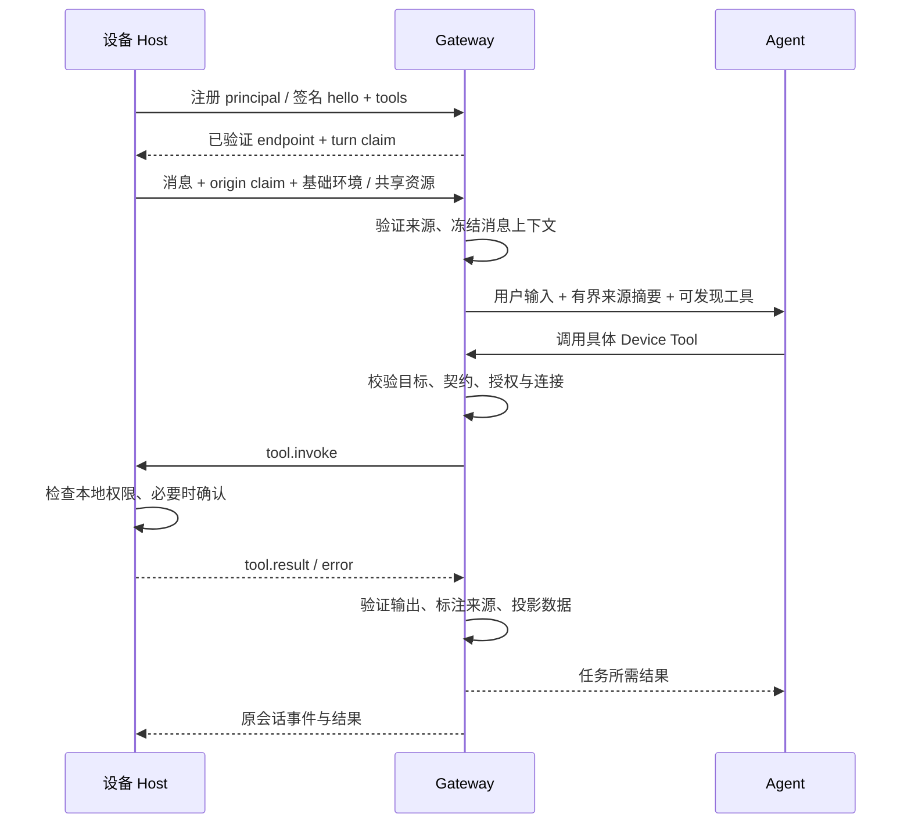

# Device Tools 技术方案

> 2026-10-11 · 分阶段实施中。配套 [产品方案](./device-tools-product-spec.md)。基于当前 Endpoint Tools、原生 external tool 暴露及会话输入契约设计；新增字段、API、模块和数据表均为拟议接口，不代表已实现。

实施进展与可运行 Bridge 示例见 [实现记录](./device-tools-implementation.md)。

## 1. 架构决策

保留 `EndpointToolRuntime` 作为唯一端侧能力执行链路。Device Tools 是其产品名称，不增加平行 MCP Server 或设备执行运行时。能力注册后通过现有 `materializeNativeExternalTools` 暴露为具体 `device__...` 原生工具，沿用 deferred 暴露与标准 tool search；不重新接入已被该链路拒绝的旧 `xopc_tool_execute` 路径。

新增通用语义、目标解析和消息来源上下文；端侧只实现声明式工具适配器。语义 ID 由受信服务端目录映射，具体工具名继续满足 endpoint kind 前缀约束。



## 2. 身份与所有权

沿用注册 principal、endpointId、connectionId。首版 UI 的“设备”对应受信 principal，不新增自动识别物理设备的系统。PC App 与浏览器扩展可作为独立入口显示；若要归并，后续通过明确配对关联实现，不能按 IP/昵称合并。

消息来源必须满足两项：claim 属于当前有效连接；该 endpoint 与提交请求的 Gateway principal 具有已验证关系。不能仅验证 token 后接受另一个设备的 claim。owner、device 与系统来源按现有身份类型分别处理；系统运行没有来源设备时明确标为 unknown/system。

当前 device 凭证对跨设备绑定有限制。首版保持此限制；M2 引入经 owner 确认的会话目标授权，在列表、选择、describe、execute、结果读取各阶段校验。不能通过放宽 bindings 路由检查实现跨设备访问。

Gateway 管理的 nickname 单独持久化，不改签名 principal.displayName。改名和撤销需 expectedRevision；改名仅更新用户标签，撤销驱动访问凭证、连接、工具目录、授权及缓存引用失效。

## 3. Device Manifest 与可信能力目录

Manifest 是现有 principal + hello.tools + 服务端映射的统一视图。M1 不让客户端新增任意 policy，也不要求 v2 hello 增加自由字段。

```typescript
interface TrustedDeviceCapability {
  semanticId: string;             // device.power.read
  semanticVersion: number;
  wireToolName: string;           // mobile.device.get_power
  targetDefault: 'turn_origin' | 'session_bound' | 'resource';
  policyId: string;
  inputSchema: object;
  outputSchema: object;
  constraints: object;
  retention: 'summary' | 'bounded_history' | 'ephemeral';
}
```

目录由 Gateway 内置契约或已安装受信 extension 提供。客户端工具 descriptor 仍包含 effect、sensitivity、confirmation、前台要求、permissions、超时、取消与输入输出 schema；由策略逐项验证。硬件约束使用有界领域契约，如显示尺寸、数据单位和操作频率，不接受任意 prompt 指令。

能力生命周期：声明 → 验证 → 可发现 → 调用时可执行/不可执行。支持、权限、在线和前台是不同状态；拒绝一次读取不删除能力支持信息，也不表示永久授权。

M1 工具目录在连接 hello 中声明；需要变更时重连，移除旧目录并取消/拒绝旧 revision 调用。后续增量目录更新须有 connection 绑定、catalog revision、整体替换与验证原子性，不在首版引入。

## 4. 消息来源上下文

扩展 `SessionInputContent` 的可选 `endpointContext`，严格白名单解析：

```json
{
  "version": 1,
  "capturedAt": 1791712800000,
  "timezone": "Asia/Shanghai",
  "locale": "zh-CN"
}
```

身份仍在现有 command.origin 中。服务端生成 `TurnDeviceContext`，包括来源 principal/endpoint、平台、Gateway 昵称、发送时环境与经过筛选的能力摘要。完整 schema 不放入 prompt，token/公钥/connection secret 不持久化或发送模型。

来源摘要作为本轮环境进入 embedded execution context；持久化到 input 与对应用户 transcript metadata，历史模型上下文注明“该条消息来源”。不要将每条历史来源都拼进当前系统提示词。昵称等可编辑字符串有长度限制、JSON 转义并明确视为数据。

标准摘要最多建议 512 字符、能力摘要最多 6 类；这个限制不影响工具目录完整性。App 版本保留为兼容与诊断信息，不默认注入模型。

用户显式共享的位置/选区/页面走各自有界资源契约，不塞进基础环境对象。浏览器复用已有 browserContexts/appContext；没有共享资源时，浏览器来源不能等同于当前标签页正文。

start、append、steer、临时会话和实时语音都遵守同一来源语义。M1 覆盖文字与语音转文字；实时语音随后接入。替换历史输入时保留该输入来源，不自动采集当前敏感数据；改变共享快照需要用户重新共享。

冻结与幂等：首次接受时冻结身份快照与 input.endpointContext；重试可刷新 token，但 endpoint 来源必须仍一致。当前 `sessionCommandIdentity` 排除了整个 origin，新增实现需将来源 endpointId 纳入逻辑身份、仅排除传输 token；同一 clientMessageId 改变 endpoint 或快照应冲突。owner 查询已接受回执不要求旧连接仍在线。

## 5. 工具暴露与目标解析

新增宿主 `DeviceTargetResolver`，在发现、materialize、describe、execute 中共用规则。语义能力目录指定默认范围；解析结果包含 endpoint、principal、connection、binding revision、resource revision、授权 revision。

| 范围 | 解析规则 |
| --- | --- |
| turn_origin | 当前输入已验证来源；仅在当前来源支持该能力时暴露 |
| session_bound | 显式绑定优先；保持既有绑定离线不回退行为；无绑定时可按既有来源规则 |
| resource | 使用本条消息共享的 resourceRef，或由用户选择得到的范围 |
| explicit_target | 仅从经权限过滤的候选选择；由宿主授权得到有界引用 |

工具名称继续通过既有原生 materializer 生成；多设备同能力的工具身份必须包含目标摘要/引用，名称稳定且满足现有长度限制。连接/revision 改变更新 contract fingerprint；旧物化工具调用失败，不偷偷换目标。

首版将当前来源工具和既有绑定工具形成有界候选集合，按各能力目标策略暴露。其他设备仅在 M2 明确选定/授权后进入该轮目录。现有 EndpointToolProvider 只选一个 endpoint，需要扩展而不是绕开它的执行校验。

模型不能以 raw endpointId 覆盖调用身份。候选引用和 UI 选择都必须经宿主验证；解析失败时向用户请求目标。未支持的能力不应映射到 Gateway 主机的同名工具。

## 6. 授权与执行生命周期

M1 复用可信策略：有界设备状态使用无敏感字段的基础读取契约；个人读取使用 `personal.foreground-read` 单次确认；选择器使用 mediated 策略；写入沿用明确操作确认。不要直接修改既有 get_info 的文本输出而破坏可信 schema，结构化新增工具采用新的固定契约。

M2 增加 `DeviceGrant`：请求方、conversation、target principal/endpoint、能力、资源范围、接收范围、参数约束、expiry/revision 与撤销状态。首版 M2 的跨端授权为单次，会话授权留 M4。精度/资源扩大不复用旧 grant。

执行流程：验证输入 → 复核身份/目标/目录 → 校验授权及前台条件 → 创建 invocation → 端侧 received → 端侧 authorize/confirm → 采集或操作 → 回传 → 验证输出 → 投影 → 结束。等待用户确认与操作执行分别计时，都受总 deadline 限制。

当前 Host 要求 confirmationRequired 与本地 descriptor 一致；如果后续基于 grant 跳过重复确认，需同时扩展协议与客户端验证，不可仅在服务端将 always 改成 never。

只读操作可在用户重试后重新调用；写入不得因超时自动重放。继续沿用 external operations 的幂等及恢复规则。操作应用后断线时保存结果未知状态，按回执/检查目标核实；确认结果前不声称成功或失败。取消不承诺撤销已经发生的外部副作用。

## 7. 统一结果与数据投影

具体工具结果通过现有 text/json/file 通道传输；结构化读取使用有界 JSON 领域输出。Gateway 包装 `DeviceObservation`：

```typescript
interface DeviceObservation {
  version: 1;
  observationId: string;
  capability: string;
  capabilityVersion: number;
  source: { principalId: string; endpointId: string; resourceRef?: string };
  capturedAt: number;
  receivedAt: number;
  validUntil: number;
  status: 'ok' | 'partial' | 'unavailable';
  quality: { cached: boolean; accuracyMeters?: number };
  data?: unknown; // already validated by the specific capability schema
}
```

身份与 receivedAt 由宿主写入；采样时间经时钟偏差检查，validUntil 由可信新鲜度规则计算。不同场景可限制更短有效期，但不能让模型扩大上限。单位、坐标系、未知值语义按领域 schema 明确；电量百分比未知不返回 0。

`DeviceResultProjector` 同时产生任务输入、UI 显示和存储视图。新鲜度、保留期、授权期分别管理；复用缓存前重新验证授权。缓存键包括 Gateway、请求方、目标、资源、能力版本与参数范围。

M1 仅处理可按契约保存的基础摘要与用户显式共享的有界选区。M2 位置实现采用任务处理器：原始坐标只进入 Gateway 当前调用内存，由固定用途的查询处理器消费，返回模型前即生成有界摘要，不产生通用临时坐标引用。日志/审计不含正文，历史、FTS、导出、compaction 和记忆输入只接收摘要。未来其他个人资源如确需临时引用，应限定 run/授权/TTL，不能通过一般 transcript replay 恢复。

需核对并实现模型临时输入与 `guardSessionManager` → SQLite append 的投影边界，覆盖流式缓存、FTS、导出、compaction 和记忆提取。仅在 UI 隐藏敏感字段不能满足这一契约。如果该边界未完成，相关敏感能力不进入交付范围。

错误继续映射既有 endpoint error code；新增原因例如定位开关关闭通过固定领域错误字段表达。不要将传输错误、用户拒绝、未知读数、样本过期混为同一个 unavailable。

## 8. 数据、API 与事件

沿用 principal、instance binding、session binding、invocation audit 和 session input SQLite 表；按当前 migration 序号新增，不固定未来版本号。

| 数据 | 新增/扩展方向 |
| --- | --- |
| 设备用户设置 | nickname、revision；关联现有 principal |
| input 来源快照 | 对应 input 的上下文与可信来源，绑定逻辑消息身份 |
| 最后能力目录摘要 | 管理页离线展示用，含采样时间；不得用于执行 |
| DeviceGrant | M2 跨端单次范围与状态；与实际访问主体关联 |
| 临时 observation | M2 到期清理、撤销失效与授权隔离；不进普通历史索引 |

新增/扩展 API 均归现有 endpoint-tools route family：

| API（拟议） | 行为 |
| --- | --- |
| GET /api/endpoint-tools/devices | 扩展昵称、能力状态摘要，不对设备凭证返回无权限的其他设备数据 |
| PATCH /api/endpoint-tools/devices/:principalId | 修改昵称，expectedRevision |
| POST /api/endpoint-tools/target-authorizations | M2 形成单次跨端授权，须 owner/获准审批主体确认 |
| DELETE /api/endpoint-tools/grants/:grantId | 撤销授权，终止相关未执行操作 |
| 既有 /api/sessions/:id/inputs | 接受 endpointContext，处理新消息身份 |

不提供绕过 Agent/策略的通用 execute REST 接口。审计与诊断继续复用既有 invocation 查询，新增作用域过滤与自然语言能力名。

新增 realtime 目录/授权变更事件用于刷新 UI；payload 不含读取数据，按访问范围投递。数据结果走既有 invocation/会话通道，保留 inputId/runId/toolCallId 的关联；Agent 只能使用关联到当前授权的结果。

## 9. 版本与端侧实现

M1 尽量保持现有 endpoint protocol v2，新增工具在可信目录先部署，消息上下文通过 compatibility capability（拟议 `turnDeviceContextV1`）协商。旧客户端缺上下文时按未知环境处理；新客户端对旧 Gateway 隐藏对应功能。当前 strict schema 不允许假定未知字段可忽略。

hardware/bridge 新 kind、授权字段或实时目录更新属于后续协议变更；正式实现前明确版本支持范围并同时更新 Gateway、Host、realtime decoder 与策略。不得伪装 mobile kind 获得硬件权限。

| 端 | 实施点 |
| --- | --- |
| 鸿蒙 | 已有真实 origin，补工具 Host/原生能力模块；正确发送前后台状态 |
| Android | 已有 origin，补 Host/工具模块；运行时权限与取消绑定生命周期 |
| iOS | 先将 system/cli 来源改为真实注册 endpoint，再接 Host/原生工具 |
| PC | 复用 endpoint-tools-client 的桌面定义，新增有界状态读数，接既有文件操作 |
| 浏览器 | 复用已有 page context 和权限范围，补资源 revision/标签选择与端侧状态 |
| 硬件 | M3 支持直接 Host 或受信 Bridge；Bridge 为每个硬件保留资源身份与授权 |

角色上允许 chat-input、tool-host、output-surface 组合；M1 不新增 wire 角色 enum，由已有客户端/工具契约体现。硬件角色协商在 M3 正式定义。

## 10. 代码落点与验证

| 现有位置 | 变更 |
| --- | --- |
| packages/gateway-contract/src/session-input-command.ts | 输入环境契约、身份摘要排除 token 但保留来源 |
| packages/endpoint-tools-protocol/src/index.ts | 新工具领域契约；后续版本协商 |
| packages/endpoint-tools-client/src/index.ts | 延用 Host；后续授权证据验证 |
| src/endpoint-tools/policy.ts、registry.ts、runtime.ts | 可信语义映射、目录状态与撤销联动 |
| src/agent/external-tools/endpoint-provider.ts | 多目标解析，保持 revision 和权限验证 |
| src/agent/embedded/external-tool-discovery.ts | 正确物化目标工具与刷新 fingerprint |
| src/gateway/hono/routes/session-command-handler.ts、session-input-handler.ts | 两种输入入口同一校验与上下文准备 |
| src/gateway/service/session-input-coordinator.ts、src/storage/sqlite/session-input-repository.ts | 冻结、队列、重试和来源持久化 |
| src/gateway/hono/routes/endpoint-tools.ts | 设备视图、昵称与后续跨端授权 |
| web/src/features/endpoint-tools/、聊天会话信息 | 设备能力、共享、调用与来源 UI |

拟议新模块：`src/endpoint-tools/capability-catalog.ts`、`target-resolver.ts`、`turn-context.ts`、`result-projector.ts`；M2 再加入 `grant-service.ts`。职责分别是可信契约、目标、输入上下文和输出生命周期，不建立万能设备服务。

M1 必测：三端 start/append origin；claim/request principal 不匹配；手机来源加电脑绑定；原生 tool materialize/deferred 调用；来源更换导致幂等冲突；断线/revision 旧工具拒绝；nickname 注入内容作为数据；缺失读数与真实 0 区分；明确资源选择；旧 Gateway 协商回退。

M2 必测：跨设备授权范围、撤销与资源扩张；精确数据各持久化出口；写入不重复执行；未知结果恢复；流式事件按会话/授权隔离。M3 验证硬件身份与真实采样，M4 验证耐久事件、背压、订阅取消和后台限制。

新增或调整 API 必须更新 lazy-bundles matcher 及正/负映射测试，并用运行中的 Gateway 验证认证请求。验证包含有价值的端到端用例，不以直接路由测试替代真实请求链路。

发布门槛：各阶段的产品场景、契约校验、原生权限与真机检查完成后独立验收；设备类型与平台 API 可用性按实现时官方资料核对。当前仅交付设计，无运行代码变更。
