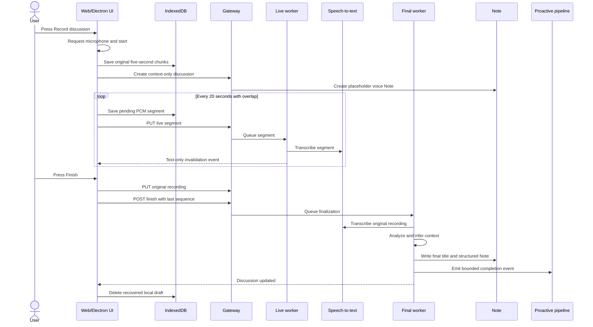
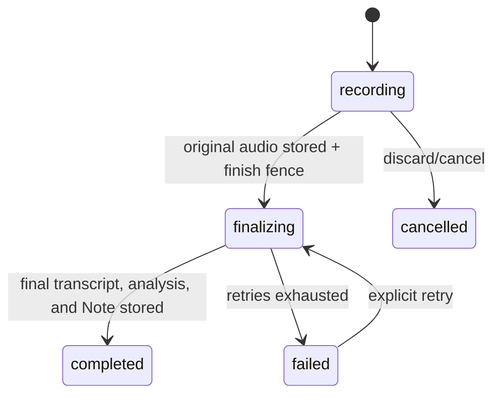

# One-click discussion capture

> Status: implemented MVP. The product has no pre-recording form, review queue, or action-conversion compatibility path.

## Product contract

The user presses **Record discussion** and speaking starts immediately after microphone permission. The only exceptional gate is a workspace-level consent acknowledgement shown once per policy version.

While recording:

- the original recording is persisted as five-second chunks in IndexedDB;
- overlapping 20-second PCM segments are uploaded for live transcription;
- the Note displays the assembled live transcript without rewriting its Markdown for every segment;
- AI may replace the placeholder title and infer a project when confidence is high;
- an inferred project link is visible and can be undone.

When the user presses **Finish**:

- the original recording is uploaded once and stored as the Note audio attachment;
- the server fences the final segment sequence;
- the original recording is transcribed again as the authoritative transcript;
- AI generates the final title, summary, key points, decisions, actions, risks, and open questions;
- the Note is updated directly and marked processed;
- a bounded completion event enters the proactive follow-up pipeline.

The user supplies audio. AI handles title, structure, and project context. There is no mandatory metadata form and no review page.

## Scope

Included:

- Web and Electron renderer entry points;
- one-time consent policy acknowledgement;
- pause, resume, finish, and 30-minute hard limit;
- local recovery after refresh or failed upload;
- live transcript projection in the recorder and Note detail;
- final authoritative transcription and automatic Note organization;
- exact-name and high-confidence model project inference with Undo;
- durable workers, leases, bounded retries, realtime invalidation, and metrics.

Deferred:

- speaker identity and diarization;
- people or relationship graph;
- calendar and participant resolution;
- system-audio capture;
- automatic external messages, assignments, or calendar writes;
- recordings longer than 30 minutes.

## End-to-end flow



## Client architecture

`GlobalDiscussionCaptureHost` owns the cross-route experience. The sidebar dispatches the existing capture event; no route or modal form is required.

`useDiscussionRecorder` separates two audio paths:

1. `MediaRecorder` produces the original compressed chunks. These remain local until the server confirms the original recording attachment.
2. `LivePcmSegmenter` uses an `AudioWorklet` to create overlapping WAV segments for low-latency STT. These blobs are temporary and deleted after successful upload/transcription.

IndexedDB `xopc-discussion-drafts` has three stores:

- `drafts`: recording metadata and optional server discussion id;
- `chunks`: authoritative local MediaRecorder chunks;
- `segments`: pending live WAV uploads.

On startup, an unfinished draft is surfaced with **Recover** and **Discard**. Recover retries pending segments, uploads the original audio, and continues finalization. Discard cancels an active server capture before deleting local data.

## API

All endpoints use gateway authentication.

| Method | Route | Purpose |
|---|---|---|
| `GET` | `/api/discussion-capture/settings` | Read consent policy state |
| `PUT` | `/api/discussion-capture/settings` | Acknowledge the current policy version |
| `POST` | `/api/discussions` | Idempotently create a recording and placeholder Note |
| `GET` | `/api/discussions/:id` | Read canonical state |
| `GET` | `/api/discussions/by-note/:noteId` | Resolve a Note's discussion |
| `GET` | `/api/discussions/:id/transcript` | Read assembled live segments |
| `PUT` | `/api/discussions/:id/segments/:sequence` | Upload one checksummed WAV segment |
| `PUT` | `/api/discussions/:id/recording` | Upload the authoritative original recording |
| `POST` | `/api/discussions/:id/finish` | Fence the sequence and start finalization |
| `POST` | `/api/discussions/:id/retry` | Retry a failed finalization stage |
| `POST` | `/api/discussions/:id/cancel` | Cancel an active local capture |
| `DELETE` | `/api/discussions/:id/audio` | Explicitly delete retained audio |
| `DELETE` | `/api/discussions/:id/project` | Undo an AI-inferred project link |

Create accepts only machine/runtime context:

```json
{
  "clientRequestId": "local-draft-uuid",
  "contextProjectId": "optional-project-id",
  "consentPolicyVersion": 1,
  "source": "web"
}
```

It does not accept a title, recording type, language choice, or per-recording consent checkbox.

## Persistence and state

Migration `082_one_click_live_discussions.sql` replaces the previous discussion schema instead of carrying compatibility columns or conversion tables.



`discussion_captures` stores workflow state, authoritative transcript/analysis, generated title, optional project inference metadata, lease data, and audio retention state.

`discussion_transcript_segments` stores ordered temporary segment audio and live transcription state. Segment audio is removed after final completion; the original Note attachment remains until explicit deletion.

`discussion_capture_settings` stores the current consent policy version and acknowledgement timestamp for the workspace.

## Transcript and project inference

Live segments have a one-second overlap. Assembly removes repeated boundary text and always orders by sequence. The final transcript never uses live text as evidence; it is generated from the original attachment.

Project inference applies the simplest safe rule:

1. exact active-project name mention wins with score `1.0`;
2. otherwise accept the model's first candidate only when confidence is at least `0.85` and exceeds the alternative by at least `0.15`;
3. otherwise leave the Note unlinked.

Context supplied by a project page is marked `context` and is not presented as an AI inference. Only `exact_name` and `model` links can be undone through the inferred-project endpoint.

## Durability and privacy

- Create and segment upload are idempotent by client request id and sequence/checksum.
- Original upload rolls back the Note attachment and Markdown reference together when persistence fails.
- Workers use conditional state updates, leases, three bounded attempts, and stage-aware retry.
- Provider calls and file IO never run inside SQLite write transactions.
- Realtime payloads contain identifiers and status only; transcript text is fetched from authenticated routes.
- Proactive completion events contain bounded counts and identifiers, not raw transcript text.
- The consent acknowledgement is explicit but does not add friction to subsequent recordings.
- Audio deletion is explicit and does not remove the resulting Note or transcript.

## Verification

Required checks for changes to this feature:

```bash
pnpm vitest run src/discussions/__tests__/service.test.ts
pnpm vitest run src/gateway/hono/routes/__tests__/discussions-routes.test.ts
pnpm vitest run src/storage/sqlite/__tests__/migrations.test.ts
pnpm run typecheck
pnpm --dir web run type-check
pnpm --dir web run lint
pnpm --dir web run build
```

Browser acceptance covers first-use consent, immediate microphone request, recording controls, live transcript projection, finish/failure feedback, Note navigation, and local draft recovery.
