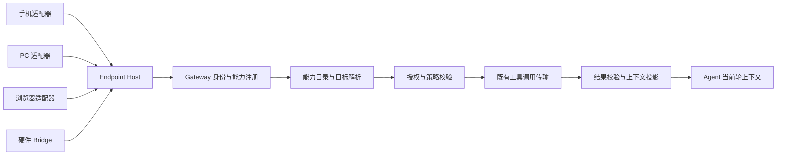

# 通用设备上下文与能力：产品和技术方案

> 设计稿，2026-10-11，尚未实现。适用于手机、PC、浏览器及未来硬件。此前的定位/天气方案是本框架的一个应用场景；平台调研与位置交互细节见 [手机对话上下文](./mobile-conversation-context.md)。

> 已收敛为正式 [产品方案](./device-tools-product-spec.md) 与 [技术方案](./device-tools-technical-spec.md)。本文保留概念与讨论记录；实现以正式方案为准，包括现有原生 Device Tool 暴露路径、M1/M2 范围与消息来源幂等规则。

> 产品与协议参考见 [Muse、WorkBuddy 与 OpenClaw 调研](./device-agent-product-research.md)。公开实现支持采用 Device Tools 与消息 origin 两条关联链路；presence 作为独立辅助信号，不能替代消息来源。

## 1. 目标

让 Agent 根据任务理解用户当前设备与环境，并使用被授权的设备能力：手机位置、电量，电脑系统状态、选中文本，浏览器当前页面，未来硬件的传感器读数等。

采用 **设备身份 + 能力声明 + 受控读取 + 本轮上下文** 的架构。设备类型决定实现方式，能力决定 Agent 可以做什么。不为每个设备建立一套独立的提示词字段，也不因为设备连接就采集它的全部信息。

能力可扩展，但授权和数据语义必须明确。框架保证发现、路由、读取、结果解释和生命周期一致；不同系统的可访问范围及原生权限仍由适配器决定。

### 1.1 推荐入口：Device Tools 与消息来源上下文

Agent 使用端侧信息与完成端侧操作，统一通过 **Device Tools**。这里是现有 Endpoint Tools 的产品称呼与语义扩展，不另建一套调用传输。

各端连接时向 Gateway 注册能力；Gateway 验证身份、契约及策略，将本轮可发现的能力暴露给 Agent。Agent 根据任务发现、了解并调用具体工具。注册能力只说明「可以做什么」，不自动读取或上传能力对应的数据，也不直接授予执行权限。

每条消息同时携带经验证的来源端信息。这和工具注册是两个职责：工具解决「怎么获取数据/执行操作」，消息来源解决「用户说这台设备、这里、当前页面时指什么」。不能要求 Agent 先调用一个工具才能知道用户从哪一端发消息。

本轮上下文建议由宿主生成：

```text
消息来源：我的手机 · mobile · HarmonyOS
本条消息的时区/语言：Asia/Shanghai · zh-CN
默认执行目标：工作电脑（用户已绑定）
当前来源可发现的能力摘要：设备状态、位置读取
```

这个摘要表达来源与能力支持，不声称 Agent 已读取电量或位置，也不承诺这些工具当前已获授权。App 版本等只用于宿主兼容判断；不注入连接 token、密钥、完整设备列表或全部工具 schema。

入口信息的生成规则：客户端提交 origin claim 和有界时区/语言快照；服务端验证 claim 后，从注册记录补齐设备名称、类型、平台及受信能力摘要，并在消息接受时冻结身份快照。工具执行时另行检查当前连接与授权。之后即使来源设备离线，仍知道这条历史消息来自哪一端，但不能把历史能力状态当成仍可调用。

例如「这台手机还有多少电」直接将当前来源作为读取目标；「读取工作电脑上的文件」使用用户指定/绑定的电脑；「总结这个页面」还需要本条消息明确共享的 tab/resource 快照或用户选择，单有 browser endpoint 不能确定用户指哪一个标签。

不用通用的 `device.execute(name, arbitraryArgs)` 绕过具体契约。沿用逐项注册与发现机制；每项 Device Tool 有独立输入输出、权限、效果和目标规则。Agent 主动调用表示它根据任务选择工具；是否允许调用仍由宿主和端侧权限共同决定。

## 2. 产品模型

### 2.1 用户看到的设备与能力

在现有设备管理入口展示已连接设备及其可用能力，不新增一套平行的设备注册系统。每台设备包括名称、类型、连接状态、来源适配器和能力分组：

| 分组 | 能力例子 | 产品行为 |
| --- | --- | --- |
| 基础环境 | 名称、系统、语言、时区 | 有界摘要可随消息携带 |
| 设备状态 | 电量、网络连接、存储余量 | 任务需要时读取，不每轮全量上报 |
| 当前场景 | 当前页面、选中文本、前台应用、位置 | 用户主动共享，或在授权范围内按需读取 |
| 用户数据 | 联系人、日历、用户选定文件 | 采用对应资源与操作范围，不视为普通环境字段 |
| 传感器 | 温度、湿度、运动状态 | 按能力和具体传感器定义单次采样；订阅另行授权 |
| 操作 | 打开应用、保存文件、控制硬件 | 明确区分读取和修改，执行具体操作契约 |

以上是目标能力分类，不代表当前 xopc 或每个平台已支持这些能力。

默认交互：Agent 能从当前消息知道来源设备及少量基础信息；需要其他信息时，显示「读取工作电脑的电量」或「使用当前浏览器页面」等具体操作。用户可以共享一次，或授予范围明确、可撤销的会话权限。低敏基础读取不必每次打断，敏感数据按用途及策略控制。

授权界面回答四个问题：**哪台设备、读什么、用于什么、允许多久**。如果已有有效授权，直接执行；新增资源范围、精度升级或写入行为才重新确认。

### 2.2 场景例子

| 用户请求 | 设备选择 | 所需能力 |
| --- | --- | --- |
| 「这台手机还有多少电？」 | 本条消息来源设备 | 电源状态读取 |
| 「总结我正在看的页面」 | 用户明确共享的浏览器标签；没有则请求选择 | 页面快照与选区读取 |
| 「电脑为什么这么慢？」 | 明确选择工作电脑 | 按需读取资源使用摘要，不顺带读取文件内容 |
| 「房间温度怎么样？」 | 已绑定房间的温度传感器；多个候选时让用户选择 | 温度单次采样，返回单位、时间与传感器位置标签 |
| 「把这个文件存到电脑」 | 已明确绑定的执行设备 | 文件写入，不使用发消息手机的默认环境决定目标 |
| 「今天会下雨吗？」 | 当前来源手机；无手机位置时请求地点 | 位置读取，再调用天气数据源 |

温度传感器的安装地点、设备昵称、资源标签属于用户/管理员配置，不能根据名称自行推断设备所在物理位置。

### 2.3 可见性

聊天顶部/会话信息展示来源设备和执行设备；只有二者不同时需要分别强调。每个实际使用的数据有轻量来源标签，例如「工作电脑 · 30 秒前」或「浏览器 · 发送时的页面」。点击可查看采样范围、时间与授权，支持停止共享。

断线、无权限、资源未选择、平台不支持、样本过期分别显示，不能统一写成「没有数据」。当需要多个设备才能完成任务，先给出具体设备和能力选择，不询问抽象的协议选项。

## 3. 四个技术对象

### 3.1 Device 与 Endpoint

- **Device**：用户可识别的稳定设备/硬件对象，有所有者、昵称和注册凭据；身份不是用户昵称或型号。
- **Endpoint**：该设备上某个 xopc 客户端、浏览器扩展或硬件适配器的能力入口；一个设备可以有多个 endpoint。
- **Connection**：endpoint 当前连接实例，重连会变化。
- **Resource**：能力操作的具体对象，如浏览器标签、某个传感器或用户选定文件。

先复用当前 endpoint principal、endpointId 和 connectionId。现有 principal 不自动等同于物理 Device：浏览器与桌面端只有经配对/明确关联才归属同一设备。新增设备关联层时需确定持久化关系和所有权验证，不能用 IP、名称或 user agent 合并。

未来硬件可直接连接，也可经授权 Bridge 接入。Bridge 必须为每个硬件对象保留独立身份、资源范围、来源和授权，不将所有传感器伪装成当前 PC。Bridge 认证只能证明数据来自此适配器，不能证明测量结果客观真实。

### 3.2 Capability：可以提供什么

能力描述应包含稳定语义 ID、版本、输入/输出 schema、效果、敏感性、目标要求、授权策略、可用性条件和结果生命周期。能力 ID 示例：

```text
device.info.read
device.power.read
device.network.read
context.location.read
context.selection.read
browser.page.capture
sensor.temperature.read
file.save
```

这些是拟议的语义 ID，不是现有 wire tool 名。当前 `mobile.device.get_info` 等平台工具继续存在；通过服务端受信映射声明其实现哪个语义能力。Agent 按语义发现能力，宿主选到某个 endpoint 的具体操作后，再生成或调用现有工具引用。

同一个语义能力允许不同平台实现，但只在满足该版本契约时映射。例如浏览器没有某个电量接口时声明不支持，而不是返回模拟读数。提供基本模型及平台扩展字段，不把操作系统特有信息强行填入公共字段。

不要建立一个能接受任意字符串路径并读取任意设备数据的通用 `get_info`。统一的是框架和结果包装，每项能力仍有具体字段、范围与策略。

### 3.3 ContextObservation：实际读到了什么

统一结果包装，领域数据由能力输出 schema 约束：

```json
{
  "version": 1,
  "capability": "device.power.read",
  "capabilityVersion": 1,
  "observationId": "server-generated-id",
  "source": { "deviceRef": "work-laptop", "endpointRef": "desktop-instance" },
  "capturedAt": "2026-10-11T10:00:00Z",
  "receivedAt": "2026-10-11T10:00:01Z",
  "validUntil": "2026-10-11T10:01:00Z",
  "status": "ok",
  "quality": { "cached": false },
  "data": { "batteryPercent": 42, "charging": true }
}
```

示例中的 source 和有效期由 Gateway 补齐或校验，客户端不能覆盖身份。数值、单位、位置精度、坐标系、传感器校准状态等按领域 schema 定义。资源与来源可编辑标签作为数据处理，不能变成提示词指令。

结果状态至少区分 `ok`、`partial`、`unavailable`；错误另包含稳定的原因，如 offline、unsupported、denied、timeout、stale。字段缺失表示未知，不能默认为 0、false 或空字符串。

新鲜度、数据保留期和授权有效期是三个独立参数。保留了历史读数不表示还能将它当实时状态；缓存有效也不代表授权还有效。

### 3.4 ContextGrant：允许读取什么

授权由 Gateway/宿主管理，绑定已认证用户、设备/endpoint、能力、资源范围、数据粒度、接收方范围、有效期和 revision。模型只看到可使用的能力和有界目标引用，不能生成 grant 来自行授权。

能力声明、用户授权和系统权限取交集。设备说「支持读取联系人」，不等于允许读取；用户允许共享城市，不等于允许读取精确位置；浏览器页面访问范围不能扩展到任意标签。

第一版复用现有可信策略和单次确认机制。会话授权需新增 grant 的服务端校验与客户端检查，不可用 `confirmation=never` 代替用户授权。

## 4. 通用框架



Endpoint Host 负责能力注册、原生采集、系统权限、取消和前后台状态。Gateway 负责身份、可信契约、目标路由、授权、缓存与生命周期。Agent 负责根据用户任务选择所需能力，并将结果用于回答。

## 5. 发现和目标选择

复用现有 external tool provider 与原生工具 materializer，增加语义能力与目标作用域索引；通过 deferred 工具及标准 tool search 发现并调用具体工具，避免把所有设备的工具和全部读数塞进系统提示词。端侧工具不重新走已被原生链路拒绝的旧 xopc_tool_execute 入口。

目标作用域至少区分：

- `turn_origin`：这条消息从哪里发出，用于「我这台设备」和当前用户场景。
- `session_bound`：用户指定的执行设备，用于文件写入、桌面操作等。
- `explicit_target`：用户明确选择的其他设备或资源，例如卧室传感器。

语义契约可声明建议目标，但最终选择由用户表达、既有授权和宿主解析决定。不能让所有读取都默认来自 origin，也不能让所有工具都默认来自会话绑定。

Agent 可以从经过权限过滤的候选中选取有界目标引用；宿主再次验证。多个同名设备或多个候选资源且无明确选择时，需要用户选择。离线设备不自动替换成另一台，多个设备的结果分别列出。

执行时复核连接实例、descriptor revision、resource revision（如适用）和 grant revision。用户切换标签、换设备或撤销权限后，旧 toolRef/旧授权不能继续沿用。

## 6. 三种数据获取方式

### 6.1 消息快照

只自动附带体积小、频繁使用的基础环境，如来源设备、平台、时区、语言；用户主动共享的选区、页面或位置也作为发送时快照冻结。大内容、敏感字段和任意硬件数据不能通过能力声明自动进入快照。

字段由可信共享策略决定，不让 endpoint 任意标记 `autoAttach=true`。重试保留同一消息快照；执行排队后明确它是历史采样，不改写成实时状态。

### 6.2 按需读取

默认路径。Agent 找到所需能力，宿主解析目标、检查权限、调用端侧采集、校验输出、生成 observation。

缓存按用户/设备/endpoint/资源/能力版本/参数范围隔离；grant 有效性在每次读取时重查。过期状态可以作为历史证据返回，但不能标为 fresh 或自动替代本次读取失败。

可按领域定义批量快照，例如同一电脑的性能摘要；声明哪些字段是同一次采样，避免多次独立读数被误认为同一时刻状态。

### 6.3 事件订阅

后续用于「电量低于 20% 提醒」「室温超过阈值通知」等持续需求。订阅不是每轮工具调用的延长版；要有独立 subscription、授权、持续时间、阈值、频率、序号、去重和停止机制。

沿用仓库对 interactive tools 与后台 job/event 的边界。现有 job/event schema 不代表已实现持久订阅传输。正式实现需要耐久事件/任务 transport，并遵循端侧后台运行限制；硬件 Bridge 可以维持采样，不等于手机 App 也能常驻。

默认只在有意义的变化时触发自动化；高频采样在端侧/Bridge 聚合，Gateway 限流与背压。不把传感器流逐条灌入聊天或唤醒 LLM。

## 7. 模型输入与数据生命周期

统一结果处理至少生成三种视图：

1. **任务执行视图**：经过授权和最小化后的本轮必要数据，可能包括临时敏感内容。
2. **聊天展示视图**：人可理解的来源、时间、结果摘要与共享范围。
3. **持久化视图**：按能力保留摘要/历史，或保存短期引用；日志只记录调用元数据。

无需给每类数据相同保留策略。电量历史、临时剪贴板、精确位置、页面内容和硬件告警各有用途及风险，由受信领域契约定义。每种能力须声明默认保留、可否索引/导出/进入记忆，以及本轮临时数据如何清理。

不要仅靠 prompt 写「不要记住」：持久化投影必须覆盖工具结果、输入快照、流式事件、SQLite、FTS、导出、compaction、理解与记忆提取。敏感结果在写入前投影，Agent 临时输入用独立上下文路径；此能力当前需要新增并验证。

执行恢复不能把旧数据变成新授权。引用过期时重新获取；授权撤销后停止新读取与订阅。历史状态不会自动升级为长期用户事实。来源设备存在也不代表用户现在就在该设备旁。

## 8. 扩展方式及现有代码的演进

当前可复用：`endpoint-tools-protocol` 的身份/描述/调用契约、`endpoint-tools-client` Host、`src/endpoint-tools` 的注册/策略/执行、`endpoint-provider.ts` 的工具发现、Gateway 的消息 origin 与冻结队列。

需要新增或演进：

| 层 | 改动 |
| --- | --- |
| 共享契约 | 语义能力 ID/version、具体领域 schema、observation 包装、可选消息 context、功能协商 |
| 能力目录 | 将受信 wire tool 映射到语义能力；发现时按所有权、目标和授权过滤 |
| 目标解析 | 从单一绑定优先规则扩展为 origin/bound/explicit 三类目标，所有阶段保持同一目标 |
| 授权 | 单次授权先落地；再补有范围与生命周期的会话 grant |
| 上下文处理 | 校验、新鲜度、缓存隔离、任务/展示/存储投影 |
| 端侧 | 通过声明式能力模块接入系统 API；统一错误和共享界面 |
| 硬件接入 | 注册硬件身份与 Bridge、资源所有权、标准读数 schema；不用修改 Agent 核心逻辑 |

现在 `endpointKind` 只有 web/desktop/mobile/browser，可信策略也要求工具名前缀匹配类型；硬件不是当前已支持的类型。引入 hardware/bridge 时需要显式协议协商与服务端策略变更，不能把未知设备随意伪装成 mobile。

新增一项能力的开发流程：定义领域契约 → 配置受信策略与语义映射 → 实现某个平台适配器 → 注册能力 → 验证发现、授权、采集和结果生命周期。后续第三方扩展使用项目既有 extension 机制，由已安装且受信的服务端契约提供 schema/策略，不接受客户端自行声明任意权限规则。

不另外建设一个独立 MCP 执行系统。现有 endpoint 链路承担端侧能力传输；若后续要向外部 Agent 暴露，使用既有 MCP 边界投影同一套能力与策略，避免双重授权和独立缓存。

## 9. 实施顺序与验收

**第一阶段：通用骨架。** 统一各端身份（包括 iOS）、基础消息上下文、语义能力目录、三种目标路由和 observation。用手机电量、PC 基础系统状态、浏览器主动选区三个不同平台场景验证框架；不以天气作为唯一验收。

**第二阶段：敏感场景。** 接位置、页面等按需采集；实现单次共享及任务/展示/持久化投影，再评估会话授权。对不支持的平台显示能力缺失，而非读取 Gateway 主机数据。

**第三阶段：硬件试点。** 用一个温度传感器/模拟 Bridge 验证硬件注册、多资源身份、单位、时效及断线行为；模拟输入只用于验证协议，不当成真实测量能力。

**第四阶段：订阅与自动化。** 独立实现耐久 job/event、阈值订阅、撤销、限流、恢复与端侧后台约束。

关键验收：同一语义在不同设备正确实现；来源和执行设备不串；显式选中硬件能独立读取；跨用户和跨 Gateway 缓存隔离；未授权能力不可执行；撤销/断线/revision 变化及时失效；未知与缺失不被当作零值；历史读数不被当实时；订阅不产生无限 LLM 调用；新增 API 正确经过 lazy-bundle 和真实认证链路。

本次仅提交产品与架构设计。字段命名、能力版本协商和实现模块拆分应在开发前基于具体代码确定；平台接口可用性仍需对应官方资料与真机核对。
