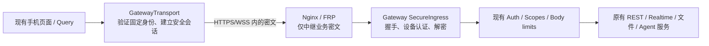

**FRP 远程访问安全加固技术方案 — 保持现有连接体验**

日期：2026-09-13。状态：技术提案，尚未实现或部署。依据：[安全调查](/Users/micjoyce/develop/github/xopc/docs/security/frp-security-review-2026-09-13.md) 与 [手机连接工作电脑方案](/Users/micjoyce/develop/github/xopc/docs/design/mobile-work-computer-connection.md)。

建议分阶段交付：先修复已确认的实现漏洞，保持当前连接协议和用户流程；再增加手机到 Gateway 的端到端安全通道。安全检查由系统完成，正常连接不增加人工步骤。证书/身份异常、明确撤销和不可兼容的旧版本必须中断或提示，不能承诺所有情况下都完全无感。

**1. 产品交互约束**

保留“电脑开启连接 → 手机扫码 → 电脑允许 → 手机进入工作”。复用当前向导、授权窗口、配对关系、路由恢复、设备列表和错误展示；不要求用户输入 URL/token、安装 VPN、导入证书、选择加密算法或定期重新扫码。

| 场景 | 目标体验 | 系统行为 |
| --- | --- | --- |
| 首次连接 | 原有扫码与一次电脑确认 | 现有“准备连接”阶段自动完成下载校验、注册与身份验证 |
| 打开已配对手机 | 直接回到工作内容 | 后台恢复授权和安全连接 |
| Wi-Fi/移动网络切换 | 保留页面、草稿和任务 | 验证候选路由身份后切换；同一写操作只投递一次 |
| 电脑休眠、暂时断网、Broker 短故障 | 显示原有重连状态 | 不清空设备凭据，不从超时推断撤销 |
| 软件更新、正常密钥轮换 | 通常不重新扫码 | 保留 Gateway 身份、迁移凭据、短暂重连 |
| 停止远程访问后再开启 | 原入口一键恢复 | 保留稳定地址归属与配对，重建短期连接租约 |
| 撤销设备/远程授权 | 显示“连接已移除”或“需要重新授权” | 关闭对应会话，停止自动续期和自动发送，保留草稿 |
| 电脑重装且身份私钥丢失 | 明确需要重新扫码 | 不以“同账号/同域名”自动认作原电脑 |
| 身份/下载校验失败 | 原位错误与“重试/更新” | 保留可读缓存，禁止不安全回退 |

正常升级不主动退出用户；已失效、无法证明归属或确认泄露的凭据不能为保持登录而继续接受。上线重启 frps 可能产生一次短暂断线，需实际测量并安排灰度，不能承诺 TCP 连接完全不中断。远程断线不取消电脑上已运行的任务。

**2. 安全目标分两层说明**

一期：在信任平台处理流量的前提下，防止网络冒充、下载篡改、域名重新分配造成凭据泄露、撤销失效、无鉴权公网暴露及代理权限扩张。保留 broker_terminated 模式，不能宣传“平台无法读取内容”。

二期：对已升级的手机/可信桌面客户端，平台只中转端到端加密数据，不能读取或修改业务内容，也不能通过转发一次身份挑战后窃取凭据。平台仍能观察 IP、连接时长、流量大小和路由元数据，并能拒绝服务。Gateway 主机、手机操作系统、应用发布链和用户主动授权的模型/连接器不在这一隔离边界之外。

Web 的代码由浏览器加载，必须额外信任代码发布来源；仅给网页增加加密不能防止该来源被控制后下发窃密 JS。Web 先完成一期和会话凭据迁移；若要进一步隔离恶意中继，需可信应用 origin 与独立发布链。不能把原生端的安全承诺直接复制到普通浏览器。

尤其要区分“这条手机通道已加密”和“整台 Gateway 已隔离恶意平台”：只要其他旧客户端仍经同一平台发送可管理 Gateway 的凭据，平台就可能从该入口取得权限。B1 仅作通道级保护；要发布 Gateway 级隔离承诺，必须完成 B2、关闭公网旧管理凭据入口，并覆盖所有私有数据客户端。可信本机 Electron/CLI 管理可以保留；普通远程 Web 在具备可信代码来源和安全通道前，仍属于明确的平台信任边界。公开分享及用户选用云模型的数据流另行披露，不因连接加密而改变。

**3. 一期：对正常使用基本无感的加固**

**3.1 验证 FRP 服务端与可执行文件**

- frps 使用专用服务端证书；frpc 显式启用 TLS，加载随应用信任配置分发的 CA，验证准确 serverName。服务端设置强制 TLS。不能从未经认证的 frps 连接临时下载 CA 后立即信任。
- 先部署兼容现有 TLS 客户端的服务端证书，再发布验证它的新客户端。CA 轮换采用有限期双信任根，旧根退出日期明确；验证失败不得自动关闭验证或连回旧入口。
- 应用发布物包含每个 OS/架构/version 的 archive SHA-256 和可执行文件 SHA-256 清单。若采用可更新清单，使用内置发布公钥验证签名并防止版本回滚；镜像不控制信任根。
- 保留平台镜像与官方源，提高国内下载成功率；镜像只提供相同摘要的字节。没有必要以牺牲便捷性为由保留未校验回退。第三方镜像是否保留取决于可用性需要，前提同样是强制可信摘要校验。
- 缓存按版本/架构/摘要命名；旧缓存可校验则直接迁移，否则后台下载。下载大小、解压内容、超时、并发去重、临时文件、原子替换均有边界；执行前确认实际二进制属于清单。
- 用户看到的仍是原有准备进度；正常第二次启动不重新下载。校验失败的文案为“连接组件验证失败，正在重新下载”，最终失败才显示恢复动作。首次额外耗时需测量。

主要改动：[frpc-config.ts](/Users/micjoyce/develop/github/xopc/src/tunnel/frpc-config.ts)、[frpc-binary.ts](/Users/micjoyce/develop/github/xopc/src/tunnel/frpc-binary.ts)、平台 [frps.toml](/Users/micjoyce/develop/github/xopc-platform/deploy/broker/frps.toml) 与发布/镜像脚本。

**3.2 地址长期归属与短期在线租约分开**

Broker 新增两个独立概念；以下为拟议数据结构，不是现有字段：

| 表/对象 | 主要字段 | 约束 |
| --- | --- | --- |
| gateway_registrations | gatewayId、identityPublicKey、tenantId、principalId、hostname、status、securityEpoch | hostname 唯一；地址归属不随心跳过期；跨身份禁止重用 |
| tunnel_leases | leaseId、gatewayId、registrationKeyId、tokenHashes、expiresAt、revokedAt、frpRunIds | 短期可续租；撤销和到期释放连接资源 |
| retired_hostnames | hostname 或可校验的唯一摘要、retiredAt | 最小化保留禁止再次发放的记录；不必保留用户姓名等资料 |

复用 SQLite 中已有 Ed25519 Gateway identity。`gatewayTokenHash` 只作为兼容标识，不再作为恢复所有权的证明。注册、恢复、轮换使用 Broker 一次性 challenge：签名覆盖用途、broker audience、gatewayId、目标 hostname、nonce、有效期、幂等 requestId；服务端消费 nonce 并检验 tenant/principal 授权。

恢复已有注册必须证明原 Gateway 私钥；已有 tenant 权限不能直接覆盖其他 principal 的设备身份。密钥丢失时分配新身份/地址并重新配对，不把旧地址交给新身份。备份恢复包含原身份私钥时可以保留配对，但需处理旧实例并行运行：单一活动 generation，显式接管租约、终止旧实例，拒绝克隆实例反复抢占。

停止、离线到期、释放连接均只结束 lease。普通“停止连接”保留 registration；永久删除将地址退役且不再发给其他身份。保留少量 tombstone 数据换取旧浏览器 origin 安全和用户地址稳定，比有限冷却期更可靠。

**历史迁移必须处理的不确定性：**

- 先冻结旧 namespace 的跨身份分配，并为现存有效记录建立 reservation，阻止继续产生新风险。
- 升级 Gateway 持有当前 tunnelToken + identity 签名，并满足其原 tenant/key 绑定时，原子绑定身份；同 requestId 重试不能重复重签或抢掉旧租约。
- 已绑定 identity 的记录不再接受旧接口按 hash 重签；兼容旧客户端心跳不等于允许旧恢复漏洞。
- 已被清理而缺少可靠归属证据的旧地址不得凭账号/hash 自动认领。停止在历史不明的旧命名空间发放新地址；新注册使用干净命名空间或有完整签发记录的新地址集合。具体域名由平台配置，不在此假定某个未部署域名可用。
- 已升级手机通过“Gateway 签名的路由清单”获得新地址，无需重新扫码；保留现有可信公钥。未升级且固定在旧地址的手机可能需要升级。历史身份已发生冲突时明确提示，不承诺可无感安全迁移。

主要改动：[Broker db.ts](/Users/micjoyce/develop/github/xopc-platform/apps/broker/src/db.ts)、[tunnel-service.ts](/Users/micjoyce/develop/github/xopc-platform/apps/broker/src/tunnel-service.ts)、[Gateway identity](/Users/micjoyce/develop/github/xopc/src/storage/sqlite/gateway-identity-repository.ts)、[本地持久化](/Users/micjoyce/develop/github/xopc/src/tunnel/tunnel-persist.ts)。

**3.3 撤销、轮换、网络故障采用不同语义**

| 事件 | 服务端动作 | 客户端动作 |
| --- | --- | --- |
| 正常连接 key 轮换 | 双重授权证明后原子换绑，再使旧 key 失效 | 后台更新，不扫码；不中断设备身份 |
| 用户撤销 key/账号停用 | 标记派生 leases 撤销、增加 securityEpoch、关闭关联连接 | 停止自动重试注册，提供原有授权入口 |
| 手机设备撤销 | Gateway 撤销该 device 的 access/refresh/session，并关闭实时连接 | 保留草稿，显示设备移除 |
| Broker 暂时不可达 | 不签发新租约，不把 5xx/timeout 当作撤销 | 在已有有效租约期限内重试；到期停止公网转发，继续本机工作 |

Console 注销 key 与持久 outbox 事件同事务写入，避免“key 已删但事件丢失”。Broker 幂等消费，关联 parent key/tenant 状态；续租不能把已撤销注册重新激活。原 key 删除后不应被客户端已有 OAuth 凭据静默重新创建来绕过撤销；恢复需用户发起原有授权动作。

撤销的目标是正常情况下 10 秒内关闭，单个通知故障时 60 秒内失效；这是待验收目标。实现不能只清理 frps offline stats 或依赖客户端主动 Ping：需要服务端可强制终止该 lease 的控制连接和所有数据连接。先验证 v0.62.1 管理能力；不足则提供受保护的 frps 管理扩展/升级路径，并由服务器维护到期/撤销定时器。做不到这一点时不能宣称达到撤销 SLA。

修改现有删除确认文案说明“将断开关联远程连接”，不新增常态确认步骤。无未公开的数据 TTL 来换取永不离线；持有有效 lease 的短暂容错与明确撤销的强制失效分开。

**3.4 统一公网入口的鉴权与代理信任**

引入内部 RemoteIngress（拟议模块）：frpc 连接专用回环 listener，复用现有 Gateway 路由、鉴权和 scopes；连接来源标识在服务端注入，不能由请求头提供。端口由程序管理，不暴露给用户。该 listener 始终执行远程鉴权和限流，不享受“loopback 客户端”免限流。它不会自行给解密/转发请求赋予 owner。

所有启动路径调用同一校验器，读取真实 resolved auth mode/credential，验证 RemoteIngress 已启用鉴权后才注册/开放公网。活动隧道期间配置热更新也不得使此入口进入 none。

默认已有 token 用户无变化。none 模式属于需要修复的例外：可信 Electron 主进程/本机 CLI 可以在用户现有“开启连接”动作中生成并安全保存凭据，更新本机连接后继续；普通无鉴权网页不能仅凭任意 Bearer 或伪造回环头自动获得 owner 身份。无法安全建立本机管理员信任时，要求在电脑完成一次设置，不能为少一次操作开放公网无鉴权。

Nginx 443 stream → 内层 4443 使用受限 PROXY protocol 保留源 IP，内层 listener 仅回环可达。Nginx 从可信源重建 XFF/X-Real-IP，丢弃外部同名头；应用仅按配置的代理链解析。未配置可信链时依 TCP 来源计数，不信任客户端自报 IP。RemoteIngress 即使来源为回环也限流；同时以 device/principal/key/tenant 分桶，避免运营商 NAT 下所有手机互相锁死。IP 作为辅助维度，不单独承担授权。

正常高频聊天/语音不触发认证失败限流；注册 key、nonce、预认证握手及连接数量单独限制。Map 有 TTL 和容量上限，多实例部署使用共享计数/撤销状态，桶溢出采用受控全局限制而不是无限分配。

**3.5 FRP 权限、端口、日志和本地凭据**

NewProxy 使用严格 schema，只允许登记的 http 类型、精确 proxyName/subdomain；拒绝 TCP/UDP、remote_port、custom_domains、group、locations、header rewrite 等未授权字段。对旧版本合法省略字段保留明确兼容默认值；不能把未知字段静默当成合法扩展。未知 op 拒绝；插件回调独立在回环入口，公网 `/frp/handler` 拒绝访问。

frps 使用专用低权限系统用户，内部端口绑定回环，更新脚本同步正确配置；云安全组与 IPv6 同时核验。代理进程没有修改发布镜像、读取 Console 整库备份或操作全部 DNS 的不必要权限。

Web 头像改成带认证 header 的 fetch → blob URL，缓存按 Gateway/agent/revision 隔离并释放 blob；不改变显示方式。新前端停止把 owner token 放入 URL，过渡期旧头像请求在入口直接脱敏日志，旧版本退出支持后关闭 query-owner-token 鉴权。新协议资源票据若需要，必须绑定资源/动作/期限，不接受其调用其他 API。

日志白名单只记录 path（不含敏感 query）、状态、耗时、脱敏身份、reasonCode；HTTP/WebSocket 调试日志不记录认证 header、配对 token、正文和音频。既有日志确认含凭据时开展受控轮换，不能假设删掉新日志字段已处理历史泄露。

本地 tunnel.json/frpc TOML 显式 0600，目录 0700，原子写；stop/release 清理运行时 TOML，持久恢复凭据留在受限状态文件。自定义 Broker 的生产模式只接受 HTTPS、受信 origin；发现重定向与响应需 schema/目的域校验，TOML 由序列化器生成。

**3.6 手机持续身份校验与 Web 会话迁移**

手机新增共享 `GatewayTransport` 适配边界，覆盖普通 API、refresh、配对、realtime ticket、WebSocket、上传、下载、图片与语音；现有 query 层和页面保持调用形式。不能只改 apiFetch，因为 [realtime ticket](/Users/micjoyce/develop/github/xopc/apps/mobile-expo/src/features/gateway/use-gateway-realtime.ts:47) 目前还有直接 fetch。

一期在首次连接/重连/切换路由前取得新鲜 challenge，由已固定 Gateway 公钥签名验证 gatewayId、nonce、用途、能力版本、路由 epoch；失败不发送凭据或正文。并发请求共用一次验证，不能每个请求多握手。refresh 响应也需验证签名及请求绑定，不因形状合法就接受。身份固定值迁到 SecureStore；普通路由缓存可以在 MMKV，但必须验证签名才能用于发送。此阶段能识别假端点，不能阻止能中继挑战的恶意平台读取后续 Bearer 流量，二期负责闭环。

Web 保留“记住这台浏览器”的便利，但将持久 owner token 替换为可撤销浏览器会话：新前端用已有 owner 凭据一次性交换，成功后清除 localStorage token；`Secure`、`HttpOnly`、`Path=/`、不设置 Domain 的 `__Host-` cookie 保存不透明会话标识，服务端仅保存摘要。敏感 API 验证 Origin/CSRF，403/401 不自动对有副作用操作盲重试。Owner 的现有管理能力映射为对应浏览器 session role，避免突然砍掉用户功能；手机 scopes 保持当前权限。

会话绑定 Gateway 身份、浏览器授权记录、securityEpoch；短期 access 状态和后台延续与正常登录融合。持续时间与现有“记住登录”语义一致，具体期限通过安全评审确定，不要求用户定时扫码。显式退出/撤销立即清除与失效。

HttpOnly 只降低 JS 读取 token 的风险：恶意同 origin 服务仍可能收到 cookie，所以永久域名归属和可信网页来源必须同时成立。第一阶段不强行把所有用户换到新 Web 入口；长期支持独立可信发布 origin 时，还须验证跨站 cookie 限制，不能假设原 same-origin cookie 会自然跨域工作。

**4. 二期：增加应用层端到端安全通道，保持相同扫码流程**

推荐在现有 HTTPS/WSS + FRP 上承载加密会话，优先手机和可信打包客户端。它不要求每台 Gateway 自动取得公网证书，不改用户地址、不安装 CA、不新增网络权限，不把 FRP 当作可见的产品选项。由通信适配层承担复杂性。

**协议与边界。** 优先评估有维护记录和互操作测试的 Noise 实现，拟用已知服务端静态密钥的 NK 模式承载会话，完成后在密文内做设备持有证明；具体 cipher suite/库的锁定需单独 ADR、许可证/维护/平台适配检查和协议安全评审后才能发布。不得凭“使用 AES”或有底层曲线库就自行拼装握手。Noise 的应用认证、信任根和重放责任仍需明确实现。[协议来源](https://noiseprotocol.org/noise.html)

已有 Gateway Ed25519 身份继续作为手机信任根；新增独立通道密钥，由该身份签名认证，不能把 Ed25519/P-256 私钥直接当作 X25519 密钥用。现有设备 P-256 私钥用于证明设备身份；proof 绑定 gatewayId/deviceId、用途、完整握手摘要、server nonce、安全版本/epoch，认证结果绑定当前 channel。握手完成并验证固定身份后，才在密文中发送设备凭据与业务数据；服务端仍检查设备状态和 scopes。

现有配对 v3、一次电脑批准和签名 QR 均可复用；通道密钥证书用已信任身份认证，正常升级不改变 Gateway identity、不重新配对。日常密钥轮换自动验证旧身份签名；身份私钥本身丢失/意外变化禁止 TOFU 覆盖。手机保存已达到的最低安全版本，不能被中继删掉能力字段诱导降级。

**拟议接口与数据面。** 提议 `/api/secure/v1/identity`、`/api/secure/v1/ws`，以及 HTTP 密文载体 `/api/secure/v1/transport`。identity 返回签名的临时通道证书/能力，不返回凭据；建立阶段限制并发、帧大小、CPU 和超时。会话失效即销毁会话密钥，重新协商，不能在进程重启后错误恢复 nonce。

在同一安全会话中复用逻辑请求/响应/事件流。密文覆盖 method、规范化 path/query、敏感 headers、body、响应和 realtime frames；外层只暴露路由和不具授权能力的会话句柄。禁止“正文加密但 Authorization 仍在外层”。标准库管理加密状态，应用帧携带 requestId、streamId、顺序/结束/取消信息；会话绑定防止跨设备混用。

解密后的请求进入正常 Hono 鉴权与 scopes 流程，重建身份来自本会话认证结果；不能访问 loopback 后就自动成为 owner，也不接受内层伪造的代理身份 header。沿用同一业务服务与错误契约，不在 SecureIngress 复制一套 API 权限逻辑。新增路径须按仓库规则更新 lazy-bundles 匹配/正反例测试，并通过真实 Gateway 验证。

**实时、文件、语音与弱网。** 不允许只支持 JSON 聊天便宣称改造完成：

- 文件使用有界密文分片，建议应用负载每帧不超过 32 KiB，最终以选定协议限制为准；流式处理、取消/续传/完整性校验，不能把整段音频或大文件转成巨型 base64 常驻 JS 内存。
- 请求并发在复用层实现；语音/控制帧优先于大文件，队列与内存有硬上限；加密任务不得持续阻塞 React Native UI 线程。需要原生/worker 适配时随正常 App 更新发布。
- WebSocket 不可用时保留 HTTP 密文传输/拉取能力，避免今天 REST 可用的网络改造后全部不可用。不同载体使用协议定义的独立握手/会话状态或经过验证的有序帧承载，不能临时拼一个没有重放保护的 AES POST。
- HTTP 载体的序号、重复批次、丢失响应、确认与重传规范必须先形成测试向量；密文重传不触发第二次业务执行。尚未完成此能力时，二期只能试点，不能全量替代现有入口。
- Realtime 保留 cursor/resume，断线重连重建安全会话、恢复 endpoint，再继续原事件流。写操作沿用持久 clientMessageId/idempotencyKey，响应丢失先查结果，不在两条路由并行发送。

普通 REST/TLS 透传也是可选技术路线，但当前 [tls-server.ts](/Users/micjoyce/develop/github/xopc/src/gateway/tls-server.ts) 只是配置解析，Broker DNS challenge 服务也未接入现行 app 路由，不能当作开关式切换。每台 Gateway 独立证书还涉及首次 DNS 验证、休眠期间续期、CA 配额、原生 pinning、私钥轮换和浏览器信任边界；Let's Encrypt 对注册域名有签发配额，子域分散并不自动解决该限制。[配额说明](https://letsencrypt.org/docs/rate-limits/)

因此不把“每台电脑发公网证书”设为一期前置。DPoP 可减少 token 脱离设备后的重放，但不能提供正文保密，也不能取代端到端通道；不为完成一期额外引入一次重复认证协议迁移。[RFC 9449](https://www.rfc-editor.org/info/rfc9449/)

**5. 兼容与发布策略**

新增字段如 `registrationVersion`、`identityBound`、`securityEpoch`、`transportCapabilities`、`minSecurityVersion` 为提议契约，通过共享 gateway-contract 定义和签名声明传播，不信任未签名的 Broker 文本。旧客户端允许的兼容窗口必须有明确结束版本/日期；不是永久后门。

| 阶段 | 交付 | 兼容与退出条件 |
| --- | --- | --- |
| A0 平台先止血 | 冻结域名跨身份复用、日志脱敏、关闭公网插件回调、服务端证书与端口边界 | 不改变现有 QR；先采集连接成功率基线 |
| A1 客户端与注册升级 | 下载/证书校验、身份绑定、RemoteIngress、稳定租约、签名恢复、头像修复 | 原租约完成证明后保持原地址；异常历史记录走受控恢复 |
| A2 生命周期闭环 | 强制撤销/到期断线、限流修复、浏览器会话迁移、持续手机身份验证 | 注销/轮换语义可测；停止旧 hash 重签；无鉴权路径全部拒绝 |
| B0 安全通道原型 | 锁定协议实现、REST/WS/文件/音频/HTTP fallback 的互操作与弱网验证 | 未达性能/安全门槛不默认启用；不阻塞 A 系列发布 |
| B1 新客户端灰度 | 复用原配对身份自动协商安全通道 | 完成后持久记录最低安全级别；故障不降回明文业务通道 |
| B2 默认与旧版退出 | 新配对默认安全通道；逐 Gateway 关闭旧私有 API/管理凭据入口，覆盖所有受保护客户端 | 未升级客户端预告升级；远程 Web 满足可信发布与传输条件后方可作 Gateway 级隔离承诺；保留缓存/草稿 |

二期升级过程：服务端先支持新协议 → 手机先验证能力并成功建立通道 → 双方原子记录设备最低安全版本 → 撤销该设备可用于公网旧传输的会话凭据。不能只让新手机“优先加密”，同时让窃取旧 token 的攻击者继续走明文业务 API。

迁移前原协议只在仍被明确支持的旧设备上使用，不因一条 5xx 自动降级。迁移后连接失败只重试相同安全级别；其他 Tailscale/自建 HTTPS route 也遵守已绑定身份与最低安全策略。兼容策略在 Gateway 端按 device/registration 执行，不只依赖手机 UI。

上线期间，已有 stream 可短暂 drain，但新请求必须遵循新撤销/安全策略。回滚应用版本不回滚 reservation/tombstone/revocation epoch，不恢复 query-owner-token、旧 hash 重签或取消证书验证。二期已迁移设备遇回滚，只有仍支持其最低安全级别的兼容实现可服务，否则保持本地可读并提示更新。

**6. 用户可见错误与恢复动作**

| reasonCode（拟议） | 文案 | 恢复策略 |
| --- | --- | --- |
| NETWORK_UNREACHABLE / BROKER_UNAVAILABLE | 暂时无法连接电脑 | 原位保留工作，指数退避，不删除凭据 |
| COMPONENT_VERIFY_FAILED | 连接组件验证失败 | 自动重下已知可信版本；最终失败提供更新/重试 |
| GATEWAY_IDENTITY_MISMATCH | 无法确认这台电脑的身份 | 禁止发送；身份确实变化才由用户重新扫码 |
| TUNNEL_AUTH_REVOKED | 远程连接授权已移除 | 停止自动建隧道；原授权入口恢复 |
| DEVICE_REVOKED | 连接已移除 | 重新配对；保留未发送内容 |
| SECURITY_UPDATE_REQUIRED | 更新后即可继续连接 | 保留当前页面、草稿和可信配对身份 |
| HOSTNAME_OWNERSHIP_UNPROVEN | 需要恢复电脑连接 | 电脑证明原身份或分配新地址；不向不可信旧地址发凭据 |

同一安全失败不循环弹窗。仅在用户关注连接时展示必要细节，不出现 CA、SPKI、Noise、FRP 端口等普通用户无法操作的词。控制台高级诊断保留稳定 reasonCode。

**7. 实施边界与验收**

工程模块拆分：

| 工作包 | 位置 | 交付边界 |
| --- | --- | --- |
| 平台入口与供应链 | xopc-platform deploy/broker、scripts/broker；xopc src/tunnel | 可信 frps、可信 frpc、进程/端口/日志隔离 |
| 注册身份与撤销 | Broker db/app/tunnel-service；Console key-revocation；Gateway identity/persist | reservation、lease、challenge、幂等轮换、强制断线 |
| Gateway 远程入口 | src/gateway/hono、src/tunnel、src/config | resolved-auth 守卫、remote context、scope 保持、热更新校验 |
| 手机/浏览器兼容 | mobile gateway/api/storage；web avatar/storage；gateway-contract | 原配对迁移、签名路由、会话与错误语义 |
| 安全通道 | 新共享协议/适配包、Gateway SecureIngress、mobile transport | 全链路密文、传输恢复、跨平台与性能验收 |

上述新目录/模块名是实施建议，应按实际代码组织落地；不启动其他任务、不改用户正在编辑的 UI 文件。本提案不包含运行 Agent 权限系统重构，沿用现有 scopes 和工具审批。

发布必须通过以下验收，不能用“已有测试全部通过”代替：

- 正常新用户点击数、扫码次数和确认次数不增加；原有配对升级、停止/重启、过夜离线仍能恢复。确实丢失身份的设备不可静默迁移。
- TLS 错证书、错误 hostname、镜像篡改、缓存篡改均拒绝；可信镜像故障可自动切源且不放宽验证。
- 地址过期/删除/账号迁移后不能发给另一身份；被绑定的 hash 不能被同 workspace 其他 principal 重签；并发迁移、旧版重连、备份克隆均有确定结果。
- key/账号/设备撤销测试覆盖长连接、文件下载、语音、无 Ping 的异常客户端和通知丢失；正常轮换不误撤销，Broker 短故障不把设备登出。
- none/trusted-proxy 不适用配置、配置热更新、HTTP/CLI/Electron 各启动路径都不能绕过远程鉴权。验证真实代理路径而非只直接调用路由。
- 伪造 XFF、代理链丢失、多用户 NAT、桶爆量不能绕过/拖垮限流；已有认证成功用户不被他人猜 token 锁出。
- 头像 URL、日志、crash report、客户端连接诊断不含 owner token/refresh/配对秘密；资源票据不能调用其他 API。
- 二期中继替换、篡改、重放、降级、会话串用、非法分片均失败；仅中继身份 challenge 不能获取业务凭据。
- HTTP、实时、文件、图片、语音、背景恢复都走选定传输；WebSocket 被禁时，现有可用的读取/提交能力不能因改造全部消失。
- 100 MB 文件、长语音、弱网丢包、上传一半断线、服务端已接收但响应丢失等场景不重复执行、不无限增长内存、不阻塞 UI；容量值是测试场景，不擅自改变现有上传额度。

建议性能门槛：一期暖启动 p95 相对基线回退不超过 5%；二期首次安全会话在已有网络连接之外新增握手不超过 2 个 RTT，暖请求不逐个握手；冷启动/重连 p95 与内存/耗电以真机基线验收。均为设计目标，尚未测量，不作为当前产品性能承诺。

只采集成功率、阶段耗时、reasonCode、迁移比例和资源指标；不为了监控加密改造而上传正文、完整 URL、密钥或证书私钥。按平台、版本、网络类型分组，避免平均值掩盖弱网回退。

**8. 结论与待实施前核实事项**

现在可直接安排 A0–A2。它们基本保持产品交互，并且稳定地址、区分临时断线与撤销后，恢复体验会更可靠。B0 同时作为后续独立技术验证，在协议实现、HTTP fallback、语音/大文件真机性能达到门槛后推进 B1/B2，不应仓促复用归档 E2EE 分支。

实施前需要读取生产生效配置、统计受影响版本与历史地址覆盖、确认 key 正常轮换调用链、验证 frps 强制断线能力；这些属于工程调查，不需要用户选择证书或协议。审查发现历史凭据确已泄露时，安全轮换可能需要少量用户重新授权，不能以无感升级名义继续使用泄露凭据。

本文只新增技术方案，未改业务代码或部署；本轮没有运行实施测试。前次审计的 53 项通过结果仅作为现状依据，不代表本方案已经验证。
