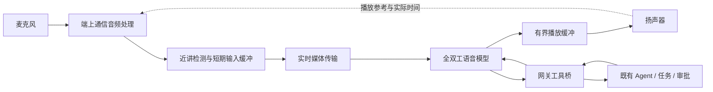

# 鸿蒙实时语音体验提升：调研与实施路线

日期：2026-10-08。范围：当前 xopc 鸿蒙客户端、Gateway 语音链路，以及公开可验证的供应商资料。本文件是工程提案；没有切换生产模型、调用付费语音服务或完成真机声学测试。本文数值目标均为建议验收门槛，不是当前实测值或供应商保证。

## 1. 结论

要接近豆包的连续对话体验，需要同时做好端上音频、轮次与打断、模型、传输和观测。优先选择真正支持全双工、动态判停的原生语音模型；保留 xopc 的持久会话、工具执行和审批边界。先测清系统 3A 和实际播放时延，再决定是否引入额外音频 SDK。单独调低静音阈值，或盲目叠加降噪，容易以吞字、误打断和抢话换取表面速度。

豆包的公开技术说明强调持续倾听、语音与语义联合判停和抗无关人声干扰。公开的相对提升数据来自供应商自己的评测，不能直接推导 xopc 的绝对延迟或效果。[Seed 官方说明](https://seed.bytedance.com/zh/blog/introducing-seed-full-duplex-speech-llm-attentive-listening-robust-interference-suppression-enabling-more-natural-interaction)

## 2. 当前实现与目标的差距

| 范围 | 当前源码证据 | 影响及处理方向 |
| --- | --- | --- |
| 端上基础音频 | `voiceCallAudio.ets` 使用通信用途 Renderer 和通信来源 Capturer，先开始播放流再开始采集 | 已具备系统 3A 的启用前提，应先验证实际路由、双讲和外放效果 |
| 采集节奏 | `capturer.read(getBufferSizeSync(), true)`，在 ArkTS 循环里复制、拆包 | 硬件缓冲大小不等于 20 ms；需要测回调周期、队列等待和调度抖动 |
| 轮次 | `ConfigSchema` 默认 provider 静音 1200 ms；`TurnCoordinator` 另有至少 350 ms 的最终稳定等待，续句规则可延长 | 默认组合在 provider 真正采用该配置时，完整短句的判停就可能约 1550 ms，尚未包含生成和播放；实际以埋点为准 |
| 语义 | 默认是中英文尾词启发式；策略接口存在，但默认路径没有真正的音频语义轮次模型 | “嗯”、思考停顿、附和、与旁人说话不能靠同一静音阈值处理 |
| 打断 | Agent 和 Omni 都在非空 final transcript 后确认打断；鸿蒙没有本地近讲 ducking | 噪声保护较保守，但用户可能说完插话才听到 AI 停下 |
| 回声后处理 | `playback-echo.ts` 通过转写与播报文本相似度排除疑似回声 | 这是业务兜底；用户主动重复 AI 的词也可能被误过滤，不能替代声学 AEC |
| 上行拥塞 | `pendingBytes` 包含 XOP3 头和 UUID，除以 32 估算“queueAgeMs” | 它是混合了协议开销的排队媒体量，不是最老样本的实际等待时间；较大批次可能立即触发暂停 |
| 播放确认 | 鸿蒙将 Renderer 已接收字节作为 `response.audio.played` 发出；实际播放用另一回调跟踪 | 服务端认为已播放的内容可能还在设备缓存里；要分开流控信用和实际听到的位置 |
| 模型适配 | `omniRoute.ts` / `omniEngine.ts` 对托管路由或 DashScope 风格事件实现适配 | 豆包不是换 URL 就能接入；认证、事件、音频编码、静音、工具和上下文均需独立适配 |
| 诊断 | 存在首文本、首音频、RTT 和部分 session metric | 尚缺覆盖“最后语音样本 → 实际扬声器首声”的完整分段追踪 |

源码优先于旧设计描述。例如设计中提出的本地近讲检测、立即 ducking、路由能力判断，并未在当前鸿蒙实现中完整落地。

### 拥塞判断的具体风险

当前一个 20 ms 上行包包含 640 字节 PCM，以及 32 字节头和通常 36 字节 UUID。一批 6 帧是 120 ms 音频，却计为 `6 × 708 / 32 = 132.75 ms`，超过 120 ms 的 degraded 水位。若硬件一次给出这么大的数据块，即使网络尚未发生真实积压，也可能触发 `input.mute`，引发输入丢弃或 STT 重置。这是条件性代码风险，尚未测到真机的实际缓冲大小。

修改方向：分别记录媒体样本量、总字节数、最老采集样本年龄、socket 本地积压和远端处理进展；不能把 `send()` 返回视为云端已收到。用 monotonic 时间记录采集时刻，避免把拆包时刻误当采集时刻。

## 3. 推荐的目标架构

语音模型负责听说和交互节奏；工具桥负责把能力接到现有 Agent。通话内的语音引擎保持稳定，不在每轮悄悄切换模型。副作用动作仍经过现有权限、幂等和确认机制。复杂任务未完成时，可播报真实的短进展；不能把固定“我查一下”当作答案首声改善统计。

### 优先验证的三条路线

| 路线 | 建议 | 必须验证的条件 |
| --- | --- | --- |
| 系统 3A + 豆包 3.0 全双工 API + 当前 Gateway | 首选概念验证，避免一次更换全部层 | 账号开通、模型实测、稳定事件映射、静音保活、输出格式、工具结果回传、实际听感 |
| 系统 3A + 现有 STT/Agent/TTS | 保留并优化，适合强调复杂工具能力 | 语义轮次、首短句 TTS、暖连接、取消与工具解耦；与全双工路线用同一测试集比较 |
| 成熟 RTC/语音 SDK + Gateway 工具桥 | 针对真机声学或弱网达不到门槛时评估 | 必须拿到实际 HarmonyOS NEXT 原生包、API 23 支持矩阵、全双工/外部音频接口并跑 Demo；不能以 Android/iOS、IM 或直播 SDK 的存在替代验证 |

火山公开资料已提供 Seeduplex 3.0 的全双工 API 与函数调用事件。其静音事件、20 ms 实时发送节奏和默认输出编码有明确约束；需要适配器认证，不能直接复用 DashScope 控制帧。公开 API 也不等于豆包 App 的整套产品效果。[全双工接入必读](https://docs.volcengine.com/docs/DoubaoVoice/access-mustread?lang=zh)

## 4. 手机端声学处理

### 先验证系统能力

安装 SDK 的 `@ohos.multimedia.audio.d.ts` 对 `SOURCE_TYPE_VOICE_COMMUNICATION` 明确说明：单独开始录音不启用 3A，配合通信用途的播放流才启用。当前实现符合这项前提。仍须逐路由验证实际输出设备、输入设备、系统中断及效果，尤其是外放与蓝牙切换。

先测系统 3A 基线，再比较可控的软件处理方案。系统 AEC 与软件 AEC、系统 AGC 与额外增益同时生效可能造成语音损伤；是否可以禁用/控制某层必须依据设备和 API 确认，不能假设。

### AEC、噪声和无关人声是三种问题

- 自己扬声器的 AI 声音：AEC 需要正确的远端播放参考及时间对齐。
- 风扇、键盘、车流等：适度降噪，防止压掉轻声、句尾和辅音。
- 电视、同事或旁人讲话：需要目标说话者或交互意图判断；普通 VAD 和传统降噪不能可靠解决。

若系统基线不足，可对比 WebRTC APM/AEC3 或供应商原生方案。软件 AEC 必须接入与实际播放一致的参考波形（含增益、重采样、ducking 和路由延迟），并保持采集/播放时钟对齐。WebRTC APM 设计为靠近硬件的双向音频处理，使用约 10 ms PCM 块；端上内部处理粒度与 20 ms 网络封包可以不同。[WebRTC APM 源码](https://webrtc.googlesource.com/src/+/refs/heads/main/api/audio/audio_processing.h)

降噪强度不能只按“背景更安静”选择。火山的语音降噪说明也提醒部分抑制策略可能降低低能量人声识别率；应同时看轻声识别与主观自然度。[语音降噪说明](https://docs.volcengine.com/docs/real_time_communication/Speechnoisereduction?lang=zh)

### 音频线程

先测现有 ArkTS read/write 开销；若调度或缓冲构成明显瓶颈，再做 OHAudio C++ 实时回调、预分配环形缓冲和工作线程桥接。回调中只取放数据，不执行网络、JSON、日志或模型推理。低时延模式要检查运行时是否真的生效，保留设备不支持时的明确回退。[华为低时延录音指南](https://developer.huawei.com/consumer/cn/doc/doccenter-capabilities/audio-fast-recording)

不要预设 16/24/48 kHz 哪个一定最快：对比硬件原生采样率和系统重采样成本，再在单一边界转换到 provider 格式。蓝牙路由单列延迟统计，不能拿耳机结果代表内置外放。

## 5. 接话与打断

### 动态判停

目标是对完整短句快速接话，对“我想……嗯……帮我看看”持续倾听。优先使用经中文、口语停顿和噪声认证的 provider 语音语义策略。级联路线可使用流式 ASR 稳定度、声学停顿与轻量语义模型联合判断；语义决策计算与持续识别并行，不能每轮再串行调用一次昂贵 LLM。

轮次状态至少区分：继续表达、完成请求、附和、非交互声音。策略故障才使用有界静音兜底。较短静音阈值只是实验参数，须以抢话率和吞词率约束。支持原生全双工策略的 provider 应拥有自己的轮次控制，不能再叠加现有固定静音等待。

### 两阶段打断

1. 端上对去回声后的持续近讲信号给出可逆反馈，短渐变降低 AI 音量。保留少量前置音频，避免插话开头丢失。
2. 结合说话者/回声置信度、语义或 provider 打断信号确定是否取消。有效打断立即清空旧播放队列、标记回答中断；噪声误触发则恢复音量。

本地能量阈值不能直接不可逆地取消回答。停一下、我要纠正、附和“嗯嗯”、咳嗽、AI 回声、电视人声要分别测试。语音打断不等于取消 Agent 的持久任务。

播放历史必须区分生成、下发、缓冲和真正听到。规划协议扩展，分别上报 `bufferedDuration` 与 `playedDuration`，后者来自硬件播放进度；provider 支持删除/截断时同步修正未听到的历史，不支持时明确记录中断边界，不能伪装已完成精确截断。

## 6. 时延与传输

每轮延迟应拆成：

`最后有效语音样本 → 判停 → 开始生成 → 首音频可用 → 客户端收到 → 实际可听首声`

其中网络和流式计算部分可以重叠；不能把各阶段独立 P95 简单相加，当作端到端 P95。工具进展与实质回答分别统计。跨机器使用各自 monotonic 时钟测阶段耗时；通过追踪 ID 对齐事件，不能直接相减不同机器的未校准时间戳。

健康网络、普通无工具短问答的建议初始预算：判停 200–450 ms、提交后的首语音生成 150–350 ms、网络及音频输出 80–180 ms。预算需实测校准，不能套用于犹豫停顿、复杂推理或工具完成。

- 上行按实际采集节奏发送，有限排队；恢复网络不能突发回放几秒前的输入。
- 下行播放缓冲从小范围自适应，建议先实验 40–100 ms，弱网再增加；分别记录 underrun 和积压，追求稳定而非把 buffer 固定为零。
- PCM 上行为 256 kbit/s，下行为 384 kbit/s，尚未包含头部和加密。Opus 可降低带宽，但编码、解码和重采样成本也要测，且需要明确协商，不能直接改当前 v3 PCM 格式。
- RTC/RTP 更适合对丢包做及时处理、拥塞控制和播放恢复，但不是自动消除所有延迟。手机到 Gateway 改 RTC 后，Gateway 到 provider 若仍是 WebSocket，该段瓶颈仍在。
- 先比较大陆设备到 Gateway、Gateway 到 provider 的网络路径。保持鉴权和业务控制走 Gateway；媒体边缘服务采用短期受限凭证，不暴露长期供应商密钥。

实时媒体应优先有界延迟和拥塞响应；Opus 是可评估的语音编码选择。[RFC 8836](https://www.rfc-editor.org/rfc/rfc8836)、[RFC 6716](https://www.rfc-editor.org/rfc/rfc6716)

## 7. 建议验收目标

以下是第一版产品目标，需依据真机基线调整；绝非当前达成承诺。P95 表示 95% 的样本不超过该值。

| 指标 | 建议门槛与统计口径 |
| --- | --- |
| 无工具短问答：话音结束至实质首声 | 健康 Wi-Fi/移动网络 P50 ≤ 600 ms，P95 ≤ 1200 ms；不计固定填充词作弊 |
| 插话反馈 | 近讲开始至明显降音量 P95 ≤ 150 ms；至完全停止旧播报 P95 ≤ 300 ms |
| 有效打断 | 在明确打断语料中成功率 ≥ 95%，保留开头，另记语义确认用时 |
| 抢话 | 思考停顿/续句语料中 ≤ 1%；与快速接话联合考核 |
| 噪声误交互 | 无用户指向发言的 30 分钟外放/电视/环境测试 ≤ 1 次错误响应或不可逆打断；另记短暂误 duck |
| 多轮可靠性 | ≥ 99.5% 有效输入最终得到回答或明确可恢复错误；静默失败单独统计，不能被错误提示掩盖 |
| 连续通话 | 100 轮与 30 分钟压力测试；不永久静音、不重放旧音频、不串轮 |
| 网络恢复 | 恢复可用网络后 P95 ≤ 3 秒重新可用；过期音频不补发，未完成输入明确提示重说 |
| 功耗与音质 | 与基线比对 CPU、掉帧、温升、电量和双讲吞字；不能以音质显著退化换取延迟达标 |

上线门槛需报告样本数和置信区间。建议每条候选链路至少 500 个有效普通问答样本、100 个明确打断样本，再进行多场景长通话；99.5% 的可靠性结论还需足够规模及置信区间支持，少量演示不能证明。

## 8. 评测集与对标方法

建设可重复播放的音频语料与真机声学台架，使用同一扬声器、音量、摆位和房间条件。合成混音适合回归，但不能模拟完整硬件非线性、路由与 AEC 时钟。

| 维度 | 至少覆盖 |
| --- | --- |
| 设备/路由 | Mate 60 与另一款目标鸿蒙设备；听筒、外放、有线/USB、蓝牙；切换前后 |
| 环境 | 安静、风扇、键盘、咖啡厅、车内、电视、人声混叠；记录 SNR、混响和外放音量 |
| 语言 | 普通话、轻声、方言/口音、中英混说、数字姓名、句中改口、长停顿 |
| 交互 | 连续追问、附和、明确打断、停一下再继续、对旁人说话、用户复述 AI、双讲 |
| 网络 | 受控 RTT/抖动、丢包、带宽限制、Wi-Fi/蜂窝切换、断开与恢复；记录注入方式 |
| 生命周期 | 后台、锁屏、来电/焦点中断、音量变化、权限撤销、30 分钟持续通话 |

声学评估同时看：回声残留、近端语音损伤、中文 CER/实体准确率、意图成功率和真人听感。ERLE 仅适用于合适的回声场景，不能用双讲时抑制用户声音换一个好数字。参考微软 AEC 的单讲/双讲场景，以及 DNS 的语音、噪声、整体质量分开评价。[AEC Challenge](https://github.com/microsoft/AEC-Challenge)、[DNS Challenge](https://github.com/microsoft/DNS-Challenge)

与豆包 App 同条件真人盲测，随机顺序，记录实际声音而非字幕/动画。公有 API 另列结果，避免把供应商 App 端侧能力算成 API 自动提供的能力。付费服务实测需要已配置的测试凭据、预算与隔离测试会话；本轮没有调用。

## 9. 推荐实施顺序

1. **建立基线并清理确定的时序问题。** 分段埋点、真实采集时间、实际播放确认、拥塞计量修正；做当前系统 3A 真机测试。产出每一段 P50/P95/P99、误打断和连续通话报告。
2. **接入一条全双工候选链路。** 独立 Provider adapter，保留现有路径用于对照；认证事件、输出解码、静音保活、打断、工具桥、上下文恢复。通过同一语料和真机试验决定是否作为默认。
3. **落实端上交互与声学策略。** 本地近讲 ducking、前置缓冲、路由恢复、双讲测试。系统效果不足时，对比原生音频引擎或 SDK；任何新增处理都做开关 A/B。
4. **优化弱网和长通话尾延迟。** 按数据决定是否引入 RTC/Opus/边缘媒体入口，验证收益覆盖开发和运维成本。
5. **常态化验收。** 每次模型、SDK、协议或音频路由改动运行回归；小流量灰度监测指标，保留可显式回滚的链路配置。

最先启动的工作包应是“端到端测量 + 系统 3A 真机基线 + 全双工 Provider 概念验证”。这三项可以把模型问题、端侧问题和网络问题分开，决定后续投入，而不是继续凭听感微调多个固定阈值。

## 10. 实施状态（2026-10-08）

按后续讨论，模型接入与是否走 xopc-platform 延后决定。第 2 节记录的是调研时的源码快照；上行拥塞计量、静音状态竞争、分段时序诊断及基于服务端 speech_started 的可逆降音量已进入第一阶段实现。采集时间仍为估算，播放进度仍为采样；完整声学端到端指标和系统 3A 效果尚未实测。实施范围、统计命令与待测矩阵见 [鸿蒙基线交付](../../apps/mobile-harmony/docs/voice-experience-baseline.md)。供应商路线只是候选提案，尚未执行。
