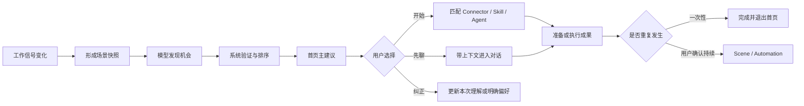

# xopc 智能工作台：场景建议产品方案

日期：2026-09-23  
状态：P3 工程实现完成，真实样本发布验证待执行

本方案在现有[场景产品北极星](./scenes-product-north-star.md)、[场景系统技术设计](./scenes-technical-design.md)和[工作理解 onboarding](./work-discovery-onboarding.md)之上增加首页“场景建议”能力，不新增另一套任务、记忆或主动运行系统。

## 1. 产品决定

首页不再只回答“现在有没有事情需要处理”，还要回答：

> 基于 xopc 对用户、项目和当前环境的理解，现在最值得推进什么，为什么，以及 xopc 已经能替用户做到哪一步？

用户看到的是一个与当前场景有关的建议；Connector、Skill、Agent、Workflow 和 Automation 是完成建议的内部能力，不是首页的信息架构。

建议不是新的耐久业务对象：

- 生成但未采纳的建议是有有效期的首页投影；
- 用户开始执行后进入现有会话、Task / TaskRun；
- 用户选择持续帮助后进入现有 Scene；
- 重复执行被用户确认后才转为 Automation；
- 用户纠正的稳定偏好按现有 User Model 规则写入，单次忽略不推断长期偏好。

## 2. 用户问题

当前首页的输入器要求用户自己完成四件事：发现问题、判断优先级、组织 Prompt、选择能力。熟练用户可以完成，新用户和忙碌用户往往只看到一个空输入框。

目标用户的 Jobs to be Done：

1. 打开 xopc 后迅速知道最值得关注或推进的事情；
2. 看懂建议来自哪些真实事实，而不是接受一个黑盒判断；
3. 不必理解 Connector、Skill 等技术结构，也能得到合适能力；
4. 对高风险动作保持控制，对安全准备工作少做重复确认；
5. 建议不准确时，能够用一次反馈纠正后续行为。

## 3. 产品原则

1. **场景先于功能**：先说用户能得到什么，再说明需要哪些能力。
2. **一个主建议**：首页最多一个主建议和两个次建议，不做信息流。
3. **证据先于权威**：建议必须能展开查看来源、时间和不确定性。
4. **没有价值就安静**：模型没有足够依据时提出一个澄清问题；没有重要建议时保留空闲态，不能为了活跃度制造建议。
5. **模型判断、系统守边界**：模型发现机会、形成理由和计划；系统校验权限、能力、风险、状态和幂等。
6. **先试做，再持续**：第一次成功帮助后才建议形成 Scene 或 Automation。
7. **反馈立即生效**：不相关、已完成、太早、来源过期和少提醒分别处理，不能合并成一个点踩。

## 4. 核心体验闭环



## 5. 首页信息架构

工作台继续按照用户注意力组织，建议只在不会遮挡真实待处理事项时出现。

优先顺序：

1. 需要用户决定；
2. 已准备好的真实成果；
3. 模型生成的“此刻建议”；
4. 助理正在推进；
5. 自然语言输入器。

当首页已有阻塞用户的决定时，不再用大卡片推荐新工作；建议降级为一行“下一步建议”。完全空闲时，建议成为主内容，输入器保留在其下方。

### 5.1 上下文充分

页面展示一个主建议：

- 建议完成的结果；
- 为什么现在值得做；
- 已核对的事实和来源时间；
- xopc 会先完成什么；
- 预计耗时、风险和需要用户决定的节点；
- 一个主操作“开始推进”，一个次操作“先聊一聊”。

Connector 和 Skill 以能力说明呈现，例如“将使用 GitHub 与代码审查 Skill”，不作为主标题。

### 5.2 上下文不足

不展示通用模板，模型只问一个区分度最高的问题：

> 我看到你最近同时在推进首页引导和 Scene 交付。今天更希望先推动哪一件？

提供 2–3 个真实选项和自由回答。用户选择后重新生成建议。

### 5.3 缺少 Connector 或 Skill

先展示建议价值，再在开始时补齐能力：

> 为了核对明天的评审时间，需要读取你选择的日历。只读取事件标题、时间和参会人，不会修改日历。

完成连接或安装后回到原建议，保留上下文和草稿。允许用户在能力不足时选择降级执行，并明确会缺少什么。

### 5.4 正在推进

开始后主建议替换成紧凑执行状态：

- 正在做什么；
- 已完成的步骤；
- 当前是否需要用户；
- 可以离开页面的说明；
- 查看会话或停止操作。

运行完成后进入既有“已为你准备”或“需要你决定”分组，不停留为推荐卡。

### 5.5 没有值得建议的事项

保留克制空闲态：

> 目前没有需要优先处理的事情。想推进什么，可以直接交给 xopc。

不把“没有建议”当成模型失败，也不展示随机 Skill 和 Connector。

## 6. 建议卡片

主建议卡不是通知摘要，而是一个可解释的工作入口。

```ts
type HomeOpportunity = {
  id: string;
  title: string;
  outcome: string;
  rationale: string;
  evidence: Array<{
    sourceType: 'project' | 'task' | 'conversation' | 'calendar' | 'mail' | 'file' | 'user_model';
    sourceRef: string;
    observation: string;
    observedAt: string;
  }>;
  confidence: 'high' | 'medium' | 'low';
  urgency: 'now' | 'today' | 'this_week';
  estimatedMinutes?: number;
  risk: 'analysis' | 'external_read' | 'file_write' | 'external_write';
  proposedSteps: string[];
  requiredCapabilities: Array<{
    type: 'connector' | 'skill' | 'agent';
    id: string;
    readiness: 'ready' | 'needs_setup' | 'unavailable';
  }>;
  actionPrompt: string;
  expiresAt: string;
  dedupeKey: string;
};
```

可直接复用 `WorkDiscoverySuggestion` 中的 rationale、evidence、confidence、risk、verification 语义，并补充 capability readiness、有效期和稳定去重键。

## 7. 模型参与方式

### 7.1 场景理解

使用 `models.intents.understanding` 将已授权信号整理为有限的场景快照：

- 用户当前关注的目标；
- 活跃、阻塞、已完成和不确定的工作线程；
- 最近发生且可能改变优先级的事件；
- 已明确的习惯、边界和沟通偏好；
- 来源新鲜度与冲突信息。

复用 User Model、Work Threads、Project Understanding、Task、Session 和 Connector 同步结果，不建立第二套不可见记忆。

### 7.2 机会生成

使用 reasoning 模型回答：

> 哪一件尚未完成、与用户目标相关、此刻可推进、且 xopc 能真实帮助的事情最值得出现？

模型必须输出结构化候选；每个候选都需要事实依据、缺失信息、风险、预期结果和建议动作。禁止仅基于“可能感兴趣”生成泛化内容。

### 7.3 能力解析

模型只声明业务需要，例如“读取日历”“检查代码”“生成评审清单”。确定性 Capability Resolver 再映射到真实 Connector、Skill、Agent 和权限：

- 不存在的能力直接淘汰或降级；
- 未授权来源不能进入模型上下文；
- 外部写入必须生成宿主确认界面；
- Skill 版本、可用 Agent 和预算在执行前重新校验；
- 模型不能通过输出文字扩大权限。

## 8. 生成与排序管线

建议采用事件驱动和缓存，不在每次首页打开时阻塞调用大模型。

### 8.1 触发

- 每天首次使用；
- 项目、任务或 Scene 出现实质状态变化；
- Connector 同步到新的承诺、会议或截止信息；
- 一个工作成果完成；
- 用户主动“重新理解”；
- 现有建议即将过期或证据被更新。

### 8.2 管线

1. 廉价规则判断是否存在有效变化；
2. 构建授权范围内的场景快照；
3. 模型生成最多五个候选；
4. 系统执行硬过滤；
5. 对剩余候选做价值排序；
6. 保存一个主建议和最多两个备选；
7. 首页立即读取缓存，后台刷新后通过 realtime 更新。

### 8.3 硬过滤

- 事项已经完成、取消或被用户明确处理；
- 证据超过场景允许的新鲜度；
- 与现有 Task、Scene 或首页事项重复；
- 用户已选择不再建议该范围；
- 必需能力不可用且没有合理降级方案；
- 风险超出当前产品支持；
- 建议只有信息，没有可交付结果或明确下一步。

### 8.4 排序

排序综合目标相关性、紧迫度、影响、可执行性、证据置信度、准备程度和打扰成本。硬规则优先于模型分数；首页永远不因为需要填满空间而降低门槛。

## 9. 首发场景

| 场景 | 模型判断 | 可能使用的能力 | 首页结果 |
| --- | --- | --- | --- |
| 项目交付前风险 | 变更、测试、截止与阻塞是否形成真实风险 | 项目资料、代码 Skill、Task | 风险说明与处理清单 |
| 会前准备 | 会议重要性、资料缺口和未兑现承诺 | Calendar、Mail、会议准备 Skill | 一页会前简报 |
| 沟通承诺跟进 | 回复是否真正解决问题，是否临近承诺时间 | Mail/Slack Connector、沟通 Skill | 跟进草稿或待确认事项 |
| 重复工作的自动化机会 | 相似工作是否多次完成且结果稳定 | 历史会话、Skill、Automation | “以后是否自动这样做” |

首版优先完成“项目交付前风险”，因为当前项目理解、Task、代码执行和验证链路最完整。其他场景只有在真实数据源与回流状态可用后进入首页建议。

## 10. 反馈与学习

主卡片提供以下语义明确的反馈：

- **开始推进**：进入会话或 Task，不代表开启长期 Scene；
- **先聊一聊**：携带建议、证据和能力范围进入对话；
- **已处理**：关闭当前建议并更新对应业务状态；
- **不相关**：只影响本次候选，可选补充原因；
- **少建议此类事项**：形成有作用域、可撤销的偏好；
- **来源不准确**：标记证据问题并触发理解更新；
- **稍后提醒**：设置本建议的明确时间，不改变全局偏好。

“没有点击”不自动视为负反馈。用户接受并完成相似帮助多次后，才建议升级为 Scene 或 Automation。

## 11. 权限和信任

- 首页始终提供“为什么建议”与来源时间；
- Connector 默认按现有授权和账号范围读取；
- 连接新来源时说明本场景获得的具体价值；
- 用户可以降级执行，不强迫连接；
- 外部写入、发送和扩大对象范围单独确认；
- 建议、上下文快照和执行结果有独立生命周期；
- 删除或撤回来源后，相关建议和缓存必须失效；
- 用户可查看、修正和删除模型形成的长期理解。

## 12. 指标

北极星指标：**建议带来的真实推进率**。

一次真实推进至少满足以下之一：

- 用户采用了准备成果；
- 创建或完成了关联 Task；
- 用户批准并成功完成一个具体动作；
- 建议帮助用户做出明确决定；
- 用户将一次帮助升级为持续 Scene 或 Automation。

辅助指标：

- 建议展开来源的比例；
- 开始推进、先聊和直接忽略的比例；
- 不相关、已完成、来源错误和太早/太晚的分布；
- 建议生成到真实成果的时间；
- 重复建议和过期建议比例；
- Connector 补齐后完成原任务的比例；
- 用户要求减少建议和关闭理解能力的比例；
- 每次真实推进的模型与 Connector 成本。

不以卡片曝光、建议数量、模型调用量或 Connector 安装量作为成功指标。

## 13. 交付阶段

### P0：项目建议闭环

- 使用项目理解、Work Threads、Task、最近会话生成建议；
- 一个主建议、证据展开、开始/讨论/纠正；
- 复用现有会话和 Task 执行；
- 建议缓存、有效期、去重和反馈；
- 没有建议时保持当前空闲输入器。

### P1：能力补齐

- Capability Resolver 匹配真实 Skill 和 Connector；
- 原位连接/安装并返回原建议；
- 支持降级执行；
- 完成一次任务后推荐 Scene。

### P2：跨来源时刻

- 日历会前准备；
- 邮件或 Slack 承诺跟进；
- 来源变化后撤回过期建议；
- 页面外的重要提醒。

### P3：个性化与自动化

- 学习不同场景的出现阈值；
- 识别重复成功工作；
- 用户确认后生成 Automation；
- 离线评测和在线策略实验。

状态：工程实现已完成。个性化只使用用户明确反馈与实际完成结果，不从忽略行为推断偏好；同类负反馈达到稳定门槛后提高展示要求，后续明确采用可抵消该门槛。相同项目结果完成一次时可建议 Scene，完成至少两次时才提供 Automation 草稿，并继续要求用户确认触发条件、频率、范围和外部动作边界后发布。策略版本、真实推进指标和离线回放 gate 已接通；真实脱敏项目验证仍是发布门槛。

## 14. 上线门槛

- 100% 建议包含可打开的证据或明确标注为用户直接提供；
- 已完成或已失效事项不得继续作为建议出现；
- 未授权数据不得进入建议模型；
- 不存在的 Connector、Skill 或 Agent 不得显示为可用；
- 外部写入未经确认不得执行；
- 首页首次内容不依赖同步模型调用；
- 建议失败不影响现有首页任务和输入器；
- 桌面与窄屏均能完成查看依据、补齐能力和开始执行；
- 用户可以撤销一次反馈、来源授权和长期偏好。

## 15. 原型覆盖

交互原型覆盖以下关键状态：

1. 有充分上下文时的主建议；
2. 查看模型建议依据；
3. 上下文不足时的单问题澄清；
4. 开始任务时补齐 Calendar Connector；
5. Connector 完成后进入后台推进；
6. 用户通过“不相关”或“少建议此类”纠正系统。

原型中的项目、会议和状态均为演示数据，不连接真实工作区，也不代表相关能力已经上线。
