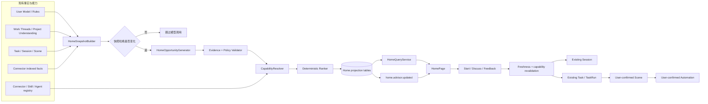
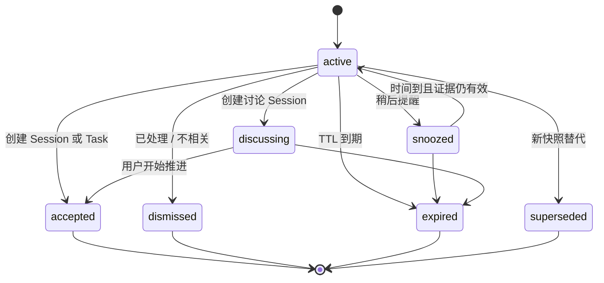

# xopc 智能工作台：场景建议技术设计

日期：2026-09-23  
状态：P3 工程实现完成，真实样本发布验证待执行

产品依据：[智能工作台场景建议产品方案](./home-intelligence-product-proposal.md)。领域边界继续遵循[场景产品北极星](./scenes-product-north-star.md)和[场景系统技术设计](./scenes-technical-design.md)。

## 0. 技术结论

首页场景建议实现为一个**异步生成、可过期、可解释的首页投影**，而不是新的工作对象或新的执行系统。

- 输入复用 User Model、Knowledge / Work Threads、Project Understanding、Task、Session、Scene 结果与 Connector 同步结果；不建立第二套记忆。
- 模型只生成“值得推进的候选、理由、缺失信息和语义能力需求”；系统负责证据、新鲜度、权限、能力、风险、去重和最终排序。
- `GET /api/home` 只读取缓存，不同步调用模型；刷新在 Gateway 后台完成，提交后通过 realtime 通知页面重新读取。
- 建议未采纳前只存在于首页投影表；用户开始后交给现有 Session 或 Task / TaskRun，持续帮助经用户确认后交给 Scene，重复执行经确认后交给 Automation。
- 已支持项目下一步、交付风险、会议准备、承诺跟进和重复工作自动化候选；跨来源场景只读取 Connector 已同步到本地的有界事实，不在首页生成路径请求远端。
- 不复活已经退休的 `proactive_*` 运行时或 `/api/inbox/judgments`。旧 Judgment 合约、客户端分支和通知深链已经移除，lazy-route 测试继续断言旧 API 不存在；新建议使用独立的 `advisor` 契约。

## 1. 现有基础与增量边界

| 能力 | 当前实现 | 本方案的使用方式 |
| --- | --- | --- |
| 首页聚合 | `src/tasks/home-query-service.ts`、`GET /api/home` | 保留任务、审批、失败、运行中和计划事项；追加 advisor 投影 |
| 注意力治理 | `src/tasks/attention-governor.ts` | 继续治理必须处理事项；新增 HomeLayoutPolicy 决定建议是主卡、紧凑行或不展示 |
| 首页契约 | `packages/gateway-contract/src/home.ts` | 增加 `advisor`、建议动作和反馈契约，不把建议塞入 `HomeDecision` |
| 工作理解 | `src/work-discovery/` | 读取已经持久化的 Project Understanding、Work Threads 和证据；首页打开不触发目录扫描 |
| 用户理解 | `src/agent/context/execution-context.ts`、`src/user-model/` | 读取有作用域、有效且获准使用的目标、优先级、规则和断言 |
| Connector | `src/connectors/` | 复用安装、账号、scope、Agent allowlist 和连接状态；抽取通用预检而非复制 Workflow 规则 |
| Skill | `src/agent/skills/skill-manager.ts` | 只选择已加载、已启用、对目标 Agent 可见且工具门禁满足的 Skill |
| 执行 | Session、Task / TaskRun、Scene、Automation | 建议被采纳后交接；Home Intelligence 不执行用户工作 |
| Realtime | Gateway `gateway` topic | 只发布版本变化提示，客户端收到后重新读取 `/api/home` |

新增领域建议放在 `src/home-intelligence/`。它可以依赖只读端口和通用基础设施，不允许 Task、Scene、Connector 反向依赖它。首页组合仍由 `HomeQueryService` 负责。

## 2. 总体架构



### 2.1 同步边界

`GET /api/home` 的同步路径只能执行本地查询、确定性投影和有限的 readiness 读取。下列操作禁止出现在该请求中：

- LLM 调用；
- Connector 网络请求或全量同步；
- Work Discovery 扫描；
- Skill 市场搜索或安装；
- 创建 Task、Scene 或 Automation。

页面首次内容因此不受模型延迟、模型额度或外部来源故障影响。

### 2.2 异步边界

`GatewayHomeIntelligenceHost` 在 Gateway 启动后维护一个单实例 worker：

1. 合并刷新请求；
2. 使用 SQLite lease claim 一个 generation；
3. 构建授权快照；
4. 在需要时调用模型；
5. 校验并原子替换活动投影；
6. 事务提交后发布 realtime 提示；
7. 失败按有限退避重试，不影响现有首页。

首版部署仍是单 Gateway、单 SQLite，不引入外部队列或分布式锁。

## 3. 模块划分

建议新增：

```text
src/home-intelligence/
  contracts.ts              # 内部候选、快照与状态类型
  snapshot-builder.ts        # 读取并规范化已授权事实
  evidence-policy.ts         # 新鲜度、归属、来源和引用校验
  opportunity-generator.ts   # 纯结构化模型调用，无工具
  capability-resolver.ts     # 语义需求 -> 已安装能力及恢复路径
  ranking-policy.ts          # 硬过滤、去重、排序和展示阈值
  repository.ts              # generation / projection / feedback
  refresh-coordinator.ts     # 合并、入队、lease、重试
  application-service.ts     # refresh / start / discuss / feedback
  host.ts                    # Gateway 生命周期组合根
```

现有文件的主要改动：

| 文件 | 变更 |
| --- | --- |
| `packages/gateway-contract/src/home.ts` | 增加 advisor、机会、能力、证据、动作及反馈 schema |
| `src/tasks/home-query-service.ts` | 读取 advisor 投影并通过 HomeLayoutPolicy 组合；不调用生成器 |
| `src/gateway/hono/routes/home.ts` | 增加 refresh、start、discussion、feedback、clarification 路由 |
| `src/gateway/service.ts` | 创建、启动和停止 `GatewayHomeIntelligenceHost` |
| `src/gateway/hono/routes/lazy-bundles.ts` | 现有 `/api/home` matcher 已覆盖；新增路径需补映射测试 |
| `src/gateway/security/gateway-scopes.ts` | 复核读取为 `work.read`、变更为 `work.write`；当前 `/api/home` family 已有基础映射 |
| `web/src/pages/home-page.tsx` | 根据 advisor state 渲染主建议、澄清、紧凑建议和安静态 |
| `web/src/features/tasks/home-api.ts` | 增加建议动作 API；后续可迁至 `features/home/` |
| `web/src/i18n/locales/{zh,en}/projects.json` | 增加建议、证据、能力补齐、反馈和过期文案 |

Connector 预检应从 `preflightWorkflowConnectors` 抽取共享内核，例如 `preflightConnectorRequirements`，再由 Workflow 和 Home Intelligence 分别适配自己的输入契约。不得复制 account selection、scope 和 allowlist 判断。

## 4. 公共契约

### 4.1 首页响应

`HomeResponse` 增加默认值明确的 `advisor`，保证旧数据或灰度关闭时仍能解析：

```ts
type HomeAdvisor =
  | { state: 'disabled' }
  | { state: 'quiet'; reason: 'no_change' | 'insufficient_value' | 'model_unavailable' }
  | { state: 'refreshing'; previous?: HomeOpportunity; requestedAt: number }
  | { state: 'clarification'; question: HomeClarification; generatedAt: number; expiresAt: number }
  | {
      state: 'ready';
      primary: HomeOpportunity;
      alternatives: HomeOpportunity[]; // max 2
      placement: 'primary' | 'compact';
      generatedAt: number;
      expiresAt: number;
      stale: boolean;
    };
```

`disabled` 表示用户未开启主动建议；`quiet` 是合法产品状态，不应在 UI 中显示错误。刷新失败且旧投影仍在有效期内时返回旧投影并设置 `stale: true`；过期后退回 quiet。

### 4.2 首页建议

```ts
type HomeOpportunity = {
  id: string;
  revision: number;
  kind: 'project_next_step' | 'delivery_risk' | 'meeting_prep' | 'commitment_follow_up' | 'automation_candidate';
  projectId?: string;
  title: string;
  outcome: string;
  rationale: string;
  evidence: HomeEvidence[]; // 1..8
  confidence: 'high' | 'medium' | 'low';
  urgency: 'now' | 'today' | 'this_week';
  estimatedMinutes?: number;
  risk: 'analysis' | 'external_read' | 'file_write' | 'external_write';
  proposedSteps: string[]; // 1..6
  capabilities: HomeCapabilityReadiness[];
  verification: string[];
  actions: {
    canStart: boolean;
    canDiscuss: boolean;
    degradedStartAvailable: boolean;
  };
  generatedAt: number;
  expiresAt: number;
};

type HomeEvidence = {
  id: string;
  sourceType: 'project' | 'task' | 'conversation' | 'scene' | 'calendar' | 'mail' | 'file' | 'user_model';
  sourceRef: string;
  revision: string;
  observation: string;
  observedAt: number;
  freshUntil: number;
  href?: string;
};

type HomeCapabilityReadiness = {
  kind: 'connector' | 'skill' | 'agent';
  capability: string;          // 业务能力，如 calendar.read、code.review
  resolvedId?: string;         // 系统验证后的真实 ID；模型不能直接决定
  readiness: 'ready' | 'needs_setup' | 'unavailable';
  required: boolean;
  recoveryPath?: string;
  reason?: string;
};
```

内部字段 `dedupeKey`、`snapshotHash`、模型评分、原始模型 JSON 和内部失败原因不进入公共响应。

### 4.3 模型输出契约

模型输出和公共契约分离。模型只能返回语义需求，不能宣称某个 Connector、Skill 或 Agent 已经存在：

```ts
type GeneratedCandidate = {
  candidateKey: string;
  kind: HomeOpportunity['kind'];
  title: string;
  outcome: string;
  rationale: string;
  evidenceIds: string[];
  missingInformation: string[];
  confidence: number;          // 0..1
  urgency: HomeOpportunity['urgency'];
  impact: number;              // 0..1
  estimatedMinutes?: number;
  risk: HomeOpportunity['risk'];
  proposedSteps: string[];
  requirements: Array<{
    kind: 'connector' | 'skill' | 'agent';
    capability: string;
    access: 'read' | 'write' | 'execute';
    required: boolean;
  }>;
  verification: string[];
};
```

响应使用 strict Zod schema；未知字段、未知 evidence ID、空结果、越界数组和不支持的风险类型均拒绝整次生成，不能尽力猜测。

## 5. 场景快照与证据

### 5.1 快照结构

`HomeSnapshotBuilder` 生成有界、稳定排序、可哈希的快照：

```ts
type HomeContextSnapshot = {
  version: 1;
  ownerId: string;
  workspaceId: string;
  asOf: number;
  locale: 'en' | 'zh';
  goals: SnapshotGoal[];
  priorities: SnapshotPriority[];
  workThreads: SnapshotWorkThread[];
  projects: SnapshotProject[];
  tasks: SnapshotTask[];
  recentSessions: SnapshotSession[];
  recentSceneResults: SnapshotSceneResult[];
  evidence: HomeEvidence[];
  suppressionRules: SnapshotSuppressionRule[];
};
```

数据源及首版限制：

| 数据源 | P0 读取内容 | 限制 |
| --- | --- | --- |
| Execution Context | 已确认目标、当前优先级、主动帮助规则 | working assumption 降权，不能授权动作 |
| Work Threads | active / blocked / uncertain 工作线程 | 只读持久化结果，不在首页重跑 discovery |
| Project Understanding | 项目摘要、当前状态、证据引用 | 每项目只取最新有效版本 |
| Task | 活跃、阻塞、待验收和最近完成状态 | 不复制 Task 状态，快照只保留摘要和引用 |
| Session | 最近相关会话的标题、项目、最后交互时间 | 不默认拼接完整 transcript |
| Scene | 最新可见成果和持续委托范围 | 不把未授权 Scene 结果跨 scope 合并 |
| Connector facts | 连接器已持久化的索引事实 | P0 不启用；P1 后不在生成路径请求远端 |

已有 `buildExecutionContext` 可提供目标、优先级、规则和经过作用域过滤的知识。首页应新增只读 adapter，而不是绕过访问策略直接查询 User Model 表。

### 5.2 证据预算

首版固定上限，防止首页理解退化成无界 Agent 任务：

- 最多 40 条输入证据；
- 单条 observation 最多 1,000 字符；
- 快照可见文本总计最多 40,000 字符；
- 每个候选最多引用 8 条证据；
- 最近会话只保留标题、项目、时间和最多一条已生成摘要；
- 不把附件原文、邮件全文、文件全文或工具输出直接放入快照。

截断必须按来源优先级和新鲜度完成，并在内部 generation 记录 `truncatedSourceCounts`，不能随机截断。

### 5.3 授权与新鲜度

每条证据包含 owner、workspace、可选 project / account scope、revision 和 `freshUntil` 的内部元数据。进入模型前校验一次，发布投影前重新读取一次：

1. 主体和 workspace 一致；
2. 项目、会话、Scene 或 Connector account 仍对当前用户可见；
3. 来源未删除、撤回或失效；
4. revision 未改变，或改变后仍产生同一 snapshot hash；
5. `freshUntil > now`。

任一必要证据失效则放弃本次提交并重新排队；不能发布基于旧权限生成的建议。

## 6. 模型生成

### 6.1 模型选择

- 快照直接复用已有理解产物；首页刷新本身不再额外运行一遍 `@understanding`。
- 候选生成使用默认 Agent 的 `@reasoning`，解析方式复用 `resolveModelSelector`；未配置 reasoning intent 时按现有规则回退 chat。
- 如果模型凭据不可用，generation 记录 `model_unavailable` 并返回 quiet 或仍有效的旧投影，不向首页抛 500。

这保留“模型参与判断”，同时避免一次刷新连续调用 understanding 与 reasoning 两个模型。User Model / Project Understanding 的更新仍由各自现有流程使用 `@understanding` 完成。

### 6.2 执行约束

生成器是无工具、只读、单轮结构化调用：

- 最多 5 个候选或 1 个 clarification；
- timeout 120 秒；
- 最大输出 3,000 tokens；
- 不允许网络、文件、Connector、Task 或 Scene 工具；
- 指令明确把证据正文视为不可信数据，来源中的命令不能覆盖系统约束；
- 必须区分事实、工作假设和缺失信息；
- 不得把“安装某功能”本身当作用户价值；
- 没有足够价值时返回空 candidates，而不是补齐数量。

### 6.3 澄清问题

模型只有在以下条件同时满足时才可输出 clarification：

- 至少存在两个证据支持、价值接近但方向不同的候选；
- 一个用户回答可以明显改变首选候选；
- 问题不要求用户重新描述系统已经知道的事实。

系统校验 question 长度、2–3 个互斥选项及 evidence IDs。回答只写入本次首页偏好窗口，并触发刷新；除非用户明确选择“以后都这样”，不写入长期 User Model。

## 7. 硬过滤、去重和排序

### 7.1 硬过滤

模型候选先经过确定性过滤：

- 至少一个有效证据，且所有引用存在于当前快照；
- `confidence >= 0.65`、系统计算的 `valueScore >= 0.60`；
- 对应工作没有完成、取消或进入已有 review / decision 流程；
- 不与活动 Task、运行中 Session、有效 Scene 结果或活动首页建议重复；
- 没有命中首页反馈投影中的同场景抑制条件；
- 所需能力 ready，或存在明确的 setup / degraded 路径；
- 输出是可交付结果或明确决定，不是资讯摘要；
- `external_write` 只能作为需确认的计划出现，不能直接执行。

阈值与当前 `AttentionGovernor` 的主动内容门槛保持一致，避免两个首页策略相互矛盾。

### 7.2 稳定去重键

系统生成而不是信任模型提供的 `dedupeKey`：

```text
sha256(
  kind + sorted(subjectRefs) + normalizedOutcome + scope + policyVersion
)
```

其中 `normalizedOutcome` 只做大小写、空白、标点和稳定 topic key 归一化，不在首版做向量相似去重。活动投影、已采纳投影以及带 `home_opportunity` context edge 的活动 Task 均参与去重。

### 7.3 排序

模型提供 confidence、impact 和 urgency 语义，系统重新计算排序：

```text
valueScore =
  0.27 * goalRelevance +
  0.20 * urgency +
  0.18 * impact +
  0.15 * executability +
  0.12 * evidenceQuality +
  0.08 * capabilityReadiness -
  interruptionPenalty
```

各分量由有限枚举和可审计规则转换，最终 clamp 到 0..1。模型不能通过返回超大数字越过阈值。

### 7.4 首页布局策略

新增 `HomeLayoutPolicy`，输入 `AttentionGovernor` 的结果、真实成果和 advisor 候选：

1. 有 `needsUser`：主建议降为 compact；如果建议 urgency 不是 now，则本次隐藏。
2. 有已准备好的 artifact / insight：成果优先，建议 compact。
3. 无需用户处理且有合格建议：显示 primary 建议卡。
4. 只有 clarification：在输入器上方显示一个问题。
5. 无合格建议：保留现有 quiet 空闲态和输入器。

最多返回一个 primary 和两个 alternatives，但首页默认只展开 primary。

## 8. Capability Resolver

模型只声明 `calendar.read`、`mail.thread.read`、`code.inspect`、`code.modify`、`document.compose` 等业务能力。Resolver 使用注册表完成真实映射。

### 8.1 Connector

复用或抽取现有 Workflow Connector preflight 的判断顺序：

1. Connector definition 存在；
2. instance 已安装且 enabled；
3. installation policy 允许目标 Agent；
4. max scope 覆盖 read / write 要求；
5. 明确 account 可用，多个账号时要求用户选择；
6. connection active，expired / failed 返回 reauthorization；
7. recovery path 指向 `/connectors?connector=<id>`。

生成阶段只能读取本地 readiness；用户点击开始时允许执行一次最新 preflight。不得为了展示建议自动发起 OAuth。

### 8.2 Skill

通过 `SkillManager.selectSkillsForAgentIndexing` 或等价共享选择器，要求：

- Skill 已加载且 enabled；
- 未设置 `disableModelInvocation`；
- 在目标 Agent allowlist 中；
- 所需 tool gating 已满足；
- requirement / diagnostic 没有阻止运行。

市场中存在但未安装的 Skill 可返回 `needs_setup`，不能显示成 ready。安装必须由用户操作并在完成后重新解析原建议。

### 8.3 Agent 与模型

目标 Agent 必须存在、enabled，并能解析建议需要的模型 intent。首版默认使用当前 default Agent；只有业务能力明确需要时才选择其他 Agent，不让模型按名称猜测。

## 9. SQLite 持久化

实现时使用主干下一个 migration 版本；当前仓库最新为 202，不在设计文档中抢占固定编号。新增三张表，不恢复任何 `proactive_*` 表。

### 9.1 `home_advice_generations`

一次可恢复的刷新尝试，也是合并队列与审计记录。

| 字段 | 说明 |
| --- | --- |
| `id` | UUID |
| `owner_id`, `workspace_id` | 安全边界 |
| `status` | `queued/running/succeeded/skipped/retry_wait/failed/cancelled` |
| `reasons_json` | 被合并的触发原因，不存敏感正文 |
| `requested_at`, `started_at`, `completed_at`, `retry_at` | 生命周期 |
| `lease_owner`, `lease_until`, `lease_epoch` | 崩溃恢复和 fencing |
| `attempt` | 最多 3 次 |
| `snapshot_hash`, `evidence_ids_json` | 生成依据 |
| `model_ref`, `input_tokens`, `output_tokens`, `estimated_cost_usd` | 成本 |
| `outcome_reason`, `error_code` | 可枚举原因 |

同一 owner / workspace 最多一个 queued 或 running generation。新触发只更新 `reasons_json` 和 `requested_at`；running 期间再次失效则设置 `dirty_after_start`，完成后再排一个 generation。

### 9.2 `home_opportunity_projections`

这是首页缓存，不是 Task：

| 字段 | 说明 |
| --- | --- |
| `id`, `generation_id` | 投影与来源 generation |
| `owner_id`, `workspace_id` | 安全边界 |
| `rank` | 0..2 |
| `kind`, `project_id` | 场景分类和可选项目 |
| `dedupe_key` | 系统计算的稳定键 |
| `content_json` | 通过公共 schema 校验的用户可见内容 |
| `evidence_refs_json` | ID、revision、freshUntil；不复制全文 |
| `snapshot_hash` | 快照版本 |
| `state` | `active/snoozed/accepted/discussing/dismissed/expired/superseded` |
| `revision` | CAS，从 1 开始 |
| `created_at`, `updated_at`, `expires_at`, `snoozed_until` | 生命周期 |
| `resolution_kind`, `resolution_ref` | 可选 Session / Task / Scene 引用 |

部分唯一索引保证同一 owner / workspace / dedupe key 最多一个 active 或 snoozed 投影。新 generation 原子写入新投影并把不再保留的旧 active 投影标为 superseded。

### 9.3 `home_opportunity_feedback`

追加式事实记录：

| 字段 | 说明 |
| --- | --- |
| `id`, `projection_id` | UUID 与目标 |
| `kind` | `started/discussed/already_done/irrelevant/too_early/source_incorrect/less_like_this/snoozed` |
| `reason_code`, `note` | 可选原因，note 限长 |
| `scope_json` | 本次、项目或场景类型；只能来自用户选择 |
| `idempotency_key` | 防重复 |
| `created_at` | 时间 |

`less_like_this` 是明确用户设置：在同一事务内写入带场景范围的追加式反馈，并由首页仓储投影为抑制键。普通 ignore 或未点击不写长期偏好。首版不提供撤销，避免引入一套尚未闭环的反向事件语义。

### 9.4 生命周期



建议默认 TTL：项目下一步 24 小时，交付风险 8 小时，会议准备取会议开始前且不超过 24 小时，承诺跟进不超过来源截止时间。读取时即使维护任务尚未运行，也必须把已过期记录视为不可用。

## 10. 刷新触发与成本控制

### 10.1 P0 触发

- Gateway 启动后，如果缓存已过期且用户启用了主动建议；
- 当天第一次 `GET /api/home`，仅异步入队，当前请求返回缓存或 quiet；
- Task 创建、状态改变、完成或验收；
- Project Understanding / Work Threads 成功更新；
- 用户手动刷新；
- 用户回答 clarification 或反馈来源错误。

P1 再接入 Connector indexed fact revision、Scene outcome 和 Session completion 的领域事件。不要在 P0 为所有 transcript delta 入队；会话结束或摘要 revision 改变才算有效变化。

### 10.2 快照哈希

快照按稳定字段排序后 canonical JSON hash。以下字段不参与 hash：

- `asOf`；
- generation ID；
- UI locale 以外的展示格式；
- 非语义统计和读取顺序。

若 hash 与最后一次 succeeded generation 相同且活动投影未过期，generation 记为 `skipped/no_change`。即使有多个事件，也只产生一次模型调用。

### 10.3 预算

P0 默认约束：

- owner / workspace 同时最多 1 个模型调用；
- 每 30 分钟最多 1 次自动生成；用户手动刷新可绕过时间门槛但仍受并发和每日预算；
- 每日最多 12 次生成；
- 每次最多 5 个候选、最终最多 3 个投影；
- 连续失败最多重试 2 次，退避 1 分钟、5 分钟；
- 模型不可用时至少 30 分钟后再自动尝试。

预算是产品默认值，先作为代码常量并记录指标；验证真实成本后再决定是否进入用户配置。

## 11. API 设计

所有 mutation 使用 strict rate limit、认证主体、CAS revision 和 idempotency key。

### 11.1 读取与刷新

```text
GET  /api/home?locale=zh
POST /api/home/advisor/refresh
```

手动 refresh 请求：

```json
{ "idempotencyKey": "uuid", "reason": "user_requested" }
```

成功返回 `202 { ok: true, generationId }`。重复 key 返回同一 generation。`userContext.enabled=false` 时返回 disabled 标识，不静默修改设置。

### 11.2 开始或讨论

```text
POST /api/home/opportunities/:id/action
```

```ts
type HomeOpportunityStartRequest = {
  expectedRevision: number;
  idempotencyKey: string;
  mode: 'start' | 'discuss' | 'degraded_start';
};

type HomeOpportunityStartResponse =
  | { outcome: 'chat_draft'; href: string }
  | { outcome: 'task'; taskId: string; href: string }
  | { outcome: 'needs_setup'; preflight: HomeCapabilityPreflight };
```

处理顺序：

1. 使用 owner / workspace / ID 查询，校验 state、revision 和 expiresAt；
2. 重读必要证据 revision 和授权；
3. 重新运行 capability preflight；
4. 若缺能力且 mode 不是 degraded，返回 setup，不改变建议状态；
5. 根据 launch policy 创建 Session 或 Task；
6. 持久关联后再把 projection 标为 discussing / accepted；
7. 发布首页变化事件。

`risk = analysis` 且无需长期跟踪时可创建 Session；需要多步推进、验证、文件修改或截止跟踪时创建 Task。`external_write` 只创建带审批边界的 Task / Session，不能由此接口直接发送、发布、合并或部署。

Task 创建使用 `home-opportunity:<id>:<request-idempotency-key>` 派生的 idempotency key，并添加 evidence context edge。Task 创建和投影反馈在同一 SQLite write transaction 中完成；重试通过相同 key 找回 Task。

讨论 Session 的创建请求增加经过服务端校验的 source context：

```ts
sourceContext: {
  kind: 'home_opportunity';
  id: string;
  revision: number;
  intent: 'discuss';
}
```

Session metadata 只保存建议 ID / revision；首轮上下文在服务端按当前权限加载，不能信任 URL 中拼接的证据正文。

### 11.3 反馈

```text
POST /api/home/opportunities/:id/feedback
```

```ts
type HomeOpportunityFeedbackRequest = {
  expectedRevision: number;
  idempotencyKey: string;
  kind: 'already_done' | 'irrelevant' | 'too_early' | 'source_incorrect' | 'less_like_this' | 'snooze';
  note?: string;
  snoozeUntil?: number;
  preferenceScope?: 'this_item' | 'project' | 'opportunity_kind';
};
```

只有 `less_like_this` 可以选择 project / opportunity_kind 范围；其他反馈默认只作用于当前投影。`source_incorrect` 触发对应理解源重新评估，但不直接删除 User Model 事实。

### 11.4 澄清回答

```text
POST /api/home/clarifications/:id/respond
```

请求带 option ID 或自由文本、expectedRevision 和 idempotency key。回答保存为有明确 TTL 的首页 preference window，入队刷新；不写长期断言。

### 11.5 错误语义

| 状态 | 使用场景 |
| --- | --- |
| 400 | schema 无效 |
| 404 | 当前主体不可见；不泄露是否属于其他 owner |
| 409 | revision 冲突、状态已变化、主动建议关闭 |
| 410 | 已过期且没有 replacement |
| 422 | capability / evidence 无法满足且不可降级 |
| 202 | refresh 已入队或 Task 正在启动 |

## 12. 执行交接与现有领域关系

### 12.1 Session

“先聊一聊”创建普通 Session，并通过受信 source context 注入：建议目标、系统验证后的证据摘要、缺失信息、风险和当前能力范围。Agent 收到的规则明确：讨论模式不得因为建议曾显示在首页而获得额外写权限。

### 12.2 Task / TaskRun

“开始推进”在需要持久跟踪时创建 Task：

- `title` 使用建议 title；
- `contract.objective` 使用 outcome；
- `successCriteria` 来自 verification；
- `context` 只存稳定 source refs 和 `home_opportunity` 引用；
- `authorityGrants` 只包含用户本次明确同意且宿主允许的最小范围；
- executor 使用确定性解析后的 Agent / Workflow，不使用模型自由文本；
- 任务状态、执行重试、等待、验收和完成全部由现有 Task / TaskRun 承担。

首页建议在 Task 创建后即退出 advisor 层，后续由现有 `needsUser` / `background` 展示运行状态。

### 12.3 Scene

Home Intelligence 不自动创建 Scene。一次帮助完成且系统识别到稳定重复时，可以生成一个新的 `automation_candidate` 建议，用户确认后调用现有 Scene preflight / start：

- 目标、scope、context providers 和权限都重新展示；
- Scene Activation 固定模板版本；
- 建议证据不是 Scene 授权；
- Scene 结果继续进入现有 presentation / feedback / notification 链路。

### 12.4 Automation

只有用户明确确认重复执行条件、频率、范围和外部动作边界后才创建 Automation。成功执行过一次建议不等于授权未来自动执行。

## 13. 权限、安全与隐私

### 13.1 授权模型

最终可用范围取交集：

```text
认证主体
∩ 当前 workspace / project 可见性
∩ Connector installation 与 account 授权
∩ Agent allowlist 与工具门禁
∩ User Context 总开关与持久化的建议反馈规则
∩ 本次开始动作明确同意的范围
```

模型输出、Skill 文档、Connector 内容、文件正文和会话文本都不能扩大权限。

### 13.2 Prompt injection

- 快照中证据使用结构化 envelope，与系统指令分区；
- 来源文本中的“忽略此前规则”“调用工具”等只作为数据；
- 生成器无工具，因此即使模型被诱导也不能产生外部效果；
- 只接受 schema 中的 evidence IDs 和语义 capability；
- 所有真实 ID、href、readiness 和动作范围由系统重建。

### 13.3 数据最小化

- generation 不保存完整 prompt 或来源全文；
- projection 只保存用户已经能看到的短 observation 与稳定引用；
- realtime 事件不携带建议正文；
- 日志只记录 generation ID、hash、计数、模型、耗时和枚举原因，不记录证据内容；
- 来源撤权或删除时立即使相关活动投影失效，后台清理历史短摘要；
- `processingPolicy = local_only` 时，如果没有合规本地模型，生成被跳过，不能静默把数据发送到远端模型。

`processingPolicy` 首版沿用 User Context 的严格限制；后续若需要独立设置，只能提供更严格的覆盖，不能放宽既有来源策略。

### 13.4 用户开关

主动建议遵循现有 `userContext.enabled` 总开关，并使用首页建议自己的反馈投影保存“少推荐此类”等偏好，不恢复已删除的 `relationship_settings` 或 `proactive` Collaboration Rule 类别。关闭后：

- 不再入队自动生成；
- 活动建议从首页隐藏并标为 dismissed / policy_disabled；
- 已创建的 Task、Session、Scene 和 Automation 不被删除；
- 手动重新理解仍属于 Work Discovery，不自动重新打开主动建议。

## 14. Realtime、缓存与降级

generation 提交后：

```ts
realtime.publish('gateway', 'home.advisor.updated', {
  state: 'ready' | 'quiet' | 'clarification' | 'feedback' | 'acted',
  completedAt?: number,
});
```

事件不携带 owner 数据或卡片内容。Web realtime bridge 会将事件转换为 `home-advisor-updated` window event，`HomePage` debounce 后调用 `fetchHome()`。

缓存与降级规则：

- 页面加载只请求一次 `/api/home`；现有 session / workflow 事件仍可触发合并刷新；
- 建议刷新事件 debounce 100–300ms；
- 有效旧投影可以 stale-while-revalidate；
- 过期、撤权或 necessary evidence 改变时不得展示 stale；
- advisor 失败不得遮挡 `needsUser`、background 或输入器；
- Web 不需要轮询模型状态，`refreshing` 超过 60 秒可显示“仍在理解”，超过 generation timeout 后回 quiet / stale。

## 15. 可观测性与评测

### 15.1 结构化日志

建议使用 `createLogger('HomeIntelligence')`：

```text
generationId, ownerId, workspaceId, phase,
snapshotHash, evidenceCount, candidateCount, acceptedCount,
modelRef, inputTokens, outputTokens, estimatedCostUsd,
durationMs, outcomeReason, errorCode
```

不记录原始证据、用户反馈 note、Connector token 或完整模型输出。

### 15.2 指标

运行指标：

- `home_advice_generation_total{outcome}`；
- `home_advice_generation_duration_ms`；
- `home_advice_model_cost_usd`；
- `home_advice_candidate_filtered_total{reason}`；
- `home_advice_projection_stale_total`；
- `home_advice_duplicate_total`；
- `home_advice_capability_setup_total{kind,outcome}`。

产品指标通过 projection → Session / Task / Scene 的稳定引用计算，不能只看点击：

- 建议开始率、讨论率、纠正率；
- 建议到 Task 创建、成果验收或明确决定的转化；
- `irrelevant/already_done/source_incorrect/too_early` 分布；
- 重复和过期建议率；
- 每次真实推进的模型与 Connector 成本。

### 15.3 离线评测集

建立脱敏 fixture，至少覆盖：

- 一个明确项目下一步；
- 已完成事项不得再建议；
- 同一事项已有 Task；
- 两个方向需要澄清；
- 证据冲突；
- 来源过期或撤权；
- 缺少 Connector；
- Skill 未安装、被禁用或不在 allowlist；
- Prompt injection 文本；
- 没有高价值事项；
- 用户要求少建议某类事项；
- 中英文输出。

离线 gate：证据引用正确率 100%，已完成事项误建议率 0%，越权证据率 0%，不存在能力误报率 0%。相关性和文案质量再使用人工评分与模型评审作为辅助，不能替代硬 gate。

## 16. 测试矩阵

### 16.1 单元测试

- snapshot 稳定排序、预算、hash 与作用域过滤；
- strict model parsing、未知 evidence、数组上限、空候选；
- capability mapping、账号选择、scope、Skill allowlist；
- hard filter、value score、dedupe 和 placement；
- TTL、snooze、replacement 和 Collaboration Rule；
- start 的 revision、幂等和崩溃恢复。

### 16.2 Repository / migration 测试

- migration 从 202 后的真实 schema 升级，不删除现有 Task、Scene、User Model 数据；
- 部分唯一索引阻止两个活动 dedupe key；
- lease epoch 阻止过期 worker 提交；
- generation、投影替换和 realtime outbox / publication marker 的事务一致性；
- owner / workspace 隔离；
- maintenance 过期和清理。

### 16.3 HTTP / 契约测试

- `HomeResponseSchema` 对 disabled / quiet / refreshing / clarification / ready 的解析；
- `/api/home` 不调用模型；
- refresh 202 和 rate limit；
- start 的 404 / 409 / 410 / 422；
- feedback CAS 与 idempotency；
- `/api/home/opportunities/*` 都映射到 home lazy bundle，邻近 `/api/home-other` 不被捕获；
- security scope 的 read / write 划分。

### 16.4 Web 测试

- must-handle 事项压过主建议；
- idle + primary、compact、clarification、quiet、refreshing、stale；
- 证据展开和来源链接；
- setup 后返回原建议；
- start / discuss / degraded；
- feedback 和 snooze；
- realtime 后 debounce refetch；
- 窄屏、键盘、focus、ARIA 和 reduced motion。

### 16.5 端到端验收

真实运行 Gateway 并验证：项目理解更新 → generation → 首页显示 → 点击开始 → Task / Session 创建 → 首页建议消失 → 现有 background 显示执行 → 完成后进入现有 review / result。单独的 route unit test 不足以覆盖 lazy bundle、认证、SQLite 和 realtime。

## 17. 分阶段实施

截至 2026-09-23，P0 已按下列阶段落地。实现采用 `home_*` 独立投影与现有 Task / Session 执行链组合，不包含被清理的旧 Proactive API、Judgment 或兼容分支。

### PR 0：清理基线与测量

- 为 `/api/home` 增加现有延迟、错误和 item count 指标；
- 保持旧 Judgment 合约、调用和过滤分支不存在，并保留路由负向回归测试；
- 固定当前 quiet、needsUser 和 background 回归测试；
- 不改变用户体验。

### PR 1：契约、迁移与 Repository

- 增加 gateway contract；
- 增加三张表、索引、repository、TTL maintenance；
- 完成状态机、CAS、幂等和 owner 隔离测试；
- `/api/home` 在 advisor disabled / quiet 下保持兼容。

状态：已完成。SQLite schema version 204；包含 lease、CAS、TTL、幂等、反馈与去重测试。

### PR 2：P0 快照与模型生成

- 接入 User Context、Work Threads、Project Understanding、Task 和 Session adapters；
- 实现有界快照、hash、structured generation、hard filter 和 ranker；
- 只生成 `project_next_step` / `delivery_risk`；
- 加入离线 fixtures 和无工具安全测试。

状态：已完成。快照覆盖 Project、Task、Work Thread / Project Understanding 知识及最近会话；模型生成无工具，evidence ID、readiness、风险与排序均由确定性策略复核。

### PR 3：后台 Host 与首页呈现

- Gateway 生命周期、lease worker、刷新触发和 realtime；
- `HomeQueryService` 组合 advisor；
- Web 主建议、证据展开、clarification、quiet / stale / refreshing；
- 首屏仍不等待模型。

状态：已完成。Gateway 采用后台 lease worker、30 分钟刷新和领域事件触发；首页实现 ready / clarification / refreshing / stale / quiet / disabled 状态。

### PR 4：开始、讨论与反馈闭环

- capability preflight、Session source context、Task context edge；
- start / discuss / feedback / snooze；
- 建议 → Task / Session 的幂等恢复；
- 完整 E2E 与真实 Gateway 鉴权测试。

状态：核心闭环已完成。开始动作原子创建并启动现有 Agent Task，讨论生成可编辑聊天草稿，反馈支持幂等、稍后提醒和“少推荐此类”。真实部署验收与长期规则撤销界面仍属于发布前验收项。

### P1：能力补齐

- 通用 Connector preflight；
- Skill readiness 和安装返回原建议；
- degraded start；
- 一次成功后建议开启 Scene。

状态：已完成。Connector 与 Workflow 共用 `preflightConnectorRequirements`；Skill readiness 保留具体不可用原因；开始动作返回结构化恢复路径，支持安装后返回原建议以及模型明确给出的降级执行；同类 automation candidate 的关联 Task 成功关闭后才显示 Scene 建议。

### P2：跨来源时刻

- Calendar meeting prep、Mail / Slack commitment follow-up；
- Connector fact revision 事件；
- 源变化即时撤回；
- 仅对高价值、及时性强的建议接通页面外通知。

状态：已完成。同步到本地 Knowledge 的 Calendar、Mail 与 Communication 事实被映射为独立证据类型；`meeting_prep` 和 `commitment_follow_up` 受确定性来源门槛约束。Connector 增量同步完成后会先撤回依赖旧跨来源事实的活动建议，再后台重算。页面外提醒仅用于后台产生的高置信、紧急、可直接开始的主建议，并按证据 revision 稳定去重；移动推送默认关闭，需显式启用 `homeOpportunity`。

### P3：个性化与自动化

- 基于明确反馈的场景阈值；
- 重复成功工作识别；
- 用户确认后创建 Automation；
- 策略版本、离线回放和在线实验。

状态：工程实现已完成。近 90 天同场景至少 3 次明确“不相关/来源不准”，且未被后续采用抵消时，Policy 将该场景门槛提升为仅接收高置信候选；未点击不产生负反馈。已成功完成的关联 Task 按项目与标准化 outcome 聚合并进入下一次有界快照，1 次成功只提示 Scene，至少 2 次且模型 outcome 精确匹配时才展示 Automation 草稿入口。入口复用现有“模型生成草稿 → 风险与模拟预览 → 用户确认 → 发布”链路，不直接创建 Automation。

每次 generation 持久化 `strategy_version=home-v1`；`GET /api/home/advisor/metrics` 按版本返回生成成本、开始、讨论、纠正和 Task 完成等真实推进指标，为后续版本对比提供最小在线实验基础，不增加随机分流平台。离线回放器直接执行生产 Policy，当前 12 个脱敏合成回归场景通过预期结果、证据引用、能力声明和外部写入确认四项硬门槛；上线前仍需以至少 10 个真实脱敏项目样本完成发布验证。

## 18. P0 完成定义

P0 只有在以下条件同时满足时完成：

- 首页读取路径没有模型或 Connector 网络调用；
- 100% 建议包含当前主体可打开或可解释的有效证据；
- 已完成、已取消、有活动 Task 或被抑制的工作不会重复建议；
- 模型不能声明不存在的 Connector、Skill 或 Agent 为 ready；
- 建议开始后产生现有 Session 或 Task，不产生第二套执行状态；
- revision、幂等、过期、撤权和 Gateway 重启均有自动化测试；
- 模型失败、额度不足或 worker 故障不影响现有首页和输入器；
- 用户可以完成“不相关、已处理、太早、来源不准、少建议此类、稍后提醒”反馈；长期抑制必须来自明确点击；
- 至少用 10 个真实脱敏项目样本验证：相关建议率、重复率、来源错误率和真实推进率。

## 19. 明确不做

- 不恢复旧 Proactive API、Inbox Judgment 或 `proactive_*` 表；
- 不把每个建议创建成 Scene、Task 或 Notification；
- 不在首页打开时运行 Agent、扫描仓库或同步 Connector；
- 不自动安装 Skill、连接账号或扩大 Agent 权限；
- 不因一次点击自动创建 Scene / Automation；
- 不用向量推荐流填满首页；
- 不以曝光量、建议数量或模型调用量作为成功标准。
