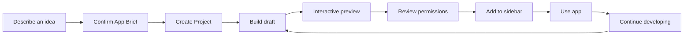
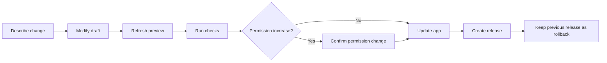

# Local Apps Product Requirements

Status: Proposed  
Audience: Product, design, agent, gateway, extensions, and Web UI maintainers  
Last updated: 2026-07-21

## Summary

Local Apps let a user describe a small application in conversation, preview it, and add it to the xopc sidebar without learning the extension toolchain. Every app is backed by a normal xopc Project and a coder-agent session, so the user can return later and continue developing it through conversation.

The first release is local-only. It supports sandboxed UI apps and, in a later phase, apps with a capability-limited local service. Marketplace publishing and unrestricted extension capabilities are out of scope.

## Problem

xopc already has the primitives required to run extension UI, but the user-facing path starts too late in the lifecycle. A user must understand projects, extension manifests, build output, installation, activation, permissions, and navigation contributions before an idea becomes an application.

The product needs one continuous path from intent to a working sidebar app. It must also avoid the common failure mode of AI-generated applications becoming disposable artifacts that are difficult to reopen, understand, or safely update.

## Product Decision

A Local App is a first-class xopc object that connects three existing concepts:

- **Project**: the durable source workspace, brief, files, and development conversations.
- **Release**: an immutable, validated build produced from the Project.
- **Extension runtime**: the installed release that contributes the app page to the xopc shell.

The Project is the authoring plane. The installed release is the runtime plane. The Local App preserves identity, permissions, data, versions, and the relationship between them.

## Goals

- Let a user reach an interactive preview from a plain-language idea.
- Let the user add a successful preview to the visible sidebar with one explicit action.
- Create and retain a Project automatically for every app.
- Make conversational iteration the default editing experience.
- Keep the last installed version working while a draft is being changed or repaired.
- Explain permissions in user language and require confirmation for permission increases.
- Preserve app data and identity across updates and renames.
- Provide deterministic validation, version history, and rollback.

## Non-goals

- Publishing to an extension marketplace.
- Sharing an app with another xopc installation.
- Collaborative editing.
- Generating mobile-native applications.
- Running arbitrary Node.js extension code as the default local-app backend.
- Replacing Projects, the extension system, or the existing coder agent.
- Hiding source code from users who want to inspect it.

## Primary User

The primary user is a solo builder or technical knowledge worker using xopc as a personal workstation. They can describe a workflow clearly but should not need to know xopc extension conventions. They expect the application to remain local, inspectable, editable, and recoverable.

Typical jobs include:

- “Create a water tracker with a weekly chart.”
- “Build a small dashboard for my local project notes.”
- “Make a form that calls one approved API and keeps the results locally.”
- “Add monthly view and CSV export to the tracker I created last week.”

## Experience Principles

1. **Lead with the app, not the toolchain.** Use product language such as “Preview” and “Add to sidebar,” not “pack” or “activate extension.”
2. **Conversation creates structure.** The agent turns an idea into an editable App Brief before implementation.
3. **The installed app is stable.** Draft work never replaces a working release until validation succeeds and the user confirms the update.
4. **Permissions are part of the design.** Show why each permission is needed and highlight only the change on later updates.
5. **The Project remains reachable.** Every app has a clear “Continue developing” action.
6. **Technical depth is progressive.** Default views show outcomes and recovery actions; source, diffs, tests, and logs remain available.

## End-to-end Journey

### 1. Start

The same creation flow is available from:

- a **Create app** action beside Apps in the sidebar;
- the global command palette;
- a natural-language request in any chat;
- the Projects page.

All entry points create or resume a dedicated local-app creation session. Duplicate clicks or repeated requests must not create duplicate Projects.

### 2. Confirm the App Brief

The coder agent asks only questions that materially change the first version. It then presents a short, editable brief containing:

- app name and one-sentence purpose;
- primary workflow;
- first-release scope;
- proposed screens or views;
- storage and data sources;
- expected network, file, session, and secret access;
- explicit exclusions.

For a simple app, the agent should assert safe defaults instead of conducting a long interview. Example:

> This app will keep its data locally and will not access the network. The first version has one entry form and a weekly summary.

The user can confirm the brief or revise it in natural language.

### 3. Create the Project

After confirmation, xopc automatically:

- creates a Project with `kind: local_app`;
- creates or selects a workspace root;
- assigns the coder agent;
- attaches the built-in local-app development skill;
- records the stable `appId` and App Brief;
- selects the UI-only or UI-with-service starter;
- associates the creation session with the Project.

The user sees the app name and creation progress; filesystem paths and template details remain in the advanced view.

### 4. Build and Preview

The creation workspace is a full-page work surface rather than a sequence of modals:

- conversation and decisions on the left;
- live app preview in the main area;
- optional checks, changed files, and technical output in a secondary inspector.

Progress uses product-facing stages:

- Preparing the app
- Building the interface
- Connecting local data
- Checking the app
- Preview ready

Raw logs are collapsed unless a failure requires them. A preview is always identified as a draft and runs separately from the installed release.

### 5. Review Permissions

Before installation, show a concise permission review grouped by user outcome:

- Saves app data on this device
- Reads xopc session titles
- Connects to `api.example.com`
- Reads files from the folder selected by the user
- Uses the secret reference `weather-api`

Do not expose gateway tokens or secret values. Do not combine unrelated permissions into a generic “full access” label.

For updates, show only additions, removals, and scope changes. Permission additions require confirmation; removals do not.

### 6. Add to Sidebar

The primary action is **Add to sidebar**. It performs build, validation, release creation, installation, activation, navigation placement, and health verification as one recoverable operation.

On success:

- the app is placed in the visible part of the sidebar;
- the app opens automatically;
- a small confirmation states that the Project remains available for editing;
- the installed release becomes the rollback point.

If the visible navigation area is full, xopc moves the last unpinned item into More. A newly added app must not silently appear only inside More.

### 7. Continue Developing

Users can resume development from:

- **Continue developing** in the app header;
- the app navigation-item menu;
- the associated Project;
- a natural-language reference to the app in chat.

The coder receives the current brief, source state, installed release, permissions, schema version, recent diagnostics, and previous change summaries.

The default iteration flow is:

## Information Architecture

### Apps

The existing Extensions surface should present Local Apps as a distinct product category without hiding that they use the extension runtime.

Each Local App row shows:

- name and icon;
- installed, draft changes, needs attention, or disabled state;
- current release version;
- associated Project;
- Open, Continue developing, Disable, and Roll back actions.

Developer-oriented extensions remain available in an Advanced section.

### Project

A local-app Project adds an App section containing:

- Open installed app;
- Open preview;
- current draft and installed release relationship;
- validation results;
- permissions;
- release history;
- rollback action.

The Project remains the canonical place for source, agent sessions, goals, decisions, and file inspection.

### App Page

The app page keeps extension content inside the existing xopc shell. Host-owned chrome provides:

- app identity and health;
- Continue developing;
- refresh or recover when the iframe fails;
- permission and version access through a secondary menu.

The extension iframe cannot imitate or replace host-owned permission prompts.

## State Model

| State | User meaning | Primary action |
|---|---|---|
| `idea` | Brief not confirmed | Continue conversation |
| `scaffolding` | Project is being prepared | Wait or cancel |
| `building` | A draft build is running | View progress |
| `preview_ready` | Draft can be tested | Open preview |
| `review_required` | Checks or permissions need attention | Review |
| `installed` | A healthy release is in use | Open app |
| `updating` | A new release is being prepared | Keep using installed version |
| `degraded` | Installed app has a runtime problem | Repair or roll back |
| `disabled` | App remains installed but hidden/inactive | Enable |

### Required UI States

- First-run empty state that teaches users they can describe an app.
- Skeletons for Project, app, release, and diagnostics loading.
- Build progress with bounded, resumable output.
- Preview boot, preview ready, preview crash, and preview stale states.
- Validation failure with **Let coder fix it** as the primary recovery.
- Permission review and permission-change review.
- Installation success, partial failure, and rollback success.
- Gateway restart or disconnect recovery without losing build state.
- Missing workspace and manually modified workspace states.
- App data migration pending, failed, and recovered states.

## Capability Levels

| Level | User-facing capability | Default trust model |
|---|---|---|
| UI App | Interface, theme, namespaced storage, notifications, approved xopc data | Sandboxed iframe |
| Local Service App | Approved network domains, selected files, background logic, secret references | Capability-limited isolated runtime |
| Advanced Extension | Tools, hooks, commands, channels, arbitrary Node capabilities | Explicit full local trust |

The first vertical slice ships UI Apps. Local Service Apps follow after the permission broker and isolated service runtime are ready. Advanced Extension creation is not part of the default flow.

## Built-in Development Skill

xopc ships a `build-xopc-local-app` skill and attaches it automatically to local-app Projects. Users do not need to discover or enable it.

The skill must:

- maintain the App Brief and stable app identity;
- select an approved starter;
- use public extension SDK surfaces only;
- apply the xopc design system and accessibility requirements;
- declare minimal permissions and stop before permission increases;
- preserve storage namespaces and provide data migrations;
- run deterministic validation before preview and release;
- keep the installed release untouched until the update succeeds;
- return actionable failures to the active coder session.

The skill should contain concise workflow instructions, focused references, starter assets, and deterministic scripts. Detailed platform contracts belong in references, not in the main skill prompt.

## Success Metrics

### Activation

- Median time from confirmed brief to interactive preview.
- Percentage of confirmed briefs that reach a preview.
- Percentage of first previews that install without manual source edits.
- Percentage of installations whose navigation item is immediately visible.

### Retention and iteration

- Percentage of installed apps edited again within 7 and 30 days.
- Median conversation turns from change request to validated preview.
- Percentage of updates that preserve stored data successfully.
- Rollback rate and successful recovery rate.

### Trust

- Permission-review cancellation rate by permission type.
- Frequency of permission increases during updates.
- Runtime crashes per active app.
- Number of updates that leave the installed release unavailable. The target is zero.

## Delivery Phases

### Phase 1: UI App vertical slice

- Conversational brief and confirmation.
- Automatic Project and skill attachment.
- Approved UI-only starter.
- Draft build and sandboxed preview.
- Deterministic checks.
- Permission review for UI SDK capabilities.
- Add to sidebar.
- Conversational update with last-known-good preservation.

### Phase 2: Durable iteration

- Immutable release history and rollback.
- Permission-delta review.
- Data schema migrations.
- Preview hot refresh.
- Diagnostics returned to coder.
- App and Project bidirectional navigation.

### Phase 3: Local Service Apps

- Capability-limited service runtime.
- Network-domain grants.
- User-selected file grants.
- Secret references.
- Resource limits and health supervision.

### Phase 4: Advanced mode

- Full Extension SDK scaffolding.
- Strong full-trust warning.
- Contract audit and compatibility checks.
- Tools, hooks, commands, and channels.

## Phase 1 Acceptance Criteria

- A user can start with a chat request and reach a preview without using the CLI.
- The system creates exactly one associated Project and uses the coder agent.
- The app preview is isolated from the installed release.
- Validation failures can be sent back to coder without losing the conversation.
- The permission review matches the manifest capabilities.
- Add to sidebar installs a healthy release or leaves the previous state unchanged.
- The new app is visible in the sidebar and opens successfully.
- Continue developing reopens the correct Project and supplies current app context.
- A failed update does not interrupt the installed version.
- App storage survives a successful update and app rename.
- The user can disable or remove the app without deleting its Project by default.

## Product Risks

| Risk | Mitigation |
|---|---|
| Generation feels slow | Show meaningful stages and make the first preview intentionally small |
| Agent overbuilds the idea | Confirm a bounded first-release brief |
| Generated code requests excessive access | Minimal permissions, capability templates, and explicit deltas |
| Users confuse draft and installed versions | Persistent draft/install labels and separate routes |
| An update breaks a useful app | Immutable releases, atomic activation, health checks, and rollback |
| Users cannot find the Project later | Continue developing entry points from app, navigation, and Apps page |
| Local apps crowd the navigation | Explicit pinning, reorder, and More overflow behavior |

## Follow-up Decisions

The following should be resolved during detailed design without blocking the Phase 1 product direction:

- Maximum retained releases per app and cleanup policy.
- Whether Project workspaces default under the xopc state root or a user-selected development root.
- Exact first-release UI SDK permission subset.
- The icon-generation policy and fallback icon behavior.
- Whether uninstalling an app retains its namespaced data indefinitely or offers an explicit delete-data action.

