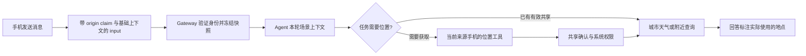

# 手机对话的设备与位置上下文：产品和技术方案

> 调研与设计稿，2026-10-11。尚未实现。用户已确认范围为 xopc 手机 App 内聊天；SMS 与第三方渠道仅作边界参考，不在本次实施范围。以下 TTL、超时和保留策略是建议值，需通过真机验证。

> 本文保留为手机定位场景的专项设计。总体架构、设备能力发现、跨设备目标路由与扩展方式以 [通用设备上下文与能力方案](./endpoint-context-and-capabilities.md) 为准；定位不再作为框架唯一能力。

## 1. 目标与核心决策

让 Agent 理解用户发出这条消息时的设备和场景。例如「今天会下雨吗」默认查询用户当前城市；「怎么打开定位」给出当前手机系统的操作步骤；「附近有咖啡店吗」在用户共享位置后查询周边。

采用两条互补路径：

- **基础环境随消息附带**：终端名称、平台、时区、语言、消息发送时间。无需每轮调用工具，也不因获取定位阻塞普通消息。
- **位置按需共享**：用户主动附带城市/位置，或 Agent 根据任务请求当前位置。获取前有明确的用途与共享范围；不每次发消息就定位。

位置属于短期场景证据。常住地、家和公司是另一个长期用户资料能力，不能从一次定位自动推断、写入记忆或覆盖。

第一期覆盖鸿蒙、Android、iOS 的文字聊天和语音转文字发送；实时语音通话需另行接入相同来源及上下文契约。第一期不做后台轨迹、持续定位、自动获取联系人/剪贴板/屏幕，也不为此增加常驻服务。

## 2. 仓库现状与差距

| 已核对的实现 | 对方案的影响 |
| --- | --- |
| `packages/endpoint-tools-protocol/src/index.ts` 有签名 hello、终端 principal、platform/displayName、availability，以及 endpoint turn claim | 复用终端认证和来源机制，不能接受客户端任意声明的设备身份 |
| 鸿蒙 `service/realtimeClient.ets` 和 Android `gateway/RealtimeClient.kt` 注册 mobile endpoint，提交消息使用 turn claim | 两端已有来源基础，但 hello 的 `tools` 当前均为空；仍需实现原生工具 Host 和执行适配器 |
| iOS `Core/Networking/GatewayClient+Messaging.swift` 的 start/append 当前提交 `system/cli` 来源 | 需先补齐 iOS endpoint 注册、签名、realtime claim 和来源提交，才能支持当前手机工具调用 |
| `src/endpoint-tools/policy.ts` 已允许 `mobile.device.get_info` | 是服务端允许的能力名，不代表三端已有实现；当前未找到三端注册该工具的代码 |
| 同文件没有位置工具策略 | 新增位置能力要同时新增共享输出契约、可信策略和三端实现 |
| `src/agent/external-tools/endpoint-provider.ts` 以显式会话绑定优先，其次本轮 origin 选择设备 | 「操作已绑定设备」与「用户发消息的手机位置」可能来自不同设备，需要明确区分 |
| `packages/gateway-contract/src/session-input-command.ts` 有 `input`、`origin`、start/append；手机走新命令形状 | 优先扩展统一命令契约，不能只改旧的 `session-input-handler.ts` |
| input coordinator 将来源快照冻结到 SQLite 排队输入；source injector 会把来源正文加入用户消息 | 可复用冻结与幂等思路；精确坐标不能直接照搬来源正文长期存储 |

结论：已有可复用的身份、传输、权限和消息基础，但位置采集、三端工具执行以及动态上下文生命周期都需要新增。

## 3. 产品行为

### 3.1 信息范围

| 信息 | 获取方式与默认行为 | Agent 用途 |
| --- | --- | --- |
| 终端类型、平台、App 版本 | 从已认证终端注册信息取得；版本仅用于兼容判断，通常不进入模型 | 区分手机/电脑和操作系统 |
| 设备显示名称 | 默认「我的 iPhone」「我的鸿蒙手机」等，可由用户在 xopc 内改名 | 多设备辨识；名称不是身份凭据 |
| 时区、语言、发送时间 | 客户端每条消息采集；服务端校验格式并记录接收时间 | 理解「今天」「今晚」、语言及时间显示；时区不能推断当前城市 |
| 城市/区县 | 用户手动选择，或经定位取得并降级到所需粒度 | 天气、本地生活 |
| 经纬度、精度、采样时间、坐标系 | 仅用户明确共享或接受位置请求时获取 | 附近搜索、距离；天气通常不需要精确坐标 |
| 电量、网络状态、设备型号 | 后续诊断场景按需读取 | 与任务有关时才使用；第一期不自动附带 |

不获取 IMEI、手机号、硬件序列号或广告 ID 作为对话上下文。系统可用的型号/设备名称跨平台不一致，产品不承诺自动读取完整用户设备名。

### 3.2 天气主流程

1. 用户输入「今天会下雨吗」。普通消息正常发送，附带手机环境摘要。
2. 如果用户明确说了城市，例如「北京今天下雨吗」，直接查北京，不请求定位。
3. 如果本条消息已附带有效城市，用该城市；否则 Agent 请求「使用这台手机的位置查天气」。
4. 聊天内显示卡片：「使用当前位置查天气」，说明「仅共享城市信息」，操作为「共享一次」「选择城市」。未授权系统定位时，在用户点击共享后触发系统权限弹窗。
5. App 取得位置并解析城市；仅将城市及采样状态提供给天气查询。用户拒绝、定位超时或设备离线时，询问城市，不反复弹窗。
6. 回答注明「按你本次共享的位置：杭州」；天气结果仍需要实际天气数据源，不把手机定位当作天气数据。

位置可用并不意味着每轮都需要新定位。会话内可以短期复用已共享城市，始终显示采样时间；过期或用户表示已移动时重新请求。

### 3.3 附近搜索与设备问题

- 「附近有咖啡店吗」：说明附近搜索需要位置；允许大致位置，结果注明范围有限。任务需要更高精度时说明原因，用户选择后才升级权限。
- 「我这台手机怎么打开定位」：使用本条消息的平台；没有必要获取地理位置。系统版本未知时给出通用路径，或请求设备信息。
- 「查一下公司那边天气」：解析用户指定地点；缺少公司地址时询问，不能用当前定位替代公司。
- 「明天早上提醒我」：设备时区用于解释，但用户指定时区或已有明确任务时区优先。提醒创建时显示确定的日期与时区；不能把当前位置自动改成长期提醒时区。

### 3.4 可见性与设置

- 在输入区附件菜单增加「位置」，提供「选择城市」「共享当前位置」。发送前显示「杭州 · 本次共享」，可移除。
- 在使用位置的消息或工具结果下显示轻量标签：「使用杭州的位置 · 刚刚」；点击查看采样时间、精度类别、来源设备和共享范围。不要在普通气泡中暴露完整坐标或协议字段。
- 设置增加「聊天中的设备信息与位置」：说明基础字段；默认位置为「每次询问」，可管理本设备名称、清除共享位置和查看系统权限入口。
- 第一版只提供单次共享；无需为普通聊天新增持续授权。后续可评估「本次会话允许城市级读取」，但必须具备有效期、撤销、服务端校验和端侧二次检查，不能只依赖一个布尔开关。
- 开启系统定位权限不等于允许向模型或天气/地图服务传递位置。共享说明必须覆盖数据接收方；展示用户所配置的模型服务与实际查询服务类别。

## 4. 语义与生命周期

### 4.1 三种位置的优先级

对于查询地点：**用户本条消息明确指定的地点 > 本条消息明确共享的位置 > 当前来源手机本次获取的位置 > 经用户确认复用的近期位置 > 向用户询问**。

历史常住地只作为建议：「要查你保存的杭州，还是现在所在城市？」不能默认宣称它是当前位置。IP、手机号归属地和 Gateway 服务器位置均不能自动替代手机位置。

### 4.2 当前来源设备与执行设备

新增运行时语义 `originEndpoint` 与现有 `boundExecutionEndpoint`：前者由本轮已验证 origin 决定，后者由会话绑定决定。

第一期「当前位置」固定来自 `originEndpoint`，不受会话绑定覆盖。会话绑定到桌面端时，仍可以用发消息手机查询天气；写文件等既有操作继续遵循绑定。若用户明确要求另一台手机的位置，应走明确选设备并确认的独立流程，第一期不支持自动跨设备定位。

位置调用目标由宿主确定。模型不能通过输入 `endpointId`、principal 或授权标识切换设备；工具参数仅表达用途、所需粒度和允许的缓存年龄。

### 4.3 时效建议

| 场景 | 可复用的采样年龄 | 处理 |
| --- | --- | --- |
| 城市天气 | 初始建议 15 分钟 | 超龄、来源变化或用户表示移动时重新共享 |
| 附近搜索 | 初始建议 2 分钟 | 同时检查精度；不够精确时提示或申请升级 |
| 普通平台、语言和时区 | 每条消息快照 | 不跨消息覆盖旧证据；新消息采用新快照 |

同时保存 `capturedAt`、`receivedAt`，服务器在使用时计算年龄并容忍小幅时钟偏差。明显未来时间或时钟异常不能当新鲜样本。排队执行时重新检查有效性，但不偷偷更改已提交的消息位置；需要当前位置时发起新的读取。

冻结本条消息的快照：网络重试保持同一 `clientMessageId` 和同一上下文内容；重连允许刷新传输 token，不能重新定位后改变同一次逻辑提交的 payload。要更新位置，应作为新的输入/明确的新采样操作。

## 5. 技术架构



### 5.1 基础契约

在 `gateway-contract` 增加可选 `input.endpointContext`，由版本化严格 schema 定义客户端可提供的字段，例如：

```json
{
  "version": 1,
  "capturedAt": 1791684000000,
  "timezone": "Asia/Shanghai",
  "locale": "zh-CN"
}
```

endpointId、principal、platform、displayName 从已验证 origin 和注册记录补齐，客户端字段不能覆盖。显式选择城市/共享位置另建受限 `sharedPlace` 契约，标注 `source: manual | device`、粒度、采样时间和授权依据；不把坐标塞进自由文本字段。

模型收到有界摘要，如「本条消息来自我的鸿蒙手机；Asia/Shanghai；位置未共享」。名称等可编辑字段采用 JSON 转义并标为数据，不得成为系统指令。基础上下文不占用用户的 `@` 引用数量配额，也不与任意来源正文混合授权。

新增功能协商标记，例如 `endpointContextV1`、`originLocationV1`，在现有 compatibility 响应中声明支持；这是待新增能力。旧客户端缺字段时按无位置继续；新客户端遇到不支持的 Gateway 隐藏位置功能，不能悄悄把精确坐标拼入聊天正文。

### 5.2 位置工具

建议能力名 `mobile.location.get_current`，提供结构化 JSON 输出。第一期可信策略采用现有 `personal.foreground-read`：`effect=read`、`sensitivity=personal`、`requiresForeground=true`、`confirmation=always`，新增明确的逻辑位置权限和服务端固定输出 schema。

原生 Host 提供用途卡片，收到允许后按最小范围申请系统权限；同一次 invocation 不叠加重复的 xopc 确认。操作系统权限仍按平台要求申请。用户主动选择位置时使用同一采集服务，以该次主动操作作为共享依据。

输入建议：`purpose: weather | nearby`、`granularity: city | approximate | precise`、`maxAgeMs`。用途是产品展示和范围约束，不是让模型自行获得授权的凭据。

内部结果包含：`capturedAt`、实际粒度、`accuracyMeters`、`coordinateSystem`、可选城市、可选坐标、`source`、`isCached`。`permissionDenied`、系统定位关闭、无法定位、逆地理编码失败必须明确区分。服务端验证经纬度范围、时间与输出大小，不把「来自已认证设备」等同于证明物理位置真实。

初始采集超时建议 5 秒；系统权限与用户选择等待另计并纳入有界 invocation deadline。支持取消、前后台切换和断线失败；不把 App 放后台后继续等待定位当作后台任务能力。

天气粒度在端侧降级成城市后再上报；逆地理编码不可用时允许选城市，或另经用户明确选择共享大致坐标。附近查询只返回必要字段。协议带坐标系；地图服务要求其他坐标系时在对应服务适配层转换，避免 WGS-84 与其他坐标系混用。

### 5.3 当前来源定位的路由

现有 EndpointToolProvider 默认先选会话绑定，因此不能直接依赖它获得「发消息手机的位置」。为位置能力增加宿主控制的 `turn_origin` 目标规则：

1. 只有本轮 origin 为已认证 mobile endpoint 且它声明受信位置工具时，才暴露当前来源位置能力。
2. 搜索、describe、execute 都解析同一个来源目标，并在执行时复核 principal、连接实例、工具 revision 和授权状态。
3. 断线/来源变化则失败；不能换到另一台在线设备继续执行。
4. 同时保留现有 bound 目标规则给其他工具；不同目标作用域显式区分，不能让模型靠工具名猜设备。

这会涉及 `endpoint-provider.ts` 的目标解析与描述生成，需要覆盖绑定桌面、来源手机的组合测试。

### 5.4 持久化与模型上下文

- **基础快照与城市摘要**：经校验后随 input 冻结，持久化到现有 SQLite 输入/转录关联，保留采样时间和来源。摘要明确是该轮历史证据。
- **精确坐标**：不直接进入普通 `AgentSourceContext.text`、日志、FTS、长期记忆或默认导出。使用短期位置引用保存，按 principal + input/run + origin 限定访问，初始 TTL 建议不超过 15 分钟，可提前删除。进入模型/外部查询的实际字段由用途决定。
- **附近查询**：精确坐标可能必须发送至用户配置的模型或查询服务，共享前说明；持久化到 transcript 的工具输出只保留城市/粒度/年龄等摘要。模型需要的坐标通过本轮临时结果提供。
- **历史与恢复**：旧位置始终标为历史采样；后台理解、记忆提取、compaction 不将其提炼成「用户目前在某地」。run 恢复或引用过期时重新共享，不能从历史坐标恢复授权。

当前工具结果与输入会进入持久化链路，以上精确坐标隔离尚未实现。开发前必须核对 pi tool result → guardSessionManager → SQLite append 的写入顺序，增加统一的敏感字段投影，确保流式事件、缓存、失败恢复和导出也不会携带原始坐标。若第一期暂不完成这一链路，范围限定为城市级天气；附近精确定位推迟到下一阶段。

删除共享记录后，已经发送到外部服务的数据无法通过本地清理撤回；界面应说明本地清理范围。撤销后再次执行必须重新检查共享依据。

## 6. 三端适配依据

| 平台 | 适配方向 | 调研确认 |
| --- | --- | --- |
| 鸿蒙 | `@kit.LocationKit` 的 `geoLocationManager` 单次定位；请求大致位置，任务确需时再请求精确权限 | OpenHarmony 主仓文档支持大致/精确位置与 WGS-84；正式开发以项目 SDK 和 Huawei 真机能力核对 |
| Android | 原生 `LocationManager` 可作为无需 GMS 的基线；如采用其他定位 SDK 再评估覆盖 | Android 12+ 用户可以只授予大致位置，App 必须能继续工作；只申请前台定位 |
| iOS | Core Location 单次采样，When In Use 授权，处理 reduced accuracy | 不默认申请 Always；iOS 16+ 用户自定义设备名读取受 entitlement 限制，xopc 内昵称作为可靠产品方案 |

原生采样与城市解析由三端适配层实现，共用字段、错误语义和验收场景，不要求三端强行使用同一家定位 SDK。

## 7. SMS 与其他渠道

若用户实际指运营商 SMS，需要单独设计：普通短信 webhook 不提供发信手机的实时 GPS 和完整设备信息。Twilio 的手机号地理字段来自号码信息，不能当当前位置；WhatsApp location message 的经纬度属于用户主动分享的渠道位置，也不能类推到 SMS。

- 纯 SMS：用户直接回复城市，或打开一次性位置共享链接；网页需要用户交互和定位授权。链接具有效期与单次提交约束，绑定原始输入与已认证身份；持有短信链接不能直接获得全部 App 设备权限。
- 第三方消息渠道：解析用户主动发送的位置消息，记录采样来源；不默认调用另一个在线手机。
- 后续若联动 xopc App：需用户明确绑定并选定手机、授权这次位置读取；不根据手机号匹配一台设备后静默定位。

第一期先覆盖原生 App；SMS 作为独立接入阶段，不阻塞 App 的设备上下文。

## 8. 实施步骤与验收

**阶段 A：基础环境与身份。** 补齐 iOS endpoint 来源；三端统一时区/语言快照与 xopc 设备昵称。扩展 start/append 命令契约，队列、重试、替换输入和临时会话保持一致语义。替换旧消息不能默认采集当前定位，应由用户显式重新共享。

**阶段 B：城市级天气闭环。** 三端实现位置服务与 Host；新增可信位置工具及当前来源目标规则，交付主动选城市/共享一次/拒绝回退。只保存必要城市摘要，并通过真实查询验证天气使用实际城市。

**阶段 C：附近查询。** 完成精确坐标短期存储、模型输入与持久化投影隔离，再接地图查询、精度升级和坐标转换。阶段 B 可以独立发布。

**阶段 D：实时语音。** 实时语音携带真实 endpoint 来源并支持共享卡片。SMS/第三方渠道、持续定位和后台任务另立需求，不在本次实施范围。

验收至少包含：

1. 鸿蒙、Android、iOS 的 start/append 都能证明真实 endpoint 来源；伪造身份、未知字段和无效 token 被拒绝。
2. 「北京天气」不请求定位；「今天下雨吗」在用户共享杭州后调用杭州天气；拒绝后选择城市仍可完成。
3. 只授权大致位置、定位关闭、采样超时、城市解析失败都有可用回退；普通消息发送不被定位阻塞。
4. 手机发送、会话绑定桌面：当前位置读取来自手机；桌面绑定的文件操作继续路由桌面。
5. 同会话两台手机交替发消息、跨 Gateway 切换、断线重连不串位置与授权；旧手机离线不能使用其他手机在线结果代替。
6. 消息重试幂等，排队后过期重新请求；历史回放不把过去采样当现在；时钟偏差不会无限延长有效性。
7. 用户撤销或删除后，临时引用和再次调用失效；后台记忆不自动记录常住地。
8. 阶段 C 验证日志、FTS、transcript、默认导出、流式缓存和恢复数据都不含原始精确坐标。
9. 新增/移动 API 时同步 `lazy-bundles.ts` 与映射测试，并用运行中的 Gateway 走完整认证路径；仅测直接路由模块不算完成。

## 9. 外部依据

- [Android：位置权限与大致位置](https://developer.android.com/develop/sensors-and-location/location/permissions)
- [Apple：请求位置授权](https://developer.apple.com/documentation/corelocation/requesting-authorization-to-use-location-services)
- [Apple：精度授权](https://developer.apple.com/documentation/corelocation/cllocationmanager/accuracyauthorization)
- [Apple：设备名称及 entitlement 限制](https://developer.apple.com/documentation/uikit/uidevice/name)
- [OpenHarmony：geoLocationManager 官方参考](https://github.com/openharmony/docs/blob/master/zh-cn/application-dev/reference/apis-location-kit/js-apis-geoLocationManager.md)
- [Twilio：入站消息 webhook 字段及渠道差异](https://www.twilio.com/docs/messaging/guides/webhook-request)

方案选择、时效值、产品文案与数据保留策略为本次设计建议，平台能力以所列官方文档为依据；尚未进行原生权限配置、真机采样和天气/地图供应商集成验证。
