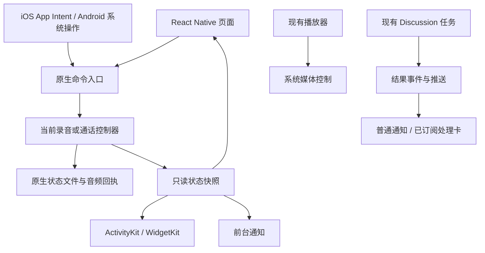

# 移动锁屏体验：技术方案与分阶段验收

日期：2026-09-15。状态：设计，本文未实现运行时代码。对应 [产品方案与竞品研究](./mobile-lock-screen-prd.md)。遵循 KISS / SOLID：复用业务状态与媒体引擎，增加薄的原生展示和命令入口，不创建通用卡片平台。

## 1. 当前基线与差距

| 位置 | 当前实现 | 本次设计的变化 |
|---|---|---|
| `modules/xopc-voice/ios/RecordingCapture.swift` | 原生采集、专用生命周期队列、分块保存 | 暴露原生快照，暂停 / 保存动作与活动状态同源 |
| Android `RecordingCapture.kt` / `VoiceCallService.kt` | 原生录音，常驻通知，停止回调 | 用带 ID 的命令替换无参回调作为系统控制入口；补状态、时间和暂停 |
| `features/recordings/recordings.ts` | MMKV 列表、JS 命令互斥、前台对账 | JS 成为状态消费者；系统操作不等待 JS 存活 |
| `widgets/ReadAloudLiveActivity.tsx` | 自定义朗读活动卡，与系统媒体控制并存 | 默认只保留系统媒体控制；去除默认重复展示 |
| `features/voice/read-aloud-store.ts` | JS 管理分块播放及系统媒体控件 | 在使用现有播放器前提下验证后台续段，补全回放时间轴 |
| `features/notifications/mobile-notifications.ts` | Expo push 注册至 `/api/devices/me/push` | 复用结果通知基础设施；ActivityKit token 另行管理 |
| `src/discussions/` | 持久录音 job、转写、总结及状态 | 复用业务状态，增加必要的结果通知与订阅映射 |

已核对安装的 `expo-widgets/ios/Widgets/AppIntent.swift`：`LiveActivityUserInteraction.perform()` 发送 WidgetsEvents 事件，没有直接调用录音引擎。因此只增加 `addUserInteractionListener` 不足以保证 JS 挂起 / 重建时的录音控制。

## 2. 架构边界



- 本地声音以原生控制器和文件 journal 为权威；远端处理以 Discussion 数据库为权威。
- 卡片投影只读取状态。显示计时、删除卡片均不得改变声音是否在录。
- 单一录音控制器属于应用原生进程，不属于页面或 Expo Module 实例；模块和 App Intent 获取同一个对象。扩展进程不创建第二个录音器、不直接读取音频文件。
- 复用现有麦克风占用规则，原生补最终互斥；JS `Symbol` 只能协调运行中的 JS，不能承担系统入口权限。
- 保留现有真实浏览器 / 手机音频格式，不引入任何旧接口适配。只有新控制路径验证后，才删除被替代的无参 stop 回调和重复卡片逻辑。

## 3. 原生状态与命令契约

建议内部类型如下；这是设计草案，不是新增 HTTP API：

```ts
type RecordingPhase = 'preparing' | 'recording' | 'pausing' | 'paused'
  | 'saving' | 'saved' | 'interrupted' | 'failed';

type RecordingSnapshot = {
  captureId: string;
  generation: string;          // New token per native ownership lifecycle.
  revision: number;            // Persisted monotonic state revision.
  phase: RecordingPhase;
  capturedSamples: number;
  persistedSamples: number;
  sampleRate: 16000;
  sampledAtMs: number;
  lastFrameAtMs?: number;
  lastDurableAtMs?: number;
  source: 'microphone';
  reason?: 'interruption' | 'route_lost' | 'storage_failed' | 'duration_limit';
};

type RecordingCommand = {
  commandId: string;
  captureId: string;
  generation: string;
  expectedRevision: number;
  action: 'pause' | 'finish';
};
```

### 命令处理

1. 系统入口只接受已知 action 和内部标识，不接受路径、任意 URL 或网关 token。
2. 在原生 lifecycle 队列串行校验 captureId、generation、revision；不匹配返回 stale，不触及当前录音。
3. 小型原子状态文件保存当前状态、最近命令结果及 UI 返回目的地；音频仍由 WAV 和不可变回执负责。有限命令去重记录有界，不建立事件溯源框架。
4. 暂停先停止采集并排空 writer，提交状态，再更新卡片；停止先发布 saving，封存后才发布 saved。
5. 重复 commandId 返回此前结果；崩溃在文件已封存、状态未更新之间时，按原生回执恢复，不二次追加或自动开麦。
6. 页面重新连接后读取完整快照，不假设自己发起了所有操作。跨进程 / 系统动作不依赖 MMKV 订阅事件送达。

开始和继续会重新获取麦克风。首版使用前台路径；锁屏暂停 / 结束可原生执行。“返回继续”是明确的深链动作，不伪装为后台直接继续。后续只有在目标系统的 AudioRecordingIntent、权限、后台启动及真机验证均通过时才开放直接继续。任何非预期中断仍按现有恢复并结束策略处理。

## 4. 时间、落盘和失效

`capturedSamples / 16000` 表示实际捕获时长；`persistedSamples / 16000` 表示已提交回执的可确认时长。二者不能合并为一个“已保存”计数。

- 卡片主时间使用系统动态日期 / Chronometer，依据样本锚点估算显示；暂停后固定为样本时长，不每秒经过 JS 刷新。
- 每个 20 秒块成功提交时更新保存时长；状态变化立即更新。健康快照建议每 15 秒至多一次，动态计时不依赖相同刷新频率。
- iOS 设置 staleDate，建议最新健康确认后 45 秒；Widget 读到 stale 后显示“状态待确认”，固定最后确认时间，不继续宣称录音正常。
- Android 控制器运行时对无帧 / writer 失败及时停表；进程死亡后依赖服务生命周期撤下活动通知，重启对账。不能假设系统保证通知与进程同时消失。
- 单调时钟用于间隔计算；墙钟只用于渲染锚点。手动改时间、时区变化不能增加录音样本。
- 这些间隔为设计初值，须用两小时锁屏、Always-On、低电量实验调整；系统可能降低更新频率，不把过期卡片视为后台保活故障的唯一证据。

## 5. iOS 实现

### 5.1 录音卡原生实现

采用 ActivityKit + WidgetKit SwiftUI 原生录音活动与 App Intents；在现有 Expo 工程通过项目 config plugin 管理 target / 源文件 / capabilities，不手工修改生成的 Xcode 工程。

- App 和扩展共享最小 Attributes / ContentState 定义；原生命令实现位于 App 可执行上下文。App Intent 调同一录音控制器，不能在 Widget 扩展启动音频引擎。
- Activity 内容只放投影：不放音频、转写、凭证。静态和动态载荷总计控制在 4 KB 内 [T1]。
- 避免直接修改 expo-widgets 依赖源码。现有 QuickEntryWidget 保留；专用录音 Widget target 需独立命名和配置，检查签名、部署下限、扩展数量及 target membership。
- 小型状态快照可经 App Group 共享；音频保留应用私有目录。App Group 中的深链仅含不透明 ID；设备凭证留在已有安全存储。
- iOS 16.1+ 的 Live Activity 展示与 iOS 17+ 的交互按钮分开 availability 检查；应用实际最低版本还须服从 Expo / RN 工程要求。旧展示能力只提供返回入口，不保留另一套录音业务逻辑。
- 优先评估 `AudioRecordingIntent` 对录音动作的适用性；其系统要求包括录音期间保持 Live Activity [T2]。准确可用版本以编译 SDK 声明及真机矩阵为准，不能仅凭 `LiveActivityIntent` 名称承诺允许任意后台开麦。
- Live Activity 被关闭、未授权或显示受限时，不反复请求；App 内明确当前录音状态。不是通过无声播放来维持活动卡。

### 5.2 生命周期

录音结束请求 end；ActivityKit 活动有最长生命周期与结束后展示上限，不把它当作无限期后台任务面板 [T1]。本产品的两小时录音上限短于系统八小时活动上限。暂停撤卡、用户移除、启动清理过期活动均与声音停止操作分开。

未来 APNs 更新仅用于已由用户关注的远端处理，不用于远程开始录音。Activity push token 不等于现有 Expo push token；不能把现有 Expo token 放进 ActivityKit 推送接口。

## 6. Android 实现

- 首版使用标准 NotificationCompat 前台通知，包含录音状态、Chronometer、暂停 / 结束操作和返回目的地。通知 ID 对当前音频会话稳定；录音、通话、结果使用独立 channel，避免一个 channel 的名称 / 静音偏好混用。
- 系统 action 使用显式、不可变 PendingIntent，组件非导出；携带 captureId / generation / revision，转发原生命令队列。禁止无参广播“停止当前任何声音”。
- 麦克风服务遵循 while-in-use 权限、后台启动限制；从用户前台操作启动。暂停后继续默认回前台，不假定一个通知按钮能绕过限制 [T6]。
- 新系统增强 Live Updates 只在运行时权限 / 能力检查及场景资格通过时启用。录音需验证是否被系统 / OEM 接受，不承诺全品牌灵动岛；不支持时使用标准通知。官方要求标准样式且禁止 customContentView，不能用自绘 RemoteViews 伪造资格 [T4]。
- 系统媒体播放继续复用当前播放器和媒体会话。只有现有实现无法满足后台续播时才增补原生播放生命周期；不同时创建第二个 MediaSessionService [T5]。
- 用户关闭通知权限并不等同于终止正在工作的前台服务；页面显示真实能力状态和前台录音说明。测试各 OEM 的锁屏隐藏、任务移除、服务结束和强制停止。

## 7. 上传与服务器结果

### 7.1 先有后台传输，再有后台上传承诺

现有文件上传为 foreground。第一阶段仅前台展示进度；锁屏 / 挂起后不继续递增或宣称可在后台完成。

后续实现 iOS background URLSession 文件任务；Android 根据时长与系统版本评估用户发起的数据传输 Job / WorkManager 路径，再映射进度。任务和分块回执持久化，保持现有 SHA-256 对账及幂等 seal。

沿用网关身份与禁止重定向策略：后台任务固定已验证 origin，凭证失效进入需认证，不在系统重试中隐式切换工作区。系统后台传输没有实时完成保证；iOS 用户强退会取消后台传输，需打开后恢复 [T7]。

### 7.2 结果通知优先复用

复用设备 push 注册与现有通知投递服务。先补 `discussion.completed` / `discussion.needs_attention` 到目标设备的映射；若既有 outbox 已有持久去重，直接复用。否则增加最小结果事件表，与业务结果提交同事务，唯一键建议 `(discussionId, attemptId, eventKind, deviceId)`。

投递前重新验证设备仍已配对且有权限；不要向网关所有设备广播。载荷只含事件 ID、工作区 ID、资料 ID和通用通知文本。点击后经过解锁、工作区匹配、重新读取权限；删除或撤权显示不可用，不回落到其他资料。

批量完成合并、重试退避、有界保留，失效 push token 解绑。应用在当前详情页可抑制额外提醒，但跨进程到达的通知不以 JS 状态为唯一去重依据。

### 7.3 可选远端处理卡

只有用户选择锁屏跟踪且推送链路就绪时开启。ActivityKit token 绑定 device、gateway、discussion 和 activity，按 token 轮换更新。订阅到期或撤销后终止投递；APNs 专用凭证不下发客户端。自托管网关未配置 APNs 时只提供普通结果通知和前台状态。

每次远端状态增加单调 revision，旧更新不能覆盖新状态；推送过期时间有界。显示 queued / transcribing / summarizing / completed / needs_attention，不从耗时推导百分比。优先复用现有业务事件；必要的新认证订阅路由必须同时修改 lazy-bundle matcher，并通过真实鉴权 HTTP 路径验证。

## 8. 设置、兼容与清理

新增少量设置：锁屏活动开关、是否显示内容标题、会议结果通知。尊重系统设置；Android 必需前台通知的显示由平台控制，应用开关只控制可选增强展示。

按依赖顺序清理：

1. 原生命令通过验收后，删除录音系统入口的旧全局无参回调；普通 JS 调用也走相同控制器。
2. 朗读默认关闭重复 Live Activity；若无明确产品用途则删除对应运行时启动链，不留下双路径默认行为。
3. 通话专用卡通过后移除通话伪媒体展示；保留真正播放的 Now Playing / MediaSession。
4. 原生生命周期状态成为权威后，MMKV 只保留可恢复列表索引和业务绑定；移除会覆盖原生状态的 JS 推断写入。

能力检查是平台边界，不作为保留旧业务实现的理由。不引入新卡片 DSL、通用事件总线或第二套录音 / 任务数据库。

## 9. 分阶段交付和自查门槛

| 阶段 | 交付 | 自查及通过门槛 |
|---|---|---|
| L0：原生控制与快照 | 单一 owner、持久状态、幂等 pause / finish、generation fence、首帧与落盘水位 | 无 JS 可执行；重复 / 乱序 / 旧卡指令；停止中崩溃恢复；录音与通话互斥 |
| L1：录音锁屏 | iOS 原生活动卡与按钮、Android 标准通知、失效态、隐私深链 | 两小时真机、暂停后台挂起后结束、来电、蓝牙、低空间、系统权限拒绝、超大字号 |
| L2：媒体与通话 | 朗读去重、系统控制一致、通话静音结束及专用卡 | 锁屏跨朗读分块、耳机暂停、音频路由、旧卡不影响新会话；通过后清理旧路径 |
| L3：会后结果 | 结果事件、去重投递、工作区路由、通知设置 | 重复推送、进程未运行、网关离线、退出配对、资料删除、批量完成 |
| L4：后台进度增强 | 原生后台上传、可选 APNs 处理卡、Android 能力增强、快捷入口 | token 轮换、强退恢复、身份变化、系统降级、用户移除不重建 |

每阶段先 review / 修复再推进，不以模块编译替代设备行为验收。L0/L1 为最先落地的录音体验，L3 可在其后优先于复杂远端进度卡。

建议观测只记录 ID、状态和耗时：命令接受 / 拒绝原因、native_ack_ms、durable_save_ms、投影 revision、过期次数、更新次数、结果去重数；不记录录音正文、标题或 push token。

## 10. 官方平台依据

- T1 [Apple：Displaying live data with Live Activities](https://developer.apple.com/documentation/activitykit/displaying-live-data-with-live-activities) — 生命周期、4 KB、后台更新边界。
- T2 [Apple：AudioRecordingIntent](https://developer.apple.com/documentation/appintents/audiorecordingintent)；[LiveActivityIntent](https://developer.apple.com/documentation/appintents/liveactivityintent) — 系统动作与应用进程；需核对目标 SDK 可用版本。
- T3 [Apple：交互式 Widget / Live Activity](https://developer.apple.com/documentation/widgetkit/adding-interactivity-to-widgets-and-live-activities)；[Expo SDK 56 Widgets](https://docs.expo.dev/versions/v56.0.0/sdk/widgets/) — 支持面与交互入口。
- T4 [Android：Live Update notifications](https://developer.android.com/develop/ui/views/notifications/live-update) — 用户主动、持续且时间敏感的场景，标准样式、资格与 OEM 差异。
- T5 [Android：MediaSessionService](https://developer.android.com/reference/androidx/media3/session/MediaSessionService) — 媒体会话与服务生命周期。
- T6 [Android：前台服务类型](https://developer.android.com/develop/background-work/services/fgs/service-types)；[后台启动限制](https://developer.android.com/develop/background-work/services/fgs/restrictions-bg-start)。
- T7 [Apple：后台文件传输](https://developer.apple.com/documentation/foundation/downloading-files-in-the-background)；[background URLSession 配置及强退边界](https://developer.apple.com/documentation/foundation/urlsessionconfiguration/background(withidentifier:))。

以上约束来自官方文档；刷新间隔、状态模型、去重键和阶段划分是 xopc 的设计决策，不是竞品已采用相同实现的声明。
