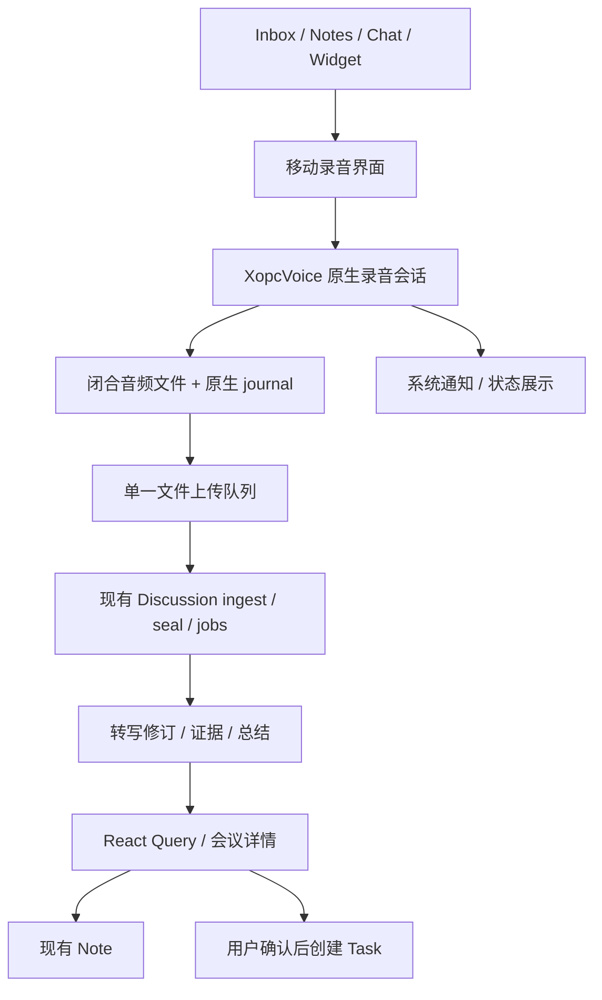

# 移动录音笔记技术设计与阶段验收

日期：2026-09-15 · 基线：`37368b509` · 状态：分阶段实施。

实施进展：[移动实施与自查](./mobile-meeting-implementation-review.md)。已接入原生桥接、移动录音页、手动分块同步与会议总结。具体契约见 [本批技术方案](./mobile-meeting-ui-upload-design.md)；完整多轨、实时及后台能力仍为目标设计，真机验收尚未完成。

关联：[PRD](./mobile-meeting-prd.md) · [研究与平台依据](./mobile-meeting-research.md) · [共用 P1/P2 契约](./voice-meeting-p1-p2-technical-design.md) · [现有实施状态](./voice-meeting-p1-p2-implementation-review.md)

## 1. 架构决策

保持 Expo 56、React Native 0.85 和既有 `XopcVoice` 模块。移动端负责可靠采集和本地材料，Gateway 的 Discussion 负责转写、证据及纪要，Note 负责阅读入口，Task 负责执行。以下新增类型、目录及 API 均为建议落点。



### 决策与排除项

| 决策 | 原因 |
|---|---|
| 扩展原生模块，新增持久录音职责 | 已有通话模块能访问 PCM；不为会议引入第二套音频 SDK |
| 音频回调 → 有界原生队列 → 文件 | JS 休眠和页面卸载不影响保存；回调线程不执行数据库 / 哈希 / 网络 |
| 原生文件 journal：不可变片段回执 + 小型状态记录 | 单写入者、顺序音频不需要另开 SQLite；音频与 JSON 通过持久化顺序恢复，不把大文件塞入 Zustand / MMKV |
| 单轨 microphone，使用共用 track/epoch 协议 | 中断恢复同样需要 epoch；首版不增加移动系统音轨 |
| 首版仅前台可靠补传 | 降低后台调度复杂度；后续系统上传仍使用同一队列 |
| 先 PCM16 单声道 16kHz 独立 WAV 片段 | 可解释损坏边界，无 AAC 拼接 / 编码预热问题；压缩由测量决定 |
| 不新增 Meeting 聚合、任务系统或通用事件框架 | 现有 Discussion / Note / Task 足够表达需求 |

expo-audio 能配置后台录音，但不会自动满足这套 journal、分块、修订和恢复契约。继续供短语音与播放使用；长会议不采用 JS `useAudioStream` 转发后再写盘。[Expo 56 Audio](https://docs.expo.dev/versions/v56.0.0/sdk/audio/)

## 2. 代码落点与真实差距

| 位置 | 扩展 |
|---|---|
| `apps/mobile-expo/modules/xopc-voice/ios/` | 增加录音文件写入器、journal、原生会话状态；现有 Swift module 暴露窄接口 |
| `apps/mobile-expo/modules/xopc-voice/android/.../voice/` | 同职责 Kotlin 实现；重构现有服务成为一个音频会话服务，明确 call / recording 模式 |
| `apps/mobile-expo/src/features/voice/audio-playback-coordinator.ts` | 与原生唯一 owner 协调；JS symbol 不足以覆盖后台 / 原生通知 |
| `apps/mobile-expo/src/features/recordings/`（新增） | 状态适配、录音页、恢复页、状态条、同步控制；组件不拥有设备生命周期 |
| `apps/mobile-expo/src/query/` | 新增 Discussion 查询与 mutations；服务器状态走 React Query |
| `apps/mobile-expo/plugins/` | 原生后台能力、用途说明和服务声明；不手改生成的 ios/android 项目 |
| `src/discussions/`、SQLite migrations | 增加 mobile 来源、离线创建绑定、原始 track/epoch 接收及映射 |
| `src/gateway/hono/routes/discussions.ts`、`lazy-bundles.ts` | 统一路由与鉴权映射，沿用现有 seal / job |

本批增加 mobile 来源、原始录制时间与 `independent_wav` 封存模式，单麦克风的独立 WAV 去头合并后进入现有 Discussion 任务。完整多轨及非预期中断的墙钟时间轴仍依赖共用 P1-A track/epoch 契约；当前只允许对主动暂停继续录音，非预期中断先恢复并结束。

## 3. 原生采集与设备占用

### 3.1 唯一所有者

原生 `AudioSessionCoordinator` 仅允许一个 capture owner：`dictation | voiceCall | recording`。播放也通过同一协调策略管理，避免 expo-audio、朗读和通话各自改 AVAudioSession。调用方得到 owner token；过期 token 不能停止新会话。

在现有模块内部拆出录音 engine 和通话 engine，不强行合并 DSP。iOS 当前 `.voiceChat` 和 Android `VOICE_COMMUNICATION` 偏近讲通话，可能压制远处参会人；录音模式初选 iOS `.record` / 合适的测量模式、Android `MIC`，以近场 / 远场 / 蓝牙实测确定单一默认策略。不维护多种音源自动轮试的隐式 fallback。

切路由先封存当前 epoch，明确显示新来源。外接麦克风不能仅凭连接成功判定可用；帧健康、系统 silenced 标志和用户试听分别检查。长时间静音只提示“未检测到声音”，不自动删除素材或停止会议。

### 3.2 原生接口草案

```ts
type RecordingState =
  | 'starting' | 'recording' | 'paused' | 'interrupted'
  | 'sealingLocal' | 'savedLocal' | 'failed';

interface RecordingEngine {
  start(input: { captureId: string; commandId: string }): Promise<Snapshot>;
  pause(input: Command): Promise<Snapshot>;
  resume(input: Command): Promise<Snapshot>;
  mark(input: Command & { markerId: string; text?: string }): Promise<Snapshot>;
  finish(input: Command): Promise<Snapshot>;
  getSnapshot(captureId: string): Promise<Snapshot>;
  listRecoverable(): Promise<Snapshot[]>;
}
// Command includes captureId, ownerToken, commandId, expectedStateVersion.
// Snapshot includes stateVersion, epoch, sample count, persisted coverage,
// route, health, interruption reason, and closed-file metadata.
```

所有变更串行执行并持久记录 commandId。通知“停止”和页面“完成”竞争时只封存一次。JS 事件只发送状态、电平与已闭合块元数据；重连时全量 snapshot 校正，不假设事件无丢失。原生错误按 phase + code 传给 UI，日志不含音频 / 转写正文。

### 3.3 原生状态与上传状态独立

```text
starting → recording ↔ paused
                ↓         ↓
           interrupted → recording (explicit resume)
                ↓
           sealingLocal → savedLocal

localOnly / waitingNetwork → uploading → accepted → processing → ready
                                   ↘ blockedAuth / failed / cancelled
```

`recording` 和 `waitingNetwork` 可同时成立。`failed` 必须区分本地采集失败与远端处理失败。重启扫描残留活跃会话后进入可恢复中断，不自动 resume；系统禁止麦克风时返回明确错误。

## 4. 文件、journal 与崩溃一致性

### 4.1 默认格式及容量

- 输出 PCM16、16kHz、单声道，原生持续重采样，**不每 20 秒停止 / 重启硬件录音器**；每 20 秒轮换一个独立 WAV 文件，结束 / 暂停提前闭合。
- 数据量 `16000 × 2 × 3600 = 115,200,000 bytes`，约 115.2 MB/小时、230.4 MB/两小时，不含少量清单开销。AAC 64kbps 约 28.8 MB/小时，只作为 M0 对照实验。
- 初版用 PCM 简化恢复并兼顾已有 ASR；若容量 / 电量 / 流量门槛不达标，再以 ADR 切换为经过连续编码及边界验证的 AAC 独立片段。不能同时引入多个默认格式自动切换。
- 开录检查至少可保存十分钟加封存余量；持续预警，低于两分钟数据量或 16 MiB 保留空间中的较大值时停止并封存。空间随时可被别的 App 占用，因此每次写错误都必须处理。

### 4.2 本地数据最小结构

| 逻辑记录 | 关键字段 |
|---|---|
| captures | captureId、state/stateVersion、createdAt/timezone、bindingId?、discussionId?、consentVersion、syncMode、finishedAt、terminalIntent |
| epochs | captureId、trackId、epoch、format、sampleOrigin、meetingOriginMs、monotonicOrigin、endReason |
| chunks | captureId/trackId/epoch/sequence 唯一键、相对路径、samples、bytes、sha256、closedAt、remoteReceipt? |
| annotations | markerId、captureId、meetingMs、text、operationVersion、acknowledged |
| commands | commandId 唯一、captureId、操作、resultStateVersion；终态后可清理 |

这是设备恢复索引，不是第二套服务端会议数据库。标题和本地备注在绑定前属于 capture；绑定后上传为 Note / Discussion 的正式字段，保留编辑版本避免覆盖。

M0 实施调整：音频片段采用原生文件 journal，不引入额外本地 SQLite。每块有 `pending.json → wav → json` 的提交顺序；已提交 JSON 是不可变回执，恢复时验证 WAV 与 hash。生命周期 / 同步 / 命令记录在 M1 接入同一录音目录和单写入者，通过小型状态文件原子替换；不是再增加一个并行数据库。当前 M0 仅实现 chunks 和采样位置，其他逻辑记录尚未实现。

### 4.3 提交顺序

1. 原生预留文件，在限定目录写 `*.partial`，有界音频队列只保存短缓冲。写线程维护实际采样数；磁盘跟不上就记录 gap 并停录，不无限堆积内存。
2. 填完 WAV header、flush 并执行平台持久化操作，计算 hash，原子 rename 到 final 文件；平台允许时同步目录元数据。
3. 原子提交不可变 closed chunk JSON 并同步目录；提交后才发送 `chunkClosed` 和推进“本机已保存”。
4. 上传从 final 文件读取；收到远端持久回执后原子更新同步状态。没有 receipt 则重传，不从仅内存进度推断成功。

WAV 与 JSON 不能作为单个文件原子提交，恢复必须覆盖：有 final 和 pending 无回执→验证后补登记；有 partial→按实际完整 PCM 帧修复为短片段或报告尾段丢失；有回执无文件 / hash 不符→标记损坏且禁止自动清理和假 seal。没有 pending 的孤立音频保留并报错，不猜测其时间映射。重启前后 UUID 不变化。

未提交尾段最大损失目标 20 秒，受设备存储持久化语义影响，需要断电 / 强杀实验，不能当作已获得的保证。已提交文件恢复验收不通过就不能发布。

### 4.4 目录、锁屏与保护

音频保存在应用私有持久目录，排除自动备份，不放可被系统驱逐的 cache。iOS 对录音目录及 journal 文件明确采用可在首次解锁后继续访问的文件保护等级；M0 验证锁屏后**新建下一块**，不只验证已打开文件仍能写。保护级别参考 [Apple FileProtectionType](https://developer.apple.com/documentation/foundation/fileprotectiontype/completeuntilfirstuserauthentication)；配置细节必须通过实际文件属性和设备实验核对。

Android 使用 credential-protected 私有目录，首次解锁前不启动录音。凭据在系统安全存储中，journal 不存 token。首版依赖系统存储加密和沙箱，不宣传端到端加密；若未来要求独立内容密钥，必须同时解决锁屏可写与密钥可用性，再做单独设计。

## 5. 时间轴与内容完整性

沿用共用方案：主动暂停不计入 meetingTime，意外中断保留未知缺口；墙钟和时区单独记录，手机修改时间不能移动证据。

`meetingMs = epoch.meetingOriginMs + (sample - sampleOrigin) / sampleRate × 1000`

- 重采样后的采样数是媒体位置基准，单调时钟用于采样与会议时间映射。重启后单调时钟可能失效，不能相减跨进程 / 重启时钟；保留旧区间并创建新 epoch。无法确定的间隔标为未知，不造精确时长。
- marker 在命令被原生接受时记录当前媒体位置；不是上传时间，也不是 JS 点击回调收到时的 `Date.now()`。中断时备注可以保存，但不能伪装为缺失音频中的精确标记。
- UI 的本地、远端、转写、理解覆盖使用区间集合；“截至”仅指完整连续覆盖。显式 gap 可被展示，但不会冒充已识别内容。
- 服务端逐片段解码校验采样数和 hash；独立 WAV / AAC 逐个解码，不直接串接字节。播放跨缺口可跳过，但需要保留时间映射，引用仍落在原始区间。
- ASR 重跑产生新 transcriptRevision；证据引用带 revision 和区间。回答生成前后检查修订与权限，更正后旧回答标过期，用户备注不被重写。

## 6. 离线创建、同步和 API

### 6.1 离线归属

本地先生成 captureId；没有配对时 binding 为空，首次同步由用户选定目标。已配对开录时固化 gateway identity、device identity、用户 / workspace 归属和 consentVersion；URL 变化不是归属变化。

同步前重新校验配对身份、权限和 consentVersion。设备撤权 / 账号改变 → blockedAuth，录音仍在本机。原归属资料不自动迁到新配对工作区；需要显式导出 / 导入或恢复原授权。组织策略版本变化时先补确认再上传，不让旧的离线确认绕过当前策略。

### 6.2 契约增量

| API / 合约 | 设计要求 |
|---|---|
| `POST /api/discussions`（已有） | 接受明确 mobile 来源及原始 recordedAt/timezone；clientRequestId 使用 captureId，服务端在 principal/device 作用域幂等；重试返回同一 discussion/note；重复键内容不符返回 409 |
| 共用 P1-A track/epoch 清单与上传契约（待实现） | 移动接入 independent_segments；键包含 discussionId/trackId/epoch/sequence；提供已接收块及 hash 用于对账 |
| `POST /api/discussions/:id/capture/seal`（已有，扩展） | 单一封存入口；传固定 manifest 及 digest；缺块返回可恢复冲突，补齐后重试；相同 seal 返回同一 job |
| `GET /api/discussions/:id/recording/job`（已有） | 返回持久任务状态，复用现有重试 / 取消；202 不等于音频或纪要完成 |
| 标记 / 私人问题 / 理解快照（共用 P1-B，待实现） | markerId 幂等；问题按 principal 隔离；读取只返回已授权且实际覆盖的材料 |
| Note、transcript、actions（已有能力扩展） | React Query 统一缓存，引用 revision；任务创建幂等沿用已有领域逻辑 |

本设计不另起 `/mobile-meetings` 后端。具体 track 路由按 P1-A 定义一次并供 PC / 手机共用。新增路径必须同时更新 lazy-bundle matcher、正负映射测试，并走运行中的带鉴权 Gateway 验收。

当前 create 使用服务器当前时间生成占位标题，并通过 clientRequestId 查找既有记录；移动改造必须分别保存录制时间与服务端接收时间，校验时间输入，并补齐归属范围验证，不能假定现有查重已经按设备隔离。同步前先完成现有 consent settings 的确认流程，不能只把本地版本号传给 create。

原始闭合块是唯一媒体上传来源。Gateway 从已校验块派生 ASR 片段并调度 live worker，不再要求手机同时上传一份原始音频和另一份重复的转写用音频；流式文字只在后台具备这种派生处理能力后开放。转写分段 ID 与文件块 sequence 分开，seal 的 expectedLastSequence 不能直接填写原始块数量。

### 6.3 队列算法

首次前台同步：校验身份 → 幂等 create / 绑定 → 查询 receipt 对账 → 顺序上传闭合块 → 上传备注 → 本地 finish 后 seal → 跟踪 job。允许录音尚未结束时上传闭合块。

首版并发 1，带抖动退避；网络变化唤醒，401 / 403 停止自动重试并保留资料，409 校验 manifest，413 暴露协议配置问题，不无限重传。摘要 / 标记体积小也必须遵守用户 syncMode。

本地停止后若仍有未上传内容，不提前调用 seal 或把远端状态改成 stopping；先完成清单对账，再提交。当前 sealer 存在上传等待时限，不能用提前停止的旧假设处理移动端数小时离线补传。活跃上传资料也不能仅按“最后一次在线时间”自动删除唯一远端副本。

客户端原生网络按文件流式读取，不把全场读入 JS Buffer/base64，也不使用短语音的附件读取上限。Wi-Fi-only 策略按真实网络类型执行；移动网络切换时取消当前传输，重试由 hash 幂等消除重复。

远端确认所有媒体已持久、可读且终稿处理就绪后，才允许清理本机音频；默认不自动清理。删除使用持久 terminalIntent 和 cancel fence，避免晚到上传复活已删会议；Undo 窗口内只隐藏并暂停同步，窗口结束才取消远端任务并清理本地。

### 6.4 后台上传的后续实现

M1 允许 JS 暂停后上传停止，录音照常；前台重连从 journal 继续。M3 若实现后台上传，用 iOS background URLSession 文件任务及 Android 合适的后台任务调度，仍由同一 journal / lease 指派所有权，不加第二套上传数据库。

后台任务不能依赖 JS 随时刷新 token；凭据不可用就暂停，回前台修复。文件 receipt 未提交前不得清理文件。iOS 文件上传要求参见 [Apple background transfers](https://developer.apple.com/documentation/foundation/downloading-files-in-the-background)。不承诺系统强制退出后马上继续上传。

## 7. 系统生命周期和交互适配

### iOS

- 在前台用户操作后配置录音会话和 audio background mode；监听 interruption、route change、media services reset。中断先保存，恢复必须经用户触发。
- Live Activity 只是状态表面，不负责维持采集。复用现有 widgets / 朗读 Live Activity 的工程配置经验，但录音状态从原生获取，不复用播放语义冒充录音。
- 首版锁屏点击打开录音页；锁屏标记 / 停止的 AppIntent 路线只有在跨进程命令与文件保护验证通过后开放。不用空音频保活。

### Android

- 声明 microphone FGS 和相应权限；在前台授权后启动，迅速提供前台通知。服务持有 recorder 和 writer；React 组件不是生命周期所有者。[Android FGS](https://developer.android.com/develop/background-work/services/fgs/service-types)
- 现有 `VoiceCallService` 一小时 wake lock 和静态回调不能直接用于长会议保证；重构为单一服务所有者，停止动作直接到原生 engine。wake lock 只在实际需要的活跃采集中持有，生命周期释放和续期通过两小时锁屏测试，不用任意超时掩盖问题。
- 用户停止服务、撤销权限、系统回收都进入可恢复终态；不从 BOOT_COMPLETED、定时任务偷偷重启麦克风。
- 逐厂商测试省电策略；只有遇到明确后台限制时给针对性引导，不首次启动就要求所有用户关闭系统省电。通知权限与麦克风权限分别处理，不因通知拒绝伪报麦克风失败。

最低 OS、targetSdk 和 entitlement 以 Expo 56 实际生成工程及签名产物为准。M0 输出准确版本矩阵；本文不凭依赖声明承诺所有 iOS / Android 版本兼容。

## 8. 理解、问答与表现性能

- M2 复用 Discussion 的转写 / analyzer / revisions，不在每句话上启动通用 Agent。移动端本地模式只提供声音和备注。
- M3 接入 P1-B 会中问答：固定 revision / 覆盖范围、只读检索、引用核验、有限上下文和取消；“全部行动”走完整范围扫描，不拿 Top-K 冒充全部。问题默认私人，回答无执行工具。
- 锁屏或低电量优先减少实时 AI 更新，用户明确开启持续理解后才执行；结束时仍可生成最终摘要。同步停滞不推进理解水位。
- 前台 native snapshot 更新约 1Hz，电平最多 5–10Hz，文字合并刷新约 250–500ms；后台不发送无用波形事件。性能频率均为初始预算，按测试修正。
- 使用现有 FlashList、稳定 segment key、分页和摘要折叠；列表不因每帧电平而重渲染。服务端数据使用 React Query，前台回归时对账；不在组件 useEffect 自建获取循环。
- 回听使用文件 / HTTP Range，不下载整个两小时录音进入内存。播放与新录音冲突时由唯一音频 coordinator 给出明确动作。

## 9. 分阶段交付及 review

| 阶段 | 交付与依赖 | Review / 必过条件 |
|---|---|---|
| M0 技术与体验验证 | PCM/AAC 样本、两小时原生 spike、竞品真机脚本、平台版本矩阵 | 锁屏轮换文件、后台线程、远场音质、重启恢复；记录电量 / RSS / 文件体积；未通过不能宣传支持 |
| M1 可靠录音笔记 | 原生 spool/journal、开录/收起/暂停/完成、恢复、本地播放、前台补传；远端依赖 P1-A | 杀 JS 不停录、杀进程恢复闭合块、离线首次创建、权限撤销、错误工作区、缺块 / 重复上传、旧草稿保全 |
| M2 可信会后资料 | Note 一体化、摘要、原文回听、说话人更正、确认 Task | 文本 / 音频位置一致，AI 不覆盖人工编辑，任务不重复，权限撤销与分享副本边界正确 |
| M3 会中助手与复盘 | P1-B 重点 / 私人问答、P1-D 语音复盘、系统控件增强；后台上传按收益决定 | 问答不抢麦 / 不发声、后台命令幂等、过期引用拦截、锁屏信息不泄露、统一上传所有权 |
| M4 资料入口与扩展 | 文件导入、已授权平台导入、图片标记、四小时场景；系统音频另立实验 | 不伪造外部音频权限；文档导入可无音频；相机与麦克风共存真机验证；平台实验失败不开放入口 |

每阶段交付记录包含变更、故障注入、已修复发现、未验证组合和下一阶段门槛。文档完成不等于 M0 / M1 验收完成。

### 必测矩阵

- iOS：实际最低支持版本、中间版本和当前发布版本；小屏 / 主流设备，有线 / 蓝牙 / 手机麦克风；签名 Release 包。
- Android：生成工程 minSdk 到 targetSdk 边界；Pixel、Samsung、小米、OPPO/vivo 中至少覆盖三类厂商；旧机低内存与当前主流机。
- 每平台：连续两小时、锁屏轮换文件、JS 挂起、系统电话接听 / 拒接、其他录音 App、蓝牙切换、0 网 / 丢包 / 网络切换、磁盘写失败、低电量、进程终止、设备重启。
- 持久化注入点：文件闭合前、rename 后、journal 提交后、上传已到服务端但本地无回执、seal 返回前、任务 lease 过期、删除和迟到请求竞争。
- 媒体：静音、噪声、重叠讲话、改口 / 否定日期、边界单词、不同采样率来源；两小时 marker 回听误差目标 ≤ 250ms，明确区分 ASR 时间估计误差。
- 真实鉴权 API：只读设备、撤权设备、不同工作区、重试相同 ID、同键不同 hash、超限文件、截断片段、lazy route 正负匹配。
- UI：大字体 / 屏幕阅读器 / 减少动画、小屏键盘、手势返回、误点完成、恢复后重复点击、仅本机资料在账号切换后的可见性。

单元测试只覆盖状态和数据不变量；OS 生命周期用原生仪器测试和真机，不用 mock AppState 冒充后台录音证明。

## 10. KISS / SOLID 与旧逻辑清理

- 保留短语音和通话是保留不同需求，不是 legacy；共享权限、占用、错误和路由策略。删除的应是重复设备所有者、双上传队列、别名接口和失效 fallback。
- 新录音路径统一使用 `capture/seal`，不恢复已删除的 recording/complete 或 stop HTTP 入口。
- 同步发布 Gateway 和客户端能力版本；不支持 track/epoch 的 Gateway 显示需升级，手机仍可本地保存，不悄悄转换为旧协议。
- 协议切换前扫描活跃草稿；提供一次性升级 / 导出步骤，保全数据后删除旧代码，不能为“无 legacy”直接删除用户录音。
- 原生与 JS 的适配器边界限定为采集、持久化、同步、呈现；不为每个按钮造独立 service/interface，不新增可配置录音 DSL。

## 11. 本轮设计自查

已修正设计中的常见冲突：

1. “已保存”拆成本机提交与远端接收，202 不再被当作完成。
2. “独立音频分块”明确逐段解码，避免多个 WAV / AAC 直接拼接。
3. 离线不依赖服务器先创建 Note；绑定重试幂等，账号切换不改原归属。
4. 锁屏跨文件保护、Android 一小时 wake lock、原生通知与 JS 所有者竞争列为 M0 门槛。
5. 完成是 seal；补录关联新 capture，不重新打开终态会话。
6. 删除 Undo 先隐藏再物理删除，防止 UI 可撤销但文件已不可恢复。
7. 系统音频宣传、Live Activity、Expo 后台开关均未被写成无条件平台能力。

仍需实验的结论：真实 OS 支持范围、远场输入模式、电量预算、断电尾段损失、竞品当前手机 UI。已给出具体实验和默认路线，不以未知项阻止完成设计，也不把它们伪装成已通过测试。
