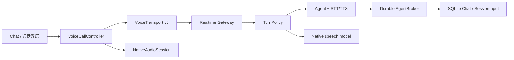

# 移动端实时语音技术设计

日期：2026-09-11。状态：协议、网关和移动端实现已完成；真实设备与真实网络的声学验收待发布前执行。线协议以[实时语音协议 v3](./realtime-voice-websocket-protocol.md)为准。

## 1. 设计目标

同一个 Chat 支持两种明确模式：

- `assistant`：语音转写进入当前 Agent，可使用已有工具和持久任务能力。
- `natural`：原生语音模型直连，不进入 Agent，不注册工具，仅使用受控提示和有限 Chat 上下文。

实现只保留一套 v3 协议、一套移动端控制器和一个原生音频模块。模式差异在网关策略边界内处理，不复制移动端采集、播放、弱网和生命周期逻辑。

## 2. 职责边界

- Controller 是移动端通话状态、代次、静音和恢复的唯一所有者。
- Transport 只负责严格协议、序列、RTT、拥塞与连接生命周期。
- NativeAudioSession 只负责硬件采集/播放、系统路由、中断、回声处理和近讲检测。
- TurnPolicy 只决定何时提交一段话；策略失败时使用有界确定性规则。
- AgentBroker 把语音输入接入既有持久 SessionInput/Agent run，不创建第二套任务系统。

## 3. 媒体与打断

上下行都使用 20 毫秒 `XOP3` PCM 帧。移动端上行 16 kHz、640 字节；网关下行 24 kHz、960 字节。每帧包含连接代次、方向序号、媒体时间和 utterance/response 标识。重连、静音恢复或输入丢弃会开始新 utterance；旧帧不能污染新连接。

打断分两步：

1. 原生近讲检测立即降低当前播报音量，给用户即时反馈。
2. 服务端语音判定确认后停止当前语音流；误触发则恢复音量。

全双工路由保持采集并使用系统回声处理。系统只提供半双工能力时，播放期间暂停采集，避免把扬声器声音作为用户输入。耳机、蓝牙、扬声器切换由原生模块上报，Controller 重新计算是否允许采集。

“停止播报”只清空本地播放和对应语音流。Agent 任务继续执行并把结果写回原 Chat。“取消任务”是独立、显式、可见的操作，才会中止 Agent run。挂断不会撤销已完成工具动作。

## 4. 轮次判定

TurnPolicy 维护有界转写缓冲和稳定 turn ID，接收 complete、incomplete、backchannel、wait 四种结论。可插拔语义判断超时或失败时回退到确定性规则：常见未完表达和短停顿延长等待，附和词不触发任务，充分静音后提交。异步结果携带 generation，过期结论直接丢弃。

这套策略在网关执行，因此移动端、Web 和桌面得到一致行为；客户端不自行猜测文本语义。

## 5. 弱网策略

- 上行队列达到约 120 毫秒时暂停原生采集，低于恢复水位后继续，避免“网络恢复后播放几秒前说的话”。
- 达到临界水位时丢弃当前未完成输入、报告可恢复的 `INPUT_DROPPED`，并提示用户重说。
- Provider 上传串行且有界；超时关闭本次连接，不无限堆积。
- 下行按实际播放时长确认，网关限制未确认窗口；停止或过期的 response 帧被丢弃。
- Transport 记录当前/最大 RTT、峰值队列年龄、丢帧数、拥塞暂停次数和音频路由，不记录原始音频或完整文本。
- 断线后不自动静默打开麦克风。用户重连会获取新 ticket 和连接代次，并在原 Chat 继续。

## 6. 生命周期

麦克风是否实际开启由以下条件共同决定：连接已就绪、用户未静音、App/系统允许采集、音频路由可用、未等待明确批准、输入未因拥塞暂停。所有异步回调都校验 controller generation。

进入后台、来电/音频焦点中断、路由丢失和恢复是独立事件。临时中断保留用户的“未静音”意图，但停止实际采集；恢复时重新验证路由和连接。结束通话按固定顺序停止捕获、清空播放、关闭传输并释放系统音频资源。

## 7. 安全与隐私

- ticket 不进入 URL；密钥不下发给客户端。
- 客户端不能覆盖模型、服务地址或提示词。
- 自然模式不具备 Agent/tool 回退路径。
- 澄清与授权必须经显式 UI 操作，环境语音不能自动批准。
- 诊断数据只包含有限时序和计数，敏感音频与完整转写不进入日志。

## 8. 验证门槛

自动化验证覆盖协议解析、媒体序列/代次、PCM 重组、轮次竞态、Agent 持久任务、停止播报与取消任务边界、拥塞暂停恢复、静音、路由变化、后台恢复和诊断脱敏。Android 模块需通过 Kotlin 编译与单测，iOS 模块需通过模拟器构建，移动端/Web/网关需分别通过类型检查和相关测试。

自动化不能替代以下真机验收：内置外放回声、蓝牙切换、系统来电、真实丢包/高 RTT、30 分钟温升耗电、两种模式连续多轮和十次快速打断。发布前应记录 P50/P95 的说话结束到首音频、误打断率、漏识别率和恢复成功率，再调整阈值；不凭模拟音频宣称声学质量达标。
