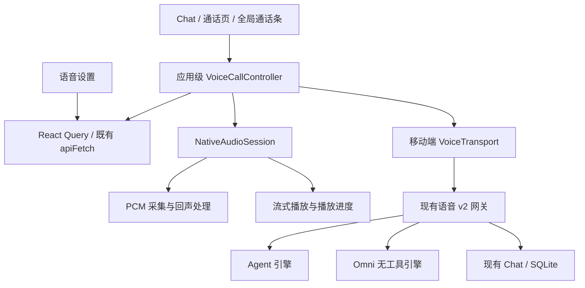

# 移动端语音技术方案

日期：2026-09-05。状态：代码已实现，真机发布验收待完成；具体文件、精简差异和验证结果见 [交付记录](./mobile-voice-delivery.md)。产品契约见 [产品方案](./mobile-voice-prd.md)，现行网络契约见 [语音协议 v2](./realtime-voice-websocket-protocol.md)。本文明确区分已存在实现、拟新增能力和需要真机验证的假设，不修改现行协议的含义。

## 1. 当前基线与缺口

| 领域 | 现状证据 | 本期处理 |
| --- | --- | --- |
| 原生客户端 | Expo ~56、React Native 0.85、expo-audio ~56；见 `apps/mobile-expo/package.json` | 保持 SDK 与主框架，不新增浏览器目标 |
| Chat 录音 | `use-chat-voice-recording.ts` 使用按住、松手发送/手势转文字，AppState 非 active 时取消 | Chat 改为显式听写，录制/处理均可取消 |
| 语音备忘 | `apps/mobile-expo/docs/voice-capture.md` 定义本地持久音频、幂等同步 | 保留其独立保存契约，只共享设备资源仲裁 |
| 播放 | `audio-playback-coordinator.ts` 只管理当前播放器的暂停回调 | 扩展为单一音频资源所有者，覆盖采集和系统焦点 |
| 网关 | `src/voice/realtime/runtime.ts` 有 preflight、一次性 ticket、Chat reservation、Agent/Omni 引擎 | 复用，不新建手机专属会话后端 |
| 协议 | `packages/realtime-protocol/src/voice.ts` 定义 v2、PCM、静音、取消、播放确认 | 原样复用类型与编码；不新增 resume/replay 假契约 |
| Web 实现 | `voice-session-client.ts` 依赖 Web fetch、URL、window 定时器 | 只提取真实可复用的纯协议部分，原生使用自己的认证和生命周期 |
| 手机网络 | `src/api/client.ts` 有设备认证、隐私授权、受验证路由、连接代次和写入恢复约束 | 所有语音 REST 继续走这一链路，WS 固定同一已验证网关 |
| 服务状态 | `/api/voice/realtime/status` 已返回 enabled、defaultEngine、Omni/STT/TTS 路由 | 扩展同一接口的能力详情，不新增重复 capabilities 路由 |
| 历史 | 网关 SQLite 为权威，连接清理等待转写落盘再释放 reservation | 手机不自行补写语音转写成第二份消息 |

现有 v2 没有 provider socket 恢复或历史事件重放；新连接使用新 ticket，在同一 Chat 从存储恢复上下文。原生无工具与 Agent 工具通话能力不同，不能靠 UI 统一声称能力相同。

## 2. 架构与职责



不引入通用插件框架、第二个路由系统或新状态机依赖。状态迁移使用纯 TypeScript reducer；原生硬件和网络通过小接口注入，便于故障测试。

资源仲裁规则：开始通话可以暂停普通朗读，结束后不自动续播；若已有笔记录音或听写则拒绝抢占，提示先完成当前录制，不能悄悄丢弃素材。通话期间启动其他采集同样被拒绝。

建议增量文件位置，名称为实施目标，不代表已存在：

| 位置 | 职责 |
| --- | --- |
| `apps/mobile-expo/src/features/voice/voice-call-controller.ts` | 单一通话所有者，启动/取消/恢复顺序与 generation |
| `.../voice-call-state.ts` | 纯状态、转换、UI 派生状态，不访问设备或网络 |
| `.../voice-call-provider.tsx` | 根节点接线与订阅，挂在现有 Router 上方 |
| `.../VoiceCallScreen.tsx`、`.../VoiceCallBar.tsx` | 全屏与收起视图，无网络资源所有权 |
| `.../native-audio-session.ts` | 原生音频接口与所有权、暂停/释放、设备格式 |
| `.../voice-transport.ts` | ticket WS、v2 验证、心跳、流量与断开通知 |
| `apps/mobile-expo/src/query/voice.ts` | 能力查询、preflight、创建会话、服务状态；mutation 默认不重试 |
| `apps/mobile-expo/src/features/chat/use-chat-dictation.ts` | 听写缓冲、完成插入、取消与草稿版本保护 |

UI 状态用 Zustand/现有 provider 订阅；服务器数据由 React Query 缓存。设备偏好放现有 MMKV preferences，按网关分区存通话能力覆盖；不把 socket、ticket、音频缓冲或 active 标志持久化。App 重启永远从无活动通话开始。

## 3. 身份与状态建模

标识职责：

- `gatewayId + sessionKey`：固定通话目标；不能因为导航变化而变。
- Chat 当前 transcript identity：由网关验证，防止 reset 后旧回调污染新历史。
- `sessionId`：网关一次音频连接 ID；重连会改变，不展示成新 Chat。
- `generation`：客户端资源代次，取消/替换/断线递增；异步结果必须匹配当前代次。
- `responseId / utteranceId / revision`：音频回答与识别修订归属；不能按“当前屏幕消息”猜归属。

不增加持久化 Call 表。UI 本次通话计时在 controller 生命周期内保留，恢复时不重置；挂断结束，下一次点击重新计时。

状态采用正交字段，避免组合爆炸：

```ts
type CallState = {
  connection: 'idle' | 'connecting' | 'connected' | 'recovering' | 'paused' | 'ending';
  microphone: 'open' | 'muted'; // User intent; actual capture is separately derived.
  reply: 'idle' | 'generating' | 'playing' | 'awaiting_confirmation';
  surface: 'expanded' | 'collapsed';
  pauseReason?: 'background' | 'interruption' | 'route_lost' | 'network' | 'service';
  generation: number;
};
```

实际允许采集 = connected + 用户开麦 + 音频资源就绪 + App 前台或允许且具备后台能力 + 无系统中断 + 非待确认状态。字幕的“已关闭”描述用户静音意图，“已暂停”描述环境；不能把暂时硬件不可用写回用户偏好。

待确认期间本期暂停新音频输入但保留开麦意图，完成明确提交后才能恢复；这样与现有“不用环境语音授权”的约束一致。UI 必须显示“等待你确认”，不能显示正在聆听。

## 4. 原生音频决策与 P0 验证

当前安装的 expo-audio 存在 `AudioStream` / `useAudioStream` 实时 PCM 采集接口，[SDK 56 文档](https://docs.expo.dev/versions/v56.0.0/sdk/audio/) 也有说明。该事实只证明采集入口可用；没有证明完整双向语音、回声消除、流式播放和后台链路均满足要求。

本机 Android `AudioStream.kt` 使用 `MediaRecorder.AudioSource.MIC`。P0 必须核实实际回声处理与系统通信路由行为，不能因名称是 AudioStream 就宣称适合扬声器通话。

实施顺序：

1. 在开发构建中验证现有 PCM 采集，记录实际采样率、帧长、线程开销与停止行为。
2. 验证连续 PCM 下行播放、已渲染位置、flush 与同时录音。不得把每帧写成音频文件轮播。
3. 验证外放回声、蓝牙双向通信、系统中断与后台；记录现有依赖能否满足。
4. 若现有能力缺失，实现一个项目内 Expo 原生音频模块：iOS 使用适合双向通信的音频会话与 voice processing；Android 使用通信音频配置及实际可用的回声/降噪能力。只暴露本项目需要的接口，不建立多后端切换框架。
5. 不同时保留两套生产通话采集实现。已有文件录音继续服务语音备忘，通过同一所有权管理器协调。

概念接口：`start(inputFormat)`、`setCaptureEnabled(boolean)`、`enqueue(responseId, pcm)`、`flush(responseId)`、`getRenderedBytes(responseId)`、`stop()`，事件包含 PCM 输入、播放进度、路由变化和中断。`stop/flush` 必须幂等，所有回调携带 generation。

输入按网关返回格式转换；现行为 16 kHz/单声道/PCM16，目标 40 ms 帧。不能假设硬件或蓝牙始终使用请求采样率。重采样应流式保持滤波状态，不能逐帧独立舍入导致漂移。输出按 `response.audio.started` 声明，现行为 24 kHz 单声道。

输入/输出队列均有界。设备路由变化时清空旧格式缓冲再重建；旧回答的声音永不混入新回答。JS UI 更新限于状态变化和低频音量反馈，不能每个 PCM 帧触发 React render。

原生后台能力要求：iOS 配置音频后台模式；Android 配置适当的麦克风前台服务和必要权限、通知。不能把 Live Activity、常驻 JS 定时器或普通 WebSocket 当作后台运行保证。已有 expo-audio 的文件录音后台服务也不自动证明自定义流式通话受同样保护。[Expo 后台配置](https://docs.expo.dev/versions/v56.0.0/sdk/audio/#recording-audio-in-the-background)、[Android 音频焦点](https://developer.android.com/media/optimize/audio-focus)。

原生新增能力通过 `plugins/` 和项目内原生模块构建，禁止手改生成的 ios/android 工程作为长期方案。配置变化后 prebuild 与双平台重建，不能只验证 Expo Go。

## 5. 连接启动与传输复用

启动事务由 controller 串行执行：

1. 冻结网关、Chat、模式覆盖与 generation，检查本机是否已有录音/通话；相同目标展开，不同目标返回已有通话。
2. 经 React Query 和既有 `apiFetch` 执行能力查询、preflight、现有数据共享授权。拒绝不产生录音资源。
3. 获取系统麦克风权限，准备原生设备；此时不得上传或缓存用户语音。
4. 创建会话 ticket；REST POST 不自动跨路由重放。固定实际创建请求使用的已验证 HTTPS origin，WS 使用同源 WSS。
5. `session.start` 首帧提交 ticket，等待 `session.ready`，校验实际 route 与所选能力一致。
6. 静音意图若为 true，先发送 `input.mute`；只有整条链路成功才启用采集并显示“可以说话”。

若当前 `apiFetch` 不返回实际 origin，补充最小的成功路由元数据接口或原子锁定已验证 active route；不能在 ticket POST 后重新读取一个可能已变化的 active route 去连 WS。使用 connectionGeneration 防止换网关时的陈旧结果。

任一步取消都递增 generation，关闭已建 socket，释放采集/播放；稍后返回的票据和权限结果不能重启资源。尚未消费的 ticket 由现有 TTL 释放 reservation；重试遇到 409 如实等待，不绕开 reservation。

WS 使用现有 JSON schema 与二进制 codec；拒绝无效 frame、序列跳跃和错误 sessionId。JSON 与音频 seq 分别验证。心跳采用现行间隔并检查 pong；后台仍需真机证明原生/JS 生命周期足以驱动传输，否则 P0 模块须承接保持连接所需的最小工作。

不把高频 PCM 混入共享 gateway realtime 通道。共享通道继续承担普通运行与配置事件，独立 voice v2 socket 承担音频。

## 6. 操作的精确实现

### 静音

本机先禁止采集和上传，清掉未发 PCM，再发送 `input.mute(true)`。网关清理未提交识别片段；当前回答可以播放。若控制无法送达，转 recovering/paused；不能声称服务端已完成清理。已提交的上一轮不回滚。

取消静音只在 connected 且原生就绪时发 `input.mute(false)` 并启用新采集。不能重放静音前缓冲，也不能以持续发送静音 PCM 模拟静音。

### 停止回复

原子记录当前 responseId 已取消 → 本地 flush → 上报已实际渲染的累计字节（若可用）→ 发 `response.cancel` → 等待取消结果。清掉手动停止前的未提交输入，保持 microphone 意图。晚到的同一 response 音频/文本不能重新打开播放。

实际播放进度来自原生渲染位置，不按接收、排队或估算时间确认。平台渲染位置和物理出声仍有差异，指标标注清楚。重复停止幂等，`NO_ACTIVE_RESPONSE` 等竞态映射为无须用户处理的结果。

### 自然打断

本地回声消除负责避免自身播报进入识别；服务端负责语音活动和引擎判停。收到当前轮打断事件即 flush 旧回答，保留本次新 utterance。手动停止的“丢弃残留输入”不能复用到自然打断而吞掉用户的新表达。

Agent STT final 是输入提交边界；Omni 转写可能晚于生成事件。客户端不得把每个 final 再发成普通文字消息，也不能以文本非空推断已产生新用户请求。不要靠“嗯/啊”关键词黑名单弥补模型轮次能力。

### 挂断与暂停

先停原生采集/播放和计时任务，再 best-effort 发 `session.stop`，最后关 socket、释放所有监听。清理 promise 串行合并，重复回调不重复释放。UI 可以立即退出；服务器 reservation 必须等其自身的转写/运行清理结束。

后台关闭、来电或耳机丢失进入 paused，使用现行停止连接契约释放服务资源，保存 Chat 与本机静音意图；继续时建立新连接。短暂 inactive 先暂停音频，不直接按页面销毁处理。

## 7. 有限恢复与数据一致性

恢复目标是同一 Chat 的继续通话，不是传输重放。

| 失败类别 | 策略 |
| --- | --- |
| 短暂断网/已认证路由失效 | 停音频、失效旧代次、关闭旧连接；最多 10 秒窗口，串行按 0/1/3 秒退避尝试准备恢复，单个请求受剩余窗口约束 |
| preflight 409 | 旧 reservation 或运行仍在；仅重查就绪，不创建并行连接，窗口到期进入 paused |
| 创建 POST 响应丢失 | 视为结果未知，不自动重试创建；等待 TTL/服务清理，用户可稍后继续 |
| 401/设备撤销 | 仅复用现有认证层的合法刷新；仍失败则停止，要求重新连接网关 |
| 协议错误/服务不可用 | 结束当前传输并显示具体下一步，不无限重连或偷偷换引擎 |
| 配额/时长上限 | 正常提示与停止；无自动绕过限制 |
| 用户挂断/权限撤销/换网关 | 禁止任何后台恢复 |

恢复只在目标未变、用户未结束、前台或后台授权有效时进行。每次创建成功但连接失败后必须先等待旧 reservation 清理，再尝试下一次；不能把退避计时器当作创建授权。

重建后通过现有 session query 读取权威历史和任务状态，不重投输入或工具。JSON `messageId` 去重仅在现有连接窗口内生效，不构成跨连接 exactly-once 保证。操作结果未知时显式显示未知/待查询，不自动代用户再次执行。

Chat reset/delete 或同 key 的 transcript identity 变化时终止自动恢复，要求回到 Chat 主动发起。若现有 session query 未暴露可验证身份，实施时补充最小只读身份字段；在能验证前不得声称跨 reset 安全自动恢复。

本机的恢复窗口可能早于服务器失联清理完成，这是允许的：先进入 paused，待服务就绪再继续。长期目标的无缝连接轮换需另行增加明确租约/恢复协议，本期不预建该框架。

## 8. 配置与能力契约

现有 `/api/voice/realtime/preflight` 仅返回成功或错误；已有 `GET /api/voice/realtime/status` 返回服务路由。扩展该 status 响应的 `capabilities` 字段即可支撑三种能力的就绪设置页，不新增重复端点。实施阶段将状态类型移入共享契约并核对设备访问规则，保留当前仍被 Web 使用的路由字段。

概念响应（字段为拟议，不是现行 API）：

```ts
type VoiceCapabilityDetails = {
  dictation: { available: boolean; reasonCode?: string; languages: Array<'zh' | 'en'> };
  conversation: {
    agent: { available: boolean; reasonCode?: string; usesTools: true };
    omni: { available: boolean; reasonCode?: string; usesTools: false };
  };
  bargeIn: boolean;
};
```

能力查询不占 reservation、不建立供应商连接、不触发收费诊断；描述配置就绪，不能标记为“已实测通话正常”。`available` 不包含具体 Chat 是否繁忙；启动仍执行 preflight。

手机保存 `conversationModeByGateway`，未设置则跟随网关。选择仅聊天发送已有 `engine:'omni'`；工具通话发送 `engine:'agent'`。`usesTools:true` 表示该路径具备工具机制，不越过 Agent 的具体权限。服务端只允许两个现有白名单路由；测试确保 Omni 不装载任何工具、无隐式 Agent 回退。

字幕与后台为设备偏好；音色/模型/服务凭据沿用网关配置。手机首版只提供音色试听和管理入口，不新增凭据获取或显示功能。语言仅暴露真实支持值，不能把现行 `zh/en` 协议写成任意语言自动识别承诺。

现有 `/api/voice/realtime/preview` 测试的是流式 TTS，不能验证或冒充 Omni 的声音。首版仅在对应 TTS 方案下复用该接口，原生方案尚无真实试听支持时禁用试听并说明原因。试听先取得同一音频资源所有权，结束即释放，不写入 Chat。

无管理权限者看到服务状态和清楚原因，不能打开可编辑的管理员表单。进入管理设置不自动挂断 App 内通话；音色与引擎修改只影响下次通话，当前连接使用冻结配置。

## 9. 听写、任务与权限集成

听写复用 v2 `purpose:'dictation'`、现有 refine 接口。中间转写按 utteranceId/revision 替换，不简单拼接重复全文；完成时停止采集、发出最后的有效 PCM、再 commit，以 `session.closed(reason:'input_committed')` 为成功完成边界，随后 refine/插入。普通 socket close 或超时不算成功；空识别不修改草稿。连接异常时仅保留已识别内容，不自动发送录音。草稿版本与光标快照用于防止异步覆盖。

语音 memo 保持离线保存和现有幂等同步，不重用在线听写完成动作；长录音和素材播放仍存在，不作为 legacy 删除。

任务活动复用 `response.activity`，澄清复用 `response.clarification` 和现有明确提交 REST。工具授权沿用当前审批服务，过滤 sessionKey 与请求 ID；重复点击遵守原接口幂等/状态检查。后台确认暂停音频输入并提示回到 App，不自动批准。

所有 REST 经 `authorizeMobileRequest`，检查现有数据共享规则是否覆盖新增能力及语音端点；普通 capabilities 元数据不额外采集声音。手机仅持有设备凭据与一次性 ticket，供应商密钥始终留在网关/平台。日志记录 requestId、sessionId、responseId、generation、阶段与耗时，不记录 ticket、原始音频或完整转写。

## 10. 测量与测试

复用现行 `session.metric` 的接收延迟与 local_stop，但不改变名称含义来冒充实际出声指标。原生测量先写入有界诊断记录，后续如需上传新增指标必须显式扩展严格 schema 与测试。

- reducer/控制器：连接中取消、旧代次回调、双击、静音重连、停止不提交、自然打断不丢新输入。
- 协议：非法/乱序帧、错误 responseId、累计实际播放确认、缓冲上限、心跳超时。
- 网关：Omni 无工具、两引擎取消、Chat reservation 与转写清理、reset/delete 身份、创建结果未知。
- UI：键盘/草稿保留、通话条占位、Android back/iOS 返回手势、长字幕、大字体、屏幕阅读器。
- 原生真机：P0 双向音频验证与 PRD 全部质量矩阵；特别验证旧蓝牙帧不串入重建后的流。
- 集成：设备撤销、隐私授权拒绝、路由切换、后台系统通知停止入口调用同一 controller 清理。

开发验证命令按改动范围执行：`pnpm run mobile:lint`、`pnpm run mobile:typecheck`、`pnpm run mobile:test`；修改共享 realtime/agent stream 时运行对应包测试与受影响 web/网关测试。原生配置变化重新 prebuild/build 并做真机验证；发布门槛不能由纯单元测试代替。

每个阶段的 self-review 使用统一检查项：资源唯一所有权、事件归属、无重复副作用、状态/文案一致、现有路径回归、未覆盖项。修复后复跑受影响检查，记录设备/系统/音频路线/服务模式/网络条件与测量方法。

## 11. 分阶段修改与清理清单

| 阶段 | 主要代码位置 | 必须清理/限制 |
| --- | --- | --- |
| P0 | 原生音频最小模块或现有 SDK 接线、共享 capabilities schema、能力查询 | 验证结果决定唯一生产音频路径；不并行引入多个通话 SDK |
| P1 | ChatComposer、听写 hook、根 provider、通话界面、query/voice、settings | 新路径可用后删除 Chat 默认松手发送手势、重复文案及专用死测试 |
| P2 | controller、transport、audio coordinator、原生模块/config plugins | 删除页面卸载结束通话的错误依赖；禁止新增无界重试队列 |
| P3 | 字幕/任务卡、口语输出集成、诊断与验收记录 | 删除虚假状态和不生效配置；两条引擎分别验收，不改写历史数据 |

发布时先提供支持现行 v2 和 status 能力字段的网关，再发布手机；不支持的网关显示需要升级，不增加旧版实时语音协议兼容层。开发中可限定测试构建开放新通话；正式启用后只有一套 Chat 交互，不能长期用开关保留两套入口。

本设计未指定尚未验证的第三方原生依赖，也不承诺 WebRTC 一定必要。首选复用现有 WSS 协议；若 P0/P2 的实测表明其延迟、后台或音频处理无法满足门槛，再以测量证据单独评估传输替换，不同时上线两套协议维持兼容。

## 12. 设计自查记录

本轮完成静态代码和契约核对，以下冲突已在设计中消除：

1. 将 App 内收起与系统后台分开，避免复制短录音的 AppState 取消规则。
2. 将持续 Chat 与连接恢复分开，明确 v2 不支持 resume，创建结果未知不得重试写入。
3. 将设备偏好与网关全局配置分开，避免手机上的音色控件看似个人偏好、实际改动所有用户。
4. 将停止回复与独立后台任务分开，避免承诺已执行工具可撤销或必定继续。
5. 将 PCM 采集与完整双向通信分开，流式播放/回声/后台为 P0 必验项。
6. 将现存离线语音备忘与被替换 Chat 录音手势分开，清理不破坏持久素材。
7. 将已渲染字节与物理出声测量分开，避免虚报停止延迟。
8. 复查发现已有 realtime/status，改为扩展原接口，删除设计中的重复 capabilities 路由；听写完成明确使用现有 input_committed 边界。
9. 复查发现 preview 只走 TTS，明确原生语音不能复用该接口冒充音色试听。

实施更新（2026-09-06）：已选定项目内 Expo 原生模块；现有 session 查询可验证 transcript identity；能力、认证和控制器回归已执行。设备矩阵性能、设备权限端到端验证和两种引擎的真实判停效果仍待真机验收，详见交付记录。上述方案保留设计基线，实际实现采用更少的状态和视图文件。
