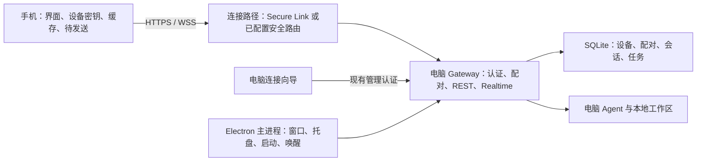
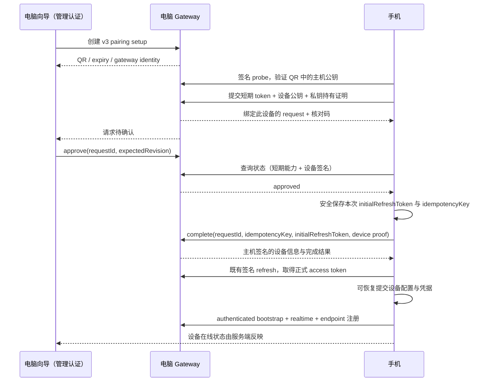

# 手机连接工作电脑：产品与技术方案

状态：核心流程已实现，真机发布验收待完成。日期：2026-09-03。

## 1. 定位与交付边界

电脑是工作主机，手机是随身工作入口。用户在电脑开始工作，离开后通过手机查看进展、补充要求、处理待确认事项，再回到电脑继续。

本期只支持用户自己的电脑运行 xopc。电脑上的 Gateway、SQLite 和工作区仍是工作状态的权威来源；手机保存设备凭据、必要缓存和未发送内容。互联网连接可以复用现有中继服务，但不承载托管 Agent 或工作数据库。

本期交付：首次连接向导、设备确认、连接恢复、可靠离线输入、桌面后台运行体验。已有工作首页和任务能力保持原有信息架构，仅调整连接后的落点和状态表达。不新增服务器部署入口、手机运行时、独立账号体系或通知服务。已有账号授权只在所选连接服务需要时出现。

成功定义：用户无需填写 URL、Token 或选择网络协议，能够完成配对，在移动网络下继续同一会话，并在断线恢复后不丢输入、不重复提交。

## 2. 核心交互决策

1. 手机首屏直接扫码，安装帮助在同一页的次级入口；删除“点连接后再看一遍说明”的中间页。
2. 电脑只有一个“连接手机”向导。准备连接、账号授权、二维码、确认请求在原位置切换。
3. 每屏一个主操作。系统可以完成的步骤自动推进；必须由用户决定的只有开启远程连接和允许设备访问。
4. 已有可用连接直接显示二维码。模型未配置不阻塞配对；进入工作后提示在电脑完成设置。
5. 手机配对成功后自动进入工作首页，不要求再按一次“完成”。电脑留下简短完成状态。
6. 普通断线保留当前工作。仅明确撤销、凭据失效或身份变化进入修复授权流程。
7. 健康连接保持安静。异常在工作内容附近说明，不用全屏连接弹窗盖住可读内容。

## 3. 页面与文案

### M1 · 手机首次连接

采用完整页面：上方 xopc 字标、中部偏上标题与两行说明、下方一个主按钮。与内容网格左对齐，底部操作在安全区内。无需插画和功能卡片。

> 连接工作电脑
>
> 在电脑上打开 xopc，点击「连接手机」。
>
> [扫描二维码]
>
> 还没安装？
>
> 电脑需保持运行并联网。

“还没安装？”打开简短帮助页：电脑访问 xopc.ai 下载、完成首次设置、点击连接手机；提供“复制下载地址”。未在电脑旁可退出帮助，重新打开时回到 M1。无需注册或填写邮箱。

相机权限只在点击扫描后申请。拒绝时保留页面，显示“需要相机权限才能扫码”，提供“打开设置”；辅助入口“使用配对链接”可粘贴当前有效链接，不增加共享 Token 输入。

### D1 · 电脑连接向导

入口：侧边栏底部“连接手机”，设置 → 设备提供同一入口。连接后侧栏入口可收为“设备”，不占据工作导航主区域。

Web/Electron 共用向导主体。桌面窗口采用固定响应式外框：建议宽 560px、最大宽为视口减 32px、高 `min(600px, calc(100dvh - 48px))`；头尾固定，中间 `min-h-0` 内部滚动。不同状态不跳动窗口尺寸。

预检时用保持布局的骨架。可用路由已有时直接 D2；没有时展示：

> 连接手机
>
> 离开电脑，也能继续工作。
>
> 开启后，手机可通过互联网连接这台电脑。
>
> [开启连接]
>
> 已有连接方式

默认流程复用 XOPC Secure Link。需要授权时在此打开现有授权窗口，回调后继续；不要求用户去“远程访问”设置自行完成，再手动返回。

现有隧道 consent 的版本、范围及强制说明保留：短文案作为摘要，详情使用可展开内容；需要显式勾选的条款不以“下一步”代替。账号授权被取消时回到可重试状态，不当作连接失败。

“已有连接方式”展开简短列表：Tailscale、已有 HTTPS。优先复用配置；未配置时显示该方式必要条件，例如手机也须接入同一 Tailscale 网络。完成后回到当前步骤。主流程不展示 broker、证书、端口或密钥。

准备期间只有一条当前阶段：“正在准备连接” → “正在验证连接”；细节中可见下载、注册、证书或连接错误。首次耗时较长时显示“首次开启可能需要几分钟”。阶段来自真实服务状态，不生成假百分比。

### D2 / M2 · 扫码与确认

电脑显示“用手机扫描”、二维码和“10 分钟内有效”。接近过期再显示剩余时间；过期替换为“二维码已过期 / 刷新”。不把地址、路由类型和完整配对链接常驻在二维码旁。

二维码最小显示尺寸 216px，保持模块边缘清晰和充足留白。主码固定黑白对比，不跟随暗色反转。“无法扫码？”内提供短期配对链接；可被截图或传播的内容不得包含长期访问密钥。

手机扫描后先验证主机身份，然后显示：

> 在电脑上确认
>
> 正在连接「工作 MacBook」。
>
> 482 716
>
> 确认两端数字一致。
>
> 取消

电脑向导原位切换，不再叠第二个弹窗：

> 允许这部手机连接？
>
> iPhone · 可继续对话、查看和操作工作。
>
> 482 716
>
> [允许连接]  取消

提供折叠的具体访问范围。范围与实际 device scopes 一致；配对不赋予 gateway.admin，也不替代既有工具和对外动作审批。数字仅用于人工比对，不是可独立使用的登录码。

确认期限建议 2 分钟，且不超过二维码的到期时间。窗口显示时仅处理一个请求。第二部手机扫描时提示“正在连接另一部手机”，不覆盖当前请求。刷新二维码、取消向导使当前未完成请求失效。

允许后，手机完成凭据持久化、设备认证和初始连接检查，再轻触觉反馈一次，短暂显示“已连接”，自动进入工作首页。避免增加第三次确认。

### M3 / D3 · 进入工作

手机首次配对进入现有 `/` 工作首页，展示该电脑的工作；再次打开则保留原会话或任务页面。重新授权时返回原工作，只有该对象已经不存在才回到首页并说明。

首页复用已有 Continue / Needs attention 数据，优先可恢复的工作。空白电脑显示一个“开始对话”动作。连接就绪不代表模型可用：模型缺失显示“在电脑上完成模型设置”，不把它归类为连接故障。

电脑完成态：

> 手机已连接
>
> 现在可以从手机继续工作。
>
> 关闭窗口后继续运行  [开关]
>
> [完成]

开关读取现有设置，不静默修改。首次未设置时可建议开启，由用户点击生效。下方一次性说明“电脑休眠或退出 xopc 后，手机会断开”。开机启动、接通电源时保持唤醒放入设备设置，作为独立选项；不在配对流程同时要求三项设置。

手机设备详情提供“测试外出连接”：提示关闭 Wi-Fi 后再检测。仅观察到移动网络并完成认证 API 和实时连接检查时标记“移动网络测试通过”。未切网络显示“当前仍在使用 Wi-Fi”；未知网络类型显示“连接可用，网络类型未确认”。此检查可跳过，结果记录测试时间和当时网络类型，不能保证所有后续网络均可用。

### M4 · 离线与恢复

页面不跳走。健康时电脑名称是普通上下文，不常驻绿色大卡片。短暂重连延迟约 2 秒再显示，避免网络切换造成闪烁。

| 状态 | 简短文案 | 行为 |
|---|---|---|
| 手机无网络 | 手机无网络 | 展示缓存，允许保存草稿与待发送内容 |
| 无可达路由 | 暂时无法连接电脑 | 自动重试；点开显示检查联网、xopc 运行、休眠的帮助 |
| 实时连接未恢复 | 正在恢复连接 | 缓存标注更新时间；需要实时能力的操作等待 |
| 明确凭据失效 | 需要重新连接 | 提供扫码；保留本机未发送内容 |
| 已恢复 | 已连接 | 短暂反馈后收起，刷新当前工作 |
| 超过自动发送时限 | 请确认是否仍需发送 | 保留内容，由用户重新确认 |
| 撤销设备 | 连接已移除 | 停止重试和发送，提供重新配对入口 |

不从连接超时推断“电脑关机”。过时任务状态显示“上次同步 14:32”，不能把缓存的“执行中”当成实时进展。

离线消息保留在原会话，状态“待发送”，可取消回草稿。第一版沿用每个会话最多一条待发送消息，后续输入继续作为草稿；已有待发送消息时说明“上一条正在等待连接”。草稿未点击发送不自动入队。

已知尚未提交的消息可以取消；网络响应丢失、提交结果未知时标记“正在确认发送结果”，不能声称已经取消电脑上的工作。该阶段查询原 clientMessageId 的结果或使用同 ID 重试；不能创建第二条输入。

任务审批、删除和其它有状态命令不进入普通离线消息队列。连接恢复后重新读取动作状态和版本，确认仍有效再允许操作。审批过期显示“此事项已更新”，不盲目重放旧批准。

## 4. 视觉与行为规范

手机遵循 `apps/mobile-expo/DESIGN.md` 的 Quiet Momentum，电脑遵循 `docs/design/ui-design-system.md`。预览采用各端既有目标视觉语言，不发起本期之外的全站主题重构。

- 系统字体；手机标题 28/34，正文 16/23，按钮 15/20；电脑标题 20/28、正文 14/22。标题与内容左对齐。
- 手机页面水平边距 20–24pt，主按钮高 48pt，触控范围至少 44pt。大字号时内容滚动，操作不覆盖文本。
- 暖灰或石墨底、清晰表面层级；电脑沿用蓝灰和现有 accent。每屏一个主色动作，辅助操作以文字呈现。
- 卡片只承载明确对象或浮层。流程不采用步骤卡片墙、不放装饰性设备插画、不用大面积渐变和玻璃效果。
- 常规状态切换约 180–220ms，以内容连续性为目的。相机识别和完成可使用一次轻触觉；错误不抖动页面。遵循 reduced motion。
- 不自动聚焦配对链接输入，不启动时读取剪贴板。链接粘贴由用户发起。
- 错误就地呈现，一条原因配一个恢复动作。详情页再显示诊断记录。英文、系统大字号及长设备名不截断关键动作。
- 手机相机、通知、照片权限分别按需申请；配对不绑在通知权限上。不承诺手机退到后台仍维持持续 socket 或实时执行手机端工具。

## 5. 已有基础与本期差异

以下来自本次代码检查，文档旧版“填写 URL + Token”已落后于当前设备配对实现。

| 能力 | 当前实现 | 本期调整 |
|---|---|---|
| 手机连接入口 | `GatewayConnectLandingModal.tsx` 已可扫码 | 收敛首屏、帮助、状态与导航返回目标 |
| 二维码 | v2 HTTPS universal link，含主机身份、短期令牌和路由 | 引入需主机确认的 v3 协议及能力协商 |
| 设备授权 | `devices.ts` 的 exchange 消费二维码令牌后直接创建设备并签发凭据 | 新增 pending/approve/complete，允许前不产生正式设备凭据 |
| 凭据与主机身份 | 设备私钥、refresh token、主机签名验证已有 | 延用；补齐配对响应丢失与会话恢复 |
| 配对 readiness | `ready` 仅判断候选路由数量 | 区分路由存在、主机身份可验证、认证和实时可用 |
| 远程连接 | Secure Link、Tailscale、自建 HTTPS，已有 OAuth/consent/启动进度 | 共用服务，在向导内编排；不复制第二套隧道状态 |
| 设备管理 | 列表与撤销已存在 | 与向导完成态统一，补齐离线待发送内容处理 |
| 桌面窗口 | macOS 关闭窗口可留进程；Windows/Linux 关闭触发退出 | 可选后台运行，正确处理托盘、退出、更新与系统关机 |
| 保持唤醒 | Electron 已有 keepAwakePreferred + powerSaveBlocker | 保留明确选项；如新增“接通电源时”，需补 AC 电源状态逻辑 |
| 手机缓存 | 部分缓存按 profile 隔离 | 检查所有工作缓存、草稿、pending run 与入队归属 |
| 待发送 | 按 sessionKey 保存，一会话一条，24h 后清除 | 按主机/会话/消息隔离；超时转待确认，保留正文及附件 |
| 输入提交 | session inputs 使用 clientMessageId，要求有效 endpoint claim | 重连必须先恢复 endpoint 注册；核验服务端持久幂等语义 |

## 6. 技术架构



Secure Link 当前声明 `broker_terminated` TLS。产品可以说明工作在电脑执行、连接通过服务中转；不能把现有链路描述为端到端加密或中继无法读取内容。保留现有披露范围。所选模型和连接器仍遵循各自已有数据处理说明。

### 6.1 连接编排

在 `web/src/features/endpoint-tools/` 或新增的紧邻模块内提取 `MobilePairingWizard` 与 reducer/controller，状态：

```text
checking → needs-route → authorizing → preparing-route → qr-ready
                                                      ↓
                                               awaiting-approval
                                                      ↓
                                                completing → done

任意未完成状态 → recoverable-error / cancelled / expired
```

服务端负责配对生命周期和隧道事实状态；前端负责当前展示、返回位置和取消意图，不以多个独立布尔量表达矛盾状态。关闭向导取消当前配对，但不会关闭其它设备正在使用的隧道。已经成功开启的共享连接继续保留，其状态可在设备设置管理。

授权浏览器回调带明确 flow id。配置应用或 Gateway 重启后，向导重新查询服务状态并恢复步骤，不重放已完成的授权/同意/创建请求。OAuth state 验证复用现有机制，拒绝过期回调。

readiness 建议扩展为 `protocolVersions`、`routes[]`、`routeState`、`nextAction`、`reasonCode`。保留旧 `ready` 字段供旧调用方使用，但新向导不将其当作手机已可访问的证据。路由检查绑定主机身份与该次配对，不创建任意 URL 探测代理。

### 6.2 需电脑确认的配对协议（拟新增 v3）

沿用现有 `link.xopc.ai/connect#p=...` 格式和 HTTPS/WSS 约束。v3 增加协议能力，不直接在旧 exchange 语义上增加一个可绕过的 UI 步骤。



拟定接口，最终路径在共享 contract 中统一：

| 接口 | 认证与用途 |
|---|---|
| `POST /api/device-pairing/setups` | 管理员；显式 `protocolVersion: 3`；创建 QR，10 分钟 TTL |
| `POST /api/device-pairing/requests` | 一次性 QR token + 签名设备声明；原子保留给一个公钥 |
| `POST /api/device-pairing/requests/:id/status` | 设备绑定的短期能力 + 签名；返回有限状态，不返回凭据 |
| `GET /api/device-pairing/setups/:id` | 管理员；读取当前请求和展示信息 |
| `POST /api/device-pairing/requests/:id/decision` | 管理员；approve/reject + expectedRevision，保证单次决定 |
| `POST /api/device-pairing/requests/:id/complete` | 该手机短期能力 + 签名；只在 approved 状态创建正式设备并登记初始 refresh credential hash |
| `DELETE /api/device-pairing/setups/:id` | 管理员；取消未完成 setup/request |
| `POST /api/device-pairing/requests/:id/cancel` | 该手机短期能力 + 签名；取消自身未完成请求 |

手机签名覆盖 HTTP method、path、requestId、body hash、timestamp、nonce、协议版本及主机身份，服务端验证设备公钥持有和重放窗口。复用已有设备签名工具并给新消息独立 domain prefix，核对码不承担认证职责。所有短期能力从请求 body 传递，不进入 URL query 或诊断日志。

SQLite 迁移增加协议版本、request id、device key fingerprint、device metadata、status、revision、expiry、decision、completion idempotency key、device id。令牌只保存 hash。核对码绑定 request id 与设备公钥，重试保持一致。客户端时钟不决定授权是否过期，以服务端为准，UI 倒计时使用 server time 偏移。

设备状态：`pending → approved → completed`；`pending/approved → rejected/cancelled/expired`。事务 CAS 防止允许与取消、刷新二维码、重复扫码、重复完成之间竞争。同一 setup 仅一个请求；同一设备的重复提交幂等返回原请求，其他公钥不能占用同一已保留请求。

完成响应丢失必须可恢复。本提案采用“手机预生成初始 refresh credential”的方式，复用现有 refresh 中客户端生成 nextRefreshToken 的模式：手机用安全随机数产生至少 32 字节 secret，按现有 token 格式生成 initialRefreshToken，在请求前将它与 idempotencyKey 存入安全存储，并把 token 纳入设备签名范围。Gateway 校验格式、绑定公钥、request 状态后，在同一事务创建一次设备并保存 token hash 与有效期，不保存明文 token；返回不含 secret 的签名完成结果。

同 requestId + 同 idempotencyKey + 同公钥 + 同 initial token hash 的重试返回同一 deviceId 和完成结果，不重复登记凭据。核对不一致返回冲突，撤销后拒绝重试。pending QR TTL 与 completed 恢复窗口分开：建议 completed metadata 保留 24h，且仅该设备的有效短期能力与签名可读取，过期返回明确修复路径。设备初始 refresh 有效期不超过正式 refresh 策略。

手机得到 deviceId 后走现有签名 refresh，取得 access token；刷新重试也必须可恢复：请求前安全保存旧 token、nextRefreshToken、requestId、nonce、timestamp 和签名形成 attempt journal；相同逻辑重试保留 credentialId、nextRefreshToken 和 requestId，确认成功后原子提升 next token 并清理 journal。服务端应在原 refresh 已轮换的情况下识别同 requestId 重试，拒绝不同业务参数重放。超过原签名时间窗口时，以新的 timestamp/nonce 重新签名，服务端在完整验证后查询同一业务请求的恢复记录，而非接受过期签名；这一兼容扩展必须与手机 journal 同步交付。现有刷新代码只在一次函数执行内复用这些字段，本期需补齐跨 App 重启的 journal 和服务端恢复窗口验证。这样无需为配对引入明文凭据响应缓存或额外密钥托管系统。

配对 status 采用前台短轮询即可，建议 1.5–2 秒；超时或退后台停止。电脑可复用 Realtime 提示变化，以查询结果为事实来源。不为一次配对建立第二套长连接。

短期凭据保存在手机安全存储以便返回前台恢复；取消、完成及过期后清理。正式配置与安全存储不能跨系统做单一数据库事务，因此用可恢复 commit marker：先保存凭据再写 profile，启动时补全或清理半完成状态；仅在二者完整后激活主机。

### 6.3 协议升级与访问边界

- 先发布支持 v3 的 Gateway，再发布手机。新手机检测不支持时提示“请更新电脑版”，提供现有下载帮助。
- 新向导只生成 v3 QR。旧 `/exchange` 明确拒绝 v3 setup，不能绕过电脑确认。
- 旧 v2 QR 在其 10 分钟 TTL 内沿用既有规则，仅作升级过渡；旧已配对设备继续使用原有刷新机制，不强迫全部重配。新配对路径不静默降级到 v2。
- 手机默认 scopes 沿用当前非管理员集合；decision、创建 setup、取消 setup 和设备管理继续要求 gateway.admin。
- revoked 与 transient network error 分开处理。撤销断开现有 realtime，并让后续 API/refresh 均失效；过期 access token 先正常刷新，不直接弹配对。
- 重装导致主机身份更换时必须重新确认，不因名称或域名相同自动信任；保留原主机缓存和待发送内容供用户处理。

### 6.4 连接状态、路由与恢复

手机状态机建议为 `unpaired | connecting | ready | degraded | offline-network | unreachable | reauth-required`。业务查询仍走 React Query；设置和工作主机选择沿用 Zustand；Realtime 继续由已有共享客户端管理。

`ready` 要求认证 REST、Realtime 建连和 endpoint 注册可用；数据按区域用骨架加载，不等待全部历史才能进入首页。HTTP 可用但 Realtime 失败为 degraded，可阅读，不声称能够执行依赖 endpoint 的输入提交。

每次连接流程绑定 `gatewayId + connectionGeneration`。取消、切换主机或退后台后，旧请求不得写入当前 token、activeRoute、页面或队列状态；按主机维护 refresh single-flight，避免跨主机复用同一个全局 refresh promise。

重试由一个 coordinator 控制：建议指数退避 1/2/4/8 秒至 30 秒，带 jitter；网络变化与回前台可立即触发一轮；手动重试合并到同一流程。各网络调用有超时，停止重试时中止在途请求。手机系统挂起时不保证后台重连；恢复前台时重新取状态。

路由按最近成功路径优先，顺序 failover。身份验证失败不能当普通超时降级为不受信任主机。每个逻辑写入复用同一 clientMessageId，不能并发向多条路由提交。网络错误不意味着凭据失效。

已认证且身份验证通过时刷新带版本的 routes 快照；无法通过旧路径联系时不盲目发现新主机。所有已知地址失效可提示在电脑刷新配对。Secure Link 地址稳定性是跨重启可用的依赖，需在验收中验证，不能仅用配对当时的 URL 永久缓存。

### 6.5 本机待发送与动作可靠性

建议 outbox v2 结构：

```ts
type PendingWorkInput = {
  version: 2;
  gatewayId: string;
  sessionKey: string;
  sessionId: string;
  clientMessageId: string;
  fingerprint: string;
  delivery: 'next' | 'steer';
  targetRunId?: string;
  content: string;
  attachmentRefs: DurableAttachmentRef[];
  contextRefs: ContextRef[];
  createdAt: number;
  autoSendUntil: number;
  state: 'queued' | 'confirming' | 'needs-review' | 'rejected';
};
```

上述类型为提案伪代码，附件与上下文类型复用项目现有 contract。索引按 gatewayId 隔离，entry key 包含 gatewayId/sessionId/clientMessageId。sessionKey 可能在重置后复用，因此提交前校验 sessionId；会话已重置、删除或目标 run 已结束时转 needs-review，不把过时要求悄悄放进新工作。

仅恢复原主机、取得最新会话状态并完成 endpoint 注册后 flush。`steer` 还要验证原 run，不能自动改为下一轮。续传时使用当前有效 endpoint claim，保留原始业务内容、上下文、delivery 与 message id。

建议沿用 24h 作为自动发送期限；超期转 needs-review，正文和本地附件继续保留。待发送文本和附件可取消为草稿，手机磁盘空间不足或附件丢失时停止发送并说明。语音只保证本地音频可靠保存，不承诺离线转写。

临时相机/录音 URI 在入队前复制到应用持久目录，持久化成功才显示“待发送”；随消息处理或用户删除回收。附件内容不写入 MMKV base64。应用被系统回收后，重启仍能读取正文及音频。

服务端必须将 clientMessageId 的接收记录与输入入队原子保存，返回重复请求的同一 run/input 结果；相同 ID 但不同 fingerprint 返回冲突。若当前接收链只保证进程内去重，应补 SQLite 接收账本后再承诺跨重启不重复提交。

网络响应丢失后重复提交同一请求只能返回同一接收结果。增加按 clientMessageId 查询接收状态的受认证接口供“确认中”使用，并校验原会话实例。`202 accepted` 表示已接收，不代表已执行；任务执行状态继续来自服务端。

旧队列按 sessionKey 存储且没有可靠主机归属。迁移时只有能证明原归属才绑定 gatewayId；无法确定则保存为“待确认内容”，禁止按当前 activeGateway 自动发送。不要为了完成迁移调用会清除 24h 内容的旧 reader。

审批/任务操作继续复用现有版本校验和幂等动作接口。普通聊天离线发送能力不改变动作权限规则。手机连接断开不取消电脑上已经接收的普通工作；依赖手机端工具的工作仍按现有 endpoint 不可用语义等待或报错。

### 6.6 桌面生命周期

Electron 主进程管理 `runInBackground`。开启且系统托盘/菜单栏入口已创建时，关闭窗口只隐藏/关闭窗口，Gateway 继续运行；未开启保留当前平台行为。托盘不可用时不创建无入口的后台进程，应保持窗口或明确说明无法后台运行。

显式“退出 xopc”、系统关机、卸载和更新安装沿用 before-quit 清理，不能被 close-to-tray 拦截。退出确认复用现有 gate，并说明“手机将暂时无法连接”，不增加重复确认框。

`openAtLogin`、后台运行和 keep-awake 是三个独立偏好，不互相隐式开启。保持唤醒设置必须注明只影响系统允许的自动休眠，不保证合盖、手动睡眠、关机后在线。Windows/Linux/macOS 分别验收关闭窗口、托盘打开、退出、更新和唤醒。

恢复后先探测 Gateway，再恢复 tunnel 和身份验证，最后由手机刷新工作状态。现有 resume 事件仅探测隧道状态，需验证服务本身的重连能力。对运行中任务是否恢复执行使用既有任务语义，UI 不承诺所有进程工作自动续跑。

## 7. 实施顺序

### A · 配对基础与可靠性

- 共享 v3 contract、SQLite 状态机、pending/decision/complete、初始 refresh 登记与可恢复刷新 journal。
- readiness 分层、路由身份验证、版本兼容与失效码。
- outbox 主机和会话实例隔离、接收幂等审计、超期保留、附件持久化。
- 单连接 coordinator 与 endpoint ready gate。

### B · 完整产品路径

- 电脑统一向导，复用 OAuth、consent、tunnel 服务及 existing-route 设置。
- 手机首屏、扫码等待、自动落到工作、重新授权返回原上下文。
- 健康/异常状态文案与设备管理，外出连接测试。
- Electron 后台运行选择及托盘生命周期。

### C · 交互验收与发布

- 小屏和大字号、浅/深色、相机权限拒绝、扫码过期、重复扫码、两端退出重开。
- 真实移动网络；HTTPS 可用但 WSS 不可用；主机休眠、换网、重启；手机回前台。
- 协议先服务端后客户端发布，新配对不降级绕过确认。
- 旧版移动文档同步更新为设备扫码流程，移除 URL + shared Token 教程。

不使用“只改页面”的中间版本对外承诺后台可用或消息可靠送达。A/B 可分 PR，但完整路径验收后再对用户开放新流程。

## 8. 验收标准

| 场景 | 必须结果 |
|---|---|
| 电脑已有连接，首次手机扫描 | 单一向导、一次电脑允许；无需手填配置；同一工作可继续 |
| 没有连接，需要授权 | 始终回到同一向导；保留真实 consent；失败后不丢进度 |
| 同一码多手机、取消与允许并发 | 仅一个 request 被完成；无静默替换、无越权凭据 |
| approve/complete 响应丢失 | 重试恢复同一配对，不产生多个设备或卡在 token consumed |
| 手机配对中被系统回收 | 凭据与状态可恢复或明确要求重扫，无半激活 profile |
| 撤销后旧连接、token、complete 重试 | 全部拒绝，停止队列 flush |
| 切到移动网络 | 验证 REST/WSS/endpoint；可继续原会话；结果不冒充永久连通承诺 |
| 暂时离线、HTTP 可用 WSS 不可用 | 页面可读、状态真实；不提交依赖无效 endpoint 的输入 |
| 主机 A/B 存在同名 sessionKey | 缓存、草稿、refresh 和消息不会混发或覆盖 |
| 会话重置或原任务结束 | 待发送内容转待确认，不落入新会话/新 run |
| 输入请求已接收但响应丢失，Gateway 重启 | 同 clientMessageId 只接受一次，返回原接收结果 |
| 待发送超过 24h | 内容可见可恢复；不自动执行陈旧输入、不静默删除 |
| 录音后关闭 App 再打开 | 音频仍在，重新连接后可可靠发送 |
| 离线点击过期审批 | 不排队批准，恢复后读取最新状态并提示变化 |
| 关闭窗口 / 退出 / 更新 / 合盖 | 符合偏好和实际平台语义；托盘可返回；不出现僵尸 Gateway |
| 暗色、小屏、大字号、减少动态效果 | 核心文案和动作无遮挡，焦点明确，触控尺寸合格 |

验证层级：协议状态机和关键幂等逻辑用单元/集成测试；两端配对和网络故障用端到端；生命周期和相机权限用真实系统/设备；布局使用截图人工对照。此文档与演示不代表上述验收已执行。

观测只记录阶段、耗时和 reasonCode：打开向导、路由就绪、扫码请求、允许、完成、工作可用、恢复连接、消息确认。默认本地诊断，延用 createLogger 对象优先规范；不记录配对 token、核对码、设备密钥或工作正文。若接入已有产品统计，沿用现有同意机制。核心指标是首次工作可用率、失败阶段、重连后可靠接收率，目标值由首轮基线确定。

## 9. 主要改动位置

- 手机：`apps/mobile-expo/src/features/gateway/`、`src/storage/device-credentials.ts`、`src/api/agent-client.ts`、共享 query keys 与 i18n。
- 电脑 UI：`web/src/features/endpoint-tools/mobile-device-access-section.tsx`、`mobile-device-api.ts`、`features/remote-access/`、`features/tunnel/`、shell 入口与 i18n。
- Gateway：`src/gateway/hono/routes/devices.ts`、`src/gateway/device-routes.ts`、`src/gateway/security/gateway-scopes.ts`、会话输入接收链。
- 持久化：`src/storage/sqlite/device-pairing-repository.ts`、设备访问与 schema migration、必要的输入接收账本。
- 桌面：`electron/main.ts`、`electron/tray.ts`、`electron/ipc/system-settings-ipc.ts`、`electron/tunnel-main.ts`。
- 共享：`packages/gateway-contract/` 配对、连接状态、稳定错误码及接收结果 contract。

交互预览采用示例设备与工作内容，仅模拟页面状态；不读取真实相机、不建立连接、不签发授权、不运行任务。

## 10. 实现与验证记录（2026-09-03）

已落地 v3 双端确认、SQLite 141/142 迁移、签名状态与幂等完成、SecureStore 配对/刷新恢复日志、统一电脑向导、手机连接首屏、后台运行设置及连接测试。离线输入按电脑隔离并绑定 sessionId，复用原有持久化 clientMessageId 接收记录；会话实例在入库与领取执行的事务内校验；已接收但尚未执行的旧实例输入会保留为 interrupted。附件复制到持久目录；旧版及超期内容保留供检查。

授权弹窗被阻止时可手动打开授权页面；短期 OAuth sessionId 在当前页面会话中保留。网关重启导致授权会话丢失时需重新授权。电脑向导关闭会取消尚未完成的二维码；手机中断可从安全存储继续。

自动化验证：手机全部单元测试、配对与输入后端集成测试、Web 类型与生产构建、Electron main/preload 构建。实际 React 向导使用模拟接口验证扫码→允许→完成，检查浅/深色和 320/768px 宽度；模拟接口不代表实际网络验收。

发布前仍需真机验证相机权限、系统回收、移动网络、WSS 被阻断、合盖/休眠和托盘平台行为。当前网络适配器在无法识别网络类型时只报告“当前网络可用”；不据此声称移动网络已验证。未添加新的云端工作运行环境。
