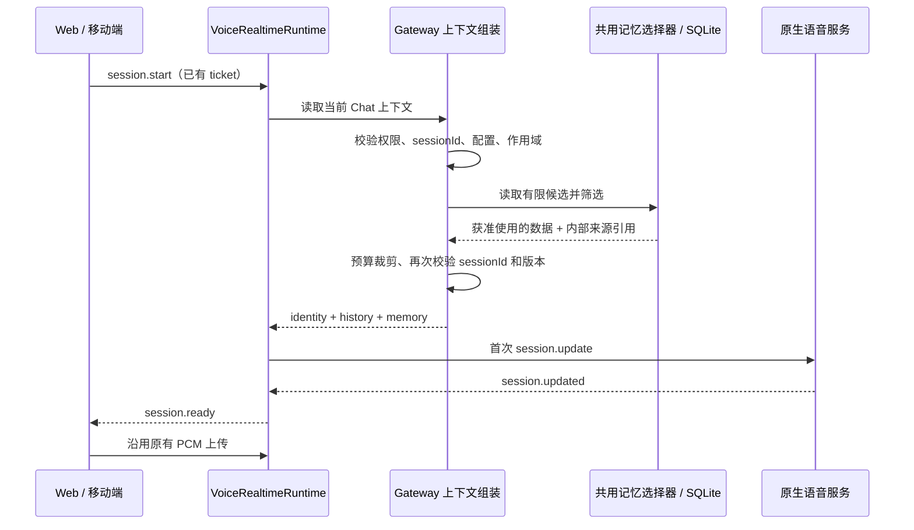

# 原生语音通话读取记忆：技术方案

设计日期：2026-09-05；实现复核：2026-09-06。状态：A/B 已实现；C 实测未通过受控回复验收，因此按原定门槛不实施/发布 D。适用范围：当前 `omni` 无工具通话，包括自有 DashScope Key 与 XOPC Cloud；Web 和移动端共用网关实现。代码完成不代表运行中的网关已重启或发布。

## 1. 技术决策

由网关在接通前选择相关、获准使用的记忆，作为原生模型的背景上下文。保留一个 Chat、一个通话连接和当前音频链路，不创建 Agent 轮次，不向模型注册工具，不增加用户操作。

首期交付「接通前记忆快照」。通话中针对新问题检索记忆作为后续独立阶段，必须先证明供应商支持可靠的回复时序控制。不能把首期描述成已经能够随时搜索全部历史。

记忆只在现有用户上下文配置允许时使用。本功能读取画像、结构化理解和近期关注事项；首期不读取工作区文件、不请求外部记忆服务、不执行动作、不写入新记忆。

## 2. 代码现状与必须处理的差异

| 位置 | 已有能力 | 本方案处理 |
| --- | --- | --- |
| `src/gateway/service.ts` 的 `getConversationContext` | 校验真实 sessionId，读取当前 Chat 历史与 Agent 名称/指令 | 在相同身份和作用域内补充快照 |
| `src/voice/realtime/conversation-context.ts` | 历史摘要、原生指令合并，8,000 字符上限 | 增加独立的背景数据块和统一预算 |
| `src/user-context/planner.ts` | 画像、关注事项、理解的筛选、作用域、时效、预算 | 提取共用选择逻辑，不复制一套语音筛选规则 |
| `src/agent/memory/user-context-coordinator.ts` | 文字轮次计数、任务上下文、检索、调用后同步 | 不直接调用，避免启动 Agent 和触发写入生命周期 |
| `src/user-context/sources/processing-policy.ts` | 判断来源能否远程处理 | 对即将发送给语音服务的数据应用来源限制 |
| `src/agent/memory/manager.ts` | 多 provider 检索、访问过滤、追踪 | 后续可复用；当前查询可能访问外部服务且没有取消参数，不放进首期连接关键路径 |
| `src/agent/memory/trusted-recall.ts` | 通用记忆来源可信度与展示预算 | 后续通用记忆接入时复用；它本身不替代访问控制 |

现有 planner 有三个不能直接带入语音的行为：

1. `plan()` 会调用 `consumeContextConsent`、创建授权请求并记录文字上下文运行。预加载不能消耗一次性许可，更不能把一次许可放大成整通电话的许可。
2. 命中「你了解我什么」类查询时会启用 self-review，并允许跨作用域回顾。历史里出现这句话不等于当前用户再次授权跨范围回顾。
3. `query` 为空直接返回空结果。新 Chat 的通话仍需能读取获准使用的称呼、语言等稳定信息，不能伪造用户问题来触发 planner。

另外，现有检索器排序会优先作用域匹配，但真正的拒绝在 planner。不得直接把 `retriever.retrieve()` 的返回值送入模型。

## 3. 首期数据流



集成点在已消费 ticket 的 `getConversationContext`，不在状态查询或 preflight 接口中查询私人记忆。没有正式开始通话时，不生成快照，也不把记忆放进 API 响应。

快照仅驻留本次通话内存。重连重新读取，同一 Chat 的历史仍通过 SQLite 恢复；快照不作为 user/assistant 消息保存。

这些规则限制本功能新增的记忆注入，不宣称能撤回同一 Chat 历史中用户已经主动讲述的信息。

## 4. 模块与内部接口

新增一个薄适配模块 `src/voice/realtime/memory-context.ts`，负责语音预算、查询来源及生命周期校验。领域筛选仍位于 `src/user-context/`。

实际接口如下，不引入可插拔检索框架；禁用、空结果或不可用时不附加 memory：

```ts
interface VoiceMemorySnapshot {
  block: string;
  references: Array<{
    kind: 'profile' | 'focus' | 'understanding';
    id: string;
    version: string;
  }>;
  isCurrent(): boolean;
  subscribe(invalidate: () => void): () => void;
}

interface VoiceConversationContext {
  identity: string;
  history: AgentMessage[];
  memory?: VoiceMemorySnapshot;
}
```

`references` 仅用于失效判断和内部诊断，不写进朗读文本。`block` 是长度受控的序列化背景数据，不是系统指令。

对现有 planner 的最小重构：将候选读取、作用域/披露筛选及选择结果与授权消费、审计、文字消息拼接分开。文字路径继续由原 `plan()` 编排；语音调用无授权副作用的选择入口。替换提取后的旧实现，保持一套领域规则，禁止新增 `legacyPlanner` 或复制旧函数。

共用入口必须允许空话题查询：空查询只选择画像和明确的稳定偏好；不以「最近」排序填满私人事项。语音固定使用严格作用域，不启用 self-review，不返回待授权内容，不改变文字路径已有的授权语义。

首期无需 `MemoryManager` 实例，因此无需为了通话创建 Agent/workspace runtime。未来接入通用记忆时复用已有进程级运行时，不能再建第二个 MemoryManager。

## 5. 选择策略、配置与披露

### 5.1 配置与身份

- 从真实 sessionKey 解析 Agent/workspace，从服务端会话元数据获取 projectId；不采用客户端提交的任意目录或项目作为授权范围。
- 先校验 gateway principal 对该 Chat 的访问权；首期仅私人 direct 会话使用个人记忆。解析失败或无法确认所有者时跳过记忆，不能默认当作私人会话。
- 当前用户上下文以 `local-owner` 为所有者。Cloud 只负责模型调用，不将 Cloud 账户 ID 当作本地记忆所有者；未来多用户网关须先完成所有者隔离。
- 同时遵守全局 `userContext.enabled`、`understanding.enabled` 和每会话 `session_config.userContextMode`；会话禁用优先。`memory.mode=off` 或有效 sources 不含 `understanding` 时，也不读取该类长期记忆。读取模式 `readOnly / confirmWrite / auto` 对本功能均为只读。
- 当前 Chat 历史和 Agent 身份继续按已有规则提供；不能把关闭长期记忆误实现成删除当前会话上下文。
- 不新增通话内「读取记忆」按钮，也不新增独立语音记忆配置树。设置沿用现有用户记忆页面，可增加一句适用范围说明。

现有文字路径的结构化理解开关与通用 MemoryManager 开关并不完全相同。首期原生通话采用上述许可交集，不直接借用某一个 `isEnabled` 就假定所有来源可读；提取 planner 时不顺带改变文字路径的配置语义。

### 5.2 首期候选

按「明确稳定偏好 → 与当前话题相关的事实/关注事项」选择，画像单独占小额预算。话题来自当前 Chat 最近两条真实用户文本，最多 600 字符；不拼接助手猜测、工具输出、内部 context 行或尚未完成的录音。

无话题时仍可使用称呼和明确语言偏好，不主动提及随机历史项目。默认最多 6 个事实/关注事项；不进行额外 LLM 摘要，直接选用现有结构化 statement/summary。

必须满足：有效作用域、active、未过期、无冲突、非待审核；敏感度为 normal，披露策略为 silent 或 referenceable。personal/secret/regulated 和 ask_before_reference 首期均不自动注入。推断只在 confidence ≥ 0.8 时允许入选，保留 inferred 来源，不当作用户亲口确认。

用户直接提供的画像按其全局上下文许可使用；不把任意旧对话文字当作已授权画像。共用边界/偏好选择逻辑，但不注入会要求执行工具动作的 collaboration rules。

### 5.3 远程目的地

自有 Key 与 Cloud 都会把上下文发送到远程模型。本地检索不等于数据只留本地。

`providerRouting.searchStrategy=local-only` 描述检索来源，不是模型数据出站许可；`understanding.processingPolicy` 当前主要用于理解生成，也不能直接当作所有已存数据的统一出站开关。

选择器需要按每条候选的来源证据/授权补充目的地过滤：来源限定 `local_only`、已撤销授权或无法确认相关来源可远程处理时，不发给原生服务。多来源候选采用最严格约束。用户直接提供、来源可确认的画像/事实沿用现有使用许可。此过滤与一般敏感度、作用域过滤分开测试。

## 6. 指令预算与用户展示

保持当前网关与 Cloud 的 8,000 字符上限，不通过放宽平台限制解决上下文增长。按最终序列化字符串长度计算，包含 JSON 转义、说明和分隔符，字符预算不声称是精确 token 数。

首期建议常量：记忆块最多 1,800 字符，最多 6 个事实，尽量给历史预留 3,000 字符。实际记忆可用量为总预算减固定指令和历史预留，不足时先删低相关记忆，再回收画像可选字段。已通过旧规则校验的长自定义指令不因新增记忆突然报错：记忆可以为空，继续使用原有历史预算。原本过长的基础指令仍走现有校验。

指令中明确：背景记忆是可能过时的数据；当前用户的明确纠正优先；不推断缺失细节；不念内部引用或处理状态；不声称已经重新搜索了当前快照之外的记忆。

使用 JSON 序列化事实与来源类型，避免记忆内容注入控制标签；可信的约束说明与数据分离。模型不接收 API Key、文件路径或追踪 ID。对精确日期/编号缺失的记录整条舍弃，不截出残缺事实再让模型补全。

Chat、字幕和朗读只展示真实对话。不得插入 `[memory loaded]`、`[Voice reply interrupted…]`、memory URI 或虚构工具消息。通用故障日志只记录数量、耗时、原因和 session/call 关联，不记录记忆正文；诊断详情也不复用会保存全部候选正文的文字 planner 审计调用。

## 7. 生命周期与失效

首期不做全局快照缓存、不轮询整库。每次接通读取一次，在首次发送前检查 sessionId 及所选条目版本；更换会话/挂断使此次组装结果失效，迟到结果不能进入新连接。

画像使用内容与 updatedAt 的序列化版本标识，只留在通话内存中。组装为同步有界读取，首次发送前再次核对所选版本、作用域和许可；不引入读写事务或在事务内等待网络请求。

设置保存、理解/画像编辑、删除及来源撤销需要有统一的领域变更通知。若现有通知不足，补一个进程内 `userContextChanged` 事件，由领域写入口发出，语音订阅相关条目/策略变化；不为语音建立第二个记忆存储或版本表。

授权/来源变更通知不携带正文，也不建立反向依赖索引。订阅者批量重新检查最多 6 个已选条目的来源许可；确实失效或检查失败时关闭连接。通知在同步写入离开调用栈后分发，再读取已提交状态，因此回滚的事实修改和无关来源变化不会误断线。Chat 重置通知仍按会话边界保守停止通话。

沿用通话已有的每秒生命周期计时器核对所选条目、会话 ID/项目和配置。它不会扫描整库，也不重新检索；用于覆盖条目自然过期、其他进程写入及批量项目变更等没有领域通知的情况。此类外部变更最多在下一次计时器检查时被发现。

首期平台尚不支持通话中可靠替换上下文。关闭记忆、删除已注入记录、撤销来源许可、修改已注入事实或重置当前 Chat 后，应停止当前模型连接与采集并清空本地播放，保留 Chat，显示「记忆设置已更新，请重新连接」。不要仅删本地快照却继续让上游使用已经收到的数据，也不自动重连引起意外开麦。新增无关记忆可以下次通话生效。

此行为无法撤回供应商已经收到的数据，只保证更新后不继续使用旧连接生成新回复。未来支持受控更新时也要评估旧 conversation items 中是否残留被撤销内容；无法证明清除时仍重建连接。

### 7.1 失败处理与延迟

- 记忆查询无结果、预算不足：正常接通。
- 记忆存储暂时不可用：使用身份和当前 Chat 历史接通，内部记录 unavailable；不播报一串技术错误。
- 权限不明：不读取私人记忆。会话身份不一致：沿用已有拒绝创建行为，不能作为一般记忆故障吞掉。
- 原生连接失败：沿用当前通话错误处理，不切换 Key、服务商或 Agent 引擎。

建议首期本地快照额外耗时 P95 ≤ 100 ms，选择阶段预算 150 ms。这些是验收目标，不是已测结果。当前 SQLite 查询是同步调用，`Promise.race` 不能中断它：必须限制 SQL 候选规模、索引查询与证据批量读取，避免 `listUnderstandings(...).slice()` 先读整库及逐条证据 N+1。每步检查剩余预算；如一次 SQL 在目标规模仍超时，应先优化查询，不加入假超时包装。

## 8. 后续：通话中按需检索

### 8.1 上线前的协议验证

当前 Omni 使用自动 VAD 回复，转写完成与回复开始不保证先后。收到 final 转写后再异步检索、直接修改 instructions，无法保证影响本轮答案。

当前平台 `xopc-platform/apps/model-gateway/src/omni-relay.ts` 还只允许一次 `session.update`，`create_response` 限定为 true，且不放行 `response.create`。这些是跨仓库实施项，不是前端改动。

阿里云文档说明自动 VAD 会自动生成回复，手动模式使用 commit 和 response.create。已核对的客户端事件文档未列出 `create_response=false`，因此不能假设当前认证的 `qwen3-omni-flash-realtime` 支持「保留服务端 VAD、关闭自动生成」。需用该确切模型在自有 Key 和 Cloud 两条路径验证，而非套用别家 API 或更新型号的能力。[客户端协议](https://www.alibabacloud.com/help/en/model-studio/client-events)、[交互流程](https://www.alibabacloud.com/help/en/model-studio/realtime)。

验证必须确认：不自动开口；能取得独立转写；更新上下文得到确认；显式生成只产生一次回复；中途说话/取消不会重启旧回复。若不能证明，首期快照能力继续交付，按需检索暂不上线。不要用先生成后取消并重发来模拟，否则增加费用、延迟和误回复。

### 8.2 验证通过后的时序

```text
用户说话 → 服务端判停 → 转写完成
→ 网关读取相关记忆（可取消、限时）
→ 替换本轮背景上下文并等待确认
→ 网关触发一次回复 → 原生音频流
```

这仍然由网关决定检索，不运行 Agent/tool loop。整个通话统一由网关控制回复时机；不依靠关键词在自动/手动模式间反复切换。

以已有 input item ID 关联逻辑轮次，再加单调递增 generation；每次新发言、停止、静音、挂断、上下文失效都会废弃待处理轮次并取消检索。检索返回、session.updated 和 response.created 均校验当前 generation；每轮只能触发一次 response.create。上下文更新串行执行，每次发送完整受预算限制的背景块，禁止无限累加历史记忆。

静音是否取消当前输出继续遵守已有定义：只废弃尚未生成的输入/检索；已开始的助手播放按现有逻辑继续。停止回复清理当前回复及其等待链，不发送新用户消息。

建议单次检索截止时间 300 ms；检索超时可用既有快照回复，并承认缺少精确记忆，不声称查过。**上下文更新确认超时不能照常 response.create**，因为上游配置状态不明，应报可理解的连接错误并结束该连接。转写本身的等待另设受控期限，不能拿检索时限冒充全部额外延迟。

新增记忆检索阶段在 UI 映射为现有「正在思考」；无需工具卡片。端到端 P50/P95 必须包含判停、转写、检索、更新确认和首音频，不只测本地数据库。

若未来纳入 workspace/通用记忆，在 MemoryManager 中补充实际传递到 provider 的 AbortSignal 和限定 provider 范围，复用原有权限、可信来源与去重逻辑。首期不为未来可能的外部检索预建这一套接口。

Cloud 先发布经过限制的协议更新：仅允许修改已认证字段中的 instructions/受控判停配置，限制大小、更新频率和在途更新数，允许明确的 response.create；模型、路由、凭据、工具定义仍锁定。补重复回复、取消和计费回归后，再发布 XOPC 调用方。不能简单删除整段 configured/白名单检查。

## 9. 分阶段交付与自查

| 阶段 | 交付内容 | 自查通过条件 |
| --- | --- | --- |
| A：共用选择逻辑 | 提取无授权副作用的选择入口，支持空查询、严格作用域、目的地过滤、有限查询 | 文字记忆行为不回退；语音不消费授权、不启动 Agent、不触发写入；大库查询有界 |
| B：接通前快照 | 网关集成、预算、隔离展示、降级、版本检查及变更失效 | 两种路由同一 Chat；首次连接不超过 8,000 字符；关闭/撤销后不再使用旧连接 |
| C：协议能力验证 | 对确切模型验证受控回复和更新时序，明确可用性结论 | 自有 Key/Cloud 均证明单次回复、取消、无抢答；不通过则不发布动态检索 |
| D：受控动态检索 | 检索 generation、取消、串行上下文更新、Cloud 协议与计费 | 迟到结果不串轮、不误发、不重复生成；实际通话延迟可接受 |

每阶段提交前自行 review、修复问题并完成对应测试，再进入下一阶段。A/B 可独立交付，C/D 不阻塞首期；不在产品中保留一组用户需要理解的实验模式。

### 必要验证用例

1. 记忆关闭、仅 session source、新 Chat、空话题：分别验证不访问长期数据/仍正常聊天/只取允许的稳定画像。
2. 两个项目、不同会话、非法 principal、无法解析 sessionKey：不跨范围注入。历史 self-review 语句不扩权。
3. ask_before_reference、一次性已授权、个人/敏感、冲突、过期、来源 local_only/撤销：均按首期规则排除，授权状态不变化。
4. 中英文、转义字符、极长 Agent 指令、大量事实：预算精确，历史和当前纠正不被记忆淹没。
5. 内部标签、伪装指令、记忆 URI：不得出现在 Chat、字幕、复制文本或朗读中；来源引用留在内部。
6. 静音、停止、断线重连、重置 Chat、删除记忆、关闭记忆：旧结果不能进入新连接，旧连接不能继续回复。
7. SQLite 不可用和大库：记忆可降级，权限错误不得被吞掉，事件循环延迟有实测。
8. 两种服务商路径真机多轮通话：称呼/偏好自然使用，不主动暴露不相关事项；无匹配时不编造。

首期没有数据库迁移、没有新增公开 WebSocket 事件、没有新增工具注册、没有后台记忆写入任务。诊断的内部引用留在内存及现有受控追踪体系中，不新增会话消息种类。未来接入写记忆时应独立设计证据与授权，不让原生模型把自己的回复反复记成用户事实。

## 10. 代码改动范围

- 新增：`src/voice/realtime/memory-context.ts` 及相邻测试。
- 重构：`src/user-context/planner.ts` 的选择/副作用边界；必要时提取同目录小模块。有限 SQL/批量证据查询进入现有 repository，不在语音文件写 SQL。
- 接入：`src/gateway/service.ts`、`src/voice/realtime/runtime.ts` 的上下文输入与取消/失效钩子。
- 组装：`src/voice/realtime/conversation-context.ts` 及测试。
- 变更通知：现有用户上下文领域写入口与配置生效入口；不靠前端页面是否打开触发失效。
- UI：已有连接失效提示/设置说明及翻译。无新面板、无新音频组件。
- 后续 C/D 才涉及：`omniEngine.ts`、MemoryManager 必要接口及相邻平台 OmniRelay。

本次没有修改并行开发中的移动端方案、语音公共协议和路由改动。后续 C/D 方案仍为设计，不能当作已上线能力。

## 11. 实现、自查与实测记录（2026-09-06）

### A：共用选择逻辑

- 提取 `selection-policy.ts`，文字 planner 和原生语音共用作用域、时效与披露判断；原位置的重复函数已删除。
- 新增只读 `automatic-context.ts`。不消费一次性授权，不创建 context run，不调用 Agent、工具或外部检索服务。
- SQL 候选数量有界，来源标签批量读取；所有历史证据采用最严格的远程处理约束，用户新修订不能洗掉旧证据的 local_only 限制。未知出站策略和其他 principal 的证据均排除。
- 自查修复低置信度推断可能入选、非法 direct key 被当成私聊，以及检索重复计算的问题。后者使用增量最大相似度保留原排序规则。

### B：接通前快照

- 接入网关、原生通话 instructions 和变更订阅；继续使用同一 Chat，无新公开协议事件、新记忆配置树或数据库迁移。
- 修改已用记忆、撤销来源、关闭记忆及会话作用域失效时，关闭旧连接，停止采集/播放，展示可读提示；不自动重连开麦。
- 自查补上项目批量移动/删除、会话重置和配置工作区变化的校验；回滚写入不误伤有效快照。
- 复用现有用户文本清理入口，剥离历史用户消息里的 runtime 记忆包裹；旧记忆不会绕过本轮开关从 Chat 历史重新注入，也不会被当成新的检索问题。用户自己说过的普通对话内容仍保留。
- 无记忆、权限不明、预算不足或数据库不可用时，记忆适配器返回空，沿用已有身份与 Chat 历史。全局 `memory.mode` 默认仍为 off；本功能不代替用户开启权限。

### C：真实协议验证及 D 的结论

使用当前认证的 `qwen3-omni-flash-realtime`、固定背景数据 `codeWord=violet` 和本机合成的 “What is the code word?” 音频。不读取、上传用户实际记忆或历史。

| 路径/实验 | 实测结果 |
| --- | --- |
| 自有 DashScope Key：接通前快照 | 单次 session.update；模型正确使用固定记忆；恰好 1 次 completed 回复 |
| XOPC Cloud：接通前快照 | 单次 session.update；模型正确使用固定记忆；恰好 1 次 completed 回复 |
| 自有 Key：保留 VAD，create_response=false | 确认配置；收到独立 final 转写；确认新 instructions；response.create 后 30 秒实验窗口内没有 response.created，重复实验相同 |
| 自有 Key：turn_detection=null 手动对照 | commit 后有转写，response.create 正常产生 1 次完整回复；更新指令的固定词校验未通过，此实验不算动态上下文认证 |
| Cloud：第二次 session.update | 连接关闭，code 1011，reason client_protocol_error；与当前平台协议限制一致 |

因此 C **没有通过**「自有 Key/Cloud 均可靠受控回复」门槛，取消/插话认证也没有前置条件继续进行。D 不接入生产引擎，不增加半可用的模式、自动/手动来回切换或先生成再取消的补丁。继续 D 需要确定支持该时序的模型协议，并完成平台受限更新/计费测试；单独放宽 Cloud 白名单不足以解决自有 Key 的实测问题。

协议探针保留在 `scripts/probe-native-voice-memory.ts`，只在显式执行时使用当前配置凭据进行真实调用。不会自动运行或打印 Key/转写正文。例如（PCM 必须是 16 kHz、单声道、s16le）：

```sh
pnpm exec tsx scripts/probe-native-voice-memory.ts alibaba /tmp/probe.pcm snapshot
pnpm exec tsx scripts/probe-native-voice-memory.ts xopc-cloud /tmp/probe.pcm snapshot
pnpm exec tsx scripts/probe-native-voice-memory.ts alibaba /tmp/probe.pcm
pnpm exec tsx scripts/probe-native-voice-memory.ts alibaba /tmp/probe.pcm manual
```

### 性能与验收边界

临时 SQLite 中放入 1,000 条合成记忆，各执行 20 次读取。修复前有话题查询 P95 约 567 ms，超出预算且只剩画像；修复后空话题 P95 约 1.6 ms，有话题 P95 约 44.7 ms，两者均保留画像及 6 条事实。结果仅代表本机合成数据的选择阶段，不是通话端到端延迟，也不是所有规模的性能保证。

快照对两条真实供应商链路的验证通过；未在本轮执行真实用户记忆上传、长时间多人/多设备语音耐久测试或运行中网关重启。受控动态检索仍不可用。

最终自动验证：53 个测试文件、280 项测试通过；1 项已有付费测试按默认开关跳过。范围包含 user-context、原生/Agent 语音运行时、SQLite 仓库、trusted recall 及 Web 通话 hook。根工程/Web 类型检查、变更代码 ESLint、Node/Web 构建及 diff 空白检查通过。Web 构建仍有现有的大 chunk 提示。
