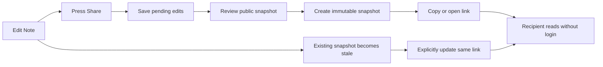

# Note sharing

> Status: proposed MVP  
> Audience: product, design, gateway, Notes, Share, Web UI, and security maintainers  
> Last updated: 2026-08-31

## Summary

xopc should let a user publish an immutable, read-only snapshot of a Note through the existing Share capability. A recipient opens a link without signing in and can read the title, Markdown body, and explicitly included attachments. The owner retains the existing Share controls for expiration, maximum views, reachability, extension, and revocation.

The first release is publishing, not collaboration. It does not add shared editing, comments, accounts, or automatic synchronization. A Note edit never changes an existing public snapshot unless the owner explicitly updates that share.

## Problem

Notes currently support durable text, images, audio, files, AI breakdown, and continued discussion, but the user cannot directly deliver the resulting content to another person. The current file Share flow accepts only workspace files and directories. A user must therefore copy content, take screenshots, or manually export a Note into a workspace file before sharing it.

That gap breaks the intended product loop:

```text
Capture → organize → understand → produce a useful result → share it
```

It is also a model mismatch. A Note is stored in SQLite, its attachments live in the xopc state directory, and its Markdown contains canonical `xopc-attachment://` references. Pretending that it is an ordinary workspace Markdown file would lose identity, attachment behavior, privacy boundaries, and lifecycle semantics.

## Product decision

A Note share is a first-class Share target with these properties:

- it is a frozen snapshot created from one Note version;
- it is read-only and accessible without xopc authentication;
- it includes only public presentation fields and user-confirmed attachments;
- it remains stable when the source Note is edited;
- it can be explicitly refreshed from the same source Note while preserving the link;
- it uses the same TTL, maximum-view, reachability, audit, and revocation controls as file sharing;
- deleting the source Note revokes its active shares by default.

The snapshot is independently retained until it expires or is revoked. Its public rendering never reads the current Note row, so a later edit cannot leak into an existing share.

## Goals

- Let a user share a readable Note in no more than two explicit actions.
- Make the exact public content inspectable before the link is created.
- Preserve rich Note content, including referenced images, audio, video, and files.
- Keep external access time-bounded, revocable, auditable, and compatible with local/LAN/public reachability.
- Prevent Note history, AI metadata, project relationships, sessions, tags, capture provenance, and unreferenced attachments from leaking.
- Make stale snapshots visible to the owner and deliberately refreshable.
- Reuse the current Share management and policy surfaces rather than creating a second sharing product.

## Non-goals

- Collaborative or public editing.
- Comments, reactions, mentions, or recipient identities.
- xopc account login for recipients.
- Per-recipient ACLs or email invitations.
- Automatically publishing every Note update.
- Public indexing, discovery, or profiles.
- Sharing AI breakdown internals, linked conversations, project context, history, or source provenance.
- Password-protected links in the MVP.
- Analytics beyond bounded view counts and operational audit events.

## Primary jobs

The first release should optimize for:

- sending meeting notes or a discussion summary to participants;
- sharing a proposal, research summary, checklist, or plan;
- sending a mixed-media Note to a friend or colleague;
- publishing the result of an AI-assisted Note breakdown;
- opening the same Note on an unmanaged device without granting gateway access.

## Experience principles

1. **Share what the user can see.** Referenced content is eligible; internal metadata is not.
2. **Make disclosure explicit.** The confirmation shows the snapshot version, attachments, reachability, expiry, and view limit.
3. **Freeze by default.** Later private edits never become public implicitly.
4. **Keep the recipient experience simple.** Opening the link goes to the Note, not a file-download landing page.
5. **Keep control with the owner.** Every link is visible in both the Note and the central Shares manager.
6. **Prefer revocation on destructive actions.** Deleting a Note should not leave a forgotten public copy online by surprise.

## End-to-end journey



### Create a share

The Note header adds a **Share** action. Pressing it first flushes pending title and Markdown edits, then opens a fixed-size confirmation dialog.

The dialog contains:

- public title and a bounded body preview;
- the source version timestamp;
- an attachment checklist;
- a plain-language statement of excluded private data;
- expiry and maximum-view controls using current Share defaults;
- description, if desired;
- effective reachability: public, LAN, or local only;
- the primary **Create share link** action.

Default attachment selection is conservative:

- attachments referenced by the canonical Markdown are included;
- unreferenced attachments are excluded;
- retained source audio, transcripts, and structured Note artifacts are excluded unless they appear as visible Markdown references;
- missing or unsupported attachments block creation with an actionable list instead of silently disappearing.

On success, the dialog changes in place to show the public and LAN URLs supported by the current gateway configuration, Copy, Open, and Done actions.

### Open a shared Note

The recipient sees:

- the Note title;
- creation or snapshot time, not private capture provenance;
- sanitized Markdown;
- inline images and playable audio/video where safe;
- explicit download controls for other attachments;
- the optional public description;
- a small “Shared via xopc” footer and expiry information.

The page has no gateway-token prompt, owner navigation, editing controls, AI actions, project links, tags, history, or related sessions. It uses `noindex` and does not load third-party analytics.

### Manage and refresh

The Note share dialog lists active links for that Note. Each row shows status, snapshot time, views, expiry, Copy, Open, Update snapshot, Extend, and Revoke.

When `note.updatedAt` is newer than the share's `sourceVersion`, the row shows **Older shared version**. **Update snapshot** performs another content review and replaces the snapshot behind the same token only after confirmation. Existing expiry, view limit, and accumulated view count remain unchanged.

Creating a separate link remains available for a different audience or policy. Multiple active links for one Note are valid.

### Delete the source Note

If active Note shares exist, delete confirmation states how many public links will be affected. **Revoke active shares and delete** is the default. An advanced secondary action may keep snapshots until their existing expiry, but the API default is revocation.

## Scope by phase

### MVP

- Note detail Share action and confirmation.
- Immutable snapshot containing title, Markdown, and referenced attachments.
- Public read-only rendering.
- Existing TTL, view-limit, reachability, extend, revoke, and Shares manager support.
- Active-link list and stale-version state in the Note dialog.
- Explicit same-link snapshot update.
- Automatic revocation on Note deletion by default.
- Audit events, rate limiting, security headers, and cleanup.

### Follow-up

- Export/download as Markdown or PDF.
- Optional inclusion of selected unreferenced attachments.
- Password protection.
- Link-level branding or cover image.
- Owner-visible aggregate referrer-free analytics.
- Explicit live-follow mode, only if research shows that manual refresh is insufficient.

## Public data contract

Only the following values may enter a Note share snapshot:

```ts
interface NoteShareManifest {
  schemaVersion: 1;
  shareId: string;
  source: {
    noteId: string;
    noteVersion: number; // source note.updatedAt at snapshot time
  };
  title: string;
  markdown: string;
  snapshotAt: string;
  attachments: Array<{
    id: string;
    type: 'image' | 'video' | 'audio' | 'file';
    mimeType: string;
    fileName: string;
    size: number;
    artifactFileName: string;
    duration?: number;
  }>;
}
```

It must not contain `tags`, `status`, `capturedVia`, `ai`, `aiDeep`, `taskMeta`, `groupId`, `lastOpenedAt`, attachment transcripts, local filesystem paths, session keys, project links, Note history, or gateway credentials.

The snapshot keeps canonical attachment IDs internally, but the public renderer rewrites them only to token-scoped public asset endpoints. Arbitrary local and workspace paths are never resolved for a Note share.

## Technical architecture

### Share record model

Refactor `ShareRecord` into a discriminated union while preserving current file and directory behavior:

```ts
type ShareKind = 'file' | 'directory' | 'note';

interface ShareRecordBase {
  id: string;
  token: string;
  kind: ShareKind;
  displayName: string;
  createdAt: string;
  expiresAt: string;
  maxViews: number | null;
  accessCount: number; // migrated from the version-1 `downloadCount`
  revoked: boolean;
  createdByTokenHash: string;
  description?: string;
}

interface NoteShareRecord extends ShareRecordBase {
  kind: 'note';
  source: {
    noteId: string;
    noteVersion: number;
  };
  artifactRelativePath: string;
  artifactSize: number;
  attachmentCount: number;
  snapshotRevision: number;
}
```

File and directory variants retain their current workspace-root, absolute-path, inode, MIME, and directory fields. Target-specific functions accept narrowed variants so path validation can never be called with a Note record.

The current `shares.json` store moves from version 1 to version 2. The loader normalizes version-1 file and directory rows in memory, including `downloadCount` to the target-neutral `accessCount`, and persists version 2 on the next mutation. Existing authenticated API responses continue exposing `downloadCount` for file/directory compatibility and add `viewCount` for Notes. Tokens and active links remain unchanged. No Note content is stored in `shares.json`.

### Snapshot artifacts

Snapshot content is stored under the state directory:

```text
~/.xopc/share-artifacts/<share-id>/
  manifest.json
  assets/
    <attachment-id>
```

Creation is transactional at the filesystem level:

1. load the canonical Note from `NotesService`;
2. verify `expectedNoteVersion` when supplied;
3. parse canonical Markdown and resolve the selected attachment IDs;
4. enforce Note-share body, attachment-count, per-file, and total-size limits;
5. create a private temporary directory beside `share-artifacts`;
6. copy bytes, compute size and checksum, and write the minimal manifest;
7. atomically rename the temporary directory to `<share-id>`;
8. persist the Share record and audit event;
9. remove the artifact if record persistence fails.

Refresh builds a complete replacement directory and atomically swaps it into place. The record's `snapshotRevision` and `source.noteVersion` change only after the new artifact is durable. Provider calls are not involved.

Revocation first persists the denied state, then immediately removes snapshot bytes with idempotent cleanup. Source-Note deletion uses the same path. Expired artifacts are removed by the periodic cleanup lifecycle as soon as expiry is observed; an expired Note share whose artifact has been removed cannot be extended and must be recreated. The bounded Share record can remain for audit and management without retaining Note content.

### Service boundaries

Add a `NoteShareService` under `src/share/` responsible for:

- public-field projection from `Note` to `NoteShareManifest`;
- attachment selection and canonical-reference rewriting;
- snapshot creation, refresh, and cleanup;
- Note-to-share lookup;
- source deletion behavior.

`NotesService` remains the source of canonical Note reads and attachment resolution. `ShareStore` remains the authority for tokens, policy, counters, expiry, reachability, and revocation. Routes coordinate the two services; the Web client never sends public-ready Markdown as the authority.

### API

Authenticated endpoints:

| Method | Route | Purpose |
|---|---|---|
| `GET` | `/api/notes/:id/shares` | List Share records whose source is this Note |
| `POST` | `/api/notes/:id/shares` | Create a Note snapshot share |
| `POST` | `/api/notes/:id/shares/:shareId/refresh` | Explicitly replace the snapshot behind the same token |
| `DELETE` | `/api/shares/:id` | Revoke any Share kind through the existing endpoint |
| `PATCH` | `/api/shares/:id` | Extend expiry or update view limit through the existing endpoint |
| `DELETE` | `/api/notes/:id` | Accept `revokeShares`, defaulting to `true` |

Create request:

```json
{
  "expectedNoteVersion": 1788144000000,
  "attachmentIds": ["attachment-uuid"],
  "ttlMs": 86400000,
  "maxViews": 20,
  "description": "Meeting summary"
}
```

Create response uses the current Share link response shape and adds:

```json
{
  "ok": true,
  "payload": {
    "id": "share-uuid",
    "kind": "note",
    "shareUrl": "https://example/s/token",
    "lanUrl": null,
    "reachability": "public",
    "expiresAt": "2026-09-01T00:00:00.000Z",
    "maxViews": 20,
    "sourceNoteId": "note-uuid",
    "sourceVersion": 1788144000000,
    "snapshotRevision": 1,
    "attachmentCount": 1
  }
}
```

If `expectedNoteVersion` does not match the server Note, creation or refresh returns `409 note_version_conflict` with the current version. The UI reloads the preview and asks the user to confirm again. This prevents a background edit or delayed autosave from changing the reviewed disclosure.

Public endpoints:

| Method | Route | Purpose |
|---|---|---|
| `GET` | `/s/:token` | Server shell, OG metadata, expiry state; does not consume a view |
| `POST` | `/s/:token/view` | Claim one bounded Note view and return sanitized presentation data plus an asset ticket |
| `GET` | `/s/:token/assets/:attachmentId` | Serve one snapshotted asset with a valid short-lived asset ticket |
| `GET` | `/s/:token/meta` | Extend existing metadata response for `kind: note`; does not consume a view |
| `HEAD` | `/s/:token` | Existing availability check |

The `/s/:token` Note shell redirects a browser into the existing public `/#/share/:token` route or bootstraps that view without exposing the gateway-token gate. Crawlers can read bounded Open Graph metadata without consuming a view.

`POST /view` is used so unfurl bots and prefetchers do not spend a limited view. A successful call increments the Note's presented `viewCount` once and returns a short-lived, share-scoped asset ticket. Asset requests do not increment views. The ticket binds `shareId`, `snapshotRevision`, and expiry, and is signed with a private random per-record secret that is never returned. Every asset request still checks current expiry and revocation state. This lets a page finish loading after it has consumed the last permitted view without allowing a new viewer to bypass the limit or a revoked share to keep serving assets.

### Web UI changes

`NoteDetailPanel` needs an explicit `flushPendingSave()` path shared by title and Markdown debouncers. The Share action awaits that flush, reloads the server Note, and opens the confirmation against the returned `updatedAt`.

Add:

- `NoteShareDialog` in `web/src/features/notes/` for disclosure review and active links;
- Note-share API methods in `notes-api.ts`;
- `kind: 'note'` support in `shares-api.ts` and Shares settings rows;
- a Note renderer mode in `SharePreviewPage`;
- public attachment hydration that uses the returned asset ticket, not authenticated Note media APIs;
- stale-state calculation using `note.updatedAt > sourceVersion`;
- localized Chinese and English copy.

The dialog uses a fixed responsive outer size with a scrolling body. Loading uses skeletons. It reuses `ShareUrlCopyRows` and existing Share option controls.

### Rendering and security

- Render Markdown through the existing sanitized `MarkdownView` boundary; raw HTML stays disabled/sanitized.
- Rewrite only valid canonical references belonging to the source Note and present in the manifest.
- Reject `javascript:`, `data:` HTML payloads, local file URLs, workspace URLs, and references to another Note.
- Serve assets with a MIME allowlist, `X-Content-Type-Options: nosniff`, safe `Content-Disposition`, `Referrer-Policy: no-referrer`, and no-store/private caching where appropriate.
- The public page uses a restrictive CSP, `X-Frame-Options: DENY`, `noindex`, no authenticated API calls, and no third-party requests added by xopc.
- External Markdown links open with `noopener noreferrer`; remote images are either blocked by default or shown only after an explicit recipient action. The MVP should block automatic remote-image loading to avoid recipient IP leakage.
- Reuse the existing public IP rate limiter and per-token concurrency guards.
- Never log Note Markdown, titles beyond bounded previews, attachment contents, the full token, or asset tickets.
- Audit create, refresh, access claim, access denial, extend, revoke, source deletion, and artifact cleanup with `shareId`, `noteId`, revision, bounded counts, and token prefix.

### Limits and configuration

Add a nested Note policy under `gateway.share` with safe defaults:

```ts
note: {
  enabled: true,
  maxMarkdownBytes: 2 * 1024 * 1024,
  maxAttachmentCount: 50,
  maxAttachmentSize: 100 * 1024 * 1024,
  maxTotalSize: 250 * 1024 * 1024,
  assetTicketTtlMs: 10 * 60 * 1000,
  revokeOnSourceDelete: true,
}
```

The global `maxActiveShares`, default/max TTL, and maximum-view rules apply across file, directory, and Note shares. The central policy UI adds a Note sharing toggle and size limits without creating separate TTL semantics.

## Failure behavior

| Failure | User-visible behavior |
|---|---|
| Pending edit cannot save | Do not create the share; keep the Note open and show save failure |
| Note version changed after review | Reload preview and require confirmation |
| Referenced attachment is missing | List the missing attachment and block creation/refresh |
| Public gateway is unreachable | Create only after showing LAN/local reachability, consistent with current Share behavior |
| Artifact copy fails | No Share record or link is created; temporary bytes are removed |
| Refresh fails | Existing snapshot and token continue working unchanged |
| Source Note is later edited | Existing link remains valid and is marked stale for the owner |
| Source Note is deleted | Active links are revoked by default; public access returns the existing revoked page |
| Gateway restarts | Share records and artifacts remain valid; issued short-lived asset tickets may be reissued through a new allowed view only if not persisted |

Asset tickets should be stateless signatures or use a durable signing secret so a gateway restart does not break a page already loading.

## Events and metrics

Emit bounded product events without Note content:

- `note.share_dialog_opened`
- `note.share_created`
- `note.share_opened`
- `note.share_snapshot_refreshed`
- `note.share_revoked`
- `note.share_create_failed` with a stable reason code

Measure:

- share-dialog open to successful-link conversion;
- shares created per active Note user;
- percentage of Note shares opened at least once;
- refresh and revoke rates;
- creation failure reasons;
- Note copy/export behavior before and after release;
- seven-day return rate for users who share Notes versus those who only capture them.

Success is not total public views. The product signal is that users can turn a private capture into a controlled external result without leaving the Note workflow.

## Acceptance criteria

1. A just-edited Note shares the exact saved title and Markdown reviewed in the dialog.
2. An unauthenticated recipient can read the snapshot and its included attachments.
3. Editing the source Note does not change the existing snapshot.
4. Refreshing a snapshot preserves the token and policy but atomically changes the public revision.
5. No private Note fields appear in the manifest, public APIs, HTML, logs, or Open Graph metadata.
6. Unreferenced attachments are excluded by default, and missing referenced attachments cannot be silently omitted.
7. Expired, revoked, maximum-view, deleted-source, and not-found states are distinguishable and safe.
8. A final permitted view can load every attachment through its short-lived ticket; a new view cannot be claimed afterward.
9. Deleting a Note revokes its active shares by default and reports the number revoked.
10. Existing file, directory, and site share links continue to work without token changes.

## Verification plan

Backend tests:

- version-1 to version-2 Share store compatibility;
- public-field projection and forbidden-field absence;
- referenced attachment selection and cross-Note reference rejection;
- atomic create/refresh rollback;
- expiry, maximum views, revoke, source deletion, and cleanup;
- asset-ticket signature, revision, expiry, and traversal resistance;
- public route rate limiting and security headers;
- existing file/directory Share regressions.

Web tests:

- pending-save flush before confirmation;
- stale-version indicator and `409` recovery;
- attachment review defaults;
- successful creation, copy, open, refresh, extend, and revoke;
- public Markdown and media rendering without gateway authentication;
- expired and maximum-view states;
- Chinese and English copy.

Required repository checks once implemented:

```bash
pnpm vitest run src/share/__tests__
pnpm vitest run src/gateway/hono/routes/__tests__/notes-routes.test.ts
pnpm run typecheck
pnpm --dir web run type-check
pnpm --dir web run lint
pnpm --dir web run build
```

## Delivery sequence

1. Generalize Share records and migrate `shares.json` without changing existing behavior.
2. Add artifact storage, Note snapshot projection, limits, cleanup, and tests.
3. Add authenticated create/list/refresh flows and Note deletion integration.
4. Add public view claim, asset ticket, Note rendering, and security tests.
5. Add Note detail and Shares manager UI, including forced save and stale state.
6. Instrument bounded events, run regression tests, and release behind `gateway.share.note.enabled`.

The feature can be enabled by default after file/directory compatibility, public-field leakage, max-view media loading, and source deletion behavior have passed acceptance testing.
