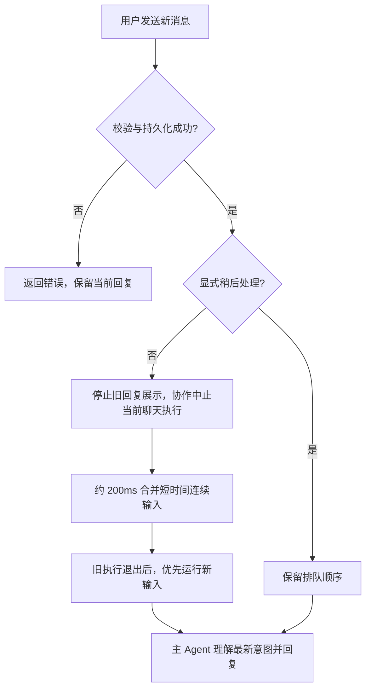
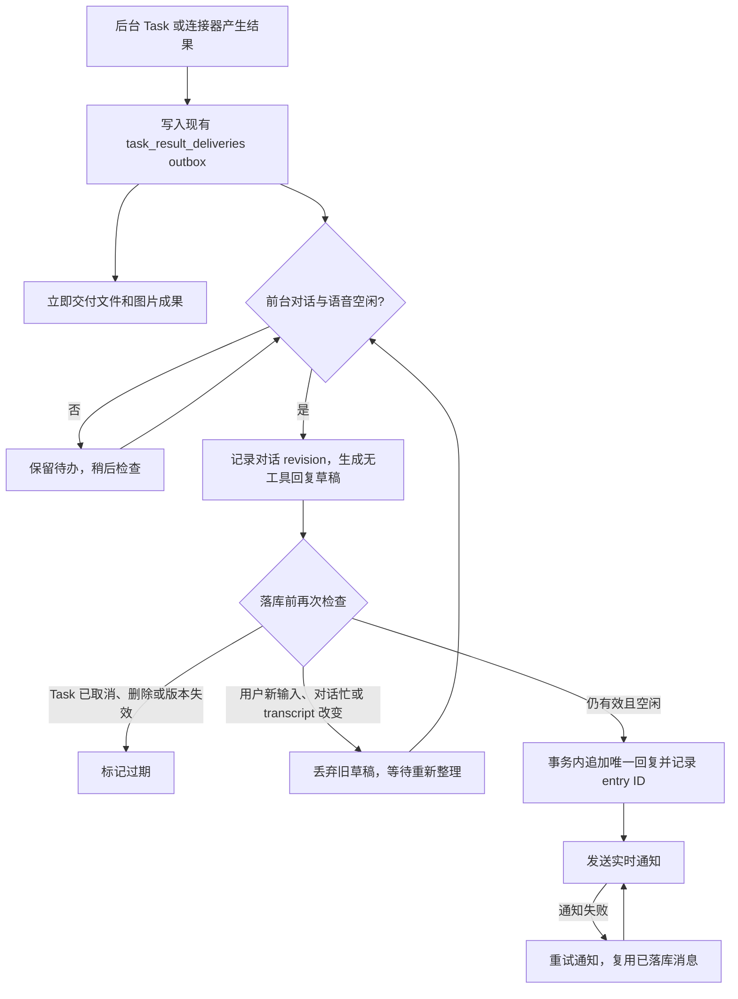

# Personal AI 对话优先与 outbox 交付

已实现：Personal AI 的新用户输入默认优先处理。消息先完成上下文校验并持久化，然后停止旧回复展示、请求中止当前聊天执行，等执行退出后使用保留的历史接住新消息。这个过程不是撤销已发生的工具操作，也不会隐式取消独立 Task。新的主 Agent 回合判断用户是在补充、换话题还是要求取消任务。

附件和引用上下文也可以打断，但不会与相邻纯文字合并。合并仅适用于相同来源、相同配置与 transcript、500ms 内的相邻纯文字；每条原始输入仍分别持久化。普通 Agent 保留现有排队与 steer 行为。API 的 append command 使用可选 `interrupt: false` 表达延后；显式 `delivery: steer` 配合这个字段保留协作注入行为。

对话 revision 由持久输入状态变化及确认的语音输入推进。生成前和写入前都检查 revision、前台运行、待处理输入与语音状态，避免在用户说话时插入后台总结；在接收输入但尚未落库的窗口，也通过运行时标记阻止交付。语音 VAD 本身不会写入新输入 revision，最终确认的语音才会推进它。

未发布草稿失效不增加失败重试次数。后台结果仍保留，空闲后按新上下文重写；已经发布的文字属于历史，通知失败只补发同一个消息身份，不重新生成、不重复执行任务。Task 需要确认、失败后决策等更新继续走主 Agent 的既有更新路径。

SQLite v235 为原有 `session_inputs` 增加 `interrupt_requested`，为现有 outbox 增加 `reply_context_revision`；没有增加 reply job 表或独立调度队列。

验证覆盖输入幂等、无效输入不打断、明确延后、附件优先、连续文本合并、网页停止旧回复展示、前台与语音忙时延后交付、生成时新输入使草稿失效，以及通知重试复用消息。真实模型表达质量和多端设备体验仍需要单独评测。
