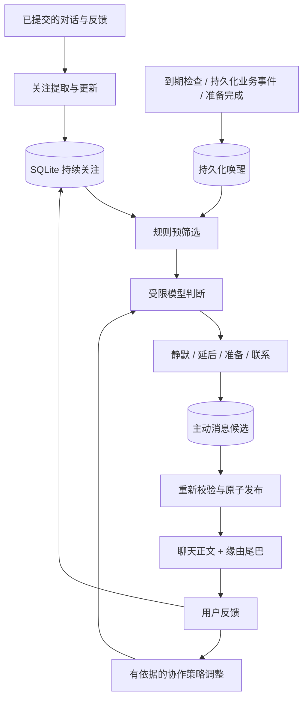

# Personal Agent 主动参与与成长技术方案

状态：首版已实现，后续阶段见文末。日期：2026-10-09。

首版实现以本地 Personal conversation 为投递目标：持久化关注与证据、增量用户输入提取、时间/关联业务事件唤醒、受限判断与资料整理、原子发布与同步恢复、缘由尾巴、明确反馈及局部准备策略。模型每日调用额度与单次输出上限控制后台资源；local-only 用户理解策略下不进行后台模型处理。外部渠道通知、长期兴趣发现、隐式策略实验，以及主动创建长期准备 Task 尚未启用；这些属于后续阶段，不改变现有明确委托的 Task 交付机制。

## 1. 目标与范围

让 Personal Agent 持续关注用户在意的事情和未结束的讨论，在授权范围内做准备，经过价值与时机判断后主动交流，并通过真实反馈改善协作策略。主动消息气泡下方显示一行轻量缘由，点击后查看依据及调整跟进。第一版不增加独立成长中心或关注管理页面。

第一版支持明确跟进、延续有充分上下文的讨论、已获授权的准备结果；长期兴趣发现后续扩展。用户不活跃是时机信号，不作为独立联系理由。Gateway 离线时本地后台工作暂停，恢复后合并检查，不逐次补发。

## 2. 现有实现依据与复用边界

已核对以下代码，方案适配当前工作区，未修改这些实现：

| 现有模块 | 已有能力 | 接入方式 |
| --- | --- | --- |
| `src/personal-agent/repository.ts`、`service.ts` | Personal Agent 身份、长期 conversation、资料与回应偏好 | 使用真实 record 的 ownerId、agentId、conversationId，不通过名称猜测身份 |
| `src/personal-agent/conversation-state.ts` | 前台运行与排队检查、对话 revision | 生成前与发布事务内均检查，结合 Gateway runner 与语音状态 |
| `src/personal-agent/reply-composer.ts` | 任务结果编排、lease、草稿失效、事务发布与通知重试 | 复用其模式，抽取必要的发布校验；不让普通讨论伪装成 Task |
| `src/automations/service/automation-service.ts` | 持久化时间调度、事件队列、运行恢复 | 增加一个系统级轻量 tick；明确用户创建的自动化维持原语义 |
| `src/user-context/relationship-continuity.ts` | 明确跟进请求的初步记录 | 将现有证据与断言关联到关注项；其时间识别是有限规则，不等于完整日期解析 |
| `src/user-context/`、`src/user-model/` | 访问、来源、有效期、用户理解 | 继续作为用户事实、偏好的权威来源，不复制一个新用户模型 |
| `src/session/client-history.ts`、`session-context-for-llm.ts` | 存储行到客户端与模型上下文的转换 | 为主动消息增加显式转换，不依赖未知 customType 的默认行为 |
| `src/personal-agent/unread.ts` | Personal conversation 未读快照 | 增加主动消息类型，沿用 transcriptId 与 seq 的已读语义 |

当前 TaskResultDelivery 协议要求 taskId、taskRunId 等字段，因此新增主动讨论协议。明确委托的 Task 结果继续由现有 outbox 发布，可增加同一种缘由元数据，禁止同时生成第二条主动消息。

当前回应偏好已经有 proactivity 字段，它表达现有回应行为。新增后台联系设置使用独立结构，避免改变这个字段的原有含义。

## 3. 总体链路



模型提议关注、准备计划、交流内容和下次检查时间；宿主决定状态变化、权限、调度、发送预算及提交。模型不直接修改 SQLite，不直接调用消息发送接口。

## 4. 数据模型

所有运行状态写入现有 xopc SQLite 数据库，迁移编号在实施时按最新版本分配。下列新表是逻辑设计，字段通过 Zod 与数据库约束共同验证。

### 4.1 personal_attention_threads：持续关注

- `id, owner_id, agent_id, conversation_id`：稳定身份与作用范围。
- `kind`：outcome / discussion / interest。
- `status`：candidate / active / paused / completed / expired。
- `origin_authority`：user_explicit / inferred；推断不能升级为委托。
- `subject, summary, progress_json`：主题、有限摘要及阶段进展。
- `goal_ref, project_ref, task_ref`：可选关联现有对象，不复制其权威状态。
- `next_check_at, pause_until, expires_at, last_meaningful_at`：调度与有效期。
- `revision, created_at, updated_at`：乐观并发控制。

索引至少覆盖 `(owner_id, agent_id, status, next_check_at)`。关注重要性与事实置信度分别表示，不用一个分数混合。

candidate 可短期保留但不能发送。明确跟进可成为 active；推断关注仅在用户已开启相应主动模式、来源可用且证据足够时进入 active，仍保留 inferred 标记。active 不代表任何工具或外部动作授权。

### 4.2 personal_attention_sources：关注依据

- `thread_id, evidence_id`：关联现有 context evidence。
- 可选 `conversation_id, transcript_id, entry_id` 或业务对象与版本引用。
- `relation`：introduced / supports / corrects / ends。
- 来源类型、观察时间和内容指纹。

原始内容由既有来源存储负责。尽量不新增全文副本。来源稳定身份去重；同一消息的重复提取不增加证据数量。读取时重新检查权限、删除与有效期。

### 4.3 personal_wakeups：可恢复唤醒

- `id, owner_id, agent_id, thread_id, trigger_kind, source_event_id`。
- `dedupe_key, not_before, expires_at`。
- `status`：pending / evaluating / done / cancelled / dead_letter。
- `lease_token, lease_until, attempts, next_attempt_at, last_error`。
- `thread_revision, created_at, updated_at`。

dedupe_key 唯一。时间唤醒使用关注 id、revision 和计划时间；事件唤醒使用稳定 eventId、关注 id 和处理版本。相邻变化可合并，但业务事件原记录保留可追溯性。

### 4.4 personal_outreach：判断记录、草稿与聊天发布 outbox

- `id, wakeup_id, thread_id, conversation_id, origin_transcript_id`。
- `decision`：silent / defer / prepare / contact；`reason_code` 保存简短判断。
- `state`：pending / generating / decided / awaiting_preparation / ready / published / stale / cancelled / dead_letter。
- `evidence_refs_json, thread_revision, context_revision, policy_revision`：判断快照。
- `draft_text, provenance_json, prepared_result_ref`：正文、缘由快照和准备成果引用。
- `content_fingerprint, valid_until, publish_after`：去重、有效期与发布时机。
- `message_entry_id, lease_token, lease_until, attempts, next_attempt_at`：幂等发布及恢复。
- `model_ref, prompt_version, usage_json, created_at, published_at`：成本与审计。

silent/defer 以 decided 结束，也保留有限判断记录，但不会进入可见 transcript；prepare 进入 awaiting_preparation，由真实准备结果触发下一次判断。提交判断、修改 next_check_at 和完成 wakeup 同事务执行，全部校验 lease token 与关注 revision。一个唤醒处理版本只产生一个判断；新证据通过新的唤醒处理。草稿上下文失效不计入失败重试。

第一版发送到 Personal conversation。外部渠道扩展时，每个目的地增加独立持久化 receipt，并使用 deliveryId 幂等键，不混合聊天发布与外部送达状态。

### 4.5 personal_feedback：反馈事实

- `id, owner_id, agent_id, outreach_id, thread_id, source_entry_id`。
- `kind`：helpful / irrelevant / stop / defer / adjust。
- `scope`：message / thread / topic / global；默认选择用户表达支持的最小范围。
- `authority`：explicit / observed；`payload_json, created_at, dedupe_key`。

没有回复不生成 irrelevant。打开说明不等于认可。用户只说“今天别提醒”，只能更新本次延后或短期节奏。

### 4.6 personal_adaptive_strategies：可撤销的协作方法

- `owner_id, agent_id, scope, dimension, value_json`。
- `status`：proposed / trial / active / retired。
- `authority, evidence_refs_json, revision, review_at, supersedes_id`。
- dimension 限定为准备深度、合并方式、联系时机等低风险协作方法。

明确用户偏好仍写入既有用户理解或 Agent preference；此表只保存有范围的策略实验与历史，不再复制同一个偏好。禁止保存或修改工具授权、接收人、隐私设置和产品基本原则。继承顺序：当前明确指令 → 已保存明确偏好 → 可用的局部策略 → 产品默认。

## 5. 关注提取与准备

在真实用户输入与对应回复提交后，按稳定 entryId 入队增量处理；不在前台回复关键路径调用第二次模型，不定期全历史重写。临时对话、禁止记忆和当前访问策略按既有规则处理。

首版使用已提交 user entry 的持久化 seq 游标进行增量发现。首次接入只读取最近 30 天中最新 12 条可用用户消息，随后按游标推进，不把多年历史当成新关注。只有聊天空闲时处理，避免让历史输入阻塞当前回复。

从有限近期对话与现有关注摘要提取结构化变化。每条候选必须引用实际用户来源；AI 自己的建议、主动消息和反思不能冒充用户证据。只有用户认可或补充的部分可形成新的 owner evidence。

提取器只提出 create/update/pause/end，宿主验证引用、范围、日期及 revision 后提交。时间存为 UTC 时间戳，表达按用户时区渲染；“下周”“有空”等不确定时间不能被解释成用户明确约定的精准提醒。

首次实现仅使用已有资料及结果进行无工具整理。需要搜索或工具准备时，建立关联到关注项的正常 Task，记录真实任务授权与结果引用；持续关注本身不授权 recurring work、外部发送或扩大访问范围。明确委托的结果不因主动模式关闭而被丢弃。

## 6. 调度与事件

### 6.1 时间触发

在现有 Automation system action 增加 `personal.proactivity.tick`，由一个 system-managed automation 周期运行。建议初始周期 60 秒，可配置；它只做有限 SQL 查询、到期去重入队与启动 drain，不直接运行模型。到期精度是 tick 加实际排队时间，不承诺即时执行。

实现需同步扩展 domain/types、validation、system action 路由和 system-managed automation reconciliation。任务摘要与运行事件保持 quiet，不把每次 tick 变成产品通知。空队列不调用模型。

Gateway 启动时恢复过期 lease，合并离线期间的到期事项，并重新判断有效性。过期内容直接失效，不按错过的 tick 次数补发。用户设置的明确日程继续走既有自动化，不复制第二个提醒。

### 6.2 事件触发

复用持久化业务事件身份，首期仅接入已有关注相关的 Task / Project 变化与准备完成。过滤目标范围、处理权限和关注状态，不广播所有事件给模型。

优先在业务写入事务中保存事件或 wakeup；无法共事务的生产者使用持久化事件与消费游标恢复。首版在已有持久化事件 projection 中入队 wakeup，入队提交后才由既有 dispatcher 确认事件；崩溃重放按 eventId 去重。不使用仅靠内存监听器的送达承诺，也不新增每分钟全表扫历史。

Task 结果如果已有现有 Personal reply delivery，使用该路径；新事件只更新关注状态及安排后续，不再发送同一成果。

## 7. 判断、预算与防打扰

先用确定性代码排除：非 active 关注、来源不可用、已暂停/过期、主动模式关闭、候选过期、无新增信息、近期同类重复、预算不足。

模型输入包含有限关注摘要、真实新证据、近期互动和可用协作偏好。严格输出 decision、引用 id、简短价值理由、建议时间及可选草稿。不存在的引用、未知 action 或越界时间由宿主拒绝。模型分数只辅助排序，不自行证明价值。

宿主再次验证内容有新成果、影响判断的变化、相关新观点或必要问题。使用事件版本、结果引用和内容指纹去重；避免只按正文 hash，因为改写并不产生新价值。

默认非紧急主动消息不在静默时段发布。聊天候选可继续准备，外部通知单独判断。建议初始 unsolicited chat 上限为每日 2 条、同关注项 24 小时 1 条，作为可调实验参数；明确约定提醒和请求结果不受该软上限丢弃，仍执行去重与用户约定。后台模型单独配置日 token/cost 上限、单次超时和全局并发，日界按用户时区计算。

不能用高回复率取代价值判断，也不通过增强亲密感诱导回应。

## 8. 并发、发布与失败恢复

处理顺序：短事务 claim lease → 事务外模型调用/工作执行 → 保存草稿 → 短事务重新校验并发布。

发布事务校验：lease ownership、关注 revision、policy revision、来源有效性、当前 transcriptId、context revision、过期时间、聊天空闲、去重和发送预算。Gateway 同时校验 runner 输入、生成和语音状态，复用现有 Personal conversation 前台优先机制。

用户新输入或策略变化使草稿失效，按新上下文重写；关注暂停/停止使未发消息取消。会话 reset 取消旧 transcript 候选，不自动投递到新 transcript；仍有效的关注可以随后重新评估。删除关注来源或访问权限变化会让候选失效，不能仅凭旧快照发送。

可见 transcript append、message_entry_id 记录和预算占用同一 SQLite 事务提交。已 published 的记录不重新生成；重试只使用同一消息身份触发同步或通知。发布事件是刷新信号，客户端重连后仍从 SQLite 读到原消息。

聊天持久化可实现单次可见发布；外部渠道通常只能保证持久化重试，只有接收方支持幂等键时才能避免所有重复。未知外部送达状态不重新执行准备任务。

## 9. 消息协议与模型上下文

在 `packages/gateway-contract/src/personal-proactivity.ts` 新增 Zod schemas 与版本化类型：

```ts
type PersonalProactiveMessage = {
  version: 1;
  outreachId: string;
  threadId: string;
  conversationId: string;
  originTranscriptId: string;
  text: string;
  provenance: {
    reasonKind: 'follow_up' | 'discussion' | 'change' | 'prepared';
    authority: 'user_explicit' | 'inferred';
  };
  createdAt: number;
};
```

正文与 metadata 分离。使用 `customType: personal_proactive_message` 作为版本化 transcript delivery 行，客户端显式映射为 assistant 消息，固定 message identity 为 outreachId / entryId，startsNewBubble 为 true，不与前一回复合并。

`buildSessionContextForLlm` 显式把正文转换为已说出的 assistant 历史，保证用户回答“第二个方案不错”时 AI 能理解。缘由、预算、策略实验和内部判断不作为用户指令注入。未经用户确认的草稿与内部静默判断不进入聊天历史。

同一新增类型同步覆盖 display projection、client-history 白名单、Web normalization、未读统计、导出与回放。现有 Task result 可增加可选 provenanceRef，但仍保留其任务结果协议和原投递路径。

成长提取与压缩摘要也必须保留 AI 主动表达的来源身份，不将 assistant 建议压缩为用户目标或用户已确认事实。

## 10. 小尾巴与 API

Web Message 新增可选 `personalProvenance`，仅携带 outreachId、reasonKind、authority 与安全的短主题。完整说明按需读取，历史 API 不附带原始来源全文。

新增 UI 文件建议：

- `web/src/features/chat/messages/personal-provenance-tail.tsx`。
- `web/src/features/personal-agent/personal-provenance-panel.tsx`。

气泡外下方，小图标 + `text-fg-muted` 小字 + 轻箭头，整个区域是可键盘操作的 button。默认一行，例如“延续上次的产品讨论 ›”；移动端必要时省略主题。仅主动来源消息显示。

点击后按需加载说明；桌面浮层、手机底部面板。内容为关注依据、现在联系的原因、后续安排，以及“调整跟进”“停止关注”。加载用 skeleton；详细面板外层使用固定响应式尺寸、内部滚动，关闭恢复触发位置。普通用户不需要进入新页面。

拟新增接口：

| 方法与路径 | 用途 |
| --- | --- |
| `GET /api/personal-agent/outreach/:outreachId/provenance` | 读取已发布消息的缘由、当前关注状态与可访问来源链接 |
| `POST /api/personal-agent/outreach/:outreachId/feedback` | 幂等记录本次反馈与明确作用范围 |
| `PATCH /api/personal-agent/attention/:threadId` | revision 条件下暂停、结束或修改跟进时间 |
| `GET/PATCH /api/personal-agent/proactivity` | 主动模式、静默时间及通知偏好 |

鉴权沿用 Personal route 的 owner / 受准移动设备原则，但接口必须校验 outreach、thread、conversation 同属该 principal；ownerId 不接受客户端传入。来源跳转重新执行 session/project 等源权限检查。来源删除后显示“原始依据已不可用”，并清除不可再披露的摘要，不承诺删除已送出的历史正文。

设置保存为一个权威结构化对象，例如 mode、quietHours、timezone、chatEnabled、notificationChannels、revision。由既有配置/偏好存储体系承载，禁止同时写独立 JSON 文件。proactivity mode 只限制 unsolicited 行为，不静默丢弃明确请求结果。

“调整跟进”默认聚焦聊天输入，不自动发送用户消息。需要精确关联时提交 attachment-free 的受控 feedback target 元数据，宿主核验消息与关注归属。含糊的自然语言反馈先局部处理；涉及全局策略或未知指代时澄清，不自行扩大范围。

新增路由同步更新 `lazy-bundles.ts` 与映射测试，并通过真实鉴权 Gateway 请求验证可达性。

## 11. 成长与文件布局

不新增第二套人格或用户理解文件。SOUL.md 保留稳定身份；现有 Agent preferences、用户理解存储保留明确偏好；本方案表保存持续关注、经验和低风险协作实验。GROWTH.md 不作为运行依据，未来如需展示则按需生成可读摘要。

学习过程是 evidence → scoped proposal → trial/application → review/retire。明确指令立即生效；隐式信号仅调整有限排序或短期时机，不自动创建启用的 collaboration rule。用户不回复不代表拒绝；回忆或重复读取不提高置信度；一次积极反馈不提高授权范围。

新增逻辑建议放在：

```text
src/personal-agent/proactivity/
  types.ts
  attention-repository.ts
  attention-service.ts
  wakeup-repository.ts
  scheduler.ts
  decision-service.ts
  preparation-service.ts
  outreach-repository.ts
  outreach-service.ts
  provenance-service.ts
  feedback-service.ts
  adaptation-service.ts
  settings.ts
```

这些文件是实施时的建议拆分，可按实际复杂度合并。Gateway 负责 start/stop、事件接入与依赖注入，业务判断留在 Personal 模块。长准备交给既有 Task 执行，不新造任务引擎。

## 12. 可观测性与验证

日志使用 createLogger，记录 owner/agent/thread/wakeup/outreach/conversation 的必要身份、phase、reasonCode、revision、时延、模型和成本；不记录完整私密来源。相同失败不逐轮重复 warn。审计保留静默、延后、重复抑制与预算阻止原因。

统计分别记录：唤醒次数、模型调用、准备结果、聊天发布、通知提交与渠道回执、明确反馈、策略修正。聊天入库不算用户已读，渠道回执不算用户认可。点击率、回复率用于诊断，不作为主要优化目标。

必需验证场景：

1. 空队列不调用模型；到期检查与重复业务事件只入队一次。
2. 同主题改写不能绕过去重；明确请求成果不被软预算丢弃。
3. 并发 drain、进程崩溃与 lease 恢复不重复生成可见消息。
4. 生成中用户发言、语音进行、reset、停止关注和权限变化阻止旧草稿发布。
5. 发布成功但 realtime/通知失败，恢复后重发信号，不重跑任务或 append 第二条消息。
6. 刷新、重连、未读、导出、历史合并及后续模型上下文均识别同一消息。
7. 点击尾巴能回到真实来源；猜测被标记为 inferred；无权或已删除的来源不会泄露。
8. 自然语言和面板反馈作用范围一致，重复反馈幂等；“今天别提醒”不变成永久停止。
9. 学习不把 AI 自己的话当用户证据、不自动扩权、不覆盖更高优先级明确偏好。
10. 静默时段跨午夜、时区变化和夏令时；离线恢复不补发消息洪水。

## 13. 实施阶段

1. **可靠消息与缘由**：协议、provenance API、历史/上下文/未读、轻尾巴、反馈，以及发布恢复测试。现有请求成果可使用真实来源适配尾巴。
2. **明确跟进闭环**：关注与来源、时间调度、唤醒、规则判断、受限模型生成、预算与前台优先，打通延期和停止。
3. **主动讨论与准备**：增量提取、事件关联、明确授权 Task 准备，扩展相关性与新观点质量评测。
4. **策略成长**：先支持明确反馈，随后才启用有审计、可撤销的低风险实验。长期兴趣与外部通知独立验收后扩展。

每个阶段先通过可靠性验收，再评估真实内容的相关性、增量价值、打扰程度和反馈后行为变化。未接入运行链路前不宣称已经持续关注或后台准备。

## 首版验证结果

2026-10-09：15 个相关测试文件、212 项测试通过；后端 typecheck、新增运行代码 lint、Web 构建和 Node 构建通过。测试包含真实鉴权 HTTP 与 lazy bundle 路径、消息历史及上下文、来源快照、去重、前台竞争、lease 恢复、预算暂停恢复、业务事件重放、明确反馈与聊天模式设置。真实模型的长期内容质量尚需实际使用评估。

### 静默兴趣与策略版本（schema 237）

兴趣复用 `personal_attention_threads(kind=interest)` 与 user-only 来源。准入要求不同表达、跨本地日期，重复文本剥离时间前缀后去重；显式跟进不参与兴趣推断。提取在每次新输入的既有模型调用中附带有限的近期用户证据，所有提案必须引用至少一条新输入。候选不设 `next_check_at`，禁止通过普通状态更新激活或延后；明确委托可通过 follow 转为显式关注。来源权限失效后不再返回候选证据。

`personal_strategy_versions` 追加保存 topic feedback 的 before/after 快照、来源、revision、幂等键及回滚关联。准备偏好保持 30 天 review 时限。先读取新版本；已有无版本的策略可继续读取旧表，回滚到空偏好不会错误地恢复旧表值。所有变更复用 thread revision，取消旧唤醒和草稿；模型生成期间的回滚也阻止旧决策发布。

`POST /api/personal-agent/attention/:threadId/strategy/rollback` 要求最新版本 ID、当前 thread revision 和幂等键。跨 owner、过时版本、来源失效及过期事项不能回滚。旧快照恢复为用户显式的新版本，历史保留。消息级反馈仅记录反应，持久策略变更必须是 thread scope。小尾巴详情返回当前 preparation 与最近五个版本，按需加载，不注入每轮聊天。
