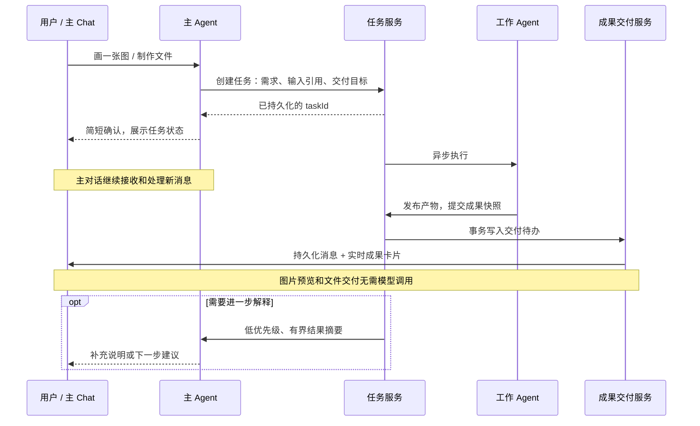

# Personal AI：快速主对话与后台成果交付方案

日期：2026-10-08。状态：首期成果交付链路已实施，设备界面验收待完成。

## 实施记录

已接入版本化成果契约、工作回合成果快照、完成事务 outbox、独立主 Chat 消息、历史恢复和实时通知。图片与已发布文件无需模型调用，也不等待主 Agent 空闲。Personal AI 最终文字由一次无工具回复整理生成，与附件共用交付 outbox，独立保存草稿和重试进度。Web、Android、iOS、HarmonyOS 已接入后台成果事件；Web 图片使用对话内预览，原生端复用附件展示。

通过自动化测试验证主 Agent 忙时交付、文字报告交付、多回合成果、重启恢复、通知失败重试去重、重新分配、取消、删除、reset、真实带鉴权 Gateway 历史读取与图片访问隔离。已完成 TypeScript 类型检查、Android 编译、iOS 模型测试和鸿蒙 HAP 构建。

首期边界：单个媒体最多 50 MiB；一个交付最多 50 个成果，正文最多 8,000 字符。当前按 sourceFileId/artifactId 汇总已发布成果，不含交付版本更新协议；执行方应只发布需要交付的最终文件。大视频流式读取、专用缩略图、任务卡更新/新成果提示、成果选择与版本管理、交付手动重试入口、配额隔离及 p95 基准验收仍为后续工作。构建与协议测试不代替四端真实设备的预览、下载和持续聊天体验验收。

## 1. 产品目标与结论

Personal AI 主 Agent 负责理解用户、组织任务、回答问题和解释结果；绘图、文档制作、研究、代码修改等耗时工作交给具备对应能力的执行 Agent。用户始终留在主 Chat，后台任务完成后，图片和文件直接出现在该对话中。

核心约束：**执行耗时不能占用主对话；图片与文件交付不能依赖主 Agent 再调用一次模型。** Personal AI 最终文字说明现在通过独立的无工具回复整理调用生成；失败时使用记录结果兜底，详见 [统一回复整理](./personal-agent-reply-synthesis.md)。

“代理出去”是内部执行机制。用户无需切换 Agent、打开任务页面或复制文件路径才能拿到结果。任务详情作为可选入口保留。

## 2. 当前实现与缺口

以下结论来自仓库代码：

| 现有能力 | 位置 | 本次需要补齐的部分 |
| --- | --- | --- |
| 主 Agent 用 `personal_task` 委派任务 | `src/personal-agent/policy.ts`、`src/agent/tools/personal-task-tool.ts` | 保持主 Agent 的工具范围小，执行工具由工作 Agent 使用 |
| 绘图返回持久化媒体和结构化 artifacts | `src/agent/tools/image-generate-tool.ts` | 将工作 Agent 的产物关联到发起请求的主 Chat |
| 普通成果文件发布 | `src/agent/tools/publish-artifacts.ts` | 文件制作任务必须有发布和交付环节，不能仅回复磁盘路径 |
| 统一产物类型与能力 | `packages/gateway-contract/src/turn-outcome.ts` | 复用 `TurnOutcomeDeliverable`，增加跨任务交付关系 |
| TaskRun 捕获回合结果 | `src/tasks/task-run-coordinator.ts` | `captureOutcome` 当前只提取 check evidence，需要保留成果快照 |
| 任务更新通知主 Agent | `src/tasks/task-main-update-delivery.ts`、`src/gateway/service.ts` | 当前等待主 Agent 可用，可能经过通知判断模型，再提交主 Agent 回合；成果交付需要独立通道 |
| SQLite 对话历史与媒体关联 | `src/storage/sqlite/transcript-repository.ts` | 增加明确归属的交付记录，支持历史读取和实时同步 |

另外，现有任务通知提示要求主 Agent 用 `xopc_use` 读任务，但默认主 Agent 工具列表没有该工具。实施时应改为已有 `personal_task` 的读取/回答能力，或提供有界的结构化任务上下文。

## 3. 三条执行通道

### 主对话通道

主 Agent 完成需求理解、必要的能力查询和一次任务创建后即可结束当前回合。任务确认必须在持久化成功后发出，避免告诉用户“已开始”却没有真实任务。

任务 brief 应包含目标、验收条件、用户输入附件引用及必要上下文；不复制整个主对话，也不要求工作 Agent 再反复询问主 Agent。能力列表可缓存，并在配置变化时失效；提交前仍需校验 Agent 是否启用、工具和模型是否可用。

简单问答、偏好修改、已有上下文查询继续由主 Agent 处理。明确需要成果或明显耗时的工作默认委派。绘图始终调用实际绘图能力，主对话模型与绘图模型分别配置。

### 后台执行通道

工作 Agent 使用独立 run、执行上下文和取消信号，不持有主对话的长生命周期运行锁。它负责工具执行、必要验证、文件发布和最终结果提交。

限制每个用户和执行 Agent 的并发，队列有界；前台用户回合优先于自动总结。单纯异步化不足以保证速度，还应隔离长工具执行、模型配额和本地 CPU/内存压力，避免后台任务耗尽主对话所需资源。

### 成果交付通道

Gateway 根据已验证的结构化成果引用生成主 Chat 的结果卡片。该通道独立于模型调度、主 Agent 空闲判断和语音会话是否活跃。

用户明确请求的成果必须交付；`final_only`、低主动性偏好只能影响过程通知，不能静默丢弃最终图片或文件。通知判断模型可继续用于非必要的主动提醒。

## 4. 统一成果契约与存储

复用现有 `TurnOutcomeDeliverable` 的 `artifactId`、`sourceFileId`、`kind`、`availability`、`capabilities`、`uri` 等字段，以及现有媒体/文件存储；不另建一套图片专用存储。

新增版本化 `TaskResultDelivery` 契约，建议包含：

| 字段 | 用途 |
| --- | --- |
| `deliveryId`、`version`、`revision` | 稳定交付身份、协议版本和单调更新版本 |
| `taskId`、`taskRunId`、`assignmentEpoch` | 执行来源及过期执行防护 |
| `conversationId`、`requestInputId`、`originTranscriptId` | 主 Chat、原始请求与发起时的历史归属 |
| `outcomeId` | 指向工作回合真实成果快照，不伪造主 Agent 的 run/turn 身份 |
| `status`、`summary`、`deliverables` | 完成/部分完成/失败、简短说明和统一成果列表 |
| `createdAt`、`deliveredAt`、`messageEntryId` | 审计、延迟统计和精确消息关联 |

工作回合的完整结果单独保存；面向主 Chat 的投影只包含用户需要的摘要、成果和状态。产物原始字节、base64、日志和大型 diff 不进入主 Agent 上下文或实时消息。

建议增加成果快照/交付表及 outbox 表，在 `TaskApplicationService.completeRun` 的事务边界内写入最终状态和交付待办。支持任务跨多个回合积累成果，最终按明确选中的成果集合发布；不能只取最后一个回合，也不能把中间测试图片当最终成果。

文件落盘与数据库事务无法原子提交，应先发布不可变成果快照并校验可读性，再引用该快照完成数据库事务。未被引用的残留成果延迟清理；已有交付引用的文件应受保留策略保护。发生清理、过期或文件丢失时展示明确状态，不保持失效的下载按钮。

## 5. 可靠交付流程

1. 工作 Agent 发布文件，获得真实 artifact 引用。图片生成工具已有发布能力；文件制作工具通过 `publish_artifacts` 发布。
2. 服务端检查成果来源、当前任务归属、可读性及用户访问权限。生成成功、验证通过、用户接受是不同状态，文案不能混淆。
3. 完成事务保存成果快照和 outbox。`succeeded` 的判断应认可有效结构化成果，避免只有图片、没有长文本时被误判为空结果。
4. 交付服务以 `deliveryId` 为唯一键，写入专属主 Chat 交付消息。不得把成果附加到“最新 assistant 消息”，否则可能污染另一段正在生成的回答。
5. 数据库持久化成功后发布实时事件。客户端按 ID 和 revision 去重、更新；断线后从历史恢复。服务端“已交付”表示消息已持久化，不表示用户已看到。
6. 失败采用有限重试和退避。重启后继续处理 outbox；持久化后、推送前崩溃也不重复生成消息。永久错误记录可诊断原因并提供重试入口。

采用至少一次处理、唯一键防重复，实现用户可见的一次交付。不要通过重新执行绘图来重试消息投递。

主 Chat 交付消息需要有明确的系统来源元数据，并沿用 transcript 更新、索引、历史 API 和实时投影管线；不能使用 `SessionStore.save` 重写历史。与正在进行的回合追加安全串行化，只等待短数据库写入，不等待整个模型回合结束。交付元数据不直接作为任意 assistant/toolResult 塞入模型输入，下一次回合只获得经过过滤的简短成果说明和引用。

## 6. 主 Chat 展示体验

用户发送“画一张海边落日”，主 Chat 的表现：

- 主 Agent 简短确认；同一请求下显示“正在绘图”的轻量任务卡。
- 绘图时用户可以继续聊天，输入框和主对话保持可用。
- 完成后出现图片缩略预览、简短说明及查看原图/下载操作，任务卡更新为已完成。
- 多张图归为一个成果组；后续版本保留原图，不静默覆盖。
- 点击任务状态才展开执行详情，默认不展示工作日志。

| 产物 | 默认展示 |
| --- | --- |
| 图片 | 对话内缩略预览，点击查看原图，支持下载 |
| PDF、文档、表格、演示文稿 | 文件卡：标题、类型、大小；有真实预览能力时提供预览，否则下载/打开 |
| 音频、视频 | 封面或播放器，用户主动播放；不自动发声 |
| 网站 | 已验证的访问入口与摘要，具有截图时展示缩略图 |
| 代码成果 | 简短变更和验证状态，提供 diff/PR/文件入口 |
| 未识别格式 | 通用文件卡，保留下载能力 |

Web、Android、iOS、HarmonyOS 使用相同契约，各端复用已有附件/成果渲染能力，支持历史恢复、预览、下载、部分失败与版本更新。Personal AI 隐藏执行日志的逻辑不能同时隐藏成果卡。

展示 URL 通过现有 Gateway 鉴权与资源解析生成，不泄漏本地路径，不把临时签名 URL 当永久存储身份。预览内容按类型校验；网页/HTML 预览使用受限容器。

用户正在阅读旧消息时不强制滚动，出现“新成果”提示；处于底部时正常跟随。语音会话期间图片仍立即进入 Chat，语音播报按既有交互时机安排，不能因等待语音窗口而延迟视觉交付。

## 7. 后续修改与边界场景

用户说“把这张图改成夜景”，新任务携带选中成果的 artifact 引用、版本和修改要求。优先复用仍可用的原执行 Agent；引用旧成果的不可变快照。多张成果且指代不清时才询问用户。

| 场景 | 处理规则 |
| --- | --- |
| 主 Agent 正在回复另一条消息 | 成果独立展示，不打断回复、不插入当前模型输入队列 |
| 多个任务同时完成 | 各自按任务和原请求归属展示，不串图、不混入同一成果组 |
| 部分产物成功 | 立即展示成功成果，标明失败部分，可单独重试 |
| 用户取消任务 | 停止执行；已有成果可标为部分完成，迟到结果不得冒充正常成功 |
| 执行 Agent 被重新分配 | 用 assignment epoch 拦截旧执行者的迟到最终交付 |
| 主对话 reset | 保持 conversationId，在新的活动 transcript 展示并标明原任务；不写入归档 transcript |
| 对话已删除 | 不重建对话；关闭该目标的投递，保留任务侧可查询的结果状态 |
| 客户端离线 | 成果照常持久化，重新连接读取历史；推送不是唯一交付渠道 |
| 无可用绘图/制作能力 | 给出具体配置入口和缺失能力，不宣称已开始执行 |
| 文件超出大小上限 | 明确错误；当前工具媒体上限为 50 MiB，大视频需另行支持流式发布和读取 |

## 8. 响应速度与观测

以下是实施后的验收目标，需通过基准测试确认，并非当前性能承诺：

| 指标 | 初始目标与测量方式 |
| --- | --- |
| 用户输入后本地确认 | 健康连接下 UI 立即进入发送/任务确认状态，目标 150 ms 内 |
| 任务创建持久化 | 本地 Gateway、不含模型和排队等待，p95 ≤ 300 ms |
| 首次语义回应 | 记录输入接受至首个有效文本的耗时；受模型影响，重点比较委派前后是否退化 |
| 成果入主 Chat | 从成果发布完成、完成事务可提交开始，到主 Chat 持久化并推送，健康连接下 p95 ≤ 1 s；主 Agent 忙时同样验收 |
| 成果交付模型调用数 | 必要交付为 0 次；解释性总结单独统计 |

记录输入接受、任务创建、执行开始、产物可用、交付消息持久化和实时发送时间。客户端另外记录事件接收与首次预览渲染时间，区分服务端延迟、网络延迟和大图加载。

首期用确定性完成摘要即可，例如“图片已生成”“已完成 2 个文件，1 个失败”。复杂研究结论可由工作 Agent 提供摘要；需要主 Agent 综合用户上下文时，再调度一次低优先级解释，并关联原交付，避免重复展示成果。

## 9. 实施顺序

### 第一阶段：绘图完整闭环

- 扩展共享契约、TaskRun 成果捕获和 SQLite 迁移，接入完成事务/outbox。
- 实现独立成果交付服务及 transcript/history/realtime 投影。
- 修正任务通知的工具提示，避免成果与现有结果通知重复；问题、失败等需要推理的更新保留原协调能力。
- Web 与三端原生接入同一成果契约，完成图片预览、下载和历史恢复。
- 对“画图后继续聊天”和“主 Agent 忙时收到图片”进行真实链路验收。跨端一致通过后交付该阶段。

### 第二阶段：通用文件与编辑迭代

接入 PDF、文档、表格、演示文件及音频，支持部分成功、修改已有成果、任务取消、保留策略和清理。具备成果能力的工具必须返回统一结构化引用。

### 第三阶段：大产物与复杂协作

补充大视频流式上传/读取、缩略图生成与多步骤成果汇总。按实际性能数据调整并发和配额，不先增加主 Agent 的工具负担。

如需要新增鉴权 API，必须同步 `src/gateway/hono/routes/lazy-bundles.ts` 的路由匹配、映射测试，并验证真实 Gateway 的鉴权访问。优先复用现有历史和资源访问接口。

## 10. 必须通过的验收

1. 主 Agent 不具备绘图工具时，可以正确委派；产物生成后无需再次调用主模型即可出现在主 Chat。
2. 图片生成期间连续发送消息，主对话正常响应；后台结果不抢占或中断当前回复。
3. 重复回调、断线、Gateway 重启、持久化后推送前崩溃，不丢成果、不重复消息、不重复付费生成。
4. 多任务、多图、多回合成果正确归属；旧 assignment、取消和删除场景不产生错误成功消息。
5. reset 后结果可在当前主 Chat 获取；历史重开和跨端登录后仍可预览。
6. 图片/文件权限、失效资源、部分失败和超过大小上限有明确可操作状态。
7. Web、Android、iOS、HarmonyOS 都通过真实鉴权 Gateway 的发送、实时接收、历史恢复、预览和下载测试。
8. 统计首响应与成果交付 p95，并证明必要成果交付没有通知判断或主 Agent 模型调用。

最终验收以“用户在主 Chat 拿到可用成果”为准。TaskRun 结束、工作 Agent 回复了文本或 outbox 已入队，都不足以单独证明交付完成。
