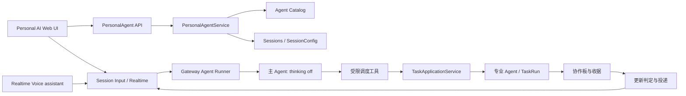

# xopc Personal AI V1 技术方案

> 状态：核心链路已实现，持续责任与语音并发交互待续 · 2026-10-07
>
> 对应产品方案：[personal-agent-v1.md](./personal-agent-v1.md)
> 首发：本地 Gateway + Web/桌面界面；不假设独立云电脑或移动端常驻服务。

当前代码已落地：单例身份与固定会话、主会话服务端强制 `thinking=off`、受限任务委托与显式表达偏好、个人初始化与角色形象、任务活动入口，以及复用现有助手语音。持续责任调度、个人音色选择、通话中同时输入文字、通话摘要与更细的偏好来源记录仍属于后续阶段；本文件以下章节包含这些目标设计，不代表都已上线。

## 1. 核心决策

| 决策 | 实现要求 |
|---|---|
| 体验优先级 | 主会话首先服务于“符合这个用户偏好的情绪体验”；任务派发与速度提供可靠基础。回答口吻由用户明确偏好和当下语境决定，不使用全用户统一的可爱模板。 |
| 一个 Personal AI | 一个持久 Agent Catalog 实体；V1 每个本地所有者仅有一个。名称、外观、声音可变，身份 ID 不随重命名变化。 |
| 一个主会话 | 一个持久 `conversationId` 和连续的用户时间线；后台工作使用独立 TaskRun 会话。个人会话跳过普通聊天的闲置重置。 |
| 快速响应 | 主会话的每次运行都由服务端强制 `thinkingLevel='off'`，使用可关闭 thinking 的模型和很窄的工具集；深度推理由执行 Agent 承担。 |
| 拟人化 | 人格、语气、称呼、外观与语音可配置；动态表情由真实交互状态驱动。表现可以有温度，事实和行动状态必须准确。 |
| 权限 | 连接器、设备访问、任务授权、对外行动分别校验；主 Agent 不能因一句提示词获得额外能力。 |
| 持续责任 | 用一等责任记录关联现有 Task、Automation/Scene；调度沿用已有引擎，避免新建第二套 scheduler。 |

## 2. 现有代码基础与缺口

| 层 | 可复用 | 主要缺口 |
|---|---|---|
| Agent | `src/agent/starter-agents.ts` 的 Conductor；`src/agent-catalog/service.ts` 的可恢复 provisioning；Agent 资料与头像 API | 单例身份与个人入口绑定；更窄的工具协议；人格配置 UI |
| 会话 | `src/storage/sqlite/conversation-repository.ts`、`src/session/store.ts`、输入队列和压缩 | 独立于普通新聊天/闲置重置；服务端强制 `off`；固定身份映射 |
| 任务 | `src/tasks/task-application-service.ts`、`task-origin-repository.ts`、协作板、TaskRun、主更新回传 | 个人责任索引；更清楚的状态/产出 API；通知策略与任务生命周期同步 |
| 语音 | `src/voice/realtime/agentBroker.ts`、`agentEngine.ts`、通话 UI | 固定绑定个人会话；通话与文字协调；通话摘要及任务归属 |
| 记忆 | `userContext`、User Model、知识记忆、会话压缩、当前交互状态 | 明确偏好和推断的可编辑视图；个人表达档案的版本与来源 |
| 前端 | `web/src/app.tsx`、Chat、Task Detail、OnboardingDialog、头像与 Desktop Pet 基础 | 新入口、向导、个人主会话外壳、面板、状态形象 |

委派任务的内容分为三层：`title` 是短名称（建议不超过 60 字符），`contract.objective` 是一句话的目标，`body` 是完整 Markdown 任务说明。主 Agent 派发时应分别填写；旧式长 `objective` 会自动收纳到 `body`，以免需求丢失。TaskRun 的执行上下文同时读取目标与说明，任务详情页按 Markdown 展示说明。无需新表或数据迁移。

注意：现有 `xopc_use` 一个工具覆盖 Agent、项目、Automation、Notes、Task 等大量读写命令。只在 Agent 的 `toolAllowlist` 中保留 `xopc_use` 不能实现“主 Agent 只有少量能力”；必须在工具调用和服务端能力层按具体操作收窄。

## 3. 模块边界

`src/personal-agent/` 只保留必要的编排、查询和策略模块，不复制 Session、Task 或 Agent Catalog 的业务逻辑。Gateway Route 负责鉴权与输入验证；技能与工具可用性由现有 Agent 配置决定，不在工具工厂按个人会话身份再覆盖一遍。个人会话身份只用于固定会话生命周期、专属工具的归属校验及产品入口约束。Web UI 放在 `web/src/features/personal-agent/`，页面路由由 `web/src/app.tsx` 接入。

## 4. 数据模型与初始化

### 复用现有存储

个人身份、名称、形象、回应偏好及 revision 使用现有 `agents` 目录和 `profile`；创建状态使用 Agent Catalog 的 provisioning 状态。唯一主会话使用现有 `sessions`，以 `customData.personalAgent` 标记，并由本地所有者的稳定 Agent ID 定位。Agent 的 `models.chat.primary` 和 `runtime.thinkingLevel` 是主会话的模型偏好，thinking 初始为 `off`。读取会话配置时同步到 `session_config`，修正旧的固定模型快照；通过会话设置修改模型与 thinking 时，在同一事务中更新 Agent 和会话配置。不新增个人 Agent 身份表，也不复制一份权威偏好。长期责任继续复用现有 Task 与 Automation；推断性偏好及来源复用 User Model。

### 幂等创建状态机

`POST /api/personal-agent` 使用本地所有者确定稳定 Agent ID 和会话 UUID：

1. 查询稳定 Agent ID；已就绪的身份与主会话直接返回。Agent Catalog 的主键约束防止重复身份。
2. 调用 `AgentCatalogService.create`，使用 Conductor 风格预设建立专属 Agent；若 provision 中途失败，使用 Catalog 现有错误状态并允许重试。
3. 创建固定 UUID 的主会话，`agentId` 指向该专属 Agent；设置 `session_config.model_override`、`thinking_level='off'`、`fixed_model=1`。每一步检查既有记录后续做，防止重试产生副本。
4. 默认回应偏好保存在 Agent profile，主会话配置完成后视为可用。首次欢迎消息通过持久幂等事件插入/发送一次，刷新页面不重复出现。

Catalog provisioning 涉及文件系统，因此无法和 SQLite 创建放在同一个事务内；复用 Catalog 的恢复能力，并以稳定 ID 重试缺失的会话或配置，不静默创建另一个 Agent。

## 5. 固定主会话与 `thinking=off`

### 固定身份

`GET /api/personal-agent` 返回唯一 `conversationId`，前端路由如 `#/personal` 始终解析到该 ID，不通过标题或最近会话猜测。主会话由 `sessions.customData.personalAgent` 标记，避免向所有 SessionType 加新枚举。普通 `/chat/new`、`/new` 与闲置重置不得作用于它；显式重建必须经过独立管理流程。现有会话压缩可继续运行，完整原始时间线留在 SQLite。

重点核对 `src/session/resolve-session.ts` 的 freshness/reset 路径，以及 Gateway 的 reset/delete API。无论入口来自 Web、语音或内部投递，都不能生成新的个人主 transcript。允许压缩摘要，但不以“截断/另开会话”解决长历史。

### 服务端模型约束

`src/providers/model-thinking.ts` 可提供模型的 thinking 能力。Personal AI 选择模型时必须满足 `getModelThinking(model).options.includes('off')`；推荐从已配置的快速模型中选，fallback 列表也逐项验证。若无兼容模型，初始化停在模型选择，不假装已关闭思考。

个人 Agent 的 thinking 默认关闭，用户可在 Web 资料设置和 Android、iOS、鸿蒙的对话设置中调整模型与 thinking。设置值按模型能力校验；有运行或待处理输入时禁止修改，配置版本冲突时要求刷新。TaskRun 仍使用专业 Agent 自己的模型与 thinking 配置。

推理关闭只是必要条件。首包速度还受模型、提示长度、上下文检索和工具往返影响：主 Agent 只带简短人格/协作档案、近期对话摘要、活跃责任和少量相关记忆；工具结果有大小上限；任务创建先落持久状态再异步派发。性能预算以真实 P50/P95 测量确定，不把尚未测得的毫秒值写成承诺。

## 6. 主 Agent 的最小工具与派发

建议不给专属主 Agent 直接暴露泛化 `xopc_use`、shell、浏览器、文件写入或整个连接器工具集。增加少量窄工具，内部仍调用既有服务：

| 工具 | 允许操作 | 服务端限制 |
|---|---|---|
| `personal_task` | `agents/create/list/get/instruct` | 列出可用 Agent 及关键工具；只操作与当前个人会话关联的 Task；创建必须有任务契约、授权范围与幂等键；executor 由可用 Agent 列表校验 |
| `personal_recall` | 查询当前用户的已授权记忆、会话和活跃责任 | 有范围、条数与时间限制；敏感数据按 User Model 策略过滤 |
| `personal_responsibility` | `create/list/update/pause/resume` | 监控来源、触发条件、通知阈值、到期时间必须明确；通过现有 Automation/Scene 创建实际调度 |
| `clarify` | 请求用户决定或补充必要信息 | 将待决定事项落持久状态，不靠聊天文本猜回复 |

工具工厂的 allowlist 只决定工具名；每个新工具还要在实现里检查 `conversationId`、Agent 身份、Task origin 与授权能力。后台执行 Agent 只拿到任务契约和限定的上下文/权限，不直接继承主 Agent 全部记忆与连接器。用户中途改方向时优先更新既有 Task，避免重复创建。

派发协议：主 Agent 按所需能力判断是否委托，而不是按问题长短判断。自己缺少工具、权限、知识或专业判断时，先从 `personal_task(agents)` 查看其他 Agent 的职责和工具；可以按 `requiredTools` 缩小候选，再交给合适的 Agent。即使用户只问一句“今天有什么科技新闻”，也应寻找有 `web_search` 的 Agent，创建带日期、来源和核实要求的 Task。首选 Agent 遇到真实阻塞时，检查其他候选或可行方法；确认无路径后再说明具体卡点，不把主会话的限制误报为整个系统的限制。Task 持久化成功后才说“已交给…”；TaskRun 独立执行；结果进入协作板和收据。任务“运行结束”与“验收通过”是不同状态。主 Agent 需要核对证据再向用户表述；无法核实时用准确措辞。

## 7. 情绪价值和人格的技术表达

### 三层人格

1. **稳定核心**：可靠、机灵、温暖、清楚；可有轻松和幽默，但不编造情绪、能力或经历。写入专属 Agent 的简短结构化指令与 `SOUL.md`。
2. **用户选择的回应方式**：称呼、语气温度、轻松程度、遇到困难时的支持方式、信息密度、主动联系频率、语音语速/音色，存有版本的合作档案并可编辑。回答首先体现这层差异。
3. **当下语境**：用户当前要求、任务紧急度、可能的情绪线索。现有 `src/user-context/interaction-state.ts` 把情绪标为低置信度假设；只在当前回复中谨慎使用，不自动变成永久性格判断。

主会话生成前构造一个**短、确定、有优先级**的 `ResponseStyleContext`：用户本轮明确指令 > 本情境临时偏好 > 明确的长期偏好 > 经过用户确认的推断 > 稳定核心。字段是可操作的表达指令，例如 `addressAs`、`warmth`、`humor`、`supportMode`、`detailLevel`、`proactivity`，附来源和适用范围；不把整份用户档案塞进每次提示。执行结果的事实层与措辞层分开：先生成带来源的 `TaskOutcome`（状态、证据、未验证事项、需用户决定），再由 `thinking=off` 主 Agent 按 `ResponseStyleContext` 表达。改写不能删除关键风险或把建议说成已完成。

偏好更新分三条路径：onboarding 的试读/试听选择直接存为 `explicit`；“以后先说结论”这类明确纠正经确认后更新长期设置，“今天别逗我”只写有期限的情境偏好；模型从重复行为得出的 `inferred` 先形成待确认建议，不直接提升为长期权威。每条更新记录原始依据、作用范围、修订版本和撤销入口。回答反馈（“太冷 / 太肉麻 / 刚刚好”或自然语言纠正）应先影响下一轮，再询问是否保存为默认；不让主 Agent 在后台悄悄改写人格。

口吻生成遵守一条固定顺序：**识别用户此刻需要什么 → 用其偏好的方式接住 → 给出准确事实或下一步 → 适时收住**。情绪线索不确定时不用“你一定很难过”式断言；紧急或高风险任务压低玩笑与装饰。文字和语音可有不同长度，但应保持同一身份感。为防关闭 thinking 后人格提示拖慢响应，运行时只注入当前有效的少数字段和一条简短风格示例；详细推断与档案维护在异步流程中完成。

### 形象与“在场感”

复用 Agent 头像/形象与现有 Desktop Pet 能力作为素材基础；首版提供一组原创、简单、柔和的角色和颜色，并允许选“简洁头像”。不要照搬 dots 的圆环和角色。界面状态由真实事件驱动：`idle`、`listening`、`replying`、`delegating`、`working`、`needs_input`、`celebrating`、`offline`。状态映射由前端事件与任务状态推导，使用短暂微动效；不把模型内部 thinking 暴露为“在思考”，也不显示虚假的持续忙碌。减少动态效果时显示静态状态。

情绪价值来自符合偏好的表达和可靠行动：首次回应让用户看到选择已生效，任务完成时准确说明结果，错误时诚实说明并给出下一步。避免持续跳动、无根据的夸奖和密集的“关心”通知。对用户表达疲惫等线索可简短回应，并允许直接切回工作；不诊断情绪、不声称自己有人的感受或依赖关系。

### 个性质量评估

构建固定情景集：首次见面、用户心情低落但仍要求办事、任务成功/失败、长时间未联系、用户要求减少通知、语音打断、用户纠正称呼。对每个情景设置不同用户偏好，检验**相同事实、不同口吻**，并检查本轮纠正是否从下一句生效。人工评估“是否符合该用户偏好、是否感到被理解、温暖但不油腻、清楚、准确、短、可行动”；同时检查事实遗漏、假装完成、越权与重复打扰。人格变更后对同一情景做回归对比。

## 8. 任务回传与主动消息

沿用 `TaskMainUpdateDelivery` 和 `TaskMainUpdateDecisionService`，增加个人 Agent 的显式通知偏好与确定性前置规则：用户要求只看最终结果时，普通 progress 直接静默；相同 Task 的连续低价值进度合并；等待用户决定和终态结果必须入活动面板。对模糊更新再使用独立的轻量模型判断；这个判定运行不占用主会话，也不能改变主会话 `thinking=off` 配置。

待通知事件先落持久队列，按 `conversationId + taskId + eventSequence` 去重。主会话忙、通话中或用户正在输入时，按优先级延迟；用户问题高于普通进度。最终发布到同一个固定会话，附 Task/证据引用。由主 Agent 生成适合用户的简短表达，详细材料留在活动面板。失败重试不能重复发消息；客户端重新连接从持久状态补齐。

“持续责任”不等于每次扫描都创建一条聊天消息。责任记录关联现有 Automation/Scene；检查触发后生成 Task 或结果事件，再经同一通知管道。暂停个人 Agent 时明确区分“暂停主动消息/主任务”与“停止现有 Task/计划”。

## 9. 语音技术路径

Personal AI 默认选择 `assistant` 模式：STT → `DurableVoiceAgentBroker` → 同一会话输入队列与主 Agent → 流式文本/TTS。它已有真实 Agent 工具和 Task 事件，因此能口头派发任务。`natural`/Omni 的当前上下文明确标明“无工具”，V1 如开放它，应标注仅供自然聊天，不能说“正在替你处理”；产品若要求通话内完整助手能力，先隐藏该模式或在后续开发受控桥接，不靠提示词模拟工具。

文字与通话当前存在会话占用冲突。V1 优先在通话窗口提供文字发送，统一进入 Voice broker 的队列；主输入框在通话期间展示清楚的状态与跳转。第二步改造为同一会话的多模态输入串行器，明确 utterance 顺序、打断语义和去重键。Task 的执行不因通话结束而取消；结束通话写入简短摘要和形成的任务引用。断线重连不重复派发最后一句语音。

## 10. API 与前端切入点

| API（建议） | 用途 |
|---|---|
| `GET /api/personal-agent` | 返回创建状态、身份、固定会话 ID、外观、协作偏好及能力可用性 |
| `POST /api/personal-agent` | 幂等创建/恢复 provisioning，返回当前阶段 |
| `PATCH /api/personal-agent/profile` | 名称、形象和回应偏好；要求 Agent revision |
| `GET /api/personal-agent/activity` | 现有 Task origin 的活动投影 |

现有 `/api/sessions/...` 继续承担消息、历史、输入和语音的实际传输，避免新建第二套聊天协议。连接器和设备授权继续由各自现有 API 管理；个人 API 只汇总其可用状态。所有新认证路径同步更新 `src/gateway/hono/routes/lazy-bundles.ts`，并在映射测试中覆盖正例和邻近非匹配路径，再用运行中的 Gateway 验证真实鉴权路径。

Web 新增 `web/src/features/personal-agent/`：初始化向导、个人会话壳、活动抽屉、形象定制、合作偏好和责任视图。`web/src/app.tsx` 增加稳定 `/personal` 路由；侧栏加入固定入口。复用 Chat 的消息渲染、composer、Realtime 订阅和 Task Detail 导航；避免复制聊天实现。当前全局 `OnboardingDialog` 先处理模型/工作空间，个人向导只在用户点击个人入口后出现，不自动覆盖每个页面。主会话在设置中提供模型与 thinking 控件，展示与普通聊天不同的固定身份和活动入口。

## 11. 实施顺序与验证

### 阶段 1：身份和速度基线

复用 Agent Catalog 与 Session 实现幂等 provisioning、固定会话、`thinking=off` 服务端约束和个人入口。覆盖创建重试、Gateway 重启、模型切换、fallback、会话 reset/delete 拒绝与长历史压缩。测量首字延迟和上下文大小。

### 阶段 2：受限调度与回传

窄工具、Task 契约与 origin 检查、活动投影、通知偏好、收据与证据卡。覆盖同时运行两个任务、用户改方向、Task 失败、重复投递、主会话忙时排队及权限拒绝。

### 阶段 3：人格和首次体验

向导、首次对话、形象状态、合作档案和记忆纠错。覆盖跳过授权、改名、换外观、减少主动消息、即时偏好生效、敏感记忆不自动固化、静态动效模式。

### 阶段 4：语音与持续责任

默认 assistant 语音、通话摘要、通话内文字、责任调度与暂停。覆盖断线、打断、语音重复、任务跨通话延续、设备离线和计划取消。

### 验收门槛

- **主会话 thinking off 率 100%**：所有入口和 fallback 都由后端断言；选不到兼容模型时明确报错。
- 同一所有者的重复创建、刷新、重启都只得到一个 Agent 和一个固定 `conversationId`。
- 主 Agent 没有泛化写工具；对 Task、连接器和设备的每次动作能追溯授权与来源。
- 后台任务不会阻塞主对话；Task 完成、失败与待决定事件最终可见且不重复。
- 主动消息有证据和准确状态；外观与情绪表达不改变权限、不制造虚假工作状态。
- 不同偏好的用户收到可辨认且适合各自的回应；明确纠正从下一轮生效，临时偏好到期失效，推断未经确认不成为长期设定。
- `pnpm` 的目标单测、类型检查与 Web build 通过；新增 API 完成 lazy-bundle 映射和运行 Gateway 的鉴权集成验证。

## 12. 风险与取舍

1. **一个会话与并发输入**：主会话必须串行处理对话轮次，TaskRun 独立并发；系统更新排队，不能抢占用户当下的发言。语音/文字混输需要统一序列与幂等键。
2. **无云常驻**：本地 Gateway 关闭时，定时任务和本机执行不会继续。界面显示“设备离线/等待恢复”，不称“我一直在后台工作”。
3. **模型能力差异**：不是所有模型支持关闭 thinking；宁可要求切换兼容模型，也不能默默启用思考而破坏快速主会话的承诺。
4. **人格一致性**：强风格提示可能与用户临时要求冲突；通过明确优先级、短上下文和场景回归验证。情绪线索只是当下假设，不宜长期记忆化。
5. **工具安全**：现有 Conductor 的 `xopc_use` 过宽；最小工具改造是 V1 前置条件，而非上线后的优化。
