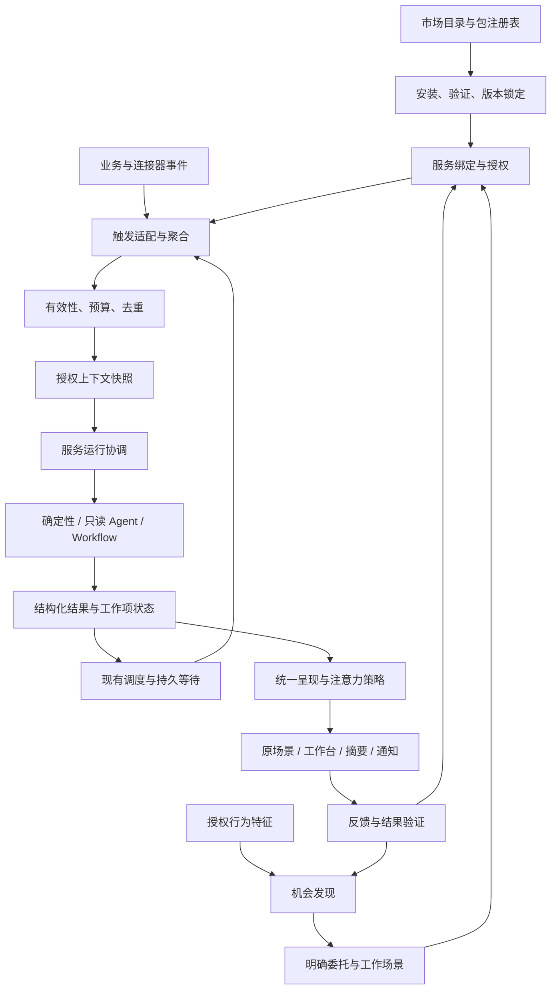

# 主动服务平台：产品、市场与技术方案

> 本文是以“主动服务”为产品对象的历史提案，不再作为实施依据。产品方向以 [场景北极星](./scenes-product-north-star.md) 为准，实施以 [场景技术设计](./scenes-technical-design.md) 为准。本文中的兼容适配、旧入口转发和双轨演进已废止；保留正文仅用于决策追溯。

日期：2026-09-16。状态：设计提案，未实施。

本文以当前工作区实现为基线，设计主动服务的长期产品模型、市场、个性化和技术演进。文中的新增类型、接口和模块均为提案，不代表现有 API。本文延续 [场景优先产品方案](./proactive-scenario-product.md)：帮助首先出现在项目、会议、邮件和对话发生的地方，管理页用于解释和控制。将原方案中固定场景的实现扩展为可分发、可绑定、可评估的主动服务。

## 1. 产品定位与核心决定

**xopc 在用户需要的时刻，利用已经理解和获得授权的上下文，提前完成有用的工作，并以合适的方式交付。**

用户提出的“触发 → 执行 → 呈现”作为平台主干。在三段之间增加明确的判断与治理：

```text
时机到来 → 值得做吗 → 按约定执行 → 得到真实结果 → 值得此刻打扰吗 → 场景内交付
                  ↑                        ↓                           ↓
               用户目标                继续等待／结束                反馈与结果证据
```

决定：

1. 产品对象叫“主动服务”，用户自己的安排叫“已启用服务”；日常仍用“帮我盯住这个项目”等场景语言。
2. 市场分发完整服务包：时机、资料需求、执行方法、交付形式、继续条件和质量说明，而不只是 Prompt。
3. Prompt、Skill 和 Workflow 都是执行资源；Heartbeat 是周期巡查的一种触发模式；Automations 提供计划与执行基础设施。
4. 判断是否执行、判断是否展示、判断是否通知是三个不同决策。没有新变化时可以不运行模型；已经做好材料也可以只安静更新原界面。
5. 由行为发现机会，先在相关场景提供具体帮助；用户接受或已有持续授权时，再形成长期安排。
6. 个性化可以改变关注重点、执行参数和交付时机，不能通过学习扩大数据或动作权限。
7. 先统一契约与控制，再逐步收敛运行底座；每个触发实例只有一个调度所有者，不做大规模一次性重写。

## 2. 长期体验：不逛市场也能获得帮助

### 2.1 三种开始方式

| 开始方式 | 用户体验 | 系统行为 |
|---|---|---|
| 用户明确交代 | “这周帮我盯住发布，影响周五交付再找我” | 匹配已有服务，绑定项目、期限和要求；范围已授权时直接启用并给可撤销回执 |
| 用户主动发现 | 在市场选择“客户会议准备” | 看成果示例、资料要求和成本，绑定自己的账户与范围，试用或启用 |
| 工作中发现机会 | 刚采用一份会议简报后，出现“以后这类会议也这样准备” | 复用这次成功成果的结构，建立窄范围服务；允许忽略、稍后或不再推荐 |

明确委托且没有新增权限时，不再追加一次重复确认。缺少账户、范围或涉及新外部动作时，只补齐缺失信息。

### 2.2 一次完整旅程

用户多次在客户会议前手动整理材料，最近一次采用了助理准备的简报。

1. 助理在该成果下建议：“以后这类客户会议，我可以提前整理往来、项目进度和待确认问题。”显示“为什么推荐”：最近采用的相同类型成果，而不是泛称“根据你的习惯”。
2. 用户选择“以后这样做”。系统优先使用已经授权的日历和明确关联的资料，展示一句承诺：“针对已选客户会议，会前一天准备一页简报；缺关键材料或需要你决定时提醒；不会代你发信。”
3. 下一场会议进入准备窗口，系统确认日历同步正常、会议未取消、资料有变化，再运行准备流程。
4. 简报出现在会议详情和工作台。用户正在应用中时，更新场景入口；需要处理的资料缺口接近行动时限时，再按策略提醒。
5. 用户说“以后少讲背景，多讲商务决策”。系统只调整这个服务的要求，保存版本，可恢复。
6. 会议改期后撤回旧提醒，重新计算准备窗口；取消后结束该会议工作项，不结束所有客户会议准备。

### 2.3 四个界面职责

| 界面 | 核心问题 | 内容 |
|---|---|---|
| 原工作场景 | “此刻你帮我做了什么？” | 项目风险清单、会议简报、邮件草稿；直接采用、修改、继续办理 |
| 工作台 | “现在什么值得我看？” | 按决策时限与价值组织的跨场景成果；合并同一事项 |
| 助理跟进 | “你还替我记着什么？” | 已启用服务、范围、最近帮助、下一次条件、暂停与结束；运行细节二级展开 |
| 发现／服务市场 | “还有什么能替我做？” | 为你推荐、按工作目标发现、依赖可用性、服务详情和试用 |

首页不展示空泛的服务卡墙。没有可交付成果的后台巡查在管理页解释，日常页面只展示与当前工作相关的状态。原“Automations”保留高级安排入口，用户已有明确计划的自动化不被强制改名或转换。

### 2.4 服务详情与启用

服务详情优先显示：能替你完成什么、真实或明确标记的示例结果、何时介入、需要哪些资料、能做哪些动作、何时结束、预计运行频率与成本范围。

按钮随可用性变化：“试做一次”“启用”“连接日历后启用”“需要运行设备在线”。高级配置收起 Prompt、Workflow、重试参数和日志。

试做分两类：样例预览不读取私人数据；真实试做在已授权范围准备真实成果，计入预算，但不注册长期触发、不发送外部消息、不改变业务对象。含写入步骤的服务在试做中返回待执行计划。

启用后的承诺卡必须能回答：关注范围、准备什么、何时找我、允许做什么、继续／结束条件。已存在相同绑定时提出调整现有服务，避免重复安装导致重复跟进。

## 3. 统一领域模型

| 对象 | 职责 | 示例 |
|---|---|---|
| ServicePackage | 可安装、不可变版本的服务定义及资源 | `xopc/meeting-preparation@1.0.0` |
| ServiceInstallation | 工作区安装的确切包版本、来源、完整性与依赖锁定 | 安装官方会议准备包，不等于启用 |
| ServiceBinding | 用户启用实例：负责人、范围、参数、授权、预算和版本 | 只关注某日历内客户类会议 |
| WorkItem | 服务持续跟踪的一件现实事项 | 某一次客户会议；某个邮件线程 |
| TriggerIntent | 有身份和有效窗口的一次检查请求 | 某会议版本的会前 24 小时检查 |
| ServiceRun | 一次执行及其固定上下文、版本与子运行 | 准备该会议的简报 |
| ServiceResult | 执行结果及证据、产物、动作提议、继续条件 | 简报已准备；材料不足；无新变化 |
| PresentationDecision | 展示位置、是否推送、何时投递以及原因 | 更新会议卡，暂不推送 |
| Opportunity | 尚未启用的个性化服务候选 | 依据最近采用的简报推荐持续准备 |

基数：一个安装可有多个绑定；一个绑定可有多个工作项；一个工作项可有多次检查和执行。同一会议改期是工作项的版本变化，不生成另一件“会议”；循环会议的每个发生实例是不同工作项。

当前订阅以“场景＋工作区＋范围”唯一，无法自然表达同一场景下多个不同日历或业务要求。新模型以 `bindingId` 为身份，另用标准化范围和目的生成重复绑定检测指纹；不直接用包 ID 做幂等键。

### 3.1 服务定义的七部分

| 部分 | 必须说明 |
|---|---|
| Job | 服务目标、适用场景、成功条件、避免介入的条件 |
| Trigger | 事件、日程、相对时间、等待条件，合并与过期规则 |
| Context | 来源、范围、数据新鲜度、敏感度、证据需求 |
| Execution | 确定性处理、Prompt／Agent 或 Workflow，能力边界与预算 |
| Result | 结果协议、可用产物、无发现和阻塞的表达 |
| Presentation | 场景内展示、摘要／推送建议、行动截止时间和失效条件 |
| Continuation | 下次等待什么、什么变化重跑、何时完成或终止 |

平台控制权限、预算上限、通知上限和组件安全。包只能提出要求或建议；用户配置只能在有效授权内覆盖允许调整的参数。

## 4. 时机：把“没收到事件”变成可验证条件

| 触发类型 | 示例 | 设计处理 |
|---|---|---|
| 业务事件 | 任务受阻、邮件更新、讨论结束 | 复用持久事件管线，按对象合并、去抖 |
| 绝对／周期时间 | 每周五总结、每两小时巡查 | 复用现有调度计算与持久计划 |
| 对象相对时间 | 会前 24 小时、截止前一天 | 持久化具体到期点；对象版本变化时重新计算 |
| 持续条件 | 任务受阻超过一天 | 记录条件成立时间，到期重新检查，条件解除则取消 |
| 缺失事件 | 发信两天仍未回复 | 显式等待记录＋同步水位；数据陈旧时不得断言“无人回复” |
| 工作时刻 | 用户打开项目或采用成果 | 仅接入已允许的一方产品事件，在原场景准备相关帮助 |
| 手动 | 现在看看 | 同样进入幂等和预算门槛，不绕过暂停与授权 |

每次触发包括 `workItemKey`、来源版本、发生时间、观察时间、`notBefore`、`expiresAt`、`deadlineAt` 和稳定幂等键。事件时间与接收时间分开，迟到事件不能让过期提醒复活。

“用户没有打开”不是独立升级提醒的充分条件。是否再提醒取决于仍未解决的决策、剩余行动时间和用户允许的提醒次数。

第一版只提供受限条件算子和显式等待记录，不引入通用复杂事件语言。第三方包不得通过任意 JavaScript、SQL 或自定义后台轮询定义触发器。

## 5. 执行：让 Prompt 和 Workflow 共享运行契约

执行统一输入：绑定与工作项、触发原因、授权上下文快照、固定服务版本、用户要求版本、能力白名单、模型意图、截止时间和预算。

支持三类执行器：

| 执行器 | 适用 | 约束 |
|---|---|---|
| Deterministic | 计算冲突、整理确定数据、比较版本 | 注册的内部处理器，不调用模型 |
| Prompt／Agent | 需要理解、判断、生成简报或草稿 | 默认只读；仅获得声明且实际授权的工具 |
| Workflow | 多步骤检索、准备、判断和受控执行 | 固定 Workflow 版本；每个节点受同一授权和预算约束 |

Skill 是给执行器的任务知识和资源依赖，不自带调度线程。浏览器自动化作为 Workflow／现有执行服务的受控动作，避免新增另一种常驻服务进程。

短分析可由当前只读执行器运行；长工作交给现有 Workflow／任务运行服务，主动服务保存子运行引用并等待完成事件。不得在持有 SQLite 写事务时调用模型或等待外部执行。

### 5.1 结果不只是一段通知文本

```ts
// Proposed semantic contract; actual schemas must enforce the field constraints below.
type ServiceResult =
  | { kind: 'no_change'; reason: string; continuation?: Continuation }
  | { kind: 'prepared'; artifactRefs: string[]; evidenceRefs: string[]; continuation?: Continuation }
  | { kind: 'insight'; summary: string; evidenceRefs: string[]; continuation?: Continuation }
  | { kind: 'decision_required'; proposalId: string; expiresAt: string }
  | { kind: 'action_receipt'; operationId: string; verification: 'confirmed' | 'unknown'; continuation?: Continuation }
  | { kind: 'blocked'; reason: 'source_stale' | 'authorization' | 'missing_input' | 'budget'; nextStep: string }
  | { kind: 'failed'; errorCode: string; retryable: boolean };

type Continuation =
  | { kind: 'wait_event'; ruleId: string; deadlineAt?: string }
  | { kind: 'recheck_at'; at: string; reason: string }
  | { kind: 'complete'; evidenceRefs: string[] };
```

所有结果还带 `bindingId/workItemId/runId`、来源版本、创建时间与有效期。字段长度、产物数量和引用身份由宿主校验。`Continuation` 只能引用包声明的规则，并受最小间隔、最大次数和服务期限限制；模型不能无限安排自己。

执行状态和工作项状态分开：一次运行成功准备草稿，邮件事项仍在等用户决定；发信接口超时且无法查证时，动作状态为未知，不能报失败后自动重发。运行结束也不等于用户目标完成。

### 5.2 权限分成数据、准备、执行三个轴

- 数据：具体账户、项目、文件夹、字段和处理位置。
- 准备：读取、分析、生成服务自己的产物。
- 执行：向具体业务对象写入或向指定接收方发送。

采用“只观察／准备成果／行动前询问／已授权动作自动执行”的产品表达。外部动作在宿主能力代理中检查，不依赖 Prompt 自律。批准绑定对象、账户、收件人、内容哈希、授权版本和有效期；内容变化后原批准失效。

现有自动化 Agent 的安全提示词不能作为市场包的执行隔离。能力代理、工具白名单和子 Workflow 权限继承完成前，市场仅开放只读准备服务与已有明确约束的内部动作。

## 6. 呈现：准确提醒是一个独立产品能力

### 6.1 三道判断

1. **执行前判断**：有新变化吗？资料够新吗？仍在范围内吗？还来得及吗？预算够吗？
2. **结果有效性判断**：有真实产物或证据吗？已经在别处处理了吗？来源发生变化了吗？
3. **注意力判断**：用户此刻需要处理吗？原场景展示够不够？何时推送才有行动价值？

显式约定“每周五给我一份周报”的服务使用 `deliveryContract: scheduled_deliverable`：即使没有重大变化，也交付真实周报或明确的未完成状态。机会型服务使用 `deliveryContract: changes_only`，无新变化保持安静。不能用同一“价值不足静默”规则吞掉用户明确约定的交付。

### 6.2 呈现决策

| 决策 | 适用 |
|---|---|
| 不展示 | 无变化、重复、失效，仅保存检查记录 |
| 原场景更新 | 普通准备成果，用户就在相关项目／会议中 |
| 工作台呈现 | 有用但不用立即打断的材料或进展 |
| 摘要 | 多个可合并、没有近期行动期限的变化 |
| 延后提醒 | 用户免打扰，延后仍有行动价值 |
| 立即提醒 | 有证据支持、用户能行动、接近真实决策期限 |
| 请求决定 | 展示具体内容和影响，以批准／回答推进 |

结果有效期与最晚可行动时间独立。若免打扰结束晚于行动期限，默认不在到期后补发旧提醒；仅明确允许的紧急服务可突破免打扰。投递时再次读取最新来源和处理状态。

通知调度按用户整体预算协调多个服务。同一会议同时命中“会议准备”“项目风险”时，用对象、问题和所需动作生成跨服务关联，合并提醒但保留不同产物和来源。不同动作不能仅因对象相同而被错误合并。

稳定的事实门槛优先于排序分数。排序参考目标相关性、实际影响、剩余行动时间、新颖性和打断成本；模型自报 confidence 不等于校准后的准确概率，不能独自决定高影响通知。

卡片、通知、对话共享一个结果身份。任意端处理后，撤销未投递提醒。区分排队、供应商接受、设备确认、用户打开；缺少回执不能推断用户没看见并自动跨渠道重发。

### 6.3 全局控制

设置提供两个清楚分开的控制：“暂停后台主动工作”“暂不提醒我”。前者阻止新主动运行及新动作，后者保留已经授权的准备工作、暂停外部提醒。系统维护不冒充用户主动服务。

用户任务中的批准请求和运行失败必须进入可见工作状态；停止推送不隐藏这些状态。全局暂停展示受影响服务，并说明进行中的外部动作是否已确认停止。基础安全／连接告警使用自己的系统通知类别，不消耗普通内容推荐额度，也不能被市场包伪装使用。

## 7. 千人千面：可解释的服务配置与机会发现

### 7.1 个性化发生在五层

| 层 | 个性化内容 | 不允许的变化 |
|---|---|---|
| 服务选择 | 当前目标需要哪些服务 | 因职业标签默认启用一组后台任务 |
| 范围绑定 | 哪些项目、客户、会议类型 | 扩到未授权账户或资料 |
| 执行方法 | 细节深度、术语、关注点、产物结构 | 擅自替换会产生新副作用的流程 |
| 触发时机 | 提前多久、什么变化值得再看 | 超过用户约定的运行或成本上限 |
| 呈现方式 | 何时、哪里、摘要还是提醒 | 绕过免打扰、动作审批和每日上限 |

优先级：本次明确指令 > 该服务明确偏好 > 用户全局明确偏好 > 已确认长期理解 > 有期限的行为推断 > 包默认值。权限是单独的上限，不参与这一覆盖链。

冷启动只使用用户当下目标、已连接资料和当前工作场景，推荐少量可立即产生成果的服务。后续复用 `user-model` 和现有上下文选择，不新建第二套用户画像。

### 7.2 行为发现机会的过程

```text
经授权的产品事件 → 有界行为特征 → 候选服务匹配 → 去重与抑制
 → 相关场景中建议／已获授权的试准备 → 采纳或拒绝 → 调整候选策略
```

初期采用可解释规则。例如：“在 14 天内，多次生成并采用同类简报，且当前没有同范围服务”。次数、窗口是待试验参数，不作为普适事实。一次明确的“以后都这样做”比频次更强，可以直接建立安排。

候选生成前检查已有绑定、可用来源、数据处理许可、预期收益、成本和近期拒绝记录。原始聊天、邮件、屏幕或浏览历史不因功能启用而自动成为行为输入；第一方行为事件也要限定用途、保存周期和关闭入口。

Opportunity 保存依据引用、建议服务、建议绑定、解释、过期时间、状态和抑制范围。不把“可能有用”直接写成用户的长期事实。

### 7.3 自动嵌入的三个成熟度

| 阶段 | 系统可以做什么 | 用户控制 |
|---|---|---|
| 场景建议 | 在成功成果后推荐持续服务 | 接受、稍后、不再建议 |
| 授权内试准备 | 用户允许时，后台准备少量新服务样例 | 可查看试准备记录；有限时间和预算；不默认推送 |
| 授权内自动启用 | 用户事先允许某类服务在指定范围内自动启用 | 官方受审服务、固定能力范围、可撤销回执与独立预算 |

例如用户可授权：“为已有日历里的工作会议自动准备材料，每日成本不超过我的设置，不发邮件。”此后匹配会议准备服务不需要逐个确认。换账户、扩大数据范围、增加外部写入、提高预算仍需新的明确授权。

自动启用授权包含类别、范围、能力、包信任等级、费用、最大活跃实例数和有效期。停止该授权时取消其派生服务的后续运行；已经被用户接管并另行授权的服务单独列出。

### 7.4 反馈不是点击率优化

区分事实不准、资料过时、不相关、太早／太晚、太频繁、格式不合适、已在别处处理。分别调整来源质量、场景匹配、时机或呈现，而不是一律重写 Prompt。

“本次不用”只影响当前工作项；“这个项目别再提醒”影响项目范围；“以后别推荐这种服务”影响机会推荐。未打开不等于不喜欢；打开也不等于有帮助。隐式偏好先用于可撤销排序调整，明确纠正才形成版本化长期要求。

## 8. 主动服务市场

### 8.1 商品与发现

按用户目标组织目录：守住交付、会前准备、沟通跟进、每日开工、每周复盘、信息变化等。行业只是过滤条件，不作为自动启用依据。

优先展示“你已经具备资料与工具，可以马上使用”的服务；缺依赖明确说明。排序结合当前目标、可用性、经采纳成果率、成本和近期拒绝，不只看下载量。社区评价与质量测试分开，展示样本量，不能把作者填写的“准确率”作为平台保证。

首批建议产品：项目交付守护、客户会议准备、邮件等待回复、讨论后续整理、周期工作总结。前四项复用当前能力；总结服务验证 Workflow 和约定交付语义。

### 8.2 包内容

```text
proactive-package/
  manifest.json        # Schema、兼容范围、能力、入口和完整性清单
  prompts/             # 基础 Prompt，与用户覆盖分开
  workflows/           # 可选、固定版本的流程定义
  examples/            # 明确标记的输入和结果示例
  evaluations/         # 正例、静默、过期、权限和注入测试
  locales/             # 产品文案
```

必要元数据：命名空间与包 ID、不可变版本、作者、包哈希、Schema／宿主兼容范围、目的、参数 Schema、来源需求、能力清单、执行入口、结果协议版本、继续规则、默认预算、交付契约、依赖锁定和升级说明。

以下为声明结构示意，不是已可安装的格式；发布产物还需构建器补齐哈希、依赖锁文件与评测清单：

```yaml
schemaVersion: 1
id: xopc/meeting-preparation
version: 1.0.0
job:
  title: 客户会议准备
  outcome: 在会议前提供可直接使用的一页简报
parameters:
  calendarScope: { type: source_selection, required: true }
  meetingFilter: { type: supported_filter, required: true }
  focus: { type: text, default: 决策、风险和待确认问题 }
triggers:
  - id: prepare
    kind: relative_time
    source: calendar_event.start
    offsets: ["-PT24H", "-PT2H"]
    onSourceVersionChanged: recompute
  - id: refresh
    kind: event
    eventType: connected_source.changed.v1
    subject: bound_work_item
    debounceSeconds: 120
context:
  required: [selected_calendar_event]
  optional: [explicitly_linked_project, authorized_mail_thread]
  freshness: { maxAgeSeconds: 1800, onStale: block }
execution:
  kind: prompt
  entry: prompts/prepare.md
  modelIntent: reasoning
  capabilities: [inspect_authorized_context, write_service_artifact]
  timeoutSeconds: 90
result:
  schema: service_result.v1
  artifactKinds: [briefing]
presentation:
  deliveryContract: changes_only
  primarySurface: calendar_event
  pushWhen: actionable_decision_before_deadline
continuation:
  stopWhen: meeting_cancelled_or_finished
  changedSources: refresh_current_work_item
limits:
  maxConcurrentRunsPerBinding: 1
  maxRunsPerWorkItemPerDay: 3
  maxNotificationsPerWorkItemPerDay: 1
```

示例事件名在实现前必须映射到宿主已注册的事件契约；声明中的 provider、filter、predicate、surface 和 capability 都是宿主注册键，包不能以字符串注入代码。能力 `write_service_artifact` 仅保存该服务产物，不授予文件系统或业务写权限。费用由启用时用户预算约束，示例次数和数据新鲜度是待评测默认值。

包不能携带用户 token、收件人私有配置或工作资料。作者无法读取安装用户的运行内容；使用统计只能在用户允许时聚合上传。收费、分成和第三方计费留到质量与成本归因稳定后，不作为首发依赖。

### 8.3 生命周期和信任

```text
草稿 → 静态校验 → 样例回放 → 作者试用 → 平台审核 → 发布不可变版本
安装 → 绑定 → 试用／启用 → 更新／暂停／结束 → 卸载
```

先开放官方包，再开放审核发布的社区包。首版包为声明式资源，不允许运行任意安装脚本或携带常驻服务。新增可执行连接能力仍走 Extension 的单独安装与授权链路。

签名证明发布身份和完整性，不证明服务有用或行为安全。审核包含依赖解析、目录边界、能力需求、网络目的地、预算界限、负例静默、失效处理和工具边界；自带评测不能代替平台评测。

已启用服务固定包版本与依赖哈希。更新显示触发、来源、动作、预算和交付行为的差异；新增权限必须重新授权。即便没有新增权限，默认也不静默切换正在工作的服务逻辑；可选择官方维护更新策略，先回放或小范围验证。用户要求层独立保存，不被包升级覆盖。

严重缺陷版本可被撤销并暂停新运行，用户看见原因及替代版本。卸载停止派生触发和等待，保留用户成果与必要审计记录；删除成果是另一个明确操作。市场不可用时，本地已安装且有效的服务继续运行。

## 9. 技术架构与职责边界



### 9.1 当前基线与拟演进

| 领域 | 当前实现 | 本方案变化 |
|---|---|---|
| 事件 | `src/proactive/events/`、`routing/` | 增加绑定／工作项关联、来源水位和防递归链；复用持久事件 |
| 场景 | `scenarios/types.ts`、`repository.ts` | 从固定场景升级为包版本＋多个实例绑定；旧订阅映射而非重复复制 |
| 时间 | `temporal/`、`heartbeat/`、`automations/` | 统一 TriggerIntent；分阶段归并持久计划与等待 |
| 上下文 | `execution/context.ts`、`authorization.ts` | provider 注册、每包最小需求、数据新鲜度、处理位置与授权版本 |
| 执行 | 固定只读 `agent-executor.ts` | 执行适配接口；复用 Workflow／任务执行，不新建 Agent 引擎 |
| 结果 | `insights`、`inbox`、`actions` | 服务结果协议、稳定工作项、跨服务关联、真实动作验证 |
| 提醒 | `policy/`、`inbox/delivery.ts`、`notifications/` | 统一主动注意力门槛，约定交付与机会提醒分开 |
| 个性化 | `user-model`、用户要求版本 | 新增可解释机会候选；复用用户模型，无第二套画像 |
| 市场 | Skill／Extension 市场与安装服务 | 新增包类型 `proactive` 和专用验证器；复用目录／下载基础，不假设服务端已支持 |

当前 `scoreInsight` 主要由模型置信度和紧急度计算，适合起步门槛，不足以承担长期个性化排序。演进时保留硬门槛，逐步引入用户目标、真实行动时限、反馈与历史效果，记录每次决策的理由和规则版本。

### 9.2 调度与执行的唯一所有权

第一阶段不引入第二套通用队列。`TriggerAdapter` 将现有事件批次、时间扫描和手动请求归一为 TriggerIntent，现有 proactive run store 作为服务协调记录。

第二阶段从 `AutomationService` 提取共用的持久到期计划能力，自动化和主动服务均提交有类型的到期任务。调度只产生执行意图，不拥有模型执行和整项业务重试。相对时间／等待记录也注册到这一到期能力。

服务协调运行拥有结果、业务截止和整体预算；Workflow／Automation 子运行拥有自己的节点或动作执行。通过 `parentRunId` 和稳定启动键关联。选择一种重试责任：可重试读取由子运行处理，父级等待终态；父级只重试明确未启动或安全可重放的阶段，不能同时重跑整条流程。

如果过渡期使用受管理 Automation 注册计划，其 action 只发布幂等 TriggerIntent 并快速完成，不再自行调用另一份 Prompt，不独立通知。明确标记 `managedBy`，在 UI 中归属服务，避免用户看到两条相同安排。

### 9.3 持久性、并发与副作用

- 接受事件至少一次投递；用唯一键实现有效去重，不宣称端到端 exactly-once。
- 业务写入与事件发布采用同库事务 outbox；跨系统记录游标、水位与补偿检查。
- TriggerIntent 唯一键包含绑定、工作项、规则、源版本／计划发生实例；同一事件命中两个触发适配器仍只运行一次。
- 租约带递增 fencing token，旧进程完成后不能覆盖新运行结果；动作前再次检查当前授权。
- 开始执行前原子预留费用与运行额度，结束后结算；未知供应商用量保守记账，不能记为零。费用预算与提醒预算独立。
- 副作用以 operation key 去重，优先使用供应商幂等键和结果查询；无法确认的外部动作进入 `unknown` 待核对，不能盲目重试。
- 事件携带 root causation、origin binding、depth；抑制自己产生的无实质变化，并限制跨服务循环触发的深度与预算。
- 启动时按 `skip / latest_only / bounded_catch_up` 策略补算，避免设备离线后重放全部旧提醒。会议结束后的准备直接过期。
- 一期仅支持一个 Gateway 持有工作区的后台调度权，多客户端共享呈现。多台运行主机不能靠本地 SQLite 租约协调；远程执行阶段需服务端主租约与 epoch fencing。

### 9.4 最小存储增量

优先扩展现有表并做可回滚迁移，不逐名复制一套新领域库：

| 数据 | 保存内容 |
|---|---|
| 包与安装记录（新增） | 不可变版本、来源、签名／哈希、兼容性、依赖锁定、撤销状态 |
| 订阅演进为绑定 | 包引用、负责 Agent、范围参数、权限版本、预算、用户要求、启用来源 |
| 工作项与等待记录（新增／归并） | 稳定业务身份、当前版本、结束依据、条件计时、同步水位、计划所有者 |
| 现有批次与运行扩展 | TriggerIntent 身份、固定执行资源、父子运行、预算预留、阶段与租约 |
| 现有成果与动作扩展 | 结果协议、产物引用、来源新鲜度、过期／替代关系、验证回执 |
| 机会记录（新增） | 推荐依据、候选包与范围、状态、过期和抑制规则 |
| 现有通知与反馈扩展 | 跨服务关联、呈现原因、准确性／时机反馈、效果归因 |

运行固定包版本、Prompt 版本、Workflow 版本、模型引用、授权版本、输入快照摘要和策略版本。历史回放使用隔离存储和禁写适配器，不得产生真实通知或动作。已撤权原始资料不因保留历史快照而继续可读；快照也受保留、删除和披露策略约束。

### 9.5 API 和代码落点

拟在现有 `/api/proactive` 下扩展：

- `GET /catalog`、`GET /catalog/:packageId`：目录与包详情，实际 packageId 使用 URL 安全标识。
- `POST /installations`：校验安装，不启用。
- `POST /bindings`、`PATCH /bindings/:id`：绑定／调整，版本冲突检查。
- `POST /bindings/:id/try`、`POST /bindings/:id/check`：受预算约束的试做和检查。
- `GET /bindings/:id/work-items`：持续事项与最新结果。
- `GET /opportunities`、`POST /opportunities/:id/actions`：接受／稍后／抑制建议。
- `POST /controls`：暂停工作／暂停提醒及作用范围。

现有成果与审批接口继续使用，不另建第二套批准 API。所有 mutation 使用 expectedRevision／幂等键，服务端从鉴权上下文解析 workspace、owner 和能力，忽略客户端伪造的所有权。多用户阶段显式加入 principal，不能用 workspace 身份替代用户通知预算。

建议模块：`src/proactive/packages/`、`bindings/`、`triggers/`、`opportunities/`；执行与注意力继续扩展现有 `execution/`、`inbox/`、`policy/`。前端复用 `web/src/features/proactive/`，仅增加发现／市场视图和场景内建议组件。

每个新增 Gateway 路由都同步更新 `lazy-bundles.ts` 和映射测试，并通过真实鉴权 HTTP 路径验证，不能只测路由模块。

## 10. Heartbeat、Automations 与现有跟进如何演进

| 现有能力 | 目标形态 | 迁移约束 |
|---|---|---|
| 项目／会议／邮件跟进 | 官方服务包及已有用户绑定 | 保留订阅身份映射、要求版本、卡片和跟进历史，不重复启用 |
| Heartbeat | “自定义巡查”内置服务，保留清单编辑 | 当前调用常规 Agent，不能静默改成只读或放大权限；原能力与投递语义显式映射 |
| Automations | 高级计划与执行底座，也可被服务引用 | 普通自动化保持独立；仅有服务关联的运行进入服务注意力策略 |
| 系统记忆维护 | 系统后台任务 | 不进入服务推荐，不以主动成果计数 |

迁移按绑定逐项进行：建立映射 → 无副作用影子校验 → 事务切换 trigger owner／epoch → 旧入口转发 → 新链路生效。旧链路停发以后才能启用新投递。切换前已在运行的任务按固定归属完成并做结果去重。

Heartbeat 的 `HEARTBEAT.md` 继续作为用户要求资源；旧回复通过适配器转为文本成果。先统一运行可见性和暂停／通知入口，再迁入持久调度，避免一次更换清单、权限、会话与通知语义。

回滚恢复旧触发所有者前停用新 epoch，并保留已执行动作记录，不能通过回滚重新执行外部动作。兼容适配器有退出条件：相关绑定全量迁移、历史可读、重复运行测试通过后删除。

## 11. 质量、准确性与运营

“准确提醒”至少包含：事实正确、对象相关、资料新鲜、时机合适、用户能行动。只提高模型回答质量不能覆盖后四项。

### 11.1 核心衡量

北极星候选：每周每活跃用户，被采纳或有真实结果证据的主动帮助数。同一工作项重复检查／通知不重复记功；服务准备成果、用户采用、动作执行、目标完成分别计数。

| 维度 | 指标 |
|---|---|
| 帮助 | 成果采用／编辑后采用、减少重复手工步骤、关联任务推进 |
| 准确 | 无依据事实率、资料陈旧率、错误对象／错误时机反馈 |
| 及时 | 在最晚行动时点前可用的比例；错过的应提醒事件 |
| 打扰 | 重复提醒、负反馈、停用率、每用户每日推送数 |
| 可靠 | 触发至有效结果延迟、执行恢复、未知副作用、漏发／过期投递 |
| 成本 | 每次有用帮助成本、无变化模型调用占比、预算耗尽率 |
| 市场 | 安装到首次有用成果、持续启用、依赖配置成功率、包版本回归 |

不能只看被推送结果的 precision。需要对授权范围内的未推送候选做抽样回看，结合用户指出的遗漏和明确时间约定，估计漏报；不为提高点击率制造紧急感。

### 11.2 发布验证

每个服务包含正例、正常静默、重复、数据陈旧、取消／改期、来源撤权、晚到事件、跨时区／夏令时、预算不足、Prompt 注入和外部动作未知状态。服务包升级回放同一测试集，并保留旧版本对照。

分层验证：契约与策略测试 → 隔离 SQLite 生命周期 → 真实 Gateway 鉴权路径 → 已授权真实连接器和设备联调 → 小范围试用。影子运行不执行写入、不发通知；用户数据只在其允许范围评估。

硬门槛：越权动作、重复不可逆动作、伪称已完成、过期批准执行等确定性测试必须全部通过。准确性、采纳率和成本先建立真实基线，按场景制定上线阈值与样本规模，不在设计阶段宣称已达到某个百分比。

官方包的灰度与紧急停用按版本控制；宿主保留可查原因。服务运行诊断应解释“为什么没运行／没提醒”，如：没有新变化、等待日历同步、已在原场景展示、在免打扰、预算不足或授权失效。

## 12. 分阶段交付与验收

| 阶段 | 交付 | 可以验收的结果 |
|---|---|---|
| P0：统一契约与可见性 | 服务包／绑定／工作项／结果契约，官方内置包映射，统一暂停与来源解释 | 用户能从一个入口看清跟进、Heartbeat、服务关联自动化各在做什么；老能力不重复触发 |
| P1：统一运行与呈现 | TriggerIntent、持久等待、执行适配、Workflow 接入、统一注意力策略 | 项目守护、会议准备、邮件等待和周期总结均走统一结果协议；重启／改期／撤权／预算测试通过 |
| P2：官方服务市场 | 目录、安装、绑定、试做、版本锁定、升级差异和回滚 | 普通用户不理解 Prompt 也能获得首次真实成果；未安装／无授权的服务不会运行 |
| P3：场景推荐与个性化 | 机会发现、行为特征、显式反馈、范围化抑制 | 从一次采用成果升级为持续服务；解释推荐依据；拒绝之后按范围停止建议 |
| P4：授权内自适应与社区 | 自动启用策略、预算代理、作者工具、审核与版本撤销 | 不逐次确认也能在既定范围提供帮助；新增范围仍被阻断；社区包不能绕过宿主 |

阶段按验收条件推进，不用未经估算的日历工期。P0/P1 开始就用真实用户场景积累质量数据，P2 先做少量可用官方服务，P3 再利用这些有效行为做推荐。

## 13. 三条端到端验收故事

**客户会议准备：** 用户选择工作日历并启用 → 进入准备窗口 → 最新资料生成简报 → 原会议页可用 → 缺材料且仍可补救时提醒 → 改期撤回旧提醒 → 取消停止该工作项。验证循环会议身份、同步陈旧、无关日历隔离。

**邮件等待回复：** 用户交代一段往来及期限 → 持久等待 → 到期先确认同步水位 → 已有回复则更新后续建议；确实无回复才准备草稿 → 用户审阅准确账户和收件人后发送 → 供应商结果确认 → 继续等待回复。验证发送未知状态不自动重发。

**每周工作总结：** 用户安装总结服务，绑定项目并要求周五交付 → 调度启动固定 Workflow → 准备真实报告 → 无重大变化也按约定交付简明报告 → 数据不足则明确说明未覆盖范围 → 用户调整结构后下一周复用要求。验证推送关闭仍能在工作台找到约定产物。

## 14. 第一轮实施范围

建议先交付 P0 和 P1 的最小纵向链路：官方会议准备包＋现有日历绑定＋相对时间触发＋只读执行＋会议成果＋统一通知策略，同时把项目跟进和邮件跟进接入同一对象协议。

随后用周期总结验证 Workflow／约定交付，用邮件等待验证持久条件与外部状态，再开放官方市场。这样市场出现时，分发的是已经跑通的服务契约，而不是给现有散落功能增加一个目录。

首轮不引入独立云执行平台、任意代码服务包、通用事件 DSL、全量行为采集或收费分成。长期云端常驻执行可以作为宿主部署选项，但需另行设计数据同步、主运行节点选举、费用和离线保证。

## 15. 实现基线引用

- 当前委托与场景投影：[`src/proactive/experience.ts`](../../src/proactive/experience.ts)
- 场景定义：[`src/proactive/scenarios/types.ts`](../../src/proactive/scenarios/types.ts)
- 定时巡查：[`src/proactive/temporal/worker.ts`](../../src/proactive/temporal/worker.ts)
- 当前分析执行：[`src/proactive/execution/agent-executor.ts`](../../src/proactive/execution/agent-executor.ts)
- 当前结果价值门槛：[`src/proactive/execution/insight.ts`](../../src/proactive/execution/insight.ts)
- 当前呈现投递：[`src/proactive/inbox/delivery.ts`](../../src/proactive/inbox/delivery.ts)
- 当前 Heartbeat：[`src/gateway/heartbeat/service.ts`](../../src/gateway/heartbeat/service.ts)
- 自动化模型：[`src/automations/domain/types.ts`](../../src/automations/domain/types.ts)
- Workflow 注册端口：[`src/workflows/registry/workflow-definition-registry.ts`](../../src/workflows/registry/workflow-definition-registry.ts)
- 现有市场服务：[`src/gateway/service/marketplace-service.ts`](../../src/gateway/service/marketplace-service.ts)
- 已有实现与真实联调边界：[`proactive-implementation-review.md`](./proactive-implementation-review.md)
