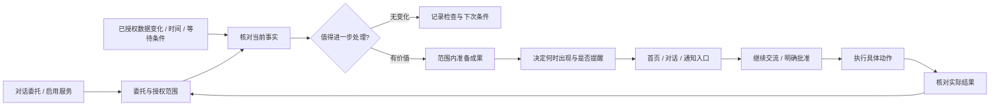

# xopc 主动助理：产品体验与技术落地方案

设计日期：2026-09-12。三个阶段的本地技术实现已推进，完成范围、自查与验证边界见 [分阶段实现记录](./proactive-implementation-review.md)。研究依据为官方公开资料，未登录竞品账户进行实测。

本文重新确定主动性的产品目标、交互方式和交付顺序。[已有模板与卡片方案](./proactive-templates-and-cards.md)继续作为已交付工程能力的记录；工作台与助理工作区的最终统一关系见 [统一产品方案](./workbench-assistant-unification.md)。后续产品设计以这两份文档为建议方向，不把旧文档中的“可用版本”解释为已经达到用户产品的可用性。

## 1. 产品决定

**xopc 记住你交代的事，提前做好准备，在需要你时找你，并把事情跟进到结果。**

用户的核心动作是“把这件事交给你”。产品需要持续回答四个问题：你记住了什么、已经替我做了什么、现在需要我做什么、接下来你会怎么继续。主动性通过这些体验被感知。

建议先服务已有项目、任务和工作沟通的用户，以“项目跟进”和“会前准备”建立信任。暂不以全天候生活助理、自动购物或持续环境感知为首发定位。这是结合 xopc 已有上下文与执行能力的产品取舍，并非对竞品能力的复刻。

用户不需要认识 proactive、subscription、workflow、扫描周期或通知预算。技术的可靠性体现为：事情不会丢、不会重复催、授权范围清楚、失败后知道如何继续。

## 2. 竞品给出的产品启发

这里的 Muse 指 Meta 于 2026 年 9 月 8 日发布的个人智能体产品，与其底层 Muse Spark 模型区分。发布时间与定位见 [Meta 官方发布](https://about.fb.com/news/2026/09/introducing-muse-personal-ai-agent/)。

| 产品 | 官方公开的核心体验 | 对 xopc 的设计启发 |
|---|---|---|
| Muse | 围绕目标持续工作；主对话、目标视图与成果相连；有重要进展才主动出现；关键操作使用明确确认界面 | 让用户委托一件长期事项，并持续看到成果与下一步；用对话承接主动结果 |
| Town | 首页区分值得知道的信息和可交办的建议；建议可转为任务；反馈可以针对人物、主题和类别 | 区分“了解一下”和“替我办理”，反馈精确落到用户不需要的内容 |
| Instinct | 官方强调短信、电话和对已有事项的主动跟进，目前仍是私密邀请体验 | 助理应出现在用户已有的沟通渠道中，回复后能继续同一件事 |

来源分别为 [Muse 设计说明](https://introducing.muse.ai/)、[Town 首页建议文档](https://www.town.com/docs/features/suggestions)、[Instinct 官网](https://instinct.com/)。这些是公开产品行为与声明，不能据此推断实际准确率、稳定性或用户留存。

Town 另一个可取之处是将重复工作包装成可直接使用、也能用自然语言建立的 routines；它的用户上下文可查看、编辑，自动化权限也可单独管理。对应 xopc 的设计应是“常用服务 + 可理解的记忆 + 每件事的授权”，而不是让用户维护更多参数。[Town Routines](https://www.town.com/docs/features/routines)、[Context & Memory](https://www.town.com/docs/features/context-and-memory)、[Modes & Approvals](https://www.town.com/docs/safety/modes-approvals)。

三个产品的共同启发是：持续理解用户的事情，主动承担其中一部分工作，在合适的地方交付。以下为 xopc 自身的设计，不代表这些竞品具有下文全部能力。

## 3. 重新定义用户面对的对象

### 3.1 “交给我的事”是核心对象

一件委托包含用户期望的结果、关联项目或事项、允许使用的信息、可执行范围、继续工作的条件，以及结束条件。它可以只持续到明天的会议，也可以跟进到项目交付。

例如：“帮我盯住官网改版，影响周五上线的事情及时找我，先把处理建议准备好。”

xopc 的回应是一个可读的承诺：

> 我会关注官网改版的任务和项目资料，提前准备影响上线的处理建议。需要你决定或交付时间有变化时找你。发消息和修改项目之前会让你确认；项目完成后停止关注。

“开始替我关注”确认的是这份具体委托。明确的对话指令且没有新增权限时，可以直接建立委托并展示可撤销回执；需要新增连接或更宽授权时才补充确认。

不要强迫用户为每件小事先建一个项目，也不要生成第二套任务管理系统。已有项目、任务、会议直接关联；无所属对象的委托独立存在，真正执行时按需创建任务。

### 3.2 主动性的三个来源

| 来源 | 何时启动 | 用户看到的体验 |
|---|---|---|
| 用户交代的事 | 对话或项目内明确委托 | “我记着这件事，会继续跟进” |
| 常用服务 | 用户启用一次，按约定持续运行 | “会议材料已为你准备好” |
| 助理发现的机会 | 在已授权、允许用于建议的信息范围内识别到机会 | “这件事需要我帮你跟进吗？” |

第三类只生成候选建议；用户接受前，不扩大上下文范围，不自动创建长期委托或执行外部动作。读取数据的授权与允许用它持续生成主动建议的意图需要相容，不能将“连接账户”自动解释为一切用途都已授权。

## 4. 产品结构：今天、对话、交给我的事

保留 xopc 现有项目、任务和对话，把主动助理融入现有首页工作台。主导航中的“工作台”承接当下价值；现有聊天入口保持容易访问，不强制把所有会话合并成一条。持续事项统一进入 `/assistant-work`，`/proactive` 只负责旧链接重定向。

| 位置 | 内容 | 主要动作 |
|---|---|---|
| 今天 | 需要你决定、已为你准备、值得知道 | 确认一个决定、使用一份成果、了解一个变化 |
| 对话 | 交代新事情、修改要求、围绕主动结果继续交流 | “这部分先别管”“把方案压缩一下”“等对方回复后继续” |
| 交给我的事 | 当前委托、最新成果、正在等待什么、下一步、暂停/结束 | 检查和调整正在被代理的工作 |
| 项目详情 | 与本项目有关的委托、准备好的产物、待决定事项 | 在工作上下文里直接处理 |
| 设置 | 默认打扰方式、连接与授权、运行位置、用量 | 设置个人默认值，低频访问 |

“今天”不是按创建时间排列的无限消息流。默认优先显示影响近期目标的少量事项，同一项目的连续变化聚合更新；用户可展开其他事项。没有内容的分组不占位，数量上限不能隐藏等待用户批准的真实工作，可以展示折叠计数和入口。

首页保留自然语言输入：“还有什么想交给我？”；次级入口“看看我能帮什么”打开按当前数据条件推荐的服务。后台活动只占一行摘要，例如“官网改版已检查 · 还在等设计稿”；展开后才看具体工作历史。

## 5. 首次使用：先完成一次真实交付

### 已有项目数据

1. 在项目中出现“让助理帮你跟进”，用当前项目名与明确收益描述推荐，不预先替用户开启。
2. 用户确认关注范围，默认允许只读分析和在 xopc 内准备成果；外部消息、项目变更仍需具体授权。
3. 立即进行首次检查，展示真实阶段：“正在查看任务进展”“正在整理建议”，不制造倒计时或虚假进度。
4. 有发现时直接展示可用的建议或成果；没有发现时显示“已检查，目前没有需要你处理的变化”，同时说明下一次继续工作的条件。
5. 在用户看到第一份有价值的成果之后，再介绍离开应用也可接收通知的能力，并请求相应系统权限。

### 没有足够上下文

提供“选一个项目”“告诉我一件要跟进的事”“连接日历”这些与结果直接对应的动作。只请求当前服务需要的数据。示例产物标记“示例”，与真实工作记录分开。

数据未同步、连接失效、没有发现是三种不同状态。“暂时无法查看日历”不能呈现为“今天没有需要准备的会议”。

## 6. 首发的服务与完整体验

### A. 帮我盯住项目交付——第一条完整交付链

用户交代：“帮我盯住官网改版，周五要上线。”

系统检查实际项目内容。当联调任务被标记为阻塞，先核对当前状态和对目标的影响，再准备处理清单。首页展示：

> **周五上线前，需要先完成支付联调**
> 联调任务仍被接口验收阻塞，距上线还有 2 天。
> 已为你整理：阻塞原因、建议顺序、缺少的确认信息。
> [查看处理清单]　稍后
> 依据：项目计划、联调任务 · 10 分钟前核对

打开即看到可编辑清单，不先要求用户选择 Workflow 或点击“开始生成”。用户可以说“把第一项加入项目”或“这部分已经解决”。

添加任务前预览具体标题与内容；在尚无相应授权时确认一次。创建成功后给出真实任务链接并继续跟进其状态。创建任务不等于问题解决；任务完成后结合来源变化更新委托，最终交付状态才决定是否结束。

若来源只是模型推断，则明确“可能影响上线”并展示缺少的依据，不能把推断写成确定延期。准备失败时保留有依据的信息，提供具体恢复动作。

### B. 开会前替我准备——形成每天可感知的成果

用户启用：“客户会议之前帮我准备一下。”根据日历与可用资料确认范围，例如仅客户会议、仅工作日历。

在会议前直接交付一页简报：会议目标、上次约定、本次需决定的问题、相关资料、尚不确定的信息。普通占位日程和无材料会议不机械地产出空简报。

卡片主动作是“打开会前简报”，详情可继续说“多准备两个关于预算的问题”。会议取消时撤回未来提醒；改期后调整准备时间；关联资料更新时更新同一份产物。会后跟进仅在取得相应记录来源和用户委托后开始。

此体验依赖真实可读且持续同步的日历。未接入时展示连接动作，不能以扫描定时器或模板启用成功宣称会前准备已经可用。

### C. 帮我把承诺跟进到底——从提醒走向持续办理

用户明确交代：“客户回了邮件就帮我继续跟进，下周二前把方案确认下来。”

系统记录正在等待的回复、截止条件和下一步；有回复时先核对是否回答了当前问题，再准备回应草稿或方案调整。没有回复且临近约定节点时，准备可供用户审阅的跟进文案。

发送能力尚未接通的环境，只提供草稿与复制动作；具备发送能力后，确认界面展示账户、收件人、正文及附件，按授权发送，随后等待真实回复。用户在邮箱自行处理后，已过时的催办应随同步更新而消失。

这条体验对外部状态同步要求更高，安排在前两条之后。不能通过反复生成“建议联系对方”的卡片来代替持续跟进。

## 7. 模板变成可使用的服务

用户侧以结果命名：“盯住项目交付”“开会前替我准备”“把答应的事跟到底”“每天告诉我该先做什么”。推荐顺序取决于当前上下文和连接能力，而不是展示所有内部场景枚举。

每个服务只解释四件事：能替你做什么、需要看什么、何时找你、做事到哪一步。启用时只补充无法推断的业务条件。检查间隔、模型、Prompt 和工作流留给高级设置与维护者。

技术侧的服务定义必须绑定经过验证的准备流程、产物格式、可用动作和完成条件，而非只有一段检测 Prompt。维护者升级服务时可以改进准备质量，但不得自动增加旧用户的可读来源和可执行权限。

| 服务定义字段 | 意义 |
|---|---|
| 用户收益与适用条件 | 决定推荐文案与何时出现 |
| 最小输入与能力条件 | 缺什么才问什么；能力不足则不给无法履约的承诺 |
| 观察逻辑与唤醒条件 | 事件、时间、等待事项发生变化 |
| 准备方式与产物规范 | 直接交付简报、草稿、清单等成果 |
| 动作能力与授权边界 | 明确哪些操作仅准备、哪些要确认 |
| 成功、停止及失效条件 | 让委托可以结束，避免无限重复关注 |

## 8. 用户控制：打扰方式与做事权限分别表达

### 打扰方式

全局提供“尽量安静”“重要时找我”“及时跟进”，默认“重要时找我”；保留“暂停主动服务”的直接入口。

- 尽量安静：成果进入今天页，可选约定摘要，不额外发外部提醒。
- 重要时找我：有明确时限、影响目标的实质变化或阻碍继续工作的决定时提醒；普通更新安静呈现。
- 及时跟进：增加有价值的进展提醒，仍不为相同状态反复发送通知。

这些选项改变提醒选择，不扩大数据范围或做事权限。已明确约定的提醒时间在委托中单独可见；全局静音会明确说明其对外部提醒的影响。

### 这件事可以替我做到哪里

委托内用动作语言展示：“查看这个项目”“准备清单和草稿”“修改前让我确认”。后续可以对具体、有限的操作长期授权，例如“这个项目内可以直接创建待办”，不能用一个笼统的“高主动性”授权任意行为。

默认在委托范围内完成只读分析与 xopc 内部成果准备。对外发送、项目写入等动作按照该项授权处理；新增账户、扩大对象范围或改变动作性质需要重新明确。

授权针对业务动作与范围，技术层负责逐次执行校验；不让用户反复批准每个读取工具。

### 反馈应立即有可见结果

卡片的更多操作提供：“我已处理”“这条不用”“少关注这个话题”“这件事先停一下”。前两者只影响当前事项，不自动推断长期兴趣；“少关注这个话题”才写入明确范围的偏好，并显示可撤销回执。

对话“内部例会不用提醒，客户会议继续”更新的是会议筛选偏好，界面回执展示变化；授权依然不变。偏好在“助理记住的要求”中可查看、修改、删除，复用现有 userContext，不再引入另一个不可见记忆库。

## 9. 卡片是工作入口，成果是主要内容

卡片根据用户现在能做什么选择呈现方式；风险、会议等业务类型决定内容，不能单独决定所有布局。

| 呈现方式 | 必须有的内容 | 一个主要动作 |
|---|---|---|
| 值得知道 | 变化、影响、来源、时间 | 查看详情 |
| 已为你准备 | 可用产物摘要、版本、尚缺的信息 | 打开简报 / 修改草稿 |
| 可以交给我 | 预期结果、拟关注范围 | 交给助理 |
| 需要你决定 | 具体动作、对象、最终内容、影响 | 确认这次操作 |
| 办理结果 | 实际执行状态、产物或对象链接、下一步 | 查看结果 |

每张卡默认仅一个主操作，其他操作收起；来源与“为什么现在”可展开。用户在卡片内继续交流时，携带委托、产物与当前版本，不要求重新粘贴上下文。

打开详情后直接出现简报、草稿、清单等适合的产物。长文可进入现有文档或成果页面，卡片保留同一对象引用和最新摘要。编辑产生新版本，发送或写入必须针对用户看到的最终版本。

“已准备”必须有真实可读取的产物；“已发送”必须有对应执行结果；“已完成”不能仅因用户关闭了卡片而成立。

## 10. 推送与跨端继续办理

同一事项在首页、对话和设备通知上共享对象身份。系统通知是“回来处理这件事”的入口，正文只放必要摘要；锁屏默认避免敏感内容。点击到具体成果或决定，不能跳回需要重新寻找的卡片列表。

提醒顺序建议为：先判断这件事是否值得现在打扰，再选择用户约定的可用渠道。用户正在相关对话或详情中查看时，在当前界面更新；离开应用后，使用选定设备或渠道。不能因为用户没打开 proactive 页面就误判其离线。

常规内容可进入约定摘要。摘要本身应是一份按用户目标整理的短简报，突出变化与行动，而不是“你有 7 张新卡片”。如果不值得合并成有用内容，可以不发。

首发完成网页/桌面当前界面与一个实际可用的离线通知渠道。Telegram 等渠道接收简短成果与深链；只有在账户绑定、回复关联和鉴权完成后，才开放通过渠道回复来继续办理。复杂批准打开明确的确认界面，不能将游离的“好”匹配到不确定的操作。

用户在任一端处理后，其他端同步状态，待投递通知撤销或更新。供应商接受通知、设备收到、用户打开是不同事件，无法确认送达时不能承诺已经触达；首版不因没有已读回执自动跨渠道轰炸。

Gateway 未持续运行时不能承诺离线持续办理。页面应如实显示“运行设备已离线，恢复后继续”，并保留上次成功检查时间。常驻本地设备与远程部署是运行选择，不能用“后台运行”掩盖休眠和断网条件。

## 11. 为以上体验服务的技术方案

### 11.1 执行闭环

信息性提醒可以跳过成果准备直接进入呈现判断。后台运行时先做廉价变化检查，再进行必要分析和准备；一次检查没有发现属于成功。临近真实截止点但准备尚未完成时可以提醒已确认的事实，同时准确显示准备状态。

排序先应用权限、来源时效、已处理、重复和有效期等硬条件，再结合与委托的关系、目标影响、行动时限、是否已有成果和用户反馈做选择。首发使用可解释规则与受约束的模型判断，不需要先建设通用推荐训练平台。

同一业务变化绑定稳定事项身份。新的来源版本可以更新成果；没有实质新变化不生成新通知。模型建议改变计划时，也必须经过委托边界与动作授权检查。

### 11.2 在现有能力上增加什么

| 用户需要的能力 | 当前可复用基础 | 必要变化 |
|---|---|---|
| 一句话交代，之后持续跟进 | 项目/任务、Session、Agent、scenario/subscription | 增加委托语义、继续与结束条件，对话与项目内的启用入口 |
| 成果提前准备好 | 只读分析、preparationOnly Workflow、运行记录 | 服务绑定默认准备流程，按委托自动准备，保存可读取的成果引用 |
| 今天看到重要事项 | 现有 Home 工作台、Inbox、Realtime | 统一工作台读取模型，按决定/成果/变化组织，聚合同一事项 |
| 直接接着办 | 卡片动作、TaskApplicationService、Workflow | 卡片到委托会话的上下文续接，明确动作预览，真实结果与卡片同步 |
| 少提醒之后真的改变 | feedback、userContext、全局策略 | 增加有范围、可撤销的偏好，参与候选生成与呈现选择 |
| 不重复催已处理的事情 | correlation、生命周期、投递队列 | 订阅项目/任务/外部来源的新状态，撤销过时准备和提醒 |
| 离开后仍能继续 | NotificationService、Web Push、渠道、Gateway | 真实设备验证、全应用活跃状态、渠道身份与回复关联、运行状态解释 |

代码落点：`web/src/pages/home-page.tsx` 与 `web/src/features/proactive/` 负责体验；`src/proactive/scenarios/`、`execution/`、`actions/`、`inbox/` 负责业务闭环；共享契约沿用 `packages/gateway-contract/`。不新增第二套队列、工作流或通用记忆系统。

实现前核对：原有卡片按创建时间排序；`resolve` 写入 dismissed；`less` 将整个订阅切到 inbox；准备成果要求先选择 Workflow。新实现已改为重要性组织、分离处理语义、编辑委托要求与服务内置准备，并移除旧 Workflow 准备路径。技术验证不替代真实用户的产品体验评估。

### 11.3 最小新增领域关系

以下是实现边界，不是要求直接照抄的数据库 DDL：

- **Delegation**：用户意图、关联业务对象、归属 Agent、授权引用、服务版本、继续/成功/停止条件和业务状态。可关联已有 subscription，负责用户看得懂的承诺。
- **Work item**：围绕一次业务问题持续存在的工作项，关联 insight、卡片和实际任务，不为每次扫描新建。可在现有关联与生命周期表上扩展。
- **Artifact link**：复用现有成果存储，保存委托、运行、来源版本、产物版本与用户编辑版本的关系，不把成果本体只塞在通知正文里。
- **Scoped preference**：基于现有 userContext 存储明确的对象/主题/类别偏好、来源、时间与撤销信息。语言偏好不能被转换为新执行授权。
- **Outcome link**：关联真实任务/动作结果、确认方式和后续等待条件。用户自报已完成与系统核实完成分别记录。

至少区分三组状态：卡片已读/收起；委托进行中/等待/暂停/完成；动作待批准/执行中/成功/失败。收起卡片不改变任务完成状态，打开产物也不等于采纳成果。

每个委托只有一个负责的 Agent，多 Agent 共享用户的关注事项和提醒策略。模型输入按当前授权重新裁剪，历史产物和已撤回来源也必须遵循读取权限；审核业务授权的代码不依赖模型自行遵守 Prompt。

### 11.4 产品接口与边界

优先扩展已有首页接口，提供今天的三类事项与后台活动摘要；委托接口承接提出、建立、修改、暂停和结束；卡片继续交流接口返回绑定的会话；成果读取和具体动作继续复用现有对象与执行服务。

对修改和确认传递当前版本、动作内容摘要及幂等标识。批准绑定具体对象、接收方、内容版本和期限；批准后若来源变化影响动作内容，重新生成可审阅版本。首次接入的认证 Gateway 路由必须同时更新 lazy-bundle matcher，并验证真实认证请求路径。

外部内容只作为数据，不能获得授权管理权。权限、动作白名单、预算和终止控制在模型外执行。做到这些的目的是让用户只需要确认真正影响自己的决定。

### 11.5 卡片协议与 A2UI 的选择

首发采用扩展现有结构化契约 + React 组件注册表：稳定的对象引用、业务状态、产物引用、来源、主操作、继续交流入口和文本降级。不同渠道渲染同一语义，不能自行改变动作权限。

简报、草稿、清单、批准界面优先使用产品维护的组件，保证编辑、键盘访问、版本展示和动作含义稳定。A2UI 或其他生成式 UI 可在后续复杂成果中做有限试验，例如对比方案或行程视图；它不是主动性闭环成立的前提。

生成内容只能使用允许的组件和数据绑定；支付、发送、授权等确认界面始终由宿主产品渲染。采用任何协议前再验证当前实现、兼容性与生态，不在本提案中将协议名称等同于成熟能力。

## 12. 开发顺序按完整用户体验切分

| 阶段 | 用户实际能完成什么 | 完成条件 |
|---|---|---|
| 第一阶段：项目跟进 | 交代一个项目 → 看懂承诺 → 收到准备好的清单 → 修改并创建任务 → 查看后续结果 | 无需配置 Workflow；首页、项目与对话引用同一工作项；任务变化能更新或结束关注；无发现和失败可理解 |
| 第二阶段：会前准备 | 连接一个日历 → 开启服务 → 打开真实简报 → 修改要求 → 改期/取消后自动更新 | 数据同步与授权可用；产物可读可改；过期内容不继续通知；一个离线渠道真实送达并直达成果 |
| 第三阶段：承诺跟进 | 关联一条沟通 → 等待变化 → 审阅草稿 → 批准实际动作 → 继续等待真实结果 | 外部处理状态可回流；确认绑定准确内容；跨渠道回复回到同一事项；反馈可以改变后续相关建议 |

每阶段都包含界面、业务执行、状态恢复和真实用户体验验证，不能把“后端都做好，再统一产品化”作为交付顺序。阶段时长在连接器与成果存储能力完成盘点后估算，不以未确认的人力做工期承诺。

旧订阅保持原权限与投递选择，以“已有关注”纳入新视图；不自动启用更多准备或发送权限。旧链接继续可用。现有配置表单保留在高级管理中，等迁移稳定后再收缩。

首阶段不增加模板数量、不铺满所有推送渠道、不引入通用生成式 UI 平台。优先把一个用户交代的事情真正办下去。

## 13. 用什么判断产品是否成立

核心衡量对象是**经用户采纳或结果证据确认，确实推进了委托的主动工作**，而非卡片数量和点击率。成果查看、用户采纳、任务创建、任务完成、委托完成需要分开统计；同一委托的多次通知不能重复记功。

建议先用 6–8 名目标用户观察两周，视为发现问题的定性试用，不将小样本包装成统计结论。以下均为待验证标准，没有声称当前已经达成：

| 要回答的问题 | 验证方法 |
|---|---|
| 用户能直接开始吗？ | 不解释技术术语，请用户交代一个真实项目，记录首次成功委托时间、求助点与放弃原因 |
| 有没有提前替用户做事？ | 记录首次真实产物的时间与可用性，区分资料缺失、准备失败和没有发现；请用户实际修改或使用 |
| 提醒值不值得？ | 对展示与通知分别标注相关性、时机、可执行性、事实依据；同时回顾被漏掉的重要事件 |
| 用户真的省了一步吗？ | 记录采纳、执行结果与后续状态；询问是否替代了一项原本要自己做的工作 |
| 能控制这位助理吗？ | 让用户减少某类提醒、暂停一件事、撤销一项授权，检查其理解与随后行为是否一致 |
| 能持续信任吗？ | 演练改期、已在别处处理、来源撤回、断网恢复、跨端重复点击，观察是否重复催办或误报完成 |

上线硬门槛包括：未经授权的外部动作不得发生；批准对象与执行内容一致；无产物不称已准备；失败不称完成；同一操作重复点击不会执行两次。产品门槛是目标用户无需指导便能完成整条体验，并能明确指出至少一件被助理推进的真实事项。再根据试用基线制定量化目标。

## 14. 本轮交付边界

本轮交付研究、产品与技术设计，以及用于讨论的交互概念。概念中的项目、任务和状态均为示例，不连接真实工作区，也不代表当前 xopc 已具备所展示的完整体验。下一轮应从第一阶段的项目跟进体验开始开发，按真实成果和后续办理闭环验收。
