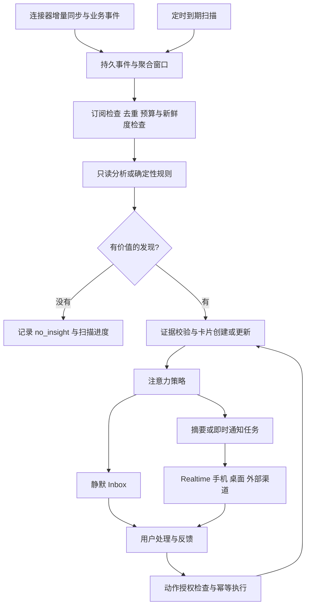

# 主动性：模板、用户控制与卡片投递技术方案

日期：2026-09-12。状态：已实现首个可用版本（P0/P1 主路径，以及项目兜底扫描和 Web Push）；尚未实现的扩展见第 13 节。第 2–12 节保留设计时的现状与目标，实际交付范围以第 13 节为准。

## 1. 推荐决策

将 Proactive 定义为：**根据用户授权持续关注事项，在有价值的变化或约定的时间点，主动交付可解释、可处理的卡片。**

它在产品上是一种主动服务，在技术上是带有判断、注意力控制和反馈机制的自动化。一次扫描可以没有结果；一张卡片可以持续更新；出现卡片不必产生系统通知。

推荐采用：

- 现有 `src/proactive/` 作为主动性业务核心，扩展场景为可订阅模板。
- 事件驱动 + 定时扫描，统一进入已有的事件、聚合、运行管线。
- 全局主动程度 + 模板订阅覆盖 + 独立的操作授权。
- 结构化卡片 DTO + React 组件注册表；A2UI 作为后续可选渲染适配器。
- SQLite 保存卡片与投递任务；现有 Realtime、NotificationService 和渠道能力负责送达。

首版以单用户、一个工作区的常驻 Gateway 为运行前提，授权主体可使用稳定的本地用户身份，不额外引入多租户系统。多 Agent 共享用户注意力预算，不能每个 Agent 各推一份。

## 2. 当前实现与差距

此次未发现可调用的 codebase-memory 图工具，代码定位使用文件搜索及源码读取。以下是静态检查结论，不代表运行验证。

| 能力 | 已有实现 | 本次需要补齐 |
|---|---|---|
| 事件与聚合 | `src/proactive/service.ts`，事件持久化、去重、订阅路由、batch | 时间触发标准化、业务相关性合并、变化检测前置 |
| 场景与版本 | `src/proactive/scenarios/types.ts`、`repository.ts`，模板基础 Prompt、订阅、Prompt revision、场景版本 | 用户侧模板目录、参数 Schema、触发配置、主动程度与投递覆盖 |
| 分析执行 | `src/proactive/execution/worker.ts`、`agent-executor.ts`，只读工具、超时、lease、证据 ID 校验 | 合法 `no_insight`、分阶段预算、证据事实校验、策略版本与执行前重检 |
| 时间窗口 | `src/proactive/temporal/worker.ts`，会议前 24 小时/2 小时扫描 | 通用 schedule occurrence、增量扫描游标、宕机补扫 |
| 项目控制 | `src/tasks/project-monitoring-service.ts`，observe / ask_before_action / auto_low_risk、免打扰、动作白名单 | 把展示强度和执行权限拆开，统一工作区与订阅控制 |
| Inbox | `src/proactive/inbox/`，已读、稍后提醒、处理、反馈、决策、delivery outbox | 多卡片类型、revision、过期/撤回、单卡直达、更新传播 |
| 用户页面 | `web/src/pages/home-page.tsx`，判断详情、选项、反馈 | 可浏览的信息卡片流、模板设置、主动程度入口 |
| 通知 | `src/notifications/`，产品事件持久化、Expo push、重试与回执；Web/Electron 展示适配 | 统一注意力决策、跨设备策略、网页关闭后的 Web Push、多渠道卡片适配 |
| 产品引用 | `packages/gateway-contract/src/product-delivery.ts` | 增加卡片引用并接入统一导航，复用现有信封而非再造一套消息引用 |

现有设计文档和 `src/gateway/hono/routes/proactive.ts` 明确没有用户侧主动性控制面板。本需求修改了这一产品决定，应在后续实现中更新旧文档，而不是沿用“只允许卡片内自然语言反馈”的限制。

三个特别重要的现状：

1. 当前项目 `observe` 会得到 `record_silently`，不创建 Inbox item，不能直接拿来表示“静默展示卡片”。
2. 当前 `parseInsightCandidate` 要求完整 insight，不接受独立的 `no_insight`；低价值主要依靠后置价值门槛丢弃。正常的“没发现值得提醒的事情”应成为成功结果，避免模型为完成 Schema 硬造结论。
3. 当前 proactive outbox 的适配器只是 `emit('proactive.inbox.created')`，NotificationService 再持久化通知。通知处理内部捕获持久化错误，不能把 emit 成功等同于可靠通知交接完成。

## 3. 产品对象与用户体验

### 3.1 对象职责

| 对象 | 回答的问题 | 示例 |
|---|---|---|
| Template / Scenario | 应该关注什么、怎样判断？ | 会议准备、项目风险、等待回复 |
| Subscription | 谁在什么范围内使用此模板？ | 关注项目 A，每工作日检查 |
| Trigger occurrence / Signal | 为什么此时检查？ | 时间到达、任务进入阻塞状态 |
| Run | 本次检查做了什么？ | 数据版本、模型、费用、无发现原因 |
| Insight | 得到了什么有证据的结论？ | 缺少会议所需材料 |
| Card / Inbox item | 用户如何理解和处理？ | 会议卡、风险卡、决策卡 |
| Delivery | 在哪里、何时提醒？ | 静默入箱、晚间摘要、手机通知 |
| Action execution | 用户选中的操作是否完成？ | 创建任务成功，并附任务链接 |

模板与卡片类型是多对多关系。一个会议模板可以输出准备卡或待确认卡；多个模板可以复用同一种决策卡。模板身份、业务结论和界面布局不要绑定成同一个枚举。

### 3.2 建议的初始卡片类型

| 卡片类型 | 用户看到的内容 | 典型操作 |
|---|---|---|
| `briefing` 简报 | 今日需要关注的变化及引用 | 展开、继续讨论、调整偏好 |
| `reminder` 提醒 | 什么事将到期、为什么现在提醒 | 稍后、已处理、打开事项 |
| `risk` 风险 | 风险、影响、证据、建议 | 查看依据、生成处理草稿 |
| `recommendation` 建议 | 建议及预期收益 | 生成草稿、转任务、忽略 |
| `decision` 待决定 | 问题、有限选项、各自影响 | 选择、编辑后确认、稍后 |
| `receipt` 执行回执 | 实际完成了什么、产物、失败原因 | 打开结果、在允许时重试 |

卡片固定具备：标题、摘要、为什么现在、来源、更新时间/有效期、主操作、更多操作。证据 ID 在后端保留，用户看到可读的来源标题和受鉴权的链接。避免把内部 disposition 文案直接作为产品解释。

首屏示例：

```text
为你关注                          主动程度：适中

会议准备 · 今天 15:00                         2 小时后
客户评审还缺少最新演示材料
议程提到报价和交付计划，关联资料中的演示仍为上周版本。
依据：会议议程、项目资料 · 检查于 13:00
[生成准备清单]  [查看资料]  [稍后]  [少提醒这类]
```

信息流使用“待处理 / 动态 / 已处理”筛选，首页摘要和聊天引用都指向同一个 cardId。系统通知点击进入卡片详情，不要求用户先在某个首页列表中找到该卡片。详情直接按 ID 加载。

## 4. 主动程度与用户控制

### 4.1 主动程度控制注意力，不扩大权限

建议四档，数字是首版待验证的产品默认值，不是质量保证或实时 SLA：

| 档位 | 发现与扫描 | 卡片 | 打断式通知 |
|---|---|---|---|
| 关闭 `off` | 停止此主动性订阅的新检查及重试 | 历史可查看 | 取消未发送的主动性通知 |
| 安静 `quiet` | 事件合并，普通事项每日兜底扫描 | 合格结果静默展示 | 默认 0；用户可另选每日摘要提醒 |
| 适中 `balanced` | 事件触发，普通事项约每 2 小时兜底 | 合格结果展示并合并 | 有明确时效的重要变化，最多 3 次/日 |
| 积极 `active` | 事件触发，普通事项约每 30 分钟兜底 | 更及时的准备和建议 | 通过价值门槛，最多 8 次/日 |

事件 debounce 可取 30–120 秒；同一事项同一原因的通知冷却默认 4 小时。上述配额是上限，目标不是每天凑满。例外按模板定义：会议在特定时间窗口检查，晨报在约定时间生成，不随全局轮询间隔机械变化。数据源同步比扫描慢时，界面必须显示数据新鲜度，不能承诺 30 分钟内获得真实变化。

调整到“积极”可以提高检查频率、覆盖已启用场景中的较低紧迫性建议，但不能降低证据质量底线、读取未授权来源或启用未订阅模板。

全局关闭只影响主动服务，不取消用户另行创建的显式定时任务或普通自动化。运行中分析尽力取消；返回结果提交前再次检查开关。已经发到外部的通知无法保证撤回。

### 4.2 用户真正需要的设置

- 全局：程度、时区、免打扰时段、每日通知上限、摘要时间、默认提醒渠道、暂停到某个时间。
- 每个订阅：开启/关闭、继承/覆盖程度、关注范围、来源、触发时间、重要性偏好、渠道。
- 每张卡片：已处理、稍后、此次不相关、少提醒这类、暂停这个模板、调整关注条件。
- 独立操作授权：仅建议；每次确认；在明确范围内允许指定动作。不得由主动程度隐式切换。

普通“没用”反馈仅记录评估数据。“少提醒这类”修改指定订阅的注意力配置；“以后仅在影响外部承诺时提醒”是用户明确提交的偏好修订，展示生效范围并支持撤销。

模板开启不意味着连接器自动获权。连接器未连接或未允许主动分析时，订阅显示 `needs_connection` / `needs_consent`，不不断消耗模型重试。

### 4.3 策略合并规则

有效权限 = 来源授权 ∩ 用户动作授权 ∩ 模板允许能力 ∩ 当前对象权限。

普通设置按“模板默认 → 全局偏好 → 当前订阅覆盖”逐字段解析，禁止通用递归 merge。全局关闭是硬开关；全局通知配额是所有订阅共享的硬上限；免打扰时段默认取限制的并集；订阅只能使用当前允许的渠道和来源。明确授权的例外单独建模，不能藏在 Prompt 中。

例如：全局适中，项目 A 使用积极，项目 B 关闭，会议准备只入 Inbox；四者共享全局每日 3 次打断上限，除非用户显式调大全局上限。

保存偏好增加 policyVersion。检查开始、重试领取、卡片提交、通知发送、动作执行五个边界重检当前策略；run 同时保留当时的策略快照便于解释。

## 5. 模板实现

### 5.1 在 ScenarioDefinition 上扩展

不另建相互竞争的 Template 引擎：用户界面叫“主动服务模板”，内部沿用 scenarioKey。模板包含受约束的触发条件、参数 Schema、上下文来源、判断指令、输出类型、去重/过期规则、资源预算及动作白名单。

下面是拟议的声明式格式，字段尚未全部实现：

```yaml
key: meeting_preparation
version: 2
title: 会议准备
parameterSchema:
  type: object
  additionalProperties: false
  properties:
    leadMinutes: { type: integer, minimum: 15, maximum: 1440, default: 120 }
    includeInternalMeetings: { type: boolean, default: false }
triggers:
  - kind: event
    eventTypes: [connected_source.calendar_window.v1]
  - kind: temporal
    provider: upcoming_calendar_events
    leadMinutesParam: leadMinutes
    misfire: latest_valid
context:
  required: [calendar_event]
  optional: [linked_project, relevant_notes]
  maxItems: 30
analysis:
  promptKey: meeting_preparation
  modelIntent: reasoning
  timeoutSeconds: 90
  maxToolCalls: 6
output:
  allowedKinds: [briefing, recommendation, decision]
  allowNoInsight: true
dedupe:
  subject: calendar_event
  reasonKey: meeting_preparation
  updateExisting: true
expiry:
  kind: source_field
  field: meetingStartsAt
actions:
  allowed: [open_source, prepare_checklist, continue_in_chat]
```

Trigger 与 ContextProvider 使用代码注册的白名单；参数通过 Zod/JSON Schema 验证，不接受可执行 JavaScript、任意 SQL 或模型生成的 HTTP 动作。用户自定义模板首版仅开放现有 trigger/context/action 的组合和偏好指令；新增连接器或动作由开发者实现。

`prepare_checklist` 属于拟新增的产物生成能力；当前只读分析器不能直接完成，应在用户点击后交给既有 Agent/Workflow，并返回产物引用。

### 5.2 生命周期

模板：草稿 → 校验 → 样例评估 → 发布不可变版本 → 退役。

订阅：选择模板 → 设置参数和范围 → 检查连接与授权 → 预览样例 → 启用。

运行固定 templateVersion、subscriptionRevision、promptRevision、policyVersion、contextSnapshotId。模板升级不覆盖用户参数；新增来源/动作授权保持未启用，待用户明确设置。必要时参数迁移失败使订阅暂停并说明原因。

Prompt 分层沿用现有 composer：平台约束、模板任务、用户偏好、受授权上下文、输出契约。权限与配额在代码中执行，Prompt 只帮助判断。

### 5.3 首批场景

优先完善已有 `meeting_preparation`、`project_delivery_risk`、`automation_failure_impact`。分别验证时间窗口、事件聚合与系统故障这三种触发路径。现有 `blocked_work`、`discussion_follow_up` 可随后接入统一卡片。晨报与等待回复在第二阶段加入，避免首版被新连接器接入拖住。

## 6. 后台管线与自动化关系



### 6.1 统一触发，保留执行边界

保留 ProactiveWorker 执行只读判断，自动化/Workflow 执行用户请求或已明确授权的后续工作。不把每次后台检查都创建成一条聊天会话或普通用户自动化，避免重复运行历史和“自动化完成 + 主动卡片”双通知。

现有自动化支持 once/interval/cron。抽取或复用其 schedule 计算、时区处理等纯逻辑，给 proactive 增加持久化 due job；不再建独立的通用工作流引擎。产品层可以在“自动化”中显示主动订阅的关联运行，但只维护一份执行所有权。

Heartbeat 仍适合自由文本的轻量检查。模板化主动服务要求可恢复运行、卡片状态和预算控制，应进入主动性管线；同一事项的旧 Heartbeat 规则迁移时停止重复检查。

### 6.2 调度与增量

新增 `proactive_schedule_state`：subscriptionId、triggerId、timezone、nextDueAt、lastSuccessfulAt、cursorJson、leaseOwner、leaseExpiresAt、attempt。唯一 `(subscriptionId, triggerId)`；时间字段使用 UTC，用户时间以 IANA 时区解析。

Gateway 定时器只唤醒 worker，数据库的 nextDueAt/lease 才是调度事实。到期时在短事务中领取，并按 `(subscriptionId, triggerId, scheduledFor)` 生成唯一 occurrence，发布标准事件后进入已有聚合管线。

扫描从已确认游标取增量，完成所有分页与事件持久化后再推进游标。允许小幅重叠读取并依赖 source/version 去重，避免相同更新时间与分页变动漏数据。来源同步游标与主动分析游标分开，连接器同步成功不能等同于场景处理成功。

时间语义单独测试：DST 跳时采用模板配置的跳过/下个有效时间；重复本地时刻默认只触发一次，以 UTC occurrence 去重。普通 interval 不随浏览器时区变化。

宕机恢复按模板处理：晨报仅生成最近一期；已结束会议跳过；未过期风险补查一次；不补发停机期间所有旧通知。恢复后分批扫描并加抖动。

### 6.3 判断、去重与成本

先做便宜的范围、权限、数据版本、TTL、冷却和规则检查，再决定是否调用 LLM。确定性到期提醒可以直接生成卡片；会议材料综合、项目风险才需要分析。供应商限流或缺少来源进入明确等待状态，不归类成“没有风险”。

输出采用判别联合：

```ts
type AnalysisResult =
  | { result: 'no_insight'; reason: 'unchanged' | 'routine' | 'insufficient_evidence' | 'duplicate' }
  | { result: 'insight'; candidate: ValidatedInsightCandidate };
```

证据校验包括来源 ID 合法、对象版本和新鲜度、日期/状态等关键事实一致。ID 存在不能证明整句话为真。LLM 给出紧迫性理由，产品规则结合实际期限和影响决定能否推送，不能仅靠模型自报高置信度。

重复控制分四层：source event 去重；run occurrence 去重；按“订阅/范围/主体/原因”更新同一活动卡片；按“卡片/重要变化版本/目标”去重通知。跨模板对同一 blocker 建立 correlationKey，合并来源，不按标题字符串判断同一问题。

普通内容更新仅增加 revision。只有期限显著提前、阻塞升级、需新决定等实质变化才增加 notificationRevision。用户已忽略、稍后或处理过的事项，没有新事实不应重新推送。

预算分别控制：来源请求数、每订阅运行次数、模型 token/费用、全工作区并发、每日打断次数。先保留紧迫事项的可用预算，普通事项顺延并记原因。建议首版并发 1–2，使用现有模型 intent 路由并加单次硬上限。成本估计采用“通过前置筛选的次数 × 单次实际平均成本”，上线后按有用卡片计算，不预设未经验证的金额。

## 7. 卡片契约与动作

### 7.1 统一 DTO，复用 Inbox 身份

以现有 `proactive_inbox_items` 为 Card 的存储和身份来源，不建立独立的 `cards` 表复制 Insight。复杂展示数据通过版本化投影组装，必要的摘要快照与 revision 保存在现有记录中。

拟新增 `packages/gateway-contract/src/proactive-cards.ts`，以下为结构示意：

```ts
type ProactiveCard = {
  schemaVersion: 1;
  id: string; // existing inbox_item_id
  revision: number;
  notificationRevision: number;
  subscriptionId: string;
  template: { key: string; version: number };
  kind: 'briefing' | 'reminder' | 'risk' | 'recommendation' | 'decision' | 'receipt';
  status: 'unread' | 'read' | 'snoozed' | 'resolved' | 'expired' | 'withdrawn';
  title: string;
  summary: string;
  whyNow: string;
  evidence: Array<{ id: string; label: string; sourceVersion?: string }>;
  createdAt: string;
  updatedAt: string;
  expiresAt?: string;
  presentation: CardPresentation; // discriminated union of product-owned schemas
  actions: Array<{ id: string; label: string; kind: string; enabled: boolean }>;
  fallbackText: string;
};
```

`CardPresentation` 首版为每类卡片的固定字段集合，不开放任意 HTML、JS、CSS 或无限制组件树。动作参数、权限判断、导航目标由服务端可信注册表生成。客户端收到按钮不代表拥有执行权限。

`ProductDeliveryEnvelope` 仍负责指向产物；给 ProductReference 增加卡片引用并在 Web/Electron/Mobile 路由一并实现。聊天中只附卡片引用和简短摘要，读取当前 revision；没有用户选择“继续讨论”时，不把后台检查注入会话历史。

### 7.2 动作执行协议

建议 `POST /api/inbox/judgments/:itemId/actions`：

```json
{
  "actionId": "prepare_checklist",
  "expectedRevision": 3,
  "idempotencyKey": "client-generated-uuid",
  "input": {}
}
```

服务端完成鉴权、当前 card 状态/有效期、revision 检查、当前授权、输入 Schema、来源新鲜度与幂等领取。未知 action、过期卡片或旧版本返回可解释错误及刷新指引；冲突使用 409，动作已完成返回原结果。

后台动作进入现有 Task/Workflow，并返回 202 + executionId。用户确认表示动作获准，只有实际成功才展示 `receipt`；执行失败保留失败状态和明确恢复入口。动作幂等同时依赖请求键和 `(cardId, actionId, approvalRevision)` 的业务唯一键，防止两台设备用不同请求键重复执行。

外部渠道回调必须校验提供方签名/可信来源、绑定用户与目标、token 有效期，并重新检查授权；只知道 cardId 不可触发操作。首次可只提供“打开卡片”按钮，复杂审批返回 xopc 完成。

## 8. A2UI 与消息卡片技术选型

调研日期为 2026-09-12；协议能力与本项目适配建议分开判断。

| 方案 | 官方定位/能力 | 对 xopc 的建议 |
|---|---|---|
| 自有语义卡片 DTO + React | 本文提出的产品实现方式 | 首选；可复用现有设计系统、Inbox 和动作语义 |
| A2UI | 声明式界面和数据更新，客户端以受控组件渲染；官网当前列出 v0.9.1 为 Current，v1.0 为 Candidate | 适用于后续动态表单、比较视图等；不作为主动性领域模型或推送调度器。[官方说明](https://a2ui.org/) |
| Adaptive Cards | JSON 卡片、宿主渲染；Universal Actions 提供 Action.Execute 与刷新机制，需考虑宿主/版本差异 | 若重点接入 Teams/Outlook，用作渠道适配格式；当前不必替换 Web 组件。[官方文档](https://learn.microsoft.com/en-us/adaptive-cards/authoring-cards/universal-action-model) |
| AG-UI | Agent 与前端之间的双向事件协议 | 属于交互连接层；已有 REST/Realtime 时首版无需再引入。和 A2UI 是不同层。[官方文档](https://docs.ag-ui.com/introduction) |
| Slack Block Kit | Slack 的消息、首页和弹窗组件表达 | 将语义卡片编译为渠道格式；不同 surface 支持不同块。[官方文档](https://docs.slack.dev/block-kit/) |
| Telegram 按钮消息 | Bot 消息配 inline keyboard，callback_data 有 1–64 字节限制 | 使用短 opaque callback token 映射服务端动作；不塞完整卡片或凭证。[官方文档](https://core.telegram.org/bots/api#inlinekeyboardbutton) |

采用 A2UI 不能自动解决：离线推送、业务去重、卡片事实存储、用户免打扰、权限与动作幂等。引入时间以需求为准：当固定组件无法覆盖明显增多的动态表单/比较布局，或必须与外部 Agent 交换 UI 时，做一个受控详情区试点。

届时固定协议版本及 catalogId，用现有设计 token 实现白名单组件；限制深度、数量、字段长度、URL 和动作；未知组件降级为 fallbackText；所有动作仍走同一个 CardActionService。外部渠道根据能力生成摘要和链接，不假设 Telegram 能渲染 A2UI。

## 9. 投递与一致性

### 9.1 卡片展示与打断分流

保存卡片后立即允许 Inbox 查询。免打扰只延迟系统通知，不隐藏已生成的卡片或阻断数据同步。判定结果明确为 `record_only | inbox_only | digest | immediate`，并记录 suppressionReason/nextEligibleAt。

| 表面 | 内容与通路 | 可靠性边界 |
|---|---|---|
| Web 应用内 | Realtime 传 cardId/revision，REST 拉完整卡片 | 断线后通过游标增量同步；游标过期时全量分页重建 |
| 桌面通知 | 现有 Electron 通知适配器，展示摘要和深链接 | 桌面进程运行时可投递；关闭后不能仅靠此适配器 |
| 手机通知 | 复用 Expo、设备偏好和回执 | push 只带最少数据与卡片 ID；点击后鉴权加载 |
| 网页未打开 | 新增 PushSubscription、发送端、Service Worker push handler | 受浏览器/系统与授权状态限制，需要 HTTPS 与平台验证 |
| Telegram 等 | 文本摘要、按钮、来源链接 | 保留 providerMessageId；更新原消息或回退到当前卡片详情 |

当前 `web/public/notification-sw.js` 仅处理 notificationclick，Web 适配器在页面内调用 showNotification。真正 Web Push 需要 PushManager 订阅及 service worker 的 push 处理，才能在页面未加载时接收；仍不能承诺所有浏览器/系统状态下必达。[MDN Push API](https://developer.mozilla.org/en-US/docs/Web/API/Push_API)

### 9.2 持久交接

复用并澄清现有两层 outbox 的职责：proactive outbox 是“卡片变化待发布”；notification deliveries 是“某个渠道/设备待发送”。前者不能以 in-memory emit 为成功条件。

建议同一 SQLite 短事务写入卡片变更与 durable event；发布 worker 调用能返回持久化结果的通知应用服务。只在通知事件及对应 delivery 持久化成功，或明确记录策略抑制后，确认卡片事件已交接。实时广播在事务提交后进行，广播丢失由客户端补拉修复。

通知 worker 领取任务时再次检查：关闭/暂停、snooze、resolved/expired、最新版本、来源撤权、免打扰、预算。静默时段结束后重新评估时效，合并成摘要或取消，不一次性补发全部积压。

网络发送在事务外进行。delivery 记录：channel、target、notificationRevision、状态、attempt、lease、nextAttemptAt、providerReceipt、lastError；对 `(cardId, notificationRevision, channel, target)` 建立唯一约束。使用租约领取、退避重试、永久失败状态及管理端诊断。

第三方投递采用至少一次尝试 + 幂等/合并抑制，不宣称端到端 exactly-once。超时后可能存在“提供方已接收、本地尚未记账”的窗口。Expo ticket/receipt 表示不同阶段的接收情况，不能用 receipt 证明用户看到了通知；客户端打开/读取另行记录。[Expo 投递文档](https://docs.expo.dev/push-notifications/sending-notifications/)

摘要作为同一批卡片的聚合投递记录，保存成员 ID/版本和摘要时段唯一键；不额外复制一批分析结论。摘要只列仍有效、未处理的事项。每日预算按用户时区计数并原子预留，避免多个 worker 超额。

### 9.3 跨设备与敏感内容

默认“当前活跃应用内可见 → 不再响系统通知；无活跃设备 → 首选通知渠道”；用户可选择多端提醒。活跃状态采用短 TTL presence，只影响减少打扰，不能改变卡片保存。允许在需要可靠提醒的订阅中设置未确认后的升级渠道，并限定次数；不要默认所有渠道群发。

通知摘要按来源敏感级别与用户设置降级，锁屏默认可用“有一项工作需要查看”。不把完整上下文、证据正文、授权 token 放入 push payload。来源撤权后重新过滤读取与待发送任务，并按保留策略清理相关快照。

本地 Gateway 关闭或机器休眠时，所有本地扫描和发送都暂停。需要全天候主动性，应将现有 Gateway 部署到常在线设备/服务器；手机或 Web Push 服务不会替用户在关机电脑上运行扫描。首版界面展示“上次成功检查”和运行状态。

## 10. 代码与数据改造清单

### 10.1 建议模块

```text
src/proactive/
  scenarios/      扩展模板元数据、参数、订阅修订
  policy/         新增有效配置解析、注意力预算、权限检查
  temporal/       扩展通用到期调度与扫描进度
  execution/      no_insight、规则前筛、运行预算与版本
  inbox/          卡片投影、revision、生命周期
  actions/        动作注册、幂等执行与结果回写
src/notifications/
                 持久化交接、渠道任务、投递前策略重检
packages/gateway-contract/src/proactive-cards.ts
web/src/features/proactive/
                 模板目录、订阅设置、卡片组件与详情
```

沿用现有 Inbox、events、runs、scenario_versions、feedback、notification 表；新增 schedule_state、策略/订阅修订存储及必要的 action execution 幂等记录。全局主动偏好通过统一服务保存到 SQLite，避免一半写 xopc.json、一半写数据库导致覆盖不明。授权事实仍由原连接器/权限服务提供，策略表只引用授权。

将项目 monitoring 转换为统一策略视图：旧 observe 保持 record_only；ask_before_action 映射到建议展示 + 动作确认；auto_low_risk 只迁移已有显式白名单。旧数据迁移不得自行增加可见提醒或外部操作权限。旧 API 可短期委托同一服务，迁移客户端后移除，不做双写。

### 10.2 API

| API（拟新增，除注明外） | 职责 |
|---|---|
| `GET /api/proactive/templates` | 可用模板、参数 Schema、连接能力要求 |
| `GET/PATCH /api/proactive/preferences` | 全局程度、免打扰、配额、暂停 |
| `GET/POST /api/proactive/subscriptions` | 列表、创建订阅 |
| `PATCH /api/proactive/subscriptions/:id` | 修改并创建修订，乐观并发控制 |
| `POST /api/proactive/subscriptions/:id/preview` | 受预算限制的只读预览，不创建真实卡片/投递 |
| `GET /api/proactive/subscriptions/:id/runs` | 检查历史、无结果/抑制原因、数据新鲜度 |
| `GET /api/inbox/judgments`（已有，扩展） | card DTO、筛选、稳定分页 |
| `GET /api/inbox/judgments/changes?cursor=...` | 基于单调变更序号的同步，含删除/撤回 tombstone |
| `GET /api/inbox/judgments/:itemId` | 单卡深链接加载 |
| `POST /api/inbox/judgments/:itemId/actions` | 统一卡片动作入口 |

保留已有 transition/decisions/feedback/instructions 路径并委托同一应用服务，避免 UI 迁移期间两套动作语义。公共读取与内部诊断都按当前身份/工作区校验，不能仅靠对象 ID。

新增 authenticated 路由时同步 `src/gateway/hono/routes/lazy-bundles.ts` 及映射测试，检查 `/changes` 与 `/:itemId` 的注册顺序。必须经过真实 Gateway、带认证验证可达性。

前端遵循现有设计系统，数据加载使用 skeleton，程度/模板参数选择使用项目 PopoverSelect，复杂详情弹窗固定外层尺寸、内部滚动。Unknown schema/card kind 提供安全的文字摘要降级。

## 11. 分阶段交付与验收

按功能阶段推进，不在缺少团队与上线约束时承诺具体工期。

| 阶段 | 交付 | 通过条件 |
|---|---|---|
| P0：可靠基础 | no_insight、策略拆分、卡片 DTO、持久通知交接、版本/过期 | 未发生变化不造卡；重试与停止语义正确 |
| P1：可用闭环 | 三个已有模板、订阅 UI、四档程度、卡片流、Web/Electron/已有手机通知 | 启用→检查→卡片→处理→回执→偏好生效全链路可用 |
| P2：渠道与增量 | 通用 schedule、增量游标、摘要、Telegram、真正 Web Push | 关页、断线、重启、错过时间窗口均有确定行为 |
| P3：扩展性 | 受约束的自定义模板、更多来源、A2UI 详情试点 | 新模板不修改主执行管线，未知渲染能力可降级 |

P1 的会议窗口复用现有 temporal worker；普通场景先依赖已有业务事件，通用兜底扫描在 P2 完成后再兑现程度表中的周期。上线文案必须与当期能力一致。

必要验收用例：

1. 无变化、证据不足、来源未同步分别得到正确结果；没有新卡不等于运行失败。
2. 重复事件、同时到期、两 worker 竞争、写入后崩溃、发送后超时，卡片及动作不重复。
3. 运行/重试/待发送期间关闭订阅或撤回来源授权，后续边界停止越权处理。
4. 全局/订阅设置冲突、跨午夜免打扰、DST、配额并发预留行为一致。
5. 同一事项更新原卡；处理后旧通知点击能显示最新状态；过期卡不可执行。
6. 两设备对同一卡片不同请求键点击，动作业务唯一键仍阻止重复执行；旧 revision 返回冲突。
7. Web 断线补拉、通知深链接、移动端已读同步、未知 card kind 降级。
8. 模型输出未知证据、伪造动作或外部文本含恶意指令，不能改变权限、预算或工具集合。

每模板先准备正例、无须提醒的负例、边界/对抗例。回放与 shadow 模式不产生真实投递或副作用；确认有用率后依次开放静默卡片、即时通知。

衡量指标优先是“有用卡片占比、每用户每日打断、重复/忽略/稍后率、处理完成率、首次有用提醒时延、每张有用卡片成本”，同时记录来源新鲜度和队列延迟。点击率仅作辅助，不鼓励制造焦虑来增加打开。

## 12. 实施前采用的默认选择

本方案建议默认适中、22:00–08:00 免打扰、每日最多 3 次打断，且只作用于用户启用的模板。时区使用用户设置；新安装时引导确认来源与渠道。现有用户迁移保留原展示/通知范围，不静默提高程度。

首版先完成“选模板—设置程度—有价值才出卡—点卡处理”的闭环。是否支持全天候服务取决于 Gateway 的部署形态；是否引入 A2UI 取决于复杂动态界面的实际需求。两者都不影响统一的模板、卡片和投递业务契约。


## 13. 实施记录（2026-09-12）

### 已实现

- `#/proactive` 卡片流、按 ID 加载详情、模板订阅及全局提醒设置；“更多”导航中可进入。中英文界面，复用既有组件与设计 token。
- 五个现有场景统一进入模板目录：会议准备、项目交付风险、自动化失败影响、工作阻塞、讨论后续。可选择项目、继承/覆盖主动程度、启停、设置关注指令与项目扫描间隔，并查看最近 30 次运行及原因。
- `off / quiet / balanced / active` 四档；全局关闭优先。安静仍生成卡片。全局时区、免打扰、每日通知配额、暂停一小时；程度不扩大动作权限。默认配额始终为 3，积极档不会隐式把全局上限提高到 8；用户可另行调整。
- 项目场景持久化到期时间和内容指纹，按有效程度选择 1440/120/30 分钟间隔；任务期限进入 24 小时、2 小时、逾期窗口也视为变化。一次最多检查 20 个到期项目，停机恢复只检查最新状态。
- 会议复用 24 小时/2 小时时间窗口，仅在存在有效订阅时扫描；目录显示已授权日历数据的新鲜度或等待来源提示。来源撤权、断开、删除及敏感级别升级会阻止分析、卡片读取、通知和动作。
- 正常 `no_insight` 作为检查完成保存原因；无可用证据时不调用模型。每次运行固定场景、Prompt、订阅修订与启动时的策略快照；运行完成前重检策略和来源。
- 六种语义卡片复用 Inbox 身份，包含版本、通知版本、有效期、证据与安全文本。项目/任务证据可跳转；日历来源显示受授权的摘要。相同订阅与聚合事项的活动卡片更新原记录；紧迫性升级或决策变化才增加通知版本，普通更新不重复打断。
- 统一动作接口支持已读、处理、稍后、选择、少提醒、暂停服务。请求含预期版本及幂等键，旧版本返回 409；已有 `create_project_task` 动作在授权边界内执行，回执链接实际任务。任务初始为 backlog，不自动启动 Agent 执行。
- 主动 outbox 在通知事件与设备队列持久化之后确认交接；失败回滚配额预留并重试。延迟任务发送前重检免打扰、暂停、来源、过期及通知版本。
- Web/Electron 继续使用现有产品通知路径；手机继续使用 Expo 队列。新增真正 Web Push 的 VAPID 密钥、浏览器订阅、持久化投递、租约、退避、永久失败与过期订阅清理，以及 Service Worker `push` 处理。手机/Web Push 的主动提醒默认使用通用锁屏文案。
- 卡片分页及变更序号 API 已提供；Web 通过 Realtime 失效更新和 15 秒 REST 补拉恢复页面状态。
- SQLite 迁移 159/160。现有订阅与项目动作授权保留；新安装不再自动创建主动订阅，须由用户启用模板。旧的 observe 项目行为保持不变，用户通过新订阅显式选择展示卡片。

### 使用

1. 保持 Gateway 运行，打开“更多 → 为你关注 → 主动服务”。
2. 选择模板及范围，设置关注偏好并保存。会议需在连接器设置中允许日历同步和主动分析；没有来源时不会靠模型补造卡片。
3. 在“提醒设置”选择全局程度、免打扰时间、时区和每日上限。等值开始/结束小时表示不设置免打扰时段。安静或“仅展示卡片”不会发送打断式通知。
4. 需要关闭网页后提醒时，在支持 Web Push 的 HTTPS/localhost 浏览器中点击“启用此浏览器推送”。浏览器权限和 Gateway 在线是前提；Electron 使用既有桌面通知。VAPID 私钥保存在本地数据库中，备份数据库时一并保留。
5. 查看卡片的原因和证据，选择处理方式。允许的操作仍须遵循项目授权；“积极”不会授权外部写入。

浏览器端点击推送只携带卡片地址，详情仍经过 Gateway 鉴权。实现采用浏览器推送服务域名白名单，覆盖 FCM、Mozilla Push、Apple Web Push 和 Windows 通知子域；其他服务需显式扩展适配。

### 验证与边界

验证命令：

```bash
pnpm run typecheck
pnpm -C web run build
XOPC_LOG_LEVEL=fatal pnpm exec vitest run src/proactive/__tests__ src/notifications/__tests__ src/gateway/security/__tests__/gateway-scopes.test.ts packages/gateway-contract/src/notifications.test.ts src/storage/sqlite/__tests__/migrations.test.ts src/gateway/hono/routes/__tests__/lazy-bundles.test.ts
pnpm exec tsx scripts/proactive-smoke.mts
```

HTTP smoke 使用临时配置与数据库，启动真实认证和懒加载 HTTP 路由；分析器为固定样例，不启动后台服务，不访问模型或外部消息服务。正常运行结束删除临时状态。`PROACTIVE_SMOKE_KEEP=1` 可用于手动 UI 验证，Ctrl-C 后清理。

第一阶段验证结果：16 个测试文件、130 项测试通过；后端类型检查、Web 构建、相关 ESLint 检查和认证 HTTP smoke 通过。Web 构建仍有既有的大 chunk / 混合动态导入提示。

已通过页面验证的主路径：卡片列表 → 用户确认创建任务 → 执行回执 → 打开实际 backlog 任务。Web Push 发送端的成功、重试、410 失效、并发领取及停用取消使用注入的 mock sender 验证；尚未做浏览器厂商、移动设备的真实推送验收，不能把 mock 测试视为实际送达证明。

## 14. 后续开发实施记录（2026-09-12）

### 本轮已交付

- **摘要**：每日摘要时间采用用户时区，处理 DST；免打扰期间的重要提醒合并为摘要。SQLite 保存队列、摘要成员及通知交接，重启后恢复；摘要与即时提醒共用每日配额。摘要只保留有效、未处理且仍有授权的事项，同一摘要中的跨模板重复事项合并。关闭服务、关闭摘要或更改投递偏好后，发送前重新判断；更改摘要时间会重排未发送的每日摘要。
- **来源撤回**：持久化撤回状态，变更接口返回 tombstone，详情仅展示撤回说明。取消待发送的卡片通知和待执行动作，历史通知标题正文去除原内容；重新连接来源不会复活旧卡片。周期检查按上次检查时间轮转，详情与操作入口也实时检查授权。
- **跨模板关联**：相同工作区、聚合事项、业务证据和精确建议/动作计算共同标识；卡片互链，避免同日重复打断，创建任务共享业务幂等键。仍保留各模板的卡片身份，不把不同建议强行合并。
- **首选渠道**：可选所有已启用设备、自动选择一台、浏览器/桌面、手机或 Telegram。自动模式优先最近注册的浏览器推送订阅，否则选择一台手机，投递时固定目的地；前端不额外生成一次系统提醒。Web 卡片页处于可见且聚焦状态时上报短时活跃记录，支持跨客户端抑制提醒；页面离开及超时清除。
- **Telegram**：复用已运行渠道的发送适配器，保存明确选择的对话和账号；发送通用提示及认证控制台深链接。独立队列提供租约、退避、发送前重查及实际提供方消息 ID，目的地变更取消旧发送。
- **浏览器推送验收入口**：用户可向当前已注册浏览器发送测试通知。界面分别显示提供方接受、失败、点击打开；点击只回传探测 ID，不携带登录令牌。
- **只读预览**：保存订阅后，按真实授权上下文和当前提示词预览。分析 Agent 仅有上下文查看工具，不创建正式运行、卡片、任务或通知。每订阅每 5 分钟最多一次、24 小时最多 5 次，返回前再次检查来源和配置；无证据不调用模型。
- **准备工作流**：订阅可关联现有 Workflow，卡片显式点击后才启动；链接实际运行与会话，失败后可重试。持久化启动请求和幂等键，重试先确认真实终态。准备运行只使用传入上下文生成结果，不提供外部操作工具、不自动写回项目；此限制写入运行元数据，在重试和重放时保留。修正工作流执行器将显式空工具列表误判为默认工具列表的行为。
- **反馈和指标**：卡片可反馈有帮助/不相关；最近 30 天显示卡片数、处理数、有用率、每日提醒预留数、队列状态与已知模型 token/成本。相同卡片仅采用最后一次反馈。模型成本是用量及价格表估算，缺少价格时保留未知，不展示虚构零成本。
- **更新语义与接口权限**：修正 Zod 默认值在部分更新中覆盖未提交字段的问题；旧 revision 返回冲突。预览要求 `agents.run`，准备运行要求 `automations.write`，读取工作流要求 `automations.read`。新接口均纳入认证路由懒加载映射。
- **存储**：新增迁移 161，旧偏好补入默认字段。默认仍使用所有已启用设备；不会把已有用户静默切换到新渠道。新增队列和审计记录纳入 90 天清理。

### 验收方式与当前边界

在“更多 → 为你关注”中，提醒设置提供摘要、渠道和统计；主动服务提供模板预览和工作流选择；卡片详情提供准备和重试入口。Telegram 需要已有渠道账号及可从外部访问的 HTTPS 控制台地址。每日摘要和推送均要求 Gateway 在线。

自动选择当前基于注册设备，而非真实设备在线检测；手机尚未上报卡片页活跃状态。渠道失败后不会自动改发另一渠道，避免额外重复打断。网络发送成功后进程崩溃仍可能引起提供方重复接收；不承诺跨提供方的 exactly-once 或撤销已经进入设备通知中心的消息。

摘要每种模式每天最多一份；免打扰摘要与每日摘要为两个模式，但共用全局每日配额。页面查看时抑制的提醒仍保留卡片；未发送摘要在权限变更后可能成为空摘要。关联采用精确证据和建议，不声称实现语义相似合并。统计中的每日次数是持久化提醒预留次数，不能替代设备实际展示次数；模型估算暂不计预览与独立工作流费用。

本轮回归：21 个测试文件、168 项测试通过；后端类型检查、Web 构建及相关 ESLint 检查通过。Web 构建仍有既有的大 chunk 提示。

本轮浏览器与 Telegram 的提供方调用使用注入 sender 验证。真实 HTTP smoke 启动认证 Gateway，覆盖新增读取、预览无来源返回、无配置工作流拒绝、探测错误路径和权限边界；不向真实外部账号发消息。Web 页面检查覆盖摘要保存、渠道设置、模板预览入口和统计展示。真实浏览器厂商、手机和 Telegram 账号的推送送达、关页、锁屏与通知点击仍需设备验收，测试通知入口已提供。

后续仍保留：任意触发组合/通用 cron 编辑器、自定义模板发布 UI、移动端摘要专属页面、移动端活跃状态上报，以及 A2UI 复杂详情试点。当前继续使用 React 语义卡片，移动通知可回到既有 Inbox。
