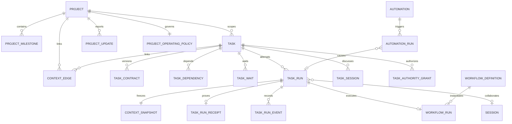

# RFC: Project, Task, TaskRun, Workflow, and Automation Model

> Status: Proposed
>
> Date: 2026-08-20
>
> Owners: Projects, Tasks, Workflows, Automations, Gateway, Web, Mobile, and Storage maintainers
>
> Cutover policy: one-way migration; no runtime or API compatibility layer
>
> Supersedes after acceptance: the Task lifecycle and execution ownership described in `docs/projects-tasks-notes.md`

## 1. Decision

xopc will make `Task` the durable business record for a concrete user commitment and introduce `TaskRun` as the only task execution-attempt boundary.

The model has six primary responsibilities:

- `Project` owns a bounded outcome, shared context, milestones, health, and operating policy.
- `Task` owns the work definition, responsibility, lifecycle, relationships, and acceptance contract.
- `TaskRun` owns one execution attempt, including executor choice, scheduling, authority, context snapshot, lease, and result.
- `WorkflowDefinition` owns a reusable execution recipe.
- `WorkflowRun` owns workflow-engine details and may execute inside a `TaskRun`.
- `Automation` owns a trigger, conditions, safety policy, and a command to issue. It never owns task status.

`Session`, `Context`, `Artifact`, and `TaskRunReceipt` support those primary objects:

- A `Session` is a collaboration channel. It does not own task lifecycle state.
- Context edges identify mutable source relationships; a context snapshot freezes what a run could see.
- Artifacts are inputs or outputs linked with an explicit semantic role.
- A receipt records evidence, verification, failure, and judgment for exactly one run.

The existing mixed task status model, task queue, task runtime fields, direct workflow-to-task projection, and compatibility aliases will be removed. The migration preserves valid user data once, but the new runtime will neither read nor write the old representation.

## 2. Why this change

The current model correctly treats Task as the source of truth and already supports capture versus start, versioned contracts, dependencies, receipts, verification, recovery, and project operating views. Its main structural problem is that `tasks.status` combines three independent concepts:

1. business lifecycle, such as pending or completed;
2. execution state, such as running or verifying;
3. waiting reason, such as dependency, user input, approval, or pause.

Execution state is also duplicated across `tasks`, `task_queue`, `execution_receipts`, `workflow_runs`, sessions, and coordinator services. The result is ambiguous ownership:

- A task can have only one status even when it has several historical attempts or workflow children.
- `active_session_key`, `latest_receipt_run_id`, `next_action`, and `blocked_reason` cache facts owned by other objects.
- A failed attempt can incorrectly make the durable task look failed or blocked forever.
- Waiting for a user and waiting for a dependency are encoded partly as status and partly as unstructured text.
- A workflow linked by `task_id` is not represented as a first-class task execution attempt.
- Automation can react to task events but cannot issue a first-class typed task command.
- Mutable task links and context JSON do not explain which exact context a historical run used.

This RFC removes those ambiguities instead of adding another compatibility or projection layer over them.

Current implementation anchors for the cutover are:

- `packages/gateway-contract/src/tasks.ts` for the mixed Task status and REST contract;
- `src/tasks/task-repository.ts` for Task persistence and runtime fields;
- `src/tasks/task-command-service.ts` and `src/tasks/task-queue.ts` for execution commands and queueing;
- `src/tasks/task-run-coordinator.ts`, `src/tasks/task-controller.ts`, and `src/tasks/task-projection-service.ts` for receipt-driven state mutation;
- `src/tasks/task-workflow-coordinator.ts` for direct WorkflowRun-to-Task projection;
- `src/workflows/domain/run.ts` for duplicated workflow task/project context;
- `src/automations/domain/types.ts` for the current action union;
- `src/storage/sqlite/migrations/099_task_model.sql` for the current released Task schema.

## 3. Goals

- Allow users to create a task without executing it.
- Make simple tasks executable directly by an Agent without requiring a Workflow.
- Allow a Workflow to be selected as a TaskRun executor.
- Preserve a stable task identity across retries, replans, conversations, and executor changes.
- Separate business phase, closure resolution, active execution, and waiting reasons.
- Make human ownership and Agent delegation distinct.
- Make context links typed and make run context reproducible.
- Make every execution attempt idempotent, leased, auditable, and recoverable.
- Make receipts and evidence durable even if sessions are deleted.
- Make Automation issue typed commands rather than mutate task tables directly.
- Give Project a coherent operating policy for proactive behavior.
- Remove legacy runtime models, old API schemas, dual reads, dual writes, and status aliases.

## 4. Non-goals

- This RFC does not require Temporal or another external orchestrator.
- This RFC does not introduce multi-user organization, billing, or RBAC concepts beyond existing local identity and capability boundaries.
- This RFC does not introduce a separate Goal object. Cross-project Portfolio or Initiative objects may be added later.
- This RFC does not require every WorkflowRun or conversation to create a Task.
- This RFC does not make Project deletion delete linked files, sessions, or artifacts automatically.
- This RFC does not preserve the existing Tasks REST or realtime contract.

## 5. Product invariants

The implementation must enforce the following invariants.

1. A Task may exist with zero TaskRuns.
2. A Task may have many TaskRuns, but at most one active root TaskRun by default.
3. Workflow child concurrency occurs inside one root TaskRun, not as competing root runs.
4. Task phase is never inferred by writing from a Session or Workflow repository.
5. A failed TaskRun does not close its Task.
6. A Task is closed only with a non-null resolution.
7. A non-closed Task has a null resolution.
8. `operationalState` is a read-model projection, not a writable task field.
9. Waiting reasons are stored as TaskWait records, not encoded in status strings or blocker text.
10. Before a TaskRun leaves `queued`, it references the exact TaskContract version, ContextSnapshot, and policy snapshot used to start it.
11. A WorkflowRun associated with a Task references `task_run_id`; it does not store a competing direct `task_id`.
12. TaskRunReceipt is durable and does not cascade-delete with a Session.
13. Automation can issue commands but cannot update task or run persistence directly.
14. Every external mutation has a correlation id, causation id, actor, trigger, and idempotency key.
15. Context links are mutable; ContextSnapshots and receipts are immutable after finalization.
16. A TaskRun in `waiting` state has at least one unresolved TaskWait linked to it.

## 6. Terminology and boundaries

### 6.1 Project

A Project is a bounded operating space for an outcome. It is not only a folder and it is not a second task hierarchy.

Project owns:

- outcome and success criteria;
- scope, non-goals, brief, and instructions;
- workspace and default Agent selection;
- owner, target date, health, and lifecycle;
- milestones;
- shared context collection;
- proactive operating policy;
- project updates and decision history.

Project progress and health are projections over tasks, milestones, updates, and risks. Project health is not automatically equal to percentage of completed tasks.

```ts
type ProjectStatus = 'planned' | 'active' | 'paused' | 'completed' | 'cancelled' | 'archived';
type ProjectHealth = 'unknown' | 'on_track' | 'at_risk' | 'off_track';
```

### 6.2 Task

A Task is the durable definition and lifecycle of one concrete commitment.

Task owns:

- title and rich body;
- project, milestone, parent task, labels, priority, and due date;
- human owner and optional Agent delegate;
- business phase and closure resolution;
- current TaskContract version;
- dependency relationships;
- context edges and output destinations;
- task-scoped authority grants;
- optimistic concurrency version.

Task does not own:

- queue state;
- active session;
- active executor status;
- latest receipt pointer;
- unstructured next action or blocker cache;
- workflow node state;
- retry attempt counters.

### 6.3 TaskRun

A TaskRun is one attempt to advance a Task under a fixed contract, context, authority, and executor configuration.

```ts
type TaskExecutorKind = 'agent' | 'workflow' | 'human' | 'external';
```

TaskRun owns:

- attempt identity and root/parent lineage;
- executor kind and immutable executor reference;
- trigger and correlation metadata;
- contract version;
- context and policy snapshots;
- scheduling, retry, lease, heartbeat, cancellation, and timeout state;
- primary run Session reference, if any;
- run lifecycle state;
- terminal outcome and receipt relation.

TaskRun does not own the Task's title, business phase, due date, or closure resolution.

### 6.4 WorkflowDefinition and WorkflowRun

`WorkflowDefinition` remains a versioned reusable graph with input/output schemas, phases, nodes, permissions, resources, and connectors.

`WorkflowRun` remains the workflow engine's execution record and event stream. When it advances a Task:

- the TaskRun has `executor_kind = 'workflow'`;
- the TaskRun stores the immutable workflow definition id and version as executor configuration;
- the WorkflowRun stores `task_run_id`;
- Workflow events update TaskRun through a single executor adapter;
- Task and Project relationships are resolved through TaskRun and Task.

A standalone WorkflowRun is allowed without a TaskRun. It may retain a project scope, but it cannot mutate a Task unless it issues a typed command that creates or attaches a TaskRun.

### 6.5 Session

A Session is a collaboration and transcript boundary. A Task may have:

- one preferred collaboration Session;
- several linked discussion Sessions;
- one optional execution Session per TaskRun;
- workflow child Sessions hidden behind WorkflowRun details.

Session deletion must set references to null or retain opaque provenance. It must not delete TaskRuns, receipts, contracts, or evidence.

### 6.6 Automation

Automation owns:

```text
trigger -> conditions -> policy -> command
```

It can create or update a Task, start a TaskRun, signal a waiting run, invoke a standalone Workflow, publish a Project update, or notify a user. It cannot write task status, phase, waits, runs, or receipts directly.

## 7. Target entity relationship



## 8. Canonical state models

### 8.1 Task phase

```ts
type TaskPhase = 'backlog' | 'ready' | 'active' | 'review' | 'closed';
```

- `backlog`: captured but not yet ready or intentionally deferred.
- `ready`: sufficiently defined and eligible to start when policy and dependencies allow.
- `active`: work has started or is intentionally being advanced.
- `review`: execution claims completion, but verification or human acceptance remains.
- `closed`: no more work is expected under this Task identity.

Allowed transitions:

```text
backlog -> ready -> active -> review -> closed
   |         |        |        |        |
   +---------+--------+--------+--------+-> any earlier non-closed phase via explicit command
```

Reopening a closed task clears resolution and moves it to `ready` or `active`; it never mutates historical runs or receipts.

### 8.2 Task resolution

```ts
type TaskResolution = 'done' | 'cancelled' | 'duplicate' | 'wont_do';
```

Database constraints enforce:

```text
phase = closed  <=>  resolution IS NOT NULL
```

`done` requires the active contract's acceptance policy to be satisfied. System completion is allowed only when verification passes and the contract permits automatic acceptance. Otherwise the Task moves to `review`.

### 8.3 TaskRun status

```ts
type TaskRunStatus =
  | 'queued'
  | 'running'
  | 'waiting'
  | 'verifying'
  | 'succeeded'
  | 'failed'
  | 'cancelled';
```

Terminal states are `succeeded`, `failed`, and `cancelled`.

```text
queued -> running -> waiting -> running
   |         |          |
   |         +-------> verifying -> succeeded
   |         |              |----> failed
   |         +-------------------> failed
   +------------------------------> cancelled
```

A restart does not turn all active runs into failed runs. Expired leases move back to a recoverable dispatch state according to the executor adapter. A run becomes failed only when recovery is impossible or its retry policy is exhausted.

### 8.4 TaskWait

```ts
type TaskWaitKind =
  | 'dependency'
  | 'user_input'
  | 'approval'
  | 'external_event'
  | 'scheduled_time'
  | 'retry_backoff'
  | 'paused';

type TaskWaitStatus = 'active' | 'resolved' | 'cancelled';
```

A wait records structured resume conditions:

- dependency task id;
- requested input or approval schema;
- external correlation key;
- `resumeAt`;
- originating TaskRun;
- resolution actor and payload.

Several waits may exist, but only unresolved waits participate in projection.

### 8.5 Derived operational state

```ts
type TaskOperationalState =
  | 'idle'
  | 'queued'
  | 'running'
  | 'waiting'
  | 'verifying'
  | 'blocked';
```

This field is computed by `TaskReadModelProjector` and is never accepted in a write request.

Projection precedence is deterministic:

1. If `phase = closed`, return `idle`.
2. If an active root TaskRun is `running`, return `running`.
3. If an active root TaskRun is `verifying`, return `verifying`.
4. If an active root TaskRun is `queued`, return `queued`.
5. If an unresolved wait is `user_input`, `approval`, `external_event`, `scheduled_time`, `retry_backoff`, or `paused`, return `waiting`.
6. If an unresolved dependency wait exists, return `blocked`.
7. If the latest root TaskRun failed without a scheduled retry, return `blocked` with attention reason `run_failed`.
8. If required dependencies are incomplete, return `blocked` and repair the missing dependency waits asynchronously.
9. Otherwise return `idle`.

If corrupted data satisfies several branches, the projector follows the precedence above and emits an integrity event. Repository constraints should make that exceptional.

### 8.6 User attention

Attention is separate from operational state:

```ts
type TaskAttentionKind =
  | 'input_required'
  | 'approval_required'
  | 'dependency_blocked'
  | 'run_failed'
  | 'verification_failed'
  | 'overdue'
  | 'stale';
```

Attention items point to the specific wait, run, criterion, or due date that caused them. The Home and Project views read this projection rather than synthesizing duplicate cards.

## 9. Proposed persistence model

All timestamps are integer Unix milliseconds. JSON columns are validated at repository boundaries. Identifiers are opaque strings. Foreign keys are enabled for every connection.

### 9.1 Projects

The existing projects table is rebuilt to add business outcome fields while retaining workspace behavior.

```text
projects
  project_id PK
  name
  slug UNIQUE
  description
  outcome
  success_criteria_json
  scope_json
  non_goals_json
  status
  health
  owner_id
  target_at
  default_agent_id
  workspace_root
  workspace_mode
  brief
  instructions
  version
  created_at
  updated_at
  last_active_at
  pinned_at
```

Separate tables store milestones and updates:

```text
project_milestones
  milestone_id PK, project_id FK, title, description, status,
  target_at, sort_order, created_at, updated_at

project_updates
  update_id PK, project_id FK, health, summary, progress_json,
  risks_json, next_steps_json, actor_json, created_at
```

### 9.2 Tasks

```text
tasks
  task_id PK
  creation_idempotency_key UNIQUE NULL
  project_id FK NULL
  milestone_id FK NULL
  parent_task_id FK NULL
  title
  body
  phase
  resolution NULL
  priority
  due_at NULL
  owner_id NULL
  delegate_agent_id NULL
  source
  locale NULL
  latest_contract_version
  version
  created_at
  updated_at
  closed_at NULL
```

Constraints:

- phase and resolution obey the invariant in section 8.2;
- a task cannot parent itself;
- milestone must belong to the same project;
- optimistic writes use integer `version`, not timestamp equality;
- parent cycles and dependency cycles are rejected by application services inside the write transaction.

`task_contracts` remains versioned, but adds acceptance policy and output destinations:

```ts
type TaskAcceptancePolicy = 'verified_auto' | 'verified_then_review' | 'manual';
```

```text
task_contracts
  task_id FK
  version
  objective
  expected_outputs_json
  acceptance_criteria_json
  constraints_json
  approval_required_json
  assumptions_json
  risks_json
  acceptance_policy
  output_destinations_json
  created_by_json
  created_at
  PK(task_id, version)
```

### 9.3 Relationships, waits, and authority

```text
task_dependencies
  task_id FK
  depends_on_task_id FK
  dependency_kind
  created_at
  PK(task_id, depends_on_task_id)

task_sessions
  task_session_id PK
  task_id FK
  session_key FK ON DELETE SET NULL
  role
  created_at

task_waits
  wait_id PK
  task_id FK
  task_run_id FK NULL
  kind
  status
  reason
  condition_json
  resume_at NULL
  resolved_by_json NULL
  resolution_json NULL
  created_at
  resolved_at NULL

task_authority_grants
  grant_id PK
  task_id FK
  capability
  scope_json
  granted_by_json
  granted_at
  expires_at NULL
  revoked_at NULL
```

### 9.4 TaskRuns

```text
task_runs
  run_id PK
  task_id FK
  root_run_id FK
  parent_run_id FK NULL
  attempt
  status
  executor_kind
  executor_ref_json
  trigger_json
  correlation_id
  causation_id NULL
  idempotency_key UNIQUE
  contract_version
  context_snapshot_id FK NULL
  policy_snapshot_json NULL
  session_key FK ON DELETE SET NULL
  queued_at
  scheduled_at NULL
  started_at NULL
  heartbeat_at NULL
  completed_at NULL
  timeout_at NULL
  lease_owner NULL
  lease_expires_at NULL
  retry_policy_json
  retry_of_run_id FK NULL
  terminal_code NULL
  terminal_message NULL
  version
```

Indexes:

- `(task_id, queued_at DESC)`;
- `(status, scheduled_at, queued_at)`;
- `(lease_expires_at)` for active leased runs;
- `(root_run_id, queued_at)`;
- unique partial index on active root run per task;
- unique `(task_id, attempt)` for root runs.

The partial uniqueness condition is conceptually:

```sql
UNIQUE(task_id)
WHERE parent_run_id IS NULL
  AND status IN ('queued', 'running', 'waiting', 'verifying')
```

For a root run, `root_run_id = run_id` and `parent_run_id IS NULL`. Child runs share their root's id. A retry is a new root run linked to the previous attempt by `retry_of_run_id`.

`task_run_events` is append-only and provides recovery/audit history:

```text
task_run_events
  event_id PK
  run_id FK
  sequence
  type
  payload_json
  actor_json
  occurred_at
  UNIQUE(run_id, sequence)
```

### 9.5 Receipts

The legacy `execution_receipts` table is replaced by `task_run_receipts`.

```text
task_run_receipts
  run_id PK FK task_runs
  status
  summary
  changes_json
  evidence_json
  verification_json
  remaining_work_json
  next_action NULL
  needs_user
  completion_verdict NULL
  failure_json NULL
  judgment_json NULL
  feedback_json NULL
  context_trace_id NULL
  finalized_at
```

The receipt is immutable after finalization except for a separate append-only feedback record. Corrections create a new TaskContract version and a new TaskRun; they do not rewrite prior evidence.

### 9.6 Context

Mutable relationships and immutable run snapshots are distinct.

```text
context_edges
  edge_id PK
  owner_kind
  owner_id
  target_kind
  target_id
  role
  title NULL
  pinned
  retrieval_policy_json
  metadata_json
  created_by_json
  created_at
  updated_at

context_snapshots
  snapshot_id PK
  owner_kind
  owner_id
  query
  authorization_snapshot_json
  allocation_json
  estimated_tokens
  content_hash
  created_at

context_snapshot_items
  snapshot_id FK
  ordinal
  target_kind
  target_id
  role
  decision
  reason NULL
  content_hash NULL
  observed_version NULL
  provenance_json
  PK(snapshot_id, ordinal)
```

Roles are `input`, `reference`, `constraint`, `deliverable`, and `evidence`. A queued TaskRun may omit its snapshots so a scheduled run can use current authorized context at dispatch time. The dispatcher must commit context and policy snapshots before changing it to `running` or invoking any executor. Once assigned, snapshot references are immutable.

### 9.7 Command idempotency and outbox

```text
command_deduplication
  idempotency_key PK
  command_type
  subject_kind
  subject_id NULL
  request_hash
  result_json
  created_at

domain_outbox
  event_id PK
  event_type
  subject_kind
  subject_id
  correlation_id
  causation_id NULL
  payload_json
  created_at
  published_at NULL
  attempts
```

Domain writes and outbox insertion occur in the same SQLite transaction. Automation and proactive consumers never depend on an in-memory event emitted before commit.

## 10. API cutover

The existing endpoint paths may be reused, but their request and response schemas are replaced atomically. There is no `/v1` fallback, compatibility query parameter, legacy response field, or dual event publication.

All write bodies use strict discriminated schemas and an `idempotencyKey`. All mutable resource writes use `expectedVersion`.

### 10.1 Task create

```http
POST /api/tasks
```

```json
{
  "idempotencyKey": "uuid",
  "title": "Ship the August release",
  "body": "Prepare, verify, and publish the release.",
  "projectId": "project-id",
  "milestoneId": "milestone-id",
  "parentTaskId": null,
  "priority": "high",
  "dueAt": 1787155200000,
  "ownerId": "local-user",
  "delegateAgentId": "main",
  "contract": {
    "objective": "Publish a verified release",
    "expectedOutputs": ["release artifact", "release notes"],
    "acceptanceCriteria": ["tests pass", "artifact is published"],
    "constraints": [],
    "approvalRequired": ["public publish"],
    "assumptions": [],
    "risks": [],
    "acceptancePolicy": "verified_then_review"
  },
  "dependencies": [],
  "context": [],
  "activation": {
    "mode": "capture"
  }
}
```

For immediate execution, `activation` is:

```json
{
  "mode": "start",
  "executor": {
    "kind": "agent",
    "agentId": "main"
  }
}
```

The transaction creates Task, TaskContract, dependencies, context edges, authority grants, command-deduplication result, and outbox events. If activation is `start`, TaskRun creation happens in the same transaction or through a causally linked command whose result is returned.

### 10.2 Task reads and edits

```text
GET    /api/tasks
GET    /api/tasks/:taskId
PATCH  /api/tasks/:taskId
DELETE /api/tasks/:taskId
```

List filters include project, phase, resolution, operational state, attention kind, owner, delegate, milestone, label, due range, and text query.

Task detail returns:

- canonical Task and current TaskContract;
- derived operational state and attention;
- active waits;
- dependencies and dependents;
- linked context;
- TaskRun summaries;
- receipts and activity timeline;
- allowed commands calculated from state and authority.

`PATCH` edits task-owned fields only. It cannot write operational state, run state, blocker text, latest receipt, or session state.

Task deletion is destructive and cascades task-owned contracts, waits, context edges, and run records. The UI must distinguish delete from close/cancel. Sessions, workspace files, and external artifacts are not deleted.

### 10.3 Task commands

```http
POST /api/tasks/:taskId/commands
```

Commands replace the old `run | pause | resume | verify | cancel` action schema:

```ts
type TaskCommand =
  | { type: 'mark_ready' }
  | { type: 'start'; executor: TaskExecutorSelection; scheduleAt?: number }
  | { type: 'request_review' }
  | { type: 'close'; resolution: TaskResolution }
  | { type: 'reopen'; phase: 'ready' | 'active' }
  | { type: 'add_wait'; wait: TaskWaitInput }
  | { type: 'resolve_wait'; waitId: string; resolution?: unknown }
  | { type: 'delegate'; agentId?: string }
  | { type: 'revise_contract'; contract: TaskContractInput };
```

Run-level controls do not masquerade as task commands:

```text
POST /api/task-runs/:runId/cancel
POST /api/task-runs/:runId/signal
POST /api/task-runs/:runId/retry
GET  /api/task-runs/:runId
GET  /api/task-runs/:runId/events
```

### 10.4 Context and relationships

```text
GET    /api/tasks/:taskId/context
POST   /api/tasks/:taskId/context
PATCH  /api/tasks/:taskId/context/:edgeId
DELETE /api/tasks/:taskId/context/:edgeId

PUT    /api/tasks/:taskId/dependencies
GET    /api/tasks/:taskId/sessions
POST   /api/tasks/:taskId/sessions
```

Attachments use the same context API with target kind `file` or `artifact`; there is no separate task attachment truth.

### 10.5 Workflow changes

When a workflow executes for a Task:

- Workflow start accepts `taskRunId`, not `taskId`;
- the TaskRun executor adapter validates that definition id/version matches the immutable executor reference;
- workflow metadata does not duplicate Task contract, Project id, or mutable context refs;
- workflow terminal events finalize the TaskRun through the adapter;
- standalone workflow APIs continue to omit `taskRunId`.

### 10.6 Automation changes

Automation action becomes a discriminated union containing first-class commands:

```ts
type AutomationAction =
  | { kind: 'task.create'; input: TaskCreateTemplate }
  | { kind: 'task.command'; taskRef: ValueExpression; command: TaskCommandTemplate }
  | { kind: 'task.signal'; runRef: ValueExpression; signal: SignalTemplate }
  | { kind: 'workflow.run'; workflowId: string; input: unknown }
  | { kind: 'agent.run'; instruction: string }
  | { kind: 'project.update'; input: ProjectUpdateTemplate }
  | { kind: 'notify'; input: NotificationTemplate }
  | { kind: 'browser_recipe'; recipeId: string; input: unknown };
```

`task.command` calls the same command service as REST, Agent tools, and UI. No Automation code imports task repositories.

## 11. Domain events

The old `task.status_changed.v1` event is removed. New event types are:

```text
task.created.v2
task.updated.v2
task.deleted.v1
task.phase_changed.v1
task.closed.v1
task.reopened.v1
task.contract_revised.v1
task.wait_created.v1
task.wait_resolved.v1
task.context_linked.v1
task.context_unlinked.v1
task_run.created.v1
task_run.started.v1
task_run.waiting.v1
task_run.resumed.v1
task_run.verifying.v1
task_run.succeeded.v1
task_run.failed.v1
task_run.cancelled.v1
task_run.receipt_finalized.v1
project.health_changed.v1
project.update_published.v1
```

Event envelopes use the existing activity/proactive correlation vocabulary: actor, source, subject, project scope, correlation id, causation id, dedupe key, and occurred time.

Existing proactive scenario subscriptions are replaced in the migration. No old event is emitted in parallel.

## 12. Execution flow

### 12.1 Capture only

```text
CreateTask(capture)
  -> persist Task + Contract + ContextEdges
  -> phase = backlog or ready according to explicit input
  -> publish task.created.v2
  -> return without TaskRun
```

AI preparation may later propose a revised contract, dependencies, or executor. It must use commands and cannot silently start unless Project policy authorizes that action.

### 12.2 Start

```text
StartTask command
  -> validate Task is open and no active root run exists
  -> validate dependencies and authority
  -> create structured waits if blocked
  -> freeze TaskContract version and executor selection
  -> create queued TaskRun with idempotency key
  -> commit outbox event
  -> dispatcher leases TaskRun
  -> dispatcher freezes ContextSnapshot + PolicySnapshot
  -> executor adapter starts Agent or Workflow
```

### 12.3 Completion

```text
Executor terminal result
  -> collect changes and evidence
  -> verify against frozen contract
  -> finalize TaskRunReceipt
  -> mark TaskRun terminal
  -> projector evaluates Task phase
  -> close automatically only when acceptance policy allows
  -> otherwise move Task to review or create a wait
  -> release dependency waits
  -> publish outbox events
```

The entire terminal persistence update occurs in one transaction. External notifications and Automation dispatch occur from the outbox after commit.

### 12.4 Retry and replan

A retry always creates a new root TaskRun with `retry_of_run_id`. It never reopens or mutates the prior run. A changed strategy, executor, contract, context, or authority produces new immutable snapshots.

Automatic retry requires:

- same Task and approved scope;
- reversible or read-only action boundary;
- remaining retry budget;
- no unresolved user or approval wait;
- executor-specific recoverability;
- no repeated no-progress judgment.

## 13. Proactive operating policy

Project monitoring and Task continuation policy are unified as `ProjectOperatingPolicy`.

```ts
type ProjectOperatingMode = 'observe' | 'assist' | 'autopilot';

interface ProjectOperatingPolicy {
  mode: ProjectOperatingMode;
  allowedCommands: string[];
  allowedCapabilities: string[];
  quietHours?: QuietHours;
  confidenceThreshold: number;
  maxRunCost?: number;
  maxDailyCost?: number;
  maxConcurrentRootRuns: number;
  externalEffectPolicy: 'always_ask' | 'allow_scoped';
  irreversibleEffectPolicy: 'always_ask';
  scenarioSubscriptions: string[];
}
```

- `observe` records or recommends only.
- `assist` may prepare contracts, context, drafts, and proposed commands, but asks before execution mutations.
- `autopilot` may issue allow-listed, scoped, reversible commands within budgets.

Policy evaluation returns a decision with reasons and a policy snapshot. It is used by Task start, retry, Automation, and proactive scenarios. The current separate monitoring disposition and same-task continuation guard are removed.

## 14. One-way database migration

The target migration is named `100_project_task_taskrun.sql` unless another migration is merged first. It runs only while the gateway is stopped. It is transactional where SQLite DDL permits and is preceded by an automatic database backup plus `PRAGMA integrity_check`.

This is data preservation, not runtime compatibility. After commit, only the new schema exists.

### 14.1 Migration sequence

1. Refuse migration if active gateway/worker leases are detected.
2. Create a timestamped database backup in the xopc state backup directory.
3. Run foreign-key and integrity preflight checks.
4. Create all `_next` target tables and indexes.
5. Copy Projects and initialize new Project fields.
6. Copy Tasks and deterministically map legacy status to phase/resolution/waits.
7. Copy TaskContracts and add explicit acceptance policy.
8. Convert execution receipts into TaskRuns and TaskRunReceipts.
9. Convert live task queue entries into queued TaskRuns.
10. Convert task links, attachments, sessions, and context snapshots.
11. Convert approved boundaries into task authority grants.
12. Update WorkflowRuns to reference TaskRuns where a matching task execution exists.
13. Replace proactive scenario subscriptions and remove old task status events.
14. Validate counts, foreign keys, phase/resolution constraints, run/receipt identity, and active-root uniqueness.
15. Drop legacy tables.
16. Rename `_next` tables atomically.
17. Record schema version and migration report.
18. Run post-migration integrity checks before gateway startup.

There is no down migration. Rollback restores the backup and previous binary.

### 14.2 Task status mapping

| Old status | New phase | New resolution | Additional migration action |
|---|---|---|---|
| `pending` | `backlog` | null | none |
| `planning` | `active` | null | create no synthetic active run |
| `waiting_dependency` | `active` | null | create dependency waits for every incomplete dependency |
| `running` | `active` | null | migrate matching receipt/run; interrupt unrecoverable active work |
| `verifying` | `review` | null | migrate matching run as interrupted unless durable verification can resume |
| `needs_user` | `active` | null | create `user_input` or `approval` wait from available evidence |
| `blocked` | `active` | null | dependency wait when provable, otherwise `external_event` wait |
| `paused` | `active` | null | create `paused` wait |
| `completed` | `closed` | `done` | preserve verification receipt |
| `cancelled` | `closed` | `cancelled` | none |

Migration-inferred waits carry provenance `migration` and preserve the original next action and blocker text in their structured condition payload. Runtime code never contains the old status enum.

### 14.3 Receipt and run mapping

Every `execution_receipts.run_id` becomes a `task_runs.run_id` and a matching `task_run_receipts.run_id` when `task_id` is present.

- old `running` becomes `failed` with terminal code `migration_interrupted` unless an executor-specific durable checkpoint proves it resumable;
- old `succeeded` becomes `succeeded`;
- old `failed` becomes `failed`;
- old `cancelled` becomes `cancelled`;
- origin and matching WorkflowRun determine executor kind;
- contract version, attempt, strategy, session, trigger, parent run, evidence, verification, judgment, and feedback are copied;
- the Session foreign key changes from cascade delete to set-null behavior.

`task_id` and `contract_version` are not duplicated into the new receipt table. They are resolved through its TaskRun, which is the canonical attempt envelope.

Legacy receipt `parent_run_id` is treated as retry lineage and migrates to `retry_of_run_id` unless workflow event history proves it was a true child execution. Each migrated retry remains a root run with `root_run_id = run_id`.

Receipts without a Task remain in an archived migration export and are not loaded by the new Task runtime. Standalone WorkflowRun history remains in workflow storage.

### 14.4 Task queue mapping

The `task_queue` table is removed.

- `queued` becomes a queued TaskRun;
- `scheduled` becomes a queued TaskRun with `scheduled_at`;
- `retry_waiting` becomes a queued retry TaskRun with `scheduled_at = next_run_at`;
- `running` becomes a failed TaskRun with `migration_interrupted` unless it matches a resumable executor checkpoint;
- terminal queue rows are discarded after corresponding receipts are validated;
- `skipped` rows are discarded after being counted in the migration report.

Queue conversion first correlates rows with receipts by Task, Session, time window, and payload provenance. A correlated queue row does not create a second TaskRun. If several uncorrelated non-terminal queue rows target the same Task, the newest eligible intent is retained and older intents are archived in the migration report. This guarantees the one-active-root invariant without carrying forward ambiguous queue state.

The new TaskRun dispatcher replaces every task queue reader and writer.

### 14.5 Policy and Automation mapping

Project monitoring policy is migrated directly:

| Old mode | New mode |
|---|---|
| `observe` | `observe` |
| `ask_before_action` | `assist` |
| `auto_low_risk` | `autopilot` |

Quiet hours, confidence threshold, scenario subscriptions, and allow-listed actions are copied into the new policy shape. New cost, concurrency, and external-effect fields receive conservative defaults.

Existing Project status maps without aliases: `active -> active`, `paused -> paused`, and `archived -> archived`. New outcome, success criteria, health, owner, and target fields default to empty or `unknown`; the migration does not invent business commitments.

Built-in proactive scenarios are deleted and reseeded with the new event contracts. User Automations using `task.status_changed` cannot be mapped safely because one old status can represent phase, run state, or wait state. Those Automations are preserved but disabled with `requires_migration_review`, and the migration report includes their ids and old trigger configuration. The runtime does not emulate the old event.

Existing Agent, standalone Workflow, and browser-recipe actions retain their meaning under the new Automation action union. No old Automation action writes Task status directly.

### 14.6 Links and runtime fields

Legacy fields are handled as follows:

| Legacy field/table | Target |
|---|---|
| `tasks.objective` | Task title fallback plus TaskContract objective |
| `tasks.description` / `context_text` | Task body, preserving both when distinct |
| `tasks.agent_id` | `delegate_agent_id` |
| `tasks.active_session_key` | `task_sessions(role = 'primary')` and matching TaskRun session |
| `tasks.next_action` | active migrated wait or latest receipt |
| `tasks.blocked_reason` | active migrated wait |
| `tasks.context_attachments_json` | context edges with role `input` |
| `tasks.approved_boundaries_json` | active task authority grants |
| `tasks.latest_receipt_run_id` | removed; derived from TaskRuns |
| `task_links(project)` | canonical `project_id`; duplicate link dropped |
| `task_links(session)` | `task_sessions` |
| `task_links(artifact/source)` | `context_edges` |
| `task_links(workflow/automation)` | TaskRun trigger/executor provenance or generic activity link |
| `context_snapshots.task_id/run_id` | normalized snapshot owner and items |

If no usable title exists, migration derives it from the first non-empty objective line with a bounded length. The full objective remains unchanged in the contract.

### 14.7 Migration validation

Migration aborts before dropping old tables unless all checks pass:

- every old Task has exactly one new Task;
- every TaskContract has a matching Task and preserves version order;
- every Task with phase `closed` has a resolution and vice versa;
- every migrated TaskRun references an existing Task and contract version;
- every migrated TaskRunReceipt references exactly one TaskRun;
- no Task has more than one active root run;
- no dependency or parent self-cycle exists;
- project and milestone relationships are valid;
- all context snapshot item hashes and counts match migration expectations;
- `PRAGMA foreign_key_check` returns no rows;
- `PRAGMA integrity_check` returns `ok`.

The migration writes a bounded JSON report containing input/output counts, inferred fields, discarded terminal queue rows, archived orphan receipts, and interrupted runs.

## 15. Legacy removal

The breaking release removes, rather than deprecates, all old runtime behavior.

### 15.1 Storage and domain removal

- Drop `task_queue` and its worker implementation.
- Drop legacy `execution_receipts` after migration.
- Remove writable `tasks.status`.
- Remove `active_session_key`, `next_action`, `blocked_reason`, `latest_receipt_run_id`, context attachment JSON, and approved-boundary JSON from Task.
- Remove direct `workflow_runs.task_id`.
- Remove status projection code that writes Task from receipts.
- Remove coordinator code that converts terminal WorkflowRun directly into Task status.
- Remove special handling for `pending`, `planning`, `waiting_dependency`, `running`, `verifying`, `needs_user`, `blocked`, `paused`, `completed`, and `cancelled` as Task statuses.

### 15.2 API and client removal

- Delete `TaskStatusSchema` and the old Task Action schema.
- Delete capture/start response variants based on old status names.
- Delete old task-copy maps and board-lane maps in Web and Mobile.
- Delete Agent tool manuals that teach the old status/action contract.
- Delete direct consumers of `latestReceiptRunId` and `activeSessionKey`.
- Replace old Task realtime event handlers; do not accept both event families.

### 15.3 Service replacement

The responsibilities currently spread across TaskCommandService, TaskQueue, TaskRunCoordinator, TaskWorkflowCoordinator, TaskProjectionService, and TaskController are replaced by:

```text
TaskApplicationService       canonical Task commands and transactions
TaskRunService               create, lease, signal, retry, cancel, finalize
TaskExecutorRegistry         agent/workflow/human/external adapters
TaskReadModelProjector       operational state, attention, boards, Home
TaskContextService           mutable links and immutable snapshots
TaskVerificationService      receipt construction and acceptance evaluation
ProjectOperatingPolicy      one proactive authorization decision point
DomainOutboxPublisher        reliable event publication
```

Old services are deleted when their replacement lands. Empty wrappers, aliases, and pass-through adapters are not retained.

Historical SQL migrations remain immutable for installed databases. They are not runtime compatibility logic. A later baseline-squash release may replace the fresh-install migration chain after the new schema has shipped and upgrade coverage is no longer required.

## 16. Rollout plan

The rollout is phased as engineering work but released as a single breaking schema/API cutover. No production phase runs both models.

### Phase 0: Freeze and executable specification

Deliverables:

- accept this RFC;
- add Zod contracts for the target domain in an isolated package branch;
- add migration fixtures captured from schema 099;
- add state transition and projection tables as executable tests;
- inventory all old enum, queue, receipt, and workflow task-link consumers;
- define release maintenance and backup UX.

Exit criteria:

- every current status and action has an explicit target behavior;
- no unresolved ownership exists between TaskRun and WorkflowRun;
- migration fixtures cover empty, normal, active, blocked, completed, and corrupted databases.

### Phase 1: Storage and domain core

Deliverables:

- migration 100 and new repositories;
- Task, TaskContract, TaskWait, TaskRun, Receipt, Context, and policy domain types;
- TaskApplicationService and TaskRunService;
- command idempotency and domain outbox;
- TaskReadModelProjector;
- one direct Agent executor adapter;
- deletion of task queue and old projection/controller path.

Exit criteria:

- fresh and migrated databases pass integrity tests;
- capture creates zero runs;
- start creates exactly one active root run;
- restart recovers a leased direct Agent run or deterministically marks it terminal;
- no active server code references the old Task status enum or task queue.

### Phase 2: Workflow and Automation integration

Deliverables:

- Workflow executor adapter and `workflow_runs.task_run_id`;
- standalone WorkflowRun behavior;
- typed Automation task actions;
- Signal/resume support for waits;
- retry/replan behavior using new TaskRuns;
- replacement proactive scenario subscriptions.

Exit criteria:

- a Workflow can complete a Task only through its TaskRun;
- Automation can create/start/signal Tasks only through application commands;
- workflow restart and retry do not duplicate root TaskRuns;
- correlation and causation are visible end to end.

### Phase 3: Gateway, Web, Mobile, and Agent tools

Deliverables:

- replacement REST/realtime contracts;
- Task detail with work definition, properties, context, discussion, runs, receipts, and timeline;
- explicit Save, Start, Delegate, Run Workflow, Schedule, and Close interactions;
- Project overview with milestones, health, running work, blockers, context, and updates;
- new Agent tool schemas and manuals;
- removal of every legacy client path and copy string.

Exit criteria:

- Web and Mobile consume only the new contract;
- Task status cannot be edited directly from any UI or Agent tool;
- the user can distinguish human owner, Agent delegate, and active executor;
- context used by a historical run is inspectable.

### Phase 4: Breaking release and cleanup

Deliverables:

- maintenance-mode release flow;
- automatic backup and migration report;
- documentation rewrite;
- runtime source scan that rejects legacy identifiers;
- removal of temporary development scaffolding and unused fixtures.

Exit criteria:

- release upgrade succeeds against representative production-sized fixtures;
- rollback from a failed migration restores the previous database and binary;
- no dual read, dual write, compatibility response, old event, or hidden legacy table remains;
- telemetry shows no orphan run, duplicate active root run, or receipt without a run.

### Phase 5: Project operating system

This phase builds on the clean execution model:

- milestones and project updates;
- richer Project health projections;
- decision log and context collections;
- observe/assist/autopilot UI;
- AI contract preparation and task decomposition;
- executor recommendation;
- cross-project Portfolio/Initiative only when justified by real usage.

## 17. Testing strategy

### Migration tests

- migrate a fresh schema-099 database;
- migrate every old Task status;
- migrate multiple receipts and retry chains;
- migrate queued, scheduled, running, retry-waiting, and terminal queue rows;
- migrate orphaned sessions and deleted projects;
- verify interrupted run behavior;
- inject constraint violations and prove migration aborts before destructive drops;
- verify backup restoration.

### Domain tests

- phase/resolution invariant;
- dependency and parent cycle rejection;
- one active root run per task under concurrent start commands;
- command idempotency with same key/same payload and same key/different payload;
- wait creation and resolution;
- contract revision and immutable run snapshots;
- close/reopen behavior;
- receipt immutability and feedback append.

### Execution tests

- direct Agent success, failure, cancellation, timeout, and restart;
- Workflow executor success, wait, signal, retry, replay, and cancellation;
- expired lease recovery;
- no-progress retry cutoff;
- approval and external-effect boundaries;
- outbox retry without duplicate Automation execution.

### Projection tests

Use table-driven and property tests for every combination of:

- task phase/resolution;
- active root run state;
- active wait kind;
- incomplete dependencies;
- latest terminal run;
- verification result;
- overdue and stale conditions.

The read model must be rebuildable from canonical tables and events.

### Contract and UI tests

- strict request rejection for removed legacy fields;
- REST and realtime schema tests;
- capture without execution;
- immediate start;
- delegate Agent versus human owner display;
- run history and evidence inspection;
- context link and snapshot inspection;
- approval and input waits;
- close, cancel, and delete remain visibly distinct.

## 18. Observability and metrics

Every command and run log includes task id, run id, project id, executor kind, correlation id, causation id, contract version, context snapshot id, attempt, and phase.

Operational metrics:

- active root-run uniqueness violations;
- lease recovery count and age;
- queued-to-start latency;
- run duration by executor;
- wait duration by kind;
- retry and no-progress rate;
- verification pass/fail rate;
- receipt/evidence coverage;
- outbox lag and duplicate suppression;
- context snapshot size and truncation;
- migration inferred/discarded/interrupted counts.

Product metrics:

- captured Tasks that later start;
- time from capture to first run;
- verified completion and reopen rate;
- approval burden;
- Agent suggestions accepted or rejected;
- automatic action rollback/failure rate;
- dependency-blocked time;
- Project update freshness and milestone predictability.

## 19. Security and authority

- Context snapshot creation enforces the caller's current authorization and records the authorization version.
- A TaskRun cannot gain capabilities after creation without a new authority grant and a new policy snapshot.
- External, irreversible, destructive, permission-changing, or paid effects require explicit approval unless a narrowly scoped existing grant allows the exact action.
- Agent delegation is not ownership transfer.
- Automation inherits neither gateway authority nor Agent manifest authority implicitly; the effective intersection is recorded in the policy snapshot.
- Secrets are referenced, never copied into Task bodies, context edges, events, receipts, or logs.

## 20. Alternatives considered

### Keep the current Task status and add TaskRun

Rejected. It preserves two sources of execution truth and requires permanent reconciliation rules.

### Make WorkflowRun the universal execution object

Rejected. Simple Agent tasks should not require a workflow graph, and WorkflowRun contains engine-specific concepts that do not belong to every task attempt.

### Treat every conversation as a TaskRun

Rejected. Exploration and discussion may never become committed work. Session retention and deletion semantics are also unsuitable for durable execution evidence.

### Require every WorkflowRun to have a Task

Rejected. Standalone automation, experiments, authoring previews, and reusable workflow testing should not pollute Task lists.

### Adopt Temporal immediately

Rejected for this cutover. The domain boundaries and command model must be correct regardless of orchestrator. A future Temporal adapter can implement TaskRun execution when long waits, multi-worker scale, signals, and recovery requirements justify the operational cost.

### Preserve old APIs through a v1 adapter

Rejected by decision. Compatibility would keep the mixed status semantics alive, lengthen dual-write risk, and prevent deletion of legacy services.

## 21. Open implementation decisions

These choices must be resolved before Phase 1 code merges, but do not change the entity boundaries:

- whether Task body is stored as Markdown text or a Note/document reference plus summary;
- whether user identity initially uses a fixed local owner id or a generalized actor reference;
- which Workflow checkpoints are sufficiently durable to resume during migration;
- retention limits for TaskRun events and large context snapshot metadata;
- whether standalone Agent runs need a more general future `WorkRun` abstraction;
- exact Project health calculation and whether health remains manually overridable;
- baseline-squash timing for fresh installations after migration 100 ships.

## 22. Acceptance criteria for this RFC

The architecture is ready for implementation when reviewers agree that:

- Task is the sole business work record;
- TaskRun is the sole task execution-attempt record;
- WorkflowRun is an executor detail linked through TaskRun;
- Task phase, resolution, waits, and operational projection are unambiguous;
- the one-way migration preserves valid user data without keeping runtime compatibility;
- old APIs, events, queue, statuses, fields, coordinators, and client mappings have explicit deletion owners;
- each rollout phase has testable exit criteria;
- rollback is backup restoration, not a dual-schema mode.
