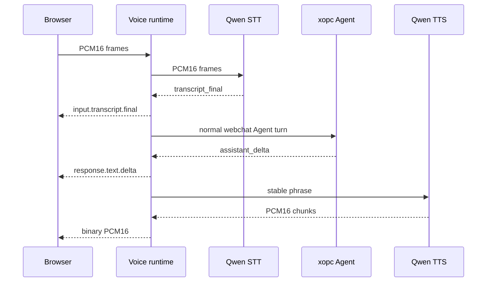

# Realtime voice technical design

> Status: Implemented
>
> Date: 2026-09-04
>
> Product contract: [Realtime voice PRD](./realtime-voice-prd.md)
>
> Wire contract: [Realtime voice WebSocket protocol](./realtime-voice-websocket-protocol.md)

## 1. Architecture

Realtime voice is an ephemeral gateway runtime around existing provider and Agent boundaries:

```text
Browser PCM16
  <-> VoiceRealtimeRuntime
      -> MediaUnderstandingProvider.openAudioStream()
      -> GatewayAgentRunner.runAgent()
      -> SpeechProviderPlugin.synthesizeStream()
  <-> Browser PCM player
```

There is one browser protocol and one session runtime. Provider wire formats do not leak to the browser. Voice turns do not create a second transcript path.

The general gateway realtime socket remains unchanged because it intentionally handles JSON topic events rather than binary media.

## 2. Source layout

| Area | Source |
|---|---|
| Shared wire schemas | `packages/realtime-protocol/src/voice.ts` |
| Session/ticket/WebSocket runtime | `src/voice/realtime/runtime.ts` |
| Phrase segmentation | `src/voice/realtime/speakable-segmenter.ts` |
| DashScope streaming STT | `src/voice/dashscope/streaming-stt-session.ts` |
| DashScope streaming TTS | `src/voice/dashscope/streaming-tts-stream.ts` |
| Provider integration | `src/voice/stt/providers/{alibaba,xopc-cloud}-transcription.ts` |
| Provider integration | `src/voice/tts/providers/{alibaba,xopc-cloud}-speech.ts` |
| HTTP session route | `src/gateway/hono/routes/voice.ts` |
| Browser client/player | `web/src/features/voice/realtime/` |
| Capture/resampling | `web/src/features/chat/composer/pcm-wav-recorder.ts` |
| Composer lifecycle | `web/src/features/chat/composer/use-composer-voice-input.ts` |

There are no separate ticket store, session manager, Agent bridge, provider registry, audio transport abstraction, or compatibility adapter. Those would duplicate existing ownership without changing runtime behavior.

## 3. Configuration and preflight

Provider credentials remain in `tools.media.audio` and `messages.tts`. Conversation output can select a voice independently of ordinary message readout:

```ts
interface RealtimeVoiceConfig {
  enabled: boolean;
  silenceDurationMs: number;
  idleTimeoutMs: number;
  maxDictationMs: number;
  maxConversationMs: number;
  bargeIn: boolean;
  tts?: { provider: 'alibaba' | 'xopc-cloud'; voice?: string };
}
```

Session creation:

1. clones the current config;
2. verifies realtime voice is enabled;
3. resolves an existing streaming STT provider;
4. for conversation, verifies the Chat exists, is idle, has no reserved voice connection, and has native PCM streaming TTS;
5. freezes safe provider routes and full server-only config in a 60-second ticket.

Configuration reload affects only later tickets.

When `voice.realtime.tts` is set, message readout enablement, model, and voice do not control conversation output. Direct Alibaba uses its fixed realtime model and defaults to Cherry. Its credential is resolved from the input provider slice, then `DASHSCOPE_API_KEY`, then the speech provider slice. Credentials never travel to the browser to be copied between fields. Managed output selects an available streaming PCM catalog model and its default voice. An omitted conversation output selection inherits the existing message speech route; Edge cannot satisfy native streaming output.

The settings page uses the same route resolvers as session creation. `GET /api/voice/realtime/status` is configuration preflight, not live verification. `POST /api/voice/realtime/preview` plays a fixed sample through `speakStream` with fallback disabled, a 20-second deadline, and a 960 KB PCM limit. The browser buffers only this short diagnostic sample. The actual conversation transport remains streaming WebSocket PCM. The combined test uses a dictation session, not an Agent run; resources close on cancel, config change, tab departure, and unmount.

### 3.1 Provider selection

- `alibaba` uses a locally configured DashScope key.
- `xopc-cloud` resolves the existing XOPC access token and model catalog.
- STT uses `qwen-audio-3.0-asr-flash-streaming`.
- Direct TTS uses `qwen3-tts-flash-realtime`.
- Managed TTS requires a catalog model whose metadata declares streaming PCM output.

Only `server_vad` is negotiated. The selected Qwen Audio 3.0 run-task protocol does not expose true manual turn detection, so no manual config or dormant codec exists.

## 4. Provider contracts

### 4.1 Streaming STT

The existing `MediaUnderstandingProvider` has two optional streaming members:

```ts
interface MediaUnderstandingProvider {
  streamingAudio?: {
    inputSampleRates: readonly number[];
    turnDetection: readonly 'server_vad'[];
    defaultModel: string;
    models: readonly string[];
  };
  openAudioStream?(request: StreamingSttOpenRequest): Promise<StreamingSttSession>;
}
```

`StreamingSttSession` has only `appendAudio`, `commit`, `close`, and `abort`. Normalized events are ready, speech start/stop, transcript delta/final, usage, and error.

The DashScope adapter:

- opens `/api-ws/v1/inference`;
- sends `run-task` and waits for `task-started`;
- forwards binary PCM after readiness;
- maps `silenceDurationMs` to Qwen's `max_sentence_silence` parameter;
- maps `result-generated` sentence revisions;
- sends `finish-task` for dictation commit/close;
- caps upstream buffered audio at 512 KiB;
- aborts setup and active sockets through the request signal.

### 4.2 Streaming TTS

The existing `SpeechProviderPlugin.synthesizeStream()` is the only TTS seam. Realtime conversation selects only providers with a native implementation and freezes fallback off.

The DashScope adapter:

1. opens `/api-ws/v1/realtime?model=qwen3-tts-flash-realtime`;
2. waits for `session.created`;
3. sends `session.update` for commit mode, PCM, 24 kHz, and configured voice;
4. appends and commits one speakable phrase;
5. decodes `response.audio.delta` base64 into binary PCM chunks;
6. finishes/release-closes the provider socket.

All speech requests now require an `AbortSignal`. HTTP providers pass it to fetch, WebSocket providers close their socket, and local providers terminate their subprocess or abandon the local call result.

## 5. Session runtime

`VoiceRealtimeRuntime` owns a no-server `WebSocketServer`, outstanding tickets, active sockets per principal, and conversation reservations per Chat.

### 5.1 Ticket and connection invariants

- Ticket values are 256-bit random strings and stored only as SHA-256 keys.
- Tickets are one-use, expire after 60 seconds, and bind principal, purpose, Chat, config, limits, and provider routes.
- First-frame authentication is required in 10 seconds.
- The pre-auth IP budget is reused from the gateway security layer.
- Limits are 50 connected sockets globally and 2 per principal.
- One conversation reservation exists per Chat.
- Closing is idempotent and releases the reservation, principal slot, pre-auth budget, STT, response abort signal, timers, and socket.

### 5.2 Conversation turn flow



Final utterances are serialized through one `conversationTail`. A new speech-start event aborts the active response immediately; a later final utterance cannot overlap the previous Agent cleanup.

The Agent call uses `GatewayAgentRunner.runAgent()` with channel `webchat` and the existing session key. This preserves the embedded runner, tools, approvals, model/session config, partial-output persistence, realtime run topics, and SQLite transcript synchronization.

## 6. Text segmentation and response failure

`SpeakableSegmenter` is deterministic:

- emit at `。！？!?；;：:` or newline;
- otherwise emit at a clause boundary or hard 120-character bound;
- preserve exact visible Agent text;
- flush remaining text only on normal completion.

One TTS stream is drained before the next begins. The queue Promise never rejects without a handler; the first speech error is retained and handled after Agent text completes.

Success emits `response.text.done`, optional `response.audio.done`, and `response.done`. A TTS/Agent error emits a recoverable `session.error` plus `response.done` with `text_only` or `audio_partial`; generated text remains available.

## 7. Capture and playback

### 7.1 Input

`PcmFrameCapture` uses the existing AudioWorklet capture source. `PcmStreamEncoder` retains fractional resampling state between chunks, converts to PCM16, and flushes the final sample on dictation confirmation.

Target input is mono PCM16 at 16 kHz. The browser requests echo cancellation, noise suppression, and automatic gain control.

### 7.2 Output

`PcmPlayer` uses Web Audio buffer-source scheduling:

- convert little-endian PCM16 to Float32;
- schedule from an 80 ms initial allowance;
- acknowledge played PCM bytes on source completion; the gateway bounds outstanding audio to two seconds by waiting for playback capacity;
- route sources through one GainNode for mute and local-speech ducking;
- stop all scheduled sources on cancellation;
- close and disconnect the AudioContext on session end.

An AudioWorklet ring buffer was not introduced because the bounded Web Audio queue satisfies the current PCM stream without a second playback protocol or worker lifecycle.

## 8. Cancellation and retention

Authoritative STT `speech_started` cancels the active Agent/TTS response when `bargeIn` is enabled. Manual interruption uses the same response abort path. Late deltas are fenced by active-response object identity.

The browser clears scheduled audio on `response.cancelled`, not on `input.speech_started`. When the frozen session `bargeIn` setting is enabled, it also ducks locally on microphone energy before provider confirmation. Manual interruption always clears playback immediately. Server completion and local playback completion are tracked separately so queued tail audio remains interruptible.

For barge-in and manual cancellation, the normal Agent path persists generated assistant text. One `kind: context` audit row records bounded interruption facts and is excluded from model messages. Dictation and partial transcripts do not write rows.

## 9. Backpressure and limits

| Boundary | Limit/behavior |
|---|---|
| Browser control frame | 16 KiB parser limit |
| Browser binary frame | 64 KiB, non-empty, even length |
| Browser WebSocket input | sends only while `OPEN` |
| DashScope STT socket | 512 KiB `bufferedAmount` ceiling |
| Gateway output socket | 1 MiB `bufferedAmount` ceiling |
| Gateway to browser playback | 96,000 unacknowledged PCM bytes (2 seconds), 24,000-byte frames; wait for `response.audio.played` |
| Dictation duration | 10 minutes default |
| Conversation duration | 60 minutes default |
| Idle timeout | 60 seconds default |

Playback capacity applies backpressure instead of cancelling normal fast synthesis. Acknowledgements are cumulative and cannot exceed sent bytes; cancellation/disconnect releases waits immediately, and 15 seconds without playback progress fails the response. Other queue overflow is explicit and terminates the affected media operation. No arbitrary middle-frame drop is used.

## 10. Managed relay

For `xopc-cloud`, the gateway converts the catalog router HTTP URL to WSS and opens:

```text
/audio/transcriptions/realtime?model=<model>
/audio/speech/realtime?model=<model>
Authorization: Bearer <XOPC access token>
```

The platform endpoint is a transparent, allowlisted DashScope frame relay. Local Alibaba and managed providers therefore share the same codec and differ only in endpoint and authorization resolution.

## 11. Security and observability

- Provider credentials are resolved only in the gateway/provider layer.
- No raw PCM, full transcript, provider body, authorization header, or secret URL is logged.
- Safe logs record session/response IDs, provider/model, purpose, setup latency, first-text latency, and first-audio latency.
- HTTP creation distinguishes not-found (404), conflict (409), limit (429), and unavailable (503).
- Client clock skew is limited to 60 seconds and duplicate message IDs are bounded.

## 12. Verification

Tests cover protocol strictness, config bounds, stateful resampling, phrase segmentation, provider route freezing, Chat reservation/conflict, dictation projection, conversation text/audio, interruption cleanup, and surface integration. The phase gate runs root/Web type checks, focused and full Vitest suites, lint, production build, docs check, and `git diff --check`.

## 13. Deliberately absent designs

No WebRTC, alternate realtime protocol, base64 browser audio, socket resume, manual Qwen Audio mode, Omni runtime, provider switch after media begins, dual transcript write, buffered TTS masquerading as streaming, or legacy event alias.
