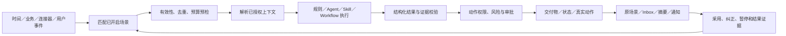

# xopc 场景：长期产品北极星与演进方案

> 2026-09-21 架构修订：当前实现以[通用场景任务跟进方案](./scene-task-follow-up.md)为准。Slack 编码只是首个验证配置；执行复用现有 embedded Agent harness，文档无需 Git，文件修改无需 Docker。下文早期 Slack 专用执行器／强制验证安排不再作为实现约束，长期需求与历史分析保留。

初稿：2026-09-19。更新：2026-09-21。状态：长期产品方向；当前迭代收敛为用户自己的 Slack 开发事项闭环。

本文定义 xopc「场景」的长期用户价值、产品承诺、能力轮廓、指标和领域边界；不要求一次实现长期轮廓。当前交付范围以 [Slack 开发事项产品与技术方案](/Users/micjoyce/develop/github/xopc/docs/design/ai-native-scenes-product-technical-design.md)及[推进计划](/Users/micjoyce/develop/github/xopc/docs/design/scenes-launch-plan.md)为准。第 12、13、15 节保留早期探索／迁移背景，不再作为本轮排期或重新清理数据的依据。

旧主动服务实验已下线，当前沿用 Scene、Automation、Workflow、Skill、TaskRun、成果和通知基础。本文长期轮廓不表示全部已实现，具体状态以交付记录和代码为准。

通用可靠性依据见 [场景系统技术设计与实施方案](./scenes-technical-design.md)。旧 Proactive／助理 Heartbeat 的直接切换已有实施记录；本轮是在现有 Scene 上增量交付，不重复清理旧实验或现有用户数据。

## 0. 当前优先场景：用户自己的 Slack 开发事项

用户已有三个明确问题：消息跟不过来；开发时需要持续复制 Slack 上下文并观察 thread；分支与需求对应不清。首个目标不是另找市场人群，而是直接减少这三项负担。

产品承诺：把一个 thread 交给 xopc，它持续接收讨论、排查和开发，把代码、工作区、分支和验证结果关联回同一个事项，只在判断、授权或无法自动恢复的阻塞时通知用户。

- 先保证明确接手的 thread 跟到底，再扩展授权频道的新事项发现。
- 开发事项复用 Task，Scene 管持续委托，TaskRun 管执行尝试；来源与资源关联不建立另一套任务状态。
- 默认路线是内部 BYOK Agent，用户可选 Codex；先跑通一种执行器，不把外部 agent 作为必经步骤。
- 新讨论进入原任务，有说明修订和应用确认；不能把输入已送达当成需求已处理。
- 工作区／分支与 Task 稳定绑定；历史分支先只读盘点、人工确认关联，不自动清理。
- 首版到代码和约定验证可交付，不默认 push、PR、Slack 回写、合并或部署。
- 先衡量用户复制消息、手动观察、重复交代、找分支和返工的减少；跨人群增长随后验证。

长期仍面向通用工作与生活。Scene 可逐渐成为包含方法、依赖与配置的能力包，也可与增强 Extension 的安装形态统一，但这不是当前的前置工程。Gmail／家庭场景继续维护，不作为本轮新增能力主线或 Slack 原型的专属前置验收。

## 1. 产品命题

今天，用户主要通过主动发起对话来使用 AI：想到问题、组织语言、选择上下文、提出要求、等待结果，再自己决定是否继续。这个模式证明了 AI 的能力，但仍把发现时机、拆解任务、持续关注和再次发起的负担留给用户。

xopc 场景要完成的转变是：

> 用户围绕工作与生活中在意的事情开启场景；AI 持续承担约定范围内的信息整理、准备、协调和执行，让用户把时间与注意力留给重要判断、亲身体验和人与人的相处。

场景不是“多发消息”，也不是把定时任务换成 AI。它把一次需要用户主动发起的 AI 使用，变成一项可持续、可解释、可控制的 AI 服务。

长期产品承诺：

> 让 Personal AI 帮用户把工作和生活中的事情管理好、准备好、做好，减少需要亲自操心和反复处理的负担，让用户有更多时间与精力过自己想要的生活。

“两分钟内开启并看到价值”是降低使用门槛的体验目标，不是产品的最终目的；有足够数据的轻量场景优先做到。需要积累数据或长期观察的场景，应先提供一个有用的小步骤，并解释何时可以得到下一次帮助。样例展示不计作真实价值。

早期核心用户是已经会主动使用 AI、但仍需要自己反复发起相似工作的人。他们的会议、邮件、项目、任务和资料已经部分数字化，能够让产品在明确授权后观察到真实时机并交付成果。先让这批用户从“每次都要想起并重新问 AI”转向“开启一次，持续受益”，再逐步降低到更广泛用户的首次 AI 使用门槛。

工作是近期验证入口，也是个人生活的一部分。长期产品面向完整的人，覆盖家庭照顾、孩子成长、个人健康管理、亲密关系、学习兴趣、日常事务及长期开放式愿望。不能把用户的所有需要都解释为项目交付，也不能以更多工作产出衡量全部价值。

## 2. 用户价值

场景围绕以下价值设计，并按具体需要验证。

### 2.1 降低发现门槛

用户不需要先知道 Prompt、Agent、Skill、Workflow 或 Automation。产品在项目、日历、家庭安排、个人记录、资料和对话等真实情境中，直接说明 AI 此刻可以替用户完成什么。

### 2.2 降低启动门槛

用户只需确认目标、范围和行动边界。系统使用合理默认值完成触发、执行和交付配置，不要求用户理解技术结构。

### 2.3 从回答问题升级为持续完成工作

AI 不只在一次对话中回答，而能等待时间和事件、持续理解同一事项、准备交付物、请求必要决策，并在结果变化时继续推进。

### 2.4 尽快产生可感知价值

开启场景后优先真实试做一次、回看最近对象或准备首个成果。不能让用户只得到“已经开始监控”的空状态，然后等待数天才知道功能是否有用。

### 2.5 在主动帮助中保持控制感

用户始终能知道场景为何运行、读取了什么、做了什么、准备做什么；可以纠正、暂停、限制范围、撤销权限或结束场景。个性化不能扩大权限。

### 2.6 归还时间、注意力和选择权

AI 承担记住、搜集、比较、准备、协调、执行和核对等可以委托的负担。用户主要参与偏好、取舍、承诺和重要判断，并可随时接回过程。只有异常或真正需要选择时才询问，避免用户变成每一步都要审批的后台操作员。

用户愿意亲自做的过程本身也有价值，例如陪孩子读书、与伴侣相处、运动或创作。场景应减少这些活动周围的准备负担，为参与腾出空间。释放的时间由用户决定如何使用，不默认转化为更多工作、更多目标或更多 AI 使用。

### 2.7 以人的生活情境组织能力

以下是长期覆盖轮廓，不代表当前具备相应数据源或专业能力：

| 情境 | 用户在意的事情 | AI 可以承担的部分 | 用户保留的参与 |
| --- | --- | --- | --- |
| 工作 | 减少临时准备和遗漏 | 材料整理、风险识别、草稿、授权办理 | 目标、取舍和承诺 |
| 健康与日常状态 | 更容易维持适合自己的生活安排 | 整理自愿记录、准备预约资料、根据已确认计划协调日程 | 身体感受、生活选择及与专业人员的沟通 |
| 孩子照顾 | 少漏掉学校和家庭安排 | 整理学校通知、材料清单、接送冲突和待确认事项 | 照顾责任、家庭安排和亲子相处 |
| 孩子成长 | 给孩子更多合适的体验 | 根据家庭选择的兴趣准备活动选项、整理观察、定期回顾 | 尊重孩子意愿、选择方向和共同体验 |
| 伴侣与亲友 | 有精力认真维系关系 | 记住用户明确交代的安排、准备约会选项、整理沟通思路 | 真诚表达、理解、同意和相处 |
| 学习与兴趣 | 持续推进自己喜欢的事情 | 材料准备、练习安排、阶段整理、随生活变化调整建议 | 好奇心、实践和是否继续的选择 |
| 日常事务 | 少花精力管理杂事 | 出行准备、家庭采购清单、到期事项和资料整理 | 预算、偏好及有影响的决定 |

生活场景可以只绑定个人、家庭安排或一份记录，不要求先创建 Project。家庭成员和关系对象也不是可被默认监控的数据源；对儿童资料和共同信息明确谁提供、谁能看、能用于什么。关系场景协助用户表达与安排，不冒充用户维系关系或操纵他人。健康场景的能力声明区分生活安排和专业判断，不把模型推断呈现为诊断。

## 3. 用户面对的产品对象与命名

用户侧核心对象统一叫「场景」。不使用“主动性”“主动服务”“Heartbeat”“订阅”“扫描任务”作为普通用户的一级概念。

| 位置 | 用户侧名称 | 含义 |
| --- | --- | --- |
| 发现和分享 | 场景模板 | 可查看、试用、分享和开启的场景定义 |
| 日常使用 | 场景 | 已围绕用户具体需要开启的持续 AI 服务 |
| 全局管理 | 我的场景 | 用户当前开启、暂停和结束的场景 |
| 历史与诊断 | 运行记录 | 场景何时运行、为何静默、失败或交付 |
| 开发与分发 | Scene Package | 仅面向开发者和基础设施的内部术语 |

导航优先使用「场景」或「我的场景」。场景卡片使用结果导向的名称，例如：

- 每次客户会议前帮我准备；
- 跟进重要邮件回复；
- 发现项目交付风险；
- 每天整理需要我处理的工作；
- 自动分析任务失败的实际影响。
- 帮我整理下周的家庭安排；
- 为孩子的周末准备几个合适的活动；
- 帮我给伴侣留出一起相处的时间；
- 按我确认的计划安排运动与休息。

不使用“安装 Proactive 服务”“创建 Heartbeat”一类表达。

## 4. 场景的产品定义

> 场景是用户围绕一项工作或生活需要，与 Personal AI 建立的持续帮助约定。AI 在合适时机使用获准信息，完成当前可以委托的部分，并根据实际变化继续等待、准备、办理或与用户共同调整。

一个成立的场景必须回答七个问题：

| 要素 | 用户问题 | 示例：会议前准备 |
| --- | --- | --- |
| 目标 | 它替我解决什么问题？ | 不再临时整理会议材料 |
| 时机 | 什么时候开始？ | 会议前一天和前两小时 |
| 范围 | 针对哪些对象？ | 工作日历中的客户会议 |
| 上下文 | 会读取什么？ | 日历、相关项目、笔记和已授权邮件 |
| 工作 | AI 会先做什么？ | 整理背景、变化、风险和建议议题 |
| 结果 | 我会得到什么？ | 一页会前简报和必要决策 |
| 边界 | 什么能自动做，什么必须问我？ | 可准备材料；不能自动发送邮件 |

只有触发器和 Prompt、却没有明确用户目标、真实结果和行动边界的配置，不构成产品场景。

### 长期开放式场景

“更从容地照顾孩子”“给伴侣多一些相处时间”“持续发展一个兴趣”没有统一的完成日期。场景需要保存用户在意的方向、当前阶段、现实限制、帮助节奏和下次回顾时机；每次只落实一段具体帮助，不把愿望直接变成无限任务队列。

例如，用户开启“给孩子更多户外体验”，AI 先了解家庭愿意安排的时间、孩子明确表达的兴趣和出行范围，每周准备少量选项。用户选择后再按权限整理行程和准备清单；忙碌的一周可以跳过，也可以调整方向。一次活动结束后关闭对应事项，长期场景继续存在。

长期场景允许“维持得不错”“这周无需介入”“方向已不适合”等结果。系统定期询问这个需要是否仍存在，支持休息、季节性暂停和自然结束；不以连续打卡、儿童排名、关系评分或模型自定目标替代用户对生活的判断。

### 非目标

- 不把所有后台任务、系统维护和普通 Automation 都包装成用户场景；
- 不因为安装模板、连接账户或发生一次行为就默认开启长期场景；
- 不让每个事件都启动模型，也不以运行频率证明价值；
- 不把通知 Feed 当成主要产品，场景必须交付工作结果；
- 不用场景替代 Task、Workflow、Automation、Skill 或 Extension；
- 不承诺本地 Gateway 离线时仍能持续执行，除非未来有用户明确选择的常驻运行环境；
- 不在场景价值尚未验证前建设任意代码市场和复杂通用 DSL。

## 5. 场景与现有能力的关系

场景是面向用户价值的编排层，不替代已有执行能力。

| 能力 | 回答的问题 | 在场景中的角色 |
| --- | --- | --- |
| Skill | AI 怎样做好某类工作？ | 场景可引用的专业能力 |
| Workflow | 如何复用多阶段执行方法？ | agent 节点可动态使用工具，场景按需选择，不强制生成 DAG |
| Agent | 如何理解上下文并做判断？ | 场景可选择的执行器 |
| Automation | 何时执行一个已定义动作？ | 独立高级产品，也可提供调度或成为场景调用目标 |
| Task / TaskRun | 一项工作如何持续执行、等待和验收？ | 承接需要持续办理的场景工作 |
| Inbox | 用户以后到哪里找到结果？ | 场景结果的耐久入口 |
| Notification / Channel | 如何提醒用户打开结果？ | 场景结果的投递方式 |
| Heartbeat | 历史上的助理周期巡查 | 旧运行时已移除，不作为当前新增能力的执行器 |
| Proactive | 历史上的主动事件与分析基础 | 已替换为 Scene，不再新增平行运行时 |

原则上，场景负责“为何在此刻为这个用户做这件事，并如何交付”；底层能力负责“怎样执行”。

## 6. 长期用户体验

### 6.1 用户从真实工作位置发现场景

场景库是补充入口，不是唯一入口。主要发现方式是：

1. **上下文推荐**：项目、会议、邮件和对话旁出现与当前对象相关的场景；
2. **一次帮助升级**：用户采用一次结果后，产品询问“以后这类情况也这样做吗”；
3. **用户明确表达**：用户说“以后每周五都这样”“这件事帮我跟到底”；
4. **主动浏览**：用户在场景库按目标发现官方或他人分享的模板。

推荐必须说明依据，例如“你刚刚采用了这份会前简报”，不能泛称“根据你的习惯”。一次性请求不会自动变成长期场景。

### 6.2 开启过程不超过三个核心决定

默认开启流程只回答：

1. 针对什么范围；
2. 希望 AI 特别关注什么；
3. 结果如何交付、动作做到哪里。

模型、Prompt、Skill、事件类型、重试和运行参数默认隐藏。缺少数据源或新增高风险权限时，仅补充当前无法推断的选择。

开启前用自然语言展示承诺：

```text
针对工作日历中的客户会议，我会在会前一天准备一页简报；
如果两小时前仍有关键资料缺口，再提醒你；
我可以读取已选择的日历、项目和笔记，不会替你发送消息。
```

### 6.3 两分钟内完成第一次价值验证

每个场景至少提供一种方式：

- 对最近或下一项真实对象试做一次；
- 回看已有数据生成第一个真实成果；
- 没有数据时展示明确标注的样例结果。

真实试做可以读取本次已授权数据，但不注册长期触发、不发送外部消息、不执行不可逆动作。用户看见成果后再决定是否持续开启。

### 6.4 AI 交付成果，而不只发提醒

场景的主要结果包括：

- 简报；
- 草稿；
- 检查清单；
- 风险说明和解决建议；
- 决策选项；
- 创建或更新的任务；
- 状态变化；
- 已完成动作的回执。

结果必须回答：发生了什么、为什么现在重要、AI 已经做了什么、接下来是否需要用户。

### 6.5 结果回到事情本身

结果首先出现在所属对象：会议简报回到会议，项目风险回到项目，邮件草稿回到线程。工作台和 Inbox 提供跨对象聚合与耐久查找，通知只用于把用户带回真实结果。

Inbox 是耐久结果面；系统通知、移动推送、Telegram 和其他渠道消息是投递投影。关闭提醒不会删除结果，暂停场景才停止后续检查。

### 6.6 用户通过结果纠正下一次行为

结果支持：

- 有用／不适合；
- 太早／太晚；
- 太频繁；
- 事实不准确；
- 来源过时；
- 调整交付物；
- 用自然语言修改要求；
- 暂停当前场景；
- 不再推荐同类场景。

“这次不用”“这个项目不要”“以后不要推荐这类场景”具有不同作用域，不能混为一个负反馈。

## 7. 渐进信任与行动边界

每个场景分别设置两个维度。

### 7.1 什么时候打扰我

- 只保存结果；
- 重要时提醒；
- 每次约定交付都提醒。

### 7.2 可以替我做到哪里

- **只准备**：分析并产出内容，不改变业务对象；
- **做之前问我**：提出动作并等待确认；
- **自动处理允许的操作**：仅对该场景明确列出的低风险操作生效。

权限展示使用用户能理解的语言。以下是只准备类场景示例，不是所有场景必须逐项审批的全局规则；Slack 开发场景可以一次明确授权内部任务整理、指定工作区修改与约定验证：

```text
可以读取：客户会议、关联项目、已选择的笔记
可以完成：准备简报、写入 Inbox
每次询问：创建任务、发送消息
不能执行：删除内容、改变外部承诺
```

用户采用结果不会自动扩大权限。场景模板更新新增数据源、动作、网络目的地或预算时必须重新确认。

## 8. 最终能力轮廓

### 8.1 场景模板

一个长期完整的场景模板可以声明：

- 用户目标和适用位置；
- 时间、事件、手动和 webhook 触发；
- 过滤、聚合、去重、冷却和结束条件；
- 所需上下文及新鲜度；
- Prompt、Skill、Workflow 或 Agent 执行定义；
- 结构化输出和交付物；
- 可提议的状态变化和动作；
- Inbox、原场景、摘要和通知策略；
- 配置 Schema、示例、评测和本地化；
- 权限、成本、宿主能力要求和版本信息。

首选声明式模板。只有新增事件源、上下文提供者、动作类型或特殊 UI 时，才依赖代码扩展。

### 8.2 事件与时间

时间是事件来源之一。场景统一接收：

- 定时和相对时间；
- 项目、任务、讨论和 Automation 事件；
- 邮件、日历和其他 Connector 事件；
- 用户手动触发；
- 系统恢复、权限撤销和交付物状态变化。

事件描述事实，不携带可执行指令。运行时负责版本、幂等、去重、来源水位、迟到事件、设备离线补算和循环触发保护。

### 8.3 执行

场景最终支持下列执行方式：

- 规则判断；
- Prompt Agent；
- Skill Agent；
- Workflow；
- Task / TaskRun；
- 已有 Automation；
- 规则预筛选后启动 Agent 或 Workflow 的组合执行。

每次运行固定模板版本、用户要求版本、授权版本、上下文快照摘要、模型、Skill／Workflow 版本和策略版本，以便解释与复现。

### 8.4 输出、交付物和动作

执行器先返回结构化结果，再由宿主决定副作用。场景可以产出：

- `no_change`：没有值得呈现的变化；
- `observation`：值得知道的信息；
- `artifact`：文档、表格、简报、草稿、清单等交付物；
- `decision`：需要用户选择；
- `state_change`：推进场景或工作项状态；
- `effect_proposal`：任务、消息、业务对象或 Connector 动作建议；
- `receipt`：已授权动作的真实执行结果。

模型不能通过自由文本直接产生副作用。动作提议经过 Schema、证据新鲜度、权限、风险、幂等和审批检查后，由类型化 Effect Handler 执行。

### 8.5 状态与持续工作

场景的持续状态保存在场景实例和工作项中，不藏在聊天历史里。重置 Session、切换模型或压缩上下文不会丢失场景承诺。

长期支持：

- 一个模板在不同范围开启多个场景；
- 一个场景持续跟踪多个现实工作项；
- 等待时间、回复、审批和外部结果；
- 变更后刷新或撤回旧结果；
- 有期限事项的完成条件，以及长期开放式场景的阶段回顾、暂停与退出条件；
- 暂停检查与暂停提醒分别控制；
- 运行失败、来源失效和成本不足可解释。

### 8.6 分享与生态

用户分享的是场景模板，而不是自己的数据和运行状态。模板可以：

- 导出和导入；
- Fork 并修改；
- 固定版本；
- 从官方或社区场景库安装；
- 显示依赖、权限、成本、示例和质量信息；
- 在升级时展示行为与权限差异；
- 在严重缺陷时撤销版本。

模板不得携带用户 Token、Connector connection ID、接收人、私有 Prompt override、历史结果或工作资料。第一阶段仅开放官方声明式模板；生态成熟后再开放审核社区模板和受限 Runtime Plugin。

## 9. 核心领域模型

长期领域对象保持少而清晰：

| 对象 | 职责 |
| --- | --- |
| SceneTemplate | 可分享、不可变版本的场景定义 |
| SceneActivation | 用户针对具体需要开启的场景、范围、配置与授权；可有期限或长期维持 |
| SceneWorkItem | 非执行型观察对象或轻量关联；开发工作以 Task 为唯一状态源，不复制任务生命周期 |
| SceneEvent | 时间或业务变化形成的事实事件 |
| SceneRun | 一次触发的判断／执行关联；跨天工作与等待复用 Task／TaskRun，不持续占用模型回合 |
| SceneOutcome | 结构化结果、证据、交付物和动作提议 |
| ScenePresentation | 结果在原场景、工作台、Inbox 和通知中的投影决定 |

既有只读场景已有模板、实例与成果基础。当前开发场景增加对 Task／TaskRun、来源、说明修订和资源绑定的关联，优先复用现有对象；公共扩展协议按第二个真实需求逐步抽取，不为模型完整度重写。

## 10. 运行闭环



三个判断必须分开：

1. 是否值得启动执行；
2. 执行结果是否有价值；
3. 是否值得此刻打扰用户。

没有变化时可以不调用模型；有成果但不紧急时可以只更新原场景或 Inbox；需要用户行动且仍有时间时才触发提醒。

## 11. 北极星指标

产品北极星是：用户在工作与生活中持续得到实质帮助，少一些需要亲自操心的负担，多一些能够自主安排的时间和精力。下列 WSVR 是可观测的产品代理指标，需要结合用户反馈验证，不能单独证明“生活变好了”。

### 11.1 唯一北极星

**每周有效场景帮助用户率（Weekly Scene Value Rate，WSVR）**：

> 每周活跃用户中，至少通过一个场景获得一次“经行为或结果证据确认的有效帮助”的用户比例。

```text
WSVR = 当周至少发生一次有效场景帮助的活跃用户数 / 当周活跃用户数
```

同时保留分子“每周有效场景用户数”作为规模指标，但产品优化以比例和质量为主，避免单纯靠用户增长掩盖场景没有创造价值。

### 11.2 什么是有效场景帮助

至少满足下列一项，并且通过事实、权限和幂等检查：

- 用户采用、编辑后采用、导出、引用或继续办理一个场景交付物；
- 用户根据场景结果完成一次决策；
- 用户批准的动作成功执行并得到真实回执；
- 场景发现的问题促成关联 Task、Project 或承诺发生可验证推进；
- 用户明确标记结果有用。

生活场景中，用户确认“安排用上了”“少操心了一件事”“有更多时间陪家人”也是直接价值证据，不要求转成 Task 或在应用里留下更多操作。预先授权的动作有真实成功回执时，也可以计入，不要求用户回来重复批准。打开、导出或点击继续只属于采用线索，必须与对应的实际使用或用户确认关联，单次点击本身不证明减负。

仅发生以下行为不计入有效帮助：

- 场景运行；
- 模型生成文本；
- 写入一张无人使用的卡片；
- 发出通知；
- 用户只打开页面；
- 重复提醒同一事项；
- 系统声称完成但没有结果证据。

同一 SceneWorkItem 在同一价值阶段只计一次，避免通过重复运行和通知增加指标。

统计口径：按固定报告时区的自然周去重，同一用户当周最多进入分子一次。分母包含有主动使用行为的用户，以及已开启场景当周发生有效触发或约定交付的用户；不能只统计打开应用的人，否则 AI 帮用户减少打开应用反而会造成统计偏差。样例、测试运行和系统维护不计入；真实试做与持续运行分开报告，避免首次试用掩盖长期价值。

无触发、无约定交付的周不把该场景记为失败。低频和开放式场景另按其预期周期报告价值与保留情况，不要求每周人为制造结果。统计默认在本地形成，聚合上传需要用户选择，不采集健康、儿童或关系内容来证明价值。

### 11.3 指标树

北极星由以下价值路径共同决定：

```text
可发现 → 成功开启 → 产生可用结果 → 用户采用或真实推进 → 持续信任
```

| 维度 | 核心指标 |
| --- | --- |
| 发现 | 上下文推荐曝光到查看、主动搜索成功率 |
| 开启 | 场景查看到试用／开启转化、权限配置成功率 |
| 首次价值 | Time to First Scene Value；开启后 24 小时内获得有效帮助的比例 |
| 结果质量 | 采用率、轻改后采用率、决策推进率、真实动作成功率 |
| 持续价值 | 在预期发生周期内持续产生有效帮助的场景比例；区分高频、低频与开放式场景 |
| 实际减负 | 用户确认减少的准备、重复处理和惦记负担；抽样访谈与前后对照，不由模型虚构节省时长 |
| 判断负担 | 每次有效帮助需要用户补充、审批和纠正的次数，用户接管或返工成本 |
| 自主与生活价值 | 用户是否感到更从容、更有控制感，以及释放的精力是否用于自己在意的事情 |
| 信任 | 事实错误、过时来源、越权、错误对象和错误时机反馈 |
| 打扰 | 每次有效帮助对应提醒数、重复提醒率、静音／暂停／卸载率 |
| 可靠性 | 触发到结果延迟、漏触发、恢复成功、未知副作用 |
| 成本 | 每次有效帮助的模型与基础设施成本、无变化模型调用占比 |
| 生态 | 模板安装到首次有效帮助、版本升级回归、依赖配置成功率 |

### 11.4 安全和体验护栏

北极星不能以牺牲信任换取。以下是独立硬护栏：

- 未经授权的外部动作必须为零；
- 同一不可逆动作重复执行必须为零；
- 批准对象和实际执行对象必须一致；
- 无交付物不得声称已经准备；
- 失败不得呈现为完成；
- 来源撤权后不得继续读取或发送相关内容；
- 推送量、负反馈和单位有效帮助成本不能随 WSVR 增长而失控。

## 12. 历史候选场景（长期保留，不是当前首发清单）

以下为 2026-09-19 的候选范围。当前第一闭环已改为第 0 节的 Slack 开发事项，不要求同时覆盖以下场景，也不以生活试点作为 Slack 首发前提。

### 12.1 每次会议前帮我准备

- 触发：日历相对时间和会议变化；
- 工作：结合授权信息准备会前简报；
- 结果：简报、资料缺口、决策问题；
- 验证：用户查看并采用简报，改期或取消后结果正确更新。

### 12.2 跟进重要邮件回复

- 触发：收到回复或约定期限到达；
- 工作：判断目标是否真正完成，准备回复或催办草稿；
- 结果：变化说明、可编辑草稿；
- 验证：用户采用草稿或继续办理，发送仍经过确认。

### 12.3 发现项目交付风险

- 触发：项目、任务、里程碑和期限变化；
- 工作：判断是否影响用户关心的结果，准备最小解决方案；
- 结果：证据、影响、清单、决策或任务建议；
- 验证：用户采用建议、创建任务或解决风险。

### 12.4 每天整理需要我处理的工作

- 触发：用户约定的周期时间，也可由重要完成事件请求刷新；
- 工作：按照用户清单检查当前承诺，只保留真正需要关注的事项；
- 结果：短摘要、待决定事项或静默；
- 验证：旧 Heartbeat 数据直接清理并删除旧运行时；空清单不消耗模型，静默与提醒符合策略。

四个场景共同验证时间、事件、Connector、内部对象、开放式巡查、结构化执行、交付物、Inbox 和通知。

这四项来自当前实现基础，属于近期验证切入口，不定义长期产品边界。在公共协议固化和场景库开放前，增加至少一个生活场景纵向试点：建议从“下周家庭安排”开始，使用用户主动提供的日程和通知，准备冲突说明、清单和少量待决定项；继而验证“给孩子更多户外体验”等长期开放式场景。验收重点是是否减少操心、是否支持跳过和阶段回顾、是否无需创建工作项目也能使用。

## 13. 历史阶段探索（当前排期以 S0—S5 为准）

以下 P0—P5 保留早期统一场景与生态的探索背景，不是当前执行清单。迁移已有完成事实见实施记录；当前按 Slack 计划 S0—S5 推进，不重做迁移、不同时开发四个场景、不先建设生态。

### P0：统一产品语言和价值测量

目标：冻结同一个“场景”产品模型、价值口径和直接切换边界。

交付：

- 确定 SceneTemplate、SceneActivation、SceneOutcome 最小契约；
- 设计旧实验场景数据清理和新场景初始化；
- 确定用户文案、场景承诺和“我的场景”视图；
- 建立 WSVR、首次价值、采用、打扰和安全事件埋点；
- 明确旧运行时、接口和配置删除清单，不增加兼容层。

完成条件：产品契约和初始化方案可评审；用户无需理解 Proactive、Heartbeat 或订阅即可看懂场景承诺、范围、结果和暂停方式。

### P1：四个官方场景的完整体验

目标：在新执行链路与隔离试点中证明用户能够快速开启并持续获得真实价值，不通过旧链路适配交付。

交付：

- 上下文入口、试用一次、两分钟内首次价值路径；
- 四个北极星场景的真实结果和原对象回流；
- “只准备／做之前问我／允许的低风险动作”控制；
- 结果纠正、暂停检查和静音通知；
- 真实 Connector、重启、撤权、改期和重复点击验收。
- 完成一个生活场景纵向试点，验证个人／家庭范围和长期帮助的交互，不把工作对象作为强制前提。

完成条件：目标用户不经指导可以开启至少一个真实场景、理解其承诺，并指出一项被 AI 实际推进的工作。

### P2：统一场景运行与注意力治理

目标：让不同场景共享可靠、可解释的事件、运行、结果和投递基础。

交付：

- 时间和业务事件归一为 SceneEvent／TriggerIntent；
- 场景运行、等待、恢复、幂等和父子执行契约；
- Heartbeat 一次性转为内置日常巡查场景，删除旧服务、配置和专有接口；
- Agent、Skill、Workflow 和 Task 执行适配；
- 统一 Inbox、摘要、通知预算和呈现理由；
- 运行记录解释为什么执行、静默、失败或未提醒。
- 用生活试点检验长期维持、阶段回顾和子事项结束的协议，之后再固定公共模板契约。

完成条件：四个场景走统一结果协议；重启、迟到事件、改期、来源陈旧、撤权和外部动作未知状态均有确定行为；旧运行时和入口删除，初始化及各客户端验收通过后首次正式切换。若缩小首发模板范围，旧实验实例直接丢弃，不以 legacy 执行器兜底。

### P3：场景模板与官方场景库

目标：让用户发现、试用、安装和分享已经验证有效的场景模板。

交付：

- 声明式模板格式、静态校验、示例和评测；
- 场景库、模板详情、依赖检查和真实试用；
- 导入、导出、Fork、版本固定和升级差异；
- 官方模板发布、灰度、回滚和撤销；
- 从一次成功帮助升级为持续场景。

完成条件：用户不理解 Prompt 和 Workflow 也能从模板获得首次有效帮助；模板不能携带私有数据或绕过宿主权限。

### P4：创作者工具与受控开放

目标：让第三方和高级用户安全创建并分享场景。

交付：

- 可视化／代码场景编辑器；
- 事件模拟、dry-run、历史回放和评测工具；
- Skill／Workflow 依赖打包；
- 审核、签名、宿主能力校验和质量报告；
- 受控开放 Context Provider、Event Source、Effect Handler 和自定义 Renderer。

完成条件：社区模板不能运行任意安装脚本、读取未授权数据或绕过 Effect 审批；升级新增权限会被明确阻断。

### P5：个性化发现与授权内自适应

目标：在不增加认知负担和不扩大权限的前提下，让合适场景更自然地出现。

交付：

- 可解释的场景机会发现；
- 基于采用、纠正、时机和真实结果的场景级调整；
- 范围化“不再建议”；
- 用户明确授权后的窄范围自动开启；
- 成本和活跃场景数量预算。

完成条件：系统能解释为何推荐；拒绝后按正确范围停止；自动开启不能新增数据范围、动作权限或预算。

## 14. 防止过度设计的实施原则

1. **产品先于平台**：每一个基础设施抽象必须由至少一个完整用户场景驱动。
2. **复用能力，不重建旧链路**：复用 Agent、Workflow、TaskRun、Connector 和通知基础件；旧 Proactive／Heartbeat 替换已有记录，本轮不重做迁移、不建立平行任务系统。
3. **首选声明式**：第一批模板不运行第三方代码。
4. **产品对象精简，可靠性不省略**：用户重点理解模板、我的场景和结果；事件、运行、授权动作的持久身份和幂等从第一条新链路就具备，其余抽象按需要扩展。
5. **场景纵向交付**：一次迭代必须从入口到真实结果闭环，不能只完成事件层或市场 UI。
6. **不暴露技术配置**：高级参数存在不代表普通用户需要看到。
7. **没有首次价值就不扩模板数量**：先证明用户自己的 Slack 开发闭环，再以真实需求扩展其他工作或生活场景。
8. **没有第二个真实实现就不做通用扩展点**：避免为假想插件提前设计 DSL。
9. **运行不等于价值**：所有决策围绕 WSVR 和安全护栏，而不是任务数、通知数或模型调用数。

## 15. 历史迁移映射（非当前实现清单）

| 当前实现 | 近期处理 | 长期形态 |
| --- | --- | --- |
| `proactive_scenarios` | 映射官方内置模板 | SceneTemplate |
| `proactive_scenario_subscriptions` | 映射用户已开启场景 | SceneActivation |
| `proactive_events` 与 temporal worker | 清理实验事件记录，替换旧扫描器 | SceneEvent／TriggerIntent |
| proactive run／insight | 清理实验历史，删除旧 reader | SceneRun／SceneOutcome |
| proactive card／Inbox | 统一结果卡和采用证据 | ScenePresentation |
| `HEARTBEAT.md` 和 HeartbeatService | 旧运行时已移除；用户文件不扫描、不导入、不删除 | 未来按真实需求定义周期场景 |
| Project monitoring | 保留权限与低风险动作 | 场景级行动边界 |
| Automation scheduler | 不强制改名，逐步提取公共调度 | 场景可复用的计划能力 |
| Skill／Extension marketplace | 复用目录和安装基础 | 场景模板分发基础 |
| TurnOutcome／ProductDelivery | 复用交付物和产品引用 | 场景结果与交付物协议 |

切换必须满足：不保留新旧双轨、双写或兼容接口；旧实验数据直接清理，不恢复旧权限或重放外部动作；旧配置不阻塞启动，新场景数据重启保留。清理仅针对场景／主动助手实验数据，不影响聊天、项目、账号、连接器或用户工作区文件。

## 16. 产品决策检查表

任何新场景或平台能力进入开发前，应回答：

1. 用户在什么真实位置发现它？
2. 用户能否用一句话理解它替自己完成什么？
3. 能否在两分钟内试用或看到第一个可信结果？
4. 它由什么时间或事实事件触发？
5. 什么情况下应静默？
6. 需要读取哪些数据，为什么？
7. 结果是可使用的成果，还是只有一段提醒？
8. 哪些动作自动执行，哪些必须确认？
9. 用户如何纠正下一次行为？
10. 什么行为构成有效场景帮助，如何进入 WSVR？
11. 哪些失败或越权条件必须阻断发布？
12. 当前是否真的需要新增平台抽象，还是能复用已有能力？
13. 它减少了什么实际负担，是否又增加了配置、审批、纠正或被催促的负担？
14. 用户希望委托哪些部分，又希望亲自体验和决定哪些部分？
15. 如果这是长期生活需要，如何回顾、跳过、调整与退出，而不是强行追求完成？

## 17. 北极星叙事

当前 Slack 开发场景首先应让用户能说：

> 我把线程交给它后，不用反复复制消息和盯讨论。补充条件会进入原来的开发任务，每个分支都能找到对应需求；代码和验证准备好了，只有需要我决定时才来找我。

这条具体闭环成立后，再扩展到其他工作与生活。下述仍是长期愿景，不是首版能力承诺。

场景产品成功时，用户不会说“我配置了一个事件驱动 Agent”，而会说：

> 它会在重要会议前准备材料，把家里下周需要安排的事情理清楚，也会按我们喜欢的方式准备周末活动。我不用一直记着、找着、催着；需要取舍的时候，我有足够的信息做决定。省下来的时间和精力，我可以留给家人、喜欢的事情，或者好好休息。

场景最终要交付的是人的能力与生活空间的扩展：更容易获得 AI 帮助，更少承受琐碎与反复的负担，更有条件做重要判断，也更有时间参与自己珍视的生活。
