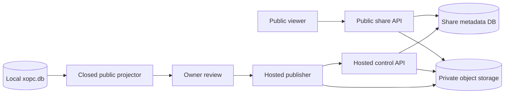

# Hosted Session sharing — phase 3 design

> Status: detailed design; implementation intentionally deferred until phases 1 and 2 are accepted
>
> Audience: product, Gateway, Share, Web UI, cloud, and security maintainers
>
> Last updated: 2026-09-02

## Summary

Phase 3 makes a Session share reachable while the owner's Gateway is offline. The local client projects and reviews the same closed public snapshot used by local sharing, then uploads only that sanitized snapshot and explicitly selected assets to an xopc-hosted service. The service publishes an immutable revision behind an unguessable, revocable public URL.

This is a second delivery target, not Session synchronization. The service never receives the Session database, Session key, system prompts, reasoning, tool arguments or results, shell content, workspace paths, provider metadata, local share token, or local asset-ticket secret.

The first hosted release remains deliberately small:

- one public, read-only snapshot per hosted link;
- explicit manual update behind the same URL;
- expiration, optional maximum views, and revocation;
- explicitly selected attachments and optional tool name/status summaries;
- no collaboration, discovery, comments, accounts for viewers, or automatic live updates.

## Preconditions from phases 1 and 2

The local implementation already establishes the security and product boundary that phase 3 must reuse:

- `projectSessionShare` creates a closed user/assistant text projection;
- private transcript rows and persistent row identifiers are excluded;
- attachments are opt-in, copied, bounded, checksummed, and revision-scoped;
- tool disclosure is opt-in and limited to name plus completed/failed state;
- snapshot creation uses a `sessionId` + cutoff sequence + metadata timestamp fingerprint;
- updates are immutable revisions and do not change the public token;
- metadata and social-card reads do not consume a view;
- only `POST .../view` consumes a bounded view.

Phase 3 should not fork these rules. A local and hosted share created from the same reviewed options must show the same public conversation.

## Product decision

The share dialog will offer two delivery choices when the user is signed in and hosted sharing is enabled:

| Delivery | Availability | Data location | Owner Gateway required after publish |
|---|---|---|---|
| This device | Existing local/LAN/tunnel behavior | Owner's xopc state directory | Yes |
| Hosted link | Phase 3 | xopc object storage and metadata service | No |

“This device” remains the default until hosted sharing exits beta. Selecting “Hosted link” must display a direct disclosure: the reviewed snapshot and selected attachments will be uploaded to xopc hosting. There is no implicit fallback from local to hosted and no automatic upload of existing local shares.

## Privacy model

The initial hosted format is server-readable after the local privacy projection. Transport uses TLS and stored objects use provider encryption at rest. End-to-end encryption is not included in version 1.

That choice is intentional. Token-fragment encryption would prevent the service from safely validating content, generating Open Graph metadata, enforcing attachment policy, and scanning abusive uploads. Offering both models initially would double the public renderer and failure modes. If private encrypted links are later required, they should be a separate product mode and contract.

The hosted service may receive only this public envelope:

```ts
interface HostedSessionShareManifestV1 {
  schemaVersion: 1;
  title: string;
  snapshotAt: string;
  description?: string;
  messages: Array<{
    id: string; // synthetic revision-local id
    role: 'user' | 'assistant';
    markdown: string;
    createdAt: string;
    attachmentIds: string[];
  }>;
  toolActivities: Array<{
    id: string;
    messageId?: string;
    toolName: string;
    status: 'completed' | 'failed';
    createdAt: string;
  }>;
  attachments: Array<{
    id: string;
    messageId: string;
    fileName: string;
    mimeType: string;
    size: number;
    sha256: string;
  }>;
}
```

Unlike the local artifact manifest, the hosted envelope has no `source.sessionId`, `shareId`, artifact path, storage object key, public token, or asset-ticket secret. Source linkage remains local; hosted ownership and storage linkage remain in server metadata.

## Architecture



### Local responsibilities

- Load a fingerprinted Session snapshot.
- Produce the public projection.
- Show the exact text, tool disclosure, attachment list, expiry, and view limit.
- Re-read the fingerprint immediately before publish.
- Hash selected files while streaming them; never stage a second full copy solely for upload.
- Persist only source-to-hosted-share ownership metadata needed for update and management.
- Never log manifest text, attachment bytes, tokens, presigned URLs, or authorization headers.

### Hosted responsibilities

- Authenticate owners, authorize mutations, and apply quotas.
- Validate the manifest against a strict versioned schema and relationship checks.
- Validate declared asset size, digest, and supported MIME policy before activation.
- Keep uploaded objects private; public object-store URLs are never issued.
- Atomically activate one immutable revision.
- Resolve public tokens by hash, enforce lifecycle policy, issue short-lived asset tickets, and render the read-only page.
- Revoke immediately and delete inactive data according to retention policy.

## Local code shape

Do not introduce abstractions before the hosted path exists. At the start of phase 3, extract only the common snapshot-building boundary that now has two consumers:

```ts
interface SessionShareSnapshotBuilder {
  preview(sessionKey: string): Promise<SessionSharePreview>;
  build(sessionKey: string, reviewed: ReviewedShareOptions): Promise<BuiltPublicSnapshot>;
}
```

The existing `SessionShareService` remains responsible for local artifact storage and local tokens. A new `HostedSessionSharePublisher` owns hosted API calls and upload streams. It must not branch throughout `SessionShareService` on `delivery === 'hosted'`; composition at the route/application-service layer keeps local storage and remote publishing independent.

Hosted records also must not be inserted into the local `shares.json` union. Their authoritative lifecycle lives on the server. Store a small SQLite binding instead:

```ts
interface HostedSessionShareBinding {
  hostedShareId: string;
  sourceSessionId: string;
  publicUrl: string;
  publishedCutoffSeq: number;
  revision: number;
  createdAt: string;
  updatedAt: string;
}
```

The owner-facing Shares API can merge local share DTOs and hosted share DTOs at its boundary. This avoids adding empty local paths, fake tokens, or compatibility fields to either model.

## Publish protocol

Publishing is a staged transaction. An upload is never public until finalization succeeds.

1. The client requests a local preview and the owner confirms its options.
2. The client rechecks the Session fingerprint and builds `HostedSessionShareManifestV1`.
3. `POST /v1/session-shares` sends lifecycle policy, manifest, asset descriptors, and an idempotency key.
4. The service validates the manifest and returns `shareId`, `uploadId`, and one short-lived private upload target per asset.
5. The client uploads each asset with its declared byte length and SHA-256 checksum.
6. `POST /v1/session-shares/:shareId/uploads/:uploadId/finalize` verifies every object and atomically activates revision 1.
7. The service returns the public URL. The client persists the local binding only after finalization.

Manifest JSON is sent to the control API because it is bounded at 10 MB and requires immediate schema validation. Asset bodies upload directly to private object storage. No ZIP or TAR format is introduced; that removes archive traversal, decompression-bomb, and partial-extraction logic.

An unfinished upload expires after one hour. An idempotency key returns the same staged operation or completed result, so a network retry cannot create duplicate public links.

## Update protocol

Updating a hosted link creates a new immutable revision:

1. The user reviews the current local snapshot again.
2. `POST /v1/session-shares/:shareId/revisions` includes `expectedRevision` and a new idempotency key.
3. Assets are uploaded and finalized through the same staging protocol.
4. Finalization uses compare-and-swap on `currentRevision`.
5. Only after validation succeeds does the public pointer move to the new revision.

If upload, validation, or compare-and-swap fails, the old revision stays public. Old asset tickets contain the old revision and stop validating after activation. Superseded objects enter a bounded cleanup queue; they are not removed on the request path.

Automatic follow mode is out of scope. Later private messages never become public without a new review and explicit update.

## Hosted API

Owner endpoints require account/device authentication:

```text
POST   /v1/session-shares
GET    /v1/session-shares
GET    /v1/session-shares/:shareId
POST   /v1/session-shares/:shareId/revisions
POST   /v1/session-shares/:shareId/uploads/:uploadId/finalize
PATCH  /v1/session-shares/:shareId          # expiry or maxViews only
DELETE /v1/session-shares/:shareId          # revoke
```

Public endpoints use only the random public token:

```text
GET  /s/:token                 # HTML shell + OG, does not consume a view
GET  /s/:token/meta            # lifecycle metadata, does not consume a view
POST /s/:token/view            # atomically claims one view and returns snapshot
GET  /s/:token/assets/:assetId?ticket=...
GET  /s/:token/thumbnail       # generated placeholder/card, does not consume a view
```

Responses use stable machine codes such as `snapshot_conflict`, `revision_conflict`, `quota_exceeded`, `asset_rejected`, `share_expired`, and `share_revoked`. Public endpoints use generic not-found/gone responses and never expose owner identity or validation internals.

## Server data model

The minimal relational model is:

```text
hosted_shares
  id, owner_id, token_hash, status, current_revision,
  expires_at, max_views, view_count, created_at, revoked_at

hosted_share_revisions
  share_id, revision, manifest_json, manifest_sha256, created_at

hosted_share_assets
  share_id, revision, asset_id, object_key,
  file_name, mime_type, size, sha256

hosted_share_uploads
  id, share_id, target_revision, idempotency_key,
  status, expires_at, created_at
```

Public tokens contain 32 random bytes. Only `SHA-256(token)` is stored. The public lookup hashes the supplied token and uses a constant-time comparison where applicable. Object keys are server-generated and unrelated to file names.

For bounded views, one database update both checks and increments `view_count`; a read followed by a separate increment is invalid. Version 1 does not require Redis. HTML and view JSON are `no-store`; immutable revision assets may use private service caching behind the ticket validator.

## Asset policy

Hosted limits initially match the local Session-share limits:

- at most 20 assets;
- at most 32 MB per asset;
- at most 100 MB total;
- manifest at most 10 MB;
- at most 10,000 shareable messages.

The initial inline allowlist is PNG, JPEG, GIF, WebP, audio, and video. SVG, HTML, scripts, executables, and unknown MIME types are never rendered inline. Unsupported active formats should be rejected during beta rather than accepted through legacy exceptions. Other approved passive formats are served as attachments with `nosniff` and sandbox headers.

The service verifies size and SHA-256 after upload. MIME is derived independently from content where practical; client MIME is only a hint. A malware/content-scanning hook must pass before activation for downloadable files. Failure rejects the staged revision without affecting an existing public revision.

## Public rendering and security headers

The hosted viewer reuses the public DTO and visual behavior, not the authenticated console shell. It has no gateway token, app navigation, editing, AI tools, or owner data.

Required controls:

- strict Markdown sanitization and escaped tool/file names;
- remote Markdown images converted to links to avoid viewer-IP leakage;
- `Content-Security-Policy` with no third-party script, frame, object, or base sources;
- `frame-ancestors 'none'`, `X-Content-Type-Options: nosniff`, and `Referrer-Policy: no-referrer`;
- `robots: noindex, nofollow`;
- short-lived revision- and asset-bound tickets;
- per-IP and per-token rate limits;
- no third-party analytics or fonts;
- generic error pages and bounded response sizes.

Open Graph uses the public title, optional description, message count, and a service-generated placeholder image. It never reads message text or attachment thumbnails. Unfurl requests do not consume a view.

## Lifecycle and deletion

- **Expire:** public access stops synchronously when `expires_at` is reached.
- **Maximum views:** `POST /view` fails atomically after the limit; already issued short-lived asset tickets remain valid until their own expiry.
- **Revoke:** the metadata status changes synchronously before the API acknowledges success. Cached public metadata must use `no-store`.
- **Delete:** revoked and expired objects are deleted asynchronously after a short recovery window defined by policy.
- **Account deletion:** revoke all owner shares first, then enqueue physical deletion.
- **Local Session reset/delete:** never changes a hosted snapshot implicitly. The UI must show active hosted links and offer revocation; a remote revoke failure must remain visible and retryable rather than being reported as success.

Hosted publishing requires connectivity and is not queued in version 1. Revocation retries may use a small durable outbox because falsely reporting a public link as revoked is a security failure.

## Failure semantics

| Failure | Required outcome |
|---|---|
| Session changes after review | Stop locally with `snapshot_conflict`; upload nothing |
| Network fails during upload | Keep staged upload private; retry by idempotency key |
| One asset fails validation | Reject the staged revision; old revision remains active |
| Finalize response is lost | Query/retry with the same idempotency key |
| Concurrent updates | One compare-and-swap wins; loser gets `revision_conflict` |
| Local binding write fails after publish | Return the public result and retry binding reconciliation; do not create a second share |
| Revoke request outcome is unknown | Query status, then retry; never display “revoked” without confirmation |

## Observability and audit

Structured events may contain owner ID, hosted share ID, revision, counts, sizes, duration, result code, and request ID. They must not contain public tokens, URLs with tokens, manifest text, message previews, file names, asset bytes, presigned URLs, or authentication material.

Minimum metrics are publish/finalize latency, staged-upload expiry, validation rejection reason, active shares, stored bytes, public view outcomes, rate-limit outcomes, revision conflicts, revoke latency, and cleanup backlog.

## Implementation slices

Each slice is independently reviewable and leaves the prior path working:

1. **Contract and extractor**
   - Extract the common snapshot builder only when adding its second consumer.
   - Define and golden-test `HostedSessionShareManifestV1`.
   - Add leak fixtures covering prompts, reasoning, tool payloads, shell rows, paths, IDs, and remote images.

2. **Hosted control plane, private alpha**
   - Owner authentication, metadata tables, staged upload, validation, finalize, list, and revoke.
   - Private object storage and cleanup.
   - No Web UI integration yet; exercise with contract tests and a development CLI.

3. **Public viewer**
   - Token-hash lookup, atomic view claim, asset tickets, OG, security headers, and lifecycle enforcement.
   - Concurrency tests for maximum views and update/revoke races.

4. **xopc publisher and UI**
   - Hosted publisher, SQLite bindings, delivery selector, upload progress, update, copy/open, and central management.
   - Keep the existing local delivery path unchanged.

5. **Hardening and beta rollout**
   - Quotas, abuse controls, malware scanning, deletion verification, operational dashboards, and incident runbook.
   - Enable through a server capability flag for selected accounts before making the choice generally visible.

No slice introduces dual manifest readers, silently migrates local shares, or retains a temporary compatibility API. If the hosted contract changes before release, update version 1 directly; after release, add an explicit version rather than heuristic parsing.

## Verification plan

- Unit tests for the hosted manifest allowlist and every excluded field class.
- Property/fuzz tests for malformed manifests, relationship IDs, MIME strings, Markdown, tickets, and tokens.
- Contract tests shared by the xopc client and hosted service.
- End-to-end create, retry, view, asset, update, expire, max-view, revoke, and delete tests.
- Concurrent view-claim and revision compare-and-swap tests.
- Tests proving failed refresh keeps the old revision readable.
- Tests proving old asset tickets fail after revision activation.
- Browser checks that no third-party request is made by public Markdown.
- Storage audit proving all objects are private and every active object is referenced by metadata.
- Log scan proving tokens, content, and presigned URLs are absent.

## Acceptance criteria

Phase 3 is complete only when:

- a recipient can open a hosted share while the owner's Gateway and device are offline;
- the owner sees exactly what will be uploaded before publishing;
- only the versioned hosted allowlist crosses the local boundary;
- a failed or concurrent update cannot corrupt or partially replace the public revision;
- expiration, maximum views, and revocation are enforced server-side;
- existing local shares continue without migration or behavioral changes;
- all public assets remain private in object storage and require service-issued access;
- deletion and cleanup are observable and testable;
- the shared contract, security tests, type checks, and production builds pass.

## Explicit non-goals

- Session sync or backup.
- Live-following conversations.
- Viewer accounts, invitations, passwords, or per-recipient ACLs.
- Comments, reactions, editing, forks, or public discovery.
- Search indexing or public profiles.
- Custom domains and branding.
- End-to-end encrypted links.
- Offline publish queues.
- Automatic migration or upload of existing local shares.
