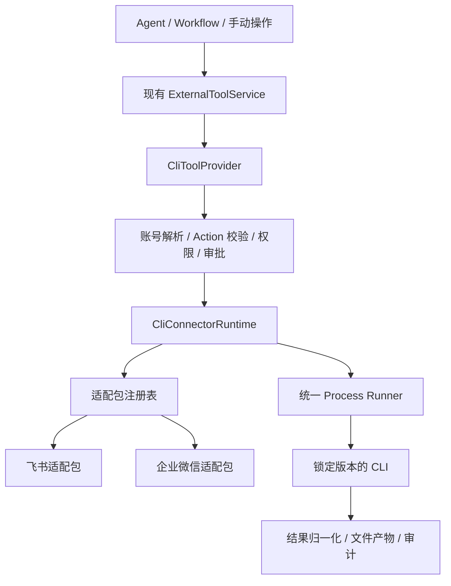

# CLI Connector 统一运行时技术方案

日期：2026-09-20

状态：待实施。本文定义目标契约和实施范围，不表示接口或运行能力已经存在。

关联方案：[连接器体验与多账号优化](./connector-experience-and-multi-account.md)。沿用其中的稳定账号、目标绑定、账号权限收窄和学习默认关闭规则。

## 1. 目标与确定的决策

为飞书、企业微信及后续 CLI 提供统一的 Connector 运行机制。新增厂商主要增加适配包、能力映射和契约测试，不修改核心执行器、授权页面及权限策略。

确定以下决策：

1. 新增原生 `cli` runtime，直接接入现有外部工具发现与执行体系，不要求每个 CLI 再包装成 MCP server。
2. 运行时统一安装、进程、账号上下文、授权状态、能力发现、执行策略、结果及审计；厂商差异留在适配包。
3. 声明式描述覆盖常见情况，复杂协议允许受版本约束的适配代码。第一版代码适配器随 xopc 发布，不从普通商店 manifest 加载任意 JavaScript。
4. 飞书与企业微信共同验证抽象；不先把飞书实现复制为企业微信实现。
5. 用户确认目前没有使用现有飞书 Connector 的用户，因此直接替换飞书 MCP 定义。**不做旧连接保留、旧凭据迁移、双后端兼容和渐进切换。** 通用 MCP runtime 及其他 MCP Connector 不受此决策影响。
6. 实际账号授权、读操作和明确授权的写操作仍是发布验收要求；去掉迁移不等于去掉联调。
7. 第一版交付有限、经过验证的业务动作；持续事件订阅、自动学习和长期同步不包含在第一版。

### 1.1 非目标

- 不实现任意 CLI 的零配置自动接入，不解析自然语言帮助后直接执行猜测出的命令。
- 不重写厂商 OpenAPI SDK，不批量手写所有业务 API。
- 不向 Agent 暴露任意 shell、可执行文件路径、凭据目录或无限制通用 API 调用。
- 不将 CLI Skills 作为授权和权限执行机制。
- 不借本次改造重做所有 MCP、Composio 后端；优先抽取可共用策略，维持已存在的外部工具入口。

## 2. 调研依据与现状

### 2.1 官方项目维护状态

2026-09-20 查询 GitHub API 和 npm registry 得到：

| 项目 | 主分支最近提交 | 最新发布 | 判断 |
| --- | --- | --- | --- |
| `larksuite/lark-openapi-mcp` | 2025-08-14 | 0.5.1，2025-08-06 | 长期未更新，未归档；未确认有官方弃用声明 |
| `larksuite/cli` | 2026-09-18 | 1.0.96，2026-09-16 | 持续开发，适合作为新接入方向 |

日期是调研快照，实施时重新确认兼容版本；生产安装必须锁定版本，不能使用浮动 `latest`。

证据：[MCP 最后提交](https://github.com/larksuite/lark-openapi-mcp/commit/21920354ec6e3966b52e89152620c5085e496b55)、[MCP 发布](https://github.com/larksuite/lark-openapi-mcp/releases/tag/v0.5.1)、[CLI 最后提交](https://github.com/larksuite/cli/commit/32d198896816e9416711468c20b14df3dbbc63f3)、[CLI 发布](https://github.com/larksuite/cli/releases/tag/v1.0.96)。不使用仓库 `updated_at` 判断代码维护活跃度。

### 2.2 两种 CLI 的协议差异

| 领域 | 飞书 CLI | 企业微信 CLI |
| --- | --- | --- |
| 授权 | 应用配置、用户 OAuth、设备码恢复等步骤 | 扫码绑定，可输出二维码文件 |
| 发现 | `lark-cli schema` 及具体方法 schema | `wecom-cli schema list/get` |
| 参数 | API 命令和快捷命令不同；有 `--params`、`--data` 等 | 支持 `--json` 请求体和命名参数 |
| 输出 | JSON 成功信封在 stdout，错误信封在 stderr | JSON 结果和结构化错误在 stdout |
| 身份 | 支持用户、机器人身份 | 需区分机器人、操作者和授权人的实际含义 |
| 凭据隔离 | profile、配置、keyring 的确切隔离行为待固定版本验证 | 支持 `WECOM_CLI_CONFIG_DIR`；keyring 隔离仍需验证 |

来源：[飞书 CLI 文档](https://github.com/larksuite/cli/blob/main/README.zh.md)、[企业微信 CLI 文档](https://github.com/WecomTeam/wecom-cli/blob/main/docs/cli-reference.md)。这些文档描述能力，不构成 xopc 已完成集成的证明。

飞书的 [Extension SDK](https://github.com/larksuite/cli/blob/main/extension/platform/README.md) 是编译到 Go 二进制中的进程内扩展，可提供凭据和命令限制等能力。第一版优先使用官方发行物；确实需要定制凭据注入时再评估 wrapper 构建，其构建与分发成本属于飞书适配包，不成为所有 CLI 的必选机制。

### 2.3 仓库可复用部分与缺口

| 位置 | 当前能力 | 本次处理 |
| --- | --- | --- |
| `src/connectors/types.ts` | kind 包含 cli，runtime 只有 mcp/composio/memorySource | 增加 CLI runtime、连接能力与授权交互契约 |
| `src/connectors/runtime-adapter-registry.ts` | 安装、卸载、更新适配 | 扩展运行能力；不要把现有同步更新接口强行塞入异步执行 |
| `src/agent/external-tools/` | search/describe/execute、工具引用和版本描述 | 新增一个 CliToolProvider，复用现有发现入口 |
| `src/process/run-process.ts` | 参数数组、超时、取消、输出限制、进程树终止 | 作为唯一进程启动基础设施 |
| `src/connectors/policy.ts`、`account-access.ts` | 应用与账号权限 | 抽取公共执行准备逻辑，避免照抄 Composio provider |
| `src/connectors/authorization-attempts.ts` | URL 授权记录、过期与身份检查 | 补充交互类型、取消、持久化恢复与 secret reference |
| `src/storage/sqlite/connector-account-repository.ts` | 稳定账号、当前授权、身份去重 | 复用存储；分离其中 Composio 专属的合并副作用 |
| `src/connectors/health.ts` | MCP 能力枚举驱动健康检查 | 按 runtime 分派，CLI 分层报告安装、授权、能力可用性 |
| `src/capabilities/store-connector.ts` | 仅接受 MCP 商店包 | 增加版本化 CLI manifest 验证，不接受任意代码 hook |
| `src/connectors/china-catalog.ts` | `feishu-workspace` 使用 MCP 0.5.1 | 直接改为 CLI，新增企业微信 CLI 定义 |

现有 `connector_backends` 表虽然名称通用，但约束和代码语义是 Composio managed/byok，且只有一个全局 active backend。CLI 不能直接插入这张表，也不能复用其全局切换语义。

## 3. 架构与责任边界



| 层 | 平台责任 | 适配包责任 |
| --- | --- | --- |
| 安装 | 校验来源、固定版本、原子安装、回滚 | 平台发行物映射、实际 executable 和版本探测 |
| 授权 | 生命周期、ownership、过期、交互呈现 | 授权命令、挑战解析、状态与身份读取 |
| 发现 | 缓存、检索、权限过滤、revision | schema 转换、稳定 actionId、可信动作分类 |
| 执行 | 审批、进程、预算、并发、审计 | 参数绑定、身份选择、结果和错误解析 |
| 文件 | 受控目录、下载额度、产物登记 | 将厂商输出映射为产物描述 |

适配包不能替平台选择账号、消费审批、降低权限或自行启动外部进程。代码 hook 属于可信代码，接口限制本身不提供沙箱；第三方可执行 hook 需未来独立定义扩展信任模型。

## 4. 契约设计

以下为拟新增接口草案；实施时复用现有类型并避免重复命名。

### 4.1 Runtime 定义与适配包

```typescript
type CliRuntimeDefinition = {
  type: 'cli';
  adapterId: string;
  adapterVersion: string;
  manifestVersion: 1;
  distribution: {
    id: string;
    version: string;
    integrity: string;
  };
};

type CliAdapterCapabilities = {
  accountIsolation: 'profile' | 'config-directory' | 'credential-provider' | 'single-account';
  authorization: boolean;
  remoteRevocation: boolean;
  dynamicDiscovery: boolean;
  fileArtifacts: boolean;
  eventStream: boolean;
};
```

发行物 manifest 将 `distribution.id` 映射到受支持的 npm 包或原生下载资源，按 OS/arch 声明实际可执行入口。包版本、适配器版本、manifest schema 版本分别管理。安装完整性覆盖实际执行的二进制；npm 包若二次下载二进制，不能只校验外层 tarball。

商店 manifest 可以引用已注册适配器和结构化绑定规则，不能提供任意安装 shell、动态 import 或 JS 表达式。通用声明式适配器支持固定 argv token、JSON 编码、输入字段映射和有限的结果字段选择。遇到超出声明能力的协议，增加适配包 hook，不不断扩张成脚本语言。

### 4.2 Action 契约

```typescript
type CliAction = {
  id: string;
  title: string;
  description: string;
  inputSchema: Record<string, unknown>;
  scope: 'read' | 'write' | 'admin';
  classification: 'curated' | 'unclassified';
  identities: Array<'user' | 'bot'>;
  requiredScopes: string[];
  retry: 'safe-read' | 'idempotency-key' | 'never';
  revision: string;
};
```

`id` 由适配器稳定映射到厂商方法，升级不随帮助文案变化。高风险写操作如何映射到现有 admin 必须在适配器中显式定义，不能直接等同于供应商权限名。未知分类不可执行；不能因用户有 admin 就执行未经分类的动态命令。

服务端在转换 schema 时补入现有 `xopcAccountId` 参数，执行时剥离该参数后再构造厂商请求。schema 必须验证输入，拒绝未知控制字段。供应商描述和 schema 是外部数据，不能修改运行策略。`batchRead` 仅对本地主机审核的只读动作设置，不照抄远端 hint。

通用 `api METHOD PATH` 第一版不向 Agent 开放。后续若开放，必须解析到确定端点、方法、参数 schema 和权限映射，不能以一个“通用读工具”绕过写权限。

### 4.3 适配器接口

```typescript
interface CliConnectorAdapter {
  readonly id: string;
  readonly capabilities: CliAdapterCapabilities;
  planProbe(context: CliAdapterContext): CliInvocation;
  planDiscovery(context: CliAdapterContext): CliInvocation[];
  decodeDiscovery(results: CliProcessOutput[]): CliAction[];
  planAction(action: CliAction, input: unknown, context: CliAdapterContext): CliInvocation;
  decodeAction(action: CliAction, output: CliProcessOutput): CliExecutionResult;
  authorization?: CliAuthorizationAdapter;
}
```

其中 `CliInvocation` 只引用 manifest 声明的 executable、argv、受控 input 和受限环境绑定，不接受 Agent 指定的 executable、cwd、env。`CliAdapterContext` 由服务端构造，包含固定账号身份和受控路径，不把整个 `process.env` 暴露给适配器。

普通业务 Action 第一版对应一个进程调用。授权可执行多个受控步骤；复合业务任务由现有 Workflow 编排，以免一个 Action 隐藏不可分别审计的写操作。

### 4.4 归一化执行结果

```typescript
type CliExecutionResult = {
  outcome: 'success' | 'failed' | 'unknown';
  data?: unknown;
  error?: {
    kind: 'invalid_input' | 'unauthorized' | 'scope_missing' | 'rate_limited'
      | 'network' | 'timeout' | 'cancelled' | 'protocol' | 'provider';
    code?: string;
    message: string;
    retryAfterMs?: number;
  };
  artifacts?: Array<{ id: string; name: string; mimeType?: string; size: number }>;
  pagination?: { cursor?: string; truncated: boolean };
};
```

所有结果另附平台确定的 connectorId/accountId/executionId 来源，不信任厂商输出覆盖这些字段。CLI 内部确认挑战可产生独立的 `confirmation_required` 控制结果，通过既有审批恢复链处理；不得把它当网络错误重试，也不得默认传入跳过确认参数。

进程退出码与厂商信封联合判断；退出 0 但业务报错仍为失败。成功进程输出不是合法协议，写动作结果应为 unknown，不能断言外部操作没有发生。

## 5. 安装、进程与执行上下文

### 5.1 目录与版本

通过现有状态根目录 helper 解析，遵循 `XOPC_STATE_DIR`；不硬编码用户 HOME。拟采用：

```text
<state>/connectors/cli/
  runtimes/<distribution>/<version>/<platform-arch>/
  connections/<connectionId>/credentials/
  attempts/<attemptId>/
  executions/<executionId>/
```

目录名仅使用服务端生成或验证的标识。CLI 安装在 Gateway 执行主机，浏览器和手机端无需安装。远端 Gateway 上的 localhost 授权回调不能假定可被用户浏览器访问；适配器必须声明并验证设备码、二维码或可达回调支持，否则清楚报告该部署方式不支持。

安装使用临时目录下载、校验、探测版本后原子激活；运行中调用固定旧版本路径，升级只影响新调用。卸载先停用新执行并取消相关后台进程，再处理无引用 runtime；不能删除其他连接共享的二进制。

### 5.2 进程规则

- 复用 `spawnProcess/runProcess`，强制 `shell: false`；受控参数数组不能退化为字符串模板执行。
- 固定 executable 绝对路径；最小环境变量白名单，不继承其他 Connector 的 token。
- 第一版默认业务调用超时 60 秒、捕获 stdout/stderr 各 1 MiB；下载按 Action 单独配置预算。授权超时使用供应商挑战有效期并受平台最大时长限制。
- 截断 JSON 不继续作为成功结果解析；大输出转受控文件产物或分页，不将完整载荷塞入模型上下文。
- 每连接的授权和凭据刷新串行；业务动作并发由平台预算控制。跨进程锁或 lease 保护凭据更新，不只依赖内存 mutex。
- 临时目录设置最小权限；下载路径、符号链接和返回文件须检查实际路径及归属，再登记为附件。Agent 不能要求下载写入任意系统路径。
- 日志使用 `createLogger('CliConnectorRuntime')`，保留 executionId、accountId、actionId、阶段、耗时和错误摘要；不记录 token、完整 argv 中的敏感值或完整业务正文。

相同操作系统账号下的任意 shell 权限可能直接读取 CLI 凭据、绕过 Connector 策略。本文的权限保证覆盖受管理执行入口；若产品要求对同时拥有任意 shell 的 Agent 强隔离，必须增加不同 OS 身份或沙箱运行凭据，不能声称 `shell:false` 已解决该边界。

## 6. 账号、授权与持久化

### 6.1 存储归属

复用 `connector_installations`、`connector_accounts`、`connector_connections`、目标账号绑定与审批表。配置文件仅保存安装定义与非敏感配置；账号、授权和执行状态以 SQLite 为准；凭据由 CredentialResolver 或已验证隔离的 CLI 凭据存储持有。

为 CLI 增加运行实例元数据表 `connector_cli_instances`，拟包含：

| 字段 | 含义 |
| --- | --- |
| instance_id | 与现有 Connector instanceId 对应 |
| connector_id | 应用定义 ID |
| adapter_id / adapter_version | 固定适配器及协议版本 |
| distribution_id / binary_version / integrity | 已校验发行物 |
| execution_host_id | 执行主机归属，第一版固定当前 Gateway |
| config_json | 非敏感配置，不保存凭据 |
| status / created_at / updated_at | 安装状态与时间 |

账号与连接新增可空 `runtime_instance_id`，CLI 记录必须有值，现有 Composio 记录保持原 backend_id。CLI 不借用 Composio backend_id；后续如统一后端模型，单独实施数据迁移。

CLI 身份唯一约束使用 `(principal_id, runtime_instance_id, connector_id, identity_key)` 的非空部分索引。已有账号索引和 Composio 初始化、同步、去重、清理路径必须明确排除 CLI 记录，特别是当前 `backend_id IS NULL` 的引导更新。账号 repository 中带 `composio:` 前缀的来源合并逻辑应由 Composio 调用方显式提供，不对 CLI 触发。

连接保存 credential reference、凭据存储 handle 和固定身份类型；同一连接只有一个执行身份，模型不能将 user 自行切换为 bot。适配器无法证明多账号隔离时声明 single-account，并在服务端阻止同实例的第二个独立账号。

### 6.2 通用授权状态机

```text
created → preparing → awaiting_user → verifying → succeeded
                     ↘ failed / expired / cancelled
```

授权挑战为有类型的结构：

```typescript
type AuthorizationChallenge =
  | { type: 'open_url'; url: string }
  | { type: 'device_code'; verificationUrl: string; userCode: string }
  | { type: 'qr_code'; artifactId: string };
```

设备轮询 secret 与 userCode 分开；仅 userCode、授权 URL 或受鉴权保护的二维码资源对用户界面可见。机密 device code 存 CredentialResolver，只在 attempt 中保存引用。

扩展授权记录：runtime instance、phase、challenge、state revision、provider state reference、next poll time、lease、取消时间、失败原因和预期 accountId。若现有状态 CHECK 不支持新增状态，使用下一可用数据库迁移版本扩展，不在本文预占版本号。

授权流程：

1. 验证当前 principal 有权管理安装，创建 attempt 和独立临时凭据上下文。
2. 适配器执行准备步骤，按类型返回挑战；多步骤授权使用同一 attempt 的 revision 更新挑战。
3. 平台按供应商规定间隔轮询，单一 lease 防止多次刷新重复启动登录。
4. 完成后读取真实身份、租户及实际 scopes。强身份必须包含厂商 ID 所属命名空间；不能仅用邮箱、昵称或 app 范围 open_id 跨应用合并。
5. 验证 expectedAccountId，成功才原子提交 currentConnectionId；重连失败保留旧连接，不提前覆盖其凭据。
6. 相同强身份在相同实例内更新授权并保留 accountId；未知身份显示“待确认”，不按别名去重或宣称已就绪。
7. 结束时清理挑战、短期 secret 与二维码资源；认证 token 保留在该连接专属存储。

关闭弹窗不取消授权；显式取消终止平台等待并防止晚到结果被提交或恢复旧任务。Gateway 重启后可恢复的协议继续轮询；不可恢复的登录进程将 attempt 标记失败并要求重试，不仅凭 `auth status` 已登录就绑定到新 attempt。

断开连接先停用本地执行，取消等待与后续任务。只有供应商确实提供并成功执行远端撤销，才显示“已撤销授权”；否则显示“已断开本地连接”并提供供应商撤销入口。

## 7. 发现、执行、审批和审计

### 7.1 接入 ExternalToolProvider

新增 `source: 'cli'`，同步更新来源枚举、引用解析、服务注册、UI 来源展示和相关 schema。一个 CliToolProvider 服务全部 CLI 适配包；不为飞书和企业微信分别建立 provider。

- `search`：只搜索当前 principal/Agent 可用安装与能力，返回简短命中。
- `describe`：按需获取完整 Action schema 和 revision，不把所有工具一次塞入上下文。
- `execute`：复用目标账号绑定与审批恢复机制，进入公共执行准备及 CLI runtime。

发现缓存至少绑定 instance、account、CLI/adapter 版本、授权 revision 和 schema hash。升级、重连、scopes 变化使缓存失效；schema 与已批准参数不再一致时重新描述、重新确认。只允许预先分类的 Action 集合，供应商新增方法不会自动扩大权限。

### 7.2 执行顺序

```text
解析工具引用和 Action revision
→ 验证参数
→ 根据 principal/Agent/目标解析账号
→ 验证安装、账号、当前授权和实际 scopes
→ 评估应用与账号权限
→ 处理审批等待
→ 再次校验权限并原子消费审批、登记 execution
→ 锁定连接、版本、身份和执行计划
→ 启动 CLI
→ 解码结果、登记产物和审计
```

审批绑定 installation、instance、account、connection revision、action revision、参数 hash、Agent、conversation 和 objective revision。变更任何关键字段不能消费旧审批。同步调整现有审批 hash/持久化字段，而非只增加前端确认文案。

一条调用只操作一个账号；多账号由上层分别调用并保留来源。指定账号不可用时不能回退到另一个账号。后台任务缺少确定账号时等待配置。

### 7.3 幂等与不确定结果

增加持久化执行记录，保存平台生成的 executionId、请求指纹、状态、身份与版本、供应商请求 ID 和结果摘要。审批消费与 execution 创建在同一 SQLite 事务内完成；启动外部进程无法与远端操作组成事务。

状态至少区分 prepared、running、succeeded、failed、unknown。Gateway 在 running 阶段崩溃、写操作超时或通信中断时标记 unknown；查询供应商状态或请求用户处理，不能宣称 exactly-once。

只读操作可按限流和网络错误有限重试；写操作仅在供应商提供且已验证幂等键语义时复用相同键重试。认证错误不批量撤销其他账号，也不默认重新执行写请求。

从现有 Composio provider 抽出账号解析、策略和审批上下文构造的公共函数，CLI 使用同一逻辑。分阶段替换 Composio 调用并跑回归测试，不另建平行的账号选择系统。

## 8. Gateway 与 Web UI

复用现有安装、详情、启停和策略入口；新增运行时中立的账号与授权接口。拟新增路径如下，实施时先检查现有路由复用机会：

| 方法与路径 | 语义 |
| --- | --- |
| `GET /api/connectors/:id/accounts` | 当前 principal 可见账号 |
| `POST /api/connectors/:id/authorizations` | 开始添加或重新授权，instance 必须与 connector 匹配 |
| `GET /api/connectors/authorizations/:attemptId` | 当前挑战、状态与有效期 |
| `POST /api/connectors/authorizations/:attemptId/cancel` | 显式取消 |
| `GET /api/connectors/authorizations/:attemptId/artifact` | 受鉴权二维码，禁止任意路径读取 |
| `PATCH /api/connectors/accounts/:accountId` | 标签和可用性，权限只能按既有规则变更 |
| `DELETE /api/connectors/accounts/:accountId` | 停用并执行适配器支持的撤销/清理 |

不新增 CLI 原始 exec HTTP 接口。所有业务执行复用外部工具执行链。管理接口校验管理权限、principal、connector、instance 和 account 所有权，不能仅验证 ID 存在。错误返回区分未安装、未登录、缺 scope、版本不兼容、协议异常和网络失败。

新增路径必须更新 `lazy-bundles.ts` 和映射测试；考虑静态 `accounts/authorizations` 路径与 `/:id` 的路由顺序。最终通过真实带鉴权的 Gateway HTTP 测试验证，而非只直接调用 route 模块。

界面按能力渲染“安装中、等待授权、验证账号、已连接、需要重连”，不能以二进制已安装判定连接成功。授权组件只识别 open_url/device_code/qr_code，不包含厂商判断。

复用账号管理、现有 design tokens、PopoverSelect、Skeleton 和固定响应式复杂弹窗；面向用户不展示 runtime、argv 等细节，高级诊断可显示版本和协议错误。API token 不能放在二维码图片 URL 的 query 中，应通过已认证请求获取资源。

连接成功默认不开启学习或扫描，不因 CLI 支持事件命令就展示已支持事件订阅。

## 9. 飞书、企业微信首批适配范围

### 9.1 飞书

- 保留产品 ID `feishu-workspace`，直接替换为 CLI 定义；移除飞书 MCP 包配置、工具预设表单和专属测试预期。
- 不保留旧 MCP 连接，不导入其 App Secret/token，不写兼容 shim。已有开发者测试数据可显式删除后重新连接；安装发现同名旧记录时报告需清理，不静默解释为 CLI 记录。
- 固定版本验证应用配置与用户登录步骤、设备码恢复、身份读取、真实 scopes 和凭据隔离。
- 首批选择文档搜索/读取、日程查询，再增加一项日程创建作为写入验收；只使用该版本实际支持的命令和 schema。
- 第一版优先 user 身份，bot 作为独立授权身份按能力逐步开放；不依赖 auto 身份回退。

### 9.2 企业微信

- 新增独立 Connector 定义，复用相同 runtime/provider/UI。
- 使用扫码授权和受控二维码产物；支持 `WECOM_CLI_CONFIG_DIR` 绑定连接存储。
- 验证 auth status、schema discovery、机器人及授权人身份含义、凭据隔离和实际可用业务范围。
- 首批选择文档搜索/读取、联系人查询，并在明确允许的场景验证一项写操作。
- CLI 消息发送不等于 Channel 接收链路；本方案不承诺双向聊天接入。

两者均需覆盖分页、结构化业务错误和至少一项文件产物。具体动作 ID 以固定版本 discovery 为准，本文不杜撰未经验证的命令。

## 10. 代码组织与实施阶段

建议新增代码位置，采用仓库 camelCase 命名：

```text
src/connectors/cli/
  types.ts
  manifest.ts
  adapterRegistry.ts
  runtime.ts
  installer.ts
  authorization.ts
  discovery.ts
  invocation.ts
  result.ts
  artifacts.ts
  adapters/lark.ts
  adapters/wecom.ts
  __tests__/
src/agent/external-tools/cliProvider.ts
```

账号/审批公共逻辑放现有 `src/connectors/`，SQL repository 仍放 `src/storage/sqlite/`。以上是职责分配，不要求每个概念单独建文件；避免只转发一个函数的文件。

| 阶段 | 工作 | 完成条件 |
| --- | --- | --- |
| A：版本与协议验证 | 固定两个 CLI 版本，采集脱敏 schema/成功/失败 fixtures，核实身份和存储 | 明确多账号、远端 Gateway、撤销和文件能力边界 |
| B：平台基础 | CLI manifest、安装、执行、结果、SQLite 记录与通用授权状态机 | fake CLI 测试通过，无厂商分支进入核心执行器 |
| C：发现与策略 | CliToolProvider、缓存、账号绑定、审批、审计、Workflow 预检 | 所有入口执行同一账号和权限检查，写入未知结果可恢复 |
| D：两家适配与界面 | 飞书替换、企业微信接入、统一授权/账号 UI、Gateway API | 同一套组件完成两种授权，两个真实账号环境分别联调 |
| E：发行与泛化验收 | 商店校验、版本升级回退、契约文档、第三个测试适配包 | 新适配包不改核心 runtime/provider/UI/policy |

阶段 A 可先使用已有本地二进制验证协议；最终正式安装必须经过受管理发行物和完整性校验。阶段 E 的第三个适配包可使用确定性 fake CLI，验证扩展边界，不代替实际厂商联调。

本次没有“飞书迁移阶段”。数据库扩展只为新增 CLI 功能；不为无人使用的旧飞书数据增加迁移工程。

## 11. 测试矩阵与交付判定

| 场景 | 预期 |
| --- | --- |
| 包完整性错误、架构不支持、版本不兼容 | 不激活，原可用 runtime 不受影响 |
| 参数包含空格、引号、shell 元字符 | 按原值传递，不能执行第二条命令 |
| CLI 返回 exit 0 + 业务错误 | 正确判失败，不误报成功 |
| stderr JSON、stdout 日志、NDJSON、超大输出 | 按适配协议处理，未知格式不猜测为成功 |
| 两账号并发、keyring、凭据刷新 | 身份不串用；未证明隔离则拒绝多账号 |
| 取消、超时、重启、授权晚到 | 不错误提交连接或恢复已取消目标 |
| 重连为另一个身份 | 保留原账号，明确失败，不覆盖绑定 |
| Agent 无权限、账号暂停、scopes 缺失 | 执行前拒绝，不能换账号绕过 |
| 审批后修改参数、版本、账号或目标 | 旧审批失效 |
| 写操作成功但响应丢失/进程崩溃 | unknown，不盲目重试 |
| 文件越界、符号链接、错误归属 | 不登记或暴露产物 |
| 动态新增未分类方法、通用 API 绕过 | 无法执行 |
| CLI 账号与 Composio 初始化/去重并存 | CLI 不被归入 Composio backend，不触发其来源合并 |
| 真实 Gateway 路由与鉴权 | 经过 lazy loader 正确命中；越权和相邻路由均有负向断言 |
| 飞书和企业微信授权、只读与明确授权写入 | 实际执行身份、结果和审计一致 |
| 第三个适配包 | 不修改核心执行器、授权页面、Provider 和策略代码 |

测试采用 fixture + fake CLI 进行协议和故障注入；真实写入只使用明确授权的测试资源。协议测试不能全部 mock 掉进程层，需要至少一组真实子进程验证取消、输出限制和参数传递。

运行 root typecheck、相关 vitest、Web type-check/build 及修改范围 lint；新增 API 需真实本地 HTTP 集成测试；UI 覆盖中英文、窄屏、深浅色、键盘及授权失败恢复。文档交付阶段只验证文档链接和格式，不宣称上述实现测试已通过。

## 12. 发布前必须关闭的外部不确定项

1. 固定飞书版本的应用初始化和登录输出能否稳定机器解析；若不具备结构化输出，解析器必须有精确版本约束和 fixtures，协议漂移立即失败。
2. 两家 CLI 的文件配置与系统 keyring 是否真正隔离，以及同一进程用户下多账号刷新是否安全。
3. 飞书应用范围身份 ID、企业微信机器人/操作者/授权人之间的关系，哪些字段可作为稳定业务账号标识。
4. 每种部署方式的授权回调可达性、远端撤销能力及 token 刷新行为。
5. npm 安装器的二次下载地址与校验机制，所有目标平台的真实入口。
6. 动态 schema、分页游标、下载响应和供应商内部确认挑战的固定版本契约。

无法验证的能力应关闭并如实展示，不通过厂商名称推断已支持多账号、事件、撤销或自动恢复。
