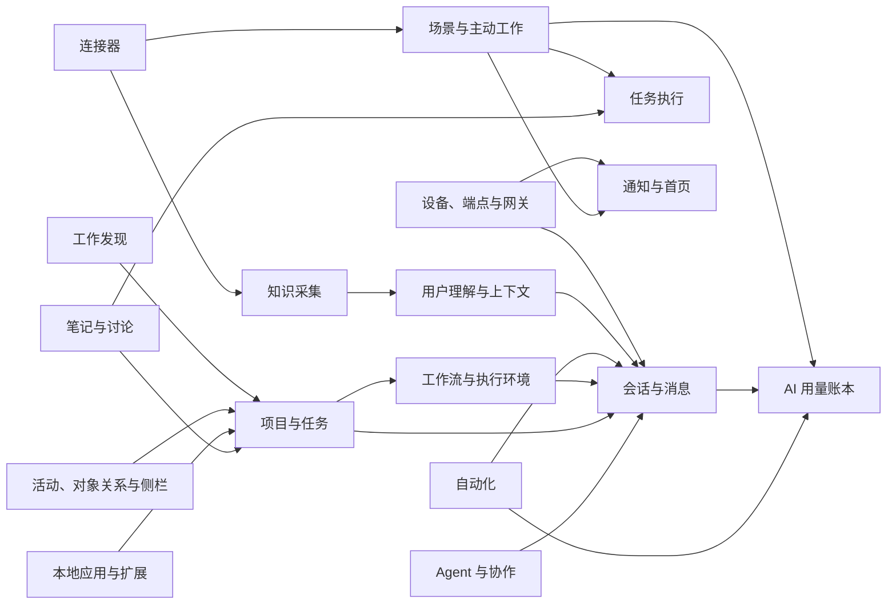
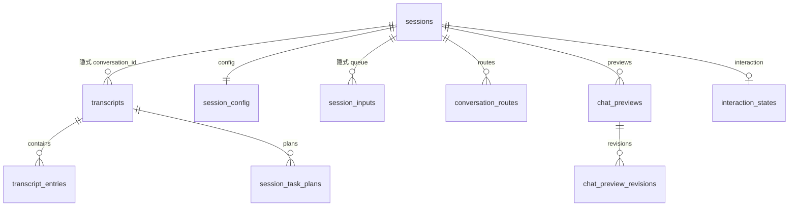
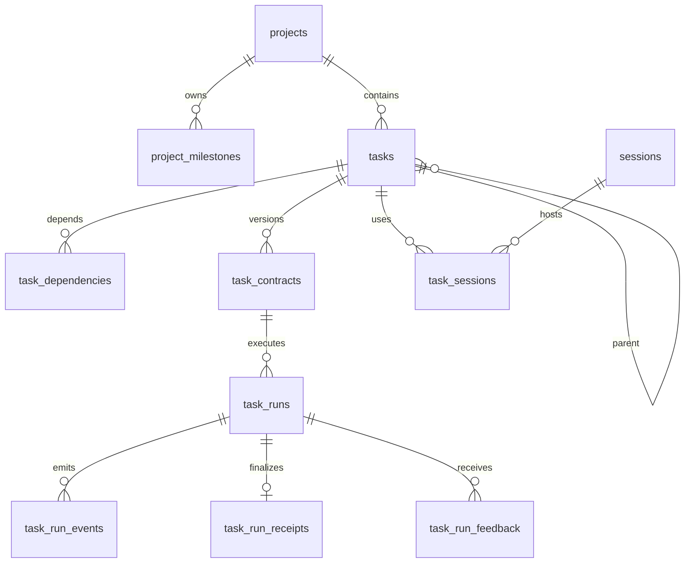
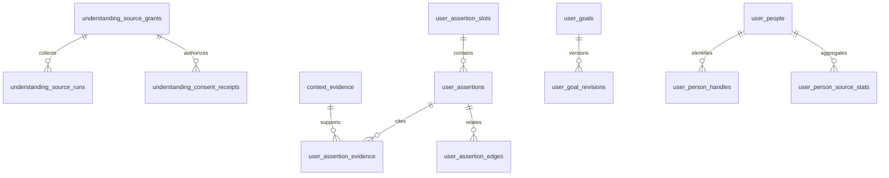

# xopc 数据库业务域、表模型与关系审计

> 审计日期：2026-09-26<br>
> 代码版本：数据库 schema v222（基线 v165 + 166–222 迁移）<br>
> 范围：`src/storage/sqlite/schema.sql`、`src/storage/sqlite/schemas/*.sql`、`src/storage/sqlite/migrations/*.sql` 以及生产代码中的 SQL 读写点。

## 1. 结论摘要

- 当前最终结构包含 **203 张普通业务/支撑表**、**5 张 FTS5 虚拟表**，另有 **1 张 `schema_meta`**。SQLite 自动生成的 25 张 FTS shadow table 不属于业务模型，不在下文单独列出。
- 数据模型已经形成 16 个主要业务域：会话、Agent、项目任务、工作流与执行环境、自动化、笔记与讨论、知识与记忆、用户理解、连接器、场景、通知与首页、设备与端点、本地应用、活动关系、工作发现、AI 用量账本。
- 关系既有数据库外键，也有依赖应用层维护的隐式 ID、JSON 快照和多态引用。最终 schema 中共有 **157 条显式外键边**。
- 旧文件记忆索引 `memory_files`、`memory_chunks`、`memory_fts`、`memory_relations` 已由 v217 删除；悬空到不存在 `memory_records` 的外键缺陷随之消除。
- v218–v222 已完成核心关系索引、关键 JSON 约束、时间字段归一化、AI 用量保留策略，以及 session 配置单一权威源。剩余重点是 compact baseline、更多 JSON 约束和多态关系治理。

## 2. 口径与关系标记

本报告以“对空数据库执行完整迁移后的 `sqlite_master`”为准，而不是直接照抄基线文件。这样会正确排除已被迁移删除、重命名或重建的旧表。

关系标记：

- **FK**：SQLite 显式外键，会由 `PRAGMA foreign_keys = ON` 强制执行。
- **隐式**：存储了另一个实体的 ID，但没有数据库外键，由应用层维护。
- **多态**：通过 `kind + id`、`owner_kind + owner_id` 或 JSON 指向多个实体，不适合直接建立单一外键。
- **快照**：有意保存运行当时的不可变 JSON，即使源实体后来删除也应保留。
- **候选废弃**：代码扫描未发现生产读写，仍需在真实数据库上做行数与历史兼容确认后再迁移删除。

## 3. 业务域总览



## 4. 分业务域表清单

### 4.1 会话、输入与对话呈现

| 表 | 职责 | 主要关系 |
|---|---|---|
| `sessions` | 稳定的 conversation 聚合根、Agent/项目/来源路由、统计与当前 transcript 指针 | `project_id`、`active_transcript_id`、`parent_conversation_id` 均为隐式关系 |
| `transcripts` | 一次会话生命周期中的活动或归档 transcript | `conversation_id` → `sessions` 为隐式关系 |
| `transcript_entries` | transcript 的有序消息、上下文、压缩边界等行 | FK → `transcripts` |
| `transcript_fts` | transcript 全文检索虚拟表 | 由代码同步，ID 隐式指向 conversation/transcript/entry |
| `session_config` | 会话级模型、思考等级、工作目录等覆盖项 | FK → `sessions` |
| `session_inputs` | 排队、插队、跟随运行的用户输入及附件 | `conversation_id`、`run_id`、`task_run_id` 为隐式关系 |
| `session_input_runtime` | 每个 conversation 当前活跃 input/run 与并发修订号 | `conversation_id` 为隐式关系 |
| `session_task_plans` | transcript 内的 Agent 计划及计划项状态 | FK → `transcripts` |
| `session_clarification_waits` | 工具澄清等待、批准与恢复状态 | conversation/transcript/run/tool call 均为隐式关系 |
| `session_connection_waits` | 会话等待连接器授权或连接完成的状态 | conversation/transcript 为隐式关系 |
| `conversation_routes` | channel/route key 到 conversation 的映射 | FK → `sessions` |
| `chat_previews` | 会话内生成的可交互预览头信息 | FK → `sessions` |
| `chat_preview_revisions` | 预览源代码修订与晋升到本地应用的记录 | FK → `chat_previews`；可选 FK → `local_apps` |
| `composer_input_history` | 本地输入框历史 | 独立、有界历史 |
| `interaction_states` | 会话级支持需求、情绪假设与修复状态 | FK → `sessions` |

核心关系：



### 4.2 Agent 目录与协作策略

| 表 | 职责 | 主要关系 |
|---|---|---|
| `agents` | Agent 目录、profile、能力覆盖与软删除 | 聚合根 |
| `agent_catalog_settings` | 默认 Agent 和全局 defaults，单例 | FK → `agents` |
| `agent_bindings` | Agent 按位置排列的绑定规则 | FK → `agents` |
| `agent_surface_defaults` | 各 UI/渠道 surface 的默认 Agent | FK → `agents` |
| `agent_provisioning_jobs` | Agent 工作区配置创建/删除任务 | FK → `agents` |
| `collaboration_rules` | communication/execution/boundary/routine/initiative 协作规则 | FK → 当前 `collaboration_rule_revisions` |
| `collaboration_rule_revisions` | 协作规则不可变文本修订 | FK → `collaboration_rules`，与上表形成延迟约束环 |

主要 TypeScript 模型：`src/agent-catalog/types.ts`、`src/agent-catalog/repository.ts`、`src/user-context/domain.ts`。

### 4.3 项目、里程碑与任务执行

| 表 | 职责 | 主要关系 |
|---|---|---|
| `projects` | 项目聚合根、目标、范围、工作区和执行模式 | `default_agent_id` 为隐式关系 |
| `projects_fts` | 项目全文检索虚拟表 | 隐式 → `projects` |
| `project_milestones` | 项目里程碑 | FK → `projects` |
| `project_updates` | 项目健康度、进展、风险与下一步的时间线 | FK → `projects` |
| `project_workflow_presets` | 项目到 workflow definition 的预设上下文 | FK → `projects`；definition 为隐式关系 |
| `project_workspace_creation` | 项目工作区创建重试队列 | FK → `projects` |
| `tasks` | 任务树、看板排序、委派、优先级和生命周期 | FK → `projects`、`project_milestones`、父 `tasks` |
| `task_dependencies` | 任务 DAG 的依赖边 | 双 FK → `tasks` |
| `task_contracts` | 任务目标、验收标准、约束和风险的版本化合同 | FK → `tasks` |
| `task_authority_grants` | 任务可执行能力及作用域授权 | FK → `tasks` |
| `task_runs` | 可租约、可重试、可形成父子树的任务执行实例 | FK → `tasks`、`task_contracts`、`context_snapshots`、`sessions`、父/根/重试 run |
| `task_run_events` | run 内严格排序的事件流 | FK → `task_runs` |
| `task_run_receipts` | run 的完成凭证、验证与剩余工作 | FK → `task_runs` |
| `task_run_feedback` | run 的质量、纠偏和支持适配反馈 | FK → `task_runs` |
| `task_waits` | run/任务的外部等待条件与恢复信息 | FK → `tasks`；`task_run_id` 为隐式关系 |
| `task_sessions` | 任务与执行 conversation/Agent 的绑定历史 | FK → `tasks`、`sessions`；run 为隐式关系 |
| `task_conversation_state` | 任务当前 conversation、执行 Agent 与 assignment epoch | FK → `tasks`、`sessions` |
| `task_handoff_snapshots` | Agent/conversation 交接时的上下文快照 | FK → `tasks`、来源/目标 `sessions` |



主要 TypeScript 模型：`src/tasks/`、`src/projects/project-service.ts`、`src/storage/sqlite/session-task-plan-repository.ts`。

### 4.4 工作流、执行环境与运行上下文

| 表 | 职责 | 主要关系 |
|---|---|---|
| `workflow_runs` | workflow 运行索引、来源、结果和指标 | FK → `task_runs`；conversation/project/parent conversation 为隐式关系 |
| `workflow_events` | workflow 的 agent/run 有序事件流 | `run_id` 为隐式关系 |
| `workflow_context_snapshots` | workflow 选中的上下文与 token 估算 | run/project 为隐式关系 |
| `execution_environments` | local/worktree 等执行环境及 Git 状态 | FK → `projects` |
| `execution_environment_bindings` | conversation 到执行环境的占用历史 | FK → `execution_environments`；conversation 为隐式关系 |
| `execution_environment_events` | 环境状态转换审计 | FK → `execution_environments` |
| `execution_context_runs` | 一次上下文选择运行及指标 | conversation/turn 为隐式关系 |
| `execution_context_items` | 候选对象评分、入选原因 | FK → `execution_context_runs`；object 为多态关系 |
| `execution_context_feedback` | turn 对上下文选择的反馈 | FK → `execution_context_runs.turn_id` |
| `context_snapshots` | 任务或会话实际注入 LLM 的授权上下文快照 | FK → `sessions`；owner 为多态关系 |

主要 TypeScript 模型：`src/workflows/domain/run.ts`、`src/workflows/store/`、`src/execution-environments/`、`src/agent/context/`、`src/workflows/context/`。

### 4.5 通用自动化与浏览器自动化

| 表 | 职责 | 主要关系 |
|---|---|---|
| `automations` | 定时/事件自动化定义、动作、安全、管理、可靠性和结果投递策略 | project 为隐式关系；关键 JSON 列均有数据库校验 |
| `automation_runs` | 自动化运行快照、租约、取消和结果 | automation/conversation/workflow/root run 均为隐式关系，以保留运行历史 |
| `automation_run_events` | 自动化运行事件 | run/automation 为隐式关系 |
| `automation_run_requests` | 启动 run 时的完整 automation 快照 | run 为隐式关系、快照语义 |
| `automation_deleted_revisions` | 已删除自动化的最后 revision，防止旧写覆盖 | automation 为逻辑墓碑 |
| `automation_events` | 统一业务事件信封、投影租约、重试和 dead-letter 状态 | subject 多态；correlation/causation/root event 为隐式事件链 |
| `automation_event_deliveries` | 事件到匹配 automation 的投递、运行与重试状态 | FK → `automation_events`；automation/run 为隐式关系 |
| `automation_results` | 自动化运行产生的规范化结果信封 | FK → `automation_runs` |
| `automation_result_deliveries` | 结果到 gateway/webhook 等目的地的投递租约和状态 | FK → `automation_results` |
| `browser_automations` | 浏览器专用自动化定义与 revision | 独立聚合根 |
| `browser_automation_runs` | 浏览器自动化运行 | FK → `browser_automations` |
| `browser_action_audit` | 浏览器动作逐步审计 | FK → `browser_automation_runs` |

主要 TypeScript 模型：`src/automations/domain/types.ts`、`src/automations/events/`、`src/automations/delivery/`、`src/automations/storage/`、`src/browser/automations/`。

### 4.6 笔记、附件清理与讨论采集

| 表 | 职责 | 主要关系 |
|---|---|---|
| `notes` | Markdown 笔记、任务摘要、附件摘要和列表投影 | 聚合根 |
| `notes_fts` | 笔记全文检索虚拟表 | 隐式 → `notes` |
| `note_snapshots` | 笔记历史快照 | FK → `notes` |
| `note_agent_contexts` | 从笔记生成的 Agent 上下文缓存 | `note_id` 为隐式关系 |
| `note_file_cleanup` | 笔记文件删除补偿队列 | note 为隐式关系，允许主记录先删除 |
| `note_deletion_cleanup` | 笔记关联对象删除补偿队列 | `kind + object_id` 多态关系 |
| `discussion_capture_settings` | workspace 录音同意策略 | workspace 为逻辑作用域 |
| `discussion_captures` | 一次讨论录音、转写、组织结果的聚合根 | FK → `notes`、可选 FK → `projects` |
| `discussion_recording_chunks` | 客户端上传音频 chunk 清单 | FK → `discussion_captures` |
| `discussion_recording_jobs` | 音频拼装/处理租约任务 | FK → `discussion_captures` |
| `discussion_transcript_segments` | 分段音频、原始/展示文本和纠正状态 | FK → `discussion_captures` |
| `discussion_transcript_revisions` | 用户修订后的完整 segment 快照 | FK → `discussion_captures` |
| `discussion_organizations` | LLM 对讨论的结构化组织版本 | FK → `discussion_captures` |
| `discussion_analysis_chunks` | 按输入 hash 缓存的分析结果 | FK → `discussion_captures` |
| `discussion_edits` | 用户对组织结果的覆盖 | FK → `discussion_captures` |
| `discussion_action_tasks` | 讨论 action item 到任务的映射 | FK → discussion；`task_id` → `tasks` 为隐式关系 |

主要 TypeScript 模型：`src/notes/types.ts`、`src/notes/store.ts`、`src/discussions/`。

### 4.7 知识采集、知识项与记忆维护

| 表 | 职责 | 主要关系 |
|---|---|---|
| `knowledge_source_items` | 外部来源的规范化原始条目、敏感度和合成状态 | 来源实例为逻辑关系 |
| `knowledge_source_changes` | source item 的增删改序列 | FK → `knowledge_source_items` |
| `knowledge_collection_state` | 每个来源/collection scope 的增量 cursor | 来源实例为逻辑关系 |
| `knowledge_consumer_watermarks` | 各 consumer 已消费到的 change sequence | 来源实例为逻辑关系 |
| `knowledge_sync_runs` | 一次来源同步的 cursor、统计与错误 | 来源实例为逻辑关系 |
| `knowledge_items` | 从来源或 Agent 生成的可检索知识事实 | scope/source conversation/turn/agent 多为多态或隐式关系 |
| `knowledge_item_status_events` | 知识项状态转换审计 | FK → `knowledge_items` |
| `knowledge_items_fts` | 知识项全文检索虚拟表 | 隐式 → `knowledge_items` |
| `memory_maintenance_runs` | 用户模型/记忆压缩、清理运行 | 独立运行聚合根 |
| `memory_maintenance_decisions` | 每次维护对对象采取的动作 | FK → `memory_maintenance_runs`；对象为多态关系 |
| `memory_suppressions` | 被用户抑制的记忆指纹 | 独立去重集合 |

主要 TypeScript 模型：`src/knowledge/types.ts`、`src/knowledge/ingestion-service.ts`、`src/knowledge/connected-knowledge-pipeline.ts`、`src/memory-maintenance/`。

### 4.8 用户理解、证据、目标与关系人

| 表 | 职责 | 主要关系 |
|---|---|---|
| `understanding_source_grants` | 用户授权的数据来源、访问和保留策略 | 聚合根 |
| `understanding_consent_receipts` | grant 的用途、字段、Agent 范围和撤销凭证 | FK → `understanding_source_grants` |
| `understanding_source_runs` | 用户理解来源采集运行 | FK → grant；connector learning job 为隐式关系 |
| `understanding_refresh_batches` | 一组 source run 的刷新批次 | run ID 保存在 JSON 中 |
| `context_evidence` | 事实证据及来源、信任、保留策略 | source/run/item/conversation/turn/message 多为隐式关系 |
| `context_extraction_runs` | 从输入提取上下文对象的运行 | 聚合根 |
| `context_extraction_outputs` | 提取候选及落地对象 | FK → extraction run；对象为多态关系 |
| `context_edges` | 任意 owner 到任意 target 的上下文绑定 | 双端多态关系 |
| `user_assertion_slots` | 主体 + 谓词 + scope 的事实槽位 | 聚合根 |
| `user_assertions` | 事实/偏好/边界等断言及置信度、用途和保留策略 | FK → slot、自引用 supersedes；consent receipt 为隐式关系 |
| `user_assertions_fts` | 用户断言全文检索虚拟表 | 隐式 → assertions/slots |
| `user_assertion_evidence` | assertion 与证据的多对多关系 | FK → `user_assertions`、`context_evidence` |
| `user_assertion_edges` | assertion 间支持/冲突等图关系 | 双 FK → `user_assertions` |
| `user_assertion_status_events` | assertion 状态转换审计 | FK → `user_assertions` |
| `user_model_observations` | 尚未提升为稳定 assertion 的原始观察 | FK → evidence、source grant |
| `user_goals` | 用户目标树与当前 revision 指针 | 自 FK；FK → `user_goal_revisions` |
| `user_goal_revisions` | 目标不可变修订 | FK → goal、可选 evidence |
| `user_priority_windows` | 某时间窗口内对象优先级 | 可选 FK → evidence；target 多态 |
| `user_people` | 用户关系网络中的规范化人物 | 自 FK 表示 merge |
| `user_person_handles` | 邮箱/账号等人物标识 | FK → `user_people` |
| `user_person_source_stats` | 人物在各来源中的交互统计 | FK → `user_people` |
| `user_people_index_state` | 人物索引重建 watermark | principal 逻辑作用域 |
| `user_trust_policies` | principal 的默认行动信任等级 | principal 逻辑作用域 |



主要 TypeScript 模型：`src/user-context/domain.ts`、`src/user-context/config.ts`、`src/user-context/relationships/types.ts`、`src/storage/sqlite/context-evidence-repository.ts`。

### 4.9 连接器、账号与外部能力执行

| 表 | 职责 | 主要关系 |
|---|---|---|
| `connector_catalog_entries` | provider connector 定义缓存 | connector 为逻辑键 |
| `connector_backends` | 云端/本地 connector backend 和凭据引用 | 活动 backend 受唯一索引约束 |
| `connector_installations` | principal 安装策略、Agent 范围与确认策略 | selected accounts 保存在 JSON |
| `connector_accounts` | connector 身份账号与可用策略 | backend/current connection 为隐式关系 |
| `connector_connections` | provider connection 实例 | FK → account；可选 FK → installation |
| `connector_objective_accounts` | conversation/objective 选择的账号 | FK → account；conversation/transcript/objective 为隐式关系 |
| `connector_sync_policies` | 每个账号的扫描策略 | FK → account |
| `connector_authorization_attempts` | OAuth/授权尝试状态 | FK → connection；backend/account 为隐式关系 |
| `connector_cli_authorizations` | CLI 授权挑战状态 | instance/account 为隐式关系 |
| `connector_cli_executions` | CLI connector 执行与 revision | account/connection 为隐式关系 |
| `connector_action_metadata` | 动作 schema 与 scope 缓存 | connector/action 复合逻辑键 |
| `connector_approvals` | 高风险动作批准与消费 | 可选 FK → connection；conversation/agent/wait 为隐式关系 |
| `connector_execution_audit` | connector 决策与执行审计 | 可选 FK → installation/connection |
| `connector_webhook_deliveries` | webhook 去重、处理和重试 | provider/payload hash 逻辑键 |
| `connector_learning_jobs` | connector 内容学习后台任务 | FK → account/connection |
| `connector_runtime_identity` | 本地 runtime installation 单例 | installation 为隐式关系 |
| `capability_operations` | 可幂等恢复的能力调用操作 | principal/capability 为逻辑关系 |
| `capability_invocations` | operation 在各 surface 的尝试 | FK → `capability_operations` |
| `capability_imports` | 能力导入请求与幂等 payload | owner/kind 逻辑作用域 |
| `import_selections` | 用户导入选择结果 | owner/kind 逻辑作用域 |

主要 TypeScript 模型：`src/connectors/`、`src/storage/sqlite/connector-account-repository.ts`、`src/storage/sqlite/connector-learning-repository.ts`、`src/capabilities/`。

### 4.10 场景（Scenes）与主动执行

| 表 | 职责 | 主要关系 |
|---|---|---|
| `scene_template_versions` | 场景模板不可变版本 | 聚合根 |
| `scene_activations` | 用户启用的场景实例 | 复合 FK → template version |
| `scene_activation_requests` | 激活请求幂等映射 | FK → activation |
| `scene_preferences` | owner/workspace 场景偏好 | 作用域配置 |
| `scene_notes` | activation 的运行说明 | FK → activation |
| `scene_work_items` | 场景观察的业务对象和 revision | FK → activation |
| `scene_events` | 外部/内部事件事实 | owner/workspace/account 为逻辑关系 |
| `scene_trigger_intents` | 从 schedule/event 产生的待执行意图 | FK → activation、event |
| `scene_intent_events` | intent 与多个 event 的连接表 | FK → intent、event |
| `scene_schedule_cursors` | 每个 activation/trigger 的下次执行点 | FK → activation |
| `scene_runs` | 有租约和重试的场景运行 | FK → activation、intent |
| `scene_context_snapshots` | run/lease epoch 的证据快照 | FK → run |
| `scene_model_reservations` | run 的模型预算预留 | FK → run、activation |
| `scene_connector_usage` | account 的日请求计数 | account 为隐式关系 |
| `scene_outcomes` | run 产出的结构化结果 | FK → run |
| `scene_presentations` | outcome 的展示、过期、撤回和解决状态 | FK → outcome |
| `scene_feedback` | presentation 当前反馈投影 | FK → presentation |
| `scene_feedback_history` | presentation 反馈历史 | FK → presentation |
| `scene_mail_sources` | 场景选中的邮件线程来源 | account/thread 为外部逻辑关系 |
| `scene_source_health` | activation 来源健康与退避 | FK → activation |
| `scene_task_bindings` | activation 到项目任务执行的桥 | FK → activation/task/run/environment |
| `scene_task_revisions` | 观察到的任务内容 revision | FK → task binding |
| `scene_task_branch_links` | project branch 到 task 的确认映射 | FK → project/task |
| `scene_resource_revisions` | 触发器统一维护的资源 revision watermark | 无直接代码读写；由 v199 的资源触发器使用，**不是废表** |

主要 TypeScript 模型：`src/scenes/model.ts`、`src/scenes/service.ts`、`src/scenes/execution.ts`、`src/storage/sqlite/scenes-schema.ts`。

### 4.11 通知、摘要、首页建议与注意力

| 表 | 职责 | 主要关系 |
|---|---|---|
| `notification_events` | 产品通知事实 | 聚合根 |
| `notification_deliveries` | 移动设备投递状态与重试 | FK → event、`device_push_endpoints` |
| `notification_acknowledgements` | 各 consumer/surface 的已读确认 | FK → event |
| `notification_dispatches` | channel 级通知派发租约与结果 | FK → event |
| `notification_dispatch_decisions` | dedupe 后的派发/抑制决定 | owner/workspace 作用域 |
| `notification_result_outbox` | 通知最终结果的可靠 outbox | subject 为多态关系 |
| `notification_presence` | 客户端在线/正在查看 subject 的短租约 | subject 为多态关系 |
| `notification_attention_budget` | 每日注意力预算去重 | owner/workspace 作用域 |
| `notification_digest_queue` | 等待聚合到摘要的 subject | subject 为多态关系 |
| `notification_digests` | 摘要及其通知事件 | FK → event |
| `notification_digest_members` | 摘要成员 | FK → digest；subject 为多态关系 |
| `notification_browser_keys` | Web Push VAPID 密钥单例 | 安全基础设施 |
| `notification_browser_subscriptions` | 浏览器 push subscription | owner/workspace 作用域 |
| `notification_browser_probes` | 浏览器通知探测及打开结果 | subscription 为隐式关系 |
| `home_advice_generations` | 首页机会建议生成任务、租约、模型成本 | evidence IDs 为 JSON 引用 |
| `home_opportunity_projections` | 首页可见机会卡片投影 | FK → advice generation；project 为隐式关系 |
| `home_opportunity_feedback` | 用户对机会卡片的反馈 | FK → opportunity |
| `home_attention_acknowledgements` | 首页 subject 已处理 watermark | subject 为多态关系 |

主要 TypeScript 模型：`src/notifications/store.ts`、`src/notifications/service.ts`、`src/home-intelligence/`、`src/tasks/home-query-service.ts`、`src/storage/sqlite/home-attention-repository.ts`。

### 4.12 设备、端点、浏览器会话与网关身份

| 表 | 职责 | 主要关系 |
|---|---|---|
| `devices` | 移动端/扩展设备身份、公钥、scope 与撤销 | 聚合根 |
| `device_access_sessions` | 短期 access token session | FK → devices |
| `device_refresh_credentials` | refresh token 轮换链 | FK → devices、自引用 replacement |
| `device_push_endpoints` | 设备 push token 与偏好 | FK → devices；当前以 `device_id` 同时作 PK，限制每设备一个 endpoint |
| `device_pairing_sessions` | 一次配对挑战、路由和过期状态 | 独立聚合根 |
| `device_pairing_requests` | 配对请求、确认码和最终设备 | FK → pairing session、device |
| `endpoint_principals` | 通用远端执行主体 | 聚合根，与 devices 存在概念重叠 |
| `endpoint_instance_bindings` | endpoint 到 principal 的绑定 | FK → principal |
| `endpoint_session_bindings` | conversation 到 endpoint 的绑定 | FK → endpoint；conversation 为隐式关系 |
| `endpoint_tool_invocations` | 远端工具调用安全审计 | principal/endpoint 为隐式关系 |
| `browser_tab_bindings` | conversation 与浏览器 tab/window/document 绑定 | FK → `devices`（列名仍叫 `principal_id`）；conversation/endpoint 为隐式关系 |
| `browser_sessions` | Gateway Web 浏览器登录 token | 独立认证 session |
| `gateway_identity` | Gateway 签名公私钥单例 | 安全基础设施 |

主要 TypeScript 模型：`src/storage/sqlite/device-access-repository.ts`、`src/storage/sqlite/device-pairing-repository.ts`、`src/storage/sqlite/endpoint-principal-repository.ts`、`src/storage/sqlite/browser-tab-binding-repository.ts`。

### 4.13 本地应用、扩展 UI 与验收发布

| 表 | 职责 | 主要关系 |
|---|---|---|
| `local_apps` | 项目内生成/安装的本地应用聚合根 | FK → projects；active release 为隐式关系 |
| `local_app_releases` | 应用版本、构件和健康状态 | FK → local app |
| `local_app_acceptance_runs` | 源码验收检查结果 | FK → local app |
| `extension_ui_grants` | extension manifest 对 app 的 UI 权限授权 | FK → local app |

### 4.14 活动流、对象关系与侧栏布局

| 表 | 职责 | 主要关系 |
|---|---|---|
| `activity_events` | 跨业务对象活动流 | primary object 多态；actor/source 为 JSON |
| `activity_scopes` | 活动所属 scope | activity/scope 均为隐式或多态关系 |
| `activity_related_projects` | 活动与项目的推断关系 | activity/project 均为隐式关系 |
| `object_links` | 任意业务对象之间的关系边 | 双端多态关系 |
| `sidebar_layouts` | 某 sidebar container 的布局 revision | 聚合根 |
| `sidebar_positions` | container 内 item 的手工顺序 | FK → sidebar layout；item 为多态关系 |

### 4.15 工作发现与工作理解

| 表 | 职责 | 主要关系 |
|---|---|---|
| `work_discovery_onboarding` | 首次工作发现状态单例 | active run 为隐式关系 |
| `work_discovery_runs` | 目录扫描/交互式项目发现运行 | FK → projects、sessions |
| `work_discovery_feedback` | 用户对识别结果的确认或纠正 | FK → discovery run |
| `work_understanding_investigations` | discovery 下的外部调查计划、预算和用量 | FK → discovery run |
| `work_understanding_evidence` | 调查收集到的项目证据 | FK → investigation、source grant、project |

### 4.16 AI 用量与费用账本

| 表 | 职责 | 主要关系 |
|---|---|---|
| `ai_usage_events` | 每次真实模型供应商请求的追加式账本，记录 trace、归属、token、费用快照、状态和有界错误 | conversation/run/agent/parent event 均为隐式历史关系；不保存 prompt、完整响应或附件 |

该表取代各业务域单独维护模型费用的做法，包含聊天、任务、自动化、Scene 和一次性生成。主要 TypeScript 模型：`src/usage/types.ts`、`src/storage/sqlite/ai-usage-repository.ts`；详细设计见 `docs/design/ai-usage-ledger-technical-design.md`。

### 4.17 平台可靠性、幂等与迁移

| 表 | 职责 | 主要关系 |
|---|---|---|
| `schema_meta` | 当前数据库版本等元数据 | SQLite schema 基础设施，不计入业务表 |
| `application_migrations` | 配置/文件到数据库等应用级迁移状态 | 独立迁移审计 |
| `durable_state` | 小型 namespace/scope/key JSON 状态 | `(namespace, scope, key)` 唯一，但未声明 PRIMARY KEY |
| `durable_messages` | 通用可靠队列、租约和处理状态 | queue/scope/id 逻辑键 |
| `domain_outbox` | 领域事件可靠发布 outbox | subject 多态，operation 为隐式关系 |
| `command_deduplication` | 命令幂等请求与结果缓存 | subject 多态 |

## 5. 关键跨域依赖

| 来源域 | 目标域 | 关系 | 约束现状 |
|---|---|---|---|
| 会话 | Agent | `sessions.agent_id` | 隐式；允许历史 Agent 被移除后仍保留会话 |
| 会话 | 项目 | `sessions.project_id` | 隐式；存在孤儿风险 |
| 任务 | 会话 | `task_runs`、`task_sessions`、handoff | 多数有 FK |
| 工作流 | 任务 | `workflow_runs.task_run_id` | FK + `ON DELETE SET NULL` |
| 自动化 | 会话/工作流/项目 | run 和 automation 上的 ID | 隐式/快照语义 |
| 自动化事件 | 自动化/运行 | event delivery → automation/run；result → run | event 有 FK；automation/run 部分为隐式，并由 doctor 检查孤儿 |
| 讨论 | 笔记/项目/任务 | capture → note/project；action → task | 前两者 FK，task 为隐式 |
| 连接器 | 知识 | learning job → source run/item | 一部分隐式，便于跨来源保留审计 |
| 用户理解 | 证据/来源授权 | assertion/goal/observation → evidence/grant | 核心路径有 FK |
| 场景 | 任务/环境 | `scene_task_bindings` | FK 完整，是跨域约束较好的区域 |
| AI 用量 | 会话/Agent/各种 run | `ai_usage_events` 中的归属 ID | 有意保持为隐式历史关系，父对象删除后账本仍保留 |
| 通知 | 设备 | `notification_deliveries.device_id` | FK → push endpoint |
| 本地应用 | 项目/聊天预览 | app → project；preview revision → app | FK 完整 |

## 6. 不再使用或已退役的结构

### 6.1 已完成的旧 memory 清理

v217 按依赖顺序删除了 `memory_relations`、`memory_fts`、`memory_chunks`、`memory_files`。当前记忆/知识主链只保留 `knowledge_*`、`user_assertion_*`、`context_evidence` 和 `memory_maintenance_*`，生产代码与最终 schema 均不再引用旧结构。

### 6.2 已通过迁移退役，不属于当前表

以下名称仍可能出现在 baseline 或历史迁移里，但最终 v222 schema 已不存在，不应被新代码使用：

- 旧 proactive 系统：`proactive_events`、`proactive_signal_batches`、`proactive_batch_events`、`proactive_scenarios`、`proactive_scenario_subscriptions`、`proactive_runs`、`proactive_insights`、`proactive_inbox_items` 及其 delivery/digest/push/follow-up 附属表。v188 场景迁移重置后由 `scene_*`、`notification_*`、`home_*` 取代。
- `proactive_preview_runs`：v166 明确删除。
- `relationship_settings`：v203 删除；协作规则中的 proactive 类别迁移为 initiative。
- `scene_development_bindings`、`scene_development_revisions`、`scene_development_branch_links`：v191 重命名为 `scene_task_*`。
- `duplicate_connector_source_runs`：v201 数据合并后删除。
- `scene_model_usage`：v216 删除，Scene 的模型用量已经统一进入 `ai_usage_events`。
- `automation_events_v212`、`automation_event_deliveries_v212`、`automation_result_deliveries_v212` 以及其他 `*_v199`、`*_v200`、`*_v203`、`*_next`：仅迁移过程中的临时重建表。

### 6.3 不能仅凭“代码无直接表名”删除

- `scene_resource_revisions` 没有 TypeScript 直接读写，但由 v199 安装的 39 个 SQLite trigger 维护，用于资源 revision/outbox 语义，不能视为废表。
- FTS5 shadow tables（例如 `notes_fts_data`、`notes_fts_idx`）由 SQLite 管理，不能手工删除；删除对应虚拟表时才会一并处理。
- 快照、事件、审计、墓碑和补偿队列表可能只有单一 repository 写入，低调用量不代表废弃。

## 7. 已完成治理与剩余问题

### P0（已完成）：修复悬空外键

v217 已删除 `memory_relations` 及其旧文件记忆依赖。新知识关系应基于 `knowledge_items`、`user_assertions` 或统一多态边模型建设，不再恢复旧表。

### P1（部分完成）：给核心聚合补上可执行的完整性约束

优先评估以下隐式关系：

- `sessions.active_transcript_id` → `transcripts.transcript_id`
- `transcripts.conversation_id` → `sessions.conversation_id`
- `sessions.project_id` → `projects.project_id`
- `session_inputs.conversation_id` → `sessions.conversation_id`
- `automation_runs.automation_id` → `automations.automation_id`
- `automation_run_events.run_id` → `automation_runs.run_id`
- `automation_event_deliveries.automation_id` → `automations.automation_id`
- `automation_event_deliveries.run_id` → `automation_runs.run_id`
- `discussion_action_tasks.task_id` → `tasks.task_id`
- `workflow_events.run_id` → `workflow_runs.run_id`
- `local_apps.active_release_id` → `local_app_releases.release_id`

深度 doctor 已覆盖外键目标、`foreign_key_check` 和 9 组关键隐式关系孤儿检查。没有把会话归档、自动化历史等保留语义强行改成级联外键；剩余隐式关系应逐项记录删除语义后再决定是否建 FK。

### P1（已完成首批）：补齐高频外键索引

当前有多条 FK 的子列没有索引前缀。优先关注可能发生父记录删除或高频 join 的：

- `task_runs(task_id, contract_version)`、`task_runs(conversation_id)`、`task_runs(parent_run_id)`、`task_runs(retry_of_run_id)`、`task_runs(context_snapshot_id)`
- `task_run_feedback(run_id)`
- `work_discovery_runs(conversation_id)`
- `connector_execution_audit(connection_id)`、`connector_execution_audit(installation_id)`
- `connector_learning_jobs(connection_id)`、`connector_approvals(connection_id)`
- `knowledge_source_changes(source_item_id)`
- `notification_deliveries(device_id)`

v218 已增加上述 13 个高价值关系索引。后续索引只应在真实慢查询或 `EXPLAIN QUERY PLAN` 证据下增加，避免机械堆叠。

### P1（已完成）：统一时间存储规范

v220 将 `sessions.last_flushed_at` 和 connector/account/backend/trust 相关的 23 个 TEXT 时间字段一次性迁移为 epoch milliseconds。最新 schema 中按时间命名的列已无 TEXT 类型；仓储边界负责 ISO 字符串与毫秒整数转换，运行时没有双格式兼容逻辑。

建议新表统一：

- 时间点：`INTEGER`，epoch milliseconds；列名统一为 `*_at_ms`，或全项目约定 `*_at` 即毫秒，二选一。
- 业务 cursor：不要使用 `*_before`/`*_after` 的时间命名误导，保留 TEXT 但写入文档。
- 迁移使用单次数据转换，迁移完成后只读写整数格式。

### P1（进行中）：提高 JSON 列的数据库级校验

最终 schema 有 172 个 `*_json` 列，当前建表 SQL 可识别到 56 个 `json_valid(...)` 约束。v219 已覆盖自动化定义、事件 payload、结果投递配置与 AI 价格快照；剩余优先项包括：

- `sessions.routing_json`、`sessions.custom_data_json`
- `connector_installations.allowed_agent_ids_json`、`selected_account_ids_json`
- `context_snapshots.authorization_snapshot_json`
- `user_assertions` 的用途、敏感度和允许 Agent 列表

### P2（核心项已完成）：减少同一事实的双写

- v222 已把 `session_config` 设为 thinking/verbose 唯一权威源，并从 `sessions` 删除重复列；迁移时已有 session config 优先，缺失值才从旧列补齐。
- `connector_accounts.current_connection_id` 表示某账户当前授权，`connector_connections.is_default` 表示 connector/principal 下的默认连接，两者粒度不同，不应合并；当前授权变化继续在事务内维护。
- `local_apps.active_release_id` 是当前状态，`local_app_releases.activated_at` 是每个 release 的审计时间，不是双写状态；当前版本只由前者判断。
- `user_goals.current_revision_id`、`collaboration_rules.current_revision_id` 采用“父指当前版本 + 版本指父”的环形模型。该模型可用，但写入必须统一走延迟约束事务。

### P2（已完成基础策略）：为 AI 用量账本制定保留与索引策略

`ai_usage_events` 统一承接所有物理模型调用。v221 增加 `(provider, model, started_at)` 索引；Gateway 启动时先恢复超过 6 小时的悬挂调用，再删除 180 天前且非运行中的明细。运行中记录不会被保留清理误删。

建议：

- 当前 KISS 实现采用固定 180 天明细保留，不增加配置和日聚合表。
- 若真实数据量证明需要多年趋势，再增加日聚合，不提前引入双层账本。
- 后续仍需把账本纳入按用户隐私删除和数据库体积报告。

### P2：自动化事件链的完整性仍部分依赖应用层

`automation_event_deliveries.event_id`、`automation_results.run_id` 和 `automation_result_deliveries.run_id` 已有外键，但 delivery 的 `automation_id`、`run_id` 仍是隐式引用。代码已有清理事务和 `doctor` 孤儿检查，这是可接受的历史保留设计，但应在 schema 注释或 ADR 中明确：

- 删除 automation 时哪些 event delivery 必须保留；
- 删除或裁剪 run 时 result、result delivery、event delivery 的顺序；
- dead-letter 的最长保留期与人工重放边界。

### P2：明确设备与端点模型边界

`devices` 与 `endpoint_principals` 都表示远端身份；`browser_tab_bindings.principal_id` 实际 FK 到 `devices.device_id`，而同表还有 `endpoint_id`。建议形成清晰层次：

```text
principal（用户/信任主体） -> device/endpoint instance（具体安装） -> tab/session（临时连接）
```

如果暂不合并，至少把列名改为 `device_id`，避免错误理解和错误 join。

### P2：为多态关系建立统一约定

`object_links`、`context_edges`、`activity_scopes`、`domain_outbox`、`notification_*`、`context_snapshots` 都使用 `kind + id`。建议共享：

- 统一的 kind 枚举和命名；
- 删除对象时的清理/墓碑策略；
- `(kind, id)` 索引规范；
- doctor 深度检查，报告无法解析的多态引用。

### P3：降低 baseline 的历史噪声

`schema.sql` 仍先创建多组随后由迁移删除的实验表，新数据库启动时会做无意义的建表/删表。长期建议生成一个 v222（或下一大版本）的 compact baseline，并只保留仍需支持的升级迁移。这样可减少审计误判、启动时间和 schema 漂移风险。

## 8. 分阶段实施结果与后续顺序

1. **完成（v217）**：删除 4 张 legacy memory 表，消除悬空外键。
2. **完成**：深度 doctor 检查外键目标、SQLite 外键违规及关键隐式关系孤儿。
3. **完成（v218）**：补齐 13 个高价值关系索引。
4. **完成（v219–v220）**：关键 JSON 约束与时间整数化。
5. **完成（v221）**：AI 用量 180 天保留与 provider/model 索引。
6. **完成（v222）**：session 配置单一权威源。
7. **下一优先级**：生成 compact baseline，并将最终结构吸收到新基线。
8. **按证据推进**：继续补关键 JSON 校验、多态引用 doctor 与 AI 用量隐私删除/体积报告。

## 9. 审计限制

- “是否不用”基于当前仓库生产代码的静态表名引用与 schema trigger 检查，不包含用户本地数据库的实际行数，也不包含外部工具直接查询数据库的情况。
- 动态 SQL、通用 repository、SQLite trigger、FTS shadow table 会降低单纯文本引用统计的可靠性；后续废弃判断仍需结合生产数据库行数与调用路径。
- 后续删除任何表之前仍需：备份数据库、统计真实数据、运行 `PRAGMA foreign_key_check` 和 `PRAGMA integrity_check`，并验证旧版本升级与全新建库两条路径。
