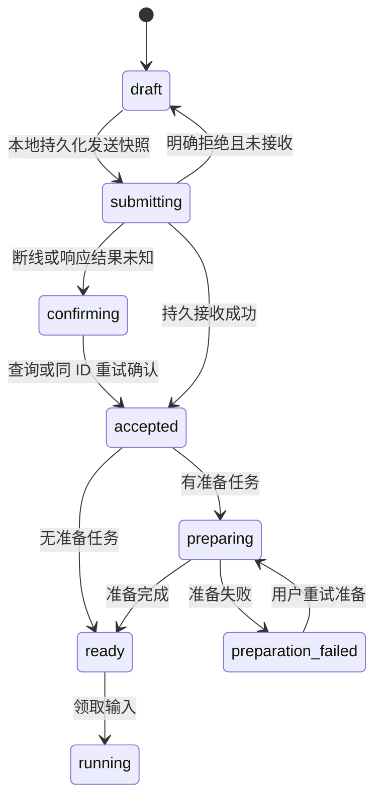

# 本地草稿会话与首次输入创建

状态：主链路已实现，仍有收尾项与设备验收未完成（见末节）。日期：2026-09-27。

本方案定义 Web/Electron、retired cross-platform client（iOS/Android）、HarmonyOS、浏览器扩展和 TUI 的手工新会话流程。直接切换到单一协议，删除旧预创建、空壳复用和协议回退路径。下文是目标设计，具体实现与验收状态以末节为准。

## 1. 决策与边界

点击“新会话”是本地操作：生成最终 `conversationId`，建立草稿，立即显示输入框。首次发送才向 Gateway 提交创建参数和第一条输入。输入持久接收后，服务端准备运行环境，再交给既有输入队列执行。

- 新建交互不等待 HTTP、WebSocket、会话列表、模型列表或项目详情。后台允许读取目录和配置，不允许预创建服务端会话或 worktree。
- UUID 从草稿到服务端会话保持不变；无临时 ID、alias、ID 替换或从 ID 推导 Agent 的逻辑。
- Gateway 仍是正式会话、配置、transcript 和执行状态的权威来源。本地草稿不是伪造的服务端 metadata。
- 普通新建在首次发送前产生零次会话写请求；首次发送只有一次业务提交，不再 create → GET config → submit。
- 首次使用、没有缓存时也立即允许编辑；模型和项目配置尚未确定时只限制发送，不阻塞页面。
- 不引入“先后台创建、以后再延迟创建”的过渡实现，不提供 feature flag 双轨行为，不按服务端能力切回旧接口。
- 本次不是完整离线同步系统：未发送草稿仅在本设备保存，正式会话通过 Gateway 跨端可见。

任务、笔记绑定、fork、导入、渠道路由、automation 等有独立业务创建语义，仍由对应领域服务创建。它们共享创建基础设施，但不经过手工空会话复用，也不因普通新建重构而失去原有业务绑定。

## 2. 当前证据与改造原因

| 位置 | 当前行为 | 目标 |
| --- | --- | --- |
| `web/src/features/chat/session/resolve-new-chat-target.ts` | 等会话列表，再复用或创建空壳 | 本地创建草稿，不读取列表来决定新建 |
| `web/src/features/chat/session/webchat-empty-shell-cache.ts` | 30 秒空壳缓存 | 删除 |
| `web/src/features/chat/session/session-manager.ts` | 创建后只返回 session，未利用响应里的 agentConfig | 由首次输入响应一次安装正式快照 |
| `retired mobile client/src/features/chat/session-prefetch.ts` | 提前 POST 创建，缓存五分钟 | 删除预创建及全部调用 |
| `apps/mobile-harmony/entry/src/main/ets/viewmodel/chatViewModel.ets` | create → open → history → activeRun | 草稿直接显示；接收后安装快照 |
| `src/gateway/hono/routes/sessions.ts` | 创建、环境 attach、配置初始化串行完成后返回 | 接收与环境准备分开，准备过程可恢复 |
| `src/gateway/service/session-input-coordinator.ts` | 输入要求会话已存在 | 增加明确的 start 命令，append 继续要求存在 |
| `src/storage/sqlite/conversation-repository.ts` | 已支持调用方指定 UUID，重复创建报冲突 | 保留严格创建，幂等由接收记录负责 |

以上来自静态代码调查，尚未做端到端延迟测量。现有创建接口接受 `conversationId`，但共享 `SessionCreateRequest` 尚未声明；当前输入去重也不能视为完整内容指纹校验，需在新协议中补齐。

## 3. 身份和客户端模型

共享 contract 定义判别联合，禁止通过 `messageCount === 0`、缺 metadata 或 404 推断“这是本地新会话”。

```ts
type ChatTarget =
  | { kind: 'draft'; draft: ChatDraft }
  | { kind: 'session'; snapshot: SessionSnapshot };

type ChatDraft = {
  conversationId: string; // CSPRNG UUIDv4，最终身份
  scope: { gatewayId: string; principalId: string };
  revision: number;
  selection: DraftSelection;
  composer: ComposerDraft;
  pendingStart?: FrozenStartSubmission;
};
```

`DraftSelection` 记录明确的 Agent、项目（包括明确无项目）、执行模式、临时会话标志以及模型/思考级别。允许编辑期间部分字段未解析；发送快照必须全部解析并满足校验。选择继承沿用 `resolveNewSessionSpec` 和按 Agent 保存模型偏好的产品规则。

存储 key 包含 `gatewayId + principalId + conversationId`，不使用可变 URL 或 token 值作为身份。换网、切换同一 Gateway 的访问路由不换草稿；换 Gateway 或账号隔离数据。未配对设备先完成配对，不生成可发送目标。

Web 使用 IndexedDB 保存草稿、冻结提交和附件 Blob；retired cross-platform client 复用本地存储及持久附件目录；HarmonyOS 使用现有本地存储适配器与持久附件目录。共享的是 schema、状态转换和指纹规范，不跨平台封装 UI 或存储 API。临时会话草稿只留内存，退出后不做后台自动重放，UI 明确其不保留行为。

URL 可直接进入 `/chat/:conversationId`。先查当前作用域的本地草稿，再走正式会话加载。不存在本地草稿的未知 UUID 按现有会话读取，404 显示不存在，绝不据此重建。别的设备在首次发送前无法打开该草稿链接；分享操作只对正式会话开放。

空白草稿离开即回收；有文本、附件或引用的草稿保留。普通新建始终产生新身份，已在同一空白草稿时重复点击可以本地 no-op；不扫描其他草稿或服务端空壳来复用。

## 4. 客户端状态和交互



- `draft`：输入框可编辑，附件可选择，Agent/模型/项目使用已缓存的明确选择；配置列表后台刷新。
- `submitting/confirming`：用户消息立即显示为待发送/确认中；冻结该次发送的完整快照及 ID。用户可以继续编辑下一条草稿，但第一条确认前不再发第二个 start。
- `accepted`：服务端已持久接收，安装返回的 transcript、配置和输入状态；随后移除 outbox 中对应记录。未确认接收前不销毁唯一附件副本。
- `preparing`：聊天页继续可用，显示“正在准备工作环境”；不显示成模型已开始思考。此时保留后续输入草稿，准备完成前不追加第二条输入。
- `preparation_failed`：展示具体原因与“重试准备/删除会话”；不自动切换 Agent、模型或 Local/Worktree。需要更改创建选择时，以新 UUID 建立新草稿。

草稿态不请求 history、run、agent-config、context-summary、input-state 等依赖服务端会话存在的接口；上下文面板显示本地已知选择。正式快照到达后再启用这些订阅与查询，避免首屏空 history 的额外往返。

导航不等于取消：发送之前离开不触发任何服务端操作；请求已发出后离开仍需由 outbox 确认结果，不能声称取消了后台执行。接收后取消使用服务端输入取消操作；准备期间取消需原子阻止 worker 将输入转为 queued。

## 5. 单一输入协议

沿用 `POST /api/sessions/:conversationId/inputs`，使用严格判别联合。下面是设计类型，附件、引用和 origin 类型复用现有 contract。

```ts
type SessionInputCommand =
  | {
      kind: 'start';
      clientMessageId: string;
      creation: {
        agentId: string;
        projectId: string | null;
        execution: null | {
          mode: 'local_checkout' | 'managed_worktree';
          baseRef?: string;
        };
        temporary: boolean;
        model: string;
        thinkingLevel: string;
      };
      input: UserInputContent;
      origin: EndpointTurnClaim;
    }
  | {
      kind: 'append';
      clientMessageId: string;
      expectedTranscriptId: string;
      configVersion: number;
      delivery: 'next' | 'steer';
      input: UserInputContent;
      origin: EndpointTurnClaim;
    };
```

`start` 固定为队列输入，不接受 steer、客户端 transcriptId 或 configVersion。Gateway 产生 transcriptId 并将其绑定到首条输入；模型和思考级别在同一次接收中固定。无项目时 execution 必须为 null；项目工作目录需要环境时必须显式选择模式。客户端缓存用于展示，服务端仍验证 Agent、项目权限、模型可用性及配置有效性。

`append` 不含 creation，必须提供当前 transcriptId/configVersion；不存在的会话报错，reset 后的旧 transcript 报 `SESSION_CHANGED`。有未知字段、缺少 kind 或旧式平铺输入的请求直接拒绝，没有字段别名或默认降级解析。

响应统一为 `{ ok: true, payload: { receipt, session, agentConfig, inputState } }`。receipt 至少包含 `conversationId/clientMessageId/inputId/transcriptId/acceptedAt/lifecycle`；lifecycle 为 `preparing | ready | preparation_failed`。HTTP 202 只表示持久接收，不承诺模型已运行。runId 在输入被领取后产生，不强求首次响应存在。

增加 `GET /api/sessions/:conversationId/input-receipts/:clientMessageId`，用于响应丢失后的确认；结果必须区分未接收、已接收、已删除。现有 input-state 只列部分活跃状态，不能作为完成输入的接收凭据。查询不到凭据仍可用原请求重试，不能换 ID。

状态码约定：400 严格协议校验失败；401/403 身份或权限失败；404 append 目标不存在；409 指纹、身份、配置或创建冲突；410 接收目标已删除；429 限流；5xx 结果可能未知，进入 confirming。错误统一 `{ ok:false,error:{code,message} }`，不同时解析 string/object 两套形态。

## 6. 接收原子性、幂等与删除

引入持久接收记录 `session_input_receipts`，唯一键为 `(conversation_id, client_message_id)`，保存主体、规范化请求的 SHA-256、inputId、transcriptId、接收时间和 tombstone 状态。使用完整规范化内容比对；现有客户端轻量 fingerprint 不能充当服务端权威校验。

指纹包含 kind、创建参数、正文、delivery、模型选择、引用版本和附件内容摘要。端点 token、重试时间、HTTP requestId、临时上传 URL 不参与；重新连接更换 endpoint 时仍须验证同一授权主体。相同 ID 配不同内容返回 `IDEMPOTENCY_CONFLICT`，不能复用当前“已有输入就返回成功”的宽松行为。

处理顺序：

1. 校验请求大小、鉴权、有效 endpoint claim；查询同一主体的 receipt。匹配的重复请求直接返回原接收身份与当前状态，不重新验证已冻结的外部引用、不再次准备附件。
2. 新请求校验创建选择和源资源权限，暂存附件并冻结引用快照。此阶段不执行模型、不创建 worktree；临时文件按 operation 身份关联并可清理。
3. 短 SQLite 事务内重新检查 receipt/会话/tombstone；严格创建 session 与 transcript、保存固定模型配置及项目绑定、写入 receipt、写入首条输入和必要准备任务。所有数据库记录同成同败。
4. 无外部准备时首条输入为 queued；需要环境准备时为 preparing。事务提交后触发既有队列或准备 worker；恢复意图必须已入库，进程内 Promise 不是事实来源。

事务内不 await，不做 Git、文件复制或网络 I/O。原 `createConversation` 重复 UUID 报错语义保持：已有会话且找不到匹配 start receipt 时必须冲突，禁止把它当 append，禁止覆写其 Agent/项目/模型。数据库唯一约束处理并发，进程内 single-flight 仅作减少重复工作的优化。

同一逻辑发送一次生成 clientMessageId。双击共享冻结提交；网络重试和进程重启重放复用原 ID。服务器最多接收一条输入，不承诺模型和外部工具执行的 exactly-once。

删除会话时保留最小 tombstone 和 receipt 身份摘要，不保留消息正文/附件。删除不会级联抹掉去重事实；旧 start 重放返回 410，不重建会话。新协议下 tombstone 不按时间自动过期，避免任意长离线重放复活目标。reset 保留原 receipt；重放返回原 transcript 的接收事实及已重置状态，不向新 transcript 追加输入。

## 7. 项目执行环境准备

环境准备不是 HTTP 请求内的长事务。新增 `session_preparations`，以 conversationId 唯一，保存准备阶段、固定选择、目标 environmentId、固定 base commit、版本、租约和错误码。首条 preparing 输入引用该操作。

- 接收时持久化准备意图；worker 领取操作后把 baseRef 解析为具体 commit 并持久化，再创建 worktree。重启后不能重新解析到另一个 HEAD。
- 在文件操作之前预留 environmentId、目标路径和归属标记；相同准备操作的所有重试使用相同资源身份。
- worktree 已创建而绑定事务未完成时，通过已记录路径、Git 信息和所有权标记 reconcile。不能重新分配目录，也不能删除没有归属证明的目录。
- 环境 ready 后，以一个事务保存绑定、将 session lifecycle 置为 ready、把未取消的首条输入从 preparing 转为 queued，再唤醒既有 coordinator。
- 领取输入同时检查 lifecycle、transcript 和取消状态；仅靠 UI 禁用或消息通知不足以阻止提前执行。
- 明确准备失败保留正式会话和首条输入，状态为 preparation_failed，支持检查和同参数重试；不自动删除已接收消息。
- 新增 `POST /api/sessions/:conversationId/preparation/retry`，携带 operationId、expectedRevision 和 idempotencyKey；同参数重试不重新创建首条输入。删除/取消与 worker 完成使用版本检查，过期 worker 不可恢复已删除目标。
- 释放只针对本操作分配的受管资源；Local checkout 永不删除。清理失败保留 cleanup_pending，恢复 worker 后续继续处理，不吞异常当成功。

现有 `SessionEnvironmentService.attach` 对已绑定环境可复用，但 provision 后绑定前仍有崩溃窗口。实现需要改造 worktree 分配与 store，不能仅在现有 attach 外包一层异步调用。

## 8. 附件、Realtime 与特殊入口

附件保留现有大小和类型限制。本地选择不依赖服务端会话；发送前复制到持久文件或 Blob 存储并计算摘要，不把大体积 base64 写入同步 KV。文件复制失败则该发送未就绪，原草稿仍保留。服务端暂存目录按提交操作隔离，受引用和过期扫描管理；receipt 未确认前客户端不得自动清除附件。

Realtime 连接可在草稿期间后台建立，首次发送前仍需有效 turn claim；不以“无会话”阻止建立 endpoint。继续使用已有 gateway/sessions 全局订阅，接收后按返回状态订阅 run 并执行 snapshot/cursor 恢复。不得假设订阅晚于 HTTP 响应就能看到全部事件，也不得假设有 `session:<id>` topic，扩展事件时遵守既有 broker 注册。

输入初始选择来自缓存和本地偏好；配置后台变化不能静默改写用户已选模型。第一次发送由服务端校验并返回权威 configVersion；后续发送继续走配置锁。模型不可用明确拒绝并保留选择，用户修改后形成新的逻辑提交。

语音通话、服务端文件操作等确实需要先有会话的入口使用显式 `POST /api/sessions/:conversationId/materialize`，提交相同 creation、purpose（voice 或 session_resources）及幂等 commandId；沿用同一接收和准备服务，无首条输入。只有用户触发这些操作才调用，准备 ready 后才能开始通话或文件操作。物化后第一次文字输入使用 append。物化与 start 竞争时仅一个创建命令获胜，另一方返回冲突并安装正式快照，不覆盖配置。

materialize 使用独立持久 command receipt，遵循相同指纹、鉴权和 tombstone 规则；它是明确业务操作，不是旧 POST /api/sessions 的 fallback。fork、任务和笔记绑定仍走自己的领域 API，不能用普通 creation 绕过来源绑定或上下文构建。

## 9. 各端和模块分工

| 模块 | 实施责任 |
| --- | --- |
| gateway-contract | start/append/materialize 严格 schema、快照/receipt、错误码、草稿类型及规范化规则 |
| SQLite repositories | receipt/tombstone/preparation、短事务创建接收、唯一约束和领取门禁 |
| Gateway 接收服务 | 统一鉴权与选择校验、上下文冻结、原子提交、返回权威快照 |
| execution-environments | 固定资源身份、租约/版本、崩溃 reconcile、受管资源补偿 |
| input coordinator | preparing 状态、ready 领取门禁、相同消息指纹冲突处理 |
| Web/Electron | DraftStore、草稿路由/页面状态、持久 outbox、禁用草稿态服务端查询 |
| retired cross-platform client | 替换 prefetch/takeNewChatConversationId，query 层提交、MMKV/附件持久化、所有新建入口接入 |
| HarmonyOS | repository/VM 区分 draft/session，创建不调用 open/recover，补持久冻结提交与恢复 |
| 浏览器扩展/Web 扩展入口 | 页面引用在发送时冻结；新建本地化，删除先创建后补配置 |
| TUI 本地/远程 | /new 本地草稿；首次输入调用统一应用服务，远程使用同一协议，本地无 HTTP 但相同接收语义 |

新增路由必须同时修改 lazy-bundles 的精确 matcher、顺序和邻近负例；已有 eager agent-stream 路由也需检查无重叠。同步更新 Gateway scope matcher、OpenAPI/公开 API 清单、客户端数据发送同意规则和协议测试。发送的 scope 与 endpoint 验证不因 start 而放宽。

### 移动端交付边界：Android、iOS、HarmonyOS

HarmonyOS 是本次必交付客户端，与 retired cross-platform client 的 Android/iOS 同步完成并验收，不能把“移动端完成”等同于 retired cross-platform client 完成。三端共用协议和产品状态，原生存储、组件生命周期和附件访问分别实现。

| 能力 | retired cross-platform client：Android/iOS | HarmonyOS |
| --- | --- | --- |
| 新建入口 | Chat、Sessions、Agent、Project 页面统一 draft factory | `ChatView.newConversation`、`sessionsViewModel.newConversation` 及首页/Agent/项目入口统一 draft factory |
| 草稿进入 | 路由直接使用 UUID，query 根据 target.kind 启用 | `XopcChatViewModel` 增加独立 draft 进入操作；不调用正式会话 `open/recover` |
| 配置编辑 | 本地 selection 更新，首次发送冻结 | `chatOptions/context/prompt` 等 VM 根据 draft/session 分流；草稿不请求 session agent-config/context/clarification |
| 持久发送 | 扩展现有 message-outbox，保存完整 start/append 快照 | 新增持久 outbox，替代仅靠 `pendingId/pendingContent` 的进程内重试身份 |
| 附件 | 持久文件目录与引用 | 将系统选择器/分享提供的临时 URI 内容复制到应用持久目录，校验可读性和摘要 |
| 分享导入 | 先写目标草稿，再让用户确认发送 | ShareExtensionAbility/shareIntake 绑定目标 Gateway 和 draft UUID；页面重建不重复导入、不预创建服务端会话 |
| 生命周期 | 前台恢复后重建 endpoint，再确认 outbox | Ability/页面销毁不删除持久提交；新 VM 根据 scope 恢复草稿，建立有效 turn claim 后再确认 |

三端不依赖后台常驻或无限后台重试。进程被系统回收后，重新打开应用时恢复本地内容并确认原 clientMessageId；UI 的“已发送”必须有服务端接收证据。非临时草稿本地持久化失败时，显示无法保存/发送，不把仅在内存的消息当成已可靠排队。

手机第一次连接 Gateway 后，新建页面不等待 Realtime 就可输入；发送若需要重新连接，保留内容并显示等待连接。已有网络安全路由和数据发送同意检查继续生效；断网时不触发旧创建接口或其他路由的并发写入。

鸿蒙必须单独验证：冷启动无主会话、聊天内新建、会话列表新建、Agent/项目切换、分享唤起、图片/文件/录音附件、页面退出再进入、Ability 回收重启、Gateway 切换，以及响应丢失后的同 ID 恢复。Android/iOS 同样执行对应设备生命周期测试，不能仅用共享 TypeScript 单元测试替代原生端验证。

## 10. 删除与升级清单

以下删除在实现时与新入口切换同一变更完成，不保留弃用壳或兜底路径：

1. Web `resolve-new-chat-target.ts`、`reusable-empty-shell.ts`、`webchat-empty-shell-cache.ts` 的旧实现及专属测试；`new-chat-handoff.ts` 改为本地草稿导航，删除按 agent/project 合并远程创建 Promise 的逻辑。
2. retired cross-platform client `session-prefetch.ts` 及其服务端预热调用、TTL、pendingCreates；所有 sessions/project/agent/chat 新建按钮改用本地 draft factory。
3. Web/HarmonyOS/retired cross-platform client 的 create → config PATCH/GET → history/run → send 流程；删除从 /new 推导 creating-session 的页面状态。保留真正打开已有会话的历史加载能力。
4. 删除通用 `POST /api/sessions` 手工空会话接口及对应公开 contract/client helpers；所有调用逐个归入 start、显式 materialize 或领域创建服务。不得留下旧 TUI/扩展调用作为例外。
5. 删除输入旧 request shape 的解析和 fallback，统一 start/append。`ensureSessionExists` 如仅为发送前额外探测则从该路径删除；`/resolve` 若仍承担有效的只读定位语义则保留该语义，不做隐式创建。
6. 删除 `genericNewChatShell` 空壳复用资格及专属 TUI 空壳清理逻辑；迁移中移除废弃字段。`hiddenFromSessionList` 仍有后台/任务业务用途，不作为兼容字段误删。
7. 删除旧客户端缓存读取、双命名空间写入、旧错误 envelope 解析和自动重发至旧接口。此次仅清理本方案相关兼容行为，不扩大为全仓无关兼容代码删除。
8. 更新 `new-session-preferences.md`、会话 UUID 约定、Realtime/API 文档和各端测试，以本方案为最终创建约定。删除其中普通空壳复用及先创建再发送的规范。

服务端 schema 用现有 migration runner 一次性升级：已有正式会话置为 ready，不改 UUID/transcript；历史有效消息保留。旧空壳先记录 inventory，仅无 transcript 内容、无待处理输入、无业务/环境绑定的纯空壳可在迁移中清理；有绑定或不确定的保留为普通正式会话，移除复用标记，不承担兼容路径。

客户端已存在的未发送内容不能直接清空：升级前检查旧 outbox，有未确认输入先由匹配旧版本确认或导出供用户检查。升级时一次性转存可识别草稿正文/附件，不迁移可自动重放的旧请求；新运行时只读取新格式。无法确定发送结果的记录不自动换 ID 重发。一次性数据迁移位于独立 migration 模块，不进入日常请求分支。

全部随仓库交付的客户端同步升级。旧 wire shape 明确报错；允许提示“请更新客户端”，不提供协商后降级。实施可按模块拆提交，但发布时只有新流程，不能宣称支持新旧客户端混用。

## 11. 验收和实施顺序

按依赖实现：contract/数据库 → 接收和准备服务 → 客户端草稿及 outbox → 特殊入口 → 删除旧路径 → 文档与全链路验证。测试使用隔离 Gateway 和数据库，不操作真实用户会话。

| 场景 | 验收结果 |
| --- | --- |
| 本地/远程/断网点击新建 | 立即可编辑；0 会话写请求；不等待会话列表 |
| 无模型/项目缓存 | 页面可编辑；配置待确认时只限制发送 |
| 连点新建、双击发送、多标签同草稿 | 明确草稿身份；同一次发送最多一条输入；不同内容冲突可见 |
| 普通首条消息 | 一次输入 POST；session/config/transcript/input/receipt 同成同败 |
| 接收前/提交后断线、Gateway 重启 | 原 ID 查询/重放，返回原接收身份，不重复输入 |
| 同 ID 不同文字、模型、附件、引用 | 409；不静默复用或覆盖 |
| worktree 文件创建后、绑定前崩溃 | 原环境 reconcile，无第二个目录，无提前执行 |
| 准备失败、取消、删除与 worker 并发 | 不切换执行模式，不运行取消输入，不恢复已删除会话 |
| reset/删除后旧 start 或 append 重放 | 原 receipt/SESSION_CHANGED/410；不写新 transcript，不复活 |
| Gateway/主体切换与临时会话退出 | 草稿与 outbox 不串作用域，临时草稿不自动持久重放 |
| Agent/模型不可用、项目权限变更 | 明确错误，保留输入；不采用未经确认的默认配置 |
| 附件本地丢失/上传失败/引用变化 | 显式待处理，不丢附件、不自动去掉引用再发送 |
| 语音、项目文件、任务、笔记、fork、TUI | 正确物化或领域创建，首条消息没有双创建 |
| HTTP 实际鉴权访问新路由 | scope 与 lazy matcher 正确；邻近路由不被遮挡 |
| 旧请求和旧服务端组合 | 清晰不支持错误，无旧接口 fallback |

性能指标分别记录 click→composerEditable、send→durableAccepted、accepted→environmentReady、ready→firstToken，避免把模型或 Git 耗时混入新建页面指标。目标在已启动客户端 click→composerEditable p95 < 100ms；分别以本地、150/500ms 模拟 RTT、断线和冷缓存验收。首次发送的目标是消除创建/配置/历史查询串行 RTT，不承诺零网络等待或固定模型首 token 时间。

日志使用稳定前缀和结构化字段，记录 conversationId、clientMessageId、operationId、phase、durationMs、结果码；不写正文、附件内容和 turn token。完成标准包括 contract/事务/恢复测试、各端相关测试与类型检查，以及真实 Gateway 的鉴权 HTTP 和首条输入端到端验证。

## 本次实现与尚未完成的工作

已实现：

- Web、retired cross-platform client、HarmonyOS、浏览器扩展与远程 TUI 的本地 UUID 草稿；删除通用创建接口、Web 空壳复用、retired cross-platform client 预创建、TUI 空壳清理和公开旧创建 contract。
- 严格 start/append/materialize 协议；SQLite 223 迁移、主体绑定的内容指纹回执、原子接收、删除 tombstone、reset 后原回执重放。
- 输入保持 queued，执行领取由 preparation 状态门控，等价于独立 preparing 输入状态。环境准备使用持久任务、租约、预留环境 ID、固定 base commit、CAS 完成、失败重试和删除后清理任务。
- Web IndexedDB、retired cross-platform client MMKV、鸿蒙加密 RDB、远程 TUI 本地文件保存待确认命令；临时 Web/retired cross-platform client 新草稿和对应 outbox 在内存中保存。retired cross-platform client 普通提交前复制临时附件到持久目录。
- 语音与会话文件资源显式 materialize；准备失败状态及重试入口；新建 Web 输入框与发送就绪状态分离。
- 身份哈希排除 origin 凭据；当前附件 URI 仍参与指纹，客户端必须重用已上传引用，不能换临时签名 URL 后冒充同一提交。
- 浏览器扩展首次发送/恢复固定 Gateway、设备、公钥身份及 outbox 键；切换主体后保留原待确认命令，拒绝旧回执与跨主体 401 重发。凭证刷新返回时校验当前主体，避免已切换的配置被旧刷新结果覆盖。新草稿只采用 main Agent 的配置默认模型，不再取模型列表第一项。
- Embedded TUI 新建仅写私有本地草稿，不初始化 Agent 或创建 SQLite 会话；首次发送先持久化冻结命令，再通过统一事务接收并按指定输入领取，完成后更新持久输入状态。工作流启动显式物化；草稿中的模型、工作目录和项目配置支持本地编辑。
- TUI 编辑器按会话保存文字与粘贴图片，切换和退出时刷新；远程模式按 Gateway/主体隔离目录，文件权限为 0600。清空编辑器删除对应记录及其内嵌附件。
- Web IndexedDB 保存未发送正文、附件和上下文引用；临时新会话只写内存。恢复结果不会覆盖恢复期间新输入或主动清空的内容，切换前的编辑无需等待初次读取完成。
- retired cross-platform client 普通编辑器保存所有附件类型，不再只保存工作区引用；系统临时文件复制到应用私有 chat-drafts，提交另存 chat-outbox。回收扫描所有持久记录的引用，仅删除这两个目录下超过 24 小时、无引用、目录结构符合预期的 payload 副本，不删除源文件或 Gateway 文件。临时新草稿不复制、不落盘。
- 鸿蒙未发送草稿移入加密 RDB 的 composers 表，保存附件内嵌数据或稳定资源引用；写入串行化并等待 RDB 写入完成，清空删除整条记录。retired cross-platform client、鸿蒙和浏览器扩展的编辑器作用域统一包含 Gateway、设备身份和会话。

仍需收尾，不能视为整套设计已验收：

- Embedded TUI 已接入首次输入原子接收及孤儿领取恢复：持久化执行进程标记，进程退出后把原输入原子标记为 interrupted，不自动重放；用户可显式重试原输入或取消。正式会话后续输入、steer 和执行仍使用原本地执行器，不能宣称完整持久队列已贯通。
- 未发送编辑器正文/附件已接入保存和清空回收；尚未实现空白会话元数据的 TTL 清理，以及无人再打开客户端时的后台文件回收。旧草稿格式不提供运行时 fallback，发布前仍需独立的数据导出/一次性转存检查，不能直接清除旧内容。
- retired cross-platform client 草稿存储失败已有可见提示，附件仅保存私有文件引用和元数据，不随按键序列化 Base64；Web 配额失败提示及各端大附件、系统强杀和跨身份操作仍需进一步验收。
- Web 项目新建仍需读取项目详情后确定默认 Agent/执行选项；输入框已允许先编辑，但尚未完全做到项目草稿身份立即落盘。
- 浏览器扩展在 Gateway/配对主体切换期间的所有异步回调隔离，以及各端冷启动/杀进程/弱网交互，需要进一步端到端验证。
- 未执行 p95 延迟测量；未执行真实模型首条输入测试，HTTP 集成测试使用真实监听、鉴权和 SQLite，但模拟模型执行器。

前轮验证：根项目相关回归 351 文件 / 2109 测试通过；retired cross-platform client 91 文件 / 532 测试通过；鸿蒙逻辑回归 72 文件 / 438 测试通过。Node、Web、retired cross-platform client 和浏览器扩展类型检查通过。

本轮验证：TUI、Web 聊天、浏览器扩展与 SQLite 创建相关回归 220 文件 / 1343 测试通过；retired cross-platform client 92 文件 / 536 测试通过，回收触发点补充后专项 12 测试通过；鸿蒙逻辑回归 74 文件 / 444 测试通过。Node、Web、retired cross-platform client、扩展类型检查通过。鸿蒙原生整包构建成功，仍有 SDK/异常处理警告；构建配置没有 signingConfig，Pura90Pro 模拟器部署调用超时，未改为安装到已连接的真实手机，因此设备安装与弱网验收未完成。并行的鸿蒙图片/语音界面改动保留，未计为本任务实现。

### Web 发送阻断修复（2026-09-27）

用户反馈新会话无法发送，并提供 `/api/chat/skills` 的 `Conversation not found` 500 日志。确认是两个客户端衔接遗漏：

- 发送就绪仍强制要求服务端 `configVersion`，但本地草稿在首次发送前没有服务端版本。现以显式 `localDraft` 标记区分：草稿只要求已选模型可用，正式会话仍要求配置版本；接收响应切换为正式会话状态，晚到的草稿配置不能覆盖正式版本。不伪造版本号，不恢复预创建接口。
- 技能查询把草稿 UUID 当成正式会话。现根据本地草稿元数据查询所选 Agent 的技能；接收后改为会话作用域，缓存键也相应切换。没有捕获 404/500 后自动降级的兼容分支。

补充使用真实 `draftAgentConfig`、视图状态映射与发送就绪函数的联动测试，覆盖草稿可发送、未知模型阻止发送、正式会话等待配置以及晚到草稿不可覆盖。另覆盖草稿/正式会话技能请求切换。实际在 `http://localhost:3000/` 新建测试会话 `361c09d1-f5d6-4a0e-b3cf-61ec397f5b79`：首条收到真实模型回复 `OK`，刷新后第二条收到 `SECOND_OK`，页面错误日志为空。测试会话保留，未修改已有会话或清空用户草稿。
