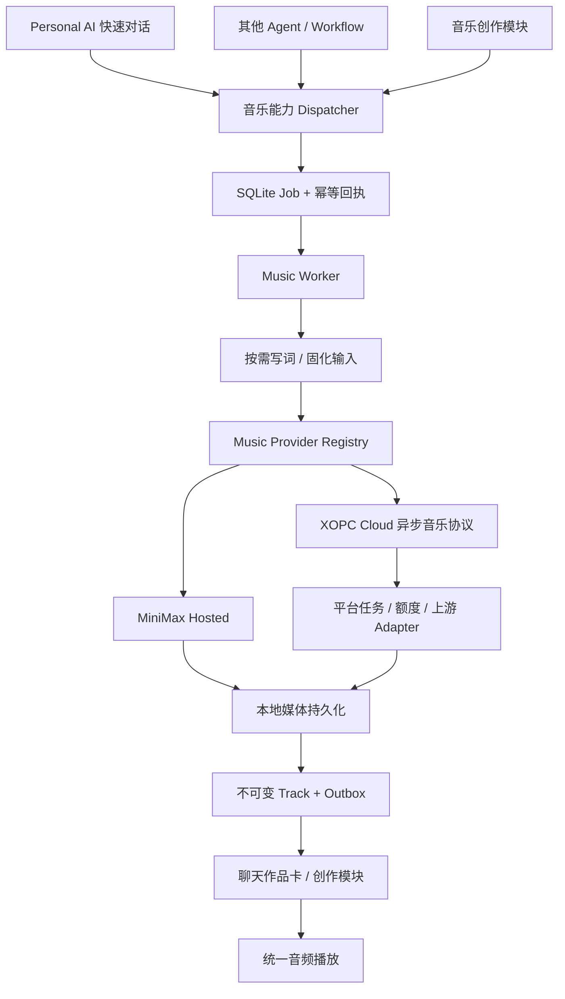
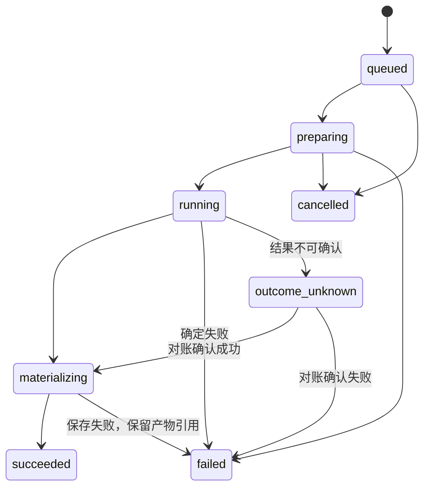

# 音乐创作能力技术方案

日期：2026-10-09。状态：设计提案，尚未实施。适用仓库：xopc、xopc-platform。

产品依据：[音乐产品与交互设计](../personal-ai-music.md)，以其第 12 节为准。本文确定技术边界、契约与实施顺序；早期产品文档中的技术草案若与本文不同，以本文为准。

## 1. 核心决策

1. 音乐是独立领域能力，运行时位于 `src/music/`。音乐创作模块、Personal AI、其他 Agent 调用同一服务，使用同一任务与作品记录。
2. 所有 Agent 都可配置音乐能力，实际调用受继承模型配置、工具策略和用户授权限制。Personal AI 增加有界的音乐提交与读取工具，保持其严格白名单。
3. 默认一句话直接创作。工具快速返回持久化任务 ID；写词、上游生成、音频保存由后台执行，完成后交付作品卡。用户要求先看歌词时才进入草稿流程。
4. 音乐 Job 与业务 Task 分开。普通创作不自动创建任务看板记录；已有业务 Task 调用音乐时，可以关联 taskId。
5. Provider 使用独立注册表；音乐路由与聊天、TTS、图片路由分开。首批 MiniMax Hosted，XOPC Cloud 是异步音乐协议的另一个适配器。
6. 音频落入现有媒体存储，版本不可变。播放使用统一音频协调与鉴权，临时上游 URL 不进入持久作品。
7. 后台状态、提交幂等、完成交付都持久化。付费请求结果不确定时进入对账状态，不能直接换 Provider 再生成。
8. 第一版不建设 DAW、音轨编辑、局部重唱、音色克隆或精确歌词时间轴；自然语言修改产生新版本。

## 2. 现有实现与复用边界

本次按工作区现有源码核对；图片 Provider 正在迁移到共享包，实施前需与其最终接口对齐。以下是确认的落点，新增能力均是提案。

| 现有能力 | 复用方式／需要补齐 |
| --- | --- |
| `src/agent-config/schema.ts`、`resolver.ts` | 增加独立 musicGeneration 路由，遵循 defaults → Agent override 两层继承与 null 禁用语义 |
| AgentCatalog 全局 defaults 管理 | UI 保存走现有 Catalog 管理链路，不能只修改 xopc.json 文件 |
| `src/capabilities/runtime/dispatcher.ts` | 音乐提交、读取、取消通过统一能力鉴权与输入验证 |
| `atomic-operations.ts` | 在同一 SQLite 事务内写提交回执和 Job；不在事务内调用网络 |
| `src/personal-agent/policy.ts` | 明确增加音乐工具白名单，不能假设注册工具后 Personal AI 自动可用 |
| `src/personal-agent/request-*`、`reply-composer.ts` | 当前耦合连接器、邮件结果和业务 Task，不作为通用音乐任务存储／交付器 |
| `src/media/store.ts`、`gateway/media-access.ts` | 保存音频；增加独立作品归属校验，补齐无 conversationId 的模块播放 |
| `packages/gateway-contract/src/turn-outcome.ts` | 保持 audio deliverable；增加可选音乐引用与版本元数据 |
| `src/realtime/`、`packages/realtime-protocol/` | 增加音乐主题、事件验证、订阅鉴权、重连恢复 |
| `src/infra/domain-outbox-dispatcher.ts` | 当前未知 subject 被映射为 tasks；增加 music 来源与相应事件 schema 后才可复用 |
| `src/gateway/xopc-cloud-capability-setup.ts` | 音乐作为可选推荐能力，不加入现有 onboarding 必选集合 |
| 平台 `model-services.ts`、`model-capabilities.ts`、`app.ts` | 新增 music 服务类型、目录与异步调用分支 |
| 平台 `model-billing.ts`、额度 Repository | 为音乐明确预留、结算、超时对账；不能直接套用 STT/TTS 分支 |

## 3. 分层与调用链



领域服务不依赖 Personal AI。聊天组件和独立模块只展示同一份 Job/Track；不各自维护一套生成状态。Cloud 与本地各有自己的任务 ID，明确映射，不跨库共用事务。

建议新增布局：

```text
packages/music-providers/src/       # 协议、能力、参数校验、MiniMax Adapter
packages/gateway-contract/src/music.ts
src/music/
  service.ts                       # 提交、读取、草稿、取消
  repository.ts                    # 本地音乐领域存储
  worker.ts                        # lease、调度、恢复
  lyric-composer.ts                 # 有界写词
  provider-registry.ts              # 凭据与模型路由
  providers/xopc-cloud.ts           # 平台异步协议
  materializer.ts                   # 音频验证与媒体保存
  delivery.ts                      # transcript / channel 交付
src/agent/tools/music-generate-tool.ts
src/agent/tools/music-read-tool.ts
src/gateway/hono/routes/music.ts
web/src/features/music/            # 创作、作品、播放器适配
```

共享包拟为 `@xopcai/music-providers`，参照当前 image-providers 工作区与平台 vendor 同步方式。共享纯 TypeScript 类型、Provider 能力、规范化和上游协议代码；不共享 SQLite、Agent、认证、计费和任务调度实现。避免跨仓库 Zod 版本依赖。平台同步必须有版本／内容摘要检查，不能人工复制后无记录漂移。

## 4. 配置、目录和 Provider 契约

### 4.1 Agent 音乐路由

在 Agent models 中新增可选字段，沿用现有路由格式：

```json
{
  "musicGeneration": {
    "primary": "xopc-cloud/music-standard",
    "fallbacks": [],
    "timeoutMs": 300000,
    "autoProviderFallback": false
  }
}
```

`music-standard` 是拟定平台公开服务 ID，尚未发布。示例 timeout 是客户端操作预算的初始配置，不是上游 SLA；最终值来自实测。Cloud 已接受的任务不会因为一次查询超时而被本地判定失败。

路由继承：未设置继承 defaults；Agent 显式配置覆盖；null 禁用。更新全局默认不能覆盖已有 Agent 显式选择。工具策略分别控制音乐生成与读取，支持 allow/ask/deny。

目录增加 kind=music、output=audio、operation=music.generate、musicGeneration 能力与 `recommended.music-generation`。同步更新目录解析、持久化、克隆、刷新及平台发布校验，不能只扩 TypeScript union。

### 4.2 能力声明

模型能力至少描述：歌曲／纯音乐、自动／自定义歌词、语言、prompt/lyrics 上限、可选时长与格式、参考音频／续写／局部编辑是否支持。未声明的能力默认为不支持。UI 按有效模型能力显示控件；后端再次校验，不悄悄忽略用户参数。

平台一个公开服务有多个 target 时，公开能力为可路由 target 的交集；需要不同能力就拆公开服务或显式按能力选 target，不能取并集后随机落到不支持的上游。

### 4.3 Provider 抽象

```typescript
interface MusicProvider {
  id: string;
  describe(modelId: string): MusicModelCapabilities;
  generate(input: PreparedMusicInput, context: MusicCallContext): Promise<MusicProviderResult>;
  lookup?(handle: ProviderJobHandle, context: MusicCallContext): Promise<MusicProviderResult>;
  cancel?(handle: ProviderJobHandle, context: MusicCallContext): Promise<CancelResult>;
}
```

统一结果是完成产物引用或已接受的异步 handle；失败必须区分 confirmed-not-applied、confirmed-failed、outcome-unknown。不能用普通网络异常统一触发自动重试。Provider 描述是否支持幂等、查询和取消，只有声明且实测有效时才依赖这些能力。

PreparedMusicInput 固化 modelRef、prompt、最终歌词、歌曲／纯音乐、参数、协议版本与输入摘要。HTTP 凭据由执行上下文解析，不能存入 Job 快照、回执或日志。音频通过二进制／受限文件引用传递，不能把 hex/base64 放入通用 capability JSON 回执。

MiniMax Hosted 与自托管使用不同 adapter ID。Hosted 需检查 base_resp 和有效音频；自托管是独立的 `/v1/audio/speech` 协议。接入依据与调用资格见产品文档第 3 节及[官方 Hosted 文档](https://platform.minimax.io/docs/api-reference/music-generation)、[自托管文档](https://platform.minimax.io/docs/guides/local-deploy-music-3)。实际发布前验证账号资格，不把文档中的型号列表当作可调用证明。

## 5. 领域对象与持久化

| 对象 | 含义 |
| --- | --- |
| Draft | 可编辑描述与歌词，带 revision；修改不等于生成 |
| Work | 一组创作版本的聚合，关联 owner、Agent、可选项目 |
| Job | 一次生成执行；即使失败也保留记录 |
| Attempt | 一次上游尝试，记录是否可能产生付费副作用 |
| Track | 一份不可变的成品音频及其生成输入 |

再做一个版本：在同一 workId 下创建新 Job；成功后创建新 trackId，并记录 parentTrackId。支持从任意版本分支；versionNumber 在保存 Track 的事务内分配，旧音频与输入不覆盖。失败的 Job 不占成品版本号。

建议新增表，迁移编号实施时按最新 schema 分配：

| 表 | 关键字段／约束 |
| --- | --- |
| music_drafts | id、owner、agentId、workId?、inputJson、revision；乐观并发更新 |
| music_works | id、owner、agentId、projectId?、title、createdAt |
| music_jobs | id、owner、workId、source、originConversationId/transcriptId/inputId、关联 taskId?、requestedInput、preparedInput、resolvedRoute、status、revision、cancelRequestedAt、leaseOwner/expiry/generation |
| music_attempts | jobId、attemptNo、provider/model、inputHash、upstreamHandle、cloudJobId?、outcome、错误分类、时间；不存凭据 |
| music_tracks | id、workId、jobId、parentTrackId?、versionNumber、mediaUri、mime、size、duration、最终歌词、输入摘要；jobId 唯一、workId+versionNumber 唯一 |
| music_deliveries | jobId、destination、originTranscriptId、status、attempts；按交付目的地唯一，防重复作品卡 |

状态变化与 domain_outbox 在同一事务写入；音乐不另建第二套实时状态库。媒体写入采用 staging → 验证 → 注册 Track；重启扫描可复用完成的 staging，定期清理未引用文件。数据库只保存稳定引用，不保存音频大字段。

归属从可信 CapabilityContext 得到，Agent 身份从解析后的上下文得到。前端传 ownerId/agentId 不能绕过授权；跨 Agent 共享作品按已有用户／项目可见性策略判断，而非仅凭知道 trackId。

## 6. 异步执行、幂等与恢复

### 6.1 状态机



取消是请求意图。running 阶段设置 cancelRequestedAt，Provider 确认停止后才标 cancelled；不支持取消则显示“已请求停止，生成可能仍完成”。已经生成的作品保留，不能因为本地 AbortSignal 就声明上游无扣费。失败包含 recoverability：saving_failed 只允许重新保存／下载；generation_failed 才允许用户发起新生成。

### 6.2 提交

1. 校验输入、模型可用性、有效工具策略、额度提示与授权。
2. 复用 atomic capability 回执：同一 principal + capability + idempotencyKey 及相同输入返回原 Job；相同键不同输入返回冲突。
3. 同一 SQLite 事务写 Job、回执、queued 事件；afterCommit 唤醒 Worker。
4. 返回 jobId/status。通用 capability envelope 的 succeeded 仅代表提交操作成功，不表示音乐已生成。

UI 一次点击生成 UUID 幂等键，网络重试沿用；“再做一个版本”生成新键。Agent 同一次 toolCall 的重传使用稳定键，用户新的生成意图必须新键。业务幂等覆盖提交，不等于上游支持幂等。

### 6.3 Worker

第一版使用 SQLite Job 队列，无需引入 Redis。Gateway 启动 Worker；通过事务 CAS claim、租约心跳、递增 generation fencing 防止多执行器同时保存结果。网络调用在事务外。回写必须匹配 lease generation；租约过期且上游效果未知时，接管者先查询／对账，不能直接重新调用。

queued/preparing 可以在重启后恢复；preparedInput 持久化后不重复写词。running 若没有可靠查询或上游幂等能力，恢复到 outcome_unknown。本地超时、连接断开、502 不能作为确定未执行的证据。

Cloud Adapter 保存远端 jobId；轮询超时继续查询原任务。本地下载失败保留远端 artifact handle，重新下载，不创建新云端任务。临时下载授权过期时重新授权，而非重新生成。

CLI 优先通过 Gateway 提交；无 Gateway 的嵌入执行模式必须运行到终态或显式托管给持久执行器。不能输出“后台生成”后进程退出且无人处理队列。Workflow 等待通过 Job 事件／查询实现，不占住普通 Agent 对话 run。

### 6.4 写词

快速创作提交描述与 `lyricsMode=auto`，Worker 使用该 Agent 解析后的 fast intent（未配置则 chat）做一次有界、结构化写词调用。设置独立超时、长度验证和有限修复次数，产出最终歌词后固化输入。

`lyricsMode=custom` 原样保留用户歌词，默认关闭上游歌词优化；纯音乐跳过写词。用户请求“先写词”创建草稿写词 Job，返回 Draft，不调用付费音乐 Provider。草稿生成音乐时提交 draftId+revision，服务读取相应快照，版本冲突不能悄悄使用新内容。

## 7. Agent 调用与聊天交付

### 7.1 工具

`music_generate` 输入为描述、歌曲／纯音乐、歌词模式、自定义歌词或草稿引用、可选 parentTrackId。模型与归属默认来自可信上下文。返回 jobId、workId、status、可读摘要，不等待音频完成。

`music_read` 读取授权范围内的任务状态、作品、版本和歌词，避免把全部音频内容或所有历史作品塞进上下文。创作、读取、修改能力均注册到 Dispatcher；工具是薄适配层。

Personal AI 白名单只开放这两个有界工具，其他 Agent 使用同样工具并继承／覆盖策略。用户要求“节奏慢一点”时，AI 读取当前 track 的固化输入并提交 parentTrackId 关联的新版本；第一版是整体重新创作，不声称精确保留旋律。

ask 策略下先完成批准，再入队；独立 UI 的明确生成操作走现有用户操作授权路径。后台继承批准范围并在开始外部请求前复核是否撤销／禁用，不能通过后台绕过前台拒绝。费用可用时展示预估，无可验证价格时不编造数额。

### 7.2 完成交付

Track 创建事务写 completion outbox。独立 delivery 消费者构造短文案和 audio deliverable；一般无需再调用一次 LLM。聊天音乐引用包含 jobId/workId/trackId/versionNumber，歌词按需读取；旧客户端仍可按普通音频展示。

沿用 SQLite transcript append 与 `emitSessionTranscriptUpdate` 通知链路，不能补 turn-end SessionStore.save。记录提交时 conversationId 和 transcriptId：若用户已 reset、删除对话或归属变化，跳过向新 transcript 注入旧结果，作品继续留在创作模块。交付失败只重试交付，不重做音乐。

向 Telegram 等渠道交付仅限原始请求的授权目的地，使用既有媒体发送机制；不自动转发给其他联系人。业务 Task 发起时可附加音频 deliverable 到其结果，普通音乐 Job 不依赖 personal_requests/mail schema。

## 8. Gateway API、事件与播放

以下为拟新增接口，由 REST 适配层调用同一 Dispatcher，不建立第二套业务规则。

| 接口 | 行为 |
| --- | --- |
| POST /api/music/jobs | 幂等提交；202 返回 jobId/workId/status |
| GET /api/music/jobs/:id | 状态快照、revision、可恢复动作 |
| POST /api/music/jobs/:id/cancel | 记录取消意图，返回真实当前状态 |
| POST /api/music/jobs/:id/recover | 仅执行被状态允许的对账／保存恢复，幂等 |
| POST /api/music/drafts/compose | 异步写词草稿；与音乐生成费用区分 |
| GET/PATCH /api/music/drafts/:id | 草稿读取／按 revision 修改 |
| GET /api/music/works | 按权限过滤、游标分页的作品与版本摘要 |
| GET /api/music/tracks/:id | 成品元数据、歌词及版本来源 |
| GET /api/music/tracks/:id/audio | 归属验证后读取同一 mediaUri，支持下载 |
| GET /api/music/readiness | 有效模型、权限与可用动作，面向当前 Agent |

具体输入／输出在 gateway-contract 中定义版本化 schema，前后端共用。变更所有上述 authenticated routes 时同时更新 lazy-bundles matcher、正向与邻近负向映射测试，并通过运行中的鉴权 Gateway 访问实测。

实时主题拟为 `music:job:<id>` 和受权的音乐列表主题，事件至少 music.job.updated、music.track.created，携带 id/revision/status 等轻量字段。需修改主题 schema、订阅授权和 broker replay policy。先建立订阅再读取快照，客户端按 revision 去重；收到 gap 或重连后重新 GET。数据库是事实来源，事件丢失不影响任务最终结果。

不复用 personal_capability 的连接器 readiness 格式，新增 MusicReadiness：ready / missing_model / missing_credentials / permission_required / unavailable，加可执行设置入口。

独立模块的音频读取必须验证 track 所属与实际 mediaUri，再复用媒体响应逻辑；不能允许传任意 URI 绕过 media-access。聊天路径需把已交付音乐引用纳入媒体引用检查。默认鉴权 fetch 成 Blob 后交给播放器，退出／切换时 revokeObjectURL；首版设置合理文件大小上限。若采用 Range 播放，需用受控短期媒体票据且绑定具体 Track，不把长期 Bearer token 放 URL。

播放器默认用户点击播放，跨页面共享状态；与现有语音播放／录音协调事件统一，播放音乐前停止冲突音频，录音时暂停音乐。仅一个活动播放实例。状态与进度来自真实 audio 事件，不使用模拟进度；没有时间戳数据不显示同步歌词。试听、暂停、拖动、下载均不触发生成或计费。

## 9. XOPC Cloud 契约与计费

### 9.1 平台边界

平台负责上游凭据、服务验证与发布、额度、云端 Job、音频持久化和授权下载。xopc 负责 Agent 意图／写词、用户作品版本、本地交付与播放。云端生成成功与本地下载成功是两个状态，不能混为一谈。

新增 music 服务类型和专用 Repository/Worker，管理端配置 target、支持能力、模型、凭据版本、超时、并发、计价、启停。发布指纹涵盖能力与凭据版本；凭据更新后需重新验证。已有 image/stt/tts 分支的类型判断、表映射、诊断路由、费用统计全部显式补 music。

### 9.2 公共协议

| 接口 | 要点 |
| --- | --- |
| POST /v1/music/generations | model、prepared input、clientRequestId；Idempotency-Key；202 返回 jobId/status/reservation 摘要 |
| GET /v1/music/generations/:id | 状态、revision、错误分类、成功 artifact 引用 |
| POST /v1/music/generations/:id/cancel | 取消意图／是否已停止／可能发生的费用 |
| GET /v1/music/generations/:id/audio | 成功产物的授权下载；临时签名可重新签发 |

这是 XOPC 自定义异步协议，需显式协议版本，不宣称 OpenAI 音乐兼容。幂等范围为租户+用户+operation+key；同键异参冲突。POST 丢响应时可按 clientRequestId 查询／恢复原任务，因此本地不用盲目重新生成。所有查询、取消、下载校验归属，错误保持稳定 code 与可恢复动作。

### 9.3 费用状态

首版一次请求最多生成一首成品，按已发布服务的单次额度单位预留，最终价格由管理员实测后配置。额度事务必须和云端 Job 提交一致；upstream attempt 与 ledger requestId 关联，完成结算只能发生一次。

| 情况 | 平台处理 |
| --- | --- |
| 接受任务 | 原子创建 Job + 预留；余额不足不执行上游 |
| 验证有效音频且云端持久化成功 | 成功结算一次，允许反复下载 |
| 确定未执行／确定失败且无成品 | 释放用户预留；可能的上游成本由平台政策承担 |
| 调用结果不确定 | 保留有限期限预留并对账，不盲重试；期限到仍无法确认则按政策释放，平台承担不可核实成本 |
| 云端成功，本地下载失败 | 云端结算不变；本地继续保存同一产物 |
| 本地直接 MiniMax | 不经过平台额度；上游账单由用户 Provider 账号承担 |

平台现有 reservation expiry 会处理长期未核实调用；音乐必须接入续租／状态判定／终态释放，不能让旧清理器在 Job 仍执行时释放余额，又让后续结算重复扣款。取消返回状态与费用结果分别表示，不承诺取消必然退款。

详细平台实施补充见 [xopc-platform 音乐技术方案](../../../../xopc-platform/docs/music-generation-architecture.md)。

## 10. Onboarding 与 UI 落点

Cloud 目录只推荐经过验证且 enabled 的音乐服务。初次设置保留已有 chat/vision/image/stt/tts 流程，music 作为可选补充：有可用服务且用户没有现有音乐选择时才填充，音乐缺失不阻塞登录与聊天。

音乐设置拟挂 `/settings/capabilities/music`，独立创作模块拟挂 `/music`；最终导航归属按现有 shell 规范评审。配置页负责模型路由与凭据，创作页只呈现音乐相关选项，不把 Provider 内部协议暴露给普通用户。

聊天内 queued 卡与最终 Track 卡基于同一 jobId 更新。独立模块编辑歌词、选择模式、查看版本；点击“在创作模块中编辑”携带 Track/Draft 引用而非复制一份孤立状态。草稿 revision 冲突显示重新载入或保存副本。

按现有设计系统使用 semantic tokens、项目 Select、加载 skeleton。准备／生成阶段显示实际状态，不伪造百分比与预计完成时间；失败提供对应的修改、恢复、设置入口。

## 11. 安全、资源和可观测性

输入长度按模型能力校验；成品大小、下载超时、音频解码时长与并发有界。上游 URL 只允许可信协议与配置域，禁止访问内网／本地地址，重定向重新验证；验证 mime、文件签名与实际音频内容，不能把 HTTP 成功页面注册成 Track。

日志使用 createLogger('MusicService'/'MusicWorker' 等稳定前缀)，记录 jobId、attemptId、provider/model、phase、耗时、可恢复错误，不输出凭据、完整歌词、二进制与签名 URL。统计排队／写词／生成／保存耗时、成功率、未知结果数、交付延迟与结算差异。限流按用户和 Provider 并发同时执行，进程重启不丢配额占用关系。

Job、Track 与媒体清理区分：删除界面历史不能让还在执行的外部任务失去对账记录；删除作品撤销访问并按引用计数清理音频。保留与清理策略单独配置，实施时接入现有数据删除流程。

## 12. 实施拆分与验收

| 阶段 | 交付内容 | 验收门槛 |
| --- | --- | --- |
| A 契约和持久化 | music-providers、gateway-contract、目录、配置、SQLite、能力注册 | 继承／禁用、参数能力校验、提交幂等、归属和 revision 测试 |
| B 本地闭环 | Worker、写词、MiniMax、媒体保存、读取恢复 | Provider fake 可跑全链路；真实账号歌曲／纯音乐验证；重启／未知效果不重复生成 |
| C Cloud 闭环 | 服务管理、共享适配、异步任务、额度、下载、目录推荐 | 同键不同输入、重复结算、跨租户、清理器、云成功本地失败恢复 |
| D 产品入口 | 所有 Agent 工具、Personal 白名单、模块、作品卡、统一播放 | 一句话创作、先看歌词、版本修改、reset 后交付、真实音频播放 |
| E 发布验收 | 实际鉴权 API、故障注入、旧客户端、容量和部署 | MiniMax 资格确认、价格／限额设置、有无音乐的 onboarding 均通过 |

关键故障测试：提交响应丢失、上游响应丢失、生成后本地重启、租约过期并发接管、重复 outbox、音频保存失败、下载授权过期、生成中取消、对话 reset、额度过期与成功结算竞态。断言核心结果是“没有未经确认的第二次付费调用”和“一份成功产物只结算／注册一次”，而非只断言 UI 状态字符串。

实际实施按变更范围运行 Vitest、类型检查、web build 与平台对应测试；所有新 authenticated 路由必须通过真实 Gateway lazy-loading 链路。方案阶段不运行产品回归或真实付费 API。

上线前仍需确认：MiniMax 账号资格、模型实际能力、生成耗时／费用、云端存储限额及队列并发。先以 fake Provider 和未推荐服务完成工程链路，真实验证完成后才发布音乐推荐；没有音乐 Provider 不影响 Personal AI 的其他能力。
