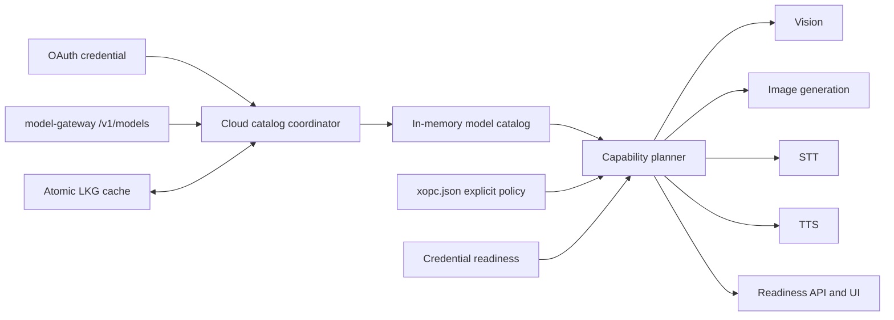

# XOPC Cloud capability readiness

Status: Implemented in xopc; model-gateway v2 publication is deployment-owned
Owners: Models, Agent Runtime, Gateway Console
Last updated: 2026-08-28

Implementation note: phases A–E are implemented in this repository. The client accepts both the existing catalog and the additive v2 recommendation metadata. Publishing v2 defaults from model-gateway remains an external service deployment concern because that service is not part of this workspace.

## 1. Summary

Completing XOPC Cloud OAuth must make every published capability usable without requiring users to edit `xopc.json`. Authorization alone is not sufficient: the client also needs a durable model catalog, deterministic capability selection, runtime failover, and observable readiness.

This design introduces four layers:

1. a durable last-known-good XOPC Cloud catalog;
2. one catalog coordinator shared by Gateway, TUI, direct CLI, onboarding, and OAuth;
3. a capability planner for vision, image generation, STT, and TTS;
4. a readiness API used by the console and diagnostics.

New automatic selections are runtime-managed and are not persisted as fixed model IDs. Existing explicit user configuration remains authoritative.



## 2. Goals

- After OAuth, every capability published for the account becomes executable with no local provider configuration.
- Preserve explicit local/provider/model choices and disabled states.
- Avoid unsolicited TTS output and hidden cost or privacy changes.
- Keep XOPC Cloud usable across process restarts and temporary catalog outages.
- Adapt to model publication, removal, quota, and transient provider failures.
- Give UI, CLI, and logs one truthful readiness model.
- Make revoke immediately remove XOPC Cloud from runtime selection.

## 3. Non-goals

- Guaranteeing that the service publishes at least one model for every capability.
- Replacing the existing model gateway routing and upstream target failover.
- Persisting OAuth tokens in the catalog cache.
- Silently replacing an explicit healthy model chosen by the user.
- Automatically enabling spoken replies. TTS generation can be ready while automatic delivery stays off.

## 4. Invariants

1. `authorized`, `catalogReady`, and `capabilitiesReady` are separate states.
2. A failed refresh never overwrites a usable catalog snapshot.
3. A successful valid empty catalog is authoritative.
4. Revocation wins over any in-flight refresh.
5. Explicit `enabled: false` always wins over automatic selection.
6. A healthy explicit model is attempted before managed candidates.
7. Automatic candidates are derived at runtime and do not become permanent model pins.
8. Automatic TTS delivery is off unless `messages.tts` explicitly enables an automatic trigger.
9. Every selected candidate has a machine-readable source and rejection reason.

## 5. Catalog lifecycle

### 5.1 Persistent snapshot

Add `src/providers/model-catalog-persistence.ts` and store the snapshot at:

```text
<stateDir>/cache/model-catalog/xopc-cloud-v1.json
```

Use `writeTextAtomic()` with mode `0600`. The file contains no credentials.

```ts
interface PersistedXopcCloudCatalog {
  schemaVersion: 1;
  providerId: 'xopc-cloud';
  catalogVersion: string | null;
  fetchedAt: number;
  baseUrl: string;
  recommended: Partial<Record<CapabilityId, string>>;
  models: CatalogModel[];
}
```

Loading rules:

- validate the entire document with Zod;
- reject unknown schema versions and malformed model entries;
- cap the input size at 4 MiB;
- hydrate before the first model registry or tool factory read;
- mark the snapshot `stale` after `max(24h, 2 * modelCatalog.intervalHours)`;
- do not hard-expire a last-known-good snapshot solely because of age;
- clear it on local revoke or confirmed permanent authorization failure.

Stale snapshots remain candidates because attempting a stale model and falling back is more useful than losing all cloud capability during an outage.

### 5.2 Global lazy hydration

The global `getModelCatalogStore()` path must hydrate the persisted XOPC Cloud source exactly once. Directly constructed `new ModelCatalogStore()` instances remain isolated for tests.

This defensive lazy hydration closes process-entry gaps. Explicit process bootstraps still call the coordinator so status and refresh behavior remain observable.

### 5.3 Catalog coordinator

Add `src/providers/xopc-cloud-catalog-coordinator.ts`:

```ts
interface EnsureCatalogOptions {
  reason: 'startup' | 'oauth' | 'agent-run' | 'manual' | 'recovery';
  network: 'never' | 'if-empty' | 'always';
  timeoutMs?: number;
}

interface CatalogReadiness {
  state: 'not-authorized' | 'ready' | 'stale' | 'refreshing' | 'unavailable';
  source: 'memory' | 'disk' | 'network' | 'none';
  fetchedAt?: number;
  catalogVersion?: string | null;
  modelCount: number;
  error?: { code: string; message: string; retryable: boolean };
}

interface XopcCloudCatalogCoordinator {
  hydrate(): Promise<CatalogReadiness>;
  ensure(options: EnsureCatalogOptions): Promise<CatalogReadiness>;
  refresh(reason: EnsureCatalogOptions['reason']): Promise<CatalogReadiness>;
  clear(reason: 'revoke' | 'invalid-grant'): Promise<void>;
  snapshot(): CatalogReadiness;
}
```

Behavior:

- `refresh()` is single-flight inside one process;
- refresh uses the existing OAuth provider lock so credential deletion cannot race catalog commit;
- it captures the current credential record and verifies it still exists before committing;
- only a successfully validated `/models` response replaces memory and disk;
- refresh updates the model registry and image provider registry once;
- it emits one `model-catalog.updated` event with old/new versions and changed capabilities;
- a 401 caused by an expired access token gets one OAuth refresh attempt;
- `invalid_grant` clears credentials and catalog; network errors preserve the snapshot.

`ModelCatalogSyncService` becomes the scheduler around this coordinator instead of owning a separate XOPC Cloud refresh path.

### 5.4 Entry-point integration

| Entry point | Required behavior |
|---|---|
| Gateway startup | Hydrate disk before ready. Refresh in background. If an active default model is `xopc-cloud/*` and no cache exists, wait up to 10 seconds. |
| Agent run | If the requested provider is xopc-cloud and catalog is empty, await the shared `ensure({ network: 'if-empty' })` barrier before resolving the model. |
| TUI | Replace the private refresh implementation with the coordinator. |
| Direct `xopc agent` | Call the same `ensure()` before constructing `AgentService`. |
| `xopc auth login xopc-cloud` | Refresh and persist the catalog before reporting completion. Authorization may succeed with a degraded catalog result, but the CLI must print the warning and retry command. |
| Web OAuth | Session completion includes catalog and capability readiness. |
| Manual refresh | Reuse the coordinator single-flight operation. |

## 6. Capability planner

### 6.1 Shared types

Add `src/capabilities/readiness/`:

```ts
type CapabilityId = 'vision' | 'image-generation' | 'stt' | 'tts';

type CandidateSource =
  | 'native-model'
  | 'explicit-config'
  | 'installed-local'
  | 'xopc-cloud-managed'
  | 'configured-provider'
  | 'credentialless-fallback';

interface CapabilityCandidate {
  capability: CapabilityId;
  provider: string;
  model: string;
  source: CandidateSource;
  ready: boolean;
  priority: number;
  reasons: string[];
  metadata?: Record<string, unknown>;
}

interface CapabilityPlan {
  capability: CapabilityId;
  status: 'ready' | 'degraded' | 'unavailable' | 'disabled';
  primary?: CapabilityCandidate;
  fallbacks: CapabilityCandidate[];
  rejected: CapabilityCandidate[];
  selectionSource: CandidateSource | 'none';
  catalogVersion?: string | null;
}
```

The planner is pure and synchronous over a hydrated catalog snapshot, config, local installation state, and synchronous credential readiness. Actual provider calls continue to resolve and refresh credentials asynchronously.

### 6.2 Precedence

Common precedence:

1. explicit disabled state;
2. healthy explicit model/provider and explicit fallbacks;
3. purpose-specific native or installed local candidates;
4. XOPC Cloud managed candidates when OAuth and catalog are ready;
5. other configured providers;
6. credentialless fallback providers where applicable.

Within one source, use service-provided capability recommendation first, then stable non-best-effort models, then best-effort models, then model ID lexical order. Do not depend on API array order.

### 6.3 Vision

For inbound attachments:

1. use the current chat model natively when it accepts image input;
2. otherwise use explicit `imageModel` candidates;
3. use vision models from the current chat provider;
4. use recommended XOPC Cloud vision models;
5. use other configured vision providers.

For the `image` tool, explicit `imageModel` remains first; the native current model can be used only when the tool request can safely reuse its provider runtime.

Replace the hard-coded OpenAI/Anthropic fallback in `tool-model-config.ts` with planner output.

### 6.4 Image generation

Keep explicit `imageGenerationModel.primary` and fallbacks first. When no explicit config exists, use the planner instead of registry order.

XOPC Cloud contributes every available model supporting `images.generate`, not only the first. Models supporting `images.edit` are filtered when source images are present.

`autoProviderFallback` continues to control cross-provider expansion for explicit policies. Managed zero-config plans include all compatible configured providers by default.

### 6.5 STT

When `tools.media.audio` is absent:

1. installed xopc-local model;
2. XOPC Cloud STT models;
3. other configured STT providers.

When configuration exists, preserve its primary/model entries and fallback semantics. An explicit `enabled: false` disables STT.

Replace lightweight metadata-only availability checks with planner readiness for Gateway and webchat. Keep a dependency-light wrapper if extension loading requires it, but it must consume a precomputed readiness snapshot rather than assume every no-key provider is usable.

### 6.6 TTS

Separate capability availability from automatic delivery:

```ts
interface EffectiveTtsPolicy {
  capabilityPlan: CapabilityPlan;
  automaticTrigger: 'off' | 'always' | 'inbound' | 'tagged';
}
```

When `messages.tts` is absent:

- the `text_to_speech` tool is available if the capability plan is ready;
- provider order is XOPC Cloud, configured keyed providers, then Edge;
- `automaticTrigger` is `off`.

When `messages.tts` exists, its `enabled`, `provider`, `trigger`, and fallback settings remain authoritative. A configured XOPC Cloud TTS model gets its catalog `defaultVoice`; explicit voice overrides it.

Add model-level fallback inside the XOPC Cloud speech provider so a removed or temporarily unavailable public TTS model can move to the next compatible cloud model.

## 7. Service catalog contract

Extend the model-gateway response compatibly:

```json
{
  "object": "list",
  "xopc": {
    "schemaVersion": 2,
    "defaults": {
      "vision": "vision-model-id",
      "image-generation": "image-model-id",
      "stt": "stt-model-id",
      "tts": "tts-model-id"
    }
  },
  "data": []
}
```

Each model should additionally expose:

```json
{
  "xopc": {
    "stability": "stable",
    "priority": 100,
    "tier": "free",
    "bestEffort": true
  }
}
```

Rules:

- defaults must reference an enabled model with the matching capability;
- publishing or disabling a default requires selecting a replacement in the same transaction;
- the client validates defaults and ignores invalid references;
- v1 clients continue to work because fields are additive;
- v2 clients fall back to deterministic ranking when metadata is absent.

Maintain a shared JSON fixture or schema package between xopc and model-gateway. A CI contract test must pass the server fixture through `XopcCloudModelSource` and compare capability plans.

## 8. API and UI

### 8.1 Readiness endpoint

Add:

```http
GET /api/capabilities/readiness
```

Response:

```json
{
  "ok": true,
  "payload": {
    "provider": {
      "id": "xopc-cloud",
      "authorized": true,
      "authStatus": "connected",
      "catalog": {
        "state": "stale",
        "source": "disk",
        "fetchedAt": 1787900000000,
        "catalogVersion": "catalog-42"
      }
    },
    "capabilities": {
      "vision": {
        "status": "ready",
        "primary": "xopc-cloud/vision-1",
        "source": "xopc-cloud-managed",
        "fallbacks": ["openai/gpt-4.1"]
      },
      "tts": {
        "status": "ready",
        "primary": "xopc-cloud/tts-1",
        "source": "xopc-cloud-managed",
        "automaticTrigger": "off"
      }
    },
    "issues": []
  }
}
```

Issue codes are stable identifiers such as:

- `oauth_not_connected`
- `oauth_expired_refresh_failed`
- `catalog_never_loaded`
- `catalog_stale`
- `capability_not_published`
- `explicit_model_unavailable`
- `default_voice_unavailable`
- `provider_temporarily_unhealthy`

Extend existing catalog status with `hydratedFromDisk`, `stale`, `fetchedAt`, `catalogVersion`, and `lastRefreshError`.

### 8.2 OAuth session result

The async OAuth completion payload becomes:

```ts
interface OAuthCompletionReadiness {
  authorized: true;
  catalog: CatalogReadiness;
  capabilities: Record<CapabilityId, 'ready' | 'unavailable' | 'disabled'>;
}
```

OAuth is still considered successful when a retryable catalog request fails, but the UI state is `connected-degraded`, not plain `connected`. The UI shows a retry action and the cached snapshot age.

### 8.3 Console behavior

- Onboarding, Models & services, Image, and Voice screens consume the same readiness endpoint.
- Remove client-side duplication that independently picks the first XOPC Cloud model.
- Show “Automatic — XOPC Cloud recommendation” separately from explicit configuration.
- Let users pin a model or switch back to Automatic.
- Show TTS capability ready while making “Automatic spoken replies: Off” explicit.
- Use skeleton states while readiness is loading.

## 9. Failure and failover policy

| Failure | Same candidate retry | Next model | Next provider | Catalog action |
|---|---:|---:|---:|---|
| Expired access token | Once after OAuth refresh | No | No | None |
| `invalid_grant` / revoked | No | No | Yes, if configured | Clear cloud snapshot |
| Model not found / disabled | No | Yes | Yes | Trigger background refresh |
| Quota exhausted | No | Yes when quota is model-scoped | Yes | Record degraded state |
| 429 | Honor bounded retry hint once only for short delays | Yes | Yes | None |
| 5xx / provider unavailable | No | Yes | Yes | None |
| Network timeout | No | Yes | Yes | None |
| Unsupported input format | No | Compatible model only | Compatible provider | None |
| Invalid user input | No | No | No | None |
| User cancellation | No | No | No | None |

Failover must remain bounded by the existing operation timeout. Candidate failures are returned in structured attempts and surfaced in diagnostics without exposing secrets.

## 10. Revocation and invalidation

Create one disconnect operation used by Gateway API and CLI:

1. acquire the provider OAuth lock;
2. delete the local credential record;
3. invalidate the cached `ProviderAuthService` runtime;
4. clear XOPC Cloud memory and disk catalog;
5. refresh the model registry;
6. reload image generation providers;
7. evict embedded session runners;
8. emit `provider.auth.changed`, `model-catalog.updated`, and capability readiness events.

The catalog coordinator uses a monotonically increasing in-process generation. A refresh may commit only if its captured generation still matches. Holding the cross-process OAuth lock through credential verification and commit prevents a local revoke from being followed by a stale catalog rewrite.

Explicit config references are not deleted. They remain visible with `explicit_model_unavailable`, allowing reauthorization to restore them.

## 11. Configuration compatibility

Phase 1 requires no breaking schema change:

- absence of a capability config means managed automatic selection;
- existing explicit configuration remains first;
- new onboarding no longer writes vision/image/STT/TTS model IDs automatically;
- onboarding writes only the chosen default chat role and OAuth credential;
- effective readiness shows the managed selections.

Existing onboarding-generated pins cannot be safely distinguished from intentional user pins. Treat them as explicit. If the pinned model becomes unavailable, the planner may use a same-capability managed replacement for that request and emits a warning, but does not rewrite the file.

Add a user action, “Switch to automatic recommendation,” that removes only the relevant explicit capability field after confirmation.

A later schema version may add an explicit fallback mode:

```ts
type CapabilityFallbackMode = 'none' | 'same-provider' | 'configured-providers';
```

Do not block the first implementation on that schema change.

## 12. Observability

Structured logs use these phases:

- `catalog_hydrate`
- `catalog_refresh`
- `catalog_commit`
- `capability_plan`
- `candidate_failed`
- `provider_revoked`

Include `provider`, `catalogVersion`, `snapshotAgeMs`, `capability`, `selectionSource`, `modelRef`, `attemptCount`, `reason`, and `durationMs`. Never log tokens or full authorization headers.

Metrics:

- catalog hydration success and latency;
- refresh success rate by failure code;
- stale snapshot age;
- readiness by capability;
- automatic versus explicit selection;
- candidate failover rate and final success;
- zero-config smoke-test success by capability;
- connected-degraded OAuth completion count.

## 13. Testing

### 13.1 Unit tests

- persisted schema validation, atomic save, corrupt cache, and stale age;
- refresh single-flight and last-good preservation;
- revoke generation winning over in-flight refresh;
- deterministic ranking independent of response order;
- capability-specific filtering and explicit precedence;
- TTS capability versus automatic trigger separation;
- capability-aware replacement suggestions.

### 13.2 Integration tests

- model-gateway v2 fixture parsed by xopc;
- OAuth success persists catalog before process exit;
- Web onboarding and CLI onboarding produce identical readiness;
- direct CLI starts from disk cache without Gateway;
- cold start with no cache waits for refresh;
- offline restart uses stale cache;
- removed model falls through to the next compatible model;
- revoke clears cache, providers, and runner state;
- OAuth success plus catalog failure produces connected-degraded;
- empty valid catalog produces capability-not-published.

### 13.3 End-to-end smoke matrix

Run vision, image generation, STT, and explicit TTS for:

- fresh user with only XOPC Cloud OAuth;
- existing local STT user;
- existing explicit third-party image/TTS user;
- stale catalog and temporary network failure;
- model rotation between two catalog versions;
- quota exhaustion on the primary candidate;
- revoke followed by reauthorize.

Automatic TTS must remain silent in every fresh-user case.

## 14. Rollout

### Phase A — catalog durability

- persistence repository and coordinator;
- Gateway/TUI/direct CLI/OAuth integration;
- readiness status for catalog only;
- no selection behavior change.

Exit criteria: restart and direct CLI tests pass; no catalog regression for existing users.

### Phase B — planner shadow mode

- compute plans alongside current behavior;
- log selection differences without changing execution;
- add readiness API and console diagnostics.

Exit criteria: shadow plan matches explicit behavior and finds expected zero-config cloud candidates.

### Phase C — vision, image generation, and STT

- switch these runtimes to planner output;
- stop new onboarding from persisting modality pins;
- enable bounded model/provider failover.

Exit criteria: zero-config smoke tests pass and explicit configurations remain unchanged.

### Phase D — TTS

- split capability availability from automatic delivery;
- use cloud-managed TTS for explicit tool calls;
- default absent trigger to off;
- add voice/model fallback.

Exit criteria: explicit TTS works after OAuth and fresh users receive no automatic spoken replies.

### Phase E — service recommendations and cleanup

- publish v2 defaults and priority metadata;
- shared contract fixture;
- revoke invalidation and model rotation UX;
- remove duplicated onboarding selection code.

## 15. Work packages

| Package | Primary files | Result |
|---|---|---|
| Catalog persistence | `src/providers/model-catalog-persistence.ts`, `model-catalog-store.ts`, `config/paths.ts` | Atomic LKG cache and lazy hydrate |
| Catalog coordinator | `src/providers/xopc-cloud-catalog-coordinator.ts`, `model-catalog-sync-service.ts`, `xopc-cloud-model-source.ts` | Shared refresh and readiness |
| Runtime bootstrap | `src/gateway/service.ts`, `src/cli/commands/agent.ts`, `src/cli/utils/oauth-login.ts`, `src/tui/backends/embedded-backend.ts` | Consistent process behavior |
| Capability planner | `src/capabilities/readiness/*` | One candidate and diagnostics model |
| Media integration | image tool/config, STT factory/availability, TTS factory/merge config | Zero-config execution and failover |
| Auth invalidation | OAuth routes, credential service, embedded runner pool | Correct revoke behavior |
| Gateway API | model routes plus capability readiness route | Truthful UI contract |
| Console | onboarding, models hub, image, voice | Automatic versus explicit UX |
| Service contract | model-gateway catalog response and admin validation | Recommended per-capability defaults |
| Diagnostics | model reference auditor, doctor checks, metrics | Actionable readiness issues |

## 16. Acceptance criteria

- Any supported authorization entry point produces the same readiness result.
- With only XOPC Cloud OAuth and published models, all four capability smoke tests succeed without editing JSON.
- A Gateway or direct CLI process can start from the persisted catalog while the catalog endpoint is unavailable.
- A removed primary model falls back without persistent config mutation.
- Explicit local/provider choices are never overwritten.
- TTS tool use is ready after OAuth, while automatic spoken replies stay off by default.
- Revocation removes XOPC Cloud from all candidate plans within one second in the current process.
- UI never labels a provider fully ready when authorization succeeded but catalog or capability readiness failed.
