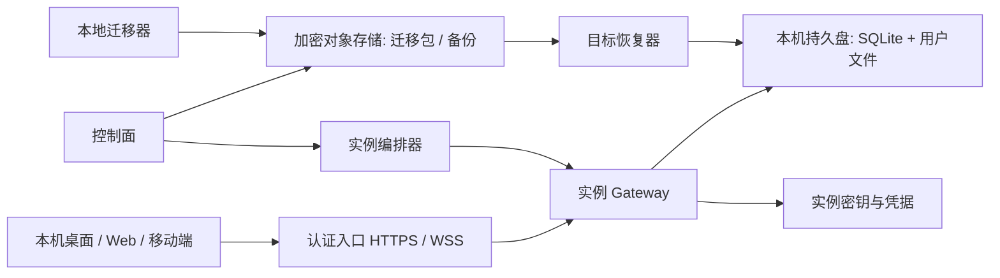

# xopc 托管实例：本地迁移、备份与升级技术方案

状态：设计提案；阶段 A 的离线加密状态目录备份 CLI 已开始实现，完整迁移仍未实现
日期：2026-10-03
范围：从个人本机实例迁移到用户自有服务器或 xopc 托管云实例

## 1. 决策摘要

用户拥有一个逻辑 xopc 实例。任一时刻只有一个 Gateway 对该实例的数据库、频道、自动化和外部副作用拥有写入权。迁移改变运行位置，不改变会话、Agent 和业务对象的稳定 ID。桌面、Web 和移动端通过 Gateway API 使用同一实例。

第一版使用**冷迁移**：预检和上传可提前完成，但最终增量快照期间源端停止接收新写入；目标端在恢复和验证完成前保持隔离。切换完成后源端进入已迁移状态。云端初期为每个实例部署单个长期运行的 Gateway，使用本地主机持久盘运行 SQLite。对象存储只保存加密备份和不可变迁移对象，不承载在线数据库。

“XOPC Cloud 模型服务”与本文的“托管 xopc 实例”是不同产品能力；模型授权本身不代表实例已托管。

### 目标

- 用户从本地迁移后继续访问既有会话、Agent、工作区、附件、任务和自动化。
- 在任何失败节点都能明确知道当前主实例在哪里，并能从已验证快照恢复。
- 支持可携带的加密备份，能迁往自有服务器，也能从托管实例导出。
- 升级前留下完整恢复点，阻止不兼容版本打开数据。
- 凭据、设备信任和外部副作用采用明确策略，不以“复制目录”冒充无损迁移。

### 暂不支持

- 本地和云端同时写入、跨主机共享 SQLite、离线双向同步。
- 无停机实时迁移、自动多活故障转移。
- 保证任意第三方扩展或本地硬件能力迁移后立即可用。
- 将移动端尚未被 Gateway 确认的草稿和离线操作纳入服务器备份。

## 2. 现状与需要补齐的边界

| 现有能力 | 位置 | 缺口 |
| --- | --- | --- |
| 状态根目录、配置和凭据路径 | `src/config/paths.ts`、`docs/workspace.md` | 缺统一资产枚举、路径可移植性检查 |
| SQLite schema 迁移与版本拒绝 | `src/storage/sqlite/migrations/runner.ts` | 缺面向整实例的快照、恢复和发布协议 |
| Gateway 本机锁 | `src/gateway/lock.ts`、`src/gateway/run-loop.ts` | 只约束同一主机；跨主机切换需额外授权与代际控制 |
| Docker 镜像、远程连接、健康检查 | `docs/docker.md`、`src/gateway/hono/routes/public-gateway.ts` | 缺实例编排、迁移准备状态、业务就绪探针 |
| 包更新和扩展更新 | `src/infra/update-runner.ts`、`src/extensions/update.ts` | 云镜像升级应使用独立发布流程，不能在容器内自更新 |

`docs/design/storage-architecture.md` 已规定 SQLite 与 Gateway 同机、完整恢复集包含数据库和文件、外部副作用是至少一次语义。本文延续这些约束。

## 3. 系统组件与信任边界



- **控制面**保存账户、实例 ID、部署位置、镜像版本、迁移任务、备份目录和审计事件；不直接打开用户 SQLite，不处理聊天内容。控制面使用独立数据库。
- **数据面**为一个实例运行一个 Gateway 和一个读写持久卷。MVP 每实例单副本；调度器禁止同卷双挂载。SQLite 所在卷必须是受支持的本地文件系统，不采用 NFS、SMB 或对象存储挂载。
- **备份面**保存密文数据块和签名 manifest。控制面数据库丢失时，仍应能凭备份包、实例密钥恢复数据。
- **入口**为每实例提供稳定 HTTPS/WSS 地址。外部请求在入口完成账户认证，Gateway 仍验证实例作用域和权限；不得仅依赖可猜测 URL 或代理头。
- **自有服务器模式**复用相同备份格式和恢复器，可通过 SSH 或受控隧道传输；不要求接入官方控制面。这样“可迁移”不绑定托管服务。

云端运行不等于云桌面：第一阶段提供远程 Gateway 和托管工具环境，不承诺将本机 GUI、摄像头、USB、系统钥匙串原样搬上云。确需本地设备的工具应留在用户设备上，通过经过授权的设备代理执行。

### 3.1 稳定域名与入口身份

实例的身份是不可变 `instanceId`，域名是其可变入口，物理主机、Pod、IP 和区域都不能成为客户端或第三方服务保存的地址。官方托管为每个实例分配长期稳定的规范域名，例如 `i-<opaque-id>.cloud.xopc.ai`；可显示名称与规范域名分离，用户改名不改变 URL。具体主域名由运营方确定后固定，不应随镜像版本、节点或区域改变。

控制面保存 `instanceId -> canonicalOrigin -> activeDeploymentGeneration` 映射，入口代理按 Host 路由到当前健康代际。升级、卷搬迁和同区域故障恢复只改入口映射，不改用户域名，也不要求等待 DNS TTL 过期。DNS 只将托管域名指向入口层；入口层本身需高可用，并保留证书、WSS 与长连接排空能力。切换时新 WebSocket 连接进入新实例，旧连接限时关闭并提示客户端重连；客户端重连后必须核对 `instanceId`，避免误连其他实例。

`gateway.publicUrl` 目前已用于外部 URL、移动配对及浏览器 Origin 处理（见 `src/gateway/public-url.ts`、`src/config/schema.ts`）。托管模式由控制面注入规范 `publicUrl`，Gateway 不根据请求的 `Host`、`Forwarded` 或内部容器地址自行推断可公开 URL；代理头只接受可信入口。所有对外链接通过同一 URL 构造层产生。浏览器 CORS/CSRF 允许列表精确包含当前规范域名和已验证别名，不使用通配符。

| URL 类型 | 稳定性要求 | 切换处理 |
| --- | --- | --- |
| 客户端 HTTPS/WSS、设备配对 | 规范域名长期稳定 | 客户端保存 `instanceId` 和规范域名；重连校验身份 |
| OAuth redirect、MCP 回调 | 注册的完整 URL 必须稳定 | 预检列出提供商；目标开放前完成回调注册或重新授权 |
| 自动化/连接器 Webhook | 既有 URL 尽量不变 | 入口按代际路由；旧入口转发已验证 POST，不依赖 301/302 |
| 分享链接、媒体链接、深链 | 已发出的链接在有效期内可访问 | 在清单中枚举绝对 URL；保留别名或明确标记失效 |
| 管理控制面与上传端点 | 与实例域名分离 | 不把控制面地址写进用户内容 |

用户自定义域名是规范域名的可选别名：先验证域名所有权，检查 DNS 指向，签发/续期 TLS 证书，再启用 Host 路由；失败时官方规范域名仍可访问。删除别名前检查 OAuth、Webhook、分享链接与客户端引用；提供迁移报告和过渡期。自定义域名不自动成为唯一规范 URL，避免用户失去域名控制后实例无法管理。

从本地已有公网域名迁入时，若用户控制 DNS，可先把该域名接到云入口并完成证书验证，再做最终切换，从而保留第三方回调地址。DNS 切换本身不是原子操作：应提前降低 TTL，并在旧入口保留限时 HTTPS/WSS 转发至新主实例，直到旧缓存过期；无法保留旧入口时明确告知可能出现的短暂不可达，且旧 Gateway 必须保持停止写入。若原来使用本地 IP、Tailscale 主机名或用户无法控制的隧道域名，则无法承诺旧 URL 继续有效：预检必须列出所有受影响的 OAuth、Webhook、配对和分享链接，切换时重新注册或重新连接。自有服务器迁入官方托管后，用户若希望未来能无缝迁出，应使用自己持有的域名作为长期公开地址；官方域名只保证在官方托管期间可用。

域名回滚与数据回滚分开处理。只要原规范域名仍指向稳定入口，回滚仅改变 `activeDeploymentGeneration`；已产生新写入时仍须遵守第 6.3 节的数据回迁规则。入口映射变更采用版本前置条件和幂等键，并在切换前后从公网检查证书、HTTP、WSS、OAuth 与 Webhook 路径。记录 DNS、证书、入口路由和目标 Gateway 四层状态，便于定位故障。

## 4. 数据分类与迁移策略

| 数据 | 默认处理 | 特殊规则 |
| --- | --- | --- |
| `xopc.db` | 一致性快照，必选 | 校验 `integrity_check`、schema 和业务引用 |
| `xopc.json`、`models.json`、Agent profile、Skills、扩展数据 | 迁移 | 重写受控绝对路径；保留原件供审计 |
| 状态目录内工作区、附件、媒体、分享资产 | 迁移 | 文件哈希、大小、权限及引用校验 |
| 状态目录外工作区和项目 | 预检列出后由用户选择 | 不静默上传任意家目录；记录缺席依赖 |
| API key、OAuth、频道和 MCP 凭据 | 单独加密导出，逐类选择 | 可移植凭据可恢复；机器绑定凭据需重新授权 |
| Gateway token、设备配对、浏览器会话 | 不沿用 | 云端生成新服务凭据并重新配对 |
| 日志、下载的运行时/模型、缓存、PID/锁/Socket | 默认不迁移 | 可按需单独导出日志；运行时在目标重建 |
| 移动端未提交草稿和离线操作 | 不在服务器迁移包内 | 客户端先同步并确认，再进行切换 |

迁移器必须拒绝路径穿越、绝对路径逃逸、设备文件、FIFO、未授权的符号链接目标和超出配额的文件。扩展提供可选的 `preflight`、`export`、`restore`、`postRestoreCheck` 钩子；无钩子的扩展仅复制数据并默认禁用，直到兼容性检查通过。

## 5. 迁移包格式

使用版本化、可验证的开放格式。数据库和文件资产分离；文件块按内容哈希寻址，以支持断点续传与后续增量备份。压缩发生在加密之前。

```ts
interface InstanceSnapshotManifestV1 {
  format: 'xopc-instance-snapshot';
  formatVersion: 1;
  snapshotId: string;
  instanceId: string;
  sourceVersion: string;
  sourceSchemaVersion: number;
  createdAt: string;
  consistency: 'quiesced';
  database: { objectId: string; sha256: string; bytes: number };
  assets: Array<{
    logicalPath: string;
    kind: 'config' | 'profile' | 'workspace' | 'attachment' | 'extension';
    objectId: string;
    sha256: string;
    bytes: number;
    mode: number;
  }>;
  excluded: Array<{ logicalPath: string; reason: string }>;
  credentialEnvelope?: { objectId: string; policy: 'selected-portable-secrets' };
  rootHash: string;
}
```

实际传输使用规范化 JSON 或 CBOR、固定哈希算法、签名/认证标签和明确字节上限。`logicalPath` 是相对于受控根的逻辑路径，不包含源机器绝对路径。每个快照产生随机数据密钥；数据块使用 AEAD 加密，密钥由用户恢复密钥或托管 KMS 包装。凭据单独使用不同密钥和更严格访问策略。先上传不可变块，再以条件写发布 manifest；未发布的上传可安全清理。

备份格式应公开说明并提供 `xopc backup verify` 和 `xopc backup restore --target <empty-dir>`，避免只能通过官方云恢复。

## 6. 冷迁移协议

### 6.1 状态机

```text
NEW -> PREFLIGHT -> PREPARED -> COPYING -> QUIESCING -> SNAPSHOTTED
    -> UPLOADED -> RESTORING -> VALIDATING -> READY_TO_CUTOVER
    -> CUTOVER -> ACTIVE
```

失败进入 `FAILED_RECOVERABLE`；切换前可恢复源端服务。每次状态变更有 `migrationId`、幂等键、时间戳、源/目标代际号和可审计原因。控制面状态是编排记录，Gateway 和卷上的状态标记才决定是否允许执行副作用；任何状态不一致时默认不启动目标端频道与自动化。

### 6.2 步骤

1. **预检**：读取运行版本、schema、路径、外部工作区、扩展、活跃任务、频道和自动化；检测目标架构、容量、OS 依赖、域名控制权、DNS/TLS、回调 URL、模型端点与凭据可移植性。输出可读报告和机器可读 blocker/warning，包含所有会变化的公开 URL。
2. **准备**：创建目标实例、持久卷和服务密钥；预留规范域名，验证自定义域名并签发证书；拉取与源兼容的固定镜像。目标仅启动恢复器，不启动 Gateway。预上传稳定大文件可以缩短最终停机，但其内容不能单独用于恢复。
3. **静默源端**：Gateway 拒绝新 Agent run、工作区写入和自动化触发；等待在途任务限时结束。超时任务记录为中断，不隐式重跑。关闭频道连接和外发消费，停止 Gateway，并写入源端迁移意图。
4. **捕获最终快照**：以离线 `VACUUM INTO` 或 SQLite backup API 生成数据库快照；随后捕获静默状态下文件。完成哈希、完整性和引用检查，发布 manifest。若静默无法保证扩展或外部进程停止写文件，则预检阻止迁移。
5. **恢复目标**：先验证签名、密钥、哈希、容量和目标路径，恢复到临时目录。应用路径映射和权限；从目标目录运行配置验证、`PRAGMA integrity_check`、外键检查和引用检查。与快照相同版本启动候选 Gateway，但以 `maintenance` 模式禁用频道、自动化、外发队列和公网入口。
6. **业务验收**：检查会话数、Agent 数、文件数与清单一致；进行一个无副作用模型诊断；列出需重新授权的能力。用户的本地客户端尚不切到目标。
7. **切换**：在控制面获得独占实例代际号，将源端标记为 `migrated` 并保留只读恢复点；目标以新代际号转为主实例，入口原子改路由并启用频道与自动化；更新客户端连接 profile。需变更 DNS 的用户域名在本步完成切换与外部验证。源端普通启动必须检测标记并拒绝 Gateway 写入，除非执行明确的回迁流程。
8. **确认与清理**：从公网检查 HTTPS、WSS、证书、OAuth 和 Webhook 路径，再检查频道连接、自动化调度、一次真实模型调用和客户端重连；保留源端快照、旧域名过渡路由与上传块到期后按策略删除。

本机可能离线或被人工复制，因此不能声称分布式租约绝对阻止任意旧副本启动。受管版本通过迁移标记、云端代际检查和频道凭据轮换降低双主风险；对无法受控的第三方 webhook/频道，切换时显式停用旧凭据并重新绑定。

### 6.3 回退

- `CUTOVER` 前失败：目标删除临时恢复目录，源端按原配置恢复；不丢弃最终快照。
- `CUTOVER` 后且目标无新写入：可撤销目标主权、重新启用源端。
- 目标已有新写入：先制作目标新快照，再执行回迁；禁止直接用旧源库覆盖。
- 外部发送可能处于“已发出但未确认”状态，继续沿用现有至少一次语义；尽可能传递稳定操作 ID 供下游去重，并把待人工核对项显示在切换报告中。

## 7. 备份与恢复

`xopc backup create|list|verify|restore` 为本地和云端共用的核心能力。MVP 采用短暂停写的一致快照；后续若需要低停机备份，再引入文件版本化或写入屏障。不能先备份 SQLite、再在工作区持续写入的情况下复制文件，并宣称同一时间点一致。

备份策略默认每日完整逻辑快照，块级去重上传；频繁变更的数据库可增加更短间隔的 SQLite 快照。产品级目标建议先以 **RPO 24 小时、RTO 4 小时**作验收基线，待容量和恢复演练数据验证后再收紧。保留策略建议每日 7 份、每周 4 份、每月 3 份，均可配置；每次升级前另留一份不可被普通轮转立即删除的恢复点。

恢复始终写入新目录或新卷，先验证后切换。定期在隔离环境自动做恢复演练，检查数据库、附件引用、Agent profile 和启动健康；只验证对象哈希不足以证明可运行。删除账户时清除在线卷、备份块和包裹密钥，并记录各存储副本的清理状态。

## 8. 云端升级与兼容

托管实例禁止调用本机 npm/pnpm 自更新路径。控制面维护镜像 digest、扩展兼容矩阵与最低/最高 schema；部署始终固定 digest，不使用浮动 `latest`。

升级流程：检查兼容矩阵 → 静默实例 → 生成并验证完整恢复点 → 克隆卷到候选环境 → 在候选环境运行逐版本迁移 → 执行数据和业务探针 → 停旧实例 → 切换候选卷和镜像 → 开放服务。迁移失败则保持旧实例；新版本已经写入数据库后，回退必须恢复升级前整套快照，不能只回滚镜像。正常发布不做同卷双写或蓝绿并行运行。

兼容规则：

- 迁移包格式独立于应用 schema；恢复器支持声明范围内的旧格式，未知新格式直接拒绝。
- 目标应用支持源 schema 且包含完整迁移链才允许导入；高于目标版本的 schema 直接拒绝。
- 扩展与目标 Node、OS、CPU 架构、权限不兼容时保留数据但禁用执行。
- API 客户端与 Gateway 需声明最低兼容版本；移动端升级滞后时给出明确提示，不通过静默丢字段解决。
- 外部回调 URL、CORS、OAuth redirect、IP 白名单和本地模型地址在部署前重算并列为验收项。
- 固定实例规范域名跨版本和跨节点不变；升级只切入口路由映射，不依赖 DNS 传播作为事务边界。

## 9. 安全模型

- 每个租户独立实例身份、存储卷、KMS 数据密钥和访问策略。MVP 可在共享集群调度，但实例进程和文件系统隔离；运行 Agent 命令的工作负载应再使用容器/VM 沙箱、资源限额和网络出口策略。
- 用户登录凭据与 Gateway 内部服务凭据分离；迁移时轮换 Gateway token，客户端重新配对。浏览器会话和设备信任不复制。
- 第三方 API/OAuth/频道凭据逐类选择是否导出，默认显示目的地和可访问范围；机器绑定凭据重新授权。不要把密钥写入迁移 manifest、日志或镜像。
- 上传使用短期、限实例和对象路径的授权；下载与恢复需要实例所有者权限和审计。入口只暴露必要 API；管理接口不直接公网开放。
- 明确威胁模型：托管服务运维权限、Agent 生成代码、恶意扩展、备份泄漏、旧主机复活。托管方可运行用户代码与访问运行中数据，不能把静态加密宣传为零知识。
- 对 webhooks、频道、工具外发引入独立的副作用门禁；`maintenance` 和非主代际状态下必须拒绝执行。现有本机 Gateway 锁仍保留，但不承担跨主机仲裁。

## 10. API、CLI 与模块划分

### 核心库

- `src/backup/`：资产枚举、静默协议、SQLite 快照、manifest、加密传输、验证和恢复；可由 CLI、Gateway 和云恢复器共用。
- `src/instance-lifecycle/`：`active | quiescing | maintenance | migrated` 状态与副作用门禁，集中接入 Agent run、频道、自动化、外发队列和文件写入入口。
- `src/compatibility/`：应用/schema/扩展兼容报告、路径重写与能力降级报告。

### 命令与接口草案

```text
xopc backup create --output <path>
xopc backup verify <path>
xopc backup restore <path> --target <empty-dir>
xopc migrate preflight --target self-hosted|hosted
xopc migrate to-host <destination>
xopc migrate to-cloud
xopc migrate status <migration-id>
```

官方托管控制面拟提供 `POST /v1/instances`、`POST /v1/migrations`、`GET /v1/migrations/{id}`、`POST /v1/migrations/{id}/cutover`、`POST /v1/instances/{id}/backups`、`POST /v1/instances/{id}/upgrades`。接口统一使用幂等键、版本前置条件和结构化错误码。上传数据走临时对象授权，不通过 Gateway JSON API 代理大文件。

若在现有 Gateway 添加认证路由，必须同时更新 `src/gateway/hono/routes/lazy-bundles.ts` 及其映射测试，并通过真实 Gateway 验证路由选择。对外控制面 API 另设服务，不混进本地 Gateway 的路由注册。

## 11. 实施阶段与验收

| 阶段 | 交付 | 必过验收 |
| --- | --- | --- |
| A：备份基础 | 资产枚举、加密包、CLI 创建/验证/恢复 | 活跃 WAL、一致文件、外置工作区、损坏块、路径攻击和跨版本恢复测试 |
| B：自有服务器迁移 | 预检、冷迁移、远程恢复、客户端 profile 切换 | 频道与自动化不双跑；失败可回到源端；重启后主权状态不丢失 |
| C：官方托管 MVP | 控制面、每用户单实例、密钥、备份、计费/配额和审计 | 隔离、断点续传、定时备份、真实恢复演练、删除与导出 |
| D：运营能力 | 分批升级、候选卷迁移、健康回退、监控与告警 | 迁移失败不切流；schema 已变更时能从整套快照恢复 |
| E：优化 | 增量传输、缩短静默窗口、按任务隔离执行 | 不改变单主写入和快照一致性约束 |

关键故障注入包括上传中断、对象缺失、KMS 不可用、目标磁盘满、schema 迁移失败、源端断电、切换请求重试、旧 Gateway 复活、频道已发送未确认，以及备份恢复后附件引用缺失。验收报告记录数据量、静默时间、恢复耗时、失败恢复点和需人工重新授权的项目。

域名专项验收包括：升级与换节点后 URL 不变；切流期间 WebSocket 自动重连；证书签发/续期失败时不切流；DNS 指向错误与 CAA 限制能在预检发现；Webhook POST 不经重定向仍抵达正确代际；自定义域名删除时列出仍引用它的配置；域名回滚不错误回滚已有新写入的数据。

## 12. 待产品确认的边界

1. 托管产品是否允许用户上传任意外置工作区和第三方扩展；这决定初期存储配额与沙箱强度。
2. 凭据迁移默认策略：建议默认不迁移设备信任，其他密钥逐类显式选择。
3. 用户是否需要区域选择和数据驻留承诺；这会影响对象存储、备份副本与控制面部署。
4. 是否提供“纯托管 Gateway”与“带浏览器/桌面交互环境”两个规格；后者需要独立隔离、资源和计费模型。

## 13. 参考实现与资料

- [OpenClaw Remote access](https://docs.openclaw.ai/gateway/remote/index.html)：单 Gateway 拥有状态，其他设备作为客户端。
- [OpenClaw Backups](https://docs.openclaw.ai/install/backups)：一致性数据库快照、验证、恢复和离站备份。
- [OpenClaw Docker](https://docs.openclaw.ai/install/docker)：持久卷与容器更新方式。
- [Using Codex Cloud](https://help.openai.com/en/articles/20001545-using-codex-cloud)：云端环境与隔离任务工作区。
- [Sandbox security](https://developers.openai.com/api/docs/guides/agents-api/environments/security)：执行隔离、凭据分离和网络出口控制。
