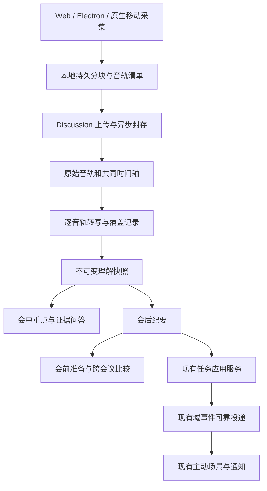

# 会议助手 P1/P2 技术设计

日期：2026-09-15
状态：设计完成，P1-A 已开始实施；实际落点与未完成项见 [实施与自查](./voice-meeting-p1-p2-implementation-review.md)。文中的类型、表和 API 为完整目标契约，不代表均已落地。
基线：`bd5e1f73e`，Electron 声明版本 `^42.4.1`，移动端 Expo `~56.0.21`、expo-audio `~56.0.13`。实际发布须记录锁文件解析版本。
关联：[PRD](./voice-meeting-prd.md) · [P0 自查](./voice-meeting-implementation-review.md) · [实施拆分与验收](./voice-meeting-p1-p2-delivery-plan.md)

## 1. 目标与交付边界

P1 让用户听全会议、随时补听，P2 让会议结论进入后续工作。沿用笔记、项目和任务入口，不新增一个独立会议应用。

| 阶段 | 用户能力 | 交付边界 |
|---|---|---|
| P1 | 麦克风与系统音频、会中重点、补听问答、重点标记、会后语音复盘 | 不自动入会；会中助手默认文字回应 |
| P2 | 会前准备、跨会议变化、承诺跟进、移动后台录音、授权资料导入 | 不自建视频会议；不承诺录制手机其他应用或电话声音 |

典型路径：选择“线上会议”→ 确认声音来源 → 录音中问“刚才交付日期为什么变了？”→ 回答附两段原话 → 会后查看本次相对上次的变化 → 将明确行动加入已有任务体系并委托跟进。

本设计继续遵守 KISS、SOLID 和奥卡姆剃刀：复用已有能力；仅在新的不变量需要时增加实体。平台适配只负责采集，Discussion 负责材料与证据，Task 负责执行，主动服务负责后续提醒。

## 2. 已核对的实现基础

| 当前能力 | 真实位置 | 扩展方式 |
|---|---|---|
| 单录音分块、校验、附件提交 | `src/discussions/recording.ts` | 改为统一音轨/采集区间清单，终稿校验移出请求 |
| 片段转写、修订、章节分析 | `src/discussions/{live-worker,revisions,analyzer,reconcile}.ts` | 增加来源音轨、覆盖范围、增量快照 |
| 人工修改与任务关联 | `src/discussions/{edits,action-tasks}.ts` | 保持人工内容和独立任务状态，不从问答自动执行 |
| 全局录音与 PCM 分段 | `web/src/features/discussions/` | 采集适配器与 UI 状态拆开，复用现有入口 |
| 桌面权限和可信来源检查 | `electron/main.ts`、`electron/ipc/{shell-permission-gates,trusted-renderer,system-settings-ipc}.ts` | 增加专用采集会话授权，不扩大为任意 renderer 可采屏 |
| 移动原生 PCM 与中断处理 | `apps/mobile-expo/modules/xopc-voice/`、`apps/mobile-expo/src/features/voice/native-audio-session.ts` | 增加原生持久录音模式；不要绕回 JS 持久化每帧音频 |
| 移动短录音、设备配对 | `apps/mobile-expo/src/features/chat/voiceRecording.ts`、`apps/mobile-expo/src/query/voice.ts` | 复用权限/设备连接，会议录音生命周期独立于聊天组件 |
| 域事件表和任务派发 | `domain_outbox`、`src/tasks/task-outbox-dispatcher.ts` | 提升为通用域事件派发；目前 source 固定 tasks，不能直接塞会议事件 |
| 主动场景、授权来源与去重 | `src/proactive/{scenarios,events,execution}/` | 扩展会议准备/跟进场景，不另建轮询系统 |

当前 `publishAutomationProductEvent` 是内存监听广播，不等于已持久交付。当前转写 `sequence` 属于整场会议，修复会重排；新引用仍必须携带不可变修订，不能只存一个 sequence。

## 3. 总体架构与关键决策



| 决策 | 采用方案 | 取舍 |
|---|---|---|
| 原始声音 | 麦克风、系统声音分别保存 | 保留单路失败恢复和来源归因；混音仅作播放派生物 |
| 会议标识 | 保留 discussionId，不新增上层 Meeting 聚合 | 一个会议拥有若干音轨，每条音轨有若干连续采集区间 |
| 后台处理 | 固定类型的 Discussion jobs + 现有 worker 生命周期 | 不引入 Kafka、Redis 队列或新工作流 DSL |
| 会中问答 | 只读服务 + 固定修订检索 | 不挂载执行工具；不把每句话送入通用 Agent |
| 检索 | SQLite FTS5 + 项目/时间过滤 | 首期不依赖向量库；召回不足再以评测决定是否加语义检索 |
| 移动采集 | 扩展已有 xopc-voice 原生模块 | expo-audio 配置能力不等于可靠分块和 JS 休眠恢复能力 |
| 跟进 | 已有任务/主动订阅 + 域事件 | 不维护第二套任务完成状态，不自动把推测当作承诺完成 |

## 4. 系统音频：能力探测与采集生命周期

### 4.1 平台路线

以下是实现优先级，不是当前支持承诺。

| 环境 | 首选路线 | 发布条件 / 降级 |
|---|---|---|
| Windows Electron | 经用户选源的 display capture + 系统 loopback | 打包应用双路实测后启用；失败可显式继续仅麦克风 |
| macOS Electron | 先验证当前 Electron/Chromium 原生路径；签名包配置音频用途说明 | macOS 14.2+ 作为首轮验证范围；15+ 系统选择器另测；通过的组合才进入支持矩阵 |
| macOS 原生路径未达标 | 对该平台评估独立采集 helper，经同一适配接口接入 | 必须经过单独 ADR 和测试；不同时保留多个自动 fallback 链 |
| Web Chromium | 用户主动选择支持音频的标签页/屏幕来源 | 以实际返回的 audio track 为准，不能承诺任意桌面应用声音 |
| Safari / Linux | 先做能力验证，首期默认仅麦克风 | 不根据 UA 或存在 getDisplayMedia 就显示“系统声音已开启” |
| iOS / Android | 本应用麦克风后台录音 | 系统音频不在移动端承诺范围 |

Electron 文档指出 macOS 14.2+ 需要 `NSAudioCaptureUsageDescription`，缺少配置可能得到没有声音的流。因此必须验证 PCM 数据、实际信号及用户选源，不能只检查 Promise 成功。[Electron desktopCapturer](https://www.electronjs.org/docs/latest/api/desktop-capturer)

另一个重要差异：session API 文档仍把字符串 loopback 标为 Windows 支持，系统选择器标为 macOS 15+ 的实验能力，而且启用系统选择器时自定义 handler 可能不执行。不能将示例代码直接等同于当前 macOS 可用性；锁定版本的签名包实测是准入门槛。[Electron session](https://www.electronjs.org/docs/latest/api/session)

浏览器共享要求用户手势，授权不能永久复用，返回流也可能只有视频。申请时可能必须请求视频，但我们的录音持久化只接收音频；不上传图像，也不假设立即停止视频轨后音频必然继续。[MDN getDisplayMedia](https://developer.mozilla.org/en-US/docs/Web/API/MediaDevices/getDisplayMedia)

### 4.2 采集状态

`idle → selecting → checking → capturing ↔ paused → stopping → saved`

异常为 `interrupted`，不等同于用户暂停。状态由采集适配器上报；路由卸载不销毁录音。桌面 UI 收起与关闭到托盘可继续，明确退出应用则封存已保存部分并停止；不承诺系统睡眠时持续录音。

开始“线上会议”时：

1. 建立本机 capture session，申请本机麦克风占用与用户选源。
2. 原生选择器走系统授权；自定义选择器只返回短期 source handle，不接受网页任意指定 desktop source ID。
3. 检查请求来自已登记的主 frame、当前可信 origin、同一 webContents 和当前会话；导航/窗口销毁立即撤销会话。
4. UI 显示两路电平与来源范围：“整个设备声音”不能写成“仅某会议应用”。初次提供一次可听见的测试操作，持续静音显示“暂未检测到声音”，不要自动判成故障。
5. 两路均可用后进入双路采集。任一路失败保留已录部分，提示重新选源、继续剩余音轨或结束；不静默改变录音来源。

`getCapabilities()` 返回 supported / unsupported / needsPermission / unverified 及原因；`getCaptureHealth()` 分开给出 frame 到达、静音、丢帧和上传进度。能力诊断不偷偷弹授权或启动录制。

### 4.3 桌面职责划分

- Main：会话授权、选源、OS 状态、进程级占用、托盘停止、允许目录中的 spool 写入。
- Capture renderer：拥有 MediaStream/AudioContext/编码器；初版可在现有常驻应用壳运行，不另起浏览器内核。
- Preload：窄化的 start/status/appendChunk/stop 接口；块携带 sessionId、epoch、track、sequence；Main 校验大小、授权绑定和存储键，拒绝任意路径。
- Gateway：网络鉴权和持久清单，不把 Electron IPC 授权视为 Gateway 权限。

Main 的媒体授权还需核对申请 frame，不能仅因外层 webContents URL 可信就放行其任意子 frame。系统选择器绕过自定义 handler 的路径也必须通过 session 权限和采集会话约束。

麦克风占用从现有模块变量提升到本机 capture coordinator：Electron Main 和移动原生各自唯一；Web 多标签页优先 Web Locks，不能可靠互斥时禁止第二个长录音，而不是伪称已加锁。它只约束 xopc，自身无权占用其他会议软件的麦克风。

## 5. 多音轨、时间轴与恢复

### 5.1 最小数据契约

```ts
type TrackKind = 'microphone' | 'system' | 'imported';
type CaptureEpoch = {
  trackId: string;
  epoch: number;
  sourceDeviceId: string;
  format: { mime: string; sampleRate: number; channels: number };
  containerMode: 'continuous' | 'independent_segments';
  clock: { sampleOrigin: number; meetingOriginMs: number; rate: number };
};
type MediaChunk = {
  trackId: string; epoch: number; sequence: number;
  sha256: string; bytes: number;
  sampleStart: number; sampleCount: number;
};
type EvidenceRef = {
  discussionId: string; transcriptRevision: number;
  segmentSequence: number; trackId: string;
  startedAtMs: number; endedAtMs: number;
};
```

- trackId 表示会议内逻辑来源，epoch 表示一次连续捕获；换设备、捕获重启、时钟重置就创建新 epoch。
- 原始片段键为 `(discussionId, trackId, epoch, sequence)`；转写 sequence 仍为会议级唯一序号，通过显式 sourceTrackId 关联来源，禁止两条音轨各从零写同一转写主键。
- Web 原始 MediaRecorder 流可用 continuous，按同 epoch 顺序拼接；移动原生闭合文件可用 independent_segments，逐个解码。两种是当前采集格式，不是旧接口兼容分支；不同 epoch 永远不直接字节拼接。
- 客户端时间字段仅为候选清单。服务端对解码采样数、格式、连续性与范围重新校验；编码分片不独立可解码时，时间确认只能推进到可验证的连续前缀。

### 5.2 时间规则

采用共同 `meetingTimeMs`：扣除用户主动暂停，保留意外断流造成的未知区间。另存墙钟时间、时区和暂停事件，用于会议日期和相对日期解释。P0 既有录音的回放坐标不重新编号，迁移映射为恒等关系。

单区间映射：`meetingMs = meetingOriginMs + (sample - sampleOrigin) / rate * 1000`。同一 AudioContext 或原生单调时钟作为共同基准，各路采样数负责自身连续性。区间封存时固化映射；后续漂移校准生成新映射版本，不能让旧证据漂移。

- 不使用 `Date.now()` 或上传完成时间计算音频位置。
- 一路晚开始，前段是该路未采集，不是识别为空；一路断开不让另一路时长归零。
- 两路时长取共同时间轴的并集，不相加；120 分钟限制按会议有效时间计。
- 混音派生物在缺失位置补播放占位，同时 UI 标明 gap；原始音轨不伪造采样。补齐后产生新派生版本，旧映射仍可读。
- 无可靠区间对齐时保留各轨回听，停用共同混音的精确跳转，不捏造同步成功。

### 5.3 声学策略

两路独立转写，以来源轨标为“本机麦克风 / 系统声音”；这不等于识别出本人或远端某个人。系统声音可能包含自己、通知和其他应用。

先保留原始声音，回声抑制只影响转写/混音派生物。耳机为优先验收环境；外放需要时延和相似片段检测。疑似回声标为关联候选，不按文字相同就删除原文。双方同时说话保留重叠区间。会中默认不 TTS，避免助手播报回灌进系统轨。

## 6. 持久化、异步封存与调度

建议新增逻辑表，迁移序号由实施时最新数据库版本分配：

| 表 | 核心字段 / 约束 | 首次需要阶段 |
|---|---|---|
| discussion_tracks | id、discussionId、kind、required、state | 多音轨 |
| discussion_capture_epochs | trackId/epoch 唯一、格式、时钟映射、起止、结束原因 | 多音轨 |
| discussion_recording_chunks 调整 | 复合来源键、hash、bytes、采样候选范围、验证范围 | 多音轨 |
| discussion_media_intervals | 已确认、静音、缺失、用户暂停的范围及来源 | 水位与时间轴 |
| discussion_jobs | kind、inputHash、generation、state、leaseOwner/Until、attempt、checkpoint、reservedBudget | 异步封存/理解 |
| discussion_live_snapshots | revision、transcriptRevision、coverage、结果 JSON、inputHash | 会中重点 |
| discussion_questions | principalId、clientRequestId 唯一、question、jobId、固定 scope、answer、状态 | 会中问答 |
| discussion_bookmarks | clientRequestId 唯一、时间范围、label、修订、是否已定位 | 重点标记 |
| discussion_relations | 两个会议/事实版本、关系、proposed/confirmed/rejected、证据 | 跨会议 |

复用现有转写修订、organization、edits、action_tasks。会前准备和平台导入优先使用既有 Note/知识来源/同步任务记录；只有唯一键、重试或数据保留要求无法由现有表表达时才加专表。

### 6.1 提交流程

1. 本地块写临时文件，关闭/同步后登记 journal；Web 继续同一 IDB 事务写块和进度。
2. 上传成功以服务端落盘、目录同步和清单提交为准。网络确认只推进字节回执，媒体时间水位由解码验证推进。
3. `seal` 提交带有每个 track/epoch 最终 sequence 的 manifestHash；验证缺块后写入唯一 finalize job，立即返回 202。
4. worker 流式解码验证、生成播放物、持久写附件；原子发布资产引用和版本，再清理临时文件。相同 manifest 重试返回同一 job。
5. 完成源文件提交不等于纪要生成成功；ASR/LLM 可独立重试。允许播放已封存原始轨。

### 6.2 固定 job 类型与预算

job kind 初期仅为 finalize / transcribe / live_summary / question / organize / compare / briefing；不允许用户上传可执行 DAG。现有 worker 按共享 claim/renew/CAS helper 领取，不再加第二套后台 tick。

优先级：原始落盘不进入模型队列；实时转写 > 显式问答 > 会中重点 > 会后整理 > 跨会议预计算。设置每类并发和公平配额，防止持续问答饿死会后工作。

所有预算为初始配置目标：每会议自动重点最多 1 次/60 秒、同时运行 1 次；每人问答并发 1、每分钟最多 6 次；最多 3 次后台自动重试，指数退避并尊重 Retry-After。费用依据供应商实际 usage 记账；调用前预留预计 token 额度，未知价格时执行 token 上限，不展示伪造金额。

预算不足、服务商不允许或长期失败只暂停 AI 处理，原始录音和已有内容可用。禁止未经用户配置自动切换到其他云服务商。金额上限、token 上限、自动重点开关放既有语音设置。

发布条件统一检查：相同 discussion generation、job 输入哈希、有效 lease owner、授权版本。删除后 generation 前进且所有相关 job 失效；旧 worker 即使收到模型成功响应也不能复活内容。

## 7. 会中重点与可靠覆盖水位

不能用最大 sequence 或最后一句时间表示“已听到这里”。每路保存处理完成区间，包括经确认的静音；未上传、待转写、识别失败和断流都属于缺口。

```ts
type Coverage = {
  observedThroughMs: number;
  understoodThroughMs: number;
  requiredTrackIds: string[];
  gaps: Array<{ trackId: string; fromMs: number; toMs: number; reason: string }>;
  completeness: 'complete' | 'partial' | 'unknown';
};
```

`understoodThroughMs` 是所有 required track 连续完成范围的共同前缀；系统轨丢失不能通过偷偷改 required=false 变成完整。用户明确选择仅保留麦克风时创建带生效时间的来源变更。

增量整理：新稳定内容累计 60 秒或 500 字后标记待处理，调度仍遵守每 60 秒最多一次的上限；取上次结构化重点、上次游标以后材料和约 30 秒重叠上下文，按证据键去重。每次输入目标不超过 12k token；超过则先分段提取。静音不触发模型调用。

历史校正发生时，找到最早受影响区间，使后继快照失效，从该点重建；不能只看最后 sequence 是否变大。会中快照存 inputHash、transcriptRevision 和 coverage。会后从最终修订完整整理，不直接把最新草稿重命名为终稿。

UI 分开显示“材料到达 24:30；完整理解至 18:00；系统声音 18:00–18:20 缺失”，不能把后续局部材料标成完整理解。存在不可恢复缺口时，可以继续基于后续已处理材料生成明确标为 partial 的重点，缺口始终保留，完整前缀不跳过它。分区为当前议题、已明确结论、待确认和行动候选。仅更新数据，避免每分钟推通知或自动改变列表滚动位置。

## 8. 会中问答与重点标记

### 8.1 问答处理链

1. 用户在会议详情或悬浮条输入问题；“补听刚才两分钟”“已明确哪些行动”是同一只读 API 的预设问题。
2. 鉴权后固定 `transcriptRevision + coverage + allowedSources + scopeHash`。录音可继续推进，当前回答仍绑定这个快照。
3. 默认只检索本会议，不自动读取个人笔记、邮件或其他会议；扩大到项目需要用户显式选择范围。
4. 小材料直接读取；大材料先做 FTS5 召回，再取相邻片段与相关章节。中文使用明确版本的分词/检索归一化策略；必须用真实中文问题评测，不假设默认 unicode61 足够。
5. “全部决定/所有行动”走范围扫描/分层聚合；不能拿 Top-K 结果冒充全集。上次决定相关问题同时读取后续撤销/冲突关系。
6. 模型返回结构化陈述、EvidenceRef 和回答状态。无证据断言、越界证据、来源不在授权集都拒绝发布；随后重新核对权限与 generation。
7. 输出“已知部分 / 证据不足 / 来源暂不可用 / 预算暂停”，不要将检索为空写成“会议没有讨论过”。

```ts
type MeetingAnswer = {
  questionId: string;
  state: 'answered' | 'partial' | 'insufficient_evidence';
  transcriptRevision: number;
  coverage: Coverage;
  claims: Array<{ text: string; evidence: EvidenceRef[] }>;
  missingContext: string[];
};
```

FTS 只是候选索引，命中后从固定修订读取原文。引用是实际时间段的引用，不把 20 秒 ASR 段伪装成逐词时间。问答不使用联网工具、shell、消息发送或 Task 创建；“帮我执行”仅显示用户可点击的既有任务操作。

会中问题默认是提问者私有；不进入共享纪要、跨会议索引或其他人的历史。缓存按 principal、授权 scope hash、修订、问题和模型版本区分。权限撤销后缓存失效；已经显示在本机的文字无法撤回，但服务端不得继续读取或再输出。

长问答返回 job ID，UI 可取消；取消优先阻止发布并传播 AbortSignal，不能承诺供应商一定不计费。展示目标：已有转写的窄问题 p95 ≤10 秒，超时后显示真实进度而不是编造即时回答。

### 8.2 标记

标记直接落库，不依赖模型。默认窗口为点击位置前 15 秒至后 5 秒，保存用户时间锚点；未来 5 秒尚未录到时保持 pending，结束会议时收敛到已录范围。

播放标记引用具体资产/时间映射，语义标记在处理完成后绑定转写修订；改写逐字稿不改变原时间锚点。离线用 clientRequestId 幂等同步。缺失音频区间上的标记仍保留，明确“该段录音缺失”，不平移到最近一句。

## 9. 会后语音复盘

用户点击“与助手复盘”后显式开启既有语音通话，携带只读 `meetingContext={discussionId, organizationRevision, allowedSourceRefs}`。通话通过与文字问答相同的检索服务取证，不能将整场录音/全文塞进实时模型系统提示。

语音输出先简短回答，界面展示可点的证据卡；停止播报不撤销问答。需要任务执行时使用现有明确点击或语音确认规则，不让录音中的话成为执行指令。

同一设备存在会议采集时，首期只允许文字问答；用户结束/暂停并释放采集后再进入复盘通话。跨设备通话不停止正在录音的设备，UI 显示设备归属。后续只有回声隔离通过实测才开放同时播报。

## 10. P2：会前准备与跨会议变化

### 10.1 会前准备

入口为项目“准备下一次会议”，有日历授权时也可由既有主动场景在会前触发。默认 T-15 分钟是可调整产品值；没有授权日历时不扫描或猜测用户日程。

输入：目标与议程、项目选定的历史会议、关联 Task 当前状态、明确授权的资料。默认最近 5 场仅为候选范围，界面说明范围并允许用户扩大；涉及更早有效决定时按已确认关系追溯。

输出为现有 Note/主动卡中的准备简报：会议目标、仍有效的决定、未完成事项、需要本次确定的问题和材料来源。任务完成情况直接读取 Task；同步失败注明数据时点。

自动生成和更新用 `projectId + calendarConnection/eventId/occurrence + inputHash` 去重。日历改期/取消驱动现有调度取消或重排；没有新资料不反复发提醒。用户手写区与生成区分开，沿用 P0 的显式人工覆盖规则。

### 10.2 跨会议比较

输入固定为两组明确会议/纪要版本，默认当前会议与同项目上一场。每个关系保存两端 fact ID、各自 organizationRevision、EvidenceRef 和授权范围。

关系：新增、延续、可能替代、冲突、明确撤销。AI 先产生 proposed 关系；可影响“当前有效决定”投影的 supersedes/revokes 必须经用户确认，不能因为会议更晚就自动覆盖先前承诺。事实被人工修改时旧关系标记 stale 并重新核对。

跨会议关系不改写历史正文，也不直接修改任务。建议更新任务时显示旧值、新值、两端证据，用户确认后调用现有 Task 命令及 expectedVersion。拒绝关系的决定持久化，避免相同候选反复打扰。

### 10.3 承诺跟进

- 已转任务：订阅任务阶段、到期时间和注意事项事件；直接读取任务状态。
- 未转任务的明确承诺：用户选择“帮我跟进”后先复用现有行动转换，建立唯一 Task，再为任务挂既有主动订阅。
- 外部人员承诺：任务表示“等待对方交付”；仅在用户允许的账户/资料范围查找证据。邮件中类似措辞只是履行候选，不能自动宣称实际交付完成。
- 默认仅通知新阻塞、临期/逾期、交付完成或需要用户选择；相同 fingerprint 不重复通知。推迟、暂停、结束均使用已有控制面。
- 发给他人的提醒或催办是独立外部动作，必须受已有授权约束；启用“跟进”不等于允许给任何人发消息。

## 11. 可靠事件：复用 domain_outbox

将 `TaskOutboxDispatcher` 改名并抽到基础域事件模块，原调用点一次性迁移。source 从 subject/source 元数据派生，移除硬编码 tasks，不保留同功能旧类。

会议发布、关系确认和相关 domain_outbox 行在同一事务提交。至少包含 `discussion.completed.v1`、`discussion.organization_published.v1`、`discussion.relation_confirmed.v1`；首次完成和后续重整理是不同事件。

派发采用 at-least-once：稳定 eventId、租约、失败退避、消费方幂等。主动事件接收成功的定义是已写入现有事件仓库；自动化接收也需持久接收/去重后确认，不能仅调用当前 fire-and-forget 广播就标记 published。

复用 product-event bridge，但其去重键优先 sourceEventId，不以 happenedAt 或新生成时间代替事件身份。需要多个持久消费方时逐方确认，失败只重试未确认方。UI realtime 可以尽力广播，重连通过 REST 恢复状态。

## 12. 移动端后台录音

### 12.1 选型

已有原生模块具备 PCM、路由和中断回调。新增 `purpose: conversation | meeting`，共享唯一输入引擎和设备占用；会议模式在原生线程中编码/写块，再把低频进度交给 JS。不要新增第二个同时争用麦克风的原生 recorder。

Expo 56 文档支持后台录音配置，并描述 iOS audio 后台模式和 Android 麦克风前台服务；这可作为权限配置依据，不代表现有逐帧 JS 事件已具备后台可靠落盘能力。[Expo SDK 56 Audio](https://docs.expo.dev/versions/v56.0.0/sdk/audio/)

### 12.2 文件与恢复

- 原生使用独立可解码的短文件，初始 20 秒一块，写 journal、fsync、原子 rename。优先复用已有 16k mono PCM；如换压缩编码，先测续写、尾块恢复和功耗。
- 活动尾块最多损失一个封存周期，UI 按真实封存位置报告；不得承诺零丢失。减少该窗口需测量 fsync 频率与耗电后调整。
- JS 只收到序号、时长、字节和中断原因，不接收整场 base64；React Query 管服务端状态，本地 journal 管尚未上传的数据。
- 后台先保证录音，上传允许延迟至恢复前台/网络；JS 定时器和后台网络不作为录音持续性的前提。
- 耳机拔出、来电、音频焦点丢失、应用被杀各自关闭当前 epoch 并记录原因。允许的短中断在已有授权范围自动恢复；权限丢失或进程重启后只恢复文件，不暗中重开麦克风。
- 配置通过已有 Expo plugins 修改并重建原生应用；不手改生成的 iOS/Android 工程，不升级 SDK 作为前置条件。

Android 麦克风前台服务必须从符合条件的前台交互启动，并满足服务类型/权限限制；不能依靠后台定时任务随时开麦。发布以目标 targetSdk 对应规则和真机验证为准。[Android 前台服务限制](https://developer.android.google.cn/develop/background-work/services/fgs/restrictions-bg-start?hl=en)

复用移动设备配对与 HTTPS/WSS 路由，上传重试不得同时向多个 Gateway 路由写入。服务端 capture session 绑定设备，跨设备“继续”创建新 epoch 并明确交接，防止两台设备同时把自己当作唯一录音源。

## 13. 授权平台资料导入

复用 ConnectorConnection、知识来源同步与授权校验，按连接器声明能力接入：listMeetingAssets、readTranscript、downloadRecording、observeUpdates。能力声明必须来自已验证 API 与账户权限，不由产品网页推断。

本轮未获得足以确认飞书/钉钉具体租户 API、scope 和套餐限制的官方接口材料，因此不在设计中虚构端点或承诺“接上就能下载所有录音”。每个平台在接入阶段补齐真实 API 清单、最小 scope、回调签名、频率限制和测试租户证据；不具备权限时提供用户主动导出文件再导入的既有路径。

幂等键：connectionId + externalMeetingId + externalAssetId + externalRevision。存原始来源版本、授权范围与同步时点；上游更新生成新版本，不覆盖用户编辑。只有文字时显示“导入转写，无原音频”，不得制造回放按钮或逐词时间。

录音下载地址由受信连接器返回，限制协议/域名、逐跳验证重定向、流式限制字节；签名地址和令牌不入日志。媒体解码禁用外部网络/播放列表输入，按已验证容器处理隔离目录内文件。

断开账户默认停止后续读取/同步并使其衍生检索失效；用户明确保存为本地副本的资料遵循本地材料生命周期。该语义在导入时说明，不能把撤权误当作删除所有用户已独立保存的笔记。

## 14. 目标接口与授权

所有下列新增 Gateway 路由放入 authenticated lazy bundle；同时更新 matcher、正向/非重叠断言和真实鉴权 HTTP 测试。Electron IPC 不替代这些检查。

| 方法与路径 | 用途 / 返回 | 权限 |
|---|---|---|
| GET `/api/discussions/:id/capture` | 音轨、epoch、回执、验证水位 | workspace.read |
| POST `/api/discussions/:id/capture/epochs` | 建立连续采集区间，返回 epochToken | workspace.write + 设备/会话归属 |
| PUT `/api/discussions/:id/capture/tracks/:trackId/epochs/:epoch/chunks/:seq` | 二进制块，返回字节回执 | workspace.write + epochToken |
| POST `/api/discussions/:id/capture/seal` | 幂等提交 manifest，202 jobId | workspace.write |
| GET `/api/discussions/:id/jobs/:jobId` | 阶段、进度、失败与重试信息 | workspace.read + 任务可见性 |
| POST `/api/discussions/:id/jobs/:jobId/cancel` | 取消处理，保留材料 | job 归属/管理员；不隐含删除 |
| GET `/api/discussions/:id/live-summary` | 最新可见快照及 coverage | workspace.read |
| POST `/api/discussions/:id/questions` | 固定修订和范围，202 questionId/jobId | workspace.read + 本人问答配额 |
| GET `/api/discussions/:id/questions/:questionId` | 私有回答与证据 | workspace.read + 提问者/明确共享权限 |
| POST/PATCH/DELETE `/api/discussions/:id/bookmarks[/:bookmarkId]` | 时间标记及幂等修改 | workspace.write |
| POST `/api/discussions/:id/compare` | 明确 targetMeeting/版本，202 jobId | 两端 workspace.read + 来源 ACL |
| POST `/api/discussions/:id/relations/:relationId/confirm` | 确认/拒绝关系，expectedRevision | workspace.write + 两端可读 |
| POST `/api/projects/:projectId/meeting-briefings` | 幂等准备简报，返回 Note/job | workspace.write + 项目/来源可读 |

播放继续现有音频接口，增加明确 assetId/track 参数；缺省为当前播放派生物，删除音轨后返回 unavailable。问答 POST 是计算性读取，不因 HTTP 方法机械授予写权限；作用域匹配须显式覆盖它。计算记录始终绑定 principal，不能借此创建全员可见问答。

跟进和平台导入优先复用现有主动场景、任务命令和连接器同步 API，不再增加同义的会议专属控制面。

## 15. 无 legacy 分支的升级

1. 一次性把既有会议原录音映射到单 track、epoch 0，保留原媒体坐标；旧引用绑定修订不变。已有已封存附件可直接作为 epoch 媒体引用，不强制读写整份音频。
2. 尚未结束的 P0 草稿必须完成/恢复封存后再切换协议。发布前先交付客户端协议识别和可恢复导出；未知草稿版本不清空、不当作新格式拼接。
3. Web/桌面/移动统一新契约后删除旧上传入口、旧 DTO 和旧调用链。移动旧客户端写入返回明确 upgrade_required；在活跃录音窗口内不强制发布切换。
4. 可逆的是发布流量开关，不能声称新数据库可由旧二进制无损读取。需要回退时恢复对应数据库备份，并单独保全升级后新产生的原始媒体；不可直接覆盖丢弃新数据。
5. 新旧文件容器可长期作为媒体格式存在；禁止长期维持两套业务状态机、两套任务服务或静默权限 fallback。

## 16. 自查结论与发布门槛

本设计自查已明确解决：平台文档差异、静音与死流混淆、跨轨 sequence 冲突、最大序号伪水位、跨版本证据漂移、问答范围越权、内存事件假交付、后台 JS 休眠和旧草稿切换丢失。

真实平台采集、声学对齐、模型效果和费用仍是待测项。不得把 P0 合成静音两小时测试当作 P1 双路/多人语音验收；阶段验收和具体工程顺序见配套交付计划。
