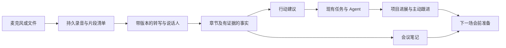

# xopc 语音与会议助手：调研及产品设计方案

日期：2026-09-15  
状态：设计提案，尚未实施。现状以本次读取的工作区代码为准。  
范围：语音输入、语音对话、会议记录、纪要、会后执行及知识复用。

后续规格：[产品 PRD](./voice-meeting-prd.md)、[技术设计](./voice-meeting-technical-design.md)。实施细节以这两份配套规格为准；本文保留调研依据与总体取舍。

## 1. 结论与产品定位

建议把语音能力发展为 **“能听懂、记清楚，并帮助推进工作的个人会议助手”**。

xopc 已有语音通话、讨论录音、近实时转写、结构化整理、项目关联和主动跟进基础。下一步最有价值的是让这些能力形成一个用户能感知的连续流程：

**会前知道要解决什么 → 会中可靠记录 → 会后看清决定与承诺 → 将行动交给任务和助手 → 下次开会知道进展。**

优先用户：一人公司经营者、项目负责人、经常参与客户沟通和项目讨论的个人。优先场景：项目例会、需求评审、客户访谈。完整视频会议系统、会议室硬件和组织级协同管理放在后续范围。

“很强”的判断标准是：60–120 分钟会议可放心记录，重要结论可核对，行动能落地，下一次使用能接上上下文。

## 2. 调研方法与可信边界

- 仓库：读取语音、讨论、笔记、Gateway、主动服务的实现与设计资料；知识图谱工具未在当前会话提供，代码发现使用文件检索回退。
- 竞品：检索产品官网、帮助中心和官方更新，主要对比钉钉、飞书、腾讯会议，补充 Teams。
- 未登录实测竞品，也未进行 xopc 真机录音、声学测试或线上服务商测试。“已有”表示代码链路存在，不代表生产体验已通过验收。
- 不采用营销页面中的准确率、节省时间等数字作为质量证据；版本、套餐和地区差异需在采购或集成时另行核实。
- 钉钉动态落地页正文提取有限，功能清单依据同一官方页面的搜索索引；不将 `qidian` 下标注 AI 生成的推广文章作为核心依据。
- 现有讨论设计文档存在旧流程：专用审核、行动转换、20 秒切片等描述不能直接视为当前实现。

## 3. 当前能力盘点

| 能力 | 当前代码中的事实 | 产品判断 |
|---|---|---|
| 听写 | 转成可编辑草稿，完成后插入，取消不发送 | 适合短输入，保留独立入口 |
| AI 语音通话 | `assistant` 使用 Agent 工具；`natural` 为无工具自然对话；同一 Chat 延续历史 | 已有个人语音助手基础 |
| 通话控制 | 静音、停止播报、取消任务各有语义；最小化和页面导航保持通话 | 可复用于会议后语音复盘 |
| 讨论录音 | 全局录音宿主、暂停、IndexedDB 草稿、分段上传和恢复 | 已有录音可靠性基础，需扩大验收范围 |
| 时长与体积 | 客户端和服务端均为 30 分钟；原音频最大 25 MiB | 不能覆盖大量常规办公会议 |
| 采集来源 | 当前讨论录音调用 `getUserMedia({audio:true})` | 麦克风路径成立；未发现此流程接入系统音频 |
| 实时转写 | PCM 按语音停顿切片，最少约 4 秒、最长约 15 秒；长句强切有短重叠 | 属于近实时片段转写，不能当作低延迟逐字字幕承诺 |
| 最终转写 | 完整成功片段可以合并；不完整时从原音频分段补转 | 已有修复路径，最终时间轴一致性仍需完善 |
| 自动纪要 | 标题、摘要、要点、决策、待办、风险、未决问题、项目候选 | 总结基础已存在，需增强证据与编辑能力 |
| 长内容分析 | 分析器截取前 120,000 字符，输出预算 3,000 tokens；决策最多 12 条、待办最多 20 条 | 存在尾部信息与密集行动项遗漏风险；不是当前每场会议都会触发 |
| 会中智能 | 当前 enrichment 主要做一次标题与项目推断 | 尚不等于持续总结、补听和会议问答 |
| 说话人 | 段落类型有 `speakerLabel`；公共 `STTResult` 没有说话人或时间轴数组，worker 主要消费 text/provider | 字段预留不等于说话人区分已打通 |
| 原文证据 | 行动类型有 `evidenceSegmentIds`；分析 schema 和规范化函数未生成、保留这条完整链路 | 尚未形成可用的结论溯源 |
| 阅读体验 | 侧栏显示摘要、决策和行动标题；音频单独播放，转写主要为整段文字 | 缺少章节、说话人导航、原文定位和行动卡片 |
| 行动落实 | 当前没有讨论专用行动项转换闭环；旧转换表已被迁移删除 | 可复用通用任务能力，但必须重新设计稳定关联 |
| 主动服务 | Gateway 发布 `discussion.completed`；有 `meeting_preparation`、`discussion_follow_up` 场景 | 是衔接点，不能视为跨会议承诺追踪已经完成 |

### 关键代码证据

- [录音限制与服务状态](../../src/discussions/service.ts)：`DISCUSSION_AUDIO_MAX_BYTES`、`DISCUSSION_MAX_DURATION_MS`、`correctSegment`。
- [录音采集与最终 Blob 组装](../../web/src/features/discussions/use-discussion-recorder.ts)：当前完整原音频仍在结束时组装。
- [语音切片](../../web/src/features/discussions/live-pcm-segmenter.ts)、[本地恢复](../../web/src/features/discussions/discussion-draft-store.ts)。
- [转写收尾](../../src/discussions/sealer.ts)、[实时处理](../../src/discussions/live-worker.ts)。
- [分析器](../../src/discussions/analyzer.ts)、[讨论数据类型](../../src/discussions/types.ts)、[STT 契约](../../src/voice/stt/types.ts)。
- [讨论阅读界面](../../web/src/features/discussions/discussion-note-sections.tsx)。
- [旧行动转换表删除](../../src/storage/sqlite/migrations/082_one_click_live_discussions.sql)。
- [完成事件](../../src/gateway/service.ts)、[场景系统](../../src/scenes/index.ts)。
- [现有语音说明](../voice.md)、[实时语音交付与真机验收边界](./voice-experience-delivery.md)。

## 4. 竞品产品设计对比

### 4.1 核心观察

| 产品 | 公开资料可确认的设计 | 值得借鉴的重点 |
|---|---|---|
| 钉钉 AI 听记 | 多来源转写、区分发言人、章节、待办、热词和纪要模板 | 将录音包装成通用办公记录入口；用场景模板降低整理成本。[产品页](https://page.dingtalk.com/wow/dingtalk/default/dingtalk/czWaaDTBTVh4XklaQFXW) |
| 飞书会议与妙记 | 会中总结，会后逐字稿、章节、发言人观点与待办；待办可转任务并回溯原文 | 让纪要进入日常协作，尤其是原文到行动的连续操作。[功能说明](https://www.feishu.cn/content/article/7577317993749269689) |
| 腾讯会议 | 会中问答、补听、关注人/关键词提醒；智能录制支持章节与时间定位 | 按“我错过了什么、刚才为何这么决定”组织交互。[AI 小助手](https://meeting.tencent.com/ai/)、[录制更新](https://meeting.tencent.com/news/lzgb20260315.html) |
| Teams Copilot | 会中/会后总结讨论、提取行动、问答；会后可用性与转录保留相关，受组织策略控制 | 明确区分临时理解、持久记录与使用权限。[帮助中心](https://support.microsoft.com/zh-cn/teams/copilot/catch-up-on-meetings-with-microsoft-365-copilot-in-teams) |

这些是产品公开能力，未进行同音源横向效果测试。未在资料中确认的能力不应标为“不支持”。

### 4.2 对 xopc 的启示

1. **总结已经是基础能力。** 差异来自总结是否可信、好查、能执行。
2. **源内容和结果需要同时可见。** 阅读纪要时能迅速核对原话，比单独展示一篇精美文章更关键。
3. **会中助手应安静。** 默认记和理解，用户主动询问才回答，重要提醒可配置。
4. **场景决定结构。** 需求评审需要决定与变更；客户访谈需要需求、异议与下一步；学习需要知识点。
5. **个人助手的机会是连续工作。** 将一次会议连接到项目、历史决定、未完成任务和下一次会前准备。

第 2 节限制仍适用：以上设计启示属于分析判断，不是竞品效果排名。

## 5. 语音产品结构

用户应能明确选择自己正在做什么，共用语音服务配置，但保留不同的行为边界。

| 用户入口 | 使用意图 | 默认输出 |
|---|---|---|
| 语音输入 | 把一句话写出来 | 编辑框草稿 |
| 与助手通话 | 讨论问题、给助手下任务 | Chat 对话、任务、交付物 |
| 记录会议 | 记录多人讨论 | 会议笔记、逐字稿、纪要和行动建议 |
| 导入录音 | 整理已经发生的沟通 | 与会议录音相同的结果页 |

会议模式默认不播报、不触发工具执行。录音中的“给客户发出去”等话语只是会议材料；用户通过“问助手”或行动按钮发出的请求才进入 Agent 执行链路。

### 信息架构

- 延续笔记作为会议资料的归属，增加“会议”筛选和会议专属详情布局；初期不新增顶级导航。
- 项目页提供“记录会议”和“本项目会议”；从项目开始时继承项目上下文。
- 首页沿用现有场景入口，呈现下一场会议准备、录音恢复、会议后待处理事项。
- 录音悬浮条全局持久，展示来源、时长、保存情况、暂停和结束。
- 导入录音进入异步队列，离开页面后可继续处理。
- 原始录音、逐字稿、AI 纪要和用户笔记各有版本与归属，避免改一段笔记就破坏源证据。

## 6. 会前、会中、会后的交互设计

### 6.1 会前：知道要谈什么

关联日历或项目后，生成简短准备卡：会议目标、上次决定、未完成承诺、相关资料、建议确认的问题。没有日历接入时，从项目与历史会议构建，不虚构参会人和议程。

开始录音仍是一键操作。会议类型、术语、参会人均为可选补充，允许开始后设置；已有的一次性录音告知流程继续复用。

### 6.2 会中：记录可靠，理解不打扰

默认悬浮条：`客户需求讨论 · 00:38:12 · 麦克风 · 已保存至 38:10`，旁边提供暂停、标记重点、结束。

展开显示两个区域：

- **逐字稿**：说话人、时间、正文；不确定片段显示待校对，实时稿标注“整理中”。
- **当前重点**：已讨论议题、暂定结论、未决问题。只在话题变化或累积足够内容时更新，不每句话刷屏。

“问助手”提供快捷问题：“刚才 5 分钟说了什么”“有哪些不同意见”“还有什么没确认”。答案只依据已处理部分，显示“已理解至 38:10”。默认以文字呈现，播放需要用户主动选择。

标记重点保存媒体时间，可附短备注。暂停期间不采集，不用静音伪装暂停。网络中断显示“本地录音中，待上传”；录音故障必须立即告知，不能仅显示转写失败。

### 6.3 会后：先给结果，再深入阅读

结束后立即打开会议页。已保存录音与处理状态先可见，章节和纪要逐步补齐；最终校验完成前标注“初稿”。

首屏建议顺序：

1. 一句话结论与三至五条关键变化。
2. 已决定事项、仍有争议事项。
3. 行动项：内容、负责人、期限、原文链接、任务状态。
4. 章节摘要。
5. 完整逐字稿与录音回放。

用户可以更名、修正说话人、纠正转写、编辑纪要、切换模板。重新生成前说明影响区域；用户手写笔记和已确认行动不能被静默覆盖。

### 6.4 行动落实

行动卡支持“加入我的任务”“交给助手”“忽略”。

- 加入我的任务：用户可一次勾选多条，缺失日期不阻止创建，显示“未设期限”；重复点击返回同一任务。
- 交给助手：带入会议证据、项目背景、期望交付物与执行范围；依照现有权限执行，不把所有操作都增加一轮确认。
- 涉及他人的承诺：先作为记录或跟进项；说话人姓名不是任务系统账户，也不意味着授权对外分配。
- 对外发送：生成可编辑草稿，沿用现有连接器的授权边界；会议本身不授予发送权限。
- 主动跟进：用户委托后纳入已有场景；只在到期、阻塞、结论变化或需要用户行动时返回，避免每日重复催促。

## 7. 纪要的数据与质量设计

### 7.1 每条事实都有证据

决策、行动、风险和问答答案统一关联 `evidence[]`：会议 ID、转写修订号、片段 ID、原音频时间范围。点击可高亮原文并定位播放。

证据至少按句或发言段定位；低精度结果可以定位整段，但不能伪造词级时间。原音频删除后仍可查看有权限的转写，并清晰提示不能回放。

严格区分：

- 已决定：明确形成结论。
- 提议：有人提出，未确认。
- 行动承诺：明确有下一步；执行人、日期允许为空。
- AI 建议：由助手提出，与会议原话分开展示。
- 冲突：同一事项存在矛盾；后续明确推翻前案时保留变更关系。

“周五”保存原话和解析结果，结合会议日期、时区解释；不能明确时留待确认。“我来做”在说话人身份未明确时不自动填当前用户。

### 7.2 长会议完整处理

替换字符截断为分层处理：语音片段 → 连贯话题 → 分段事实与证据 → 全局合并与冲突校验 → 纪要。

每层记录覆盖区间；章节覆盖整场有效录音，不能只总结前半场。输出过长时分页或分章节展开，不能用固定 20 条行动上限静默丢弃内容。

先提取证据再生成表述。生成后检查引用存在、角色一致、日期来源、决定与提议是否混淆。没有引用支撑的内容降级为建议或移除。

### 7.3 说话人与转写校正

- 第一阶段显示“说话人 A/B”，支持手动更名、合并和拆分。
- 自动区分说话人需要专门的服务商能力或本地模块；普通 STT 和多人分离分开协商。
- 不默认建立跨会议声纹身份。跨会议人名映射先用用户确认与日历上下文。
- 混说、重叠发言、噪声造成的不确定内容明确标出，避免自信归因。
- 终稿产生新修订；历史引用保持可追溯，新摘要绑定新修订。人工校正优先，系统修复不得覆盖。

### 7.4 模板

首版仅提供通用会议、项目例会、需求评审、客户访谈四种模板；默认自动推荐，可一键切换。之后增加面试、学习和自定义模板。

模板改变摘要重点，不改变底层事实和逐字稿。图文摘要、思维导图、音频简报均是同一事实集的派生视图，放在基础质量之后。

## 8. 技术落点与演进原则

### 8.1 复用现有领域

保留 `discussionId` 为会议记录主标识，`noteId` 为笔记归属；不再引入第二套独立会议主记录。Chat 用于与助手交流，Task 用于执行，Project 用于组织，Scene 用于委托后的跟进。

### 8.2 需要补齐的契约

| 对象 | 核心新增内容 |
|---|---|
| Recording manifest | 音轨、分块哈希、编码、采样率、媒体起止时间、上传确认、缺口 |
| Transcript revision | segment/utterance ID、speaker ID、源时间轴、raw/display text、校正记录、质量信息 |
| Meeting insight | 稳定 ID、事实类别、内容、证据、生成修订、用户修改、被替代关系 |
| Action conversion | 稳定行动 ID、目标 task ID、幂等键、转化状态；重生成时可对账 |
| Source links | 项目、日历事件、参会人映射、附件来源及可用权限 |

拓展现有 STT/媒体理解契约，使时间轴、语言、说话人和能力声明贯穿 provider → worker → repository → API → UI。服务商不支持时明确降级为纯文本，不生成虚假的说话人或置信度。

模型配置复用现有模型意图体系，为整理/校验选择合适意图，避免新增一套平行模型注册表。具体服务商先用同一会议样本评测后决定。

### 8.3 长录音与来源

不能只把 30 分钟常量改大。需要同步处理分块上传、客户端磁盘配额、服务端附件限额、最终组装内存、媒体解码、租约续期、超时和取消。

- P0：麦克风和文件导入；目标覆盖两小时，录制中持续上传并确认持久状态，崩溃后恢复已保存片段。
- P1：桌面系统音频与麦克风，分别保留音轨和时间映射，处理回声及重复收音。浏览器依据实际平台能力提供标签页/共享音频，能力不足时提供明确导入路径。
- P2：移动端后台录音和平台会议资料导入。移动浏览器不作为长会议后台录音保证，需原生能力与真机验收。

系统音频采集与会议平台 API 均需技术验证；日历中存在会议链接不代表 xopc 已能加入或获取会议音频。

上传分块不等同于可独立解码的音频文件。保留容器头或执行增量封装；避免直接把 MediaRecorder 任意 timeslice 当成独立文件转写。

### 8.4 状态与恢复

沿用当前 `recording → stopping → sealing → organizing → completed` 主流程，增加明确阶段进度和失败区间；失败进入可恢复的 `needs_attention`。暂停属于采集状态。

区分“录音已保存”“转写完整”“纪要已生成”。部分成功时可阅读现有结果，但不能标为全量完成。重试从失败阶段开始，取消不删除已保存录音。

最终补转写必须输出映射到原音频的段落，而不只是覆盖一个字符串。媒体时间与墙钟时间分开，暂停、恢复、多音轨都不能让证据播放错位。

### 8.5 成本与数据控制

- 分别展示录音存储、STT 时长、整理与问答用量；提供预算上限和处理范围。
- 实时转写和最终转写按质量需要选择，避免默认整场重复付费。会中摘要节流、已完成段落缓存。
- “本地处理”必须涵盖 STT、摘要和问答全链路；仅本地存储或本地 STT 不可宣传为音频内容不出设备。
- 展示来源、采集状态、云处理选择、保留期限；已有用户选择持续生效。
- 删除原录音同时清理临时分块；删除会议处理派生索引与引用失效。已独立创建任务的去留明确展示，不悄悄删除。
- 会议内容作为不可信材料输入；包括录音中的指令和导入转写中的提示词，都不能修改系统权限或自动执行工具。
- 分享及跨会议检索继承实际权限；“只分享摘要”不得顺带暴露逐字稿、音频和私人备注。

### 8.6 工程位置

- 采集与详情：`web/src/features/discussions/`、`web/src/features/notes/`。
- 管线与事实：`src/discussions/`；提供明确模块边界，避免继续扩成单一 service。
- 音频契约：`src/voice/stt/`、`src/media-understanding/`、扩展 speech contracts。
- 持久化：现有 SQLite 迁移与附件设施，建立新修订和转换关联；真实用户数据使用向前迁移，不沿用旧开发期删表方式。
- 任务与跟进：复用既有 Task、ObjectLink、Scene 服务，防止产生第二套待办状态。
- API：优先扩展现有 discussion 资源，新增或修改鉴权路由时同步 lazy-bundle matcher、映射测试及真实鉴权 Gateway 验证。

## 9. 分阶段交付

| 阶段 | 用户可获得的完整体验 | 依赖与退出条件 |
|---|---|---|
| P0：可信会议纪要 | 两小时麦克风录音/导入、可恢复处理、章节、说话人标签与校正、带证据的决策和行动、原文回放、四种模板、选择行动加入任务 | 分块持久化、STT 能力评测、版本化证据；长录音不遗漏，转换不重复 |
| P1：会中助手 | 实时重点、补听问答、重点标记、桌面系统音频、会议后语音复盘 | P0 时间轴与事实质量稳定；双音轨采集验收；助手不误执行环境发言 |
| P2：连续工作 | 会前准备、跨会议决定变更、未完成承诺、项目回顾、移动端后台录音、授权的平台资料导入 | 稳定身份和来源关系、权限过滤、用户委托规则；与已有主动服务融合 |
| P3：表达与扩展 | 图文纪要、思维导图、多语言阅读、可播放简报、自定义模板、团队共享能力 | 基础质量达标；由使用数据确定优先级 |

建议 P0 内部分三段交付：先长录音与统一导入，再做证据/说话人/章节，最后做会议详情和任务转换。每段都有可验收结果；只有全链路通过才对外称为会议助手首版。

本方案不承诺日历工期。完成服务商样本评测和桌面采集验证后，再依据人员、设备覆盖和并发需求拆分估时。桌面系统音频原型可在 P0 期间先验证，以提前暴露平台风险。

## 10. 验收与衡量

以下数字是提议的验收目标，不是现有性能或竞品实测。先采集基线，再确定发布阈值。

### 必须通过的行为测试

- 30/60/120 分钟录音，会议最后一分钟的决策与待办仍被提取。
- 断网十分钟、Gateway 重启、页面崩溃、磁盘不足：无静默丢失；已确认持久化部分可恢复；缺失区间明确。
- 一次会议多次暂停/恢复，点击尾部证据能播放对应原话。
- “可能”“再考虑”“取消前面方案”不会被错误写为有效决定。
- 同音姓名、未知负责人、相对日期不被随意补全。
- 修正逐字稿再生成摘要，旧引用仍可追溯，手写笔记保留。
- 重试和重生成不重复建任务；删除音频后所有临时音频清理，文字结果仍按策略可用。
- 会议录音中的工具指令不触发 Agent；显式委托仍能正常执行。
- 外放、耳机、蓝牙、多人重叠发言分别验收；系统音频需额外验证远端声音确实被采到。

### 样本与质量目标

先准备约 30 场获准使用的真实/模拟会议，覆盖项目例会、评审、客户访谈、中英混说、噪声和否定修正；保留未参与调优的验收集。人工标注重要决定、行动、负责人和时间证据。

| 指标 | 建议初始门槛或统计方式 |
|---|---|
| 已确认持久数据恢复 | 故障注入用例 100% 可恢复；未保存区域必须可识别 |
| 重要决策/行动召回 | 人工标注验收集 ≥90%，同时报告误提取率 |
| 决策/行动精确率 | 验收集 ≥95%，不能以少提取换取表面准确 |
| 引用正确率 | ≥95%，人工确认原文确实支持结论 |
| 负责人/期限 | 单独统计错误补全率；核心否定、未知身份用例必须无错误赋值 |
| 说话人与文本 | 分别统计说话人错误和转写错误，按声学环境分组，不能仅给总体平均 |
| 处理延迟 | 按设备、服务商与会议长度报告 P50/P95；云处理首个片段目标 ≤20 秒，完整实时稿的会后纪要目标 ≤2 分钟 |
| 纯文件导入 | 独立报告处理耗时/录音时长，不承诺与实时录音相同等待时间 |
| 用户价值 | 纪要修正耗时、行动转任务率、委托交付完成率、下次会议复用率 |
| 成本 | 每小时会议总成本，分列 STT、LLM、存储；记录重试和重复转写开销 |

小样本门槛只能作为首轮发布依据，不能直接外推为总体准确率。应保留失败分类与置信范围，持续扩展样本。

## 11. 首版具体使用故事

用户从项目页点“记录会议”，开了 75 分钟客户讨论。网络中断时继续本地保存，恢复后补传。结束后自动得到会议笔记：

- 决定先交付报表导出，审批流延后，每条可回听。
- 一个“下周看看”保留在未决问题，不写成承诺。
- 两项本人待办，一项客户待确认事项。
- 用户勾选本人待办加入任务，并将“整理接口方案”交给助手。
- 助手带着会议证据产出方案草稿；需要发客户时走已有发送授权。
- 下次讨论前，准备卡显示“报表方案已完成，客户尚未确认字段”。

这条使用故事完整通过，才体现语音能力从输入工具变成持续工作的助手。

## 12. 评审重点

建议按上述默认方向推进设计评审，首先确认三项取舍：

1. 首版目标用户和优先会议类型是否成立；否则调整模板和样本。
2. 首版是否必须同步交付桌面系统音频；若必须，将其提前到 P0 并相应缩减模板扩展。
3. 本地全链路处理是否为发布硬要求；若是，需要单独的设备性能预算和模型验收线。

当前建议：个人办公优先，可信纪要与任务闭环优先，系统音频提前验证、随后交付。本轮只形成调研与设计，不修改运行时代码。
