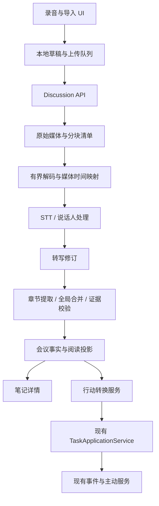

# 语音与会议助手技术设计

日期：2026-09-15  
状态：P0 工程主体已实施；目标契约与实际简化方案、验证结果及未实现项见 [实施与自查](./voice-meeting-implementation-review.md)。  
产品规格：[PRD](./voice-meeting-prd.md)  
研究依据：[调研与总体方案](./voice-meeting-research-and-proposal.md)

## 1. 架构决策

| 决策 | 方案 | 原因 |
|---|---|---|
| 主记录 | 扩展 Discussion，以 `discussionId` 唯一定位，继续关联 `noteId` | 保持已有资料归属与链接 |
| 录音保存 | 原始编码流分块落盘，manifest 描述顺序、哈希和采集区间 | 避免结束时整场 Blob/Buffer 峰值 |
| 实时与最终理解 | 同一时间轴，临时转写与发布修订分离 | 修复和校正不破坏历史引用 |
| 会议事实 | 稳定事实 ID + 不可变版本 + 独立证据 | 支持重生成、变更比较和行动对账 |
| 用户文字 | Note 用户内容独立于会议投影 | 防止 AI 覆盖手写笔记 |
| 执行 | 复用 TaskApplicationService 和已有任务命令 | 任务创建、权限、运行与事件统一 |
| 主动服务 | 复用现有委托场景及事件机制 | 避免会议专用调度器 |
| 推送 | 持久状态优先，事件用于失效刷新 | 断线不丢业务状态 |
| 摘要模型 | 使用既有模型意图和服务配置 | 不新增平行模型注册表 |

## 2. 实施前基线（调研时）

- 录音上限位于 `src/discussions/service.ts` 与 `web/src/features/discussions/use-discussion-recorder.ts`，现为 30 分钟。
- 上传路由使用 `File.arrayBuffer()`，不能靠提高体积限制直接支持长录音。
- `src/media-understanding/types.ts` 的 `AudioTranscriptionResult` 与 `src/voice/stt/types.ts` 的 `STTResult` 目前主要返回文本，需贯穿扩展时间轴和说话人结果。
- 分析器存在字符截断和固定输出条数，需替换为按覆盖范围推进的分层处理。
- 当前讨论路由在 `src/gateway/hono/routes/index.ts` 直接注册，不应误报为已在 lazy-bundles 中。目标调整为独立 lazy bundle，并在同次改动移除直接注册。
- `src/gateway/security/gateway-scopes.ts` 没有讨论专用匹配，当前落入默认管理权限；目标需显式设计读写和任务转换的组合授权。
- 现有 TaskCreateRequest 已含幂等键、contract、context、activation；不能只向 tasks 表插入标题。

## 3. 模块边界



建议新增模块均置于 `src/discussions/`：`recordingManifest.ts`、`recordingUpload.ts`、`transcriptRevision.ts`、`evidence.ts`、`insightPipeline.ts`、`actionConversion.ts`、`export.ts`。已有 service 负责应用编排，repository 拆分按领域职责组织。

前端继续使用 `features/discussions/` 和 `features/notes/`；新增录音状态投影、会议概览、逐字稿编辑器、证据抽屉、行动列表。共享请求/响应 schema 建议放 `packages/gateway-contract/src/discussions.ts`，消除手工维护前后端重复类型。

## 4. 标识、时间与数据不变量

### 4.1 标识

- `discussionId`：一次会议记录。
- `recordingId`：一份原始录音；不同导入副本可属于不同会议。
- `captureEpoch`：一次连续采集区间，恢复麦克风或设备变更后递增。
- `trackId`：麦克风/系统声音等音轨。
- `chunkSequence`：同一 recording/epoch/track 内单调序号。
- `transcriptRevision`：发布后不可变；编辑和重新转写生成后继修订。
- `utteranceId`：发言段标识，修订间保留 lineage；拆分/合并记录前驱关系。
- `insightId`：稳定事实或行动标识，服务端分配；标题变化不换 ID。
- `organizationRevision`：一组章节与事实版本的发布快照。

### 4.2 时间轴

源时钟以音频采样计数为准，统一投影为毫秒。墙钟仅记录会议发生时间、时区和采集区间，用于展示与日期解析。

`mediaStartMs/mediaEndMs` 是回放坐标；暂停不计入有效录音，恢复片段按 manifest 连接。`wallStartedAt/wallEndedAt` 保留真实时间间隔。数据缺失用 gap 标记，不能假装是静音。

证据一律引用原始回放坐标。STT 分段或重采样必须保存 offset；说话人合并不修改时间；P1 多音轨经同步映射后再做共同回放坐标。

### 4.3 必须始终成立

1. 上传成功只在媒体落盘和 metadata 提交后返回。
2. 相同分块标识 + 相同哈希可重复；不同哈希返回冲突。
3. 任何已发布结论都绑定确定的输入修订和证据。
4. 重新生成不能静默修改用户确认字段或已创建任务。
5. 同一行动只能存在一个当前转换目标；任务删除后保留 tombstone 防止旧请求重建。
6. 删除/取消后的异步回调不可复活数据。
7. 所有有意义的语音区间都被处理或明确标为缺失/失败；不能静默截断。

## 5. 持久化设计

下列为逻辑表；实现时检查当前最新迁移并分配编号，禁止在本设计固定迁移序号。

| 表/实体 | 主要字段与约束 |
|---|---|
| discussion_captures 扩展 | `capture_kind: microphone/import`、client source、时区、template、agentId、dataRevision、已发布修订、处理完整性、删除 generation |
| discussion_recordings | recordingId、discussionId、编码、总有效时长、总字节、manifestHash、sealedAt、retention、状态 |
| discussion_recording_chunks | recording/epoch/track/sequence 唯一；hash、bytes、时间、存储相对键、是否初始化片段、落盘状态 |
| discussion_recording_intervals | epoch、媒体范围、墙钟范围、暂停/缺失信息、时钟映射 |
| discussion_transcript_revisions | discussion/revision 唯一；parent、来源、输入 hash、状态、质量与覆盖信息 |
| discussion_utterance_versions | revision/utteranceId 唯一；文字、speakerId、媒体范围、前驱 ID、用户校正标记 |
| discussion_speakers | discussion/speakerId 唯一；显示名、用户确认、合并关系；不存跨会议声纹 |
| discussion_insights / versions | 稳定 insightId；版本、类别、正文、结构化行动字段、用户编辑、来源 organizationRevision |
| discussion_evidence | insightVersion、transcriptRevision、utteranceId、起止范围；逻辑外键验证属于同一会议 |
| discussion_chapters | organizationRevision、标题、顺序、时间范围、insightVersion 列表 |
| discussion_action_conversions | discussionId/insightId 唯一；taskId、请求 hash、冻结任务请求、状态、删除 tombstone |
| discussion_processing_jobs | stage、输入 hash、lease owner/expiry、attempt、重试时间、generation、checkpoint、错误码 |

原始音频在现有附件根下按不透明存储键落盘，数据库存清单；不把所有原始大块塞入 SQLite BLOB。会后可生成标准可播放附件，沿用 Notes 附件生命周期，确保删除清理两个层次。

转写修订初期采用不可变完整逻辑快照；可以复用相同 utterance 内容记录减少复制，但 API 看见的是完整修订。草稿转写逐步变动，不向外冒充终稿。

文字搜索为衍生索引：只索引有权访问且未删除的当前发布修订，更新/删除触发失效。首次实现先用 SQLite FTS 能力，不以向量数据库作为前置依赖。

## 6. 采集与分块上传

### 6.1 双路径

1. **原始录音路径**：MediaRecorder 编码字节持续写本地草稿，同时按有界块上传。任意 timeslice 可能不是独立可解码文件，因此 manifest 记录初始化片段与严格拼接顺序。
2. **实时理解路径**：继续使用 AudioWorklet 生成自包含 WAV，按语音停顿分段。其失败不停止原始录音。

服务端按 epoch 重建连续编码流，有界解码后规范化；新 epoch 不能把两个独立容器直接无条件字节拼接。避免将整个文件读入 Buffer；解码进程使用参数数组、固定输出目录及受限资源。

### 6.2 默认资源预算（目标值，需基准验证）

| 项目 | 初始值 |
|---|---|
| 有效录音时长 | 120 分钟 |
| 单导入文件 | 1 GiB，服务端探测后再次验证时长 |
| 单上传块 | 最多 8 MiB 原始字节；采用二进制请求体 |
| 客户端上传并发 | 2；内存只保留当前与待发送小队列 |
| 磁盘缓冲 | 先写持久存储，再上传；磁盘不足显式停止 |
| 解码/STT 单元 | 默认 ≤30 秒、保留语音边界与 offset |
| 实时理解优先级 | 高于离线导入；本地模型初始并发 1 |
| 重试 | 单阶段指数退避并设上限；连续失败转 needs_attention |

媒体服务应按流限制字节数，Gateway body limit 同步新增路径。1 GiB 是产品最大值，设备配额不足时在开始/导入前明确限制，不能承诺每个浏览器都可缓存此大小。

### 6.3 上传提交

写临时文件 → 校验 bytes/hash → 持久化并原子改名 → SQLite 提交 manifest 行 → 返回确认。

崩溃产生的未登记文件由清理任务回收；数据库已登记但文件丢失须检测并转失败，不能返回已保存。客户端收到确认后可清理对应本地块；不得按“请求已发出”清理。

录音结束提交最终 manifest 哈希及每个音轨的最后序号。服务端检查缺块、重复、时间范围、实际媒体时长；缺块保留 stopping 状态并返回待补序号，上传超时后转 needs_attention。

导入也走此路径，重试使用原导入 ID。检测相同 hash 的现有记录只用于用户提示；用户明确创建副本时不自动合并。

## 7. STT、说话人与修订

在 `AudioTranscriptionResult → MediaUnderstandingOutput → STTResult` 全链路透传结构化结果，不能只在最外层加字段。

```ts
type TimedUtterance = {
  localId: string;
  startMs: number; // Relative to this decoded input unit.
  endMs: number;
  text: string;
  speakerLocalId?: string;
  confidence?: number;
};

type TranscriptionCapabilities = {
  timestamps: 'none' | 'segment' | 'word';
  diarization: 'none' | 'batch' | 'streaming';
  speakerScope: 'request' | 'recording';
  processingLocation: 'local' | 'remote';
};
```

未知能力按不支持处理。请求内 speaker A 不能直接映射到下一请求的 speaker A；跨片段需整场分离、已验收的对齐算法或人工确认。无法确定时保持分离，不能靠名字碰巧相同合并。

以录音级 speaker timeline 与文字时间轴对齐。异步批处理型提供商由持久 job 保存 provider jobId 并恢复轮询；外部提交不明确成功时先查询状态，避免重复计费。

仅返回纯文本的提供商，以整个输入单元作为粗粒度证据范围，标记 `precision=segment`、speaker unknown；不人工均分时长伪造逐词时间。

实时稿作为 draft。收尾检查覆盖与质量，对需要补转的区间处理；生成不可变终稿，再发布摘要。人工更正创建后继修订；background job 依据旧修订生成时不能自动覆盖新的用户修订。

## 8. 长会议理解管线

阶段：`coverage_check → topic_partition → extract → reconcile → validate → publish`。

1. 检查各采集区间覆盖，区分静音、遗漏与转写失败。
2. 根据语义、时间与模型上下文预算划分话题块；保留小范围上下文重叠。
3. 每块输出事实、行动候选与 utterance 引用；模型不决定稳定业务 ID。
4. 跨块合并重复项、识别否定和撤销，保留“提议 → 决定 → 被替代”关系。
5. 验证引用存在、范围有效、属于输入修订，检查负责人/日期来源；不支持的表述降级或删除。
6. 全部输入块有完成记录后发布。存在缺口可发布明确标注的部分结果，但 `completeness != complete`。

块划分按实际模型上下文预算控制；长文本继续分块，不能 `slice` 截掉尾部。输出超预算分章节分页，不固定截断前 N 个行动。

使用既有 `understanding` 意图提取、`review` 意图核对，配置缺失按既有 selector 规则退回当前 Agent 模型。固定输入 modelRef/config hash，防止处理中配置变化导致不可解释的混合结果。

模型结果是候选数据，通过 Zod 校验后才能写入；引用是确定性验证，语义是否被原话支持仍需抽样评估，不能声称 schema 校验保证事实真实。

## 9. 事实与证据契约

```ts
type MeetingEvidence = {
  transcriptRevision: number;
  utteranceId: string;
  startMs: number;
  endMs: number;
  precision: 'segment' | 'word';
};

type MeetingInsightVersion = {
  insightId: string;
  version: number;
  kind: 'decision' | 'proposal' | 'action' | 'risk' | 'question';
  text: string;
  evidence: MeetingEvidence[];
  origin: 'transcript' | 'user';
  ownerText?: string;
  confirmedOwnerId?: string;
  dueText?: string;
  dueAt?: number;
  supersedesInsightId?: string;
};
```

AI 建议单独集合，不能用没有证据的 suggestion 冒充来自转写的 insight。用户新增行动允许无录音证据，但明确来源为 user。

稳定 ID 对账优先利用 utterance lineage 与事实类型；标题 hash 不作为行动身份。模糊匹配只生成候选关联，需要比较后确认，不自动合并两个相似承诺。

同一输入 hash、模板版本、模型配置、pipeline 版本的处理可复用已完成结果。用户要求重新生成时产生新作业和修订，但转换目标沿用稳定 insightId。

## 10. API 契约

所有路径均需鉴权；本节为目标接口。已有 `POST /:id/stop` 保留其名称，不新增同义 `/finish`。

| 方法与路径 | 输入/输出及语义 |
|---|---|
| POST /api/discussions | clientRequestId、source、captureKind、contextProjectId、timezone、consentPolicyVersion；返回 discussionId/noteId/recordingId |
| GET /api/discussions | 分页、状态、项目、日期、query；返回列表投影 |
| GET /api/discussions/:id | 状态、保存/理解进度、发布修订、质量、能力和链接；不内嵌整场文本 |
| GET /api/discussions/by-note/:noteId | 沿用笔记定位 |
| PUT /api/discussions/:id/recordings/:recordingId/chunks/:chunkId | 二进制 body；header/预登记 metadata 携带 hash、epoch、track、sequence；幂等落盘 |
| GET /api/discussions/:id/recordings/:recordingId/manifest | 已确认块、缺块、修订；可分页恢复 |
| POST /api/discussions/:id/stop | requestId、expectedRevision、finalManifestHash、最后序号；接收后异步收尾，返回 202 |
| GET /api/discussions/:id/transcript | revision、cursor、speakerId、query；返回片段和下一游标 |
| PATCH /api/discussions/:id/utterances/:utteranceId | baseRevision、text/speakerId、requestId；创建后继修订 |
| PATCH /api/discussions/:id/speakers/:speakerId | expectedRevision、displayName 或 mergeInto；返回影响范围与新修订 |
| GET /api/discussions/:id/organizations/:revision | 章节、事实版本、证据摘要；支持分页 |
| POST /api/discussions/:id/organize | requestId、baseTranscriptRevision、template、expectedRevision；返回 jobId |
| PATCH /api/discussions/:id/insights/:insightId | expectedVersion、用户更正字段；不更新已转换任务 |
| POST /api/discussions/:id/actions/:insightId/convert | requestId、expectedInsightVersion、任务字段；返回 taskId、existing 标记 |
| GET /api/discussions/:id/audio | 鉴权媒体流，支持 Range；不能返回本地文件路径 |
| GET /api/discussions/:id/export | format、revision、includeSpeakers、includePrivateNotes；权限与数据范围校验 |
| POST /api/discussions/:id/retry | requestId、failedStage、expectedRevision；从 checkpoint 恢复 |
| POST /api/discussions/:id/cancel | 取消处理/采集会话并保留原始材料，generation 递增 |
| DELETE /api/discussions/:id/audio | 立即撤销读取并启动幂等物理清理 |

新分块上传上线并完成客户端切换后移除整场 `/recording` 上传入口；实时 WAV `/segments/:sequence` 仍用于实时理解，其身份不作为终稿证据身份。旧 segment 校正入口迁移为 utterance 校正后删除，避免双重可编辑来源。

通用错误：400 输入错误，401 未认证，403 无权限，404 不存在/不可见，409 修订或幂等冲突，413 超限，415 编码不支持，422 媒体或 manifest 无效，429 资源/频率限制。可恢复错误提供 code、stage、retryable、missingChunks；不暴露内部路径和凭据。

P1 新增问答、标记和实时摘要接口；问答为只读，不能挂载执行工具。需要执行的请求走现有任务接口。

### 10.1 关键请求示例

创建请求的 clientRequestId 在本地录音开始前生成，重复提交相同参数返回同一资源，参数不同返回 409：

```json
{
  "clientRequestId": "local-draft-uuid",
  "source": "web",
  "captureKind": "microphone",
  "contextProjectId": "project-id",
  "timezone": "Asia/Shanghai",
  "consentPolicyVersion": 1
}
```

分块请求采用 `Content-Type: application/octet-stream`。`X-Xopc-Chunk-Metadata` 为最多 4 KiB 的 ASCII JSON header，字段为 epoch、trackId、sequence、sha256、bytes、mediaStartMs、mediaEndMs、initialization；trackId/chunkId 只能使用受限标识字符。服务端验证 metadata 后仍按流实际计数和计算哈希，不信任 Content-Length 或客户端时间。

初始化片段允许零媒体时长；数据片段必须具有合法范围。上传端录制设备无法精确提供分块媒体时间时，先记录采样估计，服务端解码后给出规范映射；不得用未校验估计时间发布词级证据。

结束请求：

```json
{
  "requestId": "stop-request-uuid",
  "expectedRevision": 7,
  "recordingId": "recording-id",
  "finalManifestHash": "sha256-of-canonical-manifest",
  "tracks": [
    { "epoch": 0, "trackId": "microphone", "lastSequence": 89 }
  ]
}
```

manifest 哈希由共享契约中的确定性序列化生成：固定字段顺序，按 epoch/track/sequence 排序，排除存储路径与上传时间；客户端和服务端使用同一测试向量。含未上传块时先记录终止清单，补齐后验证哈希再进入 sealing。

`expectedRevision` 检查会议配置与生命周期的 `dataRevision`；分块确认和转写进度使用各自 revision，不应导致正常结束请求因持续转写而不断冲突。同一 requestId 的已接受结束请求优先返回原结果，不再用旧 expectedRevision 拒绝重试。

行动转换请求：

```json
{
  "requestId": "conversion-request-uuid",
  "expectedInsightVersion": 2,
  "title": "整理报表导出接口方案",
  "priority": "normal"
}
```

省略 owner/date 时不自动补造。服务端按行动事实组装 Task contract：objective 使用行动内容，交付物与 acceptanceCriteria 只采用已明确内容；未具备执行条件时先 capture，启动前按已有任务规则补齐。返回 `{ "taskId": "…", "existing": false }`，重试返回同一 taskId。会后委托执行走独立任务命令，不更改转换语义。

## 11. 状态、事件与后台任务

### 11.1 状态分离

- 主生命周期继续 `recording → stopping → sealing → organizing → completed`，失败为 needs_attention，取消为 cancelled。
- captureState：active/paused/stopped/interrupted；导入从创建到停止提交期间也是可写采集资源，但 UI 显示“导入中”。
- completeness：complete/partial/unknown；completed 不等于数据完整。
- 修改已完成会议不回退主生命周期；新整理 job 独立进行，成功后原子切换发布修订。

每个 job 记录 generation 和输入修订。worker 续租；lease 过期可被接管。写结果用 owner + generation + input hash 比较并交换，旧 worker 结果不得覆盖新状态。

### 11.2 推送

事件统一携带 discussionId、eventId、dataRevision、相关资源 ID、状态和有限进度，不携带完整转写。沿用 `discussion.updated`、`discussion.completed` 名称；新增 transcript/organization invalidation 事件时前后端同步切换。

客户端忽略旧 revision，断线重连 GET 拉取当前状态。多设备播放进度属于客户端偏好，不进入业务转写修订。

发布纪要与完成 outbox 同事务提交。事件消费者按 eventId 去重；重生成发布“纪要更新”，不重复冒充第一次会议完成并触发重复跟进。

## 12. 行动转任务的一致性

1. 检查会议读取/修改权限及 tasks.write；验证 insight 当前版本。
2. 冻结 TaskCreateRequest，填入 contract、明确上下文与 `activation: capture`；不从录音推断 authorityGrants。
3. 使用 `discussion-action:<discussionId>:<insightId>` 作为逻辑幂等键，保存请求 hash 和冻结输入。
4. 在同 SQLite 写事务中建立转换关联并调用可组合事务的 TaskApplicationService；若现有事务层不支持安全嵌套，提取其同事务内部入口，禁止裸写 Task 表。
5. 事务提交后由既有 outbox 驱动副作用。超时重试返回已存 taskId，不按当前新标题重建不同请求。
6. 启动执行使用已有 Task 命令与独立幂等键，不能通过更换 create.activation 再创建一遍。

同 insight 不同字段的重复转换请求返回 409；用户若要改任务，显式使用任务修改。任务删除后保留转换 tombstone，点击“重新创建”需新的用户操作和明确替换关联。

任务 context 使用现有 source/document edge 承载会议及指定证据；读取时重新验证权限。任务 body 可包含用户选择的必要摘要，并标明它是复制内容。删除会议后移除可检索源与失效链接；已独立保存的任务摘要遵循任务生命周期，删除 UI 必须说明这一点。

## 13. 权限、保留与清理

- 将 discussions 和 discussion-capture settings 显式映射为 workspace.read/write；转换接口额外验证 tasks.write。单一 requiredScope 返回值不足时在路由层补组合检查。
- 对象归属必须在查询和导出中校验，不能仅判断 token 有通用 scope。
- 音频、转写、私人笔记、任务上下文分别检查可见范围；P0 不新增公开分享面。
- 云处理服务变化不得扩大原有授权；配置选择、模型输入来源与处理位置可诊断。
- 删除音频先标记 tombstone/generation、取消相关 job、拒绝新读取和上传，再清理原块、解码临时文件、标准附件、本地草稿同步状态；失败进入重试清理队列。
- 删除整场会议通过现有 Note 生命周期协调关联删除，派生索引和缓存同步失效，独立 Task 不级联误删。
- 日志只记录 IDs、状态、耗时、大小、provider、bounded error；不记录录音、逐字稿或完整 prompt。

## 14. 路由与迁移方案

### 路由

新增 `discussions` lazy bundle，严格匹配 `/api/discussions`、`/api/discussions/…`、`/api/discussion-capture/settings`。同次删除 routes/index 的 eager 注册，避免同一路由双挂载。

测试正例包括静态 `metrics`、`by-note`、各深层分块路径及参数路径；负例包括 `/api/discussions-other`、`/api/notes/:id`、`/api/voice`。body limit、rate limit、scope matcher 同步更新，并通过真实鉴权 Gateway 请求验证。

### 数据

1. 新增表和字段，保留已存在录音、noteId 和链接。
2. 将旧 canonical transcript 建为 revision 1；只有整段文本则标记粗粒度/无时间证据，不能生成虚假逐字时间。
3. 旧 organization 通过一次性迁移转换为事实对象，无引用项显示“历史纪要，暂无定位”；用户可选择有原音频时重新整理。
4. 前后端原子切换到新投影；历史数据通过一次性迁移读取，不保留两套可写业务分支。
5. 离线草稿带本地 schemaVersion；升级时迁移可恢复草稿，未知版本保留可导出原文件，禁止升级时清空录音。
6. 移除旧整场上传与旧校正入口，运行静态搜索确认没有仍在调用的客户端。

迁移前备份，迁移失败可恢复备份。新版本写入后不能直接让旧二进制读新 schema；需要回滚时停止服务并恢复对应备份，避免伪装支持无损降级。

## 15. P1/P2 扩展点

- 系统音频：Electron 原生/平台采集适配器输出同一 track/epoch 契约；与麦克风分别保存、做时钟同步，验证回声去重。平台 API 选型通过专门技术验证决定。
- 会中理解：消费稳定 draft 高水位，增量提取，固定节流和成本预算；显示理解截止位置。
- 会议问答：按权限检索指定修订，返回证据；检索缺失不能断言未发生。
- 语音复盘：使用现有 assistant 通话，把会议作为显式 Task/Chat 上下文，不把整场文本塞进实时语音指令窗口。
- 跨会议：事实之间建立明确 supersedes/follows-up 关系，模糊相似只建议关联；复用当前主动服务委托 API，不新增永久轮询。
- 原生后台：适配相同持久分块契约，独立验证锁屏、来电、路由切换、耗电和恢复。

## 16. 测试与发布门槛

| 测试层 | 关键用例 |
|---|---|
| 单元 | 时间映射、暂停、重叠去重、manifest 完整性、引用校验、相对日期、稳定 ID |
| SQLite | 迁移保留、事务回滚、lease 接管、删除 generation、任务并发幂等、outbox 重投 |
| API | 真鉴权 Gateway、lazy 路由、scope 组合、超限流、非法编码、Range、409 |
| 前端 | 路由切换、麦克风互斥、IDB 恢复、冲突编辑、证据跳转、键盘操作与窄屏 |
| 故障注入 | 落盘前后崩溃、数据库提交后响应丢失、断网、磁盘不足、provider 超时、取消竞态 |
| 音频验收 | 30/60/120 分钟，真实噪声/耳机/外放/重叠，中英混说，尾部决定，暂停后定位 |

质量与延迟门槛使用 PRD A01–A12 及人工验收集；性能额外记录客户端/服务端峰值 RSS、磁盘增量、解码吞吐、实时队列延迟、每小时处理成本。硬件型号与 provider 配置必须随报告保存。

P0-A 通过持久化与故障验收，P0-B 通过证据和覆盖验收，P0-C 通过任务与 UI 验收。生产发布前再运行相关单测、类型检查、Web build、路由真实请求和真录音流程；已执行的自动验证及待完成的真实录音验收见实施与自查记录。

## 17. 实施前技术验证清单

这些项有默认设计，但需要实测才能确定具体实现参数：

1. 使用同一批音频比较可用 STT 的时间轴、说话人连续性、中英混说和成本，选定首条完整支持链路。
2. 验证 Chromium 与 Safari 目标版本的编码分块恢复、存储配额和两小时内存曲线。
3. 验证 TaskApplicationService 与转换关联可以安全共用事务。
4. 验证 Electron 目标系统能同时采到麦克风与远端声音；结果决定 P1 平台支持矩阵。
5. 验证现有 Note 删除/附件清理和会议材料保留策略的衔接。

以上验证完成后按 P0-A/B/C 拆成工程任务，并将测得参数回写本设计；不以未验证的服务商或平台能力作为发布承诺。
