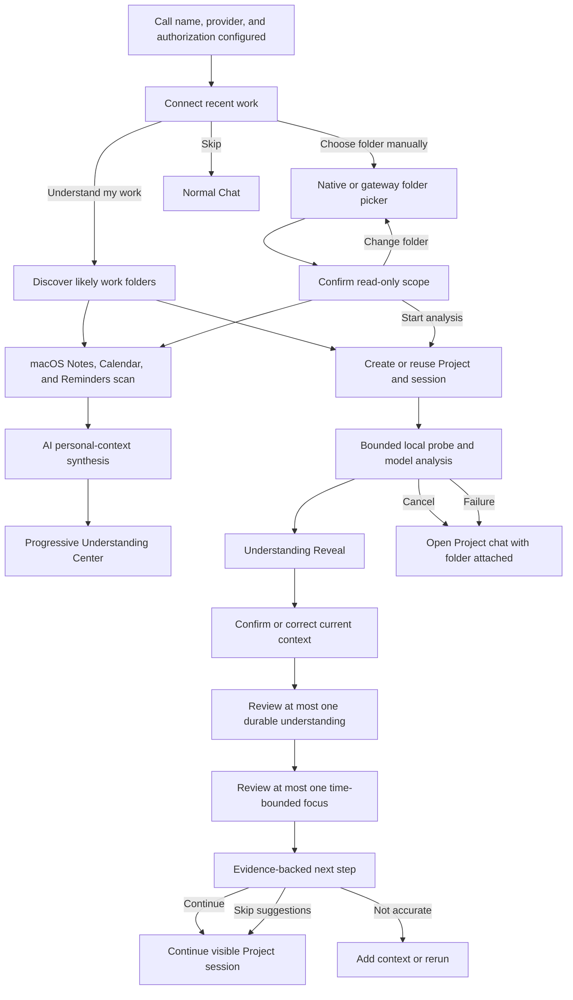

# Work Discovery Onboarding

Status: Implemented behind `experimental.workDiscoveryOnboarding`
Audience: Product, design, agent, gateway, Electron, storage, and Web UI maintainers  
Last updated: 2026-08-02

## Summary

Work Discovery Onboarding helps a newly configured user reach useful work instead of landing on an empty chat. After the user profile and first model are configured, xopc offers one optional action: discover or manually select local folders that represent something the user is currently working on. Candidate discovery recommends one folder and lets the user select more. xopc analyzes selected folders separately and in order, creates or reuses one Project and visible Project session per folder, and returns evidence-backed next-step suggestions that the user can continue in conversation.

The implemented flow starts with bounded candidate discovery in common developer roots and in work folders up to two levels below Desktop, Documents, and Downloads. It supports macOS and Windows standard locations, Windows OneDrive redirection, and Linux XDG user directories, plus an explicit folder fallback. Broad personal roots are metadata-only discovery containers; only explicitly selected child work folders receive bounded content analysis. Each selected folder has an independent grant, run, Project, and session, and the runs execute sequentially so content never crosses project boundaries. On macOS, the same onboarding action also starts bounded, read-only scans of Apple Notes, Calendar, and Reminders. A bounded AI investigator combines those signals into paraphrased user understanding and evidence-backed Work Threads. It does not inspect the home root, browser history, chats, mail, or the full disk.

## Implemented phases

1. **Candidate discovery:** bounded, read-only ranking across existing Projects and work roots up to two levels below common developer directories, Desktop, Documents, and Downloads. Grouping and personal-root folders are traversed but never promoted as projects themselves. Recent general-document folders may become candidates based on filenames, extensions, and timestamps without reading file content. Every discovered candidate is scored before the top eight are selected; previously connected projects receive no artificial activity boost.
2. **Multi-project understanding:** selected projects receive separate bounded content analyses in ranking order; unselected ranked projects contribute metadata only. Stable user facts remain memory candidates until the user confirms them.
3. **Persistent folder grants:** approved work folders are stored as read-only sources, can be rescanned, and can be revoked. `lastScannedAt` advances only after a successful analysis.
4. **Native personal context scan:** available only in the Electron app on macOS. The onboarding action requests the operating-system permissions for Notes, Calendar, and Reminders, then reads up to 50 recent items from each source with per-item and total character limits. The personal-context synthesis waits for the directory investigation and reconciles corroboration, conflicts, current focus, and stale signals across the sources. Raw source content is held only for the model call and is not stored in xopc's database.
5. **Bounded AI investigation:** the model iteratively plans hypotheses and selects read-only `read_text_excerpt` or `search_authorized_text` actions. Tool calls, content characters, and elapsed time have hard limits. Secret paths, binaries, excluded directories, writes, and arbitrary shell commands are unavailable.
6. **Work Threads:** current, ongoing, and long-term work streams are persisted with evidence lineage, focus scores, status, confidence, project relationships, and user feedback. Explicit corrections survive later inference.
7. **Unified evidence and minimal calibration:** file, Git, related-project metadata, connected personal context, session context, and direct user statements use one evidence model. Personal context can corroborate an existing Work Thread; long verbatim overlaps are rejected. First run asks for one current-context decision, then at most one durable-memory decision and one time-bounded focus decision. Remaining candidates stay pending in About You. Inferred durable facts and focuses never activate from summary confirmation alone.
8. **Incremental refresh and governance:** approved folders use bounded metadata fingerprints. A refresh runs only when the fingerprint changes and duplicate active refreshes are reused. Source lineage, derived-data deletion, quality metrics, and offline precision/recall/evidence-coverage evaluation are exposed by the gateway.

Native app access uses fixed JXA programs through the public Automation interfaces for Notes, Calendar, and Reminders. No source values are interpolated into executable script text, and xopc does not read private application databases. Each scan is initiated by the onboarding action; there is no durable native-source grant or scheduled rescan. User-confirmed memories remain user-controlled through About You.

The global understanding indicator opens a fixed responsive Understanding Center instead of a drawer. Running activity is presented as one synthesis state, and review-ready candidates are shown one at a time. After the final decision it shows a brief confirmation and closes automatically; rerun and full management remain at their existing product entry points. Scheduled scanning is intentionally out of scope until change detection, source-specific consent, cost controls, and result quality justify it.

## Product Decision

Add an optional activation stage after the minimal three-step setup: optional call name, intelligence provider, and provider authorization. Welcome-only and collaboration-preference screens are intentionally omitted; safe collaboration defaults apply until the user changes them during real use.

The activation stage uses a focused, single-column flow inspired by a native setup assistant. It stays within the existing Calm Intelligence visual system:

- neutral workstation surfaces;
- Loop Blue for the primary action and focus;
- a small amount of Momentum Cyan for analysis progress;
- one continuous first-run narrative shared with model setup;
- purposeful spatial motion for scene continuity and analysis status, without confetti or decorative AI theater.

The feature is called **Connect recent work** in user-facing English and **接入最近的工作** in Chinese. Avoid naming the entry point “computer scan” or “disk scan”; those phrases foreground implementation risk instead of user value.

## Problem

Completing profile and model setup proves that xopc is configured, but it does not prove that xopc is useful. A new user still faces a blank conversation and must decide:

- what to ask;
- how much background to explain;
- which files matter;
- whether the assistant can understand ongoing work;
- how Projects, Tasks, sessions, and workspaces relate.

Generic starter prompts reduce visual emptiness but do not remove this context-assembly burden. The product needs a first-run path that demonstrates continuity with the user's real work.

## Activation Goal

The first-value moment is:

> Within about one minute, the user sees that xopc understands the current state of a real folder and offers at least one credible next action with visible evidence.

The onboarding is successful when the user selects a suggestion and continues the resulting Project session. Completing every onboarding screen is not itself the goal.

## Goals

- Turn an empty first chat into a grounded work continuation.
- Produce exactly three concise, materially different next-step suggestions.
- Show evidence for every suggestion so the user can judge trustworthiness.
- Create or reuse normal Projects and sessions instead of a disconnected tutorial object.
- Make folder access explicit, bounded, read-only, cancelable, and understandable.
- Preserve progress across navigation and page reloads.
- Allow the user to skip before folder selection, before analysis, or during analysis.
- Reuse the normal chat after activation so the user learns by doing real work.

## Non-goals

- Reading, indexing, or sending all content from Desktop, Documents, Downloads, or the home root. Personal roots are candidate-discovery containers only.
- Indexing the full selected directory or building a permanent semantic index.
- Modifying files during discovery.
- Running arbitrary shell commands during discovery.
- Diagnosing or fixing the project before the user chooses a suggestion.
- Guaranteeing that a folder is a software repository.
- Replacing the Projects, Tasks, sessions, or welcome-suggestion models.
- Running an OS-wide filesystem watcher or background full-disk index. Incremental checks are explicit and limited to approved sources.
- Making a remote browser capable of reading the browser device's local filesystem.

## Primary User

The primary user is a solo builder, independent operator, or technical knowledge worker who has just configured xopc. They are motivated to try the product but may not yet understand xopc's object model or know what first prompt will demonstrate its value.

The first release should support both:

- code projects with Git and common language markers;
- general knowledge-work folders containing Markdown, text, office-document metadata, plans, or research material.

Code projects will usually produce higher-confidence results in the first release because their structure and recent state are easier to infer.

## Experience Principles

1. **Use one clear activation action.** It starts work-folder discovery and, on macOS, requests each native app permission from the operating system. The copy discloses AI transfer before scanning.
2. **Show evidence, not confidence theater.** File paths, Git state, and concrete observations support each suggestion.
3. **Analyze before acting.** Discovery cannot write files or execute project code.
4. **Use real product objects.** The result belongs to a normal Project and a visible session.
5. **Keep one decision per screen.** Folder selection, scope confirmation, analysis, and next-step selection are separate states.
6. **Explain cloud transfer before it happens.** If a cloud model is selected, disclose that bounded text excerpts may be sent to that provider.
7. **Respect dismissal.** Do not reopen the first-run experience after the user skips or completes it.
8. **Degrade gracefully.** A failed or low-confidence analysis still leads to a useful chat with the selected working directory attached.

## Entry and Eligibility

### New users

The existing model setup flow remains responsible only for user/profile and model configuration. After it succeeds, it navigates to the Work Discovery route instead of directly completing activation in the dialog.

Recommended route:

```text
/onboarding/workspace
```

The route is eligible when all conditions are true:

- a usable default model exists;
- Work Discovery onboarding state is `not_started` or `in_progress`;
- this installation did not previously complete or dismiss the flow.

The route must not be gated only by `needsModelSetup`. Model setup becomes false immediately after credentials are saved, while Work Discovery has its own lifecycle.

### Existing users

Do not interrupt existing configured users with a full-screen route during rollout. Their Chat empty state may show a dismissible **Connect recent work** action. Selecting it enters the same flow; ignoring it has no effect.

### Re-entry

After dismissal or completion, the flow remains available from:

- the Chat welcome surface;
- the project switcher or project creation menu;
- a future command-palette action.

Re-entry is an ordinary feature action and does not reset first-run onboarding state.

## End-to-end Journey



## Screen and State Specification

The flow is a full-screen focus surface that continues directly from model setup without revealing the normal app shell between stages. The content column is centered, approximately `40rem` wide, with generous vertical space. Avoid a large floating card around the entire flow. Use borders or quiet inset surfaces only for the selected path, consent summary, evidence, and actionable result rows. Scene transitions preserve the brand mark and ambient light field so setup, consent, analysis, and the first useful result feel like one product experience.

### 1. Introduction

Purpose: explain the value and ask for one action.

Chinese copy:

> **把最近的工作接进来**  
> 选择一个本地文件夹。xopc 会只读了解当前进展，并整理几个可以继续推进的方向。通常需要不到一分钟。

English copy:

> **Connect your recent work**  
> Choose a local folder. xopc will read it without making changes, understand the current state, and suggest a few ways to keep moving. This usually takes less than a minute.

Actions:

- Primary: **选择文件夹 / Choose folder**
- Secondary text: **暂时跳过 / Skip for now**

Supporting note:

> 不会修改文件。开始分析前，你可以查看读取范围。  
> Files will not be changed. You can review the read scope before analysis starts.

### 2. Folder selected and consent

Show:

- canonical folder path;
- folder display name;
- detected project type when available;
- what xopc will read;
- what xopc will ignore;
- cloud-model disclosure;
- an expandable **View scan policy** section for exact limits.

Default summary:

> xopc will inspect project structure, project instructions, recent text changes, and Git state. Dependencies, build output, binary files, and common secret files are excluded.

If the selected model is remote:

> Relevant text excerpts may be sent to &#123;&#123;providerName&#125;&#125; for analysis. Raw credentials and excluded files are not included.

Actions:

- Primary: **开始分析 / Start analysis**
- Secondary: **更改文件夹 / Choose another folder**
- Tertiary: **暂时跳过 / Skip for now**

The folder picker cancel action returns to the introduction without changing onboarding state.

### 3. Analysis in progress

The analysis screen shows a stable stage list, not an indeterminate page spinner:

1. **识别项目结构 / Understanding the folder**
2. **了解最近进展 / Reviewing recent progress**
3. **整理下一步建议 / Preparing next steps**

Each stage has `pending`, `active`, `complete`, or `degraded` state. Use Loop Blue for current focus and a thin Momentum Cyan progress signal. Do not animate file names or expose a performative chain-of-thought stream.

Show the selected folder and a **Cancel analysis** action. Canceling stops additional reads and model calls but preserves any already-created Project and session. The user can continue with a normal chat using that folder.

If the user navigates away, analysis continues in the gateway. A small shell-level status item can link back to the run. Reloading the route restores persisted progress.

### 4. Understanding Reveal

The first result is not a dashboard. It is a full-screen sequence with one decision per scene:

1. **Current context:** show one synthesized statement. Current state, work-thread labels, and evidence stay behind **Why do I think this?**.
2. **Calibration:** offer only **Accurate** or **Adjust**. Adjustment requires the actual corrected intent; category labels are not accepted as substitutes for a correction.
   - When the current objective is uncertain, never present an empty prompt. Generate one editable `conversationStarter` from the selected folder, readable project context, and recent changes.
   - The starter asks the assistant to explain the project state and most important next step before acting. Confirming it opens the project conversation and sends it immediately; it does not route through the recommendation screen.
3. **Lasting understanding:** show only the highest-value pending candidate with **Remember**, **This time only**, and **Edit**. Numeric confidence is not shown.
4. **Current focus:** show only the highest-value pending focus and state that focus affects prioritization and reminders, not execution authorization.

Remaining candidates stay pending for later review. A single control note below the final candidate replaces a separate trust or completion screen. The flow enters the recommended next step immediately after the last necessary decision.

Confirmed understanding uses Loop Blue. In-progress inference may use Momentum Cyan. Rejected candidates disappear quietly without celebration. Continuous motion is limited to active analysis; reading and decision scenes use one entrance transition and then remain still. All motion stops under reduced-motion preferences.

### 5. Recommended next step

The result begins with a short, editable interpretation:

> **What I found**  
> &#123;&#123;two or three sentence project and current-state summary&#125;&#125;

Then show exactly three next-step rows. Do not present a dashboard or identical card grid. Each row contains:

- suggestion title;
- one-sentence rationale;
- two or three evidence items;
- confidence only when it helps interpret incomplete evidence;
- primary action **Continue**;
- secondary action **Discuss first**.

Example:

> **Cover the session recovery failure path**  
> Recent work changes the session runner, but the interruption path has no matching test update.  
> Evidence: `src/session/runner.ts` changed recently; recovery tests do not mention disconnect handling.  
> **Continue** · Discuss first

Additional actions:

- **这些建议不准确 / These suggestions are not accurate**
- **补充一些背景 / Add context**
- **重新分析 / Analyze again**
- **直接进入对话 / Open the conversation**

Selecting **Continue** sends the suggestion's `actionPrompt` into the existing Project session. Selecting **Discuss first** opens the same session with a draft prompt that the user can edit.

### 6. Low-confidence result

When the analyzer cannot infer credible next steps, do not fabricate specificity. Show what was understood, list the uncertainty, and ask one material question:

> I found the project structure, but not enough recent activity to identify the current objective. What are you trying to move forward in this folder?

Suggested answers may use detected areas, but the user can always type freely. The normal chat remains available.

### 7. Failure

Use a concise task and recovery:

- **Folder unavailable**: explain that the path moved or permissions changed; choose again.
- **Nothing useful found**: allow the user to continue with the folder or choose another one.
- **Model unavailable**: keep the Project/session, link to model settings, and retry after configuration.
- **Analysis timed out**: retain the bounded local snapshot and allow retry.
- **Gateway disconnected**: reconnect and reload persisted run state.

Never discard the user's selected path or create duplicate Projects when retrying.

## Onboarding State Model

First-run state is durable installation state, not browser-local presentation state.

```ts
type WorkDiscoveryOnboardingStatus =
  | 'not_started'
  | 'in_progress'
  | 'completed'
  | 'dismissed';

interface WorkDiscoveryOnboardingState {
  status: WorkDiscoveryOnboardingStatus;
  activeRunId?: string;
  completedAt?: number;
  dismissedAt?: number;
  updatedAt: number;
}
```

State transitions:

```text
not_started -> in_progress -> completed
not_started -> dismissed
in_progress -> dismissed
in_progress -> completed
```

`failed` is a run state, not an onboarding state. A failed run leaves onboarding `in_progress` until the user retries, opens the normal session, or dismisses the flow.

## Work Discovery Run Model

```ts
type WorkDiscoveryRunStatus =
  | 'queued'
  | 'probing'
  | 'analyzing'
  | 'completed'
  | 'failed'
  | 'canceled';

type WorkDiscoveryStage =
  | 'folder_structure'
  | 'recent_progress'
  | 'next_steps';

interface WorkDiscoveryRun {
  id: string;
  source: 'onboarding_selected_directory' | 'manual_selected_directory';
  status: WorkDiscoveryRunStatus;
  stage?: WorkDiscoveryStage;
  rootPath: string;
  projectId: string;
  sessionKey: string;
  agentId: string;
  modelRef: string;
  scanPolicyVersion: number;
  snapshot?: WorkContextSnapshotSummary;
  result?: WorkDiscoveryResult;
  errorCode?: WorkDiscoveryErrorCode;
  errorMessage?: string;
  createdAt: number;
  startedAt?: number;
  completedAt?: number;
  canceledAt?: number;
}
```

Persist run status and the bounded result in SQLite. Do not persist raw file contents in the run record.

## Result Contract

```ts
interface WorkDiscoveryResult {
  projectSummary: string;
  currentState: string;
  uncertainties: string[];
  suggestions: [WorkDiscoverySuggestion, WorkDiscoverySuggestion, WorkDiscoverySuggestion];
}

interface WorkDiscoverySuggestion {
  id: string;
  title: string;
  rationale: string;
  evidence: Array<{
    path?: string;
    observation: string;
  }>;
  actionPrompt: string;
  confidence: 'high' | 'medium' | 'low';
}
```

Validation rules:

- Exactly three suggestions for a normal successful result.
- At least one evidence item per suggestion.
- Evidence paths must resolve inside the selected root or be omitted.
- `actionPrompt` must ask for a next step, not silently authorize changes.
- Suggestions must not claim that tests passed, commands ran, or external state was checked unless the snapshot contains that evidence.
- If fewer than three credible suggestions exist, return a low-confidence result instead of padding the list.

## System Architecture

### Reused components

The implementation should reuse these existing capabilities:

- `useDirectoryPicker` for Electron-native selection and the gateway filesystem fallback;
- `ProjectService.resolveOrCreateForWorkspacePath` for canonical Project identity;
- project-kind inference for coding versus general folders;
- normal Project session creation;
- embedded agent turn/session infrastructure;
- SQLite transcript storage and session hydration;
- gateway realtime topics for progress notifications;
- existing Chat welcome context and suggestion entry points;
- semantic Web UI tokens and project-owned controls.

### New components

```text
src/work-discovery/
  types.ts
  scan-policy.ts
  probe.ts
  snapshot.ts
  analyzer.ts
  service.ts
  repository.ts

src/gateway/hono/routes/
  work-discovery.ts

web/src/features/work-discovery/
  api.ts
  work-discovery-page.tsx
  work-discovery-intro.tsx
  work-discovery-consent.tsx
  work-discovery-progress.tsx
  work-discovery-results.tsx
  use-work-discovery-run.ts
```

The exact file split may follow nearby repository conventions, but probing, analysis, orchestration, and persistence must remain separate responsibilities.

### Service responsibilities

`WorkDiscoveryService` owns:

- canonicalizing and validating the selected path;
- resolving or creating the Project idempotently;
- creating one visible Project session idempotently;
- creating and persisting the run;
- scheduling bounded probing and analysis;
- publishing stage changes;
- honoring cancellation;
- validating the result contract;
- recording product activity;
- marking onboarding complete when results are available or the user chooses to continue without them.

The Web client does not own an invisible per-run HTTP stream. Analysis is a gateway-owned job so navigation and reload do not terminate it.

## API Design

### Read onboarding state

```http
GET /api/onboarding/work-discovery
```

Response:

```json
{
  "state": {
    "status": "not_started",
    "updatedAt": 1784592000000
  }
}
```

### Dismiss first-run activation

```http
PATCH /api/onboarding/work-discovery
Content-Type: application/json

{ "status": "dismissed" }
```

Only `dismissed` is accepted from this endpoint. Completion is owned by the service after a result is produced or the user explicitly opens the created session.

### Preview folder scope

```http
POST /api/work-discovery/preview
Content-Type: application/json

{ "rootPath": "/absolute/selected/path" }
```

Response:

```json
{
  "preview": {
    "canonicalRootPath": "/absolute/selected/path",
    "displayName": "xopc",
    "exists": true,
    "readable": true,
    "projectKind": "coding",
    "projectKindConfidence": 0.9,
    "provider": "anthropic",
    "remoteModel": true,
    "policyVersion": 1
  }
}
```

This endpoint performs only cheap validation and shallow marker detection. It does not read file contents or create a Project.

### Start or resume a run

```http
POST /api/work-discovery/runs
Content-Type: application/json

{
  "rootPath": "/absolute/selected/path",
  "source": "onboarding_selected_directory",
  "idempotencyKey": "client-generated-uuid"
}
```

Response uses `202 Accepted`:

```json
{
  "run": {
    "id": "run-id",
    "status": "queued",
    "projectId": "project-id",
    "sessionKey": "agent:main:project:project-id:session-id"
  }
}
```

The same idempotency key returns the same run, Project, and session.

### Read a run

```http
GET /api/work-discovery/runs/:runId
```

Return status, current stage, safe snapshot summary, result, recoverable error, and navigation targets. Never return collected raw excerpts.

### Cancel a run

```http
POST /api/work-discovery/runs/:runId/cancel
```

Cancellation is idempotent. Completed and failed runs remain unchanged.

### Gateway events

Broadcast:

```text
work-discovery.progress
work-discovery.completed
work-discovery.failed
work-discovery.canceled
```

Event payloads contain `runId`, `projectId`, `sessionKey`, `status`, and `stage`; completed events may include the validated result. The Web realtime bridge converts dotted event names to hyphenated window events using the existing convention.

## Local Probe and Scan Policy

### Policy version 1

The probe operates in two passes.

#### Pass A: structural metadata

Collect:

- canonical root path and directory accessibility;
- bounded relative file names and directory names;
- common project markers;
- file size and modification time;
- Git presence, branch, dirty-path list, and limited recent commit metadata;
- existing xopc Project match;
- inferred project kind.

Pass A does not send content to the model.

#### Pass B: bounded text excerpts

Prioritize:

1. workspace instructions: `AGENTS.md`, `CONTEXT.md`, and equivalent repository guidance;
2. entry documentation: `README*`, project overview, brief, or index files;
3. explicit planning artifacts: `TODO*`, roadmap, issue notes, decision records;
4. text files modified recently;
5. a small sample of files involved in Git changes;
6. manifest and configuration files that identify the project type.

Default limits should be centrally configurable and conservative. Initial targets:

| Limit | Initial value |
|---|---:|
| Directory traversal depth | 4 |
| Candidate file count | 2,000 |
| Content files read | 30 |
| Per-file content | 64 KiB |
| Total collected text | 512 KiB |
| Git recent commits | 10 |
| Probe wall-clock budget | 15 seconds |
| Analysis wall-clock budget | 90 seconds |

The values are implementation defaults, not product promises. Record the applied policy version and actual counts for diagnostics.

### Default exclusions

Exclude:

- `.git/` object content;
- dependency directories such as `node_modules/`, `vendor/`, and virtual environments;
- build output, caches, coverage, generated bundles, and package-manager stores;
- binaries, media, archives, database files, and large files;
- `.env`, `.env.*`, credential, key, certificate, auth, token, and known secret files;
- operating-system metadata;
- paths ignored by `.gitignore`, with an explicit exception only for high-value root documentation if safe;
- symlink targets outside the canonical selected root.

Apply existing logger redaction to all diagnostic fields. Logs may include bounded relative path previews and counts, but never excerpts, API keys, authorization headers, or full snapshots.

### Office and rich documents

The first release does not extract full Office, PDF, image, or media content. It may use safe metadata such as file name, type, size, and modification time. Rich-document extraction can be added later behind type-specific limits and disclosure.

### Git handling

Git inspection is read-only and bounded. Prefer library or direct repository reads where practical. If a subprocess is used, commands must be an allowlisted fixed set with no interpolation into a shell string. Do not run project scripts, tests, package managers, hooks, or arbitrary commands.

## Snapshot Design

The local probe produces a deterministic `WorkContextSnapshot` before invoking a model. The snapshot separates observations from interpretation.

```ts
interface WorkContextSnapshot {
  root: {
    displayName: string;
    projectKind: 'coding' | 'general' | 'unknown';
    markerReasons: string[];
  };
  structure: {
    sampledPaths: string[];
    omittedPathCount: number;
  };
  git?: {
    branch?: string;
    changedPaths: string[];
    recentCommits: Array<{ subject: string; committedAt: number }>;
  };
  documents: Array<{
    relativePath: string;
    modifiedAt?: number;
    excerpt: string;
    truncated: boolean;
    selectionReason: string;
  }>;
  limits: {
    policyVersion: number;
    fileCount: number;
    contentBytes: number;
    truncated: boolean;
  };
}
```

Only the snapshot, not unrestricted filesystem access, is passed to the default analyzer. This makes privacy, tests, model cost, and output reproducibility easier to control.

## Analysis and Conversation Orchestration

### Recommended execution model

Use a dedicated structured analyzer over the snapshot, then publish its result into a normal visible Project session.

The analyzer receives:

- selected user profile context needed for tone or priorities;
- Project name and inferred kind;
- the bounded snapshot;
- the result JSON schema;
- instructions to prefer uncertainty over unsupported claims.

The analyzer does not receive general write tools. If a tool-capable agent runner is reused, its tool policy must be a discovery-specific read-only allowlist and the same scan limits still apply.

### Visible session

Create the session before analysis so progress has a durable destination. Add an audit/context transcript entry that records:

- the user-selected root;
- scan policy version;
- run id;
- initiation source;
- provider disclosure acknowledged at start time.

After validation, append a product-facing assistant result through the normal transcript update path. The Chat UI renders the structured suggestions as an assistant steps block and retains a readable Markdown representation for export and clients that do not implement the block.

Do not add a turn-end `SessionStore.save` or `saveMessages` path. Work Discovery must use the SQLite transcript append/update mechanisms and existing embedded-session hydration rules.

When the user selects **Continue**, submit a normal user turn containing the suggestion's `actionPrompt`. From that point onward, the session uses the selected agent's normal capabilities and permission model. Discovery consent does not authorize later writes; tool-level permission and agent boundaries continue to apply.

### Alternative considered: invisible Web `/api/agent` call

Rejected because it:

- ties the run lifetime to a browser request;
- loses progress on navigation or reload;
- makes cancellation and retries difficult to reason about;
- obscures the existence of the conversation;
- encourages duplicate sessions after reconnect.

## Persistence

Add SQLite-backed repositories for:

- singleton Work Discovery onboarding state;
- Work Discovery runs and validated results;
- idempotency keys;
- run timestamps and safe diagnostic counts.

Do not persist:

- raw file contents;
- unredacted prompts containing full snapshots;
- model credentials;
- unrestricted directory listings.

Persist the final result because the user must be able to reload it. The session transcript remains the durable conversational representation; the run record remains the durable operational representation.

Recommended retention:

- completed/failed/canceled run metadata: 30 days;
- validated result: retain while referenced by the session or until session deletion;
- raw in-memory snapshot/excerpts: release immediately after analysis;
- onboarding state: retain until installation state is reset.

Retention cleanup should be idempotent and must not delete the Project or session.

## Project and Session Identity

Resolve Projects through the canonical workspace path. If a Project already owns the selected root, reuse it. If a safe root can be inferred, create one Project and record that it was created by Work Discovery.

Create at most one session per run. Retries reuse the same session and append a new run context/result rather than creating duplicate sidebar items. Re-analysis initiated later may create a new session only when the user explicitly asks for a separate conversation.

The initial session title should be derived from the folder without claiming an objective, for example:

```text
Continue work on xopc
继续推进 xopc
```

## Security and Privacy Boundaries

### Consent boundary

Folder selection grants access only to that canonical root for this run. It does not grant access to sibling directories, the parent directory, common folders, or future runs.

### Filesystem boundary

- Reject empty, relative, device, and non-directory paths.
- Canonicalize before Project resolution and before every read.
- Verify that each resolved read target remains inside the root.
- Do not traverse external symlinks.
- Handle permission errors per file without expanding scope.
- Treat the gateway host as the filesystem authority.

### Remote gateway boundary

When the Web UI connects to a remote gateway, folder selection and analysis refer to the gateway machine, not the browser device. The UI must say **Choose a folder on &#123;&#123;gatewayName&#125;&#125;** when the gateway is known to be remote.

Pure cloud Web deployments cannot read an arbitrary local folder on the browser device through this API. A future upload or client-side indexing flow would be a separate design with different privacy and lifecycle semantics.

### Provider boundary

Before analysis, disclose the active provider and whether text leaves the machine. The first release does not imply provider-side zero retention. Link to the configured provider details when available.

### Capability boundary

The discovery analyzer cannot:

- modify or delete files;
- execute project commands;
- install dependencies;
- access the network except through the configured model call;
- call channels or external connectors;
- create Tasks, automations, or workflows;
- continue acting after the result is produced.

## Activity and Audit

Emit product activity for meaningful lifecycle events:

| Event | Visibility | Purpose |
|---|---|---|
| `work_discovery.started` | audit | Records user consent and run identity |
| `work_discovery.completed` | timeline | Makes the Project analysis discoverable |
| `work_discovery.failed` | audit | Supports recovery without noisy timelines |
| `work_discovery.canceled` | audit | Records explicit cancellation |
| `work_discovery.suggestion_selected` | timeline | Connects activation to the continued session |

Scope events to the Project and session created or reused by the run. Payloads contain counts, policy version, suggestion id/title, and error code—not raw excerpts.

## Observability

Use `createLogger('WorkDiscovery')` and object-first logging.

Useful fields:

- `runId`, `projectId`, `sessionKey`, `agentId`;
- `phase` and `stage`;
- `rootPath` only when existing path-redaction policy permits it;
- bounded counts and durations;
- `modelRef`, policy version, truncation state;
- `errorCode` and `err`.

Required metrics:

- eligible activation views;
- folder-picker starts and selections;
- consent confirmation;
- skips by stage;
- run success, failure, timeout, and cancellation;
- probe and analysis duration distributions;
- snapshot file/byte counts and truncation;
- suggestion continuation and discussion selection;
- first normal user turn after discovery;
- D1/D7 return to the created/reused Project;
- inaccurate-suggestion feedback.

Do not emit filenames, excerpts, suggestion rationale, or prompt content to analytics.

## Success Metrics

Primary:

- percentage of eligible users who reach a validated result;
- percentage of completed results where a suggestion is continued or discussed;
- time from model configuration to first normal user turn;
- second-turn rate in the resulting Project session.

Guardrails:

- folder-selection-to-consent abandonment;
- scan failure and timeout rate;
- inaccurate-suggestion feedback rate;
- deletion rate for automatically created Projects/sessions;
- model token cost per activated user;
- privacy-related support reports.

Evaluate with an experiment:

- Control: current Chat welcome state after model setup.
- Treatment: optional Work Discovery activation after model setup.

Do not optimize for onboarding completion if the treatment reduces normal conversation starts or trust.

## Rollout Plan

### Phase 0: Internal dogfood

- Selected folders only.
- Coding repositories prioritized.
- Debug-level safe counters and manual result review.
- Feature flag by installation.
- Validate exclusions against representative private repositories.

### Phase 1: First-run MVP

- Optional post-model activation route.
- Electron native picker and gateway filesystem fallback.
- Folder preview and provider disclosure.
- Bounded snapshot and structured analyzer.
- Durable run, Project, and session.
- Three suggestions with evidence.
- Cancel, retry, skip, reload, and failure recovery.
- Existing-user entry only in Chat empty state.

### Phase 2: Candidate discovery

- Separate opt-in **Find recent work** action.
- Inspect only directory metadata and project markers in approved common roots.
- Maximum depth 1–2.
- Rank candidates by recent modification, Git recency, project markers, xopc recent-directory history, and existing Project matches.
- Require selection and normal content-consent confirmation before Pass B.

Phase 2 requires a separate privacy review and is not enabled implicitly by Phase 1 consent.

### Phase 3: Ongoing momentum

- User-controlled re-analysis from a Project.
- Change-aware snapshots.
- Optional suggestion refresh after meaningful activity.
- Explicit links to Tasks.

Continuous monitoring remains opt-in and requires its own lifecycle and resource controls.

## Implementation Slices

### Slice 1: Durable shell

- Add onboarding and run schemas/repositories.
- Add state, preview, start, get, and cancel routes.
- Add gateway events.
- Add route-level tests and migration integrity checks.

### Slice 2: Local probe

- Implement canonical path and symlink boundaries.
- Implement marker, file, recency, and Git metadata collection.
- Implement exclusions, limits, cancellation, and deterministic snapshot fixtures.
- Add secret-file and traversal regression tests.

### Slice 3: Structured analysis

- Implement schema-constrained analysis.
- Add unsupported-claim checks and evidence-path validation.
- Add timeout, retry, model-unavailable, and low-confidence handling.
- Publish readable and structured results to the session.

### Slice 4: Web activation experience

- Add route and eligibility/re-entry logic.
- Reuse directory picker and project-owned controls.
- Implement intro, consent, progress, result, low-confidence, and failure states.
- Add Chinese and English copy.
- Support keyboard navigation, screen-reader status announcements, reduced motion, and responsive layout.

### Slice 5: Metrics and experiment

- Add privacy-safe product metrics.
- Add feature flag and rollout targeting.
- Create experiment dashboards for activation and conversation tasks.

## Test Plan

### Unit tests

- canonical path and inside-root checks across supported operating systems;
- symlink escape prevention;
- exclusion matching and secret-file detection;
- file/depth/byte/time limits;
- cancellation between stages and during file reads;
- snapshot selection and deterministic ordering;
- result schema and evidence-path validation;
- onboarding and run state transitions;
- idempotent Project/session/run creation.

### Integration tests

- selected folder -> preview -> run -> Project/session -> completed result;
- retry after model failure reuses Project and session;
- page reload restores in-progress and completed state;
- cancel stops further reads/model calls;
- remote gateway copy identifies the gateway host;
- transcript result survives gateway restart and JSON export;
- run cleanup does not delete Project/session/transcript;
- config reload during analysis produces a recoverable result.

### Web tests

- skip from introduction and consent;
- native-picker cancellation;
- keyboard-only completion;
- screen-reader progress announcements without excessive updates;
- narrow viewport layout and long paths;
- provider disclosure in local and remote model cases;
- error recovery and retry;
- suggestion Continue and Discuss first behavior;
- onboarding does not reopen after completion or dismissal.

### Security tests

- `.env`, keys, certificates, credentials, and tokens never enter snapshots;
- malicious symlinks cannot escape the root;
- ignored and oversized files remain unread;
- binary content is not decoded as text;
- API rejects paths unavailable to the gateway process;
- logs and events contain no excerpts or secrets;
- analyzer tool policy cannot write, execute, or send externally.

## Acceptance Criteria

The MVP is ready when:

- a newly configured user can skip without friction;
- selecting a folder always leads to an explicit consent screen before content reads;
- no discovery path modifies files or executes project code;
- the run survives Web navigation and reload;
- Project, session, and run creation are idempotent;
- a normal success returns three validated suggestions with evidence;
- low-confidence analysis asks for context instead of inventing suggestions;
- Continue starts a normal user turn in the visible Project session;
- provider and remote-gateway boundaries are accurately disclosed;
- all default exclusions and traversal boundaries have regression tests;
- dismissal and completion prevent repeated first-run interruption;
- English and Chinese task-critical copy remain in parity;
- root and Web type checks, relevant Vitest suites, and production Web build pass.

## Open Questions

The following decisions can remain open during product review but must be closed before implementation:

1. Which configured model role should discovery use: the default `deep` role, a cheaper typed role, or a dedicated discovery role with fallback?
2. Should general-document folders ship in Phase 1 or remain dogfood-only until rich-document extraction exists?
3. Which activity taxonomy extension should own Work Discovery events if the generic activity system is not yet available everywhere?
4. What installation-level feature-flag mechanism should control rollout?
5. What provider disclosure data is available for custom OpenAI-compatible models?
6. Should the created session render a dedicated structured transcript block or derive the result block from a context row plus Markdown assistant message?

## Follow-up Decision Records

Create an ADR before implementation if Work Discovery introduces a reusable gateway job framework or a new general capability-consent model. Keep product flow, copy, limits, and rollout in this document; keep long-lived cross-feature infrastructure decisions in `docs/adr/`.
