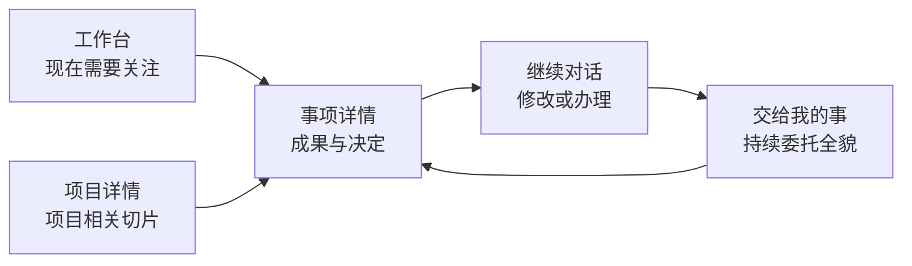

# 工作台与助理工作的统一产品方案

日期：2026-09-13。状态：首阶段已实现。

首阶段已完成导航与深链统一、工作台注意力排序、持续事项三态列表、事项详情、自然语言交代入口和产品化提醒文案。后续扩展应继续沿用本文的信息架构，不恢复独立的主动性配置页或模板市场。

## 产品结论

工作台和主动助理不再作为两个平级、内容重复的产品。

- **工作台回答「现在有什么值得我看或处理」**，是每天进入 xopc 的首页。
- **交给我的事回答「助理正在替我承担什么、做到哪一步」**，是持续委托的管理页。
- **对话负责交代、修改和继续办理**，不承担状态总览。
- **项目详情展示与当前项目有关的切片**，不复制完整助理工作区。

用户侧不出现 Proactive、订阅、场景、扫描、Workflow、队列、Prompt、revision、source item 等技术概念。内部可以继续沿用现有模块和路由，产品文案只表达事项、成果、等待条件、下一步和授权。

## 信息架构

主导航保留两个与本能力有关的入口：

1. **工作台**：当前需要关注的内容。
2. **交给我的事**：全部持续委托。

不再提供单独的「为你关注」页面，也不在「交给我的事」中重复一个「今天」标签。用户可见导航与深链统一使用 `/assistant-work`；原 `/proactive` 只负责把旧链接重定向到新的产品入口。

## 工作台

工作台以用户注意力排序，不以数据来源或内部模块分区。固定顺序为：

1. **需要你决定**：发送、修改项目、确认最终内容等阻塞助理继续工作的决定。不能折叠隐藏。
2. **已为你准备**：可直接使用的清单、简报、草稿和分析结果。
3. **值得知道**：实质变化、风险和执行结果。没有内容时不显示该分组。
4. **助理正在跟进**：最多两行状态摘要，只说明正在等什么和下一次被唤醒的条件，进入「交给我的事」查看全部。

工作台只展示当前有用的投影。用户处理、来源失效或成果被新版替代后，该条自然退出；它不是消息归档页。

页面标题必须反映真实状态：

| 当前状态 | 标题 | 说明 |
|---|---|---|
| 有待决定事项 | 有 2 件事需要你决定 | 说明助理被什么决定阻塞 |
| 有成果、无待决定 | 助理准备好了这些 | 说明成果可以直接使用 |
| 只有后台委托 | 助理正在跟进你交代的事 | 展示等待条件，不制造忙碌感 |
| 完全没有当前工作 | 今天没有需要处理的事 | 提供「交代一件事」自然语言入口 |
| 数据仍在加载 | 今天的工作 | 使用骨架屏，不先显示错误的空闲结论 |

工作台右上角始终提供「交代一件事」。空闲时将输入框放在页面主体；已有工作时使用轻量抽屉或对话入口，避免输入器挤占成果空间。

## 交给我的事

该页的核心对象是一件委托，不是订阅或卡片。顶部只有「进行中」「已暂停」「已结束」三个状态标签。

每件委托默认展示：

- 用户交代的目标，例如「盯住官网改版按周五上线」；
- 当前状态，例如「等待支付联调验收」「等待对方回复」；
- 下一步及触发条件，例如「任务状态变化后重新检查」；
- 最近成果或决定；
- 最近一次成功核对资料的时间；
- 一个主动作「查看」。

暂停和结束放在详情中。列表不展示提醒级别、检查间隔、模板 key 或运行日志。来源断开时直接显示「邮箱资料不可用，需要重新连接」，不将其解释为没有新回复。

「交代一件事」采用同一个入口：

1. 默认聚焦自然语言输入：「希望我替你记住并跟进什么？」
2. 根据当前上下文提供最多三个可用建议，例如「盯住这个项目」「会议前替我准备」「跟进这封邮件」。
3. 选择建议后只补充无法推断的业务条件，如项目、邮件、截止时间。
4. 在建立前用一段自然语言复述：会看什么、何时找用户、做到哪里、什么时候结束。
5. 建立后返回委托详情并立即显示第一次检查状态。

服务模板是内部的履约能力，不是用户要浏览和配置的产品目录。没有可用数据时，建议卡直接变成对应连接动作。

## 事项详情

工作台卡片和委托列表进入同一个详情页。页面标题始终是用户的委托目标，内容分为三个标签：

### 最新成果

直接展示当前清单、简报或草稿。主要动作随成果变化：

- 普通成果：「继续办理」；
- 待确认操作：「审阅并确认」；
- 可编辑草稿：「审阅草稿并继续办理」；
- 来源变化后的旧成果：不再提供执行动作，只显示「资料已变化，正在按最新情况重新准备」。

### 进展记录

用用户能理解的事件形成短时间线，例如「检查了项目任务」「准备了清单」「你修改了清单」「创建待办成功」「正在等待任务完成」。常规无变化检查默认折叠为一行，不呈现模型调用、队列状态或内部重试。

### 关注要求

展示用户可控制的业务语义：

- 目标和结束条件；
- 允许查看的项目、日历或邮件账户；
- 什么时候找用户；
- 哪些动作需要确认；
- 暂停或结束这件事。

高级运行信息只进入诊断和日志页面，不出现在产品主路径。

## 对话与跨页面连续性

对话是同一委托的办理界面。用户从成果点击「继续办理」时，系统自动带入委托 ID、当前成果版本和准确来源范围；用户只看到自然语言开场，例如「我们继续处理客户评审议程」。

同一委托优先回到已有对话。对话中的这些表达应直接更新委托，并给出可撤销回执：

- 「这部分先别管」：修改当前事项的关注要求；
- 「明天下午再提醒我」：修改当前事项的时间条件；
- 「客户回信后继续」：修改等待条件；
- 「这件事不用跟了」：结束委托；
- 「发出去」：针对用户刚审阅的版本进入真实发送确认。

操作完成后，对话和详情同时显示真实结果。用户关闭卡片只代表收起当前提示，不代表委托或目标完成。

## 卡片交互规则

卡片是委托在当前时刻的一个呈现，不是独立产品对象。

- 每张卡只有一个主要动作；复制、稍后、收起、调整要求放入次级区域。
- 标题表达用户结果或变化，不使用「系统检测到」「主动性建议」等内部口吻。
- 第一屏必须说清发生了什么、为什么现在出现、助理已经做了什么。
- 来源和核对时间可展开；信息不确定时明确缺口。
- 同一事项的新结果更新原卡或进入同一详情时间线，避免产生一串重复消息。
- 通知点击直接进入当前成果或决定，不能跳到列表让用户重新寻找。

## 用户控制

全局设置改名为「助理提醒」，只保留用户能感知的选择：

- 尽量安静：成果进入工作台，不额外提醒；
- 重要时找我：临近时限、目标受影响或需要决定时提醒；
- 及时跟进：额外提醒有价值的新进展；
- 免打扰时间、每日提醒上限和首选接收方式。

每件委托单独展示「什么时候找我」和「做到哪里」。权限使用动作语言，例如「可以查看这个项目」「准备成果」「创建待办前确认」「发送前确认」。用户调整主动程度不会扩大数据访问或执行权限。

## 命名规范

| 内部概念 | 用户侧名称 |
|---|---|
| proactive | 助理工作 / 助理在跟进 |
| subscription | 交给我的事 / 委托 |
| scenario template | 助理能帮什么 / 建议 |
| insight | 变化 / 建议 / 成果 |
| artifact | 清单 / 简报 / 草稿 / 方案 |
| action approval | 审阅并确认 |
| scan / run | 核对最新情况 |
| source item | 项目资料 / 日历 / 邮件往来 |
| notification policy | 助理提醒 |
| revision conflict | 内容刚刚更新，请查看最新版本 |

## 状态与异常文案

| 内部状态 | 产品表达 |
|---|---|
| collecting / ready / processing | 正在核对最新情况 |
| no insight | 已核对，目前没有需要你处理的变化 |
| waiting for source | 等待项目变化 / 等待回复 / 等待会议资料 |
| source changed | 资料已变化，正在按最新情况重新准备 |
| source unavailable | 暂时无法查看资料；检查连接或授权 |
| paused globally | 助理提醒已暂停，交代的事情仍然保留 |
| gateway offline | 运行设备离线，恢复后继续 |
| failed retryable | 这次没有完成核对，将自动重试 |
| failed permanent | 无法继续，需要你处理连接、权限或范围问题 |

## 验收标准

统一完成后，用户无需理解主动性系统，也能回答以下问题：

1. 工作台为什么出现这件事？
2. 助理已经替我准备了什么？
3. 现在是否需要我决定或确认？
4. 这件事还在不在继续跟进？
5. 助理正在等什么，什么时候会继续？
6. 我从哪里修改、暂停或结束？
7. 助理能看到什么、可以替我做到哪里？

产品指标以首次有效成果率、成果使用或编辑率、决定完成率、重复提醒率、委托结束原因和来源恢复率为主。模板数量、扫描次数和卡片总量不作为用户价值指标。
