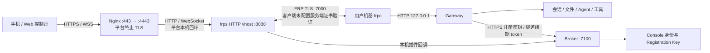

**FRP 远程访问链路安全调查 — 2026-09-13**

结论：当前方案能够提供公网 HTTPS 访问，但平台是能够读取、修改用户流量的可信中间方。除这一架构边界外，发现数项需要优先修复的实现问题，包括 FRP 服务端身份未校验、二进制供应链未校验、子域名回收与客户端持久凭据的组合风险、撤销注册密钥不终止已有隧道，以及转发头导致限流绕过。

本次仅调查，没有修改业务代码、部署配置或真实凭据。没有在生产注册隧道、接管域名、实施中间人攻击或读取业务数据。结论区分源码确认、本地隔离复现和线上只读观察，不能视为生产环境全面渗透测试。

**范围与依据**

- xopc：`8323c54b3bfa33d5596d36c8ec318e1392e7ab24` 的工作区；原有未提交 UI/文档修改未改动。
- xopc-platform：`ecb3fb34402d5e707611c292055bbef55b33d140`。
- 检查 Broker 注册/续期/FRP 插件、Nginx/frps 部署模板、Gateway 隧道生命周期/HTTP 鉴权/设备认证、Expo 手机客户端、Web 凭据保存。
- Codebase graph 工具当前未提供，使用源码检索。上游行为核对到 FRP v0.62.1 源码，不把最新版本默认值直接套到旧版本。
- 没有通过 SSH 读取生产生效配置、访问日志、服务用户、云安全组、数据库或现有租户列表。

**整体链路**

用户机器主动连接 frps；图中双向线表示承载流量，手机不会直接连接 7000。设备配对使用 Gateway 公钥签名及本地批准；常规 API 使用 15 分钟 access token，refresh token 有设备签名证明。

线上公开 [tunnel-config](https://frp.xopc.ai/.well-known/tunnel-config) 实际返回 `tls=broker_terminated`、`publicScheme=https`、frpcVersion `0.62.1`、serverPort `7000`。版本字段是 Broker 声明，不是读取 frps 进程版本。对 `frp.xopc.ai:8080` 和 `:7100` 各一次连接检查均失败：仅说明当前网络无法直连，不能证明全部网络/IPv6/安全组配置正确。

**风险明细（P1 优先修复，P2 次优先）**

**1. P1：frpc 不验证 frps 身份，可以被主动中间人冒充。源码及上游确认。**

[frpc-config.ts](/Users/micjoyce/develop/github/xopc/src/tunnel/frpc-config.ts:21) 生成的配置没有 `transport.tls.trustedCaFile`；[frps.toml](/Users/micjoyce/develop/github/xopc-platform/deploy/broker/frps.toml:3) 未配置服务端 TLS 证书/密钥及强制 TLS。

FRP v0.62.1 [NewClientTLSConfig](https://raw.githubusercontent.com/fatedier/frp/v0.62.1/pkg/transport/tls.go) 在 CA 路径为空时设置 `InsecureSkipVerify=true`。这意味着默认加密成立，但服务端真实性没有保障；[FRP 官方说明](https://gofrp.org/en/docs/features/common/network/network-tls/) 也明确说明这一点。

攻击者需要控制用户到 frps 的网络路径、DNS 或目的服务，之后可以终止/重建 FRP TLS，读取 `metadatas.token`，并转发、读取或修改承载的 Gateway 流量。手机侧正常验证平台 HTTPS 证书并不能覆盖这段连接；公网 HTTPS 已在平台终止。高熵 token 无法防止被直接截获。

修复：frps 配置专用服务端证书，frpc 验证可信 CA 与正确 serverName，服务端设置 `transport.tls.force=true`；需要时再增加 mTLS。验收必须包含“不可信证书”和“错误 hostname”连接失败，不能只测能否连通。

**2. P1：自动下载并执行 frpc，没有完整性/发布者校验。源码确认。**

[下载地址与缓存](/Users/micjoyce/develop/github/xopc/src/tunnel/frpc-binary.ts:55) 按平台镜像、GitHub、`ghfast.top` 回退；[下载执行路径](/Users/micjoyce/develop/github/xopc/src/tunnel/frpc-binary.ts:142) 只判断缓存文件存在，下载成功后直接解压、chmod 并交给隧道进程执行。未见随版本固定的摘要或签名验证。

平台镜像被篡改就可能把平台事件扩大为用户机器代码执行；第三方回退镜像被控制时，在前两个源失败的条件下产生同样结果。进程具有启动 xopc 的本机用户权限，因此影响可以超过手机 API scopes。旧缓存只按固定文件名复用，也会阻碍版本修复生效。

修复：在随应用发布的可信清单内固定版本/平台 SHA-256 或发布签名；下载源只提供字节，不能同时作为摘要信任根；缓存按版本与摘要区分并验证，失败不得执行。取消未校验第三方回退。服务端部署下载也应同样校验。

**3. P1：子域名回收后可被重新申请，旧客户端仍信任该 origin。Broker 回收复用已本地复现，客户端后果为源码分析。**

[registerTunnel](/Users/micjoyce/develop/github/xopc-platform/apps/broker/src/tunnel-service.ts:70) 允许申请任意未占用的 4–12 位字母数字子域名；[过期清理](/Users/micjoyce/develop/github/xopc-platform/apps/broker/src/index.ts:15) 的默认租约为 24 小时，周期删除过期记录。删除后没有绑定历史所有者的保留记录。停止客户端、长期离线或主动释放后，原域名可被别人申请。

Web 后果尤其明确：[storage.ts](/Users/micjoyce/develop/github/xopc/web/src/lib/storage.ts:6) 把长期 Gateway token 存入该 origin 的 `localStorage`。新租户能在相同 HTTPS origin 提供自己的 HTML/JS；原用户再次打开旧链接，新页面就能读取 `xopc.token`。这是同一 origin 的正常浏览器行为，不需要攻破证书或浏览器。获得 owner token 后，原 Gateway 再次可达时可用其管理员权限访问。

手机同样存在绑定缺口：[apiFetch](/Users/micjoyce/develop/github/xopc/apps/mobile-expo/src/api/client.ts:84) 向保存的 route 直接发送 Bearer token 和请求内容；[refreshCredentialsForProfile](/Users/micjoyce/develop/github/xopc/apps/mobile-expo/src/features/gateway/device-auth-session.ts:46) 直接发送 refresh 请求，响应也不验证 Gateway 公钥签名。相比之下，[初次配对](/Users/micjoyce/develop/github/xopc/apps/mobile-expo/src/features/gateway/pair-gateway.ts:86) 才校验 Gateway 身份。

新租户可接收旧手机提交的数据、尚未过期的 access token 和 refresh 请求，并伪造普通 API 结果。不能据此声称“拿到 refresh token 就能永久登录”：refresh 需要设备私钥签名；窃取的完整有效签名请求还有短时重放风险。access token 默认寿命为 15 分钟，单独窃取后仍受过期和设备撤销约束。

修复：域名与稳定 Gateway 公钥/所有者永久绑定，至少保留不允许跨所有者复用的 tombstone；短暂冷却期不能清除浏览器里多年有效的凭据。Web 控制台考虑使用稳定、不可被租户替换的应用 origin；不要在可回收 origin 持久保存 owner token。手机重新连接及路由切换要验证新鲜 Gateway 身份，并将通信绑定到认证会话。要防范能够中继挑战的恶意平台，还需要端到端认证加密或直接终止于 Gateway 的 TLS；一次签名 probe 本身不足够。

**4. P1：Web 自定义头像把完整 Gateway token 放进 URL。源码确认；生产日志是否已留存待核实。**

[agent-avatar-display.tsx](/Users/micjoyce/develop/github/xopc/web/src/features/settings/agents/agent-avatar-display.tsx:48) 构造 `/api/agents/:id/avatar?token=...`。[auth.ts](/Users/micjoyce/develop/github/xopc/src/gateway/hono/middleware/auth.ts:58) 特别允许此路径使用 query token；同一 token 在其他接口具有 owner 权限，并非仅可读头像的凭据。

[Nginx wildcard 配置](/Users/micjoyce/develop/github/xopc-platform/deploy/broker/nginx/wildcard-tunnel-proxy.conf:20) 未显式配置脱敏日志。若生产继承常规 combined 日志，完整请求行连同 token 会落盘；[Nginx 官方日志定义](https://nginx.org/en/docs/http/ngx_http_log_module.html) 包含 `$request`。此时仅有日志读取权限的人也可能获得 Gateway 管理员凭据，不必控制反向代理进程。未读取生产日志，所以没有认定实际泄露事件已经发生。

修复：鉴权 fetch 后生成 blob URL，或使用仅限头像、短时有效的资源票据；同时在入口日志中避免记录敏感查询参数。若线上确认已有 token 留存，应限制日志访问并轮换相关 token。

**5. P1：注销 Registration Key 不撤销由其建立的隧道。源码确认及本地隔离复现。**

[Console 注销](/Users/micjoyce/develop/github/xopc-platform/apps/console/server/src/index.ts:251) 只删除 API key；[key-revocation.ts](/Users/micjoyce/develop/github/xopc-platform/apps/console/server/src/key-revocation.ts:8) 不操作 Broker 隧道。[heartbeatTunnel](/Users/micjoyce/develop/github/xopc-platform/apps/broker/src/tunnel-service.ts:167) 只验证 tunnelToken 和租约，并把到期时间滚动延长；[FRP Ping](/Users/micjoyce/develop/github/xopc-platform/apps/broker/src/tunnel-service.ts:190) 也不检查注册密钥/用户/租户状态。

本地让注册验证器拒绝原 key 后，既有隧道 heartbeat 仍返回 200。窃取注册密钥后已创建的隧道，或已泄露的 tunnelToken/frpcAuthToken，可以在 key 被撤销后继续运作；24 小时 TTL 因持续心跳并不构成绝对上限。这属于撤销语义缺口，不等同于 tunnel token 可直接绕过 Gateway API 鉴权。

修复：按 `registrationKeyId` 级联撤销隧道；账号/租户停用也应生效。心跳/FRP 回调验证父凭据状态或共享撤销版本，及时断开已有连接。验收覆盖“先建隧道，再删 key，再心跳/重连”。如果产品有意把 key 仅定义为创建许可，应提供独立、可发现的全量隧道撤销能力，并向用户明确区别。

**6. P2：X-Forwarded-For 可伪造，Broker/Gateway 限流及审计归因不可靠。两端本地隔离复现。**

[Nginx](/Users/micjoyce/develop/github/xopc-platform/deploy/broker/nginx/frp-tunnel-proxy-params.conf:6) 用 `$proxy_add_x_forwarded_for` 保留并追加用户传入的 XFF；[Broker](/Users/micjoyce/develop/github/xopc-platform/apps/broker/src/register-rate-limit.ts:59) 直接取第一项。攻击者换一个 XFF 即获得新的 IP 限流桶。本地将阈值设为 1，得到相同 XFF 的 200→429，换 XFF 后又是 200。

[Gateway auth](/Users/micjoyce/develop/github/xopc/src/gateway/hono/middleware/auth.ts:90) 在未设置 trustedProxies 时同样直接信任转发头；[loopback helper](/Users/micjoyce/develop/github/xopc/src/gateway/security/loopback.ts:41) 取第一项。默认允许 loopback 免限流，伪造 `127.0.0.1` 能持续得到 401，而普通 IP 已被 429 限制。认证本身仍会拒绝错误 token，不能将限流绕过描述为认证绕过。

此外，[stream 转发](/Users/micjoyce/develop/github/xopc-platform/deploy/broker/nginx/stream-tls-route.conf:19) 未携带 PROXY protocol，内层 Nginx 的 `$remote_addr` 在此模板链路上成为本机回环地址：即使客户端不伪造，也可能导致共用限流桶或被 Gateway 误认为 loopback。Broker 的 IP/hash Map 没有容量上限或过期删除，持续制造新 key 还会放大内存压力。

修复：入口通过受限的 PROXY protocol/可信代理链保留真实地址；在公网边界丢弃不可信转发头，重新生成可信值；应用只信任明确来源的代理信息。把“本机 TCP 来源”与“来自 frpc 的外部请求”分开；公网 tunnel 禁用 loopback 免限流。桶增加 TTL、容量边界及租户总额限制。

**7. P1（特定配置）：手动开隧道未强制 Gateway 实际开启鉴权。守卫和中间件已隔离复现，完整公网启动未执行。**

[启动守卫](/Users/micjoyce/develop/github/xopc/src/tunnel/consent.ts:63) 只检查风险同意；[手动 start API](/Users/micjoyce/develop/github/xopc/src/gateway/hono/routes/tunnel.ts:228) 只提取非空请求凭据，不检查实际 resolved auth mode。[CLI](/Users/micjoyce/develop/github/xopc/src/cli/commands/tunnel.ts:37) 检查 token 配置存在，但不检查 `auth.mode`。

本机 loopback 的 `auth.mode=none` 是允许配置；若仍残留 `gateway.auth.token`/环境 token 且已有注册密钥、同意记录，CLI 可进入 tunnel.start。HTTP 手动路径也可在 none 模式下携带任意非空 Bearer 进入启动处理。FRP 最终仍转发到该无鉴权 Gateway；[none 分支](/Users/micjoyce/develop/github/xopc/src/gateway/hono/middleware/auth.ts:222) 将请求赋予 owner/admin。隧道登记时 hash 了一个字符串，不代表目标 API 正在验证该字符串。

已验证 consent guard 接受 none 配置，auth middleware 无凭据返回 200；没有启动真实公网隧道。自动启动路径已有“实际 token 不存在则跳过”的防护，不能把自动路径也一概认定为缺少检查。

修复：统一按 resolved auth 校验所有启动路径，并在隧道存续期间禁止切换到 none 或不适用于此链路的 trusted-proxy 模式。绑定 loopback 不等于未公网暴露。doctor 的暴露判定也应纳入活动隧道。

**8. P2：FRP NewProxy 缺少代理类型和完整字段约束。回调层已复现。**

[frp-handler.ts](/Users/micjoyce/develop/github/xopc-platform/apps/broker/src/frp-handler.ts:56) 与 [verifyFrpcNewProxy](/Users/micjoyce/develop/github/xopc-platform/apps/broker/src/tunnel-service.ts:208) 只检查 token、proxyName、subdomain，忽略 `proxy_type`、`remote_port`、custom_domains、group 等。带合法身份字段的 `proxy_type=tcp` 请求在本地回调被放行。

FRP [官方插件接口](https://gofrp.org/en/docs/features/common/server-plugin/) 允许插件检查这些字段。攻击者能修改 FRP 协议消息，不能把官方客户端 UI/配置限制当作安全边界。当前 frps 没有 `allowPorts` 白名单，`maxPortsPerClient=1` 只限制数量；风险是把特定 Gateway HTTP 隧道权限扩展为服务器端口资源使用。生产端口是否可从外部访问仍取决于防火墙；本次没有完成真实 frps TCP 端口开放复现。

不把 custom_domains 漏查直接报告为“随意劫持其他存活子域”：FRP v0.62.1 [server validation](https://raw.githubusercontent.com/fatedier/frp/v0.62.1/pkg/config/v1/validation/proxy.go) 对属于 subdomainHost 的 custom domain 另有检查。

修复：严格 schema，限定 type=http，拒绝非预期远端端口、自定义域名、分组及路由覆盖字段；未知 op 默认拒绝。插件回调单独限制为本机可达，公网 apex 不应把 `/frp/handler` 一并反代出去。

**9. P2：Gateway hash 被当作重新签发隧道的身份依据，缺少原设备持有证明。源码确认。**

[registerTunnel existing 分支](/Users/micjoyce/develop/github/xopc-platform/apps/broker/src/tunnel-service.ts:62) 对同一个 gatewayTokenHash 直接删除旧记录并签发新 token；只在双方 workspaceId 非空且不同时拒绝。没有要求原 tunnelToken、原设备签名或 principal 一致。

触发需要攻击者有有效注册 key，并知道目标 hash；正常非空不同 workspace 已有保护，不能称作无条件跨租户漏洞。同 workspace 的不同 principal 或历史迁移为空 workspace 的记录边界更弱。hash 是标识与高熵 token 的摘要，不宜再承担可重放认证秘密的角色。

修复：注册绑定稳定 gatewayId 与设备公钥，重签需要持有证明；迁移记录 fail closed；区分团队管理授权和原设备恢复流程，避免静默转移所有权。

**架构信任边界和其他加固项**

平台 Nginx 能看到 HTTP 正文、Authorization、上传附件、返回内容和 WebSocket 数据。Broker 应用数据库并不因此自动存有所有聊天正文；需要区分“经过/可读取”和“已持久化”。平台主机/代理被控制后，攻击者可修改转发中的请求，正常 Bearer access token 没有请求签名约束。[手机默认 scopes](/Users/micjoyce/develop/github/xopc/src/gateway/security/gateway-scopes.ts:24) 允许会话读写、工作区读写、运行 Agent 与自动化，虽然没有 gateway.admin，泄露影响仍很大；能否进一步操作主机文件/工具还取决于 Agent 具体权限。

若产品的隐私目标是“云端看不到个人数据”，当前 broker_terminated 路径不满足。应选择到 Gateway 的 TLS 透传，或手机与 Gateway 间经过身份认证的端到端加密；平台只处理路由与必要元数据。单纯打开 FRP useEncryption 或加一次签名 probe，无法隔离作为合法 TLS 终止方的平台。历史 E2EE 分支在 [部署说明](/Users/micjoyce/develop/github/xopc-platform/docs/e2ee-branch-deploy.md:26) 中被标为归档，不能当作当前保护。

其他项：

- [frps systemd 单元](/Users/micjoyce/develop/github/xopc-platform/deploy/broker/systemd/frps.service:5) 没有 `User=` 和进程沙箱配置；按模板部署为 root，网络进程漏洞的后果被放大。实际线上是否有 override 未核实。应使用专用低权限用户、限制文件与能力，并隔离证书、Broker/Auth 数据库、下载镜像写权限。
- [frps.toml](/Users/micjoyce/develop/github/xopc-platform/deploy/broker/frps.toml:3) 的绑定和 [Nginx 内层 listener](/Users/micjoyce/develop/github/xopc-platform/deploy/broker/nginx/wildcard-tunnel-proxy.conf:11) 依赖外部防火墙隔离。仓库确有 [防火墙脚本](/Users/micjoyce/develop/github/xopc-platform/scripts/broker/apply-vps-firewall.sh:17)，本次 8080/7100 无法直连，不作为已确认公网泄露报告；仍建议能绑 loopback 的内部端口直接绑定 loopback，并核实云安全组/IPv6。
- [本地 tunnel.json](/Users/micjoyce/develop/github/xopc/src/tunnel/tunnel-state.ts:26) 与 [frpc TOML](/Users/micjoyce/develop/github/xopc/src/tunnel/frpc-config.ts:37) 没有显式 0600，旧 TOML 未随 stop/release 清理。本机只检查权限元数据：状态文件和多个 TOML 为 0644，但父目录 `~/.xopc` 为 0700，因此不能声称其他本机用户当前就能读取。建议显式 0600、原子写与旧凭据清理，覆盖自定义 state dir 和备份场景。
- Broker URL/发现响应未强制 HTTPS/同源，注册响应直接类型断言，字段又被直接插入 TOML。当前默认 URL 是 HTTPS；自定义 HTTP 或异常发现服务会扩大注册秘密泄露/配置注入风险。应限制生产协议与目的 origin、验证响应 schema、使用 TOML 序列化。
- 手机私钥/refresh token 使用 SecureStore，常规 access token 仅放内存，这是已有保护。离线队列 payload 落到无 encryptionKey 的 MMKV，应根据数据类型补充本地加密/清理/备份策略；不能据此声称能从远程直接读手机文件，OS 沙箱和设备数据保护仍存在。

**现有保护与验证结果**

已有设备配对批准、公钥签名、HTTPS origin 校验、refresh 设备证明及轮换、access token 15 分钟过期、设备撤销与 scopes；Bearer 错误时仍拒绝。FRP 和 tunnel token 在 Broker 数据库中保存摘要；不同非空 workspace 的 hash 重注册被拒绝。没有发现足够证据声称所有公网访问均未鉴权。

本地临时数据库/合成凭据复现：

| 验证 | 结果 | 边界 |
| --- | --- | --- |
| Broker XFF 限流 | 200 → 429；更换伪造 XFF → 200 | Hono 请求内调用，未打生产 |
| Gateway 伪造 loopback | 普通 IP 401 → 429；伪造 loopback 持续 401 | 默认未配置 trustedProxies 路径 |
| 撤销注册能力后 heartbeat | 200 | 验证器拒绝 key 的模型；另核对真实注销源码 |
| TCP NewProxy | reject=false | 回调层，非生产端口开放验证 |
| 删除后复用 subdomain | 成功 | 不同 gateway hash 的合成注册 |
| none 模式启动守卫与鉴权 | guard 接受；无凭据 API 200 | 未实际启动 frpc |

现有测试：Broker 5 文件 / 31 测试通过；xopc 隧道配置、同意、设备凭据、配对批准 4 文件 / 22 测试通过。测试通过不覆盖上述安全性质；此次复现就是针对其缺口。临时复现脚本位于 `/tmp/xopc-frp-security-review-20260913/`，仅使用临时 DB 与合成 token，临时 DB 已清理。

**建议实施顺序**

1. 立即处理 FRP 服务端证书验证、frpc 下载校验、子域名跨所有者复用、URL 中 owner token、none 模式开隧道。这些直接决定身份、执行代码或管理员凭据是否可信。
2. 补上 key/租户状态级联撤销、可信代理链与限流、NewProxy 字段白名单，并把“断开现有连接”纳入验收。
3. 决定平台是否被允许读取内容；如果不允许，应把端到端认证加密作为明确的架构改造，而不是将分段 HTTPS 描述成端到端保护。
4. 生产只读核实 `nginx -T`、frps 生效配置/版本、systemd 用户、日志格式与保留、云防火墙/IPv6、子域租约实际参数，再将条件性风险升级或关闭。
